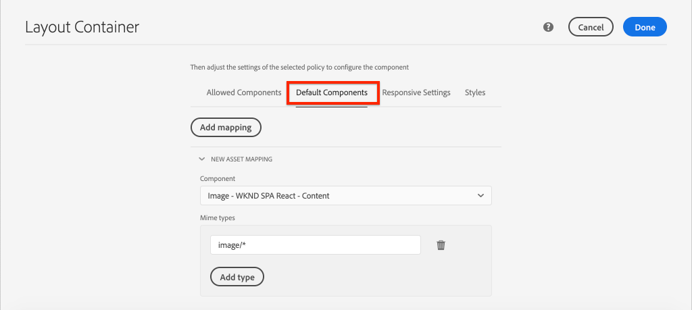

# Mappare i componenti dell’applicazione a pagina singola ai componenti di AEM {#map-components}

{{spa-editor-deprecation}}

Scopri come mappare i componenti React ai componenti Adobe Experience Manager (AEM) con AEM SPA Editor JS SDK. La mappatura dei componenti consente agli utenti di apportare aggiornamenti dinamici ai componenti delle applicazioni a pagina singola nell’Editor delle applicazioni a pagina singola di AEM, in modo simile all’authoring tradizionale AEM.

Questo capitolo approfondisce l’analisi dell’API del modello JSON AEM e di come il contenuto JSON esposto da un componente AEM può essere inserito automaticamente in un componente React come prop.

## Obiettivo

1. Scopri come mappare i componenti di AEM ai componenti SPA.
1. Esamina il modo in cui un componente React utilizza le proprietà dinamiche passate da AEM.
1. Scopri come utilizzare [React AEM Core Components](https://github.com/adobe/aem-react-core-wcm-components-examples) pronto all&#39;uso.

## Cosa verrà creato

In questo capitolo viene verificato il modo in cui il componente SPA `Text` fornito è mappato al componente `Text` di AEM. I componenti core React come il componente `Image` per applicazioni a pagina singola vengono utilizzati nell&#39;applicazione a pagina singola e creati in AEM. Le funzionalità predefinite dei criteri **Contenitore di layout** e **Editor modelli** consentono inoltre di creare una visualizzazione con un aspetto leggermente più variabile.


## Prerequisiti

Esaminare gli strumenti e le istruzioni necessari per configurare un [ambiente di sviluppo locale](overview.md#local-dev-environment). Questo capitolo è una continuazione del capitolo [Integrare l&#39;applicazione a pagina singola](integrate-spa.md), tuttavia seguire tutto ciò che ti serve è un progetto AEM abilitato per l&#39;applicazione a pagina singola.

## Approccio di mappatura

Il concetto di base è quello di mappare un componente SPA a un componente AEM. I componenti AEM, esegui lato server, esportano contenuti come parte dell’API del modello JSON. Il contenuto JSON viene utilizzato dall’applicazione a pagina singola, che esegue sul lato client nel browser. Viene creata una mappatura 1:1 tra i componenti SPA e un componente AEM.


*Panoramica di alto livello sulla mappatura di un componente AEM a un componente React*

## Controllare il componente Testo

L&#39;[Archetipo progetto AEM](https://github.com/adobe/aem-project-archetype) fornisce un componente `Text` mappato al [Componente testo](https://experienceleague.adobe.com/docs/experience-manager-core-components/using/components/text.html) di AEM. Questo è un esempio di un componente **content**, in quanto esegue il rendering di *content* da AEM.

Vediamo come funziona il componente.

### Verifica il modello JSON

1. Prima di passare al codice SPA, è importante comprendere il modello JSON fornito da AEM. Passa alla [libreria dei componenti core](https://www.aemcomponents.dev/content/core-components-examples/library/core-content/text.html) e visualizza la pagina per il componente Testo. La libreria dei componenti core fornisce esempi di tutti i componenti core di AEM.
1. Selezionare la scheda **JSON** per uno degli esempi:

   

   Dovrebbero essere visualizzate tre proprietà: `text`, `richText` e `:type`.

   `:type` è una proprietà riservata che elenca `sling:resourceType` (o percorso) del componente AEM. Il valore di `:type` è ciò che viene utilizzato per mappare il componente AEM al componente SPA.

   `text` e `richText` sono proprietà aggiuntive esposte al componente SPA.

1. Visualizza l&#39;output JSON in [http://localhost:4502/content/wknd-spa-react/us/en.model.json](http://localhost:4502/content/wknd-spa-react/us/en.model.json). Dovresti essere in grado di trovare una voce simile a:

   ```json
   "text": {
       "id": "text-a647cec03a",
       "text": "<p>Hello World! Updated content!</p>\r\n",
       "richText": true,
       ":type": "wknd-spa-react/components/text",
       "dataLayer": {}
      }
   ```

### Controllare il componente Text SPA

1. Nell’IDE che preferisci, apri il progetto AEM per l’applicazione a pagina singola. Espandere il modulo `ui.frontend` e aprire il file `Text.js` in `ui.frontend/src/components/Text/Text.js`.

1. La prima area da controllare è `class Text` a ~riga 40:

   ```js
   class Text extends Component {
   
       get richTextContent() {
           return (<div
                   id={extractModelId(this.props.cqPath)}
                   data-rte-editelement
                   dangerouslySetInnerHTML={{__html: DOMPurify.sanitize(this.props.text)}} />
                   );
       }
   
       get textContent() {
           return <div>{this.props.text}</div>;
       }
   
       render() {
           return this.props.richText ? this.richTextContent : this.textContent;
       }
   }
   ```

   `Text` è un componente React standard. Il componente utilizza `this.props.richText` per determinare se il contenuto da riprodurre sarà in formato Rich Text o testo normale. Il &quot;contenuto&quot; effettivo utilizzato proviene da `this.props.text`.

   Per evitare un potenziale attacco XSS, al testo RTF viene applicato l&#39;escape tramite `DOMPurify` prima di utilizzare [dangerouslySetInnerHTML](https://reactjs.org/docs/dom-elements.html#dangerouslysetinnerhtml) per il rendering del contenuto. Richiama le proprietà `richText` e `text` dal modello JSON in precedenza nell&#39;esercizio.

1. Apri `ui.frontend/src/components/import-components.js`, quindi dai un&#39;occhiata a `TextEditConfig` alla ~riga 86:

   ```js
   const TextEditConfig = {
   emptyLabel: 'Text',
   
       isEmpty: function(props) {
           return !props || !props.text || props.text.trim().length < 1;
       }
   };
   ```

   Il codice di cui sopra è responsabile di determinare quando eseguire il rendering del segnaposto nell’ambiente di authoring di AEM. Se il metodo `isEmpty` restituisce **true**, viene eseguito il rendering del segnaposto.

1. Infine, dare un&#39;occhiata alla chiamata `MapTo` a ~riga 94:

   ```js
   export default MapTo('wknd-spa-react/components/text')(LazyTextComponent, TextEditConfig);
   ```

   `MapTo` è fornito da AEM SPA Editor JS SDK (`@adobe/aem-react-editable-components`). Il percorso `wknd-spa-react/components/text` rappresenta `sling:resourceType` del componente AEM. Questo percorso viene confrontato con `:type` esposto dal modello JSON osservato in precedenza. `MapTo` si occupa di analizzare la risposta del modello JSON e di passare i valori corretti come `props` al componente SPA.

   La definizione del componente AEM `Text` è disponibile in `ui.apps/src/main/content/jcr_root/apps/wknd-spa-react/components/text`.

## Utilizzare i componenti core React

[Componenti AEM WCM - Implementazione React Core](https://github.com/adobe/aem-react-core-wcm-components-base) e [Componenti AEM WCM - Editor SPA - Implementazione React Core](https://github.com/adobe/aem-react-core-wcm-components-spa). Si tratta di un set di componenti riutilizzabili dell’interfaccia utente mappati su componenti AEM predefiniti. La maggior parte dei progetti può riutilizzare questi componenti come punto di partenza per la propria implementazione.

1. Nel codice del progetto apri il file `import-components.js` in `ui.frontend/src/components`.
Questo file importa tutti i componenti SPA mappati ai componenti AEM. Data la natura dinamica dell’implementazione dell’editor di applicazioni a pagina singola, è necessario fare riferimento esplicito a qualsiasi componente di applicazioni a pagina singola associato ai componenti Author di AEM. Questo consente all’autore di AEM di scegliere di utilizzare un componente in qualsiasi posizione all’interno dell’applicazione.
1. Le seguenti istruzioni di importazione includono i componenti SPA scritti nel progetto:

   ```js
   import './Page/Page';
   import './Text/Text';
   import './Container/Container';
   import './ExperienceFragment/ExperienceFragment';
   ```

1. Ci sono molti altri `imports` da `@adobe/aem-core-components-react-spa` e `@adobe/aem-core-components-react-base`. Questi componenti importano i componenti core React e li rendono disponibili nel progetto corrente. Questi vengono quindi mappati a componenti AEM specifici del progetto utilizzando `MapTo`, come nell&#39;esempio precedente del componente `Text`.

### Aggiornare i criteri di AEM

I criteri sono una funzione dei modelli di AEM e offrono agli sviluppatori e agli utenti avanzati un controllo granulare sui componenti disponibili per l’utilizzo. I componenti core React sono inclusi nel codice SPA, ma devono essere abilitati tramite un criterio prima di poter essere utilizzati nell’applicazione.

1. Dalla schermata iniziale di AEM, passa a **Strumenti** > **Modelli** > **[Reazione SPA WKND](http://localhost:4502/libs/wcm/core/content/sites/templates.html/conf/wknd-spa-react)**.

1. Seleziona e apri il modello **Pagina applicazione a pagina singola** per la modifica.

1. Seleziona il **Contenitore di layout** e fai clic sulla relativa icona **criterio** per modificare il criterio:

   

1. In **Componenti consentiti** > **Reazione SPA WKND - Contenuto** > seleziona **Immagine**, **Teaser** e **Titolo**.

   

   In **Componenti predefiniti** > **Aggiungi mappatura** e scegli **Immagine - Reazione SPA WKND - Contenuto** componente:

   

   Immetti un tipo **mime** di `image/*`.

   Fai clic su **Fine** per salvare gli aggiornamenti dei criteri.

1. Nel **Contenitore di layout** fare clic sull&#39;icona **criterio** per il componente **Testo**.

   Crea un nuovo criterio denominato **Testo SPA WKND**. In **Plug-in** > **Formattazione** > seleziona tutte le caselle per abilitare opzioni di formattazione aggiuntive:

   

   In **Plug-in** > **Stili di paragrafo** > seleziona la casella per **Abilitare gli stili di paragrafo**:

   

   Fai clic su **Fine** per salvare l&#39;aggiornamento dei criteri.

### Contenuto autore

1. Passa alla **home page** [http://localhost:4502/editor.html/content/wknd-spa-react/us/en/home.html](http://localhost:4502/editor.html/content/wknd-spa-react/us/en/home.html).

1. Ora dovresti essere in grado di utilizzare i componenti aggiuntivi **Immagine**, **Teaser** e **Titolo** nella pagina.

   

1. Dovresti anche poter modificare il componente `Text` e aggiungere altri stili di paragrafo in modalità **schermo intero**.

   

1. Dovresti anche essere in grado di trascinare e rilasciare un&#39;immagine da **Asset Finder**:

   

1. Esperienza con i componenti **Title** e **Teaser**.

1. Aggiungi le tue immagini tramite [AEM Assets](http://localhost:4502/assets.html/content/dam) o installa la base di codice completata per il [sito di riferimento WKND standard](https://github.com/adobe/aem-guides-wknd/releases/latest). Il [sito di riferimento WKND](https://github.com/adobe/aem-guides-wknd/releases/latest) include molte immagini che possono essere riutilizzate nell&#39;applicazione a pagina singola WKND. È possibile installare il pacchetto utilizzando [Gestione pacchetti di AEM](http://localhost:4502/crx/packmgr/index.jsp).

   

## Ispezionare il contenitore di layout

Il supporto per **Contenitore di layout** viene fornito automaticamente da AEM SPA Editor SDK. Il **contenitore di layout**, come indicato dal nome, è un componente **contenitore**. I componenti contenitore sono componenti che accettano strutture JSON che rappresentano *altri* componenti e ne creano un&#39;istanza dinamica.

Esaminiamo ulteriormente il Contenitore di layout.

1. In un browser passa a [http://localhost:4502/content/wknd-spa-react/us/en.model.json](http://localhost:4502/content/wknd-spa-react/us/en.model.json)

   

   Il componente **Contenitore di layout** ha `sling:resourceType` di `wcm/foundation/components/responsivegrid` ed è riconosciuto dall&#39;editor SPA tramite la proprietà `:type`, proprio come i componenti `Text` e `Image`.

   Le stesse funzionalità di ridimensionamento di un componente mediante la [modalità Layout](https://experienceleague.adobe.com/docs/experience-manager-65/authoring/siteandpage/responsive-layout.html#defining-layouts-layout-mode) sono disponibili con l&#39;editor SPA.

2. Torna a [http://localhost:4502/editor.html/content/wknd-spa-react/us/en/home.html](http://localhost:4502/editor.html/content/wknd-spa-react/us/en/home.html). Aggiungi altri componenti **Immagine** e prova a ridimensionarli utilizzando l&#39;opzione **Layout**:

   

3. Riapri il modello JSON [http://localhost:4502/content/wknd-spa-react/us/en.model.json](http://localhost:4502/content/wknd-spa-react/us/en.model.json) e osserva `columnClassNames` come parte del JSON:

   

   Il nome di classe `aem-GridColumn--default--4` indica che il componente deve avere una larghezza di 4 colonne in base a una griglia a 12 colonne. Ulteriori dettagli sulla [griglia reattiva sono disponibili qui](https://adobe-marketing-cloud.github.io/aem-responsivegrid/).

4. Tornare all&#39;IDE e nel modulo `ui.apps` è presente una libreria lato client definita in `ui.apps/src/main/content/jcr_root/apps/wknd-spa-react/clientlibs/clientlib-grid`. Aprire il file `less/grid.less`.

   Questo file determina i punti di interruzione (`default`, `tablet` e `phone`) utilizzati dal **Contenitore di layout**. Questo file è stato progettato per essere personalizzato in base alle specifiche del progetto. Attualmente i punti di interruzione sono impostati su `1200px` e `768px`.

5. Dovresti essere in grado di utilizzare le funzionalità reattive e i criteri Rich Text aggiornati del componente `Text` per creare una visualizzazione simile alla seguente:

   

## Congratulazioni. {#congratulations}

Congratulazioni, hai imparato a mappare i componenti SPA ai componenti AEM e hai utilizzato i componenti core React. Hai anche la possibilità di esplorare le funzionalità reattive del **Contenitore di layout**.

### Passaggi successivi {#next-steps}

[Navigazione e indirizzamento](navigation-routing.md) - Scopri come è possibile supportare più visualizzazioni nell&#39;applicazione a pagina singola effettuando il mapping alle pagine di AEM con l&#39;editor di applicazioni a pagina singola SDK. La navigazione dinamica viene implementata utilizzando React Router e React Core Components.

## (Bonus) Mantenere le configurazioni per il controllo del codice sorgente {#bonus-configs}

In molti casi, soprattutto all’inizio di un progetto AEM, è utile mantenere le configurazioni, come i modelli e i criteri dei contenuti correlati, nel controllo del codice sorgente. In questo modo tutti gli sviluppatori lavorano sullo stesso set di contenuti e configurazioni e possono garantire ulteriore coerenza tra gli ambienti. Quando un progetto raggiunge un certo livello di maturità, la pratica di gestione dei modelli può essere affidata a uno speciale gruppo di utenti esperti.

I passaggi successivi verranno eseguiti utilizzando l&#39;IDE del codice di Visual Studio e [VSCode AEM Sync](https://marketplace.visualstudio.com/items?itemName=yamato-ltd.vscode-aem-sync), ma potrebbero essere eseguiti utilizzando qualsiasi strumento e IDE configurato per **richiamare** o **importare** contenuto da un&#39;istanza locale di AEM.

1. Nell&#39;IDE di Visual Studio Code verificare che sia installato **VSCode AEM Sync** tramite l&#39;estensione Marketplace:

   

2. Espandi il modulo **ui.content** in Esplora progetti e passa a `/conf/wknd-spa-react/settings/wcm/templates`.

3. **Fare clic con il pulsante destro del mouse** sulla cartella `templates` e selezionare **Importa da AEM Server**:

   

4. Ripeti i passaggi per importare il contenuto, ma seleziona la cartella **criteri** che si trova in `/conf/wknd-spa-react/settings/wcm/templates/policies`.

5. Controllare il file `filter.xml` che si trova in `ui.content/src/main/content/META-INF/vault/filter.xml`.

   ```xml
   <!--ui.content filter.xml-->
   <?xml version="1.0" encoding="UTF-8"?>
    <workspaceFilter version="1.0">
        <filter root="/conf/wknd-spa-react" mode="merge"/>
        <filter root="/content/wknd-spa-react" mode="merge"/>
        <filter root="/content/dam/wknd-spa-react" mode="merge"/>
        <filter root="/content/experience-fragments/wknd-spa-react" mode="merge"/>
    </workspaceFilter>
   ```

   Il file `filter.xml` è responsabile dell&#39;identificazione dei percorsi dei nodi installati con il pacchetto. Osserva `mode="merge"` su ciascuno dei filtri che indica che il contenuto esistente non verrà modificato, ma che verrà aggiunto solo il nuovo contenuto. Poiché gli autori di contenuto potrebbero aggiornare questi percorsi, è importante che una distribuzione del codice **non** sovrascriva il contenuto. Per ulteriori informazioni sull&#39;utilizzo degli elementi del filtro, vedere la [documentazione di FileVault](https://jackrabbit.apache.org/filevault/filter.html).

   Confrontare `ui.content/src/main/content/META-INF/vault/filter.xml` e `ui.apps/src/main/content/META-INF/vault/filter.xml` per comprendere i diversi nodi gestiti da ciascun modulo.

## (Bonus) Creare un componente immagine personalizzato {#bonus-image}

I componenti core React hanno già fornito un componente immagine SPA. Tuttavia, se desideri ulteriore pratica, crea la tua implementazione React che viene mappata sul [componente immagine](https://experienceleague.adobe.com/docs/experience-manager-core-components/using/components/image.html?lang=it) di AEM. Il componente `Image` è un altro esempio di un componente **content**.

### Ispezionare JSON

Prima di passare al codice SPA, controlla il modello JSON fornito da AEM.

1. Passa a [Esempi di immagini nella libreria dei componenti core](https://www.aemcomponents.dev/content/core-components-examples/library/core-content/image.html).

   

   Le proprietà di `src`, `alt` e `title` sono utilizzate per popolare il componente SPA `Image`.

   >[!NOTE]
   >
   > Sono esposte altre proprietà Image (`lazyEnabled`, `widths`) che consentono a uno sviluppatore di creare un componente adattivo e a caricamento lento. Il componente creato in questa esercitazione è semplice e **non** utilizza queste proprietà avanzate.

### Implementare il componente Immagine

1. Creare una nuova cartella denominata `Image` in `ui.frontend/src/components`.
1. Nella cartella `Image` creare un nuovo file denominato `Image.js`.

   

1. Aggiungi le seguenti istruzioni `import` a `Image.js`:

   ```js
   import React, {Component} from 'react';
   import {MapTo} from '@adobe/aem-react-editable-components';
   ```

1. Quindi aggiungi `ImageEditConfig` per determinare quando visualizzare il segnaposto in AEM:

   ```js
   export const ImageEditConfig = {
   
       emptyLabel: 'Image',
   
       isEmpty: function(props) {
           return !props || !props.src || props.src.trim().length < 1;
       }
   };
   ```

   Il segnaposto verrà visualizzato se la proprietà `src` non è impostata.

1. Implementazione successiva della classe `Image`:

   ```js
    export default class Image extends Component {
   
       get content() {
           return ;
       }
   
       render() {
           if(ImageEditConfig.isEmpty(this.props)) {
               return null;
           }
   
           return (
                   <div className="Image">
                       {this.content}
                   </div>
           );
       }
   }
   ```

   Il codice riportato sopra eseguirà il rendering di `` in base alle proprietà `src`, `alt` e `title` trasmesse dal modello JSON.

1. Aggiungi il codice `MapTo` per mappare il componente React al componente AEM:

   ```js
   MapTo('wknd-spa-react/components/image')(Image, ImageEditConfig);
   ```

   La stringa `wknd-spa-react/components/image` corrisponde alla posizione del componente AEM in `ui.apps` in: `ui.apps/src/main/content/jcr_root/apps/wknd-spa-react/components/image`.

1. Creare un nuovo file denominato `Image.css` nella stessa directory e aggiungere quanto segue:

   ```scss
   .Image-src {
       margin: 1rem 0;
       width: 100%;
       border: 0;
   }
   ```

1. In `Image.js` aggiungere un riferimento al file nella parte superiore sotto le istruzioni `import`:

   ```js
   import React, {Component} from 'react';
   import {MapTo} from '@adobe/aem-react-editable-components';
   
   require('./Image.css');
   ```

1. Aprire il file `ui.frontend/src/components/import-components.js` e aggiungere un riferimento al nuovo componente `Image`:

   ```js
   import './Page/Page';
   import './Text/Text';
   import './Container/Container';
   import './ExperienceFragment/ExperienceFragment';
   import './Image/Image'; //add reference to Image component
   ```

1. In `import-components.js` commento l&#39;immagine del componente core React:

   ```js
   //MapTo('wknd-spa-react/components/image')(ImageV2, {isEmpty: ImageV2IsEmptyFn});
   ```

   In questo modo verrà utilizzato il componente immagine personalizzato.

1. Dalla directory principale del progetto, distribuisci il codice SPA in AEM utilizzando Maven:

   ```shell
   $ cd aem-guides-wknd-spa.react
   $ mvn clean install -PautoInstallSinglePackage
   ```

1. Ispeziona l’applicazione a pagina singola in AEM. Tutti i componenti Immagine sulla pagina continueranno a funzionare. Ispeziona l’output renderizzato e dovresti visualizzare il markup per il componente immagine personalizzato anziché il componente core React.

   *Markup del componente immagine personalizzato*

   ```html
   <div class="Image">
       
   </div>
   ```

   *Markup immagine componente core React*

   ```html
   <div class="cmp-image cq-dd-image">
       
   </div>
   ```

   Questa è una buona introduzione per estendere e implementare i propri componenti.
