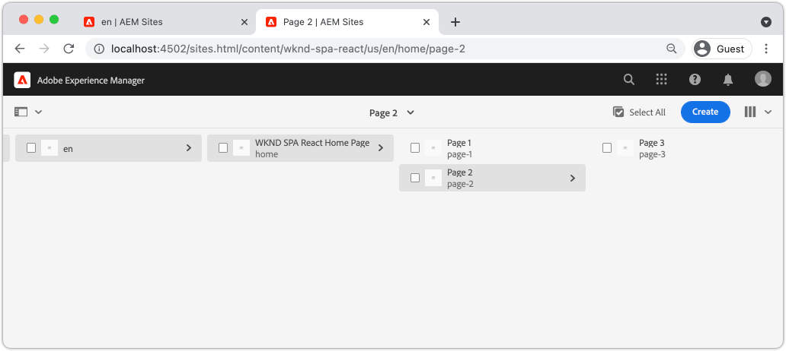

# Aggiungi navigazione e indirizzamento {#navigation-routing}

Scopri come è possibile supportare più visualizzazioni nel SPA mappando le pagine AEM con l’SDK dell’editor SPA. La navigazione dinamica è implementata utilizzando i componenti core React Router e React.

## Obiettivo

1. Comprendere le opzioni di indirizzamento del modello SPA disponibili quando si utilizza l&#39;editor SPA.
1. Scopri come utilizzare [React Router](https://reacttraining.com/react-router/) per navigare tra diverse viste del SPA.
1. Utilizza AEM componenti core React per implementare una navigazione dinamica basata sulla gerarchia delle pagine AEM.

## Cosa verrà creato

Questo capitolo aggiunge la navigazione a un SPA in AEM. Il menu di navigazione sarà guidato dalla gerarchia di pagine AEM e utilizzerà il modello JSON fornito dal [componente di base di navigazione](https://experienceleague.adobe.com/docs/experience-manager-core-components/using/components/navigation.html).


## Prerequisiti

Rivedi gli strumenti e le istruzioni necessari per configurare un [ambiente di sviluppo locale](overview.md#local-dev-environment). Questo capitolo è una continuazione del capitolo [Mappa componenti](map-components.md) , tuttavia per seguire tutto ciò di cui hai bisogno è un progetto AEM abilitato per SPA distribuito in un&#39;istanza AEM locale.

## Aggiungi la navigazione al modello {#add-navigation-template}

1. Apri un browser e accedi a AEM, [http://localhost:4502/](Http://localhost:4502/). La base di codice iniziale deve essere già distribuita.
1. Passa al **SPA modello di pagina**: [http://localhost:4502/editor.html/conf/wknd-spa-react/settings/wcm/templates/spa-page-template/structure.html](http://localhost:4502/editor.html/conf/wknd-spa-react/settings/wcm/templates/spa-page-template/structure.html).
1. Seleziona il contenitore di layout principale più esterno **e fai clic sulla relativa icona** Policy **.** Fai attenzione a **non** per selezionare il **Contenitore di layout** non bloccato per l’authoring.

   

1. Crea un nuovo criterio denominato **Struttura SPA**:

   

   In **Componenti consentiti** > **Generale** > seleziona il componente **Contenitore di layout** .

   In **Componenti consentiti** > **WKND SPA REACT - STRUCTURE** > seleziona il componente **Navigazione** :

   

   In **Componenti consentiti** > **WKND SPA REACT - Contenuto** > seleziona i componenti **Immagine** e **Testo** . Dovresti aver selezionato 4 componenti totali.

   Fai clic su **Fine** per salvare le modifiche.

1. Aggiorna la pagina e aggiungi il componente **Navigazione** sopra il **Contenitore di layout** sbloccato:

   

1. Seleziona il componente **Navigazione** e fai clic sulla relativa icona **Criterio** per modificare il criterio.
1. Crea un nuovo criterio con un **Titolo criterio** di **SPA navigazione**.

   Sotto **Proprietà**:

   * Impostare **Radice di navigazione** su `/content/wknd-spa-react/us/en`.
   * Imposta **Escludi livelli radice** su **1**.
   * Deseleziona **Raccogli tutte le pagine figlie**.
   * Impostare **Profondità struttura di navigazione** su **3**.

   

   Questo raccoglierà i 2 livelli di navigazione in profondità sotto `/content/wknd-spa-react/us/en`.

1. Dopo aver salvato le modifiche, dovresti vedere il popolato `Navigation` come parte del modello:

   

## Crea pagine figlie

Quindi, crea altre pagine in AEM che fungeranno da viste diverse nel SPA. Esamineremo anche la struttura gerarchica del modello JSON fornito da AEM.

1. Passa alla console **Sites** : [http://localhost:4502/sites.html/content/wknd-spa-react/us/en/home](http://localhost:4502/sites.html/content/wknd-spa-react/us/en/home). Seleziona **WKND SPA React Home Page** e fai clic su **Crea** > **Pagina**:

   

1. In **Modello** selezionare **SPA Pagina**. Sotto **Proprietà** immetti **Pagina 1** come nome **Titolo** e **pagina-1**.

   

   Fai clic su **Crea** e, nella finestra di dialogo a comparsa, fai clic su **Apri** per aprire la pagina nell&#39;editor di SPA AEM.

1. Aggiungi un nuovo componente **Testo** al **Contenitore di layout** principale. Modifica il componente e immetti il testo: **Pagina 1** utilizzando l’editor Rich Text e l’elemento **H2**.

   

   Puoi aggiungere altri contenuti, come un’immagine.

1. Torna alla console AEM Sites e ripeti i passaggi precedenti, creando una seconda pagina denominata **Pagina 2** come pari a **Pagina 1**.
1. Infine, crea una terza pagina, **Pagina 3** ma come **figlio** di **Pagina 2**. Una volta completata la gerarchia del sito, avrà un aspetto simile al seguente:

   

1. Il componente Navigazione può ora essere utilizzato per passare a diverse aree del SPA.

   

1. Apri la pagina all’esterno dell’Editor di AEM: [http://localhost:4502/content/wknd-spa-react/us/en/home.html](http://localhost:4502/content/wknd-spa-react/us/en/home.html). Utilizza il componente **Navigazione** per passare a diverse visualizzazioni dell&#39;app.

1. Utilizza gli strumenti di sviluppo del browser in uso per controllare le richieste di rete durante la navigazione. Le schermate seguenti vengono acquisite dal browser Google Chrome.

   

   Dopo il caricamento della pagina iniziale, la navigazione successiva non causa un aggiornamento completo della pagina e il traffico di rete viene ridotto al minimo quando si torna alle pagine visitate in precedenza.

## Modello JSON della pagina Gerarchia {#hierarchy-page-json-model}

Quindi, controlla il modello JSON che guida l’esperienza con più visualizzazioni del SPA.

1. In una nuova scheda, apri l’API del modello JSON fornita da AEM: [http://localhost:4502/content/wknd-spa-react/us/en.model.json](http://localhost:4502/content/wknd-spa-react/us/en.model.json). Potrebbe essere utile utilizzare un&#39;estensione del browser per formattare il JSON](https://chrome.google.com/webstore/detail/json-formatter/bcjindcccaagfpapjjmafapmmgkkhgoa).[

   Questo contenuto JSON viene richiesto quando il SPA viene caricato per la prima volta. La struttura esterna si presenta come segue:

   ```json
   {
   "language": "en",
   "title": "en",
   "templateName": "spa-app-template",
   "designPath": "/libs/settings/wcm/designs/default",
   "cssClassNames": "spa page basicpage",
   ":type": "wknd-spa-react/components/spa",
   ":items": {},
   ":itemsOrder": [],
   ":hierarchyType": "page",
   ":path": "/content/wknd-spa-react/us/en",
   ":children": {
      "/content/wknd-spa-react/us/en/home": {},
      "/content/wknd-spa-react/us/en/home/page-1": {},
      "/content/wknd-spa-react/us/en/home/page-2": {},
      "/content/wknd-spa-react/us/en/home/page-2/page-3": {}
      }
   }
   ```

   Alla voce `:children` dovrebbe essere visualizzata una voce per ciascuna delle pagine create. Il contenuto per tutte le pagine si trova in questa richiesta JSON iniziale. Con il routing di navigazione, le visualizzazioni successive del SPA verranno caricate rapidamente, poiché il contenuto è già disponibile sul lato client.

   Non è saggio caricare **ALL** del contenuto di un SPA nella richiesta JSON iniziale, in quanto ciò rallenterebbe il caricamento della pagina iniziale. Ora esaminiamo come viene raccolta la profondità gerarchica delle pagine.

1. Passa al modello **SPA Root** in: [http://localhost:4502/editor.html/conf/wknd-spa-react/settings/wcm/templates/spa-app-template/structure.html](http://localhost:4502/editor.html/conf/wknd-spa-react/settings/wcm/templates/spa-app-template/structure.html).

   Fai clic sul menu **Proprietà pagina** > **Criterio pagina**:

   

1. Il modello **SPA Root** dispone di una scheda **Struttura gerarchica** aggiuntiva per controllare il contenuto JSON raccolto. La **Profondità struttura** determina la profondità nella gerarchia del sito per la raccolta delle pagine figlie sotto la **radice**. È inoltre possibile utilizzare il campo **Pattern struttura** per filtrare ulteriori pagine in base a un’espressione regolare.

   Aggiorna **Profondità struttura** a **2**:

   

   Fai clic su **Fine** per salvare le modifiche al criterio.

1. Riapri il modello JSON [http://localhost:4502/content/wknd-spa-react/us/en.model.json](http://localhost:4502/content/wknd-spa-react/us/en.model.json).

   ```json
   {
   "language": "en",
   "title": "en",
   "templateName": "spa-app-template",
   "designPath": "/libs/settings/wcm/designs/default",
   "cssClassNames": "spa page basicpage",
   ":type": "wknd-spa-react/components/spa",
   ":items": {},
   ":itemsOrder": [],
   ":hierarchyType": "page",
   ":path": "/content/wknd-spa-react/us/en",
   ":children": {
      "/content/wknd-spa-react/us/en/home": {},
      "/content/wknd-spa-react/us/en/home/page-1": {},
      "/content/wknd-spa-react/us/en/home/page-2": {}
      }
   }
   ```

   Nota che il percorso **Pagina 3** è stato rimosso: `/content/wknd-spa-react/us/en/home/page-2/page-3` dal modello JSON iniziale. Questo perché **Pagina 3** si trova a un livello 3 nella gerarchia e abbiamo aggiornato il criterio per includere solo il contenuto a una profondità massima di livello 2.

1. Riapri la home page di SPA: [http://localhost:4502/content/wknd-spa-react/us/en/home.html](http://localhost:4502/content/wknd-spa-react/us/en/home.html) e apri gli strumenti per sviluppatori del browser.

   Aggiorna la pagina e dovresti vedere la richiesta XHR a `/content/wknd-spa-react/us/en.model.json`, che è la radice SPA. Solo tre pagine figlie sono incluse in base alla configurazione della profondità gerarchica del modello SPA Root creato in precedenza nell’esercitazione. Questo non include **Pagina 3**.

   

1. Con gli strumenti per sviluppatori aperti, utilizza il componente `Navigation` per passare direttamente a **Pagina 3**:

   Tieni presente che viene effettuata una nuova richiesta XHR a: `/content/wknd-spa-react/us/en/home/page-2/page-3.model.json`

   

   Il AEM Model Manager è consapevole del fatto che il contenuto JSON **Pagina 3** non è disponibile e attiva automaticamente la richiesta XHR aggiuntiva.

1. Sperimenta i collegamenti profondi navigando direttamente in: [http://localhost:4502/content/wknd-spa-react/us/en/home/page-2.html](http://localhost:4502/content/wknd-spa-react/us/en/home/page-2.html). Osserva anche che il pulsante Indietro del browser continua a funzionare.

## Routing React di Inspect  {#react-routing}

La navigazione e il routing sono implementati con [React Router](https://reactrouter.com/). React Router è una raccolta di componenti di navigazione per le applicazioni React. [AEM i ](https://github.com/adobe/aem-react-core-wcm-components-base) componenti core React utilizzano le funzioni di React Router per implementare il componente  **** Navigazione utilizzato nei passaggi precedenti.

Quindi, controlla come React Router è integrato con il SPA e prova utilizzando il componente [Link](https://reactrouter.com/web/api/Link) del Router React.

1. Nell’IDE, apri il file `index.js` in `ui.frontend/src/index.js`.

   ```js
   /* index.js */
   import { Router } from 'react-router-dom';
   ...
   ...
    ModelManager.initialize().then(pageModel => {
       const history = createBrowserHistory();
       render(
       <Router history={history}>
           <App
           history={history}
           cqChildren={pageModel[Constants.CHILDREN_PROP]}
           cqItems={pageModel[Constants.ITEMS_PROP]}
           cqItemsOrder={pageModel[Constants.ITEMS_ORDER_PROP]}
           cqPath={pageModel[Constants.PATH_PROP]}
           locationPathname={window.location.pathname}
           />
       </Router>,
       document.getElementById('spa-root')
       );
   });
   ```

   Tieni presente che il `App` viene racchiuso nel componente `Router` da [React Router](https://reacttraining.com/react-router/). Il `ModelManager`, fornito dall’SDK JS dell’editor SPA AEM, aggiunge i percorsi dinamici alle pagine AEM in base all’API del modello JSON.

1. Apri il file `Page.js` in `ui.frontend/src/components/Page/Page.js`

   ```js
   class AppPage extends Page {
     get containerProps() {
       let attrs = super.containerProps;
       attrs.className =
         (attrs.className || '') + ' page ' + (this.props.cssClassNames || '');
       return attrs;
     }
   }
   
   export default MapTo('wknd-spa-react/components/page')(
     withComponentMappingContext(withRoute(AppPage))
   );
   ```

   Il componente `Page` SPA utilizza la funzione `MapTo` per mappare **Pagine** in AEM a un componente SPA corrispondente. L&#39;utility `withRoute` consente di indirizzare dinamicamente l&#39;SPA alla pagina secondaria AEM appropriata in base alla proprietà `cqPath` .

1. Apri il componente `Header.js` in `ui.frontend/src/components/Header/Header.js`.
1. Aggiorna `Header` per racchiudere il tag `<h1>` in un [Link](https://reactrouter.com/web/api/Link) alla home page:

   ```diff
     //Header.js
     import React, {Component} from 'react';
   + import {Link} from 'react-router-dom';
     require('./Header.css');
   
   export default class Header extends Component {
   
       render() {
           return (
               <header className="Header">
               <div className="Header-container">
   +              <Link to="/content/wknd-spa-react/us/en/home.html">
                       <h1>WKND</h1>
   +              </Link>
               </div>
               </header>
           );
       }
   ```

   Invece di utilizzare un tag di ancoraggio `<a>` predefinito, utilizziamo `<Link>` fornito da React Router. Se il percorso `to=` punta a un percorso valido, il SPA passa a tale percorso e **non** esegue un aggiornamento completo della pagina. In questo caso è sufficiente codificare il collegamento alla home page per illustrare l’utilizzo di `Link`.

1. Aggiorna il test in `App.test.js` all&#39;indirizzo `ui.frontend/src/App.test.js`.

   ```diff
   + import { BrowserRouter as Router } from 'react-router-dom';
     import App from './App';
   
     it('renders without crashing', () => {
       const div = document.createElement('div');
   -   ReactDOM.render(<App />, div);
   +   ReactDOM.render(<Router><App /></Router>, div);
     });
   ```

   Poiché utilizziamo le funzioni di React Router all’interno di un componente statico a cui si fa riferimento in `App.js`, è necessario aggiornare l’unità di prova per renderne conto.

1. Apri un terminale, accedi alla directory principale del progetto e implementa il progetto per AEM utilizzando le tue competenze Maven:

   ```shell
   $ cd aem-guides-wknd-spa.react
   $ mvn clean install -PautoInstallSinglePackage
   ```

1. Passa a una delle pagine del SPA in AEM: [http://localhost:4502/content/wknd-spa-react/us/en/home/page-1.html](http://localhost:4502/content/wknd-spa-react/us/en/home/page-1.html)

   Invece di utilizzare il componente `Navigation` per navigare, utilizza il collegamento in `Header`.

   

   Osserva che è attivato un aggiornamento completo della pagina **non** e che il ciclo di SPA funziona.

1. Facoltativamente, prova con il file `Header.js` utilizzando un tag di ancoraggio standard `<a>`:

   ```js
   <a href="/content/wknd-spa-react/us/en/home.html">
       <h1>WKND</h1>
   </a>
   ```

   Questo aiuta a illustrare la differenza tra il routing SPA e i normali collegamenti alle pagine web.

## Congratulazioni! {#congratulations}

Congratulazioni, hai imparato come è possibile supportare più visualizzazioni nel SPA mappando le pagine AEM con l’SDK dell’editor SPA. La navigazione dinamica è stata implementata utilizzando React Router e aggiunta al componente `Header` .
