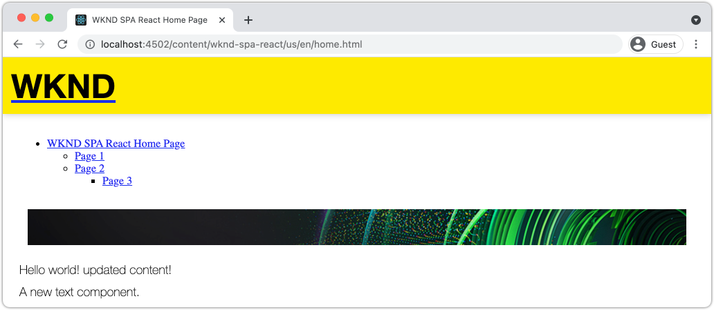

# Aggiungi navigazione e indirizzamento {#navigation-routing}

Scopri come è possibile supportare più visualizzazioni nel SPA mappando le pagine AEM con l’SDK dell’editor SPA. La navigazione dinamica è implementata utilizzando i componenti core React Router e React.

## Obiettivo

1. Comprendere le opzioni di indirizzamento del modello SPA disponibili quando si utilizza l&#39;editor SPA.
1. Scopri come utilizzare [React Router](https://reacttraining.com/react-router/) per spostarsi tra le diverse viste della SPA.
1. Utilizza AEM componenti core React per implementare una navigazione dinamica basata sulla gerarchia delle pagine AEM.

## Cosa verrà creato

Questo capitolo aggiunge la navigazione a un SPA in AEM. Il menu di navigazione è guidato dalla gerarchia di pagine AEM e utilizzerà il modello JSON fornito dalla [Componente core di navigazione](https://experienceleague.adobe.com/docs/experience-manager-core-components/using/components/navigation.html).



## Prerequisiti

Rivedere gli strumenti e le istruzioni necessari per la configurazione di un [ambiente di sviluppo locale](overview.md#local-dev-environment). Il presente capitolo costituisce la continuazione del [Componenti mappa](map-components.md) capitolo , tuttavia per seguire tutto ciò di cui hai bisogno è un progetto AEM abilitato per SPA distribuito in un’istanza AEM locale.

## Aggiungi la navigazione al modello {#add-navigation-template}

1. Apri un browser e accedi a AEM, [http://localhost:4502/](Http://localhost:4502/). La base di codice iniziale deve essere già distribuita.
1. Passa a **Modello di pagina SPA**: [http://localhost:4502/editor.html/conf/wknd-spa-react/settings/wcm/templates/spa-page-template/structure.html](http://localhost:4502/editor.html/conf/wknd-spa-react/settings/wcm/templates/spa-page-template/structure.html).
1. Seleziona il più esterno **Contenitore di layout principale** e fai clic sui relativi **Criterio** icona. Fai attenzione **not** per selezionare **Contenitore di layout** sbloccato per l&#39;authoring.

   

1. Crea un nuovo criterio denominato **Struttura SPA**:

   

   Sotto **Componenti consentiti** > **Generale** > seleziona **Contenitore di layout** componente.

   Sotto **Componenti consentiti** > **REACT WKND SPA - STRUTTURA** > seleziona **Navigazione** componente:

   

   Sotto **Componenti consentiti** > **REATTO WKND SPA - Contenuto** > seleziona **Immagine** e **Testo** componenti. Dovresti aver selezionato 4 componenti totali.

   Fai clic su **Fine** per salvare le modifiche.

1. Aggiorna la pagina e aggiungi la **Navigazione** sopra il componente sbloccato **Contenitore di layout**:

   

1. Seleziona la **Navigazione** e fai clic sul relativo componente **Criterio** per modificare il criterio.
1. Crea un nuovo criterio con un **Titolo criterio** di **Navigazione SPA**.

   Sotto la **Proprietà**:

   * Imposta la **Radice di navigazione** a `/content/wknd-spa-react/us/en`.
   * Imposta la **Escludere i livelli della radice** a **1**.
   * Deseleziona **Raccogli tutte le pagine figlie**.
   * Imposta la **Profondità struttura di navigazione** a **3**.

   

   Questo raccoglierà i 2 livelli di navigazione in fondo `/content/wknd-spa-react/us/en`.

1. Dopo aver salvato le modifiche, dovresti vedere il popolato `Navigation` come parte del modello:

   

## Crea pagine figlie

Quindi, crea altre pagine in AEM che fungeranno da viste diverse nel SPA. Esamineremo anche la struttura gerarchica del modello JSON fornito da AEM.

1. Passa a **Sites** console: [http://localhost:4502/sites.html/content/wknd-spa-react/us/en/home](http://localhost:4502/sites.html/content/wknd-spa-react/us/en/home). Seleziona la **Home page React SPA WKND** e fai clic su **Crea** > **Pagina**:

   

1. Sotto **Modello** select **Pagina SPA**. Sotto **Proprietà** enter **Pagina 1** per **Titolo** e **page-1** come nome.

   

   Fai clic su **Crea** e nella finestra di dialogo a comparsa, fai clic su **Apri** per aprire la pagina nell’editor di SPA AEM.

1. Aggiungi un nuovo **Testo** componente del **Contenitore di layout**. Modifica il componente e immetti il testo: **Pagina 1** utilizzando l’editor Rich Text e **H2** elemento.

   

   Puoi aggiungere altri contenuti, come un’immagine.

1. Torna alla console AEM Sites e ripeti i passaggi precedenti, creando una seconda pagina denominata **Pagina 2** come fratelli di **Pagina 1**.
1. Infine creare una terza pagina, **Pagina 3** ma **bambino** di **Pagina 2**. Una volta completata la gerarchia del sito, avrà un aspetto simile al seguente:

   

1. Il componente Navigazione può ora essere utilizzato per passare a diverse aree del SPA.

   

1. Apri la pagina all’esterno dell’Editor di AEM: [http://localhost:4502/content/wknd-spa-react/us/en/home.html](http://localhost:4502/content/wknd-spa-react/us/en/home.html). Utilizza la **Navigazione** per passare a diverse visualizzazioni dell’app.

1. Utilizza gli strumenti di sviluppo del browser in uso per controllare le richieste di rete durante la navigazione. Le schermate seguenti vengono acquisite dal browser Google Chrome.

   

   Dopo il caricamento della pagina iniziale, la navigazione successiva non causa un aggiornamento completo della pagina e il traffico di rete viene ridotto al minimo quando si torna alle pagine visitate in precedenza.

## Modello JSON della pagina Gerarchia {#hierarchy-page-json-model}

Quindi, controlla il modello JSON che guida l’esperienza con più visualizzazioni del SPA.

1. In una nuova scheda, apri l’API del modello JSON fornita da AEM: [http://localhost:4502/content/wknd-spa-react/us/en.model.json](http://localhost:4502/content/wknd-spa-react/us/en.model.json). Può essere utile utilizzare un’estensione del browser per [formattare il JSON](https://chrome.google.com/webstore/detail/json-formatter/bcjindcccaagfpapjjmafapmmgkkhgoa).

   Questo contenuto JSON viene richiesto quando il SPA viene caricato per la prima volta. La struttura esterna si presenta come segue:

   ```json
   {
   "language": "en",
   "title": "en",
   "templateName": "spa-app-template",
   "designPath": "/libs/settings/wcm/designs/default",
   "cssClassNames": "spa page basicpage",
   ":type": "wknd-spa-react/components/spa",
   ":items": {},
   ":itemsOrder": [],
   ":hierarchyType": "page",
   ":path": "/content/wknd-spa-react/us/en",
   ":children": {
      "/content/wknd-spa-react/us/en/home": {},
      "/content/wknd-spa-react/us/en/home/page-1": {},
      "/content/wknd-spa-react/us/en/home/page-2": {},
      "/content/wknd-spa-react/us/en/home/page-2/page-3": {}
      }
   }
   ```

   Sotto `:children` dovrebbe essere visualizzata una voce per ciascuna delle pagine create. Il contenuto per tutte le pagine si trova in questa richiesta JSON iniziale. Con il routing di navigazione, le viste successive del SPA vengono caricate rapidamente, poiché il contenuto è già disponibile sul lato client.

   Non è saggio caricare **TUTTO** del contenuto di un SPA nella richiesta JSON iniziale, in quanto ciò rallenterebbe il caricamento della pagina iniziale. Ora esaminiamo come viene raccolta la profondità gerarchica delle pagine.

1. Passa a **Radice SPA** modello in: [http://localhost:4502/editor.html/conf/wknd-spa-react/settings/wcm/templates/spa-app-template/structure.html](http://localhost:4502/editor.html/conf/wknd-spa-react/settings/wcm/templates/spa-app-template/structure.html).

   Fai clic sul pulsante **Menu delle proprietà della pagina** > **Criterio pagina**:

   

1. La **Radice SPA** modello ha un **Struttura gerarchica** per controllare il contenuto JSON raccolto. La **Profondità della struttura** determina la profondità nella gerarchia del sito per la raccolta delle pagine figlie al di sotto di **root**. È inoltre possibile utilizzare **Pattern struttura** per filtrare pagine aggiuntive in base a un’espressione regolare.

   Aggiorna **Profondità della struttura** a **2**:

   

   Fai clic su **Fine** per salvare le modifiche al criterio.

1. Riaprire il modello JSON [http://localhost:4502/content/wknd-spa-react/us/en.model.json](http://localhost:4502/content/wknd-spa-react/us/en.model.json).

   ```json
   {
   "language": "en",
   "title": "en",
   "templateName": "spa-app-template",
   "designPath": "/libs/settings/wcm/designs/default",
   "cssClassNames": "spa page basicpage",
   ":type": "wknd-spa-react/components/spa",
   ":items": {},
   ":itemsOrder": [],
   ":hierarchyType": "page",
   ":path": "/content/wknd-spa-react/us/en",
   ":children": {
      "/content/wknd-spa-react/us/en/home": {},
      "/content/wknd-spa-react/us/en/home/page-1": {},
      "/content/wknd-spa-react/us/en/home/page-2": {}
      }
   }
   ```

   Tieni presente che **Pagina 3** percorso rimosso: `/content/wknd-spa-react/us/en/home/page-2/page-3` dal modello JSON iniziale. Questo perché **Pagina 3** si trova a un livello 3 nella gerarchia e il criterio è stato aggiornato per includere solo il contenuto a una profondità massima di livello 2.

1. Riapri la home page di SPA: [http://localhost:4502/content/wknd-spa-react/us/en/home.html](http://localhost:4502/content/wknd-spa-react/us/en/home.html) e apri gli strumenti per sviluppatori del browser.

   Aggiorna la pagina e dovresti visualizzare la richiesta XHR a `/content/wknd-spa-react/us/en.model.json`, che è la radice SPA. Solo tre pagine figlie sono incluse in base alla configurazione della profondità gerarchica del modello SPA Root creato in precedenza nell’esercitazione. Questo non include **Pagina 3**.

   

1. Con gli strumenti per sviluppatori aperti, utilizza il `Navigation` componente per passare direttamente a **Pagina 3**:

   Tieni presente che viene effettuata una nuova richiesta XHR a: `/content/wknd-spa-react/us/en/home/page-2/page-3.model.json`

   

   AEM Model Manager riconosce che la **Pagina 3** Il contenuto JSON non è disponibile e attiva automaticamente la richiesta XHR aggiuntiva.

1. Sperimenta i collegamenti profondi navigando direttamente in: [http://localhost:4502/content/wknd-spa-react/us/en/home/page-2.html](http://localhost:4502/content/wknd-spa-react/us/en/home/page-2.html). Osserva anche che il pulsante Indietro del browser continua a funzionare.

## Routing React di Inspect  {#react-routing}

La navigazione e il routing sono implementati con [React Router](https://reactrouter.com/). React Router è una raccolta di componenti di navigazione per le applicazioni React. [AEM Reagiscono ai componenti core](https://github.com/adobe/aem-react-core-wcm-components-base) utilizza le funzioni di React Router per implementare **Navigazione** utilizzato nei passaggi precedenti.

Quindi, controlla come React Router è integrato con il SPA e prova utilizzando React Router [Collegamento](https://reactrouter.com/web/api/Link) componente.

1. Nell’IDE apri il file . `index.js` a `ui.frontend/src/index.js`.

   ```js
   /* index.js */
   import { Router } from 'react-router-dom';
   ...
   ...
    ModelManager.initialize().then(pageModel => {
       const history = createBrowserHistory();
       render(
       <Router history={history}>
           <App
           history={history}
           cqChildren={pageModel[Constants.CHILDREN_PROP]}
           cqItems={pageModel[Constants.ITEMS_PROP]}
           cqItemsOrder={pageModel[Constants.ITEMS_ORDER_PROP]}
           cqPath={pageModel[Constants.PATH_PROP]}
           locationPathname={window.location.pathname}
           />
       </Router>,
       document.getElementById('spa-root')
       );
   });
   ```

   Tieni presente che `App` è racchiuso in `Router` componente da [React Router](https://reacttraining.com/react-router/). La `ModelManager`, fornito dall’SDK JS dell’editor di SPA AEM, aggiunge i percorsi dinamici alle pagine AEM in base all’API del modello JSON.

1. Apri il file . `Page.js` a `ui.frontend/src/components/Page/Page.js`

   ```js
   class AppPage extends Page {
     get containerProps() {
       let attrs = super.containerProps;
       attrs.className =
         (attrs.className || '') + ' page ' + (this.props.cssClassNames || '');
       return attrs;
     }
   }
   
   export default MapTo('wknd-spa-react/components/page')(
     withComponentMappingContext(withRoute(AppPage))
   );
   ```

   La `Page` SPA componente utilizza `MapTo` funzione di mappatura **Pagine** in AEM a un componente SPA corrispondente. La `withRoute` L&#39;utilità aiuta a indirizzare dinamicamente l&#39;SPA alla pagina secondaria AEM appropriata in base alla `cqPath` proprietà.

1. Apri `Header.js` componente a `ui.frontend/src/components/Header/Header.js`.
1. Aggiorna `Header` avvolgere `<h1>` in un [Collegamento](https://reactrouter.com/web/api/Link) alla homepage:

   ```diff
     //Header.js
     import React, {Component} from 'react';
   + import {Link} from 'react-router-dom';
     require('./Header.css');
   
   export default class Header extends Component {
   
       render() {
           return (
               <header className="Header">
               <div className="Header-container">
   +              <Link to="/content/wknd-spa-react/us/en/home.html">
                       <h1>WKND</h1>
   +              </Link>
               </div>
               </header>
           );
       }
   ```

   Invece di utilizzare un valore predefinito `<a>` tag di ancoraggio che usiamo `<Link>` fornito da React Router. Fino al `to=` indica una rotta valida, il SPA passerà a tale rotta e **not** esegui un aggiornamento completo della pagina. Qui è sufficiente codificare il collegamento alla home page per illustrare l’utilizzo di `Link`.

1. Aggiorna il test in `App.test.js` a `ui.frontend/src/App.test.js`.

   ```diff
   + import { BrowserRouter as Router } from 'react-router-dom';
     import App from './App';
   
     it('renders without crashing', () => {
       const div = document.createElement('div');
   -   ReactDOM.render(<App />, div);
   +   ReactDOM.render(<Router><App /></Router>, div);
     });
   ```

   Poiché utilizziamo le funzioni di React Router all’interno di un componente statico a cui si fa riferimento in `App.js` è necessario aggiornare il test di unità per renderne conto.

1. Apri un terminale, accedi alla directory principale del progetto e implementa il progetto per AEM utilizzando le tue competenze Maven:

   ```shell
   $ cd aem-guides-wknd-spa.react
   $ mvn clean install -PautoInstallSinglePackage
   ```

1. Passa a una delle pagine del SPA in AEM: [http://localhost:4502/content/wknd-spa-react/us/en/home/page-1.html](http://localhost:4502/content/wknd-spa-react/us/en/home/page-1.html)

   Invece di utilizzare il `Navigation` per navigare, utilizza il collegamento nel `Header`.

   

   Osserva che un aggiornamento completo della pagina è **not** attivato e il ciclo di SPA funziona.

1. Facoltativamente, prova con `Header.js` file utilizzando uno standard `<a>` tag di ancoraggio:

   ```js
   <a href="/content/wknd-spa-react/us/en/home.html">
       <h1>WKND</h1>
   </a>
   ```

   Questo aiuta a illustrare la differenza tra il routing SPA e i normali collegamenti alle pagine web.

## Congratulazioni! {#congratulations}

Congratulazioni, hai imparato come è possibile supportare più visualizzazioni nel SPA mappando le pagine AEM con l’SDK dell’editor SPA. La navigazione dinamica è stata implementata utilizzando React Router e aggiunta a `Header` componente.
