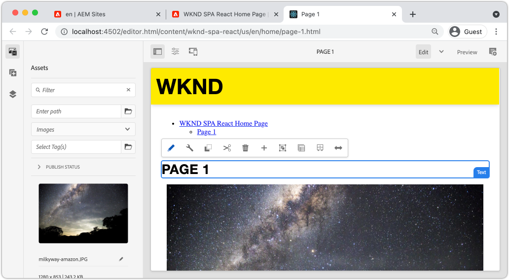
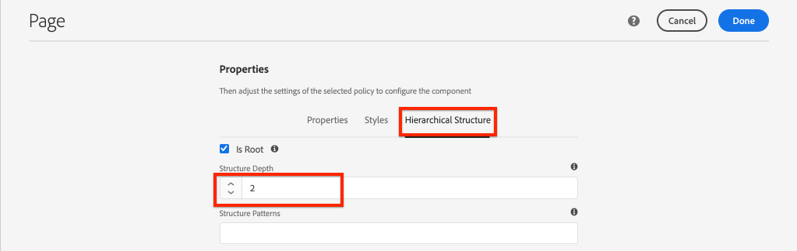

# Aggiungi navigazione e indirizzamento {#navigation-routing}

Scopri come supportare più visualizzazioni nell’applicazione a pagina singola effettuando la mappatura sulle pagine AEM con l’editor per applicazioni a pagina singola SDK. La navigazione dinamica viene implementata utilizzando React Router e React Core Components.

## Obiettivo

1. Comprendi le opzioni di indirizzamento del modello SPA disponibili quando utilizzi l’Editor SPA.
1. Scopri come utilizzare [React Router](https://reacttraining.com/react-router) per spostarti tra le diverse visualizzazioni dell’applicazione a pagina singola.
1. Utilizza i componenti core React di AEM per implementare una navigazione dinamica guidata dalla gerarchia delle pagine di AEM.

## Cosa verrà creato

Questo capitolo aggiungerà la navigazione a un’applicazione a pagina singola in AEM. Il menu di navigazione è gestito dalla gerarchia di pagine di AEM e utilizzerà il modello JSON fornito dal [componente core Navigazione](https://experienceleague.adobe.com/docs/experience-manager-core-components/using/wcm-components/navigation.html).


## Prerequisiti

Esaminare gli strumenti e le istruzioni necessari per configurare un [ambiente di sviluppo locale](overview.md#local-dev-environment). Questo capitolo è una continuazione del capitolo [Componenti mappa](map-components.md), tuttavia a seguire tutto ciò che serve è un progetto AEM abilitato per applicazioni a pagina singola distribuito in un&#39;istanza AEM locale.

## Aggiungi la navigazione al modello {#add-navigation-template}

1. Apri un browser e accedi ad AEM, [http://localhost:4502/](http://localhost:4502/). La base di codice iniziale deve essere già distribuita.
1. Passare al **Modello pagina SPA**: [http://localhost:4502/editor.html/conf/wknd-spa-react/settings/wcm/templates/spa-page-template/structure.html](http://localhost:4502/editor.html/conf/wknd-spa-react/settings/wcm/templates/spa-page-template/structure.html).
1. Seleziona il **contenitore di layout principale** più esterno e fai clic sulla relativa icona **Criteri**. Fai attenzione a **not** per selezionare il **Contenitore di layout** non bloccato per l&#39;authoring.

   

1. Crea un nuovo criterio denominato **Struttura SPA**:

   

   In **Componenti consentiti** > **Generale** > seleziona il componente **Contenitore di layout**.

   In **Componenti consentiti** > **WKND SPA REACT - STRUCTURE** > seleziona il componente **Navigation**:

   

   In **Componenti consentiti** > **REACT SPA WKND - Contenuto** > seleziona i componenti **Immagine** e **Testo**. Dovresti aver selezionato 4 componenti totali.

   Per salvare le modifiche, fai clic su **Completati**.

1. Aggiorna la pagina e aggiungi il componente **Navigazione** sopra il **Contenitore di layout** non bloccato:

   

1. Selezionare il componente **Navigazione** e fare clic sulla relativa icona **Criteri** per modificare i criteri.
1. Crea un nuovo criterio con **Titolo criterio** di **Navigazione SPA**.

   In **Proprietà**:

   * Impostare **Directory principale di navigazione** su `/content/wknd-spa-react/us/en`.
   * Imposta **Escludi livelli principali** su **1**.
   * Deseleziona **Raccogli tutte le pagine figlie**.
   * Impostare **Annidamento struttura di spostamento** su **3**.

   

   In questo modo verranno raccolti i 2 livelli di navigazione inferiori a `/content/wknd-spa-react/us/en`.

1. Dopo aver salvato le modifiche, dovresti visualizzare `Navigation` popolato come parte del modello:

   

## Crea pagine figlie

Quindi, crea ulteriori pagine in AEM che fungeranno da diverse visualizzazioni nell’applicazione a pagina singola. Esamineremo inoltre la struttura gerarchica del modello JSON fornito da AEM.

1. Passare alla console **Sites**: [http://localhost:4502/sites.html/content/wknd-spa-react/us/en/home](http://localhost:4502/sites.html/content/wknd-spa-react/us/en/home). Seleziona la **home page di React SPA WKND** e fai clic su **Crea** > **Pagina**:

   

1. In **Modello** selezionare **Pagina SPA**. In **Proprietà** immettere **Pagina 1** per il **Titolo** e **Pagina-1** come nome.

   

   Fai clic su **Crea** e nella finestra a comparsa fai clic su **Apri** per aprire la pagina nell&#39;editor SPA di AEM.

1. Aggiungi un nuovo componente **Testo** al **Contenitore di layout** principale. Modificare il componente e immettere il testo: **Pagina 1** utilizzando l&#39;editor Rich Text e l&#39;elemento **H2**.

   

   Puoi aggiungere altri contenuti, come un’immagine.

1. Torna alla console AEM Sites e ripeti i passaggi precedenti, creando una seconda pagina denominata **Pagina 2** di pari livello di **Pagina 1**.
1. Infine, crea una terza pagina, **Pagina 3** ma come **pagina secondaria** di **Pagina 2**. Una volta completato, la gerarchia del sito avrà l’aspetto seguente:

   

1. È ora possibile utilizzare il componente Navigazione per passare a diverse aree dell’applicazione a pagina singola.

   

1. Apri la pagina all&#39;esterno dell&#39;editor di AEM: [http://localhost:4502/content/wknd-spa-react/us/en/home.html](http://localhost:4502/content/wknd-spa-react/us/en/home.html). Utilizza il componente **Navigazione** per passare a visualizzazioni diverse dell&#39;app.

1. Utilizza gli strumenti di sviluppo del browser per verificare le richieste di rete durante la navigazione. Le schermate seguenti vengono acquisite dal browser Google Chrome.

   

   Dopo il caricamento della pagina iniziale, la navigazione successiva non provocherà un aggiornamento dell’intera pagina e il traffico di rete verrà ridotto al minimo quando si tornerà alle pagine visitate in precedenza.

## Modello JSON per pagina gerarchia {#hierarchy-page-json-model}

Quindi, controlla il modello JSON che guida l’esperienza multivista dell’applicazione a pagina singola.

1. In una nuova scheda, apri l&#39;API del modello JSON fornita da AEM: [http://localhost:4502/content/wknd-spa-react/us/en.model.json](http://localhost:4502/content/wknd-spa-react/us/en.model.json). Potrebbe essere utile utilizzare un&#39;estensione del browser per [formattare il JSON](https://chrome.google.com/webstore/detail/json-formatter/bcjindcccaagfpapjjmafapmmgkkhgoa).

   Questo contenuto JSON viene richiesto al primo caricamento dell’applicazione a pagina singola. La struttura esterna si presenta come segue:

   ```json
   {
   "language": "en",
   "title": "en",
   "templateName": "spa-app-template",
   "designPath": "/libs/settings/wcm/designs/default",
   "cssClassNames": "spa page basicpage",
   ":type": "wknd-spa-react/components/spa",
   ":items": {},
   ":itemsOrder": [],
   ":hierarchyType": "page",
   ":path": "/content/wknd-spa-react/us/en",
   ":children": {
      "/content/wknd-spa-react/us/en/home": {},
      "/content/wknd-spa-react/us/en/home/page-1": {},
      "/content/wknd-spa-react/us/en/home/page-2": {},
      "/content/wknd-spa-react/us/en/home/page-2/page-3": {}
      }
   }
   ```

   In `:children` dovresti visualizzare una voce per ciascuna delle pagine create. Il contenuto di tutte le pagine si trova in questa richiesta JSON iniziale. Con il routing di navigazione, le visualizzazioni successive dell’applicazione a pagina singola vengono caricate rapidamente, in quanto il contenuto è già disponibile lato client.

   Non è consigliabile caricare **ALL** del contenuto di un&#39;applicazione a pagina singola nella richiesta JSON iniziale, in quanto ciò rallenterebbe il caricamento della pagina iniziale. Quindi, vediamo come viene raccolta la profondità della gerarchia delle pagine.

1. Passa al modello **Radice applicazione a pagina singola** in: [http://localhost:4502/editor.html/conf/wknd-spa-react/settings/wcm/templates/spa-app-template/structure.html](http://localhost:4502/editor.html/conf/wknd-spa-react/settings/wcm/templates/spa-app-template/structure.html).

   Fai clic sul **menu Proprietà pagina** > **Criterio pagina**:

   

1. Il modello **Radice applicazione a pagina singola** include una scheda **Struttura gerarchica** aggiuntiva per controllare il contenuto JSON raccolto. L&#39;**Annidamento struttura** determina la profondità nella gerarchia del sito per raccogliere le pagine figlie sotto la **radice**. È inoltre possibile utilizzare il campo **Modelli struttura** per filtrare ulteriori pagine in base a un&#39;espressione regolare.

   Aggiorna **Annidamento struttura** in **2**:

   

   Fai clic su **Fine** per salvare le modifiche al criterio.

1. Riapri il modello JSON [http://localhost:4502/content/wknd-spa-react/us/en.model.json](http://localhost:4502/content/wknd-spa-react/us/en.model.json).

   ```json
   {
   "language": "en",
   "title": "en",
   "templateName": "spa-app-template",
   "designPath": "/libs/settings/wcm/designs/default",
   "cssClassNames": "spa page basicpage",
   ":type": "wknd-spa-react/components/spa",
   ":items": {},
   ":itemsOrder": [],
   ":hierarchyType": "page",
   ":path": "/content/wknd-spa-react/us/en",
   ":children": {
      "/content/wknd-spa-react/us/en/home": {},
      "/content/wknd-spa-react/us/en/home/page-1": {},
      "/content/wknd-spa-react/us/en/home/page-2": {}
      }
   }
   ```

   Il percorso **Pagina 3** è stato rimosso: `/content/wknd-spa-react/us/en/home/page-2/page-3` dal modello JSON iniziale. Questo perché **La pagina 3** si trova al livello 3 nella gerarchia e il criterio è stato aggiornato in modo da includere solo il contenuto con una profondità massima del livello 2.

1. Riapri la home page dell&#39;applicazione a pagina singola: [http://localhost:4502/content/wknd-spa-react/us/en/home.html](http://localhost:4502/content/wknd-spa-react/us/en/home.html) e apri gli strumenti di sviluppo del browser.

   Aggiorna la pagina per visualizzare la richiesta XHR a `/content/wknd-spa-react/us/en.model.json`, che è la radice SPA. In base alla configurazione della profondità della gerarchia rispetto al modello radice dell’applicazione a pagina singola creato in precedenza nell’esercitazione, vengono incluse solo tre pagine figlie. Non include **Pagina 3**.

   

1. Con gli strumenti per sviluppatori aperti, utilizzare il componente `Navigation` per passare direttamente a **Pagina 3**:

   Si noti che è stata effettuata una nuova richiesta XHR a: `/content/wknd-spa-react/us/en/home/page-2/page-3.model.json`

   

   AEM Model Manager riconosce che il contenuto JSON **Pagina 3** non è disponibile e attiva automaticamente la richiesta XHR aggiuntiva.

1. Prova i collegamenti profondi navigando direttamente in: [http://localhost:4502/content/wknd-spa-react/us/en/home/page-2.html](http://localhost:4502/content/wknd-spa-react/us/en/home/page-2.html). Inoltre, il pulsante Indietro del browser continua a funzionare.

## Ispeziona indirizzamento react  {#react-routing}

Navigazione e routing implementati con [React Router](https://reactrouter.com/en/main). React Router è una raccolta di componenti di navigazione per le applicazioni React. [I componenti core di AEM React](https://github.com/adobe/aem-react-core-wcm-components-base) utilizzano le funzionalità del router React per implementare il componente **Navigazione** utilizzato nei passaggi precedenti.

Quindi, controlla come React Router viene integrato con l&#39;applicazione a pagina singola e prova a utilizzare il componente [Link](https://reactrouter.com/en/main/components/link) del router React.

1. Nell&#39;IDE aprire il file `index.js` in `ui.frontend/src/index.js`.

   ```js
   /* index.js */
   import { Router } from 'react-router-dom';
   ...
   ...
    ModelManager.initialize().then(pageModel => {
       const history = createBrowserHistory();
       render(
       <Router history={history}>
           <App
           history={history}
           cqChildren={pageModel[Constants.CHILDREN_PROP]}
           cqItems={pageModel[Constants.ITEMS_PROP]}
           cqItemsOrder={pageModel[Constants.ITEMS_ORDER_PROP]}
           cqPath={pageModel[Constants.PATH_PROP]}
           locationPathname={window.location.pathname}
           />
       </Router>,
       document.getElementById('spa-root')
       );
   });
   ```

   Si noti che `App` è racchiuso nel componente `Router` da [React Router](https://reacttraining.com/react-router). `ModelManager`, fornito da AEM SPA Editor JS SDK, aggiunge le route dinamiche alle pagine AEM basate sull&#39;API del modello JSON.

1. Apri il file `Page.js` in `ui.frontend/src/components/Page/Page.js`

   ```js
   class AppPage extends Page {
     get containerProps() {
       let attrs = super.containerProps;
       attrs.className =
         (attrs.className || '') + ' page ' + (this.props.cssClassNames || '');
       return attrs;
     }
   }
   
   export default MapTo('wknd-spa-react/components/page')(
     withComponentMappingContext(withRoute(AppPage))
   );
   ```

   Il componente per applicazioni a pagina singola `Page` utilizza la funzione `MapTo` per mappare **Pagine** in AEM a un componente per applicazioni a pagina singola corrispondente. L&#39;utilità `withRoute` consente di indirizzare dinamicamente l&#39;applicazione a pagina singola alla pagina secondaria di AEM appropriata in base alla proprietà `cqPath`.

1. Apri il componente `Header.js` in `ui.frontend/src/components/Header/Header.js`.
1. Aggiorna `Header` per racchiudere il tag `<h1>` in un [collegamento](https://reactrouter.com/en/main/components/link) nella home page:

   ```diff
     //Header.js
     import React, {Component} from 'react';
   + import {Link} from 'react-router-dom';
     require('./Header.css');
   
   export default class Header extends Component {
   
       render() {
           return (
               <header className="Header">
               <div className="Header-container">
   +              <Link to="/content/wknd-spa-react/us/en/home.html">
                       <h1>WKND</h1>
   +              </Link>
               </div>
               </header>
           );
       }
   ```

   Invece di utilizzare un tag di ancoraggio predefinito `<a>`, utilizziamo `<Link>` fornito da React Router. Se `to=` punta a una route valida, l&#39;applicazione a pagina singola passerà a tale route e **non** eseguirà un aggiornamento di pagina intera. In questo caso è sufficiente inserire il collegamento alla home page come codice fisso per illustrare l&#39;utilizzo di `Link`.

1. Aggiorna il test alle `App.test.js` alle `ui.frontend/src/App.test.js`.

   ```diff
   + import { BrowserRouter as Router } from 'react-router-dom';
     import App from './App';
   
     it('renders without crashing', () => {
       const div = document.createElement('div');
   -   ReactDOM.render(<App />, div);
   +   ReactDOM.render(<Router><App /></Router>, div);
     });
   ```

   Poiché si stanno utilizzando le funzionalità di React Router all&#39;interno di un componente statico a cui si fa riferimento in `App.js`, è necessario aggiornare lo unit test per tenerne conto.

1. Apri un terminale, individua la directory principale del progetto e implementa il progetto in AEM utilizzando le abilità Maven:

   ```shell
   $ cd aem-guides-wknd-spa.react
   $ mvn clean install -PautoInstallSinglePackage
   ```

1. Passa a una delle pagine dell&#39;applicazione a pagina singola in AEM: [http://localhost:4502/content/wknd-spa-react/us/en/home/page-1.html](http://localhost:4502/content/wknd-spa-react/us/en/home/page-1.html)

   Anziché utilizzare il componente `Navigation` per spostarsi, utilizzare il collegamento in `Header`.

   

   Tieni presente che l&#39;aggiornamento dell&#39;intera pagina è **non** attivato e che il routing dell&#39;applicazione a pagina singola funziona.

1. Facoltativamente, provare con il file `Header.js` utilizzando un tag di ancoraggio `<a>` standard:

   ```js
   <a href="/content/wknd-spa-react/us/en/home.html">
       <h1>WKND</h1>
   </a>
   ```

   Questo può aiutare a illustrare la differenza tra il routing delle applicazioni a pagina singola e i normali collegamenti alle pagine web.

## Congratulazioni. {#congratulations}

Congratulazioni, hai imparato come supportare più visualizzazioni nell’applicazione a pagina singola effettuando la mappatura sulle pagine AEM con l’editor per applicazioni a pagina singola SDK. La navigazione dinamica è stata implementata tramite React Router e aggiunta al componente `Header`.
