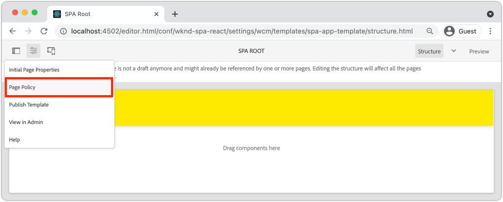

# Aggiungi navigazione e indirizzamento {#navigation-routing}

Scopri come è possibile supportare più visualizzazioni nell’SPA mediante la mappatura su pagine AEM con l’SDK dell’editor dell’SPA. La navigazione dinamica viene implementata utilizzando React Router e React Core Components.

## Obiettivo

1. Comprendi le opzioni di indirizzamento del modello SPA disponibili quando utilizzi l’Editor SPA.
1. Scopri come utilizzare [Router React](https://reacttraining.com/react-router) per navigare tra le diverse visioni del SPA.
1. Utilizza i componenti core React dell’AEM per implementare una navigazione dinamica guidata dalla gerarchia di pagine dell’AEM.

## Cosa verrà creato

Questo capitolo aggiunge la navigazione a un SPA in AEM. Il menu di navigazione è gestito dalla gerarchia di pagine dell’AEM e utilizzerà il modello JSON fornito da [Componente core Navigazione](https://experienceleague.adobe.com/docs/experience-manager-core-components/using/wcm-components/navigation.html).


## Prerequisiti

Esaminare gli strumenti e le istruzioni necessari per l&#39;impostazione di un [ambiente di sviluppo locale](overview.md#local-dev-environment). Questo capitolo è una continuazione del [Componenti mappa](map-components.md) capitolo, tuttavia, per seguire tutte le tue esigenze è un progetto AEM abilitato per SPA implementato in un’istanza AEM locale.

## Aggiungi la navigazione al modello {#add-navigation-template}

1. Apri un browser e accedi all’AEM, [http://localhost:4502/](Http://localhost:4502/). La base di codice iniziale deve essere già distribuita.
1. Accedi a **Modello pagina SPA**: [http://localhost:4502/editor.html/conf/wknd-spa-react/settings/wcm/templates/spa-page-template/structure.html](http://localhost:4502/editor.html/conf/wknd-spa-react/settings/wcm/templates/spa-page-template/structure.html).
1. Seleziona il più esterno **Contenitore di layout principale** e fai clic sul relativo **Policy** icona. Stai attento **non** per selezionare **Contenitore di layout** non bloccato per l’authoring.

   

1. Crea un nuovo criterio denominato **Struttura dell’SPA**:

   

   Sotto **Componenti consentiti** > **Generale** > seleziona la **Contenitore di layout** componente.

   Sotto **Componenti consentiti** > **WKND SPA REACT - STRUTTURA** > seleziona la **Navigazione** componente:

   

   Sotto **Componenti consentiti** > **WKND SPA REACT - Contenuto** > seleziona la **Immagine** e **Testo** componenti. Dovresti aver selezionato 4 componenti totali.

   Per salvare le modifiche, fai clic su **Completati**.

1. Aggiorna la pagina e aggiungi **Navigazione** componente sopra lo sbloccato **Contenitore di layout**:

   

1. Seleziona la **Navigazione** e fare clic sul relativo **Policy** per modificare il criterio.
1. Creare un nuovo criterio con un **Titolo criterio** di **Navigazione SPA**.

   Sotto **Proprietà**:

   * Imposta il **Directory principale di navigazione** a `/content/wknd-spa-react/us/en`.
   * Imposta il **Escludi livelli di navigazione principali** a **1**.
   * Deseleziona **Raccogli tutte le pagine figlie**.
   * Imposta il **Annidamento struttura di navigazione** a **3**.

   

   Questo raccoglierà la navigazione 2 livelli più in basso `/content/wknd-spa-react/us/en`.

1. Dopo aver salvato le modifiche, dovresti visualizzare il `Navigation` come parte del modello:

   

## Crea pagine figlie

Quindi, crea ulteriori pagine in AEM che fungeranno da diverse visualizzazioni nell&#39;SPA. Esamineremo anche la struttura gerarchica del modello JSON fornito dall’AEM.

1. Accedi a **Sites** console: [http://localhost:4502/sites.html/content/wknd-spa-react/us/en/home](http://localhost:4502/sites.html/content/wknd-spa-react/us/en/home). Seleziona la **Home page di WKND SPA React** e fai clic su **Crea** > **Pagina**:

   

1. Sotto **Modello** seleziona **Pagina SPA**. Sotto **Proprietà** Invio **Pagina 1** per **Titolo** e **page-1** come nome.

   

   Clic **Crea** e nella finestra a comparsa, fai clic su **Apri** per aprire la pagina nell’Editor SPA dell’AEM.

1. Aggiungi un nuovo **Testo** Componente principale **Contenitore di layout**. Modifica il componente e immetti il testo: **Pagina 1** utilizzando l’editor Rich Text e **H2** elemento.

   

   Puoi aggiungere altri contenuti, come un’immagine.

1. Torna alla console AEM Sites e ripeti i passaggi precedenti, creando una seconda pagina denominata **Pagina 2** come pari livello di **Pagina 1**.
1. Infine, crea una terza pagina. **Pagina 3** ma come **secondario** di **Pagina 2**. Una volta completato, la gerarchia del sito avrà l’aspetto seguente:

   

1. Il componente Navigazione può ora essere utilizzato per navigare in diverse aree dell’SPA.

   

1. Apri la pagina all’esterno dell’editor AEM: [http://localhost:4502/content/wknd-spa-react/us/en/home.html](http://localhost:4502/content/wknd-spa-react/us/en/home.html). Utilizza il **Navigazione** per passare a visualizzazioni diverse dell’app.

1. Utilizza gli strumenti di sviluppo del browser per verificare le richieste di rete durante la navigazione. Le schermate seguenti vengono acquisite dal browser Google Chrome.

   

   Dopo il caricamento della pagina iniziale, la navigazione successiva non provocherà un aggiornamento dell’intera pagina e il traffico di rete verrà ridotto al minimo quando si tornerà alle pagine visitate in precedenza.

## Modello JSON per pagina gerarchia {#hierarchy-page-json-model}

Quindi, esamina il modello JSON che guida l’esperienza multi-view dell’SPA.

1. In una nuova scheda, apri l’API del modello JSON fornita dall’AEM: [http://localhost:4502/content/wknd-spa-react/us/en.model.json](http://localhost:4502/content/wknd-spa-react/us/en.model.json). Può essere utile utilizzare un’estensione del browser per [formattare il JSON](https://chrome.google.com/webstore/detail/json-formatter/bcjindcccaagfpapjjmafapmmgkkhgoa).

   Questo contenuto JSON viene richiesto al primo caricamento dell’SPA. La struttura esterna si presenta come segue:

   ```json
   {
   "language": "en",
   "title": "en",
   "templateName": "spa-app-template",
   "designPath": "/libs/settings/wcm/designs/default",
   "cssClassNames": "spa page basicpage",
   ":type": "wknd-spa-react/components/spa",
   ":items": {},
   ":itemsOrder": [],
   ":hierarchyType": "page",
   ":path": "/content/wknd-spa-react/us/en",
   ":children": {
      "/content/wknd-spa-react/us/en/home": {},
      "/content/wknd-spa-react/us/en/home/page-1": {},
      "/content/wknd-spa-react/us/en/home/page-2": {},
      "/content/wknd-spa-react/us/en/home/page-2/page-3": {}
      }
   }
   ```

   Sotto `:children` dovresti visualizzare una voce per ciascuna delle pagine create. Il contenuto di tutte le pagine si trova in questa richiesta JSON iniziale. Con il routing di navigazione, le visualizzazioni successive dell’SPA vengono caricate rapidamente, in quanto il contenuto è già disponibile lato client.

   Non è saggio caricare **TUTTI** del contenuto di un SPA nella richiesta JSON iniziale, in quanto ciò rallenterebbe il caricamento della pagina iniziale. Quindi, vediamo come viene raccolta la profondità della gerarchia delle pagine.

1. Accedi a **Radice SPA** modello in: [http://localhost:4502/editor.html/conf/wknd-spa-react/settings/wcm/templates/spa-app-template/structure.html](http://localhost:4502/editor.html/conf/wknd-spa-react/settings/wcm/templates/spa-app-template/structure.html).

   Fai clic su **Menu delle proprietà della pagina** > **Criterio pagina**:

   

1. Il **Radice SPA** il modello ha un valore **Struttura gerarchica** per controllare il contenuto JSON raccolto. Il **Annidamento struttura** determina la profondità nella gerarchia del sito per raccogliere le pagine figlie sotto il **radice**. È inoltre possibile utilizzare **Modelli struttura** per filtrare ulteriori pagine in base a un’espressione regolare.

   Aggiornare il **Annidamento struttura** a **2**:

   

   Clic **Fine** per salvare le modifiche apportate al criterio.

1. Riapri il modello JSON [http://localhost:4502/content/wknd-spa-react/us/en.model.json](http://localhost:4502/content/wknd-spa-react/us/en.model.json).

   ```json
   {
   "language": "en",
   "title": "en",
   "templateName": "spa-app-template",
   "designPath": "/libs/settings/wcm/designs/default",
   "cssClassNames": "spa page basicpage",
   ":type": "wknd-spa-react/components/spa",
   ":items": {},
   ":itemsOrder": [],
   ":hierarchyType": "page",
   ":path": "/content/wknd-spa-react/us/en",
   ":children": {
      "/content/wknd-spa-react/us/en/home": {},
      "/content/wknd-spa-react/us/en/home/page-1": {},
      "/content/wknd-spa-react/us/en/home/page-2": {}
      }
   }
   ```

   Tieni presente che **Pagina 3** percorso rimosso: `/content/wknd-spa-react/us/en/home/page-2/page-3` dal modello JSON iniziale. Questo perché **Pagina 3** è al livello 3 nella gerarchia e abbiamo aggiornato la policy per includere solo contenuti a una profondità massima di livello 2.

1. Riapri la home page dell’SPA: [http://localhost:4502/content/wknd-spa-react/us/en/home.html](http://localhost:4502/content/wknd-spa-react/us/en/home.html) e apri gli strumenti per sviluppatori del browser.

   Aggiorna la pagina per visualizzare la richiesta XHR a `/content/wknd-spa-react/us/en.model.json`, che è la radice dell&#39;SPA. Tieni presente che solo tre pagine figlie sono incluse in base alla configurazione della profondità della gerarchia rispetto al modello radice SPA creato in precedenza nell’esercitazione. Questo non include **Pagina 3**.

   

1. Con gli strumenti per sviluppatori aperti, utilizza `Navigation` componente a cui passare direttamente **Pagina 3**:

   Osserva che viene effettuata una nuova richiesta XHR per: `/content/wknd-spa-react/us/en/home/page-2/page-3.model.json`

   

   Il Model Manager dell&#39;AEM è consapevole che **Pagina 3** Il contenuto JSON non è disponibile e attiva automaticamente la richiesta XHR aggiuntiva.

1. Prova i collegamenti profondi navigando direttamente in: [http://localhost:4502/content/wknd-spa-react/us/en/home/page-2.html](http://localhost:4502/content/wknd-spa-react/us/en/home/page-2.html). Inoltre, il pulsante Indietro del browser continua a funzionare.

## Indirizzamento Inspect React  {#react-routing}

La navigazione e il routing sono implementati con [Router React](https://reactrouter.com/en/main). React Router è una raccolta di componenti di navigazione per le applicazioni React. [Componenti core React dell’AEM](https://github.com/adobe/aem-react-core-wcm-components-base) utilizza le funzioni di React Router per implementare **Navigazione** componente utilizzato nei passaggi precedenti.

Successivamente, verificare come React Router è integrato con l&#39;SPA ed eseguire esperimenti utilizzando React Router [Collegamento](https://reactrouter.com/en/main/components/link) componente.

1. Nell’IDE apri il file `index.js` a `ui.frontend/src/index.js`.

   ```js
   /* index.js */
   import { Router } from 'react-router-dom';
   ...
   ...
    ModelManager.initialize().then(pageModel => {
       const history = createBrowserHistory();
       render(
       <Router history={history}>
           <App
           history={history}
           cqChildren={pageModel[Constants.CHILDREN_PROP]}
           cqItems={pageModel[Constants.ITEMS_PROP]}
           cqItemsOrder={pageModel[Constants.ITEMS_ORDER_PROP]}
           cqPath={pageModel[Constants.PATH_PROP]}
           locationPathname={window.location.pathname}
           />
       </Router>,
       document.getElementById('spa-root')
       );
   });
   ```

   Tieni presente che `App` è racchiuso in `Router` componente da [Router React](https://reacttraining.com/react-router). Il `ModelManager`, fornito dall’SDK JS per l’editor SPA dell’AEM, aggiunge le route dinamiche alle pagine AEM in base all’API del modello JSON.

1. Apri il file `Page.js` a `ui.frontend/src/components/Page/Page.js`

   ```js
   class AppPage extends Page {
     get containerProps() {
       let attrs = super.containerProps;
       attrs.className =
         (attrs.className || '') + ' page ' + (this.props.cssClassNames || '');
       return attrs;
     }
   }
   
   export default MapTo('wknd-spa-react/components/page')(
     withComponentMappingContext(withRoute(AppPage))
   );
   ```

   Il `Page` La componente SPA utilizza `MapTo` funzione da mappare **Pagine** in AEM ad una corrispondente componente dell’SPA. Il `withRoute` consente di indirizzare dinamicamente l’SPA alla pagina AEM-figlio appropriata in base al `cqPath` proprietà.

1. Apri `Header.js` componente in `ui.frontend/src/components/Header/Header.js`.
1. Aggiornare il `Header` per racchiudere `<h1>` tag in una [Collegamento](https://reactrouter.com/en/main/components/link) alla home page:

   ```diff
     //Header.js
     import React, {Component} from 'react';
   + import {Link} from 'react-router-dom';
     require('./Header.css');
   
   export default class Header extends Component {
   
       render() {
           return (
               <header className="Header">
               <div className="Header-container">
   +              <Link to="/content/wknd-spa-react/us/en/home.html">
                       <h1>WKND</h1>
   +              </Link>
               </div>
               </header>
           );
       }
   ```

   Invece di utilizzare un valore predefinito `<a>` tag di ancoraggio utilizzato `<Link>` fornito da React Router. Purché `to=` punti a un percorso valido, l&#39;SPA vi passerà e **non** esegui un aggiornamento dell’intera pagina. Qui semplicemente inseriamo un codice rigido per il collegamento alla home page per illustrare l’utilizzo di `Link`.

1. Aggiorna il test in `App.test.js` a `ui.frontend/src/App.test.js`.

   ```diff
   + import { BrowserRouter as Router } from 'react-router-dom';
     import App from './App';
   
     it('renders without crashing', () => {
       const div = document.createElement('div');
   -   ReactDOM.render(<App />, div);
   +   ReactDOM.render(<Router><App /></Router>, div);
     });
   ```

   Poiché stiamo utilizzando le funzioni di React Router all’interno di un componente statico a cui si fa riferimento in `App.js` è necessario aggiornare lo unit test per tenerne conto.

1. Apri un terminale, individua la directory principale del progetto e implementa il progetto in AEM con le tue competenze Maven:

   ```shell
   $ cd aem-guides-wknd-spa.react
   $ mvn clean install -PautoInstallSinglePackage
   ```

1. Passa a una delle pagine dell’SPA nell’AEM: [http://localhost:4502/content/wknd-spa-react/us/en/home/page-1.html](http://localhost:4502/content/wknd-spa-react/us/en/home/page-1.html)

   Invece di utilizzare `Navigation` per navigare, utilizza il collegamento nella sezione `Header`.

   

   Osserva che un aggiornamento dell’intera pagina è **non** e che il routing dell’SPA funzioni.

1. Facoltativamente, prova con `Header.js` file utilizzando uno standard `<a>` tag di ancoraggio:

   ```js
   <a href="/content/wknd-spa-react/us/en/home.html">
       <h1>WKND</h1>
   </a>
   ```

   Questo può aiutare a illustrare la differenza tra il routing dell’SPA e i normali collegamenti alle pagine web.

## Congratulazioni. {#congratulations}

Congratulazioni, hai imparato come supportare più visualizzazioni nell’SPA mappando le pagine AEM con l’SDK dell’editor SPA. La navigazione dinamica è stata implementata utilizzando React Router e aggiunta al `Header` componente.
