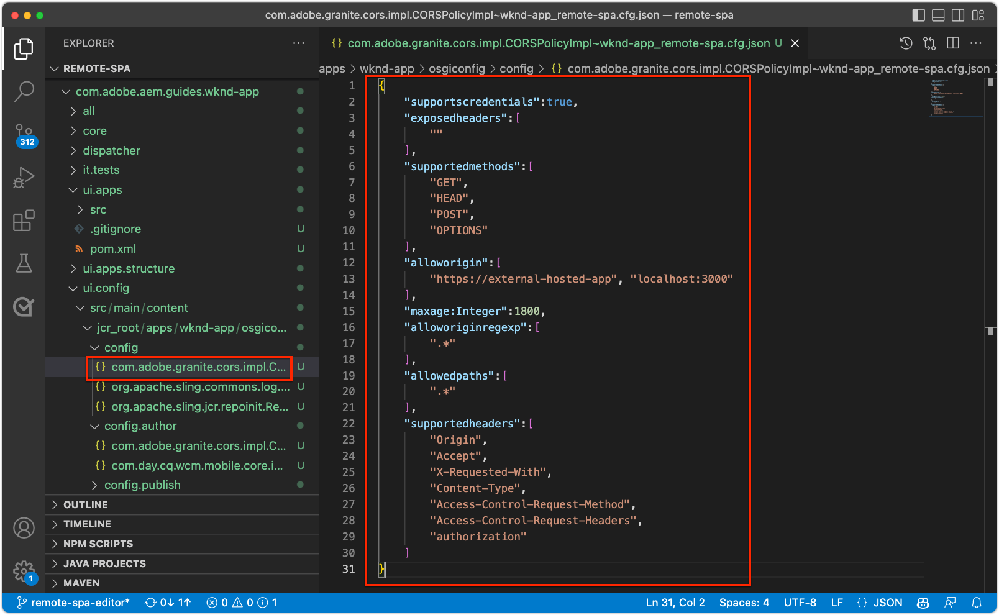

# Configurare AEM per l’editor SPA

Mentre la base di codice SPA è gestita al di fuori di AEM, è necessario un progetto AEM per impostare il supporto della configurazione e dei requisiti di contenuto. Questo capitolo illustra la creazione di un progetto AEM che contiene le configurazioni necessarie:

+ AEM proxy dei componenti core WCM
+ AEM proxy SPA pagina remota
+ AEM modelli di pagina SPA remoto
+ SPA remote di base AEM pagine
+ Sottoprogetto per definire SPA per AEM mappature URL
+ Cartelle di configurazione OSGi

## Scarica il progetto di base da GitHub

Scarica la `aem-guides-wknd-graphql` progetto da Github.com. Conterrà alcuni file di base utilizzati nel progetto.

```
$ mkdir -p ~/Code
$ git clone https://github.com/adobe/aem-guides-wknd-graphql.git
$ cd remote-spa-tutorial
```

## Creare un progetto AEM

Crea un progetto AEM in cui vengono gestite le configurazioni e il contenuto della linea di base. Questo progetto verrà generato all’interno del duplicato `aem-guides-wknd-graphql` del progetto `remote-spa-tutorial` cartella.

_Utilizza sempre la versione più recente del [Archetipo AEM](https://github.com/adobe/aem-project-archetype)._

```
$ cd ~/Code/aem-guides-wknd-graphql/remote-spa-tutorial
$ mvn -B archetype:generate \
 -D archetypeGroupId=com.adobe.aem \
 -D archetypeArtifactId=aem-project-archetype \
 -D archetypeVersion=39 \
 -D aemVersion=cloud \
 -D appTitle="WKND App" \
 -D appId="wknd-app" \
 -D groupId="com.adobe.aem.guides.wkndapp" \
 -D frontendModule="react"
$ mv ~/Code/aem-guides-wknd-graphql/remote-spa-tutorial/wknd-app ~/Code/aem-guides-wknd-graphql/remote-spa-tutorial/com.adobe.aem.guides.wknd-app
```

_L&#39;ultimo comando semplicemente rinomina la cartella del progetto AEM in modo che sia chiaro che si tratta del progetto AEM e non da confondere con SPA remoto__

Quando `frontendModule="react"` è specificato, `ui.frontend` Il progetto non viene utilizzato per il caso di utilizzo di SPA remoto. Il SPA viene sviluppato e gestito esternamente per AEM e utilizza solo AEM come API di contenuto. La `frontendModule="react"` Il flag è necessario per includere nel progetto  `spa-project` AEM le dipendenze Java™ e configurare i modelli di pagina SPA remoto.

AEM Project Archetype genera i seguenti elementi utilizzati per configurare AEM per l’integrazione con l’SPA.

+ __AEM proxy dei componenti core WCM__ a `ui.apps/src/.../apps/wknd-app/components`
+ __AEM SPA proxy di pagina remota__ a `ui.apps/src/.../apps/wknd-app/components/remotepage`
+ __Modelli di pagina AEM__ a `ui.content/src/.../conf/wknd-app/settings/wcm/templates`
+ __Sottoprogetto per definire le mappature dei contenuti__ a `ui.content/src/...`
+ __SPA remote di base AEM pagine__ a `ui.content/src/.../content/wknd-app`
+ __Cartelle di configurazione OSGi__ a `ui.config/src/.../apps/wknd-app/osgiconfig`

Con il progetto di base AEM generato, alcune regolazioni garantiscono la compatibilità SPA Editor con SPA remoto.

## Rimuovi progetto ui.frontend

Poiché il SPA è un SPA remoto, si presuppone che sia sviluppato e gestito al di fuori del progetto AEM. Per evitare i conflitti, rimuovere la `ui.frontend` progetto da distribuzione. Se la `ui.frontend` il progetto non viene rimosso, due SPA, il SPA predefinito fornito nel `ui.frontend` il progetto e il SPA remoto vengono caricati contemporaneamente nell&#39;editor di SPA AEM.

1. Apri il progetto AEM (`~/Code/aem-guides-wknd-graphql/remote-spa-tutorial/com.adobe.aem.guides.wknd-app`) nell&#39;IDE
1. Apri la radice `pom.xml`
1. Commenta i `<module>ui.frontend</module` da `<modules>` elenco

   ```
   <modules>
       <module>all</module>
       <module>core</module>
   
       <!-- <module>ui.frontend</module> -->
   
       <module>ui.apps</module>
       <module>ui.apps.structure</module>
       <module>ui.config</module>
       <module>ui.content</module>
       <module>it.tests</module>
       <module>dispatcher</module>
       <module>ui.tests</module>
       <module>analyse</module>
   </modules>
   ```

   La `pom.xml` dovrebbe essere simile a:

   

1. Apri `ui.apps/pom.xml`
1. Aggiungi un commento al `<dependency>` su `<artifactId>wknd-app.ui.frontend</artifactId>`

   ```
   <dependencies>
   
       <!-- Remote SPA project will provide all frontend resources
       <dependency>
           <groupId>com.adobe.aem.guides.wkndapp</groupId>
           <artifactId>wknd-app.ui.frontend</artifactId>
           <version>${project.version}</version>
           <type>zip</type>
       </dependency>
       --> 
   </dependencies>
   ```

   La `ui.apps/pom.xml` dovrebbe essere simile a:

   

Se il progetto AEM è stato generato prima di queste modifiche, elimina manualmente il `ui.frontend` libreria client generata da `ui.apps` progetto in `ui.apps/src/main/content/jcr_root/apps/wknd-app/clientlibs/clientlib-react`.

## Mappatura del contenuto AEM

Affinché AEM caricare il SPA remoto nell’Editor SPA, è necessario stabilire le mappature tra le route SPA e le pagine AEM utilizzate per aprire e creare contenuti.

L&#39;importanza di questa configurazione viene esplorata in seguito.

La mappatura può essere effettuata con [Mappatura Sling](https://sling.apache.org/documentation/the-sling-engine/mappings-for-resource-resolution.html#root-level-mappings-1) definito in `/etc/map`.

1. Nell’IDE, apri la `ui.content` sottoprogetto
1. Accedi a  `src/main/content/jcr_root`
1. Crea una cartella . `etc`
1. In `etc`, creare una cartella `map`
1. In `map`, creare una cartella `http`
1. In `http`, creare un file `.content.xml` con il contenuto:

   ```
   <?xml version="1.0" encoding="UTF-8"?>
   <jcr:root xmlns:sling="http://sling.apache.org/jcr/sling/1.0" xmlns:jcr="http://www.jcp.org/jcr/1.0"
       jcr:primaryType="sling:Mapping">
       <localhost_any/>
   </jcr:root>
   ```

1. In `http` , creare una cartella `localhost_any`
1. In `localhost_any`, creare un file `.content.xml` con il contenuto:

   ```
   <?xml version="1.0" encoding="UTF-8"?>
   <jcr:root xmlns:sling="http://sling.apache.org/jcr/sling/1.0" xmlns:jcr="http://www.jcp.org/jcr/1.0"
       jcr:primaryType="sling:Mapping"
       sling:match="localhost\\.\\d+">
       <wknd-app-routes-adventure/>
   </jcr:root>
   ```

1. In `localhost_any` , creare una cartella `wknd-app-routes-adventure`
1. In `wknd-app-routes-adventure`, creare un file `.content.xml` con il contenuto:

   ```
   <?xml version="1.0" encoding="UTF-8"?>
   
   <!--
   The 'wknd-app-routes-adventure' mapping, maps requests to the SPA's adventure route 
   to it's corresponding page in AEM at /content/wknd-app/us/en/home/adventure/xxx.
   
   Note the adventure AEM pages are created directly in AEM.
   -->
   
   <jcr:root xmlns:sling="http://sling.apache.org/jcr/sling/1.0" xmlns:jcr="http://www.jcp.org/jcr/1.0"
       jcr:primaryType="sling:Mapping"
       sling:match="adventure:.*/([^/]+)/?$"
       sling:internalRedirect="/content/wknd-app/us/en/home/adventure/$1"/>
   ```

1. Aggiungi i nodi di mappatura a `ui.content/src/main/content/META-INF/vault/filter.xml` inclusi nel pacchetto AEM.

   ```
   <?xml version="1.0" encoding="UTF-8"?>
   <workspaceFilter version="1.0">
       <filter root="/conf/wknd-app" mode="merge"/>
       <filter root="/content/wknd-app" mode="merge"/>
       <filter root="/content/dam/wknd-app/asset.jpg" mode="merge"/>
       <filter root="/content/experience-fragments/wknd-app" mode="merge"/>
   
       <!-- Add the Sling Mapping rules for the WKND App -->
       <filter root="/etc/map" mode="merge"/>
   </workspaceFilter>
   ```

La struttura delle cartelle e `.context.xml` i file devono avere un aspetto simile a:


La `filter.xml` dovrebbe essere simile a:


Ora, quando il progetto AEM viene distribuito, queste configurazioni vengono incluse automaticamente.

Gli effetti di mappatura Sling AEM in esecuzione su `http` e `localhost`Quindi, solo sostenere lo sviluppo locale. Quando si distribuisce a AEM as a Cloud Service, devono essere aggiunte mappature Sling simili a quelle di destinazione `https` e i domini as a Cloud Service appropriati. Per ulteriori informazioni, consulta la sezione [Documentazione sulla mappatura Sling](https://sling.apache.org/documentation/the-sling-engine/mappings-for-resource-resolution.html).

## Criteri di sicurezza per la condivisione delle risorse tra origini

Quindi, configura AEM per proteggere il contenuto in modo che solo questo SPA possa accedere al contenuto AEM. Configura [Condivisione delle risorse tra le origini in AEM](https://experienceleague.adobe.com/docs/experience-manager-learn/foundation/security/develop-for-cross-origin-resource-sharing.html).

1. Nell’IDE, apri la `ui.config` Sottoprogetto Maven
1. Naviga `src/main/content/jcr_root/apps/wknd-app/osgiconfig/config`
1. Crea un file denominato `com.adobe.granite.cors.impl.CORSPolicyImpl~wknd-app_remote-spa.cfg.json`
1. Aggiungi quanto segue al file :

   ```
   {
       "supportscredentials":true,
       "exposedheaders":[
           ""
       ],
       "supportedmethods":[
           "GET",
           "HEAD",
           "POST",
           "OPTIONS"
       ],
       "alloworigin":[
           "https://external-hosted-app", "localhost:3000"
       ],
       "maxage:Integer":1800,
       "alloworiginregexp":[
           ".*"
       ],
       "allowedpaths":[
           ".*"
       ],
       "supportedheaders":[
           "Origin",
           "Accept",
           "X-Requested-With",
           "Content-Type",
           "Access-Control-Request-Method",
           "Access-Control-Request-Headers",
           "authorization"
       ]
   }
   ```

La `com.adobe.granite.cors.impl.CORSPolicyImpl~wknd-app_remote-spa.cfg.json` dovrebbe essere simile a:



Gli elementi di configurazione chiave sono:

+ `alloworigin` specifica gli host autorizzati a recuperare il contenuto da AEM.
   + `localhost:3000` viene aggiunto per supportare l’SPA in esecuzione localmente
   + `https://external-hosted-app` funge da segnaposto da sostituire con il dominio su cui è ospitato il SPA remoto.
+ `allowedpaths` specifica quali percorsi in AEM sono coperti da questa configurazione CORS. L’impostazione predefinita consente l’accesso a tutto il contenuto di AEM, tuttavia questo può essere limitato solo ai percorsi specifici a cui l’SPA può accedere, ad esempio: `/content/wknd-app`.

## Imposta AEM pagina come modello di pagina SPA remoto

AEM Project Archetype genera un progetto preparato per l’integrazione AEM con un SPA remoto, ma richiede una regolazione piccola ma importante per la struttura AEM pagina generata automaticamente. Il tipo della pagina di AEM generata automaticamente deve essere stato modificato in __Pagina SPA remota__, anziché un __pagina SPA__.

1. Nell’IDE, apri la `ui.content` sottoprogetto
1. Apri in `src/main/content/jcr_root/content/wknd-app/us/en/home/.content.xml`
1. Aggiorna `.content.xml` file con:

   ```
   <?xml version="1.0" encoding="UTF-8"?>
   <jcr:root xmlns:sling="http://sling.apache.org/jcr/sling/1.0" xmlns:cq="http://www.day.com/jcr/cq/1.0" xmlns:jcr="http://www.jcp.org/jcr/1.0" xmlns:nt="http://www.jcp.org/jcr/nt/1.0"
           jcr:primaryType="cq:Page">
       <jcr:content
           cq:template="/conf/wknd-app/settings/wcm/templates/spa-remote-page"
           jcr:primaryType="cq:PageContent"
           jcr:title="WKND App Home Page"
           sling:resourceType="wknd-app/components/remotepage">
           <root
               jcr:primaryType="nt:unstructured"
               sling:resourceType="wcm/foundation/components/responsivegrid">
               <responsivegrid
                   jcr:primaryType="nt:unstructured"
                   sling:resourceType="wcm/foundation/components/responsivegrid">
                   <text
                       jcr:primaryType="nt:unstructured"
                       sling:resourceType="wknd-app/components/text"
                       text="&lt;p>Hello World!&lt;/p>"
                       textIsRich="true">
                       <cq:responsive jcr:primaryType="nt:unstructured"/>
                   </text>
               </responsivegrid>
           </root>
       </jcr:content>
   </jcr:root>
   ```

Le modifiche principali sono aggiornamenti al `jcr:content` del nodo:

+ `cq:template` a `/conf/wknd-app/settings/wcm/templates/spa-remote-page`
+ `sling:resourceType` a `wknd-app/components/remotepage`

La `src/main/content/jcr_root/content/wknd-app/us/en/home/.content.xml` dovrebbe essere simile a:


Queste modifiche consentono a questa pagina, che agisce come radice SPA in AEM, di caricare il SPA remoto in SPA Editor.

>[!NOTE]
>
>Se questo progetto è stato precedentemente distribuito a AEM, assicurati di eliminare la pagina AEM come __Siti > App WKND > noi > en > WKND App Home Page__, come `ui.content`  il progetto è impostato su __merge__ nodi, anziché __update__.

Questa pagina può anche essere rimossa e ricreata come Pagina SPA remota in AEM stessa, tuttavia questa pagina viene creata automaticamente nel `ui.content` è consigliabile aggiornarlo nella base di codice.

## Distribuire il progetto AEM per AEM SDK

1. Assicurati che il servizio AEM Author sia in esecuzione sulla porta 4502
1. Dalla riga di comando, accedi alla directory principale del progetto Maven AEM
1. Utilizza Maven per distribuire il progetto al servizio locale AEM SDK Author

   ```
   $ mvn clean install -PautoInstallSinglePackage
   ```

   

## Configurare la pagina AEM principale

Con il progetto AEM implementato, c&#39;è un ultimo passaggio per preparare SPA editor per caricare il nostro SPA remoto. In AEM, contrassegna la pagina AEM che corrisponde alla radice SPA,`/content/wknd-app/us/en/home`, generato dall’Archetipo di progetto AEM.

1. Accedi ad AEM Author
1. Passa a __Sites > WKND App > noi > it__
1. Seleziona la __Home page app WKND__, e tocca __Proprietà__

   

1. Passa a __SPA__ scheda
1. Compila il __Configurazione SPA remota__
   + __URL host SPA__: `http://localhost:3000`
      + URL della directory principale del SPA remoto

   

1. Tocca __Salva e chiudi__

Ricorda che il tipo di questa pagina è stato modificato in quello di una __Pagina SPA remota__, che è ciò che ci permette di vedere il __SPA__ nella relativa scheda __Proprietà pagina__.

Questa configurazione deve essere impostata solo sulla pagina AEM che corrisponde alla radice del SPA. Tutte le pagine AEM sotto questa pagina ereditano il valore .

## Congratulazioni

Ora hai preparato AEM configurazioni e le hai distribuite al tuo autore AEM locale! Ora sai come:

+ Rimuovi il SPA generato da Project Archetype AEM, commentando le dipendenze in `ui.frontend`
+ Aggiungi mappature Sling a AEM che mappano i percorsi SPA alle risorse in AEM
+ Configurare AEM criteri di sicurezza per la condivisione delle risorse tra origini che consentono al SPA remoto di utilizzare contenuti da AEM
+ Implementare il progetto AEM nel servizio locale AEM SDK Author
+ Contrassegnare una pagina AEM come radice SPA remota utilizzando la proprietà della pagina URL host SPA

## Passaggi successivi

Con AEM configurato, possiamo concentrarci su [avvio del SPA remoto](./spa-bootstrap.md) con supporto per le aree modificabili tramite AEM editor SPA!
