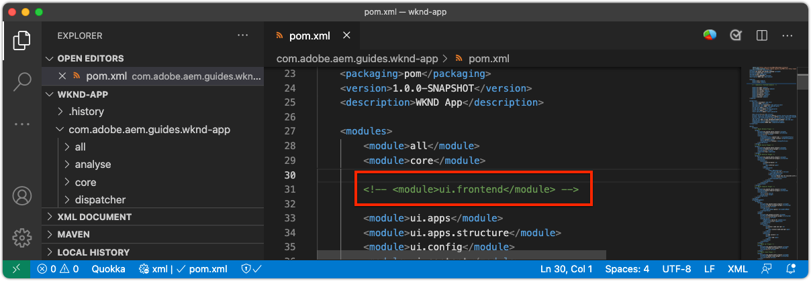
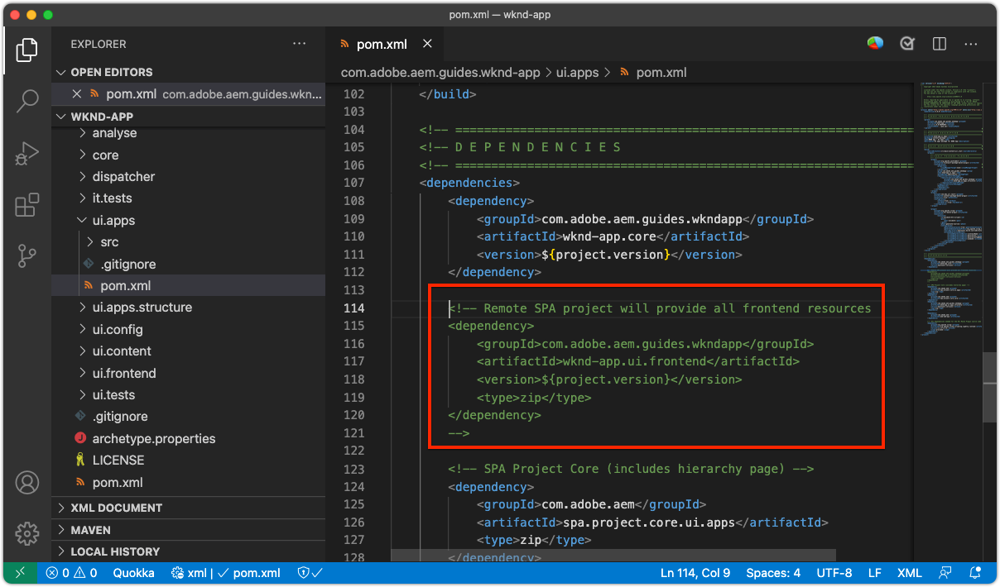
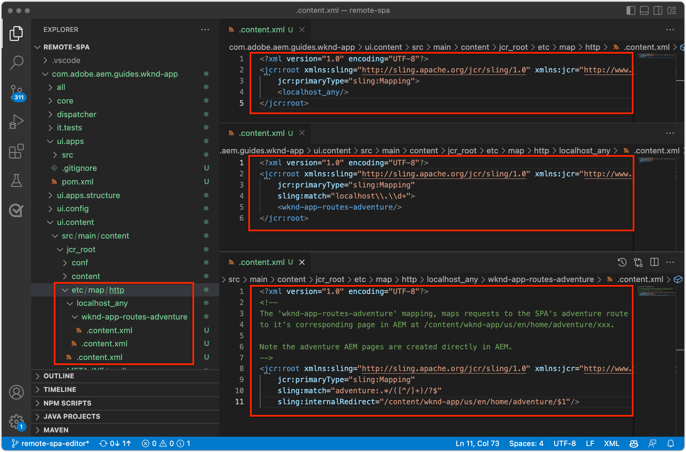
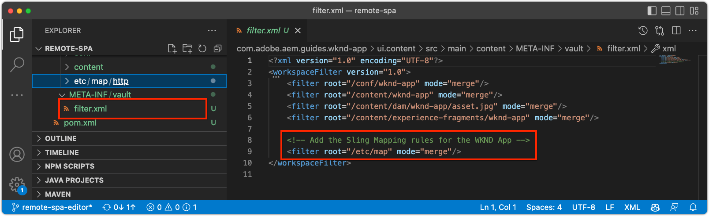
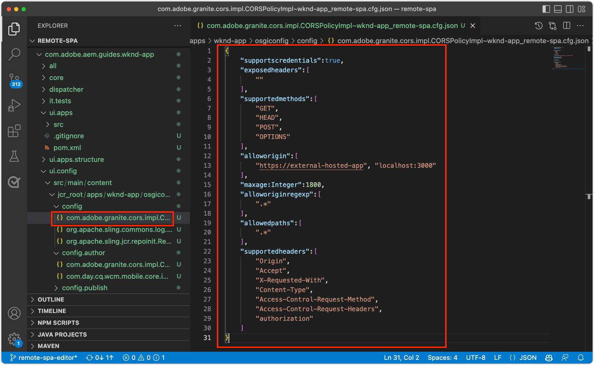
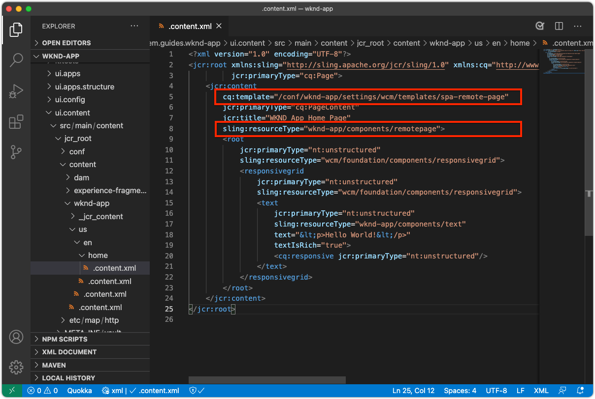
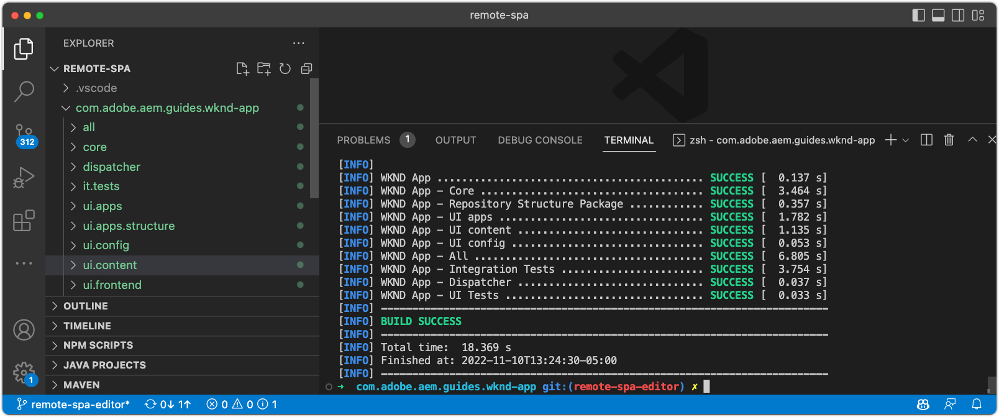
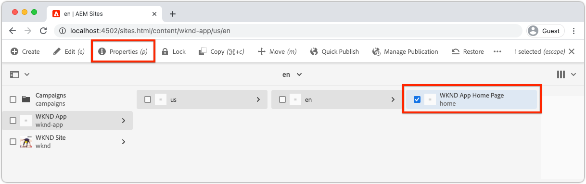
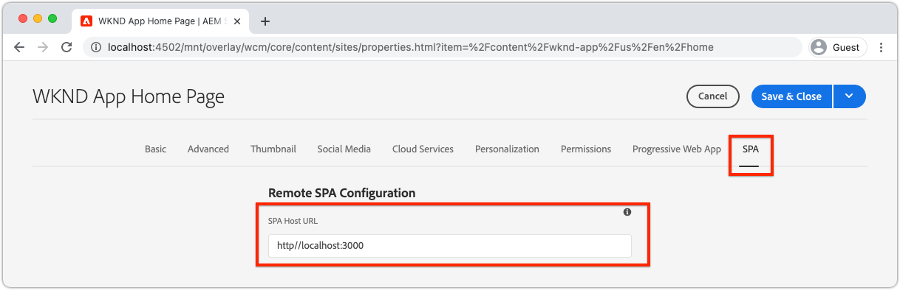

# Configurare AEM per l’editor SPA

{{spa-editor-deprecation}}

Mentre la base di codice dell’applicazione a pagina singola viene gestita al di fuori di AEM, è necessario un progetto AEM per configurare i requisiti di configurazione e contenuto che supportano. Questo capitolo illustra come creare un progetto AEM contenente le configurazioni necessarie:

* Proxy dei componenti core WCM di AEM
* Proxy pagina applicazione a pagina remota AEM
* Modelli di pagina per applicazioni a pagina singola remote di AEM
* Pagine AEM delle applicazioni a pagina singola remote previste
* Sottoprogetto per definire le mappature URL da applicazione a pagina singola ad AEM
* Cartelle di configurazione OSGi

## Scarica il progetto di base da GitHub

Scarica il progetto `aem-guides-wknd-graphql` da Github.com. Conterrà alcuni file di base utilizzati in questo progetto.

```
$ mkdir -p ~/Code
$ git clone https://github.com/adobe/aem-guides-wknd-graphql.git
$ cd remote-spa-tutorial
```

## Creazione di un progetto AEM

Crea un progetto AEM in cui vengono gestite le configurazioni e i contenuti della linea di base. Questo progetto verrà generato nella cartella `remote-spa-tutorial` del progetto `aem-guides-wknd-graphql` clonato.

_Utilizza sempre la versione più recente di [Archetipo AEM](https://github.com/adobe/aem-project-archetype)._

```
$ cd ~/Code/aem-guides-wknd-graphql/remote-spa-tutorial
$ mvn -B archetype:generate \
 -D archetypeGroupId=com.adobe.aem \
 -D archetypeArtifactId=aem-project-archetype \
 -D archetypeVersion=39 \
 -D aemVersion=cloud \
 -D appTitle="WKND App" \
 -D appId="wknd-app" \
 -D groupId="com.adobe.aem.guides.wkndapp" \
 -D frontendModule="react"
$ mv ~/Code/aem-guides-wknd-graphql/remote-spa-tutorial/wknd-app ~/Code/aem-guides-wknd-graphql/remote-spa-tutorial/com.adobe.aem.guides.wknd-app
```

_L’ultimo comando rinomina semplicemente la cartella del progetto AEM in modo che sia chiaro che si tratta del progetto AEM e non vada confuso con l’applicazione a pagina singola remota**

Se si specifica `frontendModule="react"`, il progetto `ui.frontend` non viene utilizzato per il caso di utilizzo dell&#39;applicazione a pagina singola remota. L’applicazione a pagina singola viene sviluppata e gestita esternamente ad AEM e utilizza AEM solo come API di contenuto. Il flag `frontendModule="react"` è richiesto per il progetto e include le dipendenze Java™ di AEM `spa-project` e configura i modelli di pagina per applicazioni a pagina singola remote.

L’Archetipo progetto AEM genera i seguenti elementi che vengono utilizzati per configurare AEM per l’integrazione con l’applicazione a pagina singola.

* **AEM WCM Core Components proxies** at `ui.apps/src/.../apps/wknd-app/components`
* **AEM SPA Remote Page proxy** at `ui.apps/src/.../apps/wknd-app/components/remotepage`
* **AEM Page Templates** at `ui.content/src/.../conf/wknd-app/settings/wcm/templates`
* **Subproject to define content mappings** at `ui.content/src/...`
* **Baseline Remote SPA AEM pages** at `ui.content/src/.../content/wknd-app`
* **OSGi configuration folders** at `ui.config/src/.../apps/wknd-app/osgiconfig`

With the base AEM project is generated, a few adjustments ensure SPA Editor compatibility with Remote SPAs.

## Remove ui.frontend project

Since the SPA is a Remote SPA, assume it&#39;s developed and managed outside of the AEM project. To avoid conflicts, remove the `ui.frontend` project from deploying. If the `ui.frontend` project is not removed, two SPAs, the default SPA provided in the `ui.frontend` project and the Remote SPA, is loaded at the same time in the AEM SPA Editor.

1. Open the AEM project (`~/Code/aem-guides-wknd-graphql/remote-spa-tutorial/com.adobe.aem.guides.wknd-app`) in your IDE
1. Open the root `pom.xml`
1. Comment the `<module>ui.frontend</module` out from the `<modules>` list

   ```
   <modules>
       <module>all</module>
       <module>core</module>
   
       <!-- <module>ui.frontend</module> -->
   
       <module>ui.apps</module>
       <module>ui.apps.structure</module>
       <module>ui.config</module>
       <module>ui.content</module>
       <module>it.tests</module>
       <module>dispatcher</module>
       <module>ui.tests</module>
       <module>analyse</module>
   </modules>
   ```

   Il file `pom.xml` deve essere simile al seguente:

   

1. Open the `ui.apps/pom.xml`
1. Comment out the `<dependency>` on `<artifactId>wknd-app.ui.frontend</artifactId>`

   ```
   <dependencies>
   
       <!-- Remote SPA project will provide all frontend resources
       <dependency>
           <groupId>com.adobe.aem.guides.wkndapp</groupId>
           <artifactId>wknd-app.ui.frontend</artifactId>
           <version>${project.version}</version>
           <type>zip</type>
       </dependency>
       --> 
   </dependencies>
   ```

   Il file `ui.apps/pom.xml` deve essere simile al seguente:

   

If the AEM project was built before these changes, manually delete the `ui.frontend` generated Client Library from the `ui.apps` project at `ui.apps/src/main/content/jcr_root/apps/wknd-app/clientlibs/clientlib-react`.

## AEM content mapping

For AEM to load the Remote SPA in the SPA Editor, mappings between the SPA&#39;s routes and the AEM Pages used to open and author content must be established.

The importance of this configuration is explored later.

The mapping can be done with [Sling Mapping](https://sling.apache.org/documentation/the-sling-engine/mappings-for-resource-resolution.html#root-level-mappings-1) defined in `/etc/map`.

1. In the IDE, open the `ui.content` subproject
1. Navigate to  `src/main/content/jcr_root`
1. Create a folder `etc`
1. In `etc`, create a folder `map`
1. In `map`, create a folder `http`
1. In `http`, create a file `.content.xml` with the contents:

   ```
   <?xml version="1.0" encoding="UTF-8"?>
   <jcr:root xmlns:sling="http://sling.apache.org/jcr/sling/1.0" xmlns:jcr="http://www.jcp.org/jcr/1.0"
       jcr:primaryType="sling:Mapping">
       <localhost_any/>
   </jcr:root>
   ```

1. In `http` , create a folder `localhost_any`
1. In `localhost_any`, create a file `.content.xml` with the contents:

   ```
   <?xml version="1.0" encoding="UTF-8"?>
   <jcr:root xmlns:sling="http://sling.apache.org/jcr/sling/1.0" xmlns:jcr="http://www.jcp.org/jcr/1.0"
       jcr:primaryType="sling:Mapping"
       sling:match="localhost\\.\\d+">
       <wknd-app-routes-adventure/>
   </jcr:root>
   ```

1. In `localhost_any` , create a folder `wknd-app-routes-adventure`
1. In `wknd-app-routes-adventure`, create a file `.content.xml` with the contents:

   ```
   <?xml version="1.0" encoding="UTF-8"?>
   
   <!--
   The 'wknd-app-routes-adventure' mapping, maps requests to the SPA's adventure route 
   to it's corresponding page in AEM at /content/wknd-app/us/en/home/adventure/xxx.
   
   Note the adventure AEM pages are created directly in AEM.
   -->
   
   <jcr:root xmlns:sling="http://sling.apache.org/jcr/sling/1.0" xmlns:jcr="http://www.jcp.org/jcr/1.0"
       jcr:primaryType="sling:Mapping"
       sling:match="adventure:.*/([^/]+)/?$"
       sling:internalRedirect="/content/wknd-app/us/en/home/adventure/$1"/>
   ```

1. Add the mapping nodes to `ui.content/src/main/content/META-INF/vault/filter.xml` to they included in the AEM package.

   ```
   <?xml version="1.0" encoding="UTF-8"?>
   <workspaceFilter version="1.0">
       <filter root="/conf/wknd-app" mode="merge"/>
       <filter root="/content/wknd-app" mode="merge"/>
       <filter root="/content/dam/wknd-app/asset.jpg" mode="merge"/>
       <filter root="/content/experience-fragments/wknd-app" mode="merge"/>
   
       <!-- Add the Sling Mapping rules for the WKND App -->
       <filter root="/etc/map" mode="merge"/>
   </workspaceFilter>
   ```

The folder structure and `.context.xml` files should look like:



Il file `filter.xml` deve essere simile al seguente:



Now, when the AEM project is deployed, these configurations are automatically included.

The Sling Mapping effects AEM running on `http` and `localhost`, so only support local development. When deploying to AEM as a Cloud Service, similar Sling Mappings must be added that target `https` and the appropriate AEM as a Cloud Service domain/s. For more information, see the [Sling Mapping documentation](https://sling.apache.org/documentation/the-sling-engine/mappings-for-resource-resolution.html).

## Cross-Origin Resource Sharing security policies

Next, configure AEM to protect the content so only this SPA can access the AEM content. Configure [Cross-Origin Resource Sharing in AEM](https://experienceleague.adobe.com/docs/experience-manager-learn/foundation/security/develop-for-cross-origin-resource-sharing.html).

1. In your IDE, open the `ui.config` Maven subproject
1. Navigate `src/main/content/jcr_root/apps/wknd-app/osgiconfig/config`
1. Create a file named `com.adobe.granite.cors.impl.CORSPolicyImpl~wknd-app_remote-spa.cfg.json`
1. Aggiungi quanto segue al file:

   ```
   {
       "supportscredentials":true,
       "exposedheaders":[
           ""
       ],
       "supportedmethods":[
           "GET",
           "HEAD",
           "POST",
           "OPTIONS"
       ],
       "alloworigin":[
           "https://external-hosted-app", "localhost:3000"
       ],
       "maxage:Integer":1800,
       "alloworiginregexp":[
           ".*"
       ],
       "allowedpaths":[
           ".*"
       ],
       "supportedheaders":[
           "Origin",
           "Accept",
           "X-Requested-With",
           "Content-Type",
           "Access-Control-Request-Method",
           "Access-Control-Request-Headers",
           "authorization"
       ]
   }
   ```

Il file `com.adobe.granite.cors.impl.CORSPolicyImpl~wknd-app_remote-spa.cfg.json` deve essere simile al seguente:



Gli elementi chiave della configurazione sono:

* `alloworigin` specifica gli host autorizzati a recuperare il contenuto da AEM.
   * Aggiunta di `localhost:3000` per supportare l&#39;applicazione a pagina singola in esecuzione localmente
   * `https://external-hosted-app` funge da segnaposto da sostituire con il dominio su cui è ospitata l&#39;applicazione a pagina singola remota.
* `allowedpaths` specifica quali percorsi in AEM sono coperti da questa configurazione CORS. L&#39;impostazione predefinita consente l&#39;accesso a tutto il contenuto in AEM, tuttavia questo può essere limitato ai percorsi specifici a cui l&#39;applicazione a pagina singola può accedere, ad esempio: `/content/wknd-app`.

## Imposta pagina AEM come modello pagina applicazione a pagina singola remota

L’Archetipo progetto AEM genera un progetto avviato per l’integrazione di AEM con un’applicazione a pagina singola remota, ma richiede una piccola ma importante modifica alla struttura della pagina AEM generata automaticamente. Il tipo della pagina AEM generata automaticamente deve essere modificato in **Pagina applicazione a pagina singola remota**, anziché in **Pagina applicazione a pagina singola**.

1. Nell&#39;IDE, apri il sottoprogetto `ui.content`
1. Apri a `src/main/content/jcr_root/content/wknd-app/us/en/home/.content.xml`
1. Aggiorna il file `.content.xml` con:

   ```xml
   <?xml version="1.0" encoding="UTF-8"?>
   <jcr:root xmlns:sling="http://sling.apache.org/jcr/sling/1.0" xmlns:cq="http://www.day.com/jcr/cq/1.0" xmlns:jcr="http://www.jcp.org/jcr/1.0" xmlns:nt="http://www.jcp.org/jcr/nt/1.0"
           jcr:primaryType="cq:Page">
       <jcr:content
           cq:template="/conf/wknd-app/settings/wcm/templates/spa-remote-page"
           jcr:primaryType="cq:PageContent"
           jcr:title="WKND App Home Page"
           sling:resourceType="wknd-app/components/remotepage">
           <root
               jcr:primaryType="nt:unstructured"
               sling:resourceType="wcm/foundation/components/responsivegrid">
               <responsivegrid
                   jcr:primaryType="nt:unstructured"
                   sling:resourceType="wcm/foundation/components/responsivegrid">
                   <text
                       jcr:primaryType="nt:unstructured"
                       sling:resourceType="wknd-app/components/text"
                       text="&lt;p>Hello World!&lt;/p>"
                       textIsRich="true">
                       <cq:responsive jcr:primaryType="nt:unstructured"/>
                   </text>
               </responsivegrid>
           </root>
       </jcr:content>
   </jcr:root>
   ```

Le modifiche chiave sono aggiornamenti al nodo `jcr:content`:

* Da `cq:template` a `/conf/wknd-app/settings/wcm/templates/spa-remote-page`
* Da `sling:resourceType` a `wknd-app/components/remotepage`

Il file `src/main/content/jcr_root/content/wknd-app/us/en/home/.content.xml` deve essere simile al seguente:



Queste modifiche consentono a questa pagina, che funge da directory principale dell’applicazione a pagina singola in AEM, di caricare l’applicazione a pagina singola remota nell’editor di applicazioni a pagina singola.

>[!NOTE]
>
>Se questo progetto è stato distribuito in precedenza ad AEM, assicurati di eliminare la pagina AEM come **Sites > App WKND > us > en > Home page app WKND**, in quanto il progetto `ui.content` è impostato su **merge** nodi, anziché su **update**.

È inoltre possibile rimuovere e ricreare la pagina come pagina di applicazioni a pagina singola remota in AEM, tuttavia, poiché la pagina viene creata automaticamente nel progetto `ui.content`, è consigliabile aggiornarla nella base di codice.

## Distribuire il progetto AEM in AEM SDK

1. Verifica che il servizio AEM Author sia in esecuzione sulla porta 4502
1. Dalla riga di comando, passa alla directory principale del progetto AEM Maven
1. Utilizza Maven per distribuire il progetto al servizio AEM SDK Author locale

   ```
   $ mvn clean install -PautoInstallSinglePackage
   ```

   

## Configurare la pagina AEM principale

Con il progetto AEM implementato, c’è un ultimo passaggio per preparare l’Editor SPA per caricare la nostra SPA remota. In AEM, contrassegna la pagina AEM che corrisponde alla radice dell&#39;applicazione a pagina singola, `/content/wknd-app/us/en/home`, generata dall&#39;archetipo del progetto AEM.

1. Accedi ad AEM Author
1. Passa a **Sites > App WKND > us > en**
1. Seleziona la **home page app WKND** e tocca **Proprietà**

   

1. Passa alla scheda **SPA**
1. Compila la **configurazione SPA remota**
   1. **URL host applicazioni a pagina singola**: `http://localhost:3000`
      1. URL della radice dell&#39;applicazione a pagina singola remota

   

1. Tocca **Salva e chiudi**

Ricorda che il tipo di questa pagina è stato modificato in **Pagina applicazione a pagina singola remota**, che è ciò che ci consente di visualizzare la scheda **Applicazione a pagina singola** nelle relative **Proprietà pagina**.

Questa configurazione deve essere impostata solo sulla pagina AEM che corrisponde alla radice dell’applicazione a pagina singola. Tutte le pagine di AEM sotto questa pagina ereditano il valore.

## Congratulazioni

Hai preparato le configurazioni di AEM e le hai distribuite all’autore AEM locale. Ora sai come:

* Rimuovere l&#39;applicazione a pagina singola generata da Archetipo progetto AEM inserendo un commento sulle dipendenze in `ui.frontend`
* Aggiungi mappature Sling ad AEM che mappano i percorsi SPA alle risorse in AEM
* Imposta i criteri di sicurezza di AEM per la condivisione delle risorse tra diverse origini che consentono all’applicazione a pagina singola remota di utilizzare contenuti da AEM
* Distribuire il progetto AEM nel servizio AEM SDK Author locale
* Contrassegna una pagina AEM come pagina principale dell’applicazione a pagina singola remota utilizzando la proprietà della pagina URL host applicazione a pagina singola

## Passaggi successivi

Con AEM configurato, possiamo concentrarci sul [avvio dell&#39;applicazione a pagina singola remota](./spa-bootstrap.md) con supporto per le aree modificabili tramite l&#39;Editor SPA di AEM.
