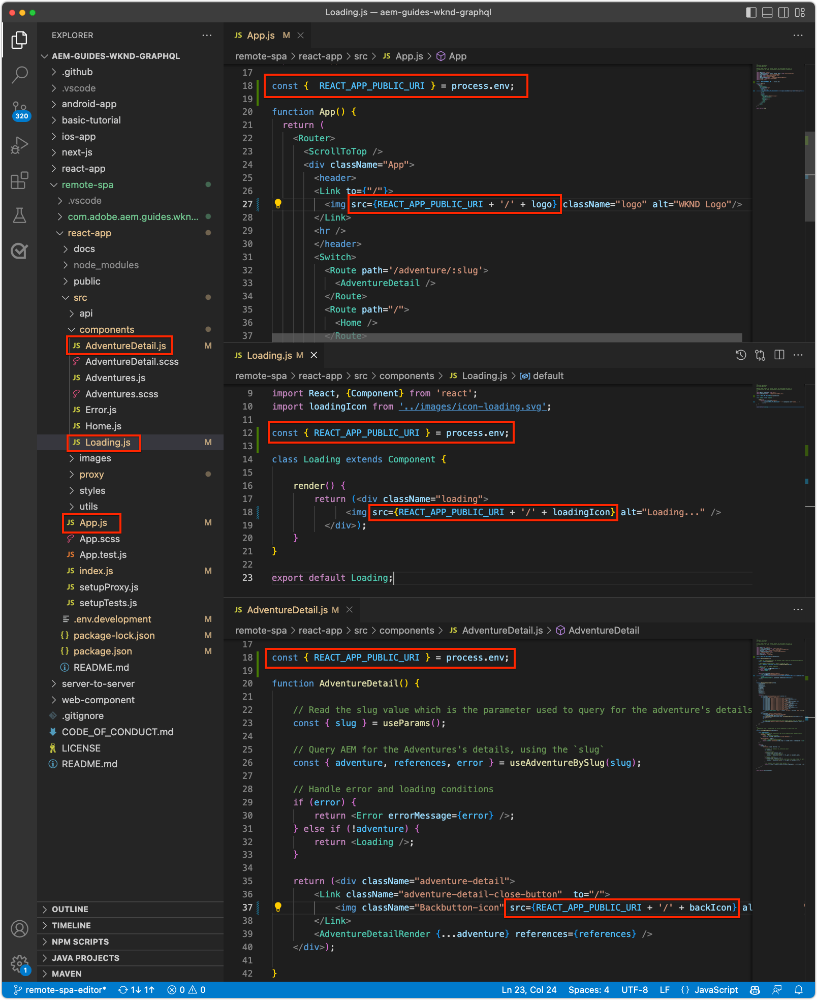

# Bootstrap del SPA remoto per l&#39;editor SPA

Prima di poter aggiungere le aree modificabili al SPA remoto, è necessario avviarle con l&#39;SDK JavaScript per l&#39;editor di SPA AEM e con alcune altre configurazioni.

## Installare AEM dipendenze npm dell’SDK JS dell’editor SPA

Innanzitutto, rivedi AEM dipendenze npm SPA per il progetto React e le installa.

+ [`@adobe/aem-spa-page-model-manager`](https://github.com/adobe/aem-spa-page-model-manager) : fornisce l’API per il recupero del contenuto da AEM.
+ [`@adobe/aem-spa-component-mapping`](https://github.com/adobe/aem-spa-component-mapping) : fornisce l’API che mappa AEM contenuto ai componenti SPA.
+ [`@adobe/aem-react-editable-components` v2](https://github.com/adobe/aem-react-editable-components) : fornisce un’API per la creazione di componenti SPA personalizzati e implementazioni di uso comune come `AEMPage` Componente React.

```shell
$ cd ~/Code/aem-guides-wknd-graphql/remote-spa-tutorial/react-app
$ npm install @adobe/aem-spa-page-model-manager 
$ npm install @adobe/aem-spa-component-mapping
$ npm install @adobe/aem-react-editable-components 
```

## Esamina le variabili di ambiente SPA

Diverse variabili di ambiente devono essere esposte al SPA remoto in modo che sappia interagire con AEM.

1. Apri progetto di SPA remoto in `~/Code/aem-guides-wknd-graphql/remote-spa-tutorial/react-app` nell’IDE
1. Aprire il file `.env.development`
1. Nel file , fai particolare attenzione alle chiavi e aggiorna in base alle esigenze:

   ```
   REACT_APP_HOST_URI=http://localhost:4502
   
   REACT_APP_USE_PROXY=true
   
   REACT_APP_AUTH_METHOD=basic
   
   REACT_APP_BASIC_AUTH_USER=admin
   REACT_APP_BASIC_AUTH_PASS=admin
   ```

   

   *Ricorda che le variabili di ambiente personalizzate in React devono avere il prefisso `REACT_APP_`.*

   + `REACT_APP_HOST_URI`: lo schema e l&#39;host del servizio AEM a cui il SPA remoto si connette.
      + Questo valore cambia in base a se l’ambiente AEM (locale, sviluppatore, stage o produzione) e il tipo di servizio AEM (autore e pubblicazione)
   + `REACT_APP_USE_PROXY`: in questo modo si evitano i problemi CORS durante lo sviluppo, indicando al server di sviluppo react le richieste di AEM proxy come `/content, /graphql, .model.json` utilizzo `http-proxy-middleware` modulo .
   + `REACT_APP_AUTH_METHOD`: metodo di autenticazione per le richieste AEM servite, le opzioni sono &quot;service-token&quot;, &quot;dev-token&quot;, &quot;basic&quot; o lasciate vuote per i casi d&#39;uso senza autenticazione
      + Richiesto per l&#39;utilizzo con AEM Author
      + Possibile utilizzo con AEM Publish (se il contenuto è protetto)
      + Lo sviluppo rispetto all’SDK AEM supporta gli account locali tramite l’autenticazione di base. Questo è il metodo utilizzato in questa esercitazione.
      + Durante l&#39;integrazione con AEM as a Cloud Service, utilizza [token di accesso](https://experienceleague.adobe.com/docs/experience-manager-learn/getting-started-with-aem-headless/authentication/overview.html)
   + `REACT_APP_BASIC_AUTH_USER`: AEM __username__ dal SPA per l’autenticazione durante il recupero del contenuto AEM.
   + `REACT_APP_BASIC_AUTH_PASS`: AEM __password__ dal SPA per l’autenticazione durante il recupero del contenuto AEM.

## Integrare l’API ModelManager

Con le dipendenze npm AEM SPA disponibili per l’app, inizializza AEM `ModelManager` nel progetto `index.js` prima `ReactDOM.render(...)` viene richiamato.

La [ModelManager](https://github.com/adobe/aem-spa-page-model-manager/blob/master/src/ModelManager.ts) è responsabile della connessione a AEM per il recupero del contenuto modificabile.

1. Apri il progetto Remote SPA nell’IDE
1. Aprire il file `src/index.js`
1. Aggiungi importazione `ModelManager` e inizializzalo prima del `root.render(..)` invocazione,

   ```javascript
   ...
   import { ModelManager } from "@adobe/aem-spa-page-model-manager";
   
   // Initialize the ModelManager before invoking root.render(..).
   ModelManager.initializeAsync();
   
   const container = document.getElementById('root');
   const root = createRoot(container);
   root.render(<App />);
   ```

La `src/index.js` dovrebbe essere simile a:


## Configurare un proxy SPA interno

Quando crei un SPA modificabile, è consigliabile impostare un [proxy interno nel SPA](https://create-react-app.dev/docs/proxying-api-requests-in-development/#configuring-the-proxy-manually), configurato per indirizzare le richieste appropriate a AEM. A tale scopo, utilizza [http: proxy-middleware](https://www.npmjs.com/package/http-proxy-middleware) modulo npm, che è già installato dall’app GraphQL WKND di base.

1. Apri il progetto Remote SPA nell’IDE
1. Apri il file in `src/proxy/setupProxy.spa-editor.auth.basic.js`
1. Aggiorna il file con il seguente codice:

   ```javascript
   const { createProxyMiddleware } = require('http-proxy-middleware');
   const {REACT_APP_HOST_URI, REACT_APP_BASIC_AUTH_USER, REACT_APP_BASIC_AUTH_PASS } = process.env;
   
   /*
       Set up a proxy with AEM for local development
       In a production environment this proxy should be set up at the webserver level or absolute URLs should be used.
   */
   module.exports = function(app) {
   
       /**
       * Filter to check if the request should be re-routed to AEM. The paths to be re-routed at:
       * - Starts with /content (AEM content)
       * - Starts with /graphql (AEM graphQL endpoint)
       * - Ends with .model.json (AEM Content Services)
       * 
       * @param {*} path the path being requested of the SPA
       * @param {*} req the request object
       * @returns true if the SPA request should be re-routed to AEM
       */
       const toAEM = function(path, req) {
           return path.startsWith('/content') || 
               path.startsWith('/graphql') ||
               path.endsWith('.model.json')
       }
   
       /**
       * Re-writes URLs being proxied to AEM such that they can resolve to real AEM resources
       * - The "root" case of `/.model.json` are rewritten to the SPA's home page in AEM
       * - .model.json requests for /adventure:xxx routes are rewritten to their corresponding adventure page under /content/wknd-app/us/en/home/adventure/ 
       * 
       * @param {*} path the path being requested of the SPA
       * @param {*} req the request object
       * @returns returns a re-written path, or nothing to use the @param path
       */
       const pathRewriteToAEM = function (path, req) { 
           if (path === '/.model.json') {
               return '/content/wknd-app/us/en/home.model.json';
           } else if (path.startsWith('/adventure/') && path.endsWith('.model.json')) {
               return '/content/wknd-app/us/en/home/adventure/' + path.split('/').pop();
           }    
       }
   
       /**
       * Register the proxy middleware using the toAEM filter and pathRewriteToAEM rewriter 
       */
       app.use(
           createProxyMiddleware(
               toAEM, // Only route the configured requests to AEM
               {
                   target: REACT_APP_HOST_URI,
                   changeOrigin: true,
                   // Pass in credentials when developing against an Author environment
                   auth: `${REACT_APP_BASIC_AUTH_USER}:${REACT_APP_BASIC_AUTH_PASS}`,
                   pathRewrite: pathRewriteToAEM // Rewrite SPA paths being sent to AEM
               }
           )
       );
   
       /**
       * Enable CORS on requests from the SPA to AEM
       * 
       * If this rule is not in place, CORS errors will occur when running the SPA on http://localhost:3000
       */
       app.use((req, res, next) => {
           res.header("Access-Control-Allow-Origin", REACT_APP_HOST_URI);
           next();
       });
   };
   ```

   La `setupProxy.spa-editor.auth.basic.js` dovrebbe essere simile a:

   

   Questa configurazione proxy esegue due operazioni principali:

   1. Proxy richieste specifiche effettuate al SPA (`http://localhost:3000`) a AEM `http://localhost:4502`
      + Proxies richiede solo i cui percorsi corrispondono a pattern che indicano che devono essere serviti da AEM, come definito in `toAEM(path, req)`.
      + Riscrive SPA percorsi verso le AEM pagine della loro controparte, come definito in `pathRewriteToAEM(path, req)`
   1. Aggiunge intestazioni CORS a tutte le richieste per consentire l&#39;accesso AEM contenuto, come definito da `res.header("Access-Control-Allow-Origin", REACT_APP_HOST_URI);`
      + Se non viene aggiunto, si verificano errori CORS durante il caricamento AEM contenuto nella SPA.

1. Aprire il file `src/setupProxy.js`
1. Rivedi la linea che punta al `setupProxy.spa-editor.auth.basic` file di configurazione proxy:

   ```
   ...
   case BASIC:
   // Use user/pass for local development with Local Author Env
   return require('./proxy/setupProxy.spa-editor.auth.basic');
   ...
   ```

Eventuali modifiche apportate al `src/setupProxy.js` oppure i file a cui si fa riferimento richiedono il riavvio del SPA.

## Risorsa SPA statica

Per le risorse statiche SPA come il logo WKND e la grafica Loading, è necessario aggiornare i propri URL src per forzarne il caricamento dall&#39;host SPA remoto. Se lasciato relativo, quando il SPA viene caricato in SPA Editor per l’authoring, questi URL vengono utilizzati per impostazione predefinita AEM host anziché il SPA, con conseguente richiesta di 404 come illustrato nell’immagine seguente.


Per risolvere questo problema, fare in modo che una risorsa statica ospitata da SPA remoto utilizzi percorsi assoluti che includono l&#39;origine SPA remota.

1. Apri il progetto SPA nell’IDE
1. Apri il file delle variabili di ambiente SPA `src/.env.development` e aggiungi una variabile per l’URI pubblico SPA:

   ```
   ...
   # The base URI the SPA is accessed from
   REACT_APP_PUBLIC_URI=http://localhost:3000
   ```

   _Quando distribuisci AEM as a Cloud Service, devi eseguire le stesse operazioni per il `.env` file._

1. Aprire il file `src/App.js`
1. Importa l’URI pubblico SPA dalle variabili di ambiente SPA

   ```javascript
   const {  REACT_APP_PUBLIC_URI } = process.env;
   
   function App() { ... }
   ```

1. Prefisso il logo WKND `` con `REACT_APP_PUBLIC_URI` per forzare la risoluzione contro il SPA.

   ```html
   
   ```

1. Esegui la stessa operazione per caricare l’immagine in `src/components/Loading.js`

   ```javascript
   const { REACT_APP_PUBLIC_URI } = process.env;
   
   class Loading extends Component {
   
       render() {
           return (<div className="loading">
               
           </div>);
       }
   }
   ```

1. E per __due istanze__ del pulsante posteriore in `src/components/AdventureDetails.js`

   ```javascript
   const { REACT_APP_PUBLIC_URI } = process.env;
   
   function AdventureDetail(props) {
       ...
       render() {
           
       }
   }
   ```

La `App.js`, `Loading.js`e `AdventureDetails.js` i file devono avere un aspetto simile a:



## AEM griglia reattiva

Per supportare la modalità di layout di SPA Editor per le aree modificabili nell’SPA, è necessario integrare CSS AEM griglia reattiva nell’SPA. Non preoccuparti - questo sistema a griglia è applicabile solo ai contenitori modificabili e puoi utilizzare il tuo sistema a griglia di scelta per guidare il layout del resto del tuo SPA.

Aggiungi i file SCSS AEM a griglia reattiva al SPA.

1. Apri il progetto SPA nell’IDE
1. Scarica e copia i seguenti due file in `src/styles`
   + [_grid.scss](./assets/spa-bootstrap/_grid.scss)
      + Generatore SCSS AEM a griglia reattiva
   + [_grid-init.scss](./assets/spa-bootstrap/_grid-init.scss)
      + Richiama `_grid.scss` utilizzo di punti di interruzione specifici SPA (desktop e dispositivi mobili) e colonne (12).
1. Apri `src/App.scss` e le importazioni `./styles/grid-init.scss`

   ```scss
   ...
   @import './styles/grid-init';
   ...
   ```

La `_grid.scss` e `_grid-init.scss` i file devono avere un aspetto simile a:


Ora il SPA include il CSS necessario per supportare AEM Modalità di layout per i componenti aggiunti a un contenitore AEM.

## Classi di utilità

Copia le seguenti classi di utilità nel progetto dell&#39;app React.

+ [RoutedLink.js](./assets/spa-bootstrap/RoutedLink.js) a `~/Code/aem-guides-wknd-graphql/remote-spa-tutorial/react-app/src/components/editable/core/RoutedLink.js`
+ [EditorPlaceholder.js](./assets/spa-bootstrap/EditorPlaceholder.js) a `~/Code/aem-guides-wknd-graphql/remote-spa-tutorial/react-app/src/components/editable/core/util/EditorPlaceholder.js`
+ [withConditionalPlaceholder.js](./assets/spa-bootstrap/withConditionalPlaceholder.js) a `~/Code/aem-guides-wknd-graphql/remote-spa-tutorial/react-app/src/components/editable/core/util/withConditionalPlaceholder.js`
+ [withStandardBaseCssClass.js](./assets/spa-bootstrap/withStandardBaseCssClass.js) a `~/Code/aem-guides-wknd-graphql/remote-spa-tutorial/react-app/src/components/editable/core/util/withStandardBaseCssClass.js`


## Avvia il SPA

Ora che il SPA è stato avviato per l&#39;integrazione con AEM, eseguiamo il SPA e vediamo che aspetto ha!

1. Nella riga di comando, individua la directory principale del progetto SPA
1. Avvia il SPA utilizzando i comandi normali (se non lo hai già fatto)

   ```shell
   $ cd ~/Code/aem-guides-wknd-graphql/remote-spa-tutorial/react-app
   $ npm install 
   $ npm run start
   ```

1. Sfoglia il SPA su [http://localhost:3000](Http://localhost:3000). Dovrebbe andare tutto bene!


## Apri il SPA in AEM Editor SPA

Con il SPA in esecuzione [http://localhost:3000](Http://localhost:3000), apriamolo con AEM editor SPA. Non è ancora possibile modificare nulla nel SPA, questo convalida solo il SPA in AEM.

1. Accedi ad AEM Author
1. Passa a __Sites > WKND App > noi > it__
1. Seleziona la __Home page app WKND__ e toccare __Modifica__ e viene visualizzata la SPA.

   

1. Passa a __Anteprima__ utilizzo dello switcher di modalità in alto a destra
1. Fai clic sul SPA

   

## Congratulazioni. 

Hai avviato il SPA remoto per essere AEM compatibile con SPA Editor! Ora sai come:

+ Aggiungi al progetto SPA le dipendenze npm dell’SDK JS dell’editor di SPA AEM
+ Configurare le variabili di ambiente SPA
+ Integra l’API ModelManager con il SPA
+ Imposta un proxy interno per il SPA in modo da indirizzare le richieste di contenuto appropriate a AEM
+ Risolvere i problemi relativi alla risoluzione delle risorse SPA statiche nel contesto dell&#39;editor SPA
+ Aggiungi CSS AEM griglia reattiva per supportare il layout in AEM contenitori modificabili

## Passaggi successivi

Ora che abbiamo raggiunto una linea di base di compatibilità con AEM editor di SPA, possiamo iniziare a introdurre aree modificabili. In primo luogo, analizziamo come inserire un [componente fisso modificabile](./spa-fixed-component.md) nel SPA.
