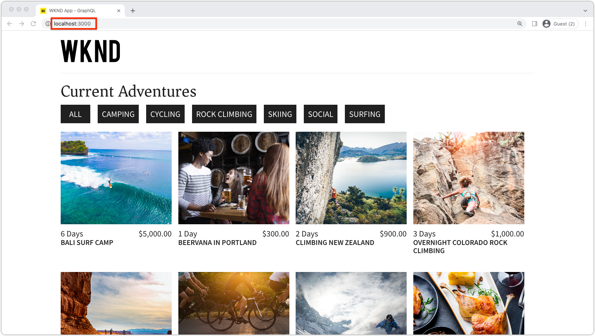

# Bootstrap del SPA remoto per l&#39;editor SPA

Prima di poter aggiungere le aree modificabili al SPA remoto, è necessario avviarle con l&#39;SDK JavaScript per l&#39;editor di SPA AEM e con alcune altre configurazioni.

## Aggiungi dipendenze npm AEM Editor JS SDK

Innanzitutto, aggiungi AEM dipendenze npm SPA al progetto React.

```
$ cd ~/Code/wknd-app/aem-guides-wknd-graphql/react-app
$ npm install --save \
    @adobe/aem-spa-page-model-manager \
    @adobe/aem-spa-component-mapping \
    @adobe/aem-react-editable-components \
    @adobe/aem-core-components-react-base \
    @adobe/aem-core-components-react-spa
```

+ `@adobe/aem-spa-page-model-manager` fornisce l’API per il recupero del contenuto da AEM.
+ `@adobe/aem-spa-component-mapping` fornisce l’API che mappa AEM contenuto su componenti SPA.
+ ` @adobe/aem-react-editable-components` fornisce un’API per la creazione di componenti SPA personalizzati e implementazioni di uso comune, come il componente  `AEMPage` React.
+ `@adobe/aem-core-components-react-base` fornisce una suite di componenti React pronti per l’uso che si integrano perfettamente con i componenti core AEM WCM e che sono agnostici dell’editor di SPA. Questi includono principalmente componenti di contenuto quali:
   + Titolo
   + Testo
   + Breadcrumb
   + E così via.
+ `@adobe/aem-core-components-react-spa` fornisce una suite di componenti React pronti all’uso che si integrano perfettamente con i componenti core di AEM WCM e richiedono però l’editor SPA. Questi contengono principalmente componenti che contengono componenti di contenuto di `@adobe/aem-core-components-react-base`, ad esempio:
   + Contenitore
   + Carosello
   + e così via.

## Esamina le variabili di ambiente SPA

Diverse variabili di ambiente devono essere esposte al SPA remoto in modo che sappia interagire con AEM.

1. Apri il progetto di SPA remota all&#39;indirizzo `~/Code/wknd-app/aem-guides-wknd-graphql/react-app` nell&#39;IDE
1. Aprire il file `.env.development`
1. Aggiungi il file , prestando particolare attenzione alle chiavi:

   ```
   REACT_APP_HOST_URI=http://localhost:4502
   REACT_APP_AUTHORIZATION=admin:admin
   ```

   

   *Le variabili di ambiente personalizzate in React devono avere il prefisso  `REACT_APP_`.*

   + `REACT_APP_AEM_URI`: lo schema e l&#39;host del servizio AEM a cui il SPA remoto si connette.
      + Questo valore cambia in base all’ambiente AEM (locale, sviluppatore, stage o produzione) e al tipo di servizio AEM (autore e pubblicazione)
   + `REACT_APP_AEM_AUTH`: le credenziali utilizzate dal SPA si autenticano per AEM e recuperare il contenuto.
      + Richiesto per l&#39;utilizzo con AEM Author
      + Possibile utilizzo con AEM Publish (se il contenuto è protetto)
      + Lo sviluppo rispetto all’SDK AEM supporta gli account locali tramite l’autenticazione di base. Questo è il metodo utilizzato in questa esercitazione.
      + Durante l&#39;integrazione con AEM come Cloud Service, utilizza [token di accesso](https://experienceleague.adobe.com/docs/experience-manager-learn/getting-started-with-aem-headless/authentication/overview.html)

## Integrare l’API ModelManager

Con le dipendenze npm SPA AEM disponibili per l’app, inizializza AEM `ModelManager` nel `index.js` del progetto prima che venga richiamato `ReactDOM.render(...)`.

La [ModelManager](https://www.npmjs.com/package/@adobe/aem-spa-page-model-manager) è responsabile della connessione a AEM per il recupero di contenuto modificabile.

1. Apri il progetto Remote SPA nell’IDE
1. Aprire il file `src/index.js`
1. Aggiungi l’importazione `ModelManager` e inizializzala prima della chiamata `ReactDOM.render(..)` ,

   ```
   ...
   import { ModelManager } from "@adobe/aem-spa-page-model-manager";
   
   // Initialize the ModelManager before invoking ReactDOM.render(...).
   ModelManager.initializeAsync();
   
   ReactDOM.render(...);
   ```

Il file `src/index.js` deve essere simile al seguente:


## Configurare un proxy SPA interno

Quando si acquistano contenuti modificabili da AEM nel SPA, è consigliabile impostare un proxy interno [nella SPA](https://create-react-app.dev/docs/proxying-api-requests-in-development/#configuring-the-proxy-manually), configurato per indirizzare le richieste appropriate a AEM. Questo viene fatto utilizzando il modulo npm [http-proxy-middleware](https://www.npmjs.com/package/http-proxy-middleware), che è già installato dall&#39;app GraphQL WKND di base.

1. Apri il progetto Remote SPA nell’IDE
1. Crea un file in `src/proxy/setupProxy.spa-editor.auth.basic.js`
1. Aggiungi al file il codice seguente:

   ```
   const { createProxyMiddleware } = require('http-proxy-middleware');
   const {REACT_APP_HOST_URI, REACT_APP_AUTHORIZATION } = process.env;
   
   /*
       Set up a proxy with AEM for local development
       In a production environment this proxy should be set up at the webserver level or absolute URLs should be used.
   */
   module.exports = function(app) {
   
       /**
       * Filter to check if the request should be re-routed to AEM. The paths to be re-routed at:
       * - Starts with /content (AEM content)
       * - Starts with /graphql (AEM graphQL endpoint)
       * - Ends with .model.json (AEM Content Services)
       * 
       * @param {*} path the path being requested of the SPA
       * @param {*} req the request object
       * @returns true if the SPA request should be re-routed to AEM
       */
       const toAEM = function(path, req) {
           return path.startsWith('/content') || 
               path.startsWith('/graphq') ||
               path.endsWith('.model.json')
       }
   
       /**
       * Re-writes URLs being proxied to AEM such that they can resolve to real AEM resources
       * - The "root" case of `/.model.json` are rewritten to the SPA's home page in AEM
       * - .model.json requests for /adventure:xxx routes are rewritten to their corresponding adventure page under /content/wknd-app/us/en/home/adventure/ 
       * 
       * @param {*} path the path being requested of the SPA
       * @param {*} req the request object
       * @returns returns a re-written path, or nothing to use the @param path
       */
       const pathRewriteToAEM = function (path, req) { 
           if (path === '/.model.json') {
               return '/content/wknd-app/us/en/home.model.json';
           } else if (path.startsWith('/adventure:') && path.endsWith('.model.json')) {
               return '/content/wknd-app/us/en/home/adventure/' + path.split('/').pop();
           }    
       }
   
       /**
       * Register the proxy middleware using the toAEM filter and pathRewriteToAEM rewriter 
       */
       app.use(
           createProxyMiddleware(
               toAEM, // Only route the configured requests to AEM
               {
                   target: REACT_APP_HOST_URI,
                   changeOrigin: true,
                   // Pass in credentials when developing against an Author environment
                   auth: REACT_APP_AUTHORIZATION,
                   pathRewrite: pathRewriteToAEM // Rewrite SPA paths being sent to AEM
               }
           )
       );
   
       /**
       * Enable CORS on requests from the SPA to AEM
       * 
       * If this rule is not in place, CORS errors will occur when running the SPA on http://localhost:3000
       */
       app.use((req, res, next) => {
           res.header("Access-Control-Allow-Origin", REACT_APP_HOST_URI);
           next();
       });
   };
   ```

   Il file `setupProxy.spa-editor.auth.basic.js` deve essere simile al seguente:

   

   Questa configurazione proxy esegue due operazioni principali:

   1. Richieste specifiche per proxy effettuate al SPA, da `http://localhost:3000` a AEM `http://localhost:4502`
      + Proxies richiede solo i cui percorsi corrispondono a pattern che indicano che devono essere serviti da AEM, come definito in `toAEM(path, req)`.
      + Riscrive SPA percorsi alle AEM delle relative controparti, come definito in `pathRewriteToAEM(path, req)`
   1. Aggiunge intestazioni CORS a tutte le richieste per consentire l&#39;accesso AEM contenuto, come definito da `res.header("Access-Control-Allow-Origin", REACT_APP_HOST_URI);`
      + Se non viene aggiunto, si verificano errori CORS durante il caricamento AEM contenuto nella SPA.

1. Aprire il file `src/setupProxy.js`
1. Aggiungi un commento alla riga `const proxy = require('./proxy/setupProxy.auth.basic')`
1. Aggiungi una riga, indicando il nuovo file di configurazione proxy:

   ```
   // Proxy configuration for SPA Editor (and GraphQL) using Basic Auth
   const proxy = require('./proxy/setupProxy.spa-editor.auth.basic')
   ```

   Il file `setupProxy.js` deve essere simile al seguente:

   

Eventuali modifiche apportate ai file `src/setupProxy.js` o ai file a cui si fa riferimento richiedono un riavvio del SPA.

## Risorsa SPA statica

Per le risorse statiche SPA come il logo WKND e la grafica Loading, è necessario aggiornare i propri URL src per forzarne il caricamento dall&#39;host SPA remoto. Se lasciato relativo, quando il SPA viene caricato in SPA Editor per l’authoring, questi URL vengono utilizzati per impostazione predefinita AEM host anziché il SPA, con conseguente richiesta di 404 come illustrato nell’immagine seguente.


Per risolvere questo problema, fare in modo che una risorsa statica ospitata da SPA remoto utilizzi percorsi assoluti che includono l&#39;origine SPA remota.

1. Apri il progetto SPA nell’IDE
1. Apri il file delle variabili di ambiente SPA `src/.env.development` e aggiungi una variabile per l’URI pubblico SPA:

   ```
   ...
   # The base URI the SPA is accessed from
   REACT_APP_PUBLIC_URI=http://localhost:3000
   ```

   _Quando distribuisci a AEM come Cloud Service, devi ottenere lo stesso per i  `.env` file corrispondenti._

1. Aprire il file `src/App.js`
1. Importa l’URI pubblico SPA dalle variabili di ambiente SPA

   ```
   const {  REACT_APP_PUBLIC_URI } = process.env;
   
   function App() { ... }
   ```

1. Aggiungi il logo WKND `` con `REACT_APP_PUBLIC_URI` per forzare la risoluzione contro il SPA.

   ```
   
   ```

1. Fai lo stesso per caricare l’immagine in `src/components/Loading.js`

   ```
   const { REACT_APP_PUBLIC_URI } = process.env;
   
   class Loading extends Component {
   
       render() {
           return (<div className="loading">
               
           </div>);
       }
   }
   ```

1. . e per le __due istanze__ del pulsante Indietro in `src/components/AdventureDetails.js`

   ```
   const { REACT_APP_PUBLIC_URI } = process.env;
   
   function AdventureDetail(props) {
       ...
       render() {
           
       }
   }
   ```

I file `App.js`, `Loading.js` e `AdventureDetails.js` devono avere un aspetto simile al seguente:


## AEM griglia reattiva

Per supportare la modalità di layout di SPA Editor per le aree modificabili nell’SPA, è necessario integrare CSS AEM griglia reattiva nell’SPA. Non preoccupatevi - questo sistema a griglia sarà solo per i contenitori modificabili e potete utilizzare il vostro sistema a griglia di scelta per guidare il layout del resto del vostro SPA.

Aggiungi i file SCSS AEM a griglia reattiva al SPA.

1. Apri il progetto SPA nell’IDE
1. Scarica e copia i seguenti due file in `src/styles`
   + [_grid.scss](./assets/spa-bootstrap/_grid.scss)
      + Generatore SCSS AEM a griglia reattiva
   + [_grid-init.scss](./assets/spa-bootstrap/_grid-init.scss)
      + Richiama `_grid.scss` utilizzando i punti di interruzione SPA specifici (desktop e mobile) e le colonne (12).
1. Apri `src/App.scss` e importa `./styles/grid-init.scss`

   ```
   ...
   @import './styles/grid-init';
   ...
   ```

I file `_grid.scss` e `_grid-init.scss` devono avere l&#39;aspetto seguente:


Ora il SPA include il CSS necessario per supportare AEM Modalità di layout per i componenti aggiunti a un contenitore AEM.

## Avvia il SPA

Ora che il SPA è stato avviato per l&#39;integrazione con AEM, eseguiamo il SPA e vediamo che aspetto ha!

1. Nella riga di comando, individua la directory principale del progetto SPA
1. Avvia il SPA utilizzando i comandi normali (esegui `npm install` se non lo hai già fatto)

   ```
   $ cd ~/Code/wknd-app/aem-guides-wknd-graphql/react-app
   $ npm install 
   $ npm run start
   ```

1. Sfoglia il SPA su [http://localhost:3000](Http://localhost:3000). Dovrebbe andare tutto bene!



## Apri il SPA in AEM Editor SPA

Con l&#39;SPA in esecuzione su [http://localhost:3000](Http://localhost:3000), aprila utilizzando AEM Editor SPA. Non è ancora possibile modificare nulla nel SPA, questo convalida solo il SPA in AEM.

1. Accedi ad AEM Author
1. Passa a __Sites > App WKND > us > en__
1. Seleziona la __Home page dell&#39;app WKND__ e tocca __Modifica__ per visualizzare il SPA.

   

1. Passa a __Anteprima__ utilizzando il commutatore di modalità in alto a destra
1. Fai clic sul SPA

   

## Congratulazioni!

Hai avviato il SPA remoto per essere AEM compatibile con SPA Editor! Ora sai come:

+ Aggiungi al progetto SPA le dipendenze npm dell’SDK JS dell’editor di SPA AEM
+ Configurare le variabili di ambiente SPA
+ Integra l’API ModelManager con il SPA
+ Imposta un proxy interno per l’SPA in modo da indirizzare le richieste di contenuto appropriate a AEM
+ Risolvere i problemi relativi alla risoluzione delle risorse SPA statiche nel contesto dell&#39;editor SPA
+ Aggiungi CSS AEM griglia reattiva per supportare il layout in AEM contenitori modificabili

## Passaggi successivi

Ora che abbiamo raggiunto una linea di base di compatibilità con AEM editor di SPA, possiamo iniziare a introdurre aree modificabili. In primo luogo, vedremo come inserire un [componente modificabile fisso](./spa-fixed-component.md) nel SPA.
