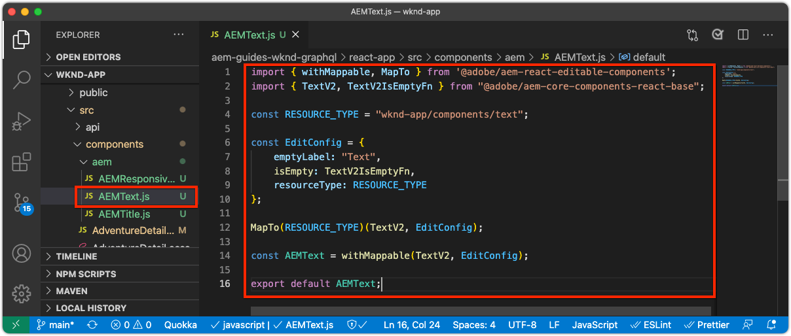
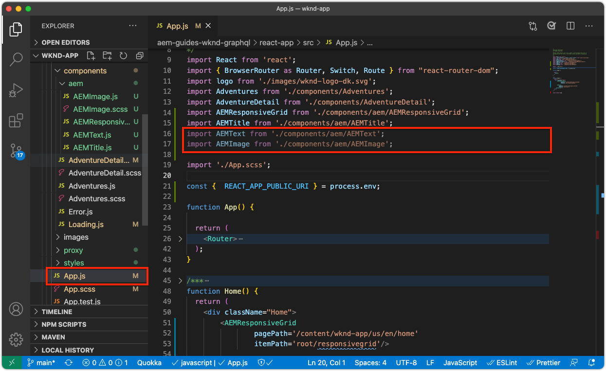

# Componenti contenitore modificabili

[I ](./spa-fixed-component.md) componenti fissi offrono una certa flessibilità per l’authoring dei contenuti SPA, tuttavia questo approccio è rigido e richiede agli sviluppatori di definire la composizione esatta dei contenuti modificabili. Per supportare la creazione di esperienze eccezionali da parte degli autori, SPA Editor supporta l’utilizzo di componenti contenitore nella SPA. I componenti contenitore consentono agli autori di trascinare e rilasciare i componenti consentiti nel contenitore e di crearli, proprio come nelle tradizionali funzioni di authoring di AEM Sites.


In questo capitolo, verrà aggiunto un contenitore modificabile alla visualizzazione Home che consente agli autori di comporre e creare il layout di esperienze di contenuti avanzati utilizzando AEM React Core Components direttamente nel SPA.

## Aggiornare l’app WKND

Per aggiungere un componente contenitore alla vista Home:

+ Importa il componente ResponsiveGrid del componente AEM React Modificable
+ Importare e registrare AEM React Core Components (Testo e Immagine) per l’utilizzo nel componente contenitore

### Importare nel componente contenitore ResponsiveGrid

Per inserire un’area modificabile nella vista Home, è necessario:

1. Importa il componente ResponsiveGrid da `@adobe/aem-react-editable-components`
1. Registralo utilizzando `withMappable` in modo che gli sviluppatori possano inserirlo nel SPA
1. Inoltre, registra con `MapTo` in modo che possa essere riutilizzato in altri componenti Container, nidificando in modo efficace i contenitori.

Per effettuare ciò:

1. Apri il progetto SPA nell’IDE
1. Crea un componente React in `src/components/aem/AEMResponsiveGrid.js`
1. Aggiungi il codice seguente a `AEMResponsiveGrid.js`

   ```
   // Import the withMappable API provided bu the AEM SPA Editor JS SDK
   import { withMappable, MapTo } from '@adobe/aem-react-editable-components';
   
   // Import the base ResponsiveGrid component
   import { ResponsiveGrid } from "@adobe/aem-react-editable-components";
   
   // The sling:resourceType for which this Core Component is registered with in AEM
   const RESOURCE_TYPE = "wcm/foundation/components/responsivegrid";
   
   // Create an EditConfig to allow the AEM SPA Editor to properly render the component in the Editor's context
   const EditConfig = {
       emptyLabel: "Layout Container",  // The component placeholder in AEM SPA Editor
       isEmpty: function(props) { 
           return props.cqItemsOrder == null || props.cqItemsOrder.length === 0;
       },                              // The function to determine if this component has been authored
       resourceType: RESOURCE_TYPE     // The sling:resourceType this SPA component is mapped to
   };
   
   // MapTo allows the AEM SPA Editor JS SDK to dynamically render components added to SPA Editor Containers
   MapTo(RESOURCE_TYPE)(ResponsiveGrid, EditConfig);
   
   // withMappable allows the component to be hardcoded into the SPA; <AEMResponsiveGrid .../>
   const AEMResponsiveGrid = withMappable(ResponsiveGrid, EditConfig);
   
   export default AEMResponsiveGrid;
   ```

Il codice è simile a `AEMTitle.js` che [ha importato il componente Titolo AEM Reach Core Components&#39;](./spa-fixed-component.md).


Il file `AEMResponsiveGrid.js` deve essere simile al seguente:


### Utilizzare il componente SPA AEMResponsiveGrid

Ora che AEM componente ResponsiveGrid è registrato e disponibile per l’uso all’interno del SPA, possiamo inserirlo nella vista Home.

1. Apri e modifica `react-app/src/App.js`
1. Importa il componente `AEMResponsiveGrid` e posizionalo sopra il componente `<AEMTitle ...>`.
1. Imposta i seguenti attributi sul componente `<AEMResponsiveGrid...>`
   + `pagePath = '/content/wknd-app/us/en/home'`
   + `itemPath = 'root/responsivegrid'`

   Questo istruzione a questo componente `AEMResponsiveGrid` di recuperare il relativo contenuto dalla risorsa AEM:

   + `/content/wknd-app/us/en/home/jcr:content/root/responsivegrid`

   Il `itemPath` viene mappato sul nodo `responsivegrid` definito nel modello di AEM `Remote SPA Page` e viene creato automaticamente sulle nuove pagine AEM create dal modello di AEM `Remote SPA Page`.

   Aggiorna `App.js` per aggiungere il componente `<AEMResponsiveGrid...>`.

   ```
   ...
   import AEMResponsiveGrid from './components/aem/AEMResponsiveGrid';
   ...
   
   function Home() {
   return (
       <div className="Home">
           <AEMResponsiveGrid
               pagePath='/content/wknd-app/us/en/home' 
               itemPath='root/responsivegrid'/>
   
           <AEMTitle
               pagePath='/content/wknd-app/us/en/home' 
               itemPath='title'/>
           <Adventures />
       </div>
   );
   }
   ```

Il file `Apps.js` deve essere simile al seguente:


## Creare componenti modificabili

Per ottenere l’effetto completo dei contenitori di esperienza di authoring flessibili forniti in SPA Editor. È già stato creato un componente Titolo modificabile, ma ne facciamo altri alcuni che consentono agli autori di utilizzare i componenti di base Testo e Immagine AEM WCM nel componente contenitore appena aggiunto.

### Componente testo

1. Apri il progetto SPA nell’IDE
1. Crea un componente React in `src/components/aem/AEMText.js`
1. Aggiungi il codice seguente a `AEMText.js`

   ```
   import { withMappable, MapTo } from '@adobe/aem-react-editable-components';
   import { TextV2, TextV2IsEmptyFn } from "@adobe/aem-core-components-react-base";
   
   const RESOURCE_TYPE = "wknd-app/components/text";
   
   const EditConfig = {    
       emptyLabel: "Text",
       isEmpty: TextV2IsEmptyFn,
       resourceType: RESOURCE_TYPE
   };
   
   MapTo(RESOURCE_TYPE)(TextV2, EditConfig);
   
   const AEMText = withMappable(TextV2, EditConfig);
   
   export default AEMText;
   ```

Il file `AEMText.js` deve essere simile al seguente:



### Componente immagine

1. Apri il progetto SPA nell’IDE
1. Crea un componente React in `src/components/aem/AEMImage.js`
1. Aggiungi il codice seguente a `AEMImage.js`

   ```
   import { withMappable, MapTo } from '@adobe/aem-react-editable-components';
   import { ImageV2, ImageV2IsEmptyFn } from "@adobe/aem-core-components-react-base";
   
   const RESOURCE_TYPE = "wknd-app/components/image";
   
   const EditConfig = {    
       emptyLabel: "Image",
       isEmpty: ImageV2IsEmptyFn,
       resourceType: RESOURCE_TYPE
   };
   
   MapTo(RESOURCE_TYPE)(ImageV2, EditConfig);
   
   const AEMImage = withMappable(ImageV2, EditConfig);
   
   export default AEMImage;
   ```

1. Crea un file SCSS `src/components/aem/AEMImage.scss` che fornisce stili personalizzati per `AEMImage.scss`. Questi stili sono destinati alle classi CSS di notazione BEM del componente di base AEM React.
1. Aggiungi il seguente SCSS a `AEMImage.scss`

   ```
   .cmp-image__image {
       margin: 1rem 0;
       width: 100%;
       border: 0;
    }
   ```

1. Importa `AEMImage.scss` in `AEMImage.js`

   ```
   ...
   import './AEMImage.scss';
   ...
   ```

I formati `AEMImage.js` e `AEMImage.scss` devono essere i seguenti:


### Importare i componenti modificabili

I componenti `AEMText` e `AEMImage` SPA appena creati sono citati nella SPA e vengono istanziati dinamicamente in base al JSON restituito da AEM. Per garantire che questi componenti siano disponibili per il SPA, crea le relative istruzioni di importazione in `App.js`

1. Apri il progetto SPA nell’IDE
1. Aprire il file `src/App.js`
1. Aggiungi istruzioni di importazione per `AEMText` e `AEMImage`

   ```
   ...
   import AEMText from './components/aem/AEMText';
   import AEMImage from './components/aem/AEMImage';
   ...
   ```


Il risultato dovrebbe essere simile al seguente:



Se queste importazioni sono _non_ aggiunte, il codice `AEMText` e `AEMImage` non verrà richiamato da SPA, e quindi i componenti non verranno registrati rispetto ai tipi di risorse specificati.

## Configurazione del contenitore in AEM

I componenti contenitore AEM utilizzano i criteri per dettare i componenti consentiti. Si tratta di una configurazione critica quando si utilizza SPA Editor, in quanto solo AEM componenti core WCM che hanno mappato SPA controparti dei componenti possono essere sottoposti a rendering dal SPA. Assicurati che siano consentiti solo i componenti per i quali abbiamo fornito SPA implementazioni:

+ `AEMTitle` mappato su  `wknd-app/components/title`
+ `AEMText` mappato su  `wknd-app/components/text`
+ `AEMImage` mappato su  `wknd-app/components/image`

Per configurare il contenitore reponsivegrid del modello di pagina SPA remota:

1. Accedi ad AEM Author
1. Passa a __Strumenti > Generale > Modelli > App WKND__
1. Modifica __SPA report Pagina__

   

1. Seleziona __Struttura__ nel commutatore di modalità in alto a destra
1. Tocca per selezionare il __Contenitore di layout__
1. Tocca l’icona __Policy__ nella barra a comparsa

   

1. A destra, nella scheda __Componenti consentiti__ , espandi __APP WKND - CONTENT__
1. Assicurati che siano selezionati solo i seguenti elementi:
   + Immagine
   + Testo
   + Titolo

   

1. Toccate __Chiudi__

## Creazione del contenitore in AEM

Con l’SPA aggiornato per incorporare i `<AEMResponsiveGrid...>`, i wrapper per tre componenti AEM React Core (`AEMTitle`, `AEMText` e `AEMImage`) e AEM aggiornato con un criterio Modello corrispondente, possiamo iniziare a creare contenuti nel componente contenitore.

1. Accedi ad AEM Author
1. Passa a __Siti > App WKND__
1. Tocca __Home__ e seleziona __Modifica__ dalla barra delle azioni superiore
   + Viene visualizzato un componente Testo &quot;Ciao a tutti&quot;, che viene aggiunto automaticamente durante la generazione del progetto dall’archetipo AEM progetto
1. Seleziona __Modifica__ dal selettore della modalità in alto a destra nell’Editor pagina
1. Posiziona l’area modificabile __Contenitore di layout__ sotto il titolo
1. Apri la __barra laterale dell&#39;Editor pagina__ e seleziona la __vista Componenti__
1. Trascina i seguenti componenti nel __Contenitore di layout__
   + Immagine
   + Titolo
1. Trascina i componenti per riordinarli nell’ordine seguente:
   1. Titolo
   1. Immagine
   1. Testo
1. ____ Authoring del componente  ____ Titlecomponent
   1. Tocca il componente Titolo e tocca l’icona __chiave inglese__ in __modifica__ il componente Titolo
   1. Aggiungi il testo seguente:
      + Titolo: __L&#39;estate sta arrivando, sfruttiamo al massimo!__
      + Tipo: __H1__
   1. Toccate __Chiudi__
1. ____ Authoring del componente  ____ Imagecomponent
   1. Trascina un’immagine dalla barra laterale (dopo il passaggio alla visualizzazione Risorse) sul componente Immagine
   1. Tocca il componente Immagine e tocca l’icona __chiave inglese__ per modificare
   1. Selezionare la casella di controllo __L&#39;immagine è decorativa__
   1. Toccate __Chiudi__
1. ____ Authoring del  ____ componente Testo
   1. Modifica il componente Testo toccando il componente Testo e toccando l’icona __chiave inglese__
   1. Aggiungi il testo seguente:
      + _In questo momento, è possibile ottenere il 15% su tutte le avventure di 1 settimana, e il 20% di sconto su tutte le avventure che sono 2 settimane o più! Al momento del pagamento, aggiungi il codice della campagna SOMMERISVENING per ottenere i tuoi sconti!_
   1. Toccate __Chiudi__

1. I componenti vengono ora creati, ma vengono sovrapposti verticalmente.

   

   Utilizza AEM modalità Layout per modificare le dimensioni e il layout dei componenti.

1. Passa a __Modalità layout__ utilizzando il selettore di modalità in alto a destra
1. ____ Ridimensiona i componenti Immagine e Testo in modo che siano affiancati
   + ____ Il componente immagine deve essere largo  __8 colonne__
   + ____ Il componente Testo deve essere largo  __3 colonne__

   

1. ____ Anteprima delle modifiche in AEM Editor pagina
1. Aggiorna l&#39;app WKND in esecuzione localmente su [http://localhost:3000](Http://localhost:3000) per visualizzare le modifiche create!

   


## Congratulazioni!

Hai aggiunto un componente contenitore che consente agli autori di aggiungere componenti modificabili all’app WKND. Ora sai come:

+ Utilizza il componente AEM React Modificable Component’s ResponsiveGrid nel SPA
+ Registra AEM React Core Components (Testo e Immagine) per l’utilizzo nell’SPA tramite il componente contenitore
+ Configurare il modello Pagina SPA remota per consentire i componenti core abilitati per SPA
+ Aggiungere componenti modificabili al componente contenitore
+ Componenti di authoring e layout nell’Editor SPA

## Passaggi successivi

Il passaggio successivo utilizzerà questa stessa tecnica per [aggiungere un componente modificabile a un percorso Dettagli avventura](./spa-dynamic-routes.md) nel SPA.
