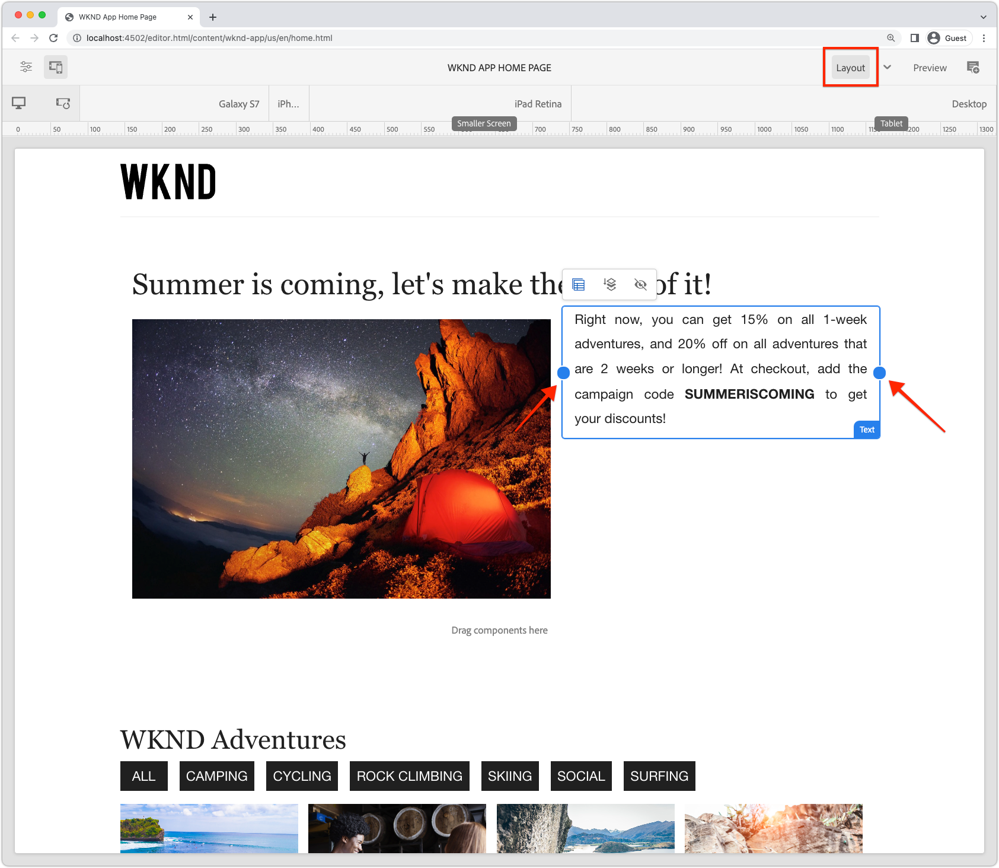

# Componenti contenitore modificabili

[Componenti fissi](./spa-fixed-component.md) offre una certa flessibilità per l’authoring dei contenuti SPA, tuttavia questo approccio è rigido e richiede agli sviluppatori di definire la composizione esatta dei contenuti modificabili. Per supportare la creazione di esperienze eccezionali da parte degli autori, l’Editor SPA supporta l’utilizzo di componenti contenitore nell’SPA. I componenti contenitore consentono agli autori di trascinare e rilasciare i componenti consentiti nel contenitore e di crearli, come fanno nell’authoring AEM Sites tradizionale.


In questo capitolo viene aggiunto un contenitore modificabile alla visualizzazione Home che consente agli autori di comporre e creare il layout di esperienze con contenuti avanzati utilizzando i componenti React modificabili direttamente nell’SPA.

## Aggiornare l’app WKND

Per aggiungere un componente contenitore alla vista Home:

+ Importare i componenti modificabili di React dell’AEM `ResponsiveGrid` componente
+ Importare e registrare componenti React modificabili personalizzati (testo e immagine) da utilizzare nel componente ResponsiveGrid

### Utilizzare il componente ResponsiveGrid

Per aggiungere un&#39;area modificabile alla vista Home:

1. Apri e modifica `react-app/src/components/Home.js`
1. Importa `ResponsiveGrid` componente da `@adobe/aem-react-editable-components` e aggiungerlo al `Home` componente.
1. Imposta i seguenti attributi su `<ResponsiveGrid...>` componente
   + `pagePath = '/content/wknd-app/us/en/home'`
   + `itemPath = 'root/responsivegrid'`

   Questo istruisce il `ResponsiveGrid` componente per recuperarne il contenuto dalla risorsa AEM:

   + `/content/wknd-app/us/en/home/jcr:content/root/responsivegrid`

   Il `itemPath` mappa su `responsivegrid` nodo definito in `Remote SPA Page` modello AEM e viene creato automaticamente nelle nuove pagine AEM create dal `Remote SPA Page` Modello AEM.

   Aggiorna `Home.js` per aggiungere `<ResponsiveGrid...>` componente.

   ```javascript
   ...
   import { ResponsiveGrid } from '@adobe/aem-react-editable-components';
   ...
   
   function Home() {
       return (
           <div className="Home">
               <ResponsiveGrid
                   pagePath='/content/wknd-app/us/en/home' 
                   itemPath='root/responsivegrid'/>
   
               <EditableTitle
                   pagePath='/content/wknd-app/us/en/home' 
                   itemPath='title'/>
   
               <Adventures />
           </div>
       );
   }
   ```

Il `Home.js` il file dovrebbe avere un aspetto simile a:


## Creare componenti modificabili

Ottenere il pieno effetto dei contenitori di esperienza di authoring flessibili forniti nell’editor SPA. È già stato creato un componente Titolo modificabile, ma creiamo alcuni altri che consentono agli autori di utilizzare componenti Testo e Immagine modificabili nel componente ResponsiveGrid appena aggiunto.

I nuovi componenti Testo e Immagine modificabili di React vengono creati utilizzando il pattern di definizione del componente modificabile esportato in [componenti fissi modificabili](./spa-fixed-component.md).

### Componente testo modificabile

1. Aprire il progetto SPA nell’IDE
1. Creare un componente React in `src/components/editable/core/Text.js`
1. Aggiungi il seguente codice a `Text.js`

   ```javascript
   import React from 'react'
   
   const TextPlain = (props) => <div className={props.baseCssClass}><p className="cmp-text__paragraph">{props.text}</p></div>;
   const TextRich = (props) => {
   const text = props.text;
   const id = (props.id) ? props.id : (props.cqPath ? props.cqPath.substr(props.cqPath.lastIndexOf('/') + 1) : "");
       return <div className={props.baseCssClass} id={id} data-rte-editelement dangerouslySetInnerHTML={{ __html: text }} />
   };
   
   export const Text = (props) => {
       if (!props.baseCssClass) {
           props.baseCssClass = 'cmp-text'
       }
   
       const { richText = false } = props
   
       return richText ? <TextRich {...props} /> : <TextPlain {...props} />
       }
   
       export function textIsEmpty(props) {
       return props.text == null || props.text.length === 0;
   }
   ```

1. Creare un componente React modificabile in `src/components/editable/EditableText.js`
1. Aggiungi il seguente codice a `EditableText.js`

   ```javascript
   import React from 'react'
   import { EditableComponent, MapTo } from '@adobe/aem-react-editable-components';
   import { Text, textIsEmpty } from "./core/Text";
   import { withConditionalPlaceHolder } from "./core/util/withConditionalPlaceholder";
   import { withStandardBaseCssClass } from "./core/util/withStandardBaseCssClass";
   
   const RESOURCE_TYPE = "wknd-app/components/text";
   
   const EditConfig = {
       emptyLabel: "Text",
       isEmpty: textIsEmpty,
       resourceType: RESOURCE_TYPE
   };
   
   export const WrappedText = (props) => {
       const Wrapped = withConditionalPlaceHolder(withStandardBaseCssClass(Text, "cmp-text"), textIsEmpty, "Text V2")
       return <Wrapped {...props} />
   };
   
   const EditableText = (props) => <EditableComponent config={EditConfig} {...props}><WrappedText /></EditableComponent>
   
   MapTo(RESOURCE_TYPE)(EditableText);
   
   export default EditableText;
   ```

L’implementazione del componente Testo modificabile deve essere simile alla seguente:


### Componente immagine

1. Aprire il progetto SPA nell’IDE
1. Creare un componente React in `src/components/editable/core/Image.js`
1. Aggiungi il seguente codice a `Image.js`

   ```javascript
   import React from 'react'
   import { RoutedLink } from "./RoutedLink";
   
   export const imageIsEmpty = (props) => (!props.src) || props.src.trim().length === 0
   
   const ImageInnerContents = (props) => {
   return (<>
       
       {
           !!(props.title) && <span className={props.baseCssClass + '__title'} itemProp="caption">{props.title}</span>
       }
       {
           props.displayPopupTitle && (!!props.title) && <meta itemProp="caption" content={props.title} />
       }
       </>);
   };
   
   const ImageContents = (props) => {
       if (props.link && props.link.trim().length > 0) {
           return (
           <RoutedLink className={props.baseCssClass + '__link'} isRouted={props.routed} to={props.link}>
               <ImageInnerContents {...props} />
           </RoutedLink>
           )
       }
       return <ImageInnerContents {...props} />
   };
   
   export const Image = (props) => {
       if (!props.baseCssClass) {
           props.baseCssClass = 'cmp-image'
       }
   
       const { isInEditor = false } = props;
       const cssClassName = (isInEditor) ? props.baseCssClass + ' cq-dd-image' : props.baseCssClass;
   
       return (
           <div className={cssClassName}>
               <ImageContents {...props} />
           </div>
       )
   };
   ```

1. Creare un componente React modificabile in `src/components/editable/EditableImage.js`
1. Aggiungi il seguente codice a `EditableImage.js`

```javascript
import { EditableComponent, MapTo } from '@adobe/aem-react-editable-components';
import { Image, imageIsEmpty } from "./core/Image";
import React from 'react'

import { withConditionalPlaceHolder } from "./core/util/withConditionalPlaceholder";
import { withStandardBaseCssClass } from "./core/util/withStandardBaseCssClass";

const RESOURCE_TYPE = "wknd-app/components/image";

const EditConfig = {
    emptyLabel: "Image",
    isEmpty: imageIsEmpty,
    resourceType: RESOURCE_TYPE
};

const WrappedImage = (props) => {
    const Wrapped = withConditionalPlaceHolder(withStandardBaseCssClass(Image, "cmp-image"), imageIsEmpty, "Image V2");
    return <Wrapped {...props}/>
}

const EditableImage = (props) => <EditableComponent config={EditConfig} {...props}><WrappedImage /></EditableComponent>

MapTo(RESOURCE_TYPE)(EditableImage);

export default EditableImage;
```


1. Creare un file SCSS `src/components/editable/EditableImage.scss` che fornisce stili personalizzati per `EditableImage.scss`. Questi stili sono destinati alle classi CSS del componente React modificabile.
1. Aggiungi il seguente SCSS a `EditableImage.scss`

   ```css
   .cmp-image__image {
       margin: 1rem 0;
       width: 100%;
       border: 0;
    }
   ```

1. Importa `EditableImage.scss` in `EditableImage.js`

   ```javascript
   ...
   import './EditableImage.scss';
   ...
   ```

L’implementazione del componente Immagine modificabile sarà simile alla seguente:


### Importare i componenti modificabili

Il nuovo `EditableText` e `EditableImage` I componenti React sono indicati nell’SPA e vengono istanziati in modo dinamico in base al JSON restituito dall’AEM. Per garantire che questi componenti siano disponibili per l’SPA, crea le relative istruzioni di importazione in `Home.js`

1. Aprire il progetto SPA nell’IDE
1. Apri il file `src/Home.js`
1. Aggiungi istruzioni di importazione per `AEMText` e `AEMImage`

   ```javascript
   ...
   // The following need to be imported, so that MapTo is run for the components
   import EditableText from './editable/EditableText';
   import EditableImage from './editable/EditableImage';
   ...
   ```

Il risultato dovrebbe essere simile al seguente:


Se tali importazioni sono _non_ aggiunto, il `EditableText` e `EditableImage` Il codice non può essere richiamato dall’SPA e, pertanto, i componenti non sono mappati sui tipi di risorse forniti.

## Configurazione del contenitore in AEM

I componenti contenitore AEM utilizzano i criteri per determinare i componenti consentiti. Si tratta di una configurazione critica quando si utilizza l’editor SPA, in quanto solo i componenti AEM che hanno mappato le controparti dei componenti SPA possono essere sottoposti a rendering da parte dell’SPA. Assicurati che siano consentiti solo i componenti per i quali abbiamo fornito le implementazioni SPA:

+ `EditableTitle` mappato a `wknd-app/components/title`
+ `EditableText` mappato a `wknd-app/components/text`
+ `EditableImage` mappato a `wknd-app/components/image`

Per configurare il contenitore reponsivegrid del modello Pagina SPA remota:

1. Accedi ad AEM Author
1. Accedi a __Strumenti > Generale > Modelli > App WKND__
1. Modifica __Pagina Report SPA__

   

1. Seleziona __Struttura__ nel commutatore modalità in alto a destra
1. Tocca per selezionare __Contenitore di layout__
1. Tocca il __Policy__ icona nella barra a comparsa

   

1. A destra, sotto __Componenti consentiti__ , espandere __APP WKND - CONTENUTO__
1. Accertati che siano selezionati solo i seguenti elementi:
   + Immagine
   + Testo
   + Titolo

   

1. Tocca __Fine__

## Authoring del contenitore nell’AEM

Dopo che l’SPA è stato aggiornato per incorporare il `<ResponsiveGrid...>`, wrapper per tre componenti React modificabili (`EditableTitle`, `EditableText`, e `EditableImage`), e l’AEM viene aggiornato con un criterio del modello corrispondente, possiamo iniziare a creare contenuti nel componente contenitore.

1. Accedi ad AEM Author
1. Accedi a __Sites > App WKND__
1. Tocca __Home__ e seleziona __Modifica__ dalla barra delle azioni superiore
   + Viene visualizzato un componente di testo &quot;Hello World&quot;, che veniva aggiunto automaticamente durante la generazione del progetto dall’archetipo del progetto AEM
1. Seleziona __Modifica__ dal selettore modalità in alto a destra nell’Editor pagina
1. Individua il __Contenitore di layout__ area modificabile sotto il titolo
1. Apri __Barra laterale dell’Editor pagina__, e seleziona la __Vista Componenti__
1. Trascina i seguenti componenti in __Contenitore di layout__
   + Immagine
   + Titolo
1. Trascina i componenti per riordinarli nell’ordine seguente:
   1. Titolo
   1. Immagine
   1. Testo
1. __Autore__ il __Titolo__ componente
   1. Tocca il componente Titolo, quindi tocca il __chiave inglese__ icona a __modifica__ il componente Titolo
   1. Aggiungere il testo seguente:
      + Titolo: __L&#39;estate sta arrivando, sfruttiamola al massimo!__
      + Tipo: __H1__
   1. Tocca __Fine__
1. __Autore__ il __Immagine__ componente
   1. Trascina un’immagine in dalla barra laterale (dopo il passaggio alla vista Risorse) del componente Immagine
   1. Tocca il componente Immagine, quindi tocca __chiave inglese__ icona da modificare
   1. Controlla la __L&#39;immagine è decorativa__ casella di controllo
   1. Tocca __Fine__
1. __Autore__ il __Testo__ componente
   1. Modifica il componente Testo toccando il componente Testo e toccando il __chiave inglese__ icona
   1. Aggiungere il testo seguente:
      + _In questo momento, puoi ottenere il 15% su tutte le avventure di 1 settimana e il 20% di sconto su tutte le avventure che sono di 2 settimane o più! Al momento del pagamento, aggiungi il codice della campagna SUMMERISCOMING per ottenere i tuoi sconti!_
   1. Tocca __Fine__

1. I componenti ora sono creati, ma si sovrappongono in verticale.

   

Utilizza la modalità Layout AEM per regolare le dimensioni e il layout dei componenti.

1. Passa a __Modalità Layout__ utilizzo del selettore modalità in alto a destra
1. __Ridimensiona__ i componenti Immagine e Testo, in modo che siano affiancati
   + __Immagine__ il componente deve essere __Larghezza 8 colonne__
   + __Testo__ il componente deve essere __Larghezza 3 colonne__

   

1. __Anteprima__ le modifiche apportate nell’Editor pagina per AEM
1. Aggiorna l’app WKND in esecuzione localmente il [http://localhost:3000](Http://localhost:3000) per visualizzare le modifiche create.

   


## Congratulazioni. 

Hai aggiunto un componente contenitore che consente agli autori di aggiungere componenti modificabili all’app WKND. Ora sai come:

+ Utilizzare i componenti modificabili del React dell’AEM `ResponsiveGrid` componente dell&#39;SPA
+ Creare e registrare componenti React modificabili (testo e immagine) da utilizzare nell’SPA tramite il componente contenitore
+ Configurare il modello Pagina SPA remota per consentire i componenti abilitati per SPA
+ Aggiungere componenti modificabili al componente contenitore
+ Componenti di authoring e layout nell’editor SPA

## Passaggi successivi

Il passaggio successivo utilizza la stessa tecnica per [aggiungere un componente modificabile a un ciclo di lavorazione Dettagli avventura](./spa-dynamic-routes.md) dell&#39;SPA.
