# Componenti contenitore modificabili

{{spa-editor-deprecation}}

[I componenti fissi](./spa-fixed-component.md) offrono una certa flessibilità per l&#39;authoring dei contenuti SPA, tuttavia questo approccio è rigido e richiede agli sviluppatori di definire la composizione esatta dei contenuti modificabili. Per supportare la creazione di esperienze eccezionali da parte degli autori, l’Editor SPA supporta l’utilizzo di componenti contenitore nell’SPA. I componenti contenitore consentono agli autori di trascinare e rilasciare i componenti consentiti nel contenitore e di crearli, come fanno nell’authoring AEM Sites tradizionale.

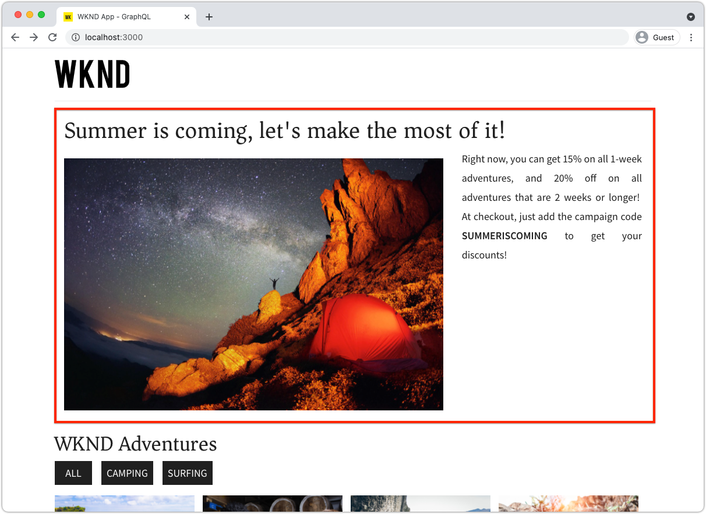

In questo capitolo, viene aggiunto un contenitore modificabile alla visualizzazione Home che consente agli autori di comporre e creare il layout di esperienze con contenuti avanzati utilizzando i componenti React modificabili direttamente nell’applicazione a pagina singola.

## Aggiornare l’app WKND

Per aggiungere un componente contenitore alla vista Home:

* Importa il componente `ResponsiveGrid` del componente AEM React Editable
* Importare e registrare componenti React modificabili personalizzati (testo e immagine) da utilizzare nel componente ResponsiveGrid

### Utilizzare il componente ResponsiveGrid

Per aggiungere un&#39;area modificabile alla vista Home:

1. Apri e modifica `react-app/src/components/Home.js`
1. Importare il componente `ResponsiveGrid` da `@adobe/aem-react-editable-components` e aggiungerlo al componente `Home`.
1. Imposta i seguenti attributi sul componente `<ResponsiveGrid...>`
   1. `pagePath = '/content/wknd-app/us/en/home'`
   1. `itemPath = 'root/responsivegrid'`

   Questo indica al componente `ResponsiveGrid` di recuperare il contenuto dalla risorsa AEM:

   1. `/content/wknd-app/us/en/home/jcr:content/root/responsivegrid`

   `itemPath` è mappato al nodo `responsivegrid` definito nel modello AEM `Remote SPA Page` e viene creato automaticamente nelle nuove pagine AEM create dal modello AEM `Remote SPA Page`.

   Aggiornare `Home.js` per aggiungere il componente `<ResponsiveGrid...>`.

   ```javascript
   ...
   import { ResponsiveGrid } from '@adobe/aem-react-editable-components';
   ...
   
   function Home() {
       return (
           <div className="Home">
               <ResponsiveGrid
                   pagePath='/content/wknd-app/us/en/home' 
                   itemPath='root/responsivegrid'/>
   
               <EditableTitle
                   pagePath='/content/wknd-app/us/en/home' 
                   itemPath='title'/>
   
               <Adventures />
           </div>
       );
   }
   ```

Il file `Home.js` deve essere simile al seguente:

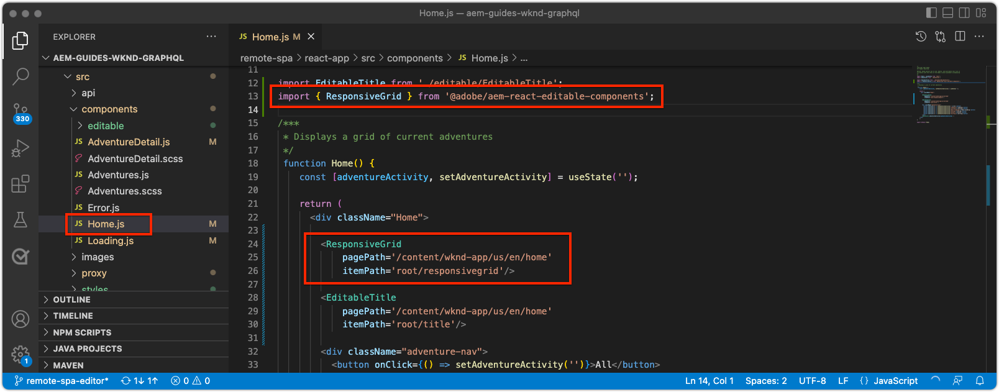

## Creare componenti modificabili

Ottenere il pieno effetto dei contenitori di esperienza di authoring flessibili forniti nell’editor SPA. È già stato creato un componente Titolo modificabile, ma creiamo alcuni altri che consentono agli autori di utilizzare componenti Testo e Immagine modificabili nel componente ResponsiveGrid appena aggiunto.

I nuovi componenti Text e Image React modificabili vengono creati utilizzando il modello di definizione del componente modificabile esportato in [componenti fissi modificabili](./spa-fixed-component.md).

### Componente testo modificabile

1. Apri il progetto SPA nell’IDE
1. Crea un componente React in `src/components/editable/core/Text.js`
1. Aggiungi il seguente codice a `Text.js`

   ```javascript
   import React from 'react'
   
   const TextPlain = (props) => <div className={props.baseCssClass}><p className="cmp-text__paragraph">{props.text}</p></div>;
   const TextRich = (props) => {
   const text = props.text;
   const id = (props.id) ? props.id : (props.cqPath ? props.cqPath.substr(props.cqPath.lastIndexOf('/') + 1) : "");
       return <div className={props.baseCssClass} id={id} data-rte-editelement dangerouslySetInnerHTML={{ __html: text }} />
   };
   
   export const Text = (props) => {
       if (!props.baseCssClass) {
           props.baseCssClass = 'cmp-text'
       }
   
       const { richText = false } = props
   
       return richText ? <TextRich {...props} /> : <TextPlain {...props} />
       }
   
       export function textIsEmpty(props) {
       return props.text == null || props.text.length === 0;
   }
   ```

1. Crea un componente React modificabile in `src/components/editable/EditableText.js`
1. Aggiungi il seguente codice a `EditableText.js`

   ```javascript
   import React from 'react'
   import { EditableComponent, MapTo } from '@adobe/aem-react-editable-components';
   import { Text, textIsEmpty } from "./core/Text";
   import { withConditionalPlaceHolder } from "./core/util/withConditionalPlaceholder";
   import { withStandardBaseCssClass } from "./core/util/withStandardBaseCssClass";
   
   const RESOURCE_TYPE = "wknd-app/components/text";
   
   const EditConfig = {
       emptyLabel: "Text",
       isEmpty: textIsEmpty,
       resourceType: RESOURCE_TYPE
   };
   
   export const WrappedText = (props) => {
       const Wrapped = withConditionalPlaceHolder(withStandardBaseCssClass(Text, "cmp-text"), textIsEmpty, "Text V2")
       return <Wrapped {...props} />
   };
   
   const EditableText = (props) => <EditableComponent config={EditConfig} {...props}><WrappedText /></EditableComponent>
   
   MapTo(RESOURCE_TYPE)(EditableText);
   
   export default EditableText;
   ```

L’implementazione del componente Testo modificabile deve essere simile alla seguente:

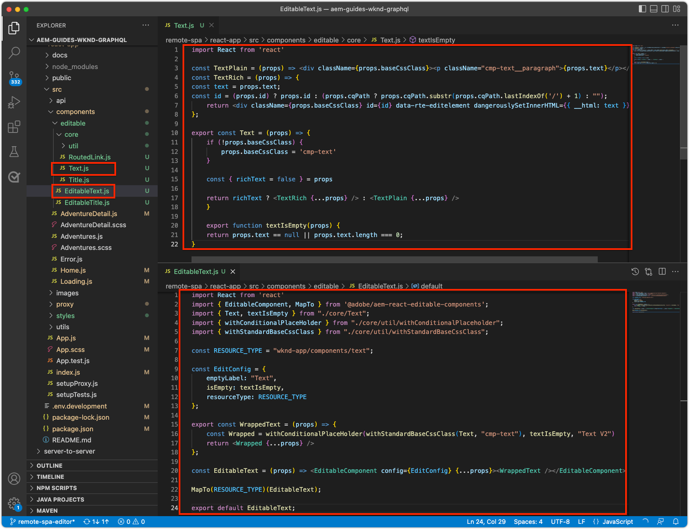

### Componente immagine

1. Apri il progetto SPA nell’IDE
1. Crea un componente React in `src/components/editable/core/Image.js`
1. Aggiungi il seguente codice a `Image.js`

   ```javascript
   import React from 'react'
   import { RoutedLink } from "./RoutedLink";
   
   export const imageIsEmpty = (props) => (!props.src) || props.src.trim().length === 0
   
   const ImageInnerContents = (props) => {
   return (<>
       
       {
           !!(props.title) && <span className={props.baseCssClass + '__title'} itemProp="caption">{props.title}</span>
       }
       {
           props.displayPopupTitle && (!!props.title) && <meta itemProp="caption" content={props.title} />
       }
       </>);
   };
   
   const ImageContents = (props) => {
       if (props.link && props.link.trim().length > 0) {
           return (
           <RoutedLink className={props.baseCssClass + '__link'} isRouted={props.routed} to={props.link}>
               <ImageInnerContents {...props} />
           </RoutedLink>
           )
       }
       return <ImageInnerContents {...props} />
   };
   
   export const Image = (props) => {
       if (!props.baseCssClass) {
           props.baseCssClass = 'cmp-image'
       }
   
       const { isInEditor = false } = props;
       const cssClassName = (isInEditor) ? props.baseCssClass + ' cq-dd-image' : props.baseCssClass;
   
       return (
           <div className={cssClassName}>
               <ImageContents {...props} />
           </div>
       )
   };
   ```

1. Crea un componente React modificabile in `src/components/editable/EditableImage.js`
1. Aggiungi il seguente codice a `EditableImage.js`

```javascript
import { EditableComponent, MapTo } from '@adobe/aem-react-editable-components';
import { Image, imageIsEmpty } from "./core/Image";
import React from 'react'

import { withConditionalPlaceHolder } from "./core/util/withConditionalPlaceholder";
import { withStandardBaseCssClass } from "./core/util/withStandardBaseCssClass";

const RESOURCE_TYPE = "wknd-app/components/image";

const EditConfig = {
    emptyLabel: "Image",
    isEmpty: imageIsEmpty,
    resourceType: RESOURCE_TYPE
};

const WrappedImage = (props) => {
    const Wrapped = withConditionalPlaceHolder(withStandardBaseCssClass(Image, "cmp-image"), imageIsEmpty, "Image V2");
    return <Wrapped {...props}/>
}

const EditableImage = (props) => <EditableComponent config={EditConfig} {...props}><WrappedImage /></EditableComponent>

MapTo(RESOURCE_TYPE)(EditableImage);

export default EditableImage;
```


1. Creare un file SCSS `src/components/editable/EditableImage.scss` che fornisce stili personalizzati per `EditableImage.scss`. Questi stili sono destinati alle classi CSS del componente React modificabile.
1. Aggiungi il seguente SCSS a `EditableImage.scss`

   ```css
   .cmp-image__image {
       margin: 1rem 0;
       width: 100%;
       border: 0;
    }
   ```

1. Importa `EditableImage.scss` in `EditableImage.js`

   ```javascript
   ...
   import './EditableImage.scss';
   ...
   ```

L’implementazione del componente Immagine modificabile sarà simile alla seguente:

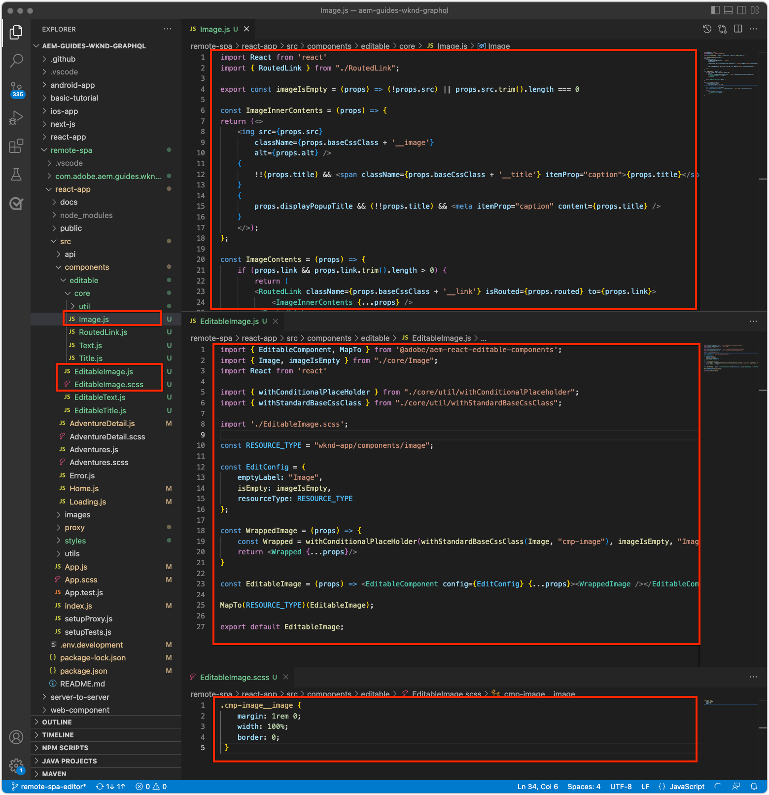


### Importare i componenti modificabili

Nell&#39;applicazione a pagina singola viene fatto riferimento ai componenti React `EditableText` e `EditableImage` appena creati e vengono create dinamicamente in base al JSON restituito da AEM. Per assicurarsi che questi componenti siano disponibili per l&#39;applicazione a pagina singola, creare le relative istruzioni di importazione in `Home.js`

1. Apri il progetto SPA nell’IDE
1. Apri il file in `src/Home.js`
1. Aggiungi istruzioni di importazione per `AEMText` e `AEMImage`

   ```javascript
   ...
   // The following need to be imported, so that MapTo is run for the components
   import EditableText from './editable/EditableText';
   import EditableImage from './editable/EditableImage';
   ...
   ```

The result should look like:

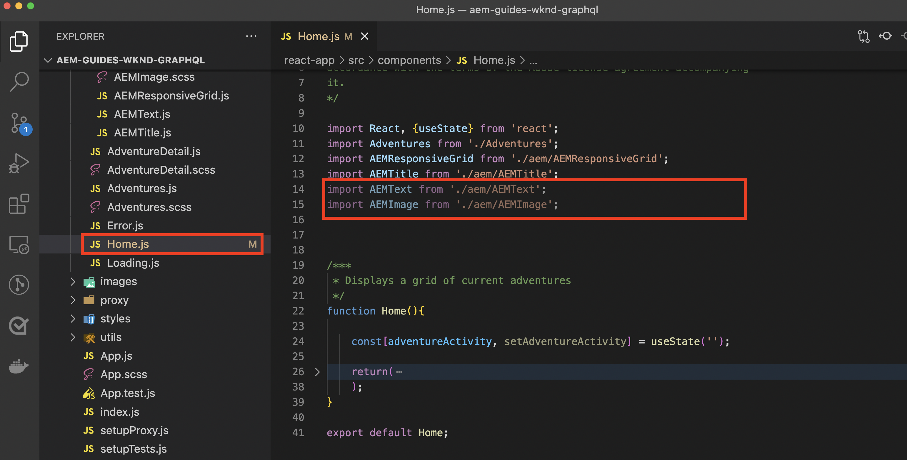

If these imports are _not_ added, the `EditableText` and `EditableImage` code is not be invoked by SPA, and thus, the components are not mapped to the provided resource types.

## Configuring the container in AEM

AEM container components use policies to dictate their allowed components. This is a critical configuration when using SPA Editor, since only AEM Components that have mapped SPA component counterparts are render-able by the SPA. Ensure only the components which we&#39;ve provided SPA implementations for are allowed:

* `EditableTitle` mapped to `wknd-app/components/title`
* `EditableText` mapped to `wknd-app/components/text`
* `EditableImage` mapped to `wknd-app/components/image`

To configure the Remote SPA Page template&#39;s reponsivegrid container:

1. Accedi ad AEM Author
1. Navigate to __Tools > General > Templates > WKND App__
1. Edit __Report SPA Page__

   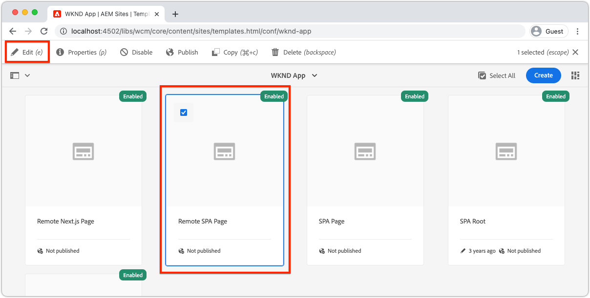

1. Select __Structure__ in the mode switcher in the top right
1. Tap to select the __Layout Container__
1. Tap the __Policy__ icon in the popup bar

   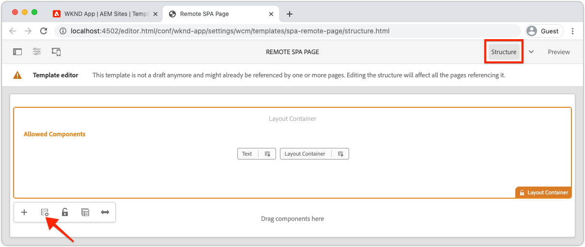

1. On the right, under the __Allowed Components__ tab, expand __WKND APP - CONTENT__
1. Ensure only following are selected:
   1. Immagine
   1. Testo
   1. Titolo

   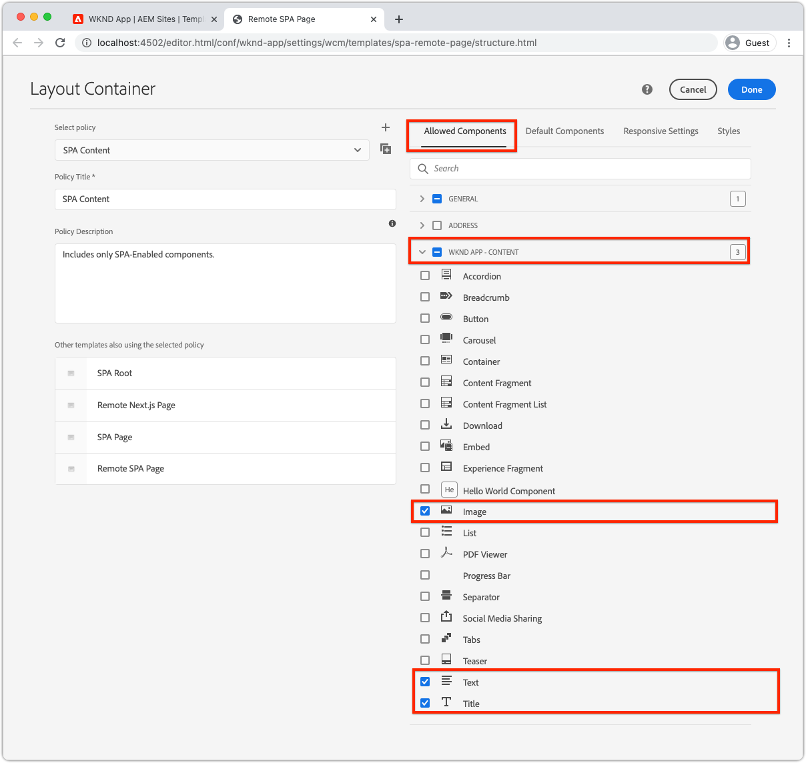

1. Tocca __Fine__

## Authoring the container in AEM

After the SPA updated to embed the `<ResponsiveGrid...>`, wrappers for three editable React components (`EditableTitle`, `EditableText`, and `EditableImage`), and AEM is updated with a matching Template policy, we can start authoring content in the container component.

1. Accedi ad AEM Author
1. Passa a __Sites > App WKND__
1. Tocca __Home__ e seleziona __Modifica__ dalla barra delle azioni superiore
   1. A &quot;Hello World&quot; Text component displays, as this was automatically added when generating the project from the AEM Project archetype
1. Select __Edit__ from the mode-selector in the top right of the Page Editor
1. Locate the __Layout Container__ editable area beneath the Title
1. Apri la barra laterale dell&#39;__Editor pagine__ e seleziona la __visualizzazione Componenti__
1. Drag the following components into the __Layout Container__
   1. Immagine
   1. Titolo
1. Drag the components to reorder them to the following order:
   1. Titolo
   1. Immagine
   1. Testo
1. __Author__ the __Title__ component
   1. Tap the Title component, and tap the __wrench__ icon to __edit__ the Title component
   1. Add the following text:
      1. Title: __Summer is coming, let&#39;s make the most of it!__
      1. Type: __H1__
   1. Tocca __Fine__
1. __Author__ the __Image__ component
   1. Drag an image in from the Side bar (after switching to the Assets view) on the Image component
   1. Tap the Image component, and tap the __wrench__ icon to edit
   1. Check the __Image is decorative__ checkbox
   1. Tocca __Fine__
1. __Author__ the __Text__ component
   1. Edit the Text component by tapping the Text component, and tapping the __wrench__ icon
   1. Add the following text:
      1. _Right now, you can get 15% on all 1-week adventures, and 20% off on all adventures that are 2 weeks or longer! At checkout, add the campaign code SUMMERISCOMING to get your discounts!_
   1. Tocca __Fine__

1. I componenti ora sono creati, ma si sovrappongono in verticale.

   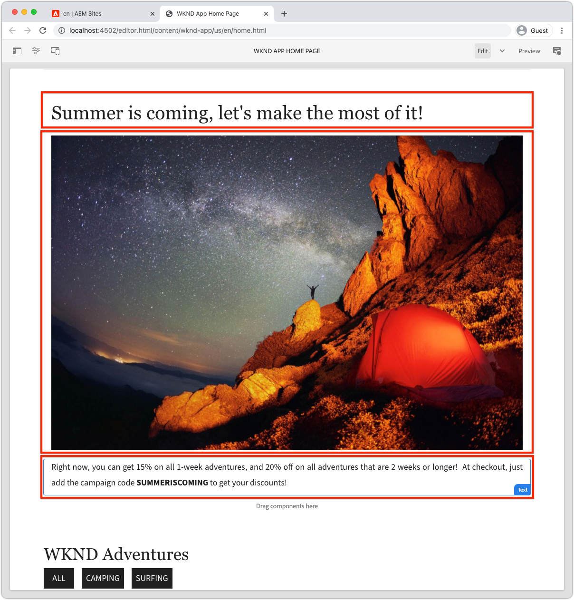

   Utilizza la modalità Layout di AEM per regolare le dimensioni e il layout dei componenti.

1. Passa a __Modalità layout__ utilizzando il selettore modalità in alto a destra
1. __Ridimensiona__ i componenti Immagine e Testo in modo che siano affiancati
   1. Il componente __Immagine__ deve avere __8 colonne__
   1. Il componente __Testo__ deve avere __3 colonne__

   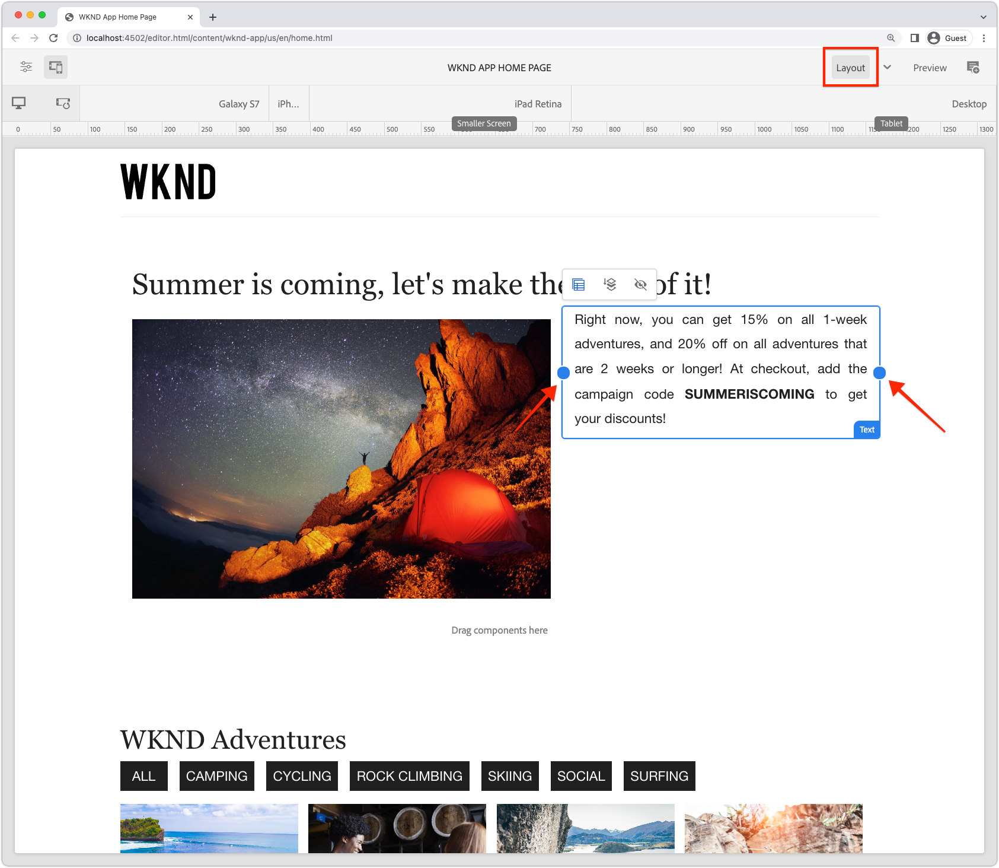

1. __Visualizza in anteprima__ le modifiche nell&#39;Editor pagina di AEM
1. Aggiorna l&#39;app WKND in esecuzione localmente su [http://localhost:3000](http://localhost:3000) per visualizzare le modifiche create.

   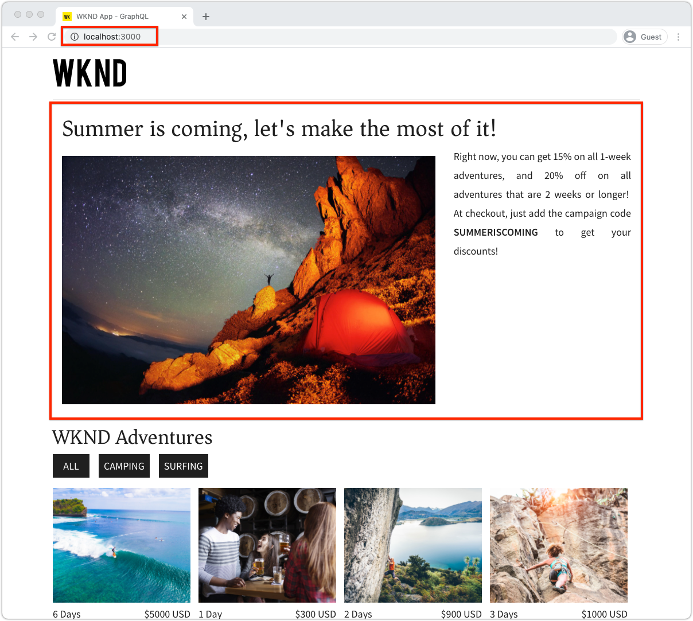


## Congratulazioni.

Hai aggiunto un componente contenitore che consente agli autori di aggiungere componenti modificabili all’app WKND. Ora sai come:

* Utilizzare il componente `ResponsiveGrid` del componente modificabile AEM React nell&#39;applicazione a pagina singola
* Creare e registrare componenti React modificabili (testo e immagine) da utilizzare nell’applicazione a pagina singola tramite il componente contenitore
* Configura il modello Pagina applicazione a pagina singola remota per consentire i componenti abilitati per l’applicazione a pagina singola
* Aggiungere componenti modificabili al componente contenitore
* Componenti di authoring e layout nell’editor SPA

## Passaggi successivi

Il passaggio successivo utilizza la stessa tecnica per [aggiungere un componente modificabile a un percorso Dettagli avventura](./spa-dynamic-routes.md) nell&#39;applicazione a pagina singola.
