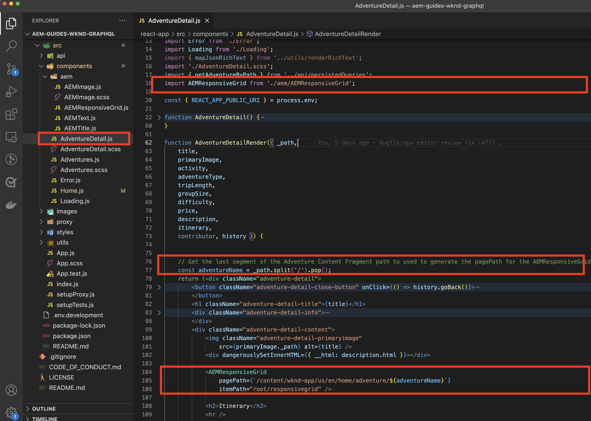

# Percorsi dinamici e componenti modificabili

In questo capitolo vengono abilitati due percorsi dinamici Adventure Detail per supportare componenti modificabili. __Campo da surf di Bali__ e __Beervana a Portland__.


Il percorso SPA di Adventure Detail è definito come `/adventure/:slug` dove `slug` è una proprietà di identificatore univoco nel frammento di contenuto Adventure.

## Mappare gli URL dell’SPA alle pagine AEM

Nei due capitoli precedenti, abbiamo mappato il contenuto dei componenti modificabili dalla vista Home dell’SPA alla corrispondente pagina root dell’SPA remoto nell’AEM all’indirizzo `/content/wknd-app/us/en/`.

La definizione della mappatura per i componenti modificabili per le route dinamiche SPA è simile, tuttavia è necessario elaborare uno schema di mappatura 1:1 tra le istanze della route e le pagine AEM.

In questo tutorial, prendiamo il nome del frammento di contenuto WKND Adventure, che è l’ultimo segmento del percorso, e lo mappiamo su un semplice percorso in `/content/wknd-app/us/en/adventure`.

| Route SPA remota | Percorso pagina AEM |
|------------------------------------|--------------------------------------------|
| / | /content/wknd-app/us/en/home |
| /avventura/__bali-surf-camp__ | /content/wknd-app/us/en/home/adventure/__bali-surf-camp__ |
| /avventura/__beervana-portland__ | /content/wknd-app/us/en/home/adventure/__beervana in portland__ |

Quindi, sulla base di questa mappatura, dobbiamo creare due nuove pagine AEM all&#39;indirizzo:

+ `/content/wknd-app/us/en/home/adventure/bali-surf-camp`
+ `/content/wknd-app/us/en/home/adventure/beervana-in-portland`

## Mappatura remota SPA

La mappatura delle richieste che lasciano l’SPA remoto viene configurata tramite `setupProxy` configurazione eseguita in [Bootstrap SPA](./spa-bootstrap.md).

## Mappatura dell’editor SPA

La mappatura per le richieste SPA quando l’SPA viene aperto tramite l’editor AEM SPA è configurata tramite la configurazione Sling Mappings eseguita in [Configurare AEM](./aem-configure.md).

## Creare pagine di contenuti in AEM

Innanzitutto, crea l’intermediario `adventure` Segmento di pagina:

1. Accedi a AEM Author
1. Accedi a __Sites > App WKND > us > it > Home page app WKND__
   + Questa pagina dell&#39;AEM è mappata come la radice dell&#39;SPA, ed è qui che iniziamo a costruire la struttura della pagina dell&#39;AEM per altre vie SPA.
1. Tocca __Crea__ e seleziona __Pagina__
1. Seleziona la __Pagina SPA remoto__ modello e tocca __Successivo__
1. Compila le proprietà della pagina
   + __Titolo__: Avventure
   + __Nome__: `adventure`
      + Questo valore definisce l’URL della pagina AEM e deve quindi corrispondere al segmento di route dell’SPA.
1. Tocca __Fine__

Quindi, crea le pagine AEM corrispondenti a ciascuno degli URL SPA che richiedono aree modificabili.

1. Accedi al nuovo __Avventura__ pagina nell’amministratore del sito
1. Tocca __Crea__ e seleziona __Pagina__
1. Seleziona la __Pagina SPA remoto__ modello e tocca __Successivo__
1. Compila le proprietà della pagina
   + __Titolo__: Campo da surf di Bali
   + __Nome__: `bali-surf-camp`
      + Questo valore definisce l’URL della pagina AEM e deve quindi corrispondere all’ultimo segmento della route dell’SPA
1. Tocca __Fine__
1. Ripeti i passaggi 3-6 per creare __Beervana a Portland__ con:
   + __Titolo__: Beervana a Portland
   + __Nome__: `beervana-in-portland`
      + Questo valore definisce l’URL della pagina AEM e deve quindi corrispondere all’ultimo segmento della route dell’SPA

Queste due pagine dell’AEM contengono i rispettivi contenuti creati per le rispettive vie dell’SPA. Se altre route SPA richiedono l&#39;authoring, è necessario creare nuove pagine AEM all&#39;URL SPA nella pagina principale della pagina SPA remota (`/content/wknd-app/us/en/home`) nell&#39;AEM.

## Aggiornare l’app WKND

Posizioniamo il `<ResponsiveGrid...>` componente creato in [ultimo capitolo](./spa-container-component.md), nel nostro `AdventureDetail` componente SPA, creazione di un contenitore modificabile.

### Posizionare il componente SPA ResponsiveGrid

Inserimento di `<ResponsiveGrid...>` nel `AdventureDetail` il componente crea un contenitore modificabile in tale route. Il trucco è perché più route utilizzano `AdventureDetail` per il rendering, è necessario regolare dinamicamente il  `<ResponsiveGrid...>'s pagePath` attributo. Il `pagePath` deve essere derivato per puntare alla pagina AEM corrispondente, in base all’avventura visualizzata dall’istanza del percorso.

1. Apri e modifica `react-app-/src/components/AdventureDetail.js`
1. Importa `ResponsiveGrid` e posizionarlo sopra il `<h2>Itinerary</h2>` componente.
1. Imposta i seguenti attributi su `<ResponsiveGrid...>` componente. Osserva `pagePath` aggiunge l&#39;attributo corrente `slug` che viene mappato sulla pagina dell’avventura in base alla mappatura definita sopra.
   + `pagePath = '/content/wknd-app/us/en/home/adventure/${slug}'`
   + `itemPath = 'root/responsivegrid'`

   Questo istruisce il `ResponsiveGrid` componente per recuperarne il contenuto dalla risorsa AEM:

   + `/content/wknd-app/us/en/home/adventure/${slug}/jcr:content/root/responsivegrid`

Aggiorna `AdventureDetail.js` con le seguenti righe:

```javascript
...
import { ResponsiveGrid } from '@adobe/aem-react-editable-components';
...

function AdventureDetailRender(props) {
    ...
    // Get the slug from the React route parameter, this will be used to specify the AEM Page to store/read editable content from
    const { slug } = useParams();

    return(
        ...
        // Pass the slug in
        function AdventureDetailRender({ title, primaryImage, activity, adventureType, tripLength, 
                groupSize, difficulty, price, description, itinerary, references, slug }) {
            ...
            return (
                ...
                <ResponsiveGrid 
                    pagePath={`/content/wknd-app/us/en/home/adventure/${slug}`}
                    itemPath="root/responsivegrid"/>
                    
                <h2>Itinerary</h2>
                ...
            )
        }
    )
}
```

Il `AdventureDetail.js` il file dovrebbe avere un aspetto simile a:



## Creare il contenitore in AEM

Con il `<ResponsiveGrid...>` sul posto, e il suo `pagePath` impostato in modo dinamico in base all’avventura di cui viene eseguito il rendering, tentiamo di creare contenuti al suo interno.

1. Accedi a AEM Author
1. Accedi a __Sites > App WKND > us > it__
1. __Modifica__ il __Home page dell’app WKND__ pagina
   + Accedi a __Campo da surf di Bali__ indirizzare il SPA per modificarlo
1. Seleziona __Anteprima__ dal selettore modalità in alto a destra
1. Tocca il __Campo da surf di Bali__ carta di credito dell&#39;SPA per accedere alla sua rotta
1. Seleziona __Modifica__ dal selettore modalità
1. Individua il __Contenitore di layout__ area modificabile sopra __Itinerario__
1. Apri __Barra laterale dell’Editor pagina__, e seleziona la __Vista Componenti__
1. Trascina alcuni dei componenti abilitati in __Contenitore di layout__
   + Immagine
   + Testo
   + Titolo

   E crea del materiale promozionale per il marketing. Potrebbe presentarsi così:

   

1. __Anteprima__ le modifiche apportate nell’Editor pagina per AEM
1. Aggiorna l’app WKND in esecuzione localmente il [http://localhost:3000](http://localhost:3000), passare alla __Campo da surf di Bali__ route per visualizzare le modifiche create.

   

Quando si passa a un percorso di dettagli dell’avventura privo di una pagina AEM mappata, non è possibile creare l’istanza del percorso. Per abilitare l’authoring in queste pagine, è sufficiente creare una pagina AEM con il nome corrispondente nel __Avventura__ pagina!

## Congratulazioni.

Congratulazioni. Hai aggiunto la possibilità di authoring per le route dinamiche nell&#39;SPA.

+ È stato aggiunto il componente ResponsiveGrid del componente React Editable dell’AEM a una route dinamica
+ Sono state create pagine AEM per supportare la creazione di due percorsi specifici nell&#39;SPA (Bali Surf Camp e Beervana a Portland)
+ Contenuti creati sulla strada dinamica Bali Surf Camp!

Ora hai completato l’esplorazione dei primi passaggi su come utilizzare l’Editor SPA dell’AEM per aggiungere specifiche aree modificabili a un SPA remoto.
