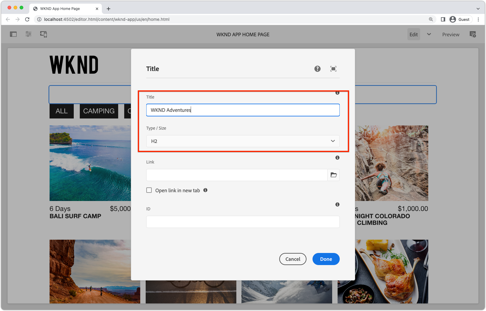

# Componenti fissi modificabili

I componenti React modificabili possono essere &quot;fissi&quot; o codificati nelle viste SPA. Questo consente agli sviluppatori di inserire componenti compatibili con l’editor SPA nelle viste SPA e agli utenti di creare i contenuti dei componenti nell’editor AEM SPA.


In questo capitolo, sostituiamo il titolo della visualizzazione Home, &quot;Current Adventures&quot;, che è un testo hardcoded in `Home.js` con un componente Titolo fisso ma modificabile. I componenti fissi garantiscono il posizionamento del titolo, ma consentono anche la creazione del testo del titolo e la modifica al di fuori del ciclo di sviluppo.

## Aggiornare l’app WKND

Per aggiungere una __Fisso__ nella vista Home:

+ Creare un componente Titolo modificabile personalizzato e registrarlo nel tipo di risorsa Titolo del progetto
+ Posizionare il componente Titolo modificabile nella vista Home del SPA

### Creare un componente Titolo di React modificabile

Nella visualizzazione Home dell’SPA, sostituisci il testo hardcoded `<h2>Current Adventures</h2>` con un componente Titolo modificabile personalizzato. Prima di poter utilizzare il componente Titolo, è necessario:

1. Creare un componente React titolo personalizzato
1. Decorare il componente Titolo personalizzato utilizzando i metodi di `@adobe/aem-react-editable-components` per renderlo modificabile.
1. Registrare il componente Titolo modificabile con `MapTo` in modo che possa essere utilizzato in [componente contenitore in un secondo momento](./spa-container-component.md).

Per effettuare questo collegamento:

1. Apri progetto SPA remoto all’indirizzo `~/Code/aem-guides-wknd-graphql/remote-spa-tutorial/react-app` nell’IDE
1. Creare un componente React in `react-app/src/components/editable/core/Title.js`
1. Aggiungi il seguente codice a `Title.js`.

   ```javascript
   import React from 'react'
   import { RoutedLink } from "./RoutedLink";
   
   const TitleLink = (props) => {
   return (
       <RoutedLink className={props.baseCssClass + (props.nested ? '-' : '__') + 'link'} 
           isRouted={props.routed} 
           to={props.linkURL}>
       {props.text}
       </RoutedLink>
   );
   };
   
   const TitleV2Contents = (props) => {
       if (!props.linkDisabled) {
           return <TitleLink {...props} />
       }
   
       return <>{props.text}</>
   };
   
   export const Title = (props) => {
       if (!props.baseCssClass) {
           props.baseCssClass = 'cmp-title'
       }
   
       const elementType = (!!props.type) ? props.type.toString() : 'h3';
       return (<div className={props.baseCssClass}>
           {
               React.createElement(elementType, {
                       className: props.baseCssClass + (props.nested ? '-' : '__') + 'text',
                   },
                   <TitleV2Contents {...props} />
               )
           }
   
           </div>)
   }
   
   export const titleIsEmpty = (props) => props.text == null || props.text.trim().length === 0
   ```

   Questo componente React non è ancora modificabile tramite l’Editor SPA dell’AEM. Questo componente di base diventerà modificabile nel passaggio successivo.

   Leggi i commenti del codice per i dettagli sull’implementazione.

1. Creare un componente React in `react-app/src/components/editable/EditableTitle.js`
1. Aggiungi il seguente codice a `EditableTitle.js`.

   ```javascript
   // Import the withMappable API provided bu the AEM SPA Editor JS SDK
   import { EditableComponent, MapTo } from '@adobe/aem-react-editable-components';
   import React from 'react'
   
   // Import the AEM the Title component implementation and it's Empty Function
   import { Title, titleIsEmpty } from "./core/Title";
   import { withConditionalPlaceHolder } from "./core/util/withConditionalPlaceholder";
   import { withStandardBaseCssClass } from "./core/util/withStandardBaseCssClass";
   
   // The sling:resourceType of the AEM component used to collected and serialize the data this React component displays
   const RESOURCE_TYPE = "wknd-app/components/title";
   
   // Create an EditConfig to allow the AEM SPA Editor to properly render the component in the Editor's context
   const EditConfig = {
       emptyLabel: "Title",        // The component placeholder in AEM SPA Editor
       isEmpty: titleIsEmpty,      // The function to determine if this component has been authored
       resourceType: RESOURCE_TYPE // The sling:resourceType this component is mapped to
   };
   
   export const WrappedTitle = (props) => {
       const Wrapped = withConditionalPlaceHolder(withStandardBaseCssClass(Title, "cmp-title"), titleIsEmpty, "TitleV2")
       return <Wrapped {...props} />
   }
   
   // EditableComponent makes the component editable by the AEM editor, either rendered statically or in a container
   const EditableTitle = (props) => <EditableComponent config={EditConfig} {...props}><WrappedTitle /></EditableComponent>
   
   // MapTo allows the AEM SPA Editor JS SDK to dynamically render components added to SPA Editor Containers
   MapTo(RESOURCE_TYPE)(EditableTitle);
   
   export default EditableTitle;
   ```

   Questo `EditableTitle` Il componente React racchiude il `Title` Componente React, avvolgimento e decorazione per essere modificabile in AEM SPA Editor.

### Utilizzare il componente React EditableTitle

Ora che il componente React EditableTitle è registrato in e disponibile per l’utilizzo nell’app React, sostituisci il testo del titolo hardcoded nella vista Home.

1. Modifica `react-app/src/components/Home.js`
1. In `Home()` in basso, importa `EditableTitle` e sostituisci il titolo hardcoded con il nuovo `AEMTitle` componente:

   ```javascript
   ...
   import EditableTitle from './editable/EditableTitle';
   ...
   function Home() {
       return (
           <div className="Home">
   
           <EditableTitle
               pagePath='/content/wknd-app/us/en/home'
               itemPath='root/title'/>
   
               <Adventures />
           </div>
       );
   }
   ```

Il `Home.js` il file dovrebbe avere un aspetto simile a:


## Creare il componente Titolo nell’AEM

1. Accedi a AEM Author
1. Accedi a __Sites > App WKND__
1. Tocca __Home__ e seleziona __Modifica__ dalla barra delle azioni superiore
1. Seleziona __Modifica__ dal selettore della modalità di modifica in alto a destra nell’Editor pagina
1. Passa il cursore del mouse sul testo del titolo predefinito sotto il logo WKND e sopra l’elenco delle avventure, fino a visualizzare il contorno blu della modifica
1. Tocca per esporre la barra delle azioni del componente, quindi tocca il __chiave inglese__  per modificare

   

1. Creare il componente Titolo:
   + Titolo: __WKND Adventures__
   + Tipo/dimensione: __H2__

     

1. Tocca __Fine__ per salvare
1. Visualizzare l’anteprima delle modifiche nell’Editor SPA dell’AEM
1. Aggiorna l’app WKND in esecuzione localmente il [http://localhost:3000](http://localhost:3000) e visualizzare le modifiche apportate al titolo immediatamente riflesse.

   

## Congratulazioni.

Hai aggiunto un componente fisso e modificabile all’app WKND. Ora sai come:

+ Creazione di un componente fisso ma modificabile per l&#39;SPA
+ Creare il componente fisso nell’AEM
+ Visualizzare i contenuti creati nell’SPA remoto

## Passaggi successivi

I passaggi successivi sono i seguenti: [aggiungi un componente contenitore AEM ResponsiveGrid](./spa-container-component.md) all’SPA, che consente all’autore di aggiungere all’SPA e di modificarne i componenti.
