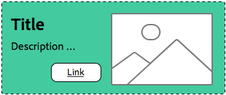

# Best practice per il sistema di stili{#understanding-style-organization-with-the-aem-style-system}

>[!NOTE]
>
>Consulta il contenuto all&#39;indirizzo [Informazioni su come codificare per il sistema di stili](style-system-technical-video-understand.md), per comprendere le convenzioni di tipo BEM utilizzate dal sistema di stili di AEM.

Per il sistema di stili di AEM sono disponibili due tipi o stili principali:

* **Stili layout**
* **Stili di visualizzazione**

**Gli stili di layout** interessano molti elementi di un componente per creare una rappresentazione ben definita e identificabile (progettazione e layout) del componente, spesso allineata a uno specifico concetto di marchio riutilizzabile. Ad esempio, un componente Teaser può essere presentato nel layout tradizionale basato su schede, in uno stile promozionale orizzontale o come layout principale che sovrappone il testo su un’immagine.

**Gli stili di visualizzazione** vengono utilizzati per influenzare le variazioni minori agli stili di layout, ma non modificano la natura o l&#39;intento fondamentale dello stile di layout. Ad esempio, uno stile di layout Eroe può avere stili di visualizzazione che modificano la combinazione di colori dalla combinazione di colori del marchio principale alla combinazione di colori del marchio secondario.

## Best practice per l’organizzazione degli stili {#style-organization-best-practices}

Quando definisci i nomi degli stili disponibili per gli autori di AEM, è consigliabile:

* Assegnare un nome agli stili utilizzando un vocabolario comprensibile per gli autori
* Riduci al minimo il numero di opzioni di stile
* Mostra solo le opzioni e le combinazioni di stile consentite dagli standard del marchio
* Mostra solo le combinazioni di stili con effetto
   * Se vengono esposte combinazioni inefficaci, assicurarsi che non abbiano almeno un effetto dannoso

Con l’aumento del numero di combinazioni di stili disponibili per gli autori di AEM, esistono sempre più permutazioni che devono essere sottoposte a controllo qualità e convalidate in base agli standard del brand. Troppe opzioni possono inoltre confondere gli autori, in quanto potrebbe non essere chiaro quale opzione o combinazione è necessaria per produrre l’effetto desiderato.

### Nomi di stile e classi CSS {#style-names-vs-css-classes}

In AEM, i nomi degli stili o le opzioni presentate agli autori di AEM e i nomi delle classi CSS implementati sono separati.

Questo consente alle opzioni di stile di essere etichettate in un vocabolario chiaro e compreso dagli autori di AEM, ma consente agli sviluppatori CSS di denominare le classi CSS in modo semantico e a prova di futuro. Ad esempio:

Un componente deve avere le opzioni per essere colorato con i colori **primario** e **secondario** del brand, tuttavia gli autori di AEM conoscono i colori come **verde** e **giallo**, anziché il linguaggio di progettazione primario e secondario.

Il sistema di stili di AEM può esporre questi stili di visualizzazione a colori utilizzando le etichette descrittive dell&#39;autore **Verde** e **Giallo**, consentendo al contempo agli sviluppatori CSS di utilizzare la denominazione semantica di `.cmp-component--primary-color` e `.cmp-component--secondary-color` per definire l&#39;implementazione effettiva dello stile in CSS.

Il nome stile di **Verde** è mappato a `.cmp-component--primary-color` e **Giallo** a `.cmp-component--secondary-color`.

Se il colore del marchio dell&#39;azienda dovesse cambiare in futuro, sarà sufficiente modificare le implementazioni singole di `.cmp-component--primary-color` e `.cmp-component--secondary-color` e i nomi degli stili.

## Il componente Teaser come caso d’uso di esempio {#the-teaser-component-as-an-example-use-case}

Di seguito è riportato un esempio di utilizzo dello stile di un componente Teaser per diversi stili di layout e visualizzazione.

Questo esplorerà come vengono organizzati i nomi degli stili (esposti agli autori) e le classi CSS di base.

### Configurazione degli stili dei componenti Teaser {#component-styles-configuration}

L&#39;immagine seguente mostra la configurazione di [!UICONTROL Stili] per il componente Teaser per le varianti descritte nel caso d&#39;uso.

I nomi, il layout e la visualizzazione del [!UICONTROL gruppo di stili], per casualità, corrispondono ai concetti generali degli stili di visualizzazione e degli stili di layout utilizzati per categorizzare concettualmente i tipi di stili in questo articolo.

I nomi del [!UICONTROL gruppo di stili] e il numero di [!UICONTROL gruppi di stili] devono essere personalizzati in base al caso d&#39;uso del componente e alle convenzioni di stile dei componenti specifiche del progetto.

Ad esempio, il nome del gruppo di stili **Visualizzazione** avrebbe potuto essere **Colori**.


### Menu di selezione stile {#style-selection-menu}

Nell&#39;immagine seguente viene visualizzato il menu [!UICONTROL Style] con cui gli autori interagiscono per selezionare gli stili appropriati per il componente. Nota che i nomi [!UICONTROL Style Grpi] e i nomi Style sono tutti esposti all&#39;autore.


### Stile predefinito {#default-style}

Lo stile predefinito è spesso lo stile più comunemente utilizzato del componente e la visualizzazione predefinita e non formattata del teaser quando viene aggiunto a una pagina.

A seconda della compatibilità dello stile predefinito, il CSS può essere applicato direttamente a `.cmp-teaser` (senza modificatori) o a `.cmp-teaser--default`.

Se le regole di stile predefinite si applicano il più delle volte a tutte le varianti, è consigliabile utilizzare `.cmp-teaser` come classi CSS dello stile predefinito, poiché tutte le varianti devono ereditare implicitamente le varianti, supponendo che vengano seguite le convenzioni di tipo BEM. In caso contrario, devono essere applicate tramite il modificatore predefinito, ad esempio `.cmp-teaser--default`, che a sua volta deve essere aggiunto al campo Classi CSS predefinite[&#128279;](#component-styles-configuration) della configurazione di stile di componente. In caso contrario, queste regole di stile dovranno essere ignorate in ogni variante.

È anche possibile assegnare uno stile &quot;denominato&quot; come stile predefinito, ad esempio lo stile Hero `(.cmp-teaser--hero)` definito di seguito, tuttavia è più chiaro implementare lo stile predefinito rispetto alle implementazioni di classe CSS `.cmp-teaser` o `.cmp-teaser--default`.

>[!NOTE]
>
>Lo stile di layout predefinito NON ha un nome di stile di visualizzazione, tuttavia l’autore può selezionare un’opzione di visualizzazione nello strumento di selezione del sistema di stili di AEM.
>
>In violazione della best practice:
>
>**Mostra solo le combinazioni di stili con effetto**
>
>Se un autore seleziona lo stile di visualizzazione **Verde**, non succede nulla.
>
>In questo caso d’uso, concederemo questa violazione, poiché tutti gli altri stili di Layout devono essere colorabili utilizzando i colori del marchio.
>
>Nella sezione **Promo (Allineato a destra)** di seguito verrà illustrato come evitare combinazioni di stili indesiderate.


* **Stile layout**
   * Predefiniti
* **Stile visualizzazione**
   * Nessuno
* **Classi CSS effettive**: `.cmp-teaser--promo` o `.cmp-teaser--default`

### Stile promozionale {#promo-style}

Lo stile di layout **Promo** viene utilizzato per promuovere contenuti di alto valore nel sito ed è disposto orizzontalmente per occupare una banda di spazio nella pagina Web e deve essere personalizzabile in base ai colori del marchio, con lo stile di layout Promo predefinito che utilizza il testo nero.

A questo scopo, nel sistema di stili di AEM per il componente Teaser sono configurati uno **stile di layout** di **Promo** e **stili di visualizzazione** di **Verde** e **Giallo**.

#### Valore predefinito promozione


* **Stile layout**
   * Nome stile: **Promo**
   * Classe CSS: `cmp-teaser--promo`
* **Stile visualizzazione**
   * Nessuno
* **Classi CSS effettive**: `.cmp-teaser--promo`

#### Promozione principale


* **Stile layout**
   * Nome stile: **Promo**
   * Classe CSS: `cmp-teaser--promo`
* **Stile visualizzazione**
   * Nome stile: **Verde**
   * Classe CSS: `cmp-teaser--primary-color`
* **Classi CSS effettive**: `cmp-teaser--promo.cmp-teaser--primary-color`

#### Promo secondario


* **Stile layout**
   * Nome stile: **Promo**
   * Classe CSS: `cmp-teaser--promo`
* **Stile visualizzazione**
   * Nome stile: **Giallo**
   * Classe CSS: `cmp-teaser--secondary-color`
* **Classi CSS effettive**: `cmp-teaser--promo.cmp-teaser--secondary-color`

### Stile promo allineato a destra {#promo-r-align}

Lo stile di layout **Promo allineato a destra** è una variante dello stile Promo che inverte la posizione dell&#39;immagine e del testo (immagine a destra, testo a sinistra).

L’allineamento a destra, nella parte centrale, è uno stile di visualizzazione, che potrebbe essere inserito nel Sistema di stili di AEM come stile di visualizzazione selezionato insieme allo stile di layout Promo. Ciò viola la best practice di:

**Mostra solo le combinazioni di stili con effetto**

..che è già stato violato nello stile [Predefinito](#default-style).

Poiché l&#39;allineamento corretto influisce solo sullo stile di layout Promo e non sugli altri 2 stili di layout: predefinito ed eroe, è possibile creare un nuovo stile di layout Promo (allineato a destra) che include la classe CSS che allinea a destra il contenuto degli stili di layout Promo: `cmp -teaser--alternate`.

Questa combinazione di più stili in una singola voce di stile può anche aiutare a ridurre il numero di stili e permutazioni di stile disponibili, il che è meglio ridurre al minimo.

Nota che il nome della classe CSS, `cmp-teaser--alternate`, non deve corrispondere alla nomenclatura descrittiva di &quot;Allineato a destra&quot;.

#### Impostazione predefinita promozionale allineata a destra


* **Stile layout**
   * Nome stile: **Promozione (allineato a destra)**
   * Classi CSS: `cmp-teaser--promo cmp-teaser--alternate`
* **Stile visualizzazione**
   * Nessuno
* **Classi CSS effettive**: `.cmp-teaser--promo.cmp-teaser--alternate`

#### Promozione - Principale allineato a destra



* **Stile layout**
   * Nome stile: **Promozione (allineato a destra)**
   * Classi CSS: `cmp-teaser--promo cmp-teaser--alternate`
* **Stile visualizzazione**
   * Nome stile: **Verde**
   * Classe CSS: `cmp-teaser--primary-color`
* **Classi CSS effettive**: `.cmp-teaser--promo.cmp-teaser--alternate.cmp-teaser--primary-color`

#### Promo Allineato a destra Secondario


* **Stile layout**
   * Nome stile: **Promozione (allineato a destra)**
   * Classi CSS: `cmp-teaser--promo cmp-teaser--alternate`
* **Stile visualizzazione**
   * Nome stile: **Giallo**
   * Classe CSS: `cmp-teaser--secondary-color`
* **Classi CSS effettive**: `.cmp-teaser--promo.cmp-teaser--alternate.cmp-teaser--secondary-color`

### Stile protagonista {#hero-style}

Lo stile di layout Eroe visualizza l’immagine dei componenti come sfondo con il titolo e il collegamento sovrapposti. Lo stile di layout Eroe, come lo stile di layout Promo, deve essere colorabile con i colori del marchio.

Per colorare lo stile di layout Eroe con i colori del marchio, è possibile utilizzare gli stessi stili di visualizzazione utilizzati per lo stile di layout Promo.

Per ogni componente, il nome dello stile è mappato al singolo set di classi CSS, il che significa che i nomi delle classi CSS che colorano lo sfondo dello stile di layout Promo devono colorare il testo e il collegamento dello stile di layout Eroe.

Questo può essere ottenuto in modo banale definendo l’ambito delle regole CSS; tuttavia, questo richiede agli sviluppatori CSS di capire come queste permutazioni vengono applicate su AEM.

CSS per colorare lo sfondo dello stile di layout **Promuovi** con il colore principale (verde):

```css
.cmp-teaser--promo.cmp-teaser--primary--color {
   ...
   background-color: green;
   ...
}
```

CSS per colorare il testo dello stile di layout **Hero** con il colore primario (verde):

```css
.cmp-teaser--hero.cmp-teaser--primary--color {
   ...
   color: green;
   ...
}
```

#### Valore predefinito protagonista


* **Stile layout**
   * Nome stile: **Eroe**
   * Classe CSS: `cmp-teaser--hero`
* **Stile visualizzazione**
   * Nessuno
* **Classi CSS effettive**: `.cmp-teaser--hero`

#### Primaria protagonista


* **Stile layout**
   * Nome stile: **Promo**
   * Classe CSS: `cmp-teaser--hero`
* **Stile visualizzazione**
   * Nome stile: **Verde**
   * Classe CSS: `cmp-teaser--primary-color`
* **Classi CSS effettive**: `cmp-teaser--hero.cmp-teaser--primary-color`

#### Eroe secondario


* **Stile layout**
   * Nome stile: **Promo**
   * Classe CSS: `cmp-teaser--hero`
* **Stile visualizzazione**
   * Nome stile: **Giallo**
   * Classe CSS: `cmp-teaser--secondary-color`
* **Classi CSS effettive**: `cmp-teaser--hero.cmp-teaser--secondary-color`

## Risorse aggiuntive {#additional-resources}

* [Documentazione del sistema di stili](https://helpx.adobe.com/it/experience-manager/6-5/sites/authoring/using/style-system.html)
* [Creazione di librerie client di AEM](https://helpx.adobe.com/it/experience-manager/6-5/sites/developing/using/clientlibs.html)
* Sito Web della documentazione di [BEM (Block Element Modifier)](https://getbem.com/)
* [Sito Web della documentazione di minore entità](https://lesscss.org/)
* [jQuery sito Web](https://jquery.com/)
