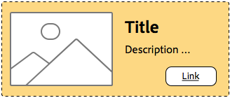

# Best practice per il sistema di stili{#understanding-style-organization-with-the-aem-style-system}

>[!NOTE]
>
>Controlla il contenuto all&#39;indirizzo [Informazioni sul codice per il sistema di stili](style-system-technical-video-understand.md), per comprendere le convenzioni simili a BEM utilizzate dal sistema di stili AEM.

Sono implementati due tipi di gusto o stili principali per il sistema di stili AEM:

* **Stili di layout**
* **Visualizzare gli stili**

**Stili di layout** influenzano molti elementi di un componente per creare una rappresentazione (progettazione e layout) ben definita e identificabile del componente, spesso allineata a uno specifico concetto di marchio riutilizzabile. Ad esempio, un componente Teaser può essere presentato nel layout tradizionale basato su schede, in uno stile Promozionale orizzontale o come layout Eroe che sovrappone il testo su un’immagine.

**Visualizzare gli stili** sono utilizzati per influenzare lievi varianti degli stili di layout, ma non modificano la natura o le finalità fondamentali dello stile di layout. Ad esempio, uno stile di layout eroe può avere stili di visualizzazione che modificano lo schema di colori dalla combinazione di colori del marchio principale alla combinazione di colori del marchio secondario.

## Best practice per l’organizzazione di stili {#style-organization-best-practices}

Quando definisci i nomi degli stili disponibili per AEM autori, è meglio:

* Denominare gli stili utilizzando un vocabolario compreso dagli autori
* Ridurre al minimo il numero di opzioni di stile
* Esporre solo le opzioni di stile e le combinazioni consentite dagli standard di marchio
* Esporre solo combinazioni di stile con un effetto
   * Se sono esposte combinazioni inefficaci, assicurarsi che almeno non abbiano un effetto negativo

Con l’aumento del numero di possibili combinazioni di stile disponibili per gli autori di AEM, più permutazioni devono essere verificate e convalidate in base agli standard di marchio. Troppe opzioni possono confondere gli autori in quanto potrebbe non essere chiaro quale opzione o combinazione è necessaria per produrre l&#39;effetto desiderato.

### Nomi di stile e classi CSS {#style-names-vs-css-classes}

I nomi degli stili o le opzioni presentate agli autori AEM e i nomi delle classi CSS di implementazione vengono disaccoppiati in AEM.

Questo consente alle opzioni di stile di essere etichettate in un vocabolario chiaro e compreso dagli autori AEM, ma consente agli sviluppatori CSS di denominare le classi CSS in modo semantico e a prova di futuro. Esempio:

Un componente deve avere le opzioni da colorare con il marchio **primario** e **secondario** i colori, tuttavia, gli autori AEM conoscono i colori come **verde** e **giallo**, anziché il linguaggio di progettazione primario e secondario.

Il sistema di stili AEM può esporre questi stili di visualizzazione colorati utilizzando etichette compatibili con l’autore **Verde** e **Giallo**, consentendo agli sviluppatori CSS di utilizzare la denominazione semantica di `.cmp-component--primary-color` e `.cmp-component--secondary-color` per definire l’implementazione effettiva dello stile in CSS.

Nome dello stile di **Verde** è mappato su `.cmp-component--primary-color`e **Giallo** a `.cmp-component--secondary-color`.

Se in futuro il colore del marchio dell&#39;azienda cambierà, tutto ciò che deve essere cambiato è l&#39;unica implementazione di `.cmp-component--primary-color` e `.cmp-component--secondary-color`e i nomi di stile.

## Esempio di utilizzo del componente Teaser {#the-teaser-component-as-an-example-use-case}

Di seguito è riportato un esempio di utilizzo dello stile di un componente Teaser per impostare diversi stili di layout e visualizzazione.

Verranno esaminati il modo in cui i nomi di stile (esposti agli autori) e le modalità di organizzazione delle classi CSS di supporto.

### Configurazione degli stili dei componenti teaser {#component-styles-configuration}

L’immagine seguente mostra la [!UICONTROL Stili] configurazione del componente Teaser per le varianti discusse nel caso d’uso.

La [!UICONTROL Gruppo di stili] nomi, layout e visualizzazione, in base ai concetti generali degli stili di visualizzazione e layout utilizzati per categorizzare concettualmente i tipi di stili in questo articolo.

La [!UICONTROL Gruppo di stili] i nomi e il numero di [!UICONTROL Gruppi di stili] devono essere personalizzati in base al caso d’uso del componente e alle convenzioni di stile del componente specifiche per il progetto.

Ad esempio, il **Visualizzazione** il nome del gruppo di stili potrebbe essere stato denominato **Colori**.


### Menu di selezione stile {#style-selection-menu}

L&#39;immagine seguente mostra la [!UICONTROL Stile] gli autori dei menu interagiscono con per selezionare gli stili appropriati per il componente. Tieni presente che [!UICONTROL Grado di stile] i nomi e i nomi di stile sono tutti esposti all’autore.


### Stile predefinito {#default-style}

Lo stile predefinito è spesso lo stile più comunemente utilizzato nel componente e la visualizzazione predefinita e non formattata del teaser quando viene aggiunto a una pagina.

A seconda della commonalità dello stile predefinito, il CSS può essere applicato direttamente sul `.cmp-teaser` (senza modificatori) o su un `.cmp-teaser--default`.

Se le regole di stile predefinite si applicano più di frequente a tutte le varianti, è consigliabile utilizzare `.cmp-teaser` come classi CSS dello stile predefinito, poiché tutte le varianti dovrebbero ereditarle implicitamente, presupponendo che siano seguite convenzioni simili a BEM. In caso contrario, devono essere applicati tramite il modificatore predefinito, ad esempio `.cmp-teaser--default`, che a sua volta deve essere aggiunto al [Classi CSS predefinite della configurazione di stile del componente](#component-styles-configuration) altrimenti queste regole di stile dovranno essere ignorate in ogni variante.

È anche possibile assegnare uno stile &quot;denominato&quot; come stile predefinito, ad esempio lo stile eroe `(.cmp-teaser--hero)` definito di seguito, tuttavia è più chiaro implementare lo stile predefinito rispetto al `.cmp-teaser` o `.cmp-teaser--default` Implementazioni delle classi CSS.

>[!NOTE]
>
>Osserva che lo stile di layout Predefinito NON ha un nome di stile Visualizzazione, tuttavia l’autore può selezionare un’opzione Visualizzazione nello strumento di selezione del sistema di stili AEM.
>
>Ciò in violazione delle migliori pratiche:
>
>**Esporre solo combinazioni di stile con un effetto**
>
>Se un autore seleziona lo stile di visualizzazione di **Verde** non succederà nulla.
>
>In questo caso d’uso, verrà applicata questa violazione, in quanto tutti gli altri stili di Layout devono essere colorabili utilizzando i colori del marchio.
>
>In **Promo (allineato a destra)** di seguito vedremo come evitare combinazioni di stile indesiderate.


* **Stile di layout**
   * Predefiniti
* **Stile di visualizzazione**
   * Nessuno
* **Classi CSS efficaci**: `.cmp-teaser--promo` o `.cmp-teaser--default`

### Stile promo {#promo-style}

La **Stile layout promo** viene utilizzato per promuovere contenuti di alto valore sul sito ed è disposto orizzontalmente per occupare una banda di spazio sulla pagina web e deve essere formattato in base ai colori del marchio, con lo stile di layout Promo predefinito utilizzando il testo nero.

Il risultato è un **stile layout** di **Promo** e **stili di visualizzazione** di **Verde** e **Giallo** sono configurati nel sistema di stili AEM per il componente Teaser.

#### Predefinito promozionale


* **Stile di layout**
   * Nome stile: **Promo**
   * Classe CSS: `cmp-teaser--promo`
* **Stile di visualizzazione**
   * Nessuno
* **Classi CSS efficaci**: `.cmp-teaser--promo`

#### Principale promozionale


* **Stile di layout**
   * Nome stile: **Promo**
   * Classe CSS: `cmp-teaser--promo`
* **Stile di visualizzazione**
   * Nome stile: **Verde**
   * Classe CSS: `cmp-teaser--primary-color`
* **Classi CSS efficaci**: `cmp-teaser--promo.cmp-teaser--primary-color`

#### Promo secondario



* **Stile di layout**
   * Nome stile: **Promo**
   * Classe CSS: `cmp-teaser--promo`
* **Stile di visualizzazione**
   * Nome stile: **Giallo**
   * Classe CSS: `cmp-teaser--secondary-color`
* **Classi CSS efficaci**: `cmp-teaser--promo.cmp-teaser--secondary-color`

### Stile progressivo allineato a destra {#promo-r-align}

La **Promo allineato a destra** lo stile layout è una variante dello stile Promo che capovolge la posizione dell’immagine e del testo (immagine a destra, testo a sinistra).

L’allineamento a destra, al suo centro, è uno stile di visualizzazione, può essere inserito nel sistema di stili AEM come stile di visualizzazione selezionato in combinazione con lo stile di layout Promo. Questo viola la migliore pratica di:

**Esporre solo combinazioni di stile con un effetto**

.che è già stato violato nel [Stile predefinito](#default-style).

Poiché l’allineamento a destra influisce solo sullo stile di layout Promo e non sugli altri 2 stili di layout: Per impostazione predefinita ed eroe, possiamo creare un nuovo stile di layout Promo (allineato a destra) che include la classe CSS che allinea a destra il contenuto degli stili di layout Promo: `cmp -teaser--alternate`.

Questa combinazione di più stili in una singola voce Stile consente inoltre di ridurre il numero di stili e permutazioni di stile disponibili, il che è meglio ridurre al minimo.

Osserva il nome della classe CSS, `cmp-teaser--alternate`, non deve necessariamente corrispondere alla nomenclatura &quot;destra allineata&quot; per l’authoring.

#### Predefinito allineato a destra


* **Stile di layout**
   * Nome stile: **Promo (allineato a destra)**
   * Classi CSS: `cmp-teaser--promo cmp-teaser--alternate`
* **Stile di visualizzazione**
   * Nessuno
* **Classi CSS efficaci**: `.cmp-teaser--promo.cmp-teaser--alternate`

#### Principale allineata a destra


* **Stile di layout**
   * Nome stile: **Promo (allineato a destra)**
   * Classi CSS: `cmp-teaser--promo cmp-teaser--alternate`
* **Stile di visualizzazione**
   * Nome stile: **Verde**
   * Classe CSS: `cmp-teaser--primary-color`
* **Classi CSS efficaci**: `.cmp-teaser--promo.cmp-teaser--alternate.cmp-teaser--primary-color`

#### Secondaria allineata a destra


* **Stile di layout**
   * Nome stile: **Promo (allineato a destra)**
   * Classi CSS: `cmp-teaser--promo cmp-teaser--alternate`
* **Stile di visualizzazione**
   * Nome stile: **Giallo**
   * Classe CSS: `cmp-teaser--secondary-color`
* **Classi CSS efficaci**: `.cmp-teaser--promo.cmp-teaser--alternate.cmp-teaser--secondary-color`

### Stile eroe {#hero-style}

Lo stile di layout Eroe visualizza l’immagine dei componenti come sfondo con titolo e collegamento sovrapposti. Lo stile di layout Eroe, come lo stile di layout Promo, deve essere colorato con i colori del marchio.

Per colorare lo stile di layout Eroe con i colori del marchio, è possibile sfruttare gli stessi stili di visualizzazione utilizzati per lo stile di layout Promo.

Per componente, il nome dello stile viene mappato sul singolo set di classi CSS, il che significa che i nomi delle classi CSS che colorano lo sfondo dello stile di layout Promo, devono colorare il testo e il collegamento dello stile di layout Eroe.

Questo può essere ottenuto in modo banale tramite l’ambito delle regole CSS, tuttavia, questo richiede agli sviluppatori CSS di comprendere in che modo queste permutazioni vengono emanate in AEM.

CSS per colorare lo sfondo **Promuovi** stile layout con il colore primario (verde):

```css
.cmp-teaser--promo.cmp-teaser--primary--color {
   ...
   background-color: green;
   ...
}
```

CSS per la colorazione del testo **Eroe** stile layout con il colore primario (verde):

```css
.cmp-teaser--hero.cmp-teaser--primary--color {
   ...
   color: green;
   ...
}
```

#### Predefinito eroe


* **Stile di layout**
   * Nome stile: **Eroe**
   * Classe CSS: `cmp-teaser--hero`
* **Stile di visualizzazione**
   * Nessuno
* **Classi CSS efficaci**: `.cmp-teaser--hero`

#### Hero primario


* **Stile di layout**
   * Nome stile: **Promo**
   * Classe CSS: `cmp-teaser--hero`
* **Stile di visualizzazione**
   * Nome stile: **Verde**
   * Classe CSS: `cmp-teaser--primary-color`
* **Classi CSS efficaci**: `cmp-teaser--hero.cmp-teaser--primary-color`

#### Eroe secondario


* **Stile di layout**
   * Nome stile: **Promo**
   * Classe CSS: `cmp-teaser--hero`
* **Stile di visualizzazione**
   * Nome stile: **Giallo**
   * Classe CSS: `cmp-teaser--secondary-color`
* **Classi CSS efficaci**: `cmp-teaser--hero.cmp-teaser--secondary-color`

## Risorse aggiuntive {#additional-resources}

* [Documentazione del sistema di stili](https://helpx.adobe.com/experience-manager/6-5/sites/authoring/using/style-system.html)
* [Creazione AEM librerie client](https://helpx.adobe.com/it/experience-manager/6-5/sites/developing/using/clientlibs.html)
* [Sito web della documentazione di BEM (modificatore di elemento isolato)](https://getbem.com/)
* [Sito web della documentazione SNELESS](https://lesscss.org/)
* [Sito web jQuery](https://jquery.com/)
