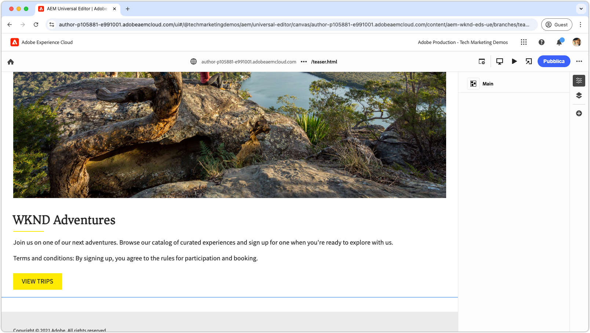
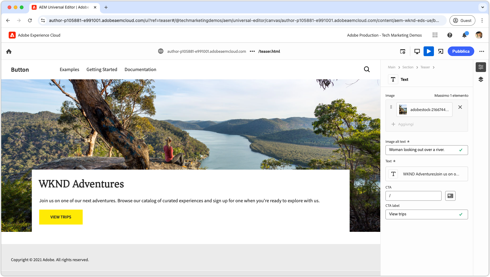
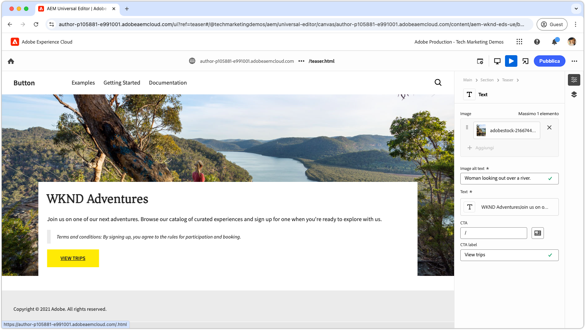
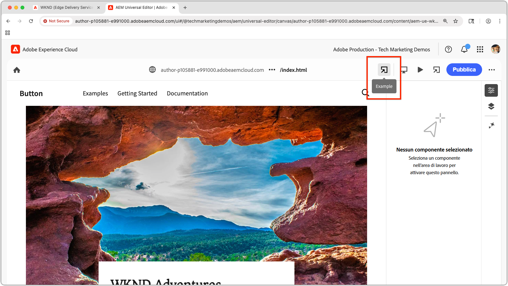

# Tutorial per sviluppatori di Edge Delivery Services e editor universale

In questo tutorial imparerai le nozioni di base per la creazione di un sito web AEM che combina funzionalità di authoring avanzate con l’editor universale e una distribuzione estremamente rapida tramite Edge Delivery Services. Al termine, avrai acquisito le nozioni di base per creare un nuovo progetto, configurare un ambiente di sviluppo locale e creare un nuovo blocco.

## Configurazione del progetto

Scopri come creare un progetto di codice e configurare un nuovo sito in AEM as a Cloud Service. Questa configurazione consente uno sviluppo diretto con l’editor universale per la creazione di contenuti e la distribuzione rapida dei contenuti tramite Edge Delivery Services.

<!-- CARDS 

* ./1-new-code-project.md
* ./2-new-aem-site.md

-->
<!-- START CARDS HTML - DO NOT MODIFY BY HAND -->

    

        

            

                <figure class="image x-is-16by9">
                    
                </figure>
            

            

                

                    

                        <a href="./1-new-code-project.md" target="_blank" rel="referrer" title="Creare un progetto di codice">Creare un progetto di codice</a>
                    

                    
Crea un progetto di codice per Edge Delivery Services, modificabile tramite l’editor universale.

                

                <a href="./1-new-code-project.md" target="_blank" rel="referrer" class="spectrum-Button spectrum-Button--outline spectrum-Button--primary spectrum-Button--sizeM" style="align-self: flex-start; margin-top: 1rem;">
                    Ulteriori informazioni
                </a>
            

        

    

    

        

            

                <figure class="image x-is-16by9">
                    
                </figure>
            

            

                

                    

                        <a href="./2-new-aem-site.md" target="_blank" rel="referrer" title="Creare un sito AEM">Creare un sito AEM</a>
                    

                    
Crea un sito in AEM Sites per Edge Delivery Services, modificabile tramite l’editor universale.

                

                <a href="./2-new-aem-site.md" target="_blank" rel="referrer" class="spectrum-Button spectrum-Button--outline spectrum-Button--primary spectrum-Button--sizeM" style="align-self: flex-start; margin-top: 1rem;">
                    Ulteriori informazioni
                </a>
            

        

    

<!-- END CARDS HTML - DO NOT MODIFY BY HAND -->

## Configurazione di sviluppo

Scopri come configurare l’ambiente di sviluppo locale per consentire lo sviluppo rapido di siti web. Questa configurazione consente una creazione diretta dei siti con l’editor universale e una distribuzione efficiente dei contenuti tramite Edge Delivery Services, garantendo un flusso di lavoro di sviluppo fluido e ottimizzato.
<!-- CARDS 

* ./3-local-development-environment.md
* ./4-website-branding.md

-->
<!-- START CARDS HTML - DO NOT MODIFY BY HAND -->

    

        

            

                <figure class="image x-is-16by9">
                    
                </figure>
            

            

                

                    

                        <a href="./3-local-development-environment.md" target="_blank" rel="referrer" title="Configurare un ambiente di sviluppo locale">Configurare un ambiente di sviluppo locale</a>
                    

                    
Configurare un ambiente di sviluppo locale per i siti da distribuire tramite Edge Delivery Services e modificabili con l’editor universale.

                

                <a href="./3-local-development-environment.md" target="_blank" rel="referrer" class="spectrum-Button spectrum-Button--outline spectrum-Button--primary spectrum-Button--sizeM" style="align-self: flex-start; margin-top: 1rem;">
                    Ulteriori informazioni
                </a>
            

        

    

    

        

            

                <figure class="image x-is-16by9">
                    
                </figure>
            

            

                

                    

                        <a href="./4-website-branding.md" target="_blank" rel="referrer" title="Aggiungere il branding al sito web">Aggiungere il branding al sito web</a>
                    

                    
Definisci i CSS globali, le variabili CSS e i font web per un sito Edge Delivery Services.

                

                <a href="./4-website-branding.md" target="_blank" rel="referrer" class="spectrum-Button spectrum-Button--outline spectrum-Button--primary spectrum-Button--sizeM" style="align-self: flex-start; margin-top: 1rem;">
                    Ulteriori informazioni
                </a>
            

        

    

<!-- END CARDS HTML - DO NOT MODIFY BY HAND -->

## Sviluppo di un blocco

Scopri come creare un nuovo blocco definendone il modello di contenuto e configurando contenuti di esempio per il test e lo sviluppo. Esplora due metodi per il rendering del blocco e scopri come strutturarlo per ottenere prestazioni e flessibilità ottimali in AEM e Edge Delivery Services.

<!-- CARDS 

* ./5-new-block.md {image = ./assets/5-new-block/card.png}
* ./6-author-block.md {image = ./assets/6-author-block/card.png}
* ./7a-block-css.md {image = ./assets/7a-block-css/card.png}
* ./7b-block-js-css.md {image = ./assets/7b-block-js-css/card.png}

-->
<!-- START CARDS HTML - DO NOT MODIFY BY HAND -->

    

        

            

                <figure class="image x-is-16by9">
                    
                </figure>
            

            

                

                    

                        <a href="./5-new-block.md" target="_blank" rel="referrer" title="Creare un blocco">Creare un blocco</a>
                    

                    
Crea un blocco per un sito web Edge Delivery Services modificabile con l’editor universale.

                

                <a href="./5-new-block.md" target="_blank" rel="referrer" class="spectrum-Button spectrum-Button--outline spectrum-Button--primary spectrum-Button--sizeM" style="align-self: flex-start; margin-top: 1rem;">
                    Ulteriori informazioni
                </a>
            

        

    

    

        

            

                <figure class="image x-is-16by9">
                    
                </figure>
            

            

                

                    

                        <a href="./6-author-block.md" target="_blank" rel="referrer" title="Authoring di un blocco">Authoring di un blocco</a>
                    

                    
Authoring di un blocco Edge Delivery Services con l’editor universale.

                

                <a href="./6-author-block.md" target="_blank" rel="referrer" class="spectrum-Button spectrum-Button--outline spectrum-Button--primary spectrum-Button--sizeM" style="align-self: flex-start; margin-top: 1rem;">
                    Ulteriori informazioni
                </a>
            

        

    

    

        

            

                <figure class="image x-is-16by9">
                    
                </figure>
            

            

                

                    

                        <a href="./7a-block-css.md" target="_blank" rel="referrer" title="Sviluppare un blocco con CSS">Sviluppare un blocco con CSS</a>
                    

                    
Sviluppa un blocco con CSS per Edge Delivery Services, modificabile tramite l’Editor universale.

                

                <a href="./7a-block-css.md" target="_blank" rel="referrer" class="spectrum-Button spectrum-Button--outline spectrum-Button--primary spectrum-Button--sizeM" style="align-self: flex-start; margin-top: 1rem;">
                    Ulteriori informazioni
                </a>
            

        

    

    

        

            

                <figure class="image x-is-16by9">
                    
                </figure>
            

            

                

                    

                        <a href="./7b-block-js-css.md" target="_blank" rel="referrer" title="Sviluppare un blocco con CSS e JS">Sviluppare un blocco con CSS e JS</a>
                    

                    
Sviluppa un blocco con CSS e JavaScript per Edge Delivery Services, modificabile tramite l’editor universale.

                

                <a href="./7b-block-js-css.md" target="_blank" rel="referrer" class="spectrum-Button spectrum-Button--outline spectrum-Button--primary spectrum-Button--sizeM" style="align-self: flex-start; margin-top: 1rem;">
                    Ulteriori informazioni
                </a>
            

        

    

<!-- END CARDS HTML - DO NOT MODIFY BY HAND -->

## Passaggi successivi

Dopo aver completato questo tutorial, metti in pratica ciò che hai imparato con queste procedure mirate. Queste guide approfondiscono il codice e i concetti trattati, esplorando casi d’uso specifici per singoli ruoli, tecniche avanzate e suggerimenti aggiuntivi per migliorare le competenze di sviluppo di Edge Delivery Services e dell’editor universale.

<!-- CARDS 

* ./how-to/block-options.md
* ./how-to/header-and-footer.md
* ./how-to/local-extension-preview.md {image = ./how-to/assets/local-extension-preview/extension-loaded.png}

-->
<!-- START CARDS HTML - DO NOT MODIFY BY HAND -->

    

        

            

                <figure class="image x-is-16by9">
                    
                </figure>
            

            

                

                    

                        <a href="./how-to/block-options.md" target="_blank" rel="referrer" title="Opzioni di blocco">Opzioni del blocco</a>
                    

                    
Scopri come creare un blocco con più opzioni di visualizzazione.

                

                <a href="./how-to/block-options.md" target="_blank" rel="referrer" class="spectrum-Button spectrum-Button--outline spectrum-Button--primary spectrum-Button--sizeM" style="align-self: flex-start; margin-top: 1rem;">
                    Ulteriori informazioni
                </a>
            

        

    

    

        

            

                <figure class="image x-is-16by9">
                    
                </figure>
            

            

                

                    

                        <a href="./how-to/header-and-footer.md" target="_blank" rel="referrer" title="Intestazione e piè di pagina">Intestazione e piè di pagina</a>
                    

                    
Scopri come intestazione e piè di pagina vengono sviluppati in Edge Delivery Services e nell’editor universale.

                

                <a href="./how-to/header-and-footer.md" target="_blank" rel="referrer" class="spectrum-Button spectrum-Button--outline spectrum-Button--primary spectrum-Button--sizeM" style="align-self: flex-start; margin-top: 1rem;">
                    Ulteriori informazioni
                </a>
            

        

    

    

        

            

                <figure class="image x-is-16by9">
                    
                </figure>
            

            

                

                    

                        <a href="./how-to/local-extension-preview.md" target="_blank" rel="referrer" title="Visualizzare in anteprima un’estensione per l’editor universale">Visualizzare in anteprima un’estensione per l’editor universale</a>
                    

                    
Scopri come visualizzare in anteprima un’estensione per l’editor universale in esecuzione locale durante lo sviluppo.

                

                <a href="./how-to/local-extension-preview.md" target="_blank" rel="referrer" class="spectrum-Button spectrum-Button--outline spectrum-Button--primary spectrum-Button--sizeM" style="align-self: flex-start; margin-top: 1rem;">
                    Ulteriori informazioni
                </a>
            

        

    

<!-- END CARDS HTML - DO NOT MODIFY BY HAND -->
