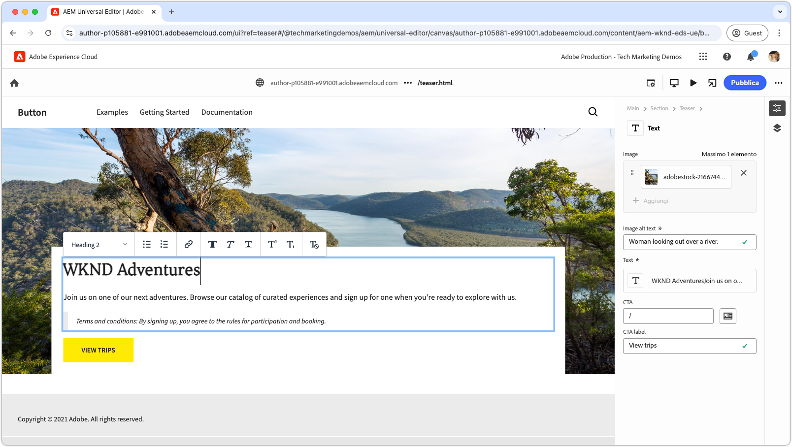
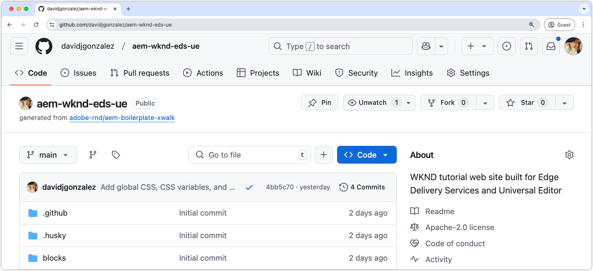

# Esercitazione per sviluppatori Edge Delivery Services e Universal Editor

In questa esercitazione imparerai le nozioni di base per la creazione di un sito Web AEM che combina funzionalità avanzate di authoring con Universal Editor e una distribuzione estremamente rapida tramite Edge Delivery Services. Entro la fine, avrai acquisito le nozioni di base per creare un nuovo progetto, configurare un ambiente di sviluppo locale e creare un nuovo blocco.

## Configurazione del progetto

Scopri come creare un progetto di codice e configurare un nuovo sito in AEM as a Cloud Service. Questa configurazione consente uno sviluppo senza soluzione di continuità con Universal Editor per la creazione di contenuti e la distribuzione rapida attraverso i Edge Delivery Services.

<!-- CARDS 

* ./1-new-code-project.md
  {}
* ./2-new-aem-site.md

-->
<!-- START CARDS HTML - DO NOT MODIFY BY HAND -->

    

        

            

                <figure class="image x-is-16by9">
                    
                </figure>
            

            

                

                    

                        <a href="./1-new-code-project.md" target="_blank" rel="referrer" title="Crea un nuovo progetto">Crea un nuovo progetto</a>
                    

                    
Crea un nuovo progetto per Edge Delivery Services per Universal Editor

                

                <a href="./1-new-code-project.md" target="_blank" rel="referrer" class="spectrum-Button spectrum-Button--outline spectrum-Button--primary spectrum-Button--sizeM" style="align-self: flex-start; margin-top: 1rem;">
                    Ulteriori informazioni
                </a>
            

        

    

    

        

            

                <figure class="image x-is-16by9">
                    
                </figure>
            

            

                

                    

                        <a href="./2-new-aem-site.md" target="_blank" rel="referrer" title="Crea un nuovo sito">Crea un nuovo sito</a>
                    

                    
Creazione di un nuovo sito in AEM Sites per Edge Delivery Services per Universal Editor

                

                <a href="./2-new-aem-site.md" target="_blank" rel="referrer" class="spectrum-Button spectrum-Button--outline spectrum-Button--primary spectrum-Button--sizeM" style="align-self: flex-start; margin-top: 1rem;">
                    Ulteriori informazioni
                </a>
            

        

    

<!-- END CARDS HTML - DO NOT MODIFY BY HAND -->

## Configurazione dello sviluppo

Scopri come configurare l’ambiente di sviluppo locale per abilitare lo sviluppo rapido dei siti web. Questa configurazione consente una creazione fluida dei siti con Universal Editor e una distribuzione efficiente dei contenuti attraverso i Edge Delivery Services, garantendo un flusso di lavoro di sviluppo fluido e ottimizzato.
<!-- CARDS 

* ./3-local-development-environment.md
* ./4-website-branding.md

-->
<!-- START CARDS HTML - DO NOT MODIFY BY HAND -->

    

        

            

                <figure class="image x-is-16by9">
                    
                </figure>
            

            

                

                    

                        <a href="./3-local-development-environment.md" target="_blank" rel="referrer" title="Configurare un ambiente di sviluppo locale">Configurare un ambiente di sviluppo locale</a>
                    

                    
Crea un nuovo progetto per Edge Delivery Services per Universal Editor

                

                <a href="./3-local-development-environment.md" target="_blank" rel="referrer" class="spectrum-Button spectrum-Button--outline spectrum-Button--primary spectrum-Button--sizeM" style="align-self: flex-start; margin-top: 1rem;">
                    Ulteriori informazioni
                </a>
            

        

    

    

        

            

                <figure class="image x-is-16by9">
                    
                </figure>
            

            

                

                    

                        <a href="./4-website-branding.md" target="_blank" rel="referrer" title="Marchio del sito web">Branding del sito Web</a>
                    

                    
Imposta i CSS globali, le variabili CSS e i font web.

                

                <a href="./4-website-branding.md" target="_blank" rel="referrer" class="spectrum-Button spectrum-Button--outline spectrum-Button--primary spectrum-Button--sizeM" style="align-self: flex-start; margin-top: 1rem;">
                    Ulteriori informazioni
                </a>
            

        

    

<!-- END CARDS HTML - DO NOT MODIFY BY HAND -->

## Blocca sviluppo

Scopri come creare un nuovo blocco definendone il modello di contenuto e configurando contenuti di esempio per il test e lo sviluppo. Esplora due metodi per il rendering del blocco e scopri come strutturarlo per ottenere prestazioni e flessibilità ottimali in AEM e Edge Delivery Services.

<!-- CARDS 

* ./5-new-block.md
* ./6-author-block.md
* ./7a-block-css.md
* ./7b-block-js-css.md

-->
<!-- START CARDS HTML - DO NOT MODIFY BY HAND -->

    

        

            

                <figure class="image x-is-16by9">
                    
                </figure>
            

            

                

                    

                        <a href="./5-new-block.md" target="_blank" rel="referrer" title="Crea un nuovo blocco per l’editor universale">Crea un nuovo blocco per Universal Editor</a>
                    

                    
Crea un nuovo blocco.

                

                <a href="./5-new-block.md" target="_blank" rel="referrer" class="spectrum-Button spectrum-Button--outline spectrum-Button--primary spectrum-Button--sizeM" style="align-self: flex-start; margin-top: 1rem;">
                    Ulteriori informazioni
                </a>
            

        

    

    

        

            

                <figure class="image x-is-16by9">
                    
                </figure>
            

            

                

                    

                        <a href="./6-author-block.md" target="_blank" rel="referrer" title="Creare il blocco">Crea il blocco</a>
                    

                    
Crea il nuovo blocco in modo che possa svilupparsi su di esso.

                

                <a href="./6-author-block.md" target="_blank" rel="referrer" class="spectrum-Button spectrum-Button--outline spectrum-Button--primary spectrum-Button--sizeM" style="align-self: flex-start; margin-top: 1rem;">
                    Ulteriori informazioni
                </a>
            

        

    

    

        

            

                <figure class="image x-is-16by9">
                    
                </figure>
            

            

                

                    

                        <a href="./7a-block-css.md" target="_blank" rel="referrer" title="Blocca sviluppo con CSS">Blocca lo sviluppo con CSS</a>
                    

                    
Crea il blocco utilizzando solo CSS.

                

                <a href="./7a-block-css.md" target="_blank" rel="referrer" class="spectrum-Button spectrum-Button--outline spectrum-Button--primary spectrum-Button--sizeM" style="align-self: flex-start; margin-top: 1rem;">
                    Ulteriori informazioni
                </a>
            

        

    

    

        

            

                <figure class="image x-is-16by9">
                    
                </figure>
            

            

                

                    

                        <a href="./7b-block-js-css.md" target="_blank" rel="referrer" title="Blocca lo sviluppo con CSS e JS">Blocca lo sviluppo con CSS e JS</a>
                    

                    
Crea un blocco utilizzando CSS e JS.

                

                <a href="./7b-block-js-css.md" target="_blank" rel="referrer" class="spectrum-Button spectrum-Button--outline spectrum-Button--primary spectrum-Button--sizeM" style="align-self: flex-start; margin-top: 1rem;">
                    Ulteriori informazioni
                </a>
            

        

    

<!-- END CARDS HTML - DO NOT MODIFY BY HAND -->
