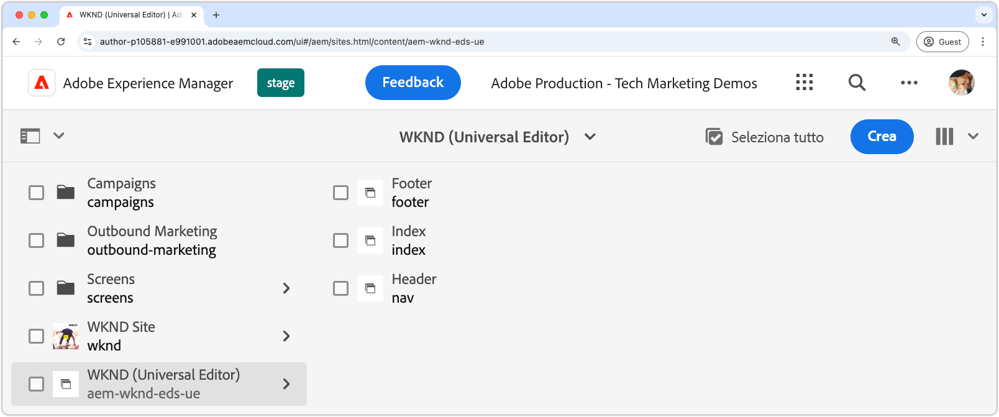

# Creazione di un sito AEM

Il sito AEM è il luogo da cui il contenuto del sito web viene modificato, gestito e pubblicato. Per creare un sito AEM distribuito tramite Edge Delivery Services e creato utilizzando Universal Editor, utilizzare il modello del sito di authoring [Edge Delivery Services con AEM](https://github.com/adobe-rnd/aem-boilerplate-xwalk/releases) per creare un nuovo sito in AEM Author.

Il sito AEM è il luogo in cui il contenuto del sito web viene memorizzato e creato. L&#39;esperienza finale è una combinazione del contenuto del sito AEM con il codice del [sito Web](./1-new-code-project.md).

Segui i [passaggi dettagliati descritti nella documentazione](https://experienceleague.adobe.com/it/docs/experience-manager-cloud-service/content/edge-delivery/wysiwyg-authoring/edge-dev-getting-started#create-aem-site) per creare un nuovo sito AEM.  Di seguito è riportato un elenco riepilogativo dei passaggi, inclusi i valori utilizzati in questa esercitazione.
1. **Crea un nuovo sito** in AEM Author. Questa esercitazione utilizza la seguente denominazione del sito:
   * Titolo sito: `WKND (Universal Editor)`
   * Nome sito: `aem-wknd-eds-ue`

      * Il valore del nome del sito deve corrispondere al nome del percorso del sito [ aggiunto a `paths.json`](https://experienceleague.adobe.com/it/docs/experience-manager-cloud-service/content/edge-delivery/wysiwyg-authoring/path-mapping).

2. **Importa il modello più recente** da [Edge Delivery Services con il modello del sito di authoring AEM](https://github.com/adobe-rnd/aem-boilerplate-xwalk/releases).
3. **Assegnare un nome al sito** in modo che corrisponda al nome dell&#39;archivio GitHub e impostare l&#39;URL GitHub come URL dell&#39;archivio.

## Pubblica il nuovo sito in anteprima

Dopo aver creato il sito in AEM Author, pubblicalo nell&#39;anteprima di Edge Delivery Services rendendo il contenuto disponibile per l&#39;[ambiente di sviluppo locale](./3-local-development-environment.md).

1. Accedi a **AEM Author** e passa a **Sites**.
2. Seleziona il **nuovo sito** (`WKND (Universal Editor)`) e fai clic su **Gestisci pubblicazioni**.
3. Scegli **Anteprima** in **Destinazioni** e fai clic su **Avanti**.
4. In **Includi impostazioni figlio**, selezionare **Includi elementi figlio**, deselezionare altre opzioni e fare clic su **OK**.
5. Fai clic su **Pubblica** per pubblicare il contenuto del sito in anteprima.
6. Una volta pubblicate in anteprima, le pagine sono disponibili nell’ambiente di anteprima di Edge Delivery Services (non verranno visualizzate nel servizio di anteprima di AEM).
