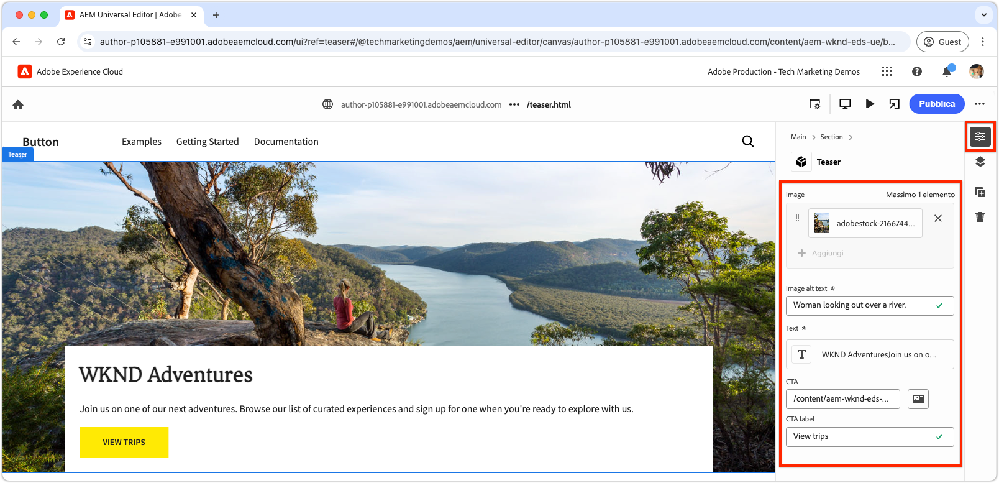
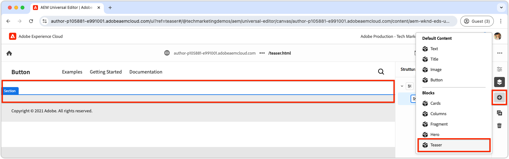

# Crea un nuovo blocco

In questo capitolo viene descritta la procedura di creazione di un nuovo blocco teaser modificabile per un sito Web di Edge Delivery Services tramite l’Editor universale.


Il blocco, denominato `teaser`, presenta i seguenti elementi:

- **Immagine**: immagine visivamente coinvolgente.
- **Contenuto testo**:
   - **Titolo**: titolo convincente da evidenziare.
   - **Corpo del testo**: contenuto descrittivo che fornisce contesto o dettagli, inclusi termini e condizioni facoltativi.
   - **Pulsante di invito all&#39;azione (CTA)**: collegamento progettato per richiedere l&#39;interazione dell&#39;utente e guidarlo verso un coinvolgimento maggiore.

Il contenuto del blocco `teaser` può essere modificato nell&#39;editor universale per garantirne la facilità d&#39;uso e di riutilizzo in tutto il sito Web.

Nota che il blocco `teaser` è simile al blocco `hero` della boilerplate; pertanto il blocco `teaser` è inteso solo come semplice esempio per illustrare i concetti di sviluppo.

## Crea un nuovo ramo Git

Per mantenere un flusso di lavoro pulito e organizzato, crea un nuovo ramo per ogni attività di sviluppo specifica. Questo consente di evitare problemi durante la distribuzione di codice incompleto o non testato in produzione.

1. **Inizia dal ramo principale**: l&#39;utilizzo del codice di produzione più aggiornato garantisce una solida base.
2. **Recupera modifiche remote**: il recupero degli aggiornamenti più recenti da GitHub assicura che il codice più recente sia disponibile prima di iniziare lo sviluppo.
   - Esempio: dopo aver unito le modifiche dal ramo `wknd-styles` in `main`, recupera gli aggiornamenti più recenti.
3. **Crea un nuovo ramo**:

```bash
# ~/Code/aem-wknd-eds-ue

$ git fetch origin  
$ git checkout -b teaser origin/main  
```

Una volta creato il ramo `teaser`, puoi iniziare a sviluppare il blocco teaser.

## Blocca cartella

Creare una nuova cartella denominata `teaser` nella directory `blocks` del progetto. Questa cartella contiene i file JSON, CSS e JavaScript del blocco, organizzando i file del blocco in una posizione:

```
# ~/Code/aem-wknd-eds-ue

/blocks/teaser
```

Il nome della cartella del blocco funge da ID del blocco e viene utilizzato per fare riferimento al blocco durante il suo sviluppo.

## Blocca JSON

Il JSON del blocco definisce tre aspetti chiave del blocco:

- **Definizione**: registra il blocco come componente modificabile nell&#39;editor universale, collegandolo a un modello di blocco e facoltativamente a un filtro.
- **Modello**: specifica i campi di authoring del blocco e il modo in cui vengono visualizzati come HTML Edge Delivery Services semantici.
- **Filtro**: configura le regole di filtro per limitare a quali contenitori è possibile aggiungere il blocco tramite l&#39;editor universale. La maggior parte dei blocchi non sono contenitori, ma i loro ID vengono aggiunti ai filtri di altri blocchi contenitore.

Creare un nuovo file in `/blocks/teaser/_teaser.json` con la seguente struttura iniziale, nell&#39;ordine esatto. Se le chiavi non sono nell&#39;ordine corretto, potrebbero non essere create correttamente.

[!BADGE /blocks/teaser/_teaser.json]{type=Neutral tooltip="Nome del file dell’esempio di codice riportato di seguito."}

```json
{
    "definitions": [],
    "models": [],
    "filters": []
}
```

### Modello a blocchi

Il modello di blocco è una parte critica della configurazione del blocco, in quanto definisce:

1. L’esperienza di authoring definendo i campi disponibili per la modifica.

   

2. Come vengono riprodotti i valori del campo in Edge Delivery Services HTML.

Ai modelli viene assegnato un `id` che corrisponde alla definizione del blocco [](#block-definition) e include un array `fields` per specificare i campi modificabili.

Ogni campo nell&#39;array `fields` ha un oggetto JSON che include le seguenti proprietà obbligatorie:

| Proprietà JSON | Descrizione |
|---------------|-----------------------------------------------------------------------------------------------------------------------|
| `component` | Il tipo di campo [](https://experienceleague.adobe.com/en/docs/experience-manager-cloud-service/content/implementing/developing/universal-editor/field-types#component-types), ad esempio `text`, `reference` o `aem-content`. |
| `name` | Nome del campo, con mapping alla proprietà JCR in cui il valore è memorizzato nell’AEM. |
| `label` | Etichetta visualizzata agli autori nell&#39;editor universale. |

Per un elenco completo delle proprietà, incluse quelle facoltative, consulta la [documentazione sui campi dell&#39;editor universale](https://experienceleague.adobe.com/en/docs/experience-manager-cloud-service/content/implementing/developing/universal-editor/field-types#fields).

#### Blocca progettazione


Il blocco teaser include i seguenti elementi modificabili:

1. **Immagine**: rappresenta il contenuto visivo del teaser.
2. **Contenuto testo**: include il titolo, il corpo del testo e il pulsante di invito all&#39;azione e si trova in un rettangolo bianco.
   - Il **titolo** e il **corpo del testo** possono essere creati tramite lo stesso editor Rich Text.
   - **CTA** può essere creato tramite un campo `text` per **label** e `aem-content` per **link**.

Il design del blocco teaser è suddiviso in questi due componenti logici (contenuto immagine e testo), garantendo un’esperienza di authoring strutturata e intuitiva per gli utenti.

### Blocca campi

Definisci i campi necessari per il blocco: immagine, testo alternativo immagine, testo, etichetta CTA e collegamento CTA.

>[!BEGINTABS]

>[!TAB Nel modo giusto]

**Questa scheda illustra il modo corretto per modellare il blocco teaser.**

Il teaser è costituito da due aree logiche: immagine e testo. Per semplificare il codice necessario per visualizzare Edge Delivery Services HTML come esperienza web desiderata, il modello a blocchi deve riflettere questa struttura.

- Raggruppa **image** e **image alt text** utilizzando [field collapse](https://experienceleague.adobe.com/en/docs/experience-manager-cloud-service/content/edge-delivery/wysiwyg-authoring/content-modeling#field-collapse).
- Raggruppa i campi di contenuto di testo utilizzando [raggruppamento di elementi](https://experienceleague.adobe.com/en/docs/experience-manager-cloud-service/content/edge-delivery/wysiwyg-authoring/content-modeling#element-grouping) e [compressione del campo per CTA](https://experienceleague.adobe.com/en/docs/experience-manager-cloud-service/content/edge-delivery/wysiwyg-authoring/content-modeling#field-collapse).

Se non hai familiarità con [compressione campo](https://experienceleague.adobe.com/en/docs/experience-manager-cloud-service/content/edge-delivery/wysiwyg-authoring/content-modeling#field-collapse), [raggruppamento elementi](https://experienceleague.adobe.com/en/docs/experience-manager-cloud-service/content/edge-delivery/wysiwyg-authoring/content-modeling#element-grouping) o [inferenza tipo](https://experienceleague.adobe.com/en/docs/experience-manager-cloud-service/content/edge-delivery/wysiwyg-authoring/content-modeling#type-inference), prima di continuare controlla la documentazione collegata, in quanto sono essenziali per creare un modello di blocco ben strutturato.

Nell’esempio seguente:

- [L&#39;inferenza dei tipi](https://experienceleague.adobe.com/en/docs/experience-manager-cloud-service/content/edge-delivery/wysiwyg-authoring/content-modeling#type-inference) viene utilizzata per creare automaticamente un elemento HTML `` dal campo `image`. La compressione del campo viene utilizzata con i campi `image` e `imageAlt` per creare un elemento HTML ``. L&#39;attributo `src` è impostato sul valore del campo `image`, mentre l&#39;attributo `alt` è impostato sul valore del campo `imageAlt`.
- `textContent` è un nome di gruppo utilizzato per categorizzare i campi. Deve essere semantico, ma può essere qualsiasi cosa specifica di questo blocco. Questo comunica all&#39;Editor universale di eseguire il rendering di tutti i campi con questo prefisso all&#39;interno dello stesso elemento `<div>` nell&#39;output HTML finale.
- La compressione del campo viene applicata anche nel gruppo `textContent` per l&#39;invito all&#39;azione (CTA). Il CTA viene creato come `<a>` tramite [inferenza di tipo](https://experienceleague.adobe.com/en/docs/experience-manager-cloud-service/content/edge-delivery/wysiwyg-authoring/content-modeling#type-inference). Il campo `cta` viene utilizzato per impostare l&#39;attributo `href` dell&#39;elemento `<a>` e il campo `ctaText` fornisce il contenuto di testo per il collegamento all&#39;interno dei tag `<a ...>`.

[!BADGE /blocks/teaser/_teaser.json]{type=Neutral tooltip="Nome del file dell’esempio di codice riportato di seguito."}

```json
{
    "definitions": [],
    "models": [
        {
            "id": "teaser", 
            "fields": [
                {
                    "component": "reference",
                    "valueType": "string",
                    "name": "image",
                    "label": "Image",
                    "multi": false
                },
                {
                    "component": "text",
                    "valueType": "string",
                    "name": "imageAlt",
                    "label": "Image alt text",
                    "required": true
                },
                {
                    "component": "richtext",
                    "name": "textContent_text",
                    "label": "Text",
                    "valueType": "string",
                    "required": true
                },
                {
                    "component": "aem-content",
                    "name": "textContent_cta",
                    "label": "CTA",
                    "valueType": "string"
                },
                {
                    "component": "text",
                    "name": "textContent_ctaText",
                    "label": "CTA label",
                    "valueType": "string"
                }
            ]
        }
    ],
    "filters": []
}
```

Questo modello definisce gli input di authoring nell’Editor universale per il blocco.

Il HTML Edge Delivery Services risultante per questo blocco inserisce l&#39;immagine nel primo div e i campi gruppo di elementi `textContent` nel secondo div.

```html
<div>
    <div>
        <!-- This div contains the field-collapsed image fields  -->
        <picture>
            ...
            <source .../>            
            
        </picture>
    </div>
    <div>
        <!-- This div, via element grouping contains the textContent fields -->
        <h2>The authored title</h2>
        <p>The authored body text</p>
        <a href="/authored/cta/link">The authored CTA label</a>
    </div>
</div>        
```

Come dimostrato [nel prossimo capitolo](./7a-block-css.md), questa struttura HTML semplifica la formattazione del blocco come unità coesiva.

Per capire le conseguenze del mancato utilizzo della compressione dei campi e del raggruppamento di elementi, vedi la scheda **Nel modo sbagliato** qui sopra.

>[!TAB Nel modo sbagliato]

**Questa scheda illustra un modo non ottimale per modellare il blocco teaser ed è solo una giustapposizione al modo giusto.**

Definire ogni campo come campo autonomo nel modello di blocco senza utilizzare [compressione del campo](https://experienceleague.adobe.com/en/docs/experience-manager-cloud-service/content/edge-delivery/wysiwyg-authoring/content-modeling#field-collapse) e [raggruppamento di elementi](https://experienceleague.adobe.com/en/docs/experience-manager-cloud-service/content/edge-delivery/wysiwyg-authoring/content-modeling#element-grouping) può sembrare interessante. Tuttavia, questo scostamento complica la creazione del blocco come un&#39;unità coesiva.

Ad esempio, il modello teaser potrebbe essere definito **senza** compressione di campo o raggruppamento di elementi come segue:

[!BADGE /blocks/teaser/_teaser.json]{type=Neutral tooltip="Nome del file dell’esempio di codice riportato di seguito."}

```json
{
    "definitions": [],
    "models": [
        {
            "id": "teaser", 
            "fields": [
                {
                    "component": "reference",
                    "valueType": "string",
                    "name": "image",
                    "label": "Image",
                    "multi": false
                },
                {
                    "component": "text",
                    "valueType": "string",
                    "name": "alt",
                    "label": "Image alt text",
                    "required": true
                },
                {
                    "component": "richtext",
                    "name": "text",
                    "label": "Text",
                    "valueType": "string",
                    "required": true
                },
                {
                    "component": "aem-content",
                    "name": "link",
                    "label": "CTA",
                    "valueType": "string"
                },
                {
                    "component": "text",
                    "name": "label",
                    "label": "CTA label",
                    "valueType": "string"
                }
            ]
        }
    ],
    "filters": []
}
```

Il HTML di Edge Delivery Services per il blocco esegue il rendering del valore di ogni campo in un `div` separato, complicando la comprensione del contenuto, l&#39;applicazione dello stile e le regolazioni della struttura dei HTML per ottenere la progettazione desiderata.

```html
<div>
    <div>
        <!-- This div contains the field-collapsed image  -->
        <picture>
            ...
            <source .../>            
            
        </picture>
    </div>
    <div>
        <p>The authored alt text</p>
    </div>
    <div>
        <h2>The authored title</h2>
        <p>The authored body text</p>
    </div>
    <div>
        <a href="/authored/cta/link">/authored/cta/link</a>
    </div>
    <div>
        The authored CTA label
    </div>
</div>        
```

Ogni campo è isolato nel proprio `div`, rendendo difficile formattare l&#39;immagine e il contenuto di testo come unità coesive. È possibile ottenere la progettazione desiderata con impegno e creatività, ma utilizzare [il raggruppamento di elementi](https://experienceleague.adobe.com/en/docs/experience-manager-cloud-service/content/edge-delivery/wysiwyg-authoring/content-modeling#element-grouping) per raggruppare i campi di contenuto di testo e [la compressione dei campi](https://experienceleague.adobe.com/en/docs/experience-manager-cloud-service/content/edge-delivery/wysiwyg-authoring/content-modeling#field-collapse) per aggiungere valori creati come attributi di elemento è più semplice, semplice e corretto dal punto di vista semantico.

Consulta la scheda **Modalità di scrittura** per informazioni su come modellare meglio il blocco teaser.

>[!ENDTABS]


### Definizione blocco

La definizione del blocco registra il blocco in Universal Editor. Ecco un raggruppamento delle proprietà JSON utilizzate nella definizione del blocco:

| Proprietà JSON | Descrizione |
|---------------|-------------|
| `definition.title` | Titolo del blocco visualizzato nei blocchi **Add** dell&#39;editor universale. |
| `definition.id` | ID univoco del blocco, utilizzato per controllarne l&#39;utilizzo in `filters`. |
| `definition.plugins.xwalk.page.resourceType` | Definisce il tipo di risorsa Sling per il rendering del componente nell’Editor universale. Utilizza sempre un tipo di risorsa `core/franklin/components/block/v#/block`. |
| `definition.plugins.xwalk.page.template.name` | Nome del blocco. Deve essere minuscolo e sillabato in modo che corrisponda al nome della cartella del blocco. Questo valore viene utilizzato anche per etichettare l’istanza del blocco nell’Editor universale. |
| `definition.plugins.xwalk.page.template.model` | Collega questa definizione alla relativa definizione `model`, che controlla i campi di authoring visualizzati per il blocco nell&#39;editor universale. Il valore qui deve corrispondere a un valore `model.id`. |

Di seguito è riportato un esempio di JSON per la definizione del blocco:

[!BADGE /blocks/teaser/_teaser.json]{type=Neutral tooltip="Nome del file dell’esempio di codice riportato di seguito."}

```json
{
    "definitions": [{
      "title": "Teaser",
      "id": "teaser",
      "plugins": {
        "xwalk": {
          "page": {
            "resourceType": "core/franklin/components/block/v1/block",
            "template": {
              "name": "Teaser",
              "model": "teaser",
              "textContent_text": "<h2>Enter a title</h2><p>...and body text here!</p>",
              "textContent_cta": "/",
              "textContent_ctaText": "Click me!"
            }
          }
        }
      }
    }],
    "models": [... from previous section ...],
    "filters": []
}
```

In questo esempio:

- Il blocco è denominato &quot;Teaser&quot; e utilizza il modello `teaser` che determina i campi disponibili per la modifica nell&#39;editor universale.
- Il blocco include il contenuto predefinito per il campo `textContent_text`, che è un&#39;area Rich Text per il titolo e il corpo del testo, e `textContent_cta` e `textContent_ctaText` per il collegamento e l&#39;etichetta CTA (invito all&#39;azione). I nomi dei campi del modello contenenti il contenuto iniziale corrispondono ai nomi dei campi definiti nella matrice dei campi del modello di contenuto [](#block-model);

Questa struttura garantisce che il blocco sia configurato nell’Editor universale con i campi, il modello di contenuto e il tipo di risorsa appropriati per il rendering.

### Blocca filtri

L&#39;array `filters` del blocco definisce, per [blocchi contenitore](https://experienceleague.adobe.com/en/docs/experience-manager-cloud-service/content/edge-delivery/wysiwyg-authoring/content-modeling#container), quali altri blocchi possono essere aggiunti al contenitore. I filtri definiscono un elenco di ID di blocco (`model.id`) che possono essere aggiunti al contenitore.

[!BADGE /blocks/teaser/_teaser.json]{type=Neutral tooltip="Nome del file dell’esempio di codice riportato di seguito."}

```json
{
  "definitions": [... populated from previous section ...],
  "models": [... populated from previous section ...],
  "filters": []
}
```

Il componente teaser non è un [blocco contenitore](https://experienceleague.adobe.com/en/docs/experience-manager-cloud-service/content/edge-delivery/wysiwyg-authoring/content-modeling#container), pertanto non è possibile aggiungervi altri blocchi. Di conseguenza, il relativo array `filters` è lasciato vuoto. Aggiungi invece l’ID del teaser all’elenco dei filtri del blocco di sezione, in modo che possa essere aggiunto a una sezione.



I blocchi forniti da Adobe, ad esempio il blocco di sezione, memorizzano i filtri nella cartella `models` del progetto. Per modificare, individuare il file JSON per il blocco fornito dall&#39;Adobe (ad esempio, `/models/_section.json`) e aggiungere l&#39;ID del teaser (`teaser`) all&#39;elenco dei filtri. La configurazione segnala all’Editor universale che il componente teaser può essere aggiunto al blocco del contenitore sezione.

[!BADGE /models/_section.json]{type=Neutral tooltip="Nome del file dell’esempio di codice riportato di seguito."}

```json
{
  "definitions": [],
  "models": [],
  "filters": [
    {
      "id": "section",
      "components": [
        "text",
        "image",
        "button",
        "title",
        "hero",
        "cards",
        "columns",
        "fragment",
        "teaser"
      ]
    }
  ]
}
```

L&#39;ID di definizione del blocco del teaser `teaser` è stato aggiunto all&#39;array `components`.

## Illustra i file JSON

Assicurati di [collegare frequentemente](./3-local-development-environment.md#linting) le modifiche per assicurarti che siano pulite e coerenti. La colorazione consente di risolvere i problemi in anticipo e riduce il tempo di sviluppo complessivo. Il comando `npm run lint:js` collega anche i file JSON e rileva eventuali errori di sintassi.

```bash
# ~/Code/aem-wknd-eds-ue

$ npm run lint:js
```

## Generare il progetto JSON

Dopo aver configurato i file JSON di blocco (`blocks/teaser/_teaser.json`, `models/_section.json`), è necessario compilarli nei file `component-models.json`, `component-definitions.json` e `component-filters.json` del progetto. La compilazione viene eseguita eseguendo gli script [build JSON](./3-local-development-environment.md#build-json-fragments) npm del progetto.

```bash
# ~/Code/aem-wknd-eds-ue

$ npm run build:json
```

## Distribuire la definizione del blocco

Per rendere il blocco disponibile nell&#39;editor universale, è necessario eseguire il commit del progetto e inviarlo al ramo di un archivio GitHub, in questo caso il ramo `teaser`.

Il nome del ramo utilizzato da Universal Editor può essere regolato, per utente, tramite l’URL di Universal Editor.

```bash
# ~/Code/aem-wknd-eds-ue

$ git add .
$ git commit -m "Add teaser block JSON files so it is available in Universal Editor"
$ git push origin teaser
```

Quando si apre Universal Editor con il parametro di query `?ref=teaser`, il nuovo blocco `teaser` viene visualizzato nella tavolozza dei blocchi. Il blocco non ha uno stile; esegue il rendering dei campi del blocco come HTML semantico, con uno stile solo tramite il [CSS globale](./4-website-branding.md#global-css).
