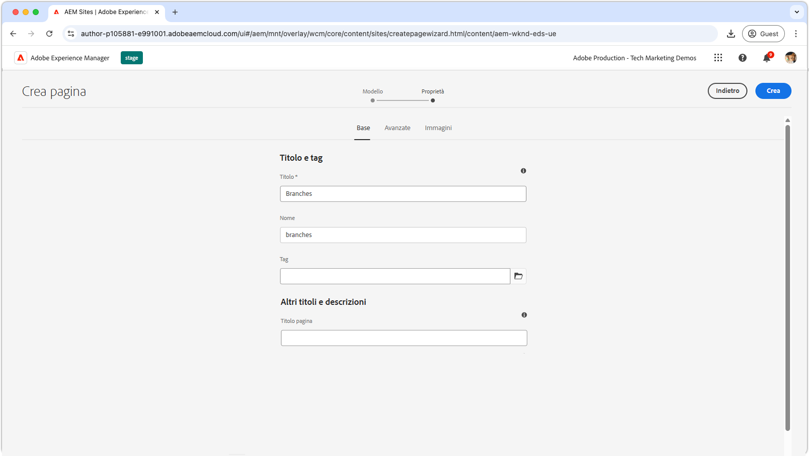
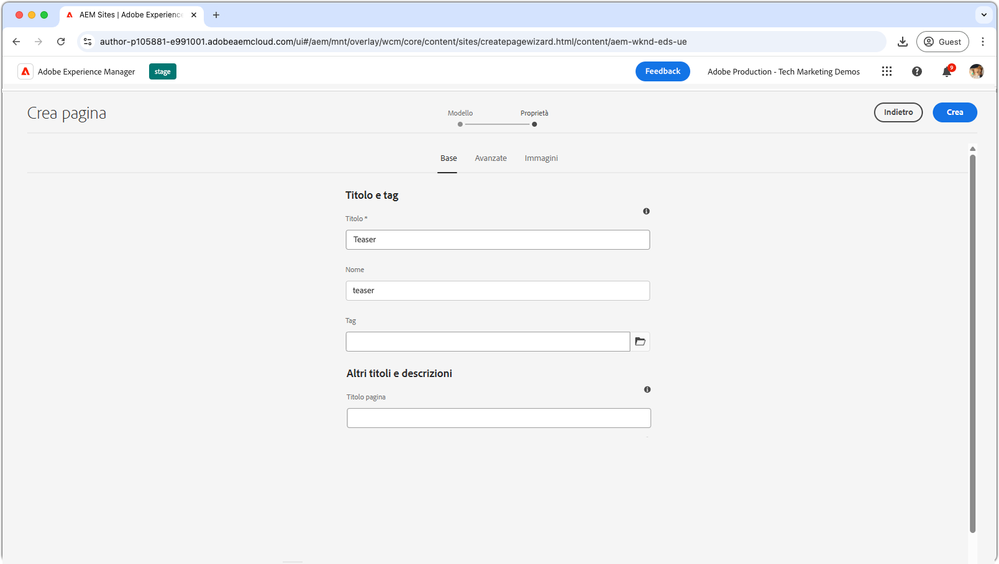
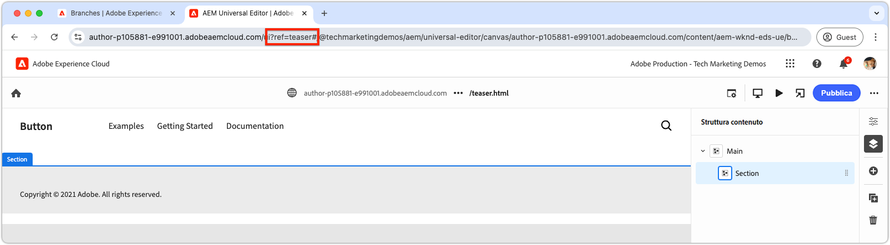
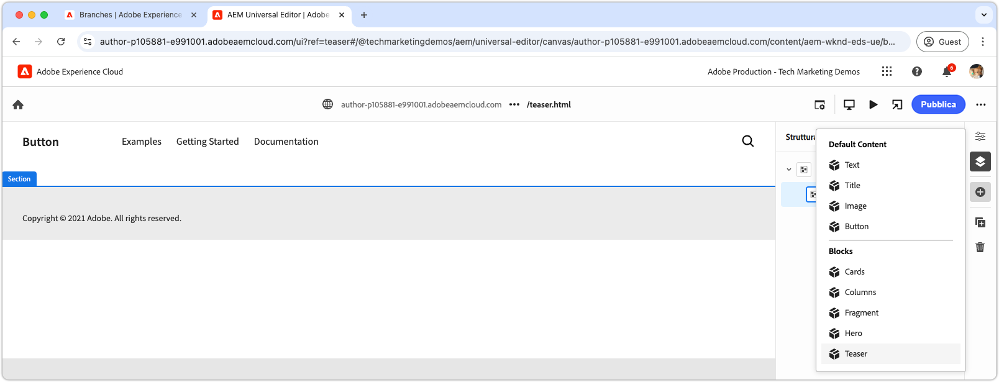
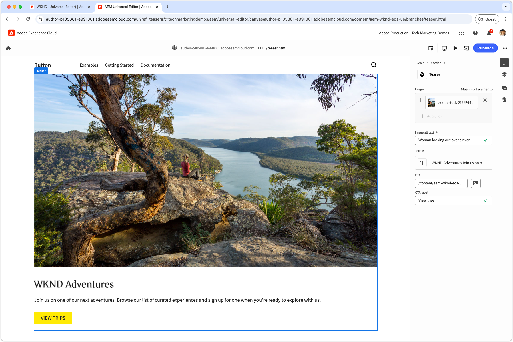

# Creare un blocco

Dopo aver inviato il JSON](./5-new-block.md) del blocco del teaser [ al ramo `teaser`, il blocco diventa modificabile nell&#39;editor universale AEM.

L’authoring di un blocco in sviluppo è importante per diversi motivi:

1. Verifica che la definizione e il modello del blocco siano accurati.
1. Consente agli sviluppatori di rivedere il HTML semantico del blocco, che funge da base per lo sviluppo.
1. Consente la distribuzione sia dei contenuti che dei HTML semantici nell’ambiente di anteprima, supportando uno sviluppo più rapido dei blocchi.

## Apri Universal Editor utilizzando il codice del ramo `teaser`

1. Accedi a AEM Author.
2. Passa a **Sites** e seleziona il sito (WKND (Universal Editor)) creato nel [capitolo precedente](./2-new-aem-site.md).

   

3. Crea o modifica una pagina per aggiungere il nuovo blocco, assicurandoti che il contesto sia disponibile per supportare lo sviluppo locale. Anche se le pagine possono essere create ovunque all’interno del sito, spesso è meglio creare pagine discrete per ogni nuovo corpo di lavoro. Crea una nuova pagina &quot;cartella&quot; denominata **Rami**. Ogni pagina secondaria viene utilizzata per supportare lo sviluppo dello stesso ramo Git denominato.

   

4. Nella pagina **Rami**, crea una nuova pagina con titolo **Teaser**, corrispondente al nome del ramo di sviluppo, quindi fai clic su **Apri** per modificare la pagina.

   

5. Aggiornare Universal Editor per caricare il codice dal ramo `teaser` aggiungendo `?ref=teaser` all&#39;URL. Assicurarsi di aggiungere il parametro di query **BEFORE** al simbolo `#`.

   

6. Seleziona la prima sezione in **Principale**, fai clic sul pulsante **aggiungi** e scegli il blocco **Teaser**.

   

7. Nell’area di lavoro, seleziona il teaser appena aggiunto e crea i campi a destra oppure tramite la funzionalità di modifica in linea.

   

8. Dopo aver completato l&#39;authoring, passa alla scheda precedente del browser (AEM Sites Admin), seleziona la pagina Teaser, fai clic su **Gestisci pubblicazioni**, scegli **Anteprima** e pubblica le modifiche nell&#39;ambiente di anteprima. Le modifiche vengono quindi pubblicate nel dominio `aem.page` del sito Web.
   

9. Attendi che le modifiche vengano pubblicate in anteprima, quindi apri la pagina Web tramite [AEM CLI](./3-local-development-environment.md#install-the-aem-cli) all&#39;indirizzo [http://localhost:3000/branches/teaser](http://localhost:3000/branches/teaser).

   

Ora il contenuto e le HTML semantiche del blocco teaser creato sono disponibili sul sito web di anteprima, pronti per lo sviluppo utilizzando l’interfaccia CLI dell’AEM nell’ambiente di sviluppo locale.
