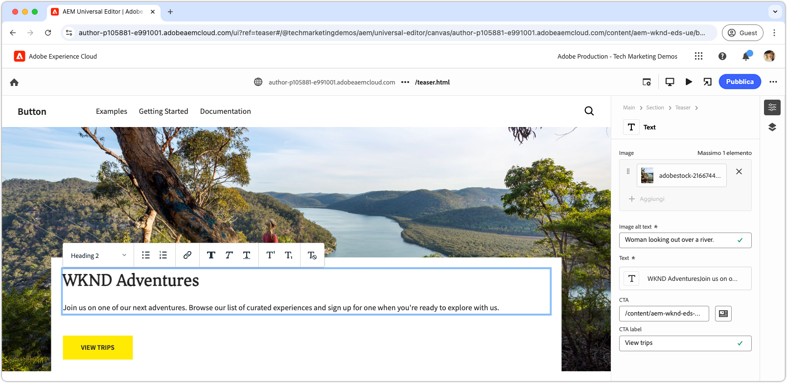

# Sviluppare un blocco con CSS

Lo stile dei blocchi in Edge Delivery Services viene definito mediante CSS. Il file CSS di un blocco viene memorizzato nella directory del blocco stesso, e con lo stesso nome del blocco. Ad esempio, il file CSS per un blocco denominato `teaser` si trova in `blocks/teaser/teaser.css`.

Idealmente, un blocco necessita solo del CSS per l’applicazione dello stile, senza ricorrere a JavaScript per modificare il DOM o aggiungere classi CSS. JavaScript potrebbe essere necessario a seconda della [modellazione del contenuto](./5-new-block.md#block-model) del blocco e dalla sua complessità. Se serve, è possibile aggiungere il [blocco JavaScript](./7b-block-js-css.md).

Utilizzando un approccio basato solo su CSS, è possibile applicare lo stile a specifici e (per lo più) semplici elementi HTML semantici del blocco.

## HTML del blocco

Per capire come applicare uno stile a un blocco, rivedi innanzitutto il DOM esposto da Edge Delivery Services, in quanto è ciò che è disponibile per lo stile. Per trovare il DOM, ispeziona il blocco fornito dall’ambiente di sviluppo locale della CLI di AEM. Evita di utilizzare il DOM dell’editor universale, in quanto è leggermente diverso.

>[!BEGINTABS]

>[!TAB DOM a cui applicare lo stile]

Di seguito è riportato il DOM del blocco teaser a cui viene applicato lo stile.

Osserva `<p class="button-container">...`, che è [“aumentato” automaticamente](./4-website-branding.md#inferred-elements) come elemento dedotto da Edge Delivery Services JavaScript.

```html
...
<body>
    <header/>
    <main>
        <div>
            <!-- Start block HTML -->
            <div class="teaser block" data-block-name="teaser" data-block-status="loaded">
                <div>
                    <div>
                        <picture>
                            <source type="image/webp" srcset="./media_15ba2b455e29aca38c1ca653d24c40acaec8a008f.jpeg?width=2000&amp;format=webply&amp;optimize=medium" media="(min-width: 600px)">
                            <source type="image/webp" srcset="./media_15ba2b455e29aca38c1ca653d24c40acaec8a008f.jpeg?width=750&amp;format=webply&amp;optimize=medium">
                            <source type="image/jpeg" srcset="./media_15ba2b455e29aca38c1ca653d24c40acaec8a008f.jpeg?width=2000&amp;format=jpeg&amp;optimize=medium" media="(min-width: 600px)">
                            
                        </picture>
                    </div>
                </div>
                <div>
                    <div>
                        <h2 id="wknd-adventures">WKND Adventures</h2>
                        <p>Join us on one of our next adventures. Browse our list of curated experiences and sign up for one when you're ready to explore with us.</p>
                        <p class="button-container"><a href="/" title="View trips" class="button">View trips</a></p>
                    </div>
                </div>
            </div>     
            <!-- End block HTML -->
        </div>
    </main>
    <footer/>
</body>
...
```

>[!TAB Come trovare il DOM]

Per trovare il DOM a cui applicare lo stile, nell’ambiente di sviluppo locale apri la pagina con il blocco non formattato, seleziona il blocco e ispeziona il DOM.


>[!ENDTABS]

## CSS del blocco

Nella cartella del blocco, crea un nuovo file CSS con lo stesso nome del blocco. Ad esempio, per il blocco **teaser**, il file si trova in `/blocks/teaser/teaser.css`.

Questo file CSS viene caricato automaticamente quando il JavaScript di Edge Delivery Services rileva nella pagina un elemento DOM che rappresenta un blocco teaser.

[!BADGE /blocks/teaser/teaser.css]{type=Neutral tooltip="Nome file dell’esempio di codice riportato di seguito."}

```css
/* /blocks/teaser/teaser.css */

/* Scope each selector in the block with `.block.teaser` using CSS nesting (https://developer.mozilla.org/en-US/docs/Web/CSS/CSS_nesting) to avoid accidental conflicts outside the block */
.block.teaser {
    animation: teaser-fade-in .6s;
    position: relative;
    width: 1600px;
    max-width: 100vw;
    left: 50%; 
    transform: translateX(-50%);
    height: 500px;
    overflow: hidden; 

    /* The image is rendered to the first div in the block */
    picture {
        position: absolute;
        z-index: -1;
        inset: 0;
        box-sizing: border-box;

        img {
            object-fit: cover;
            object-position: center;
            width: 100%;
            height: 100%;
        }
    }

    /** 
    The teaser's text is rendered to the second (also the last) div in the block.

    These styles are scoped to the second (also the last) div in the block (.block.teaser > div:last-child).

    This div order can be used to target different styles to the same semantic elements in the block. 
    For example, if the block has two images, we could target the first image with `.block.teaser > div:first-child img`, 
    and the second image with `.block.teaser > div:nth-child(2) img`.
    **/
    & > div:last-child {
        position: absolute;
        bottom: 0;
        left: 50%;
        transform: translateX(-50%);
        background: var(--background-color);
        padding: 1.5rem 1.5rem 1rem;
        width: 80vw;
        max-width: 1200px;

        /** 
        The following elements reside within `.block.teaser > div:last-child` and could be scoped as such, for example:

        .block.teaser > div:last-child p { .. }

        However since these element can only appear in the second/last div per our block's model, it's unnecessary to add this additional scope.
        **/

        /* Regardless of the authored heading level, we only want one style the heading */
        h1,
        h2,
        h3,
        h4,
        h5,
        h6 {
            font-size: var(--heading-font-size-xl);
            margin: 0;
        }

        h1::after,
        h2::after,
        h3::after,
        h4::after,
        h5::after,
        h6::after {
            border-bottom: 0;
        }

        p {
            font-size: var(--body-font-size-s);
            margin-bottom: 1rem;
        }

        /* Add underlines to links in the text */
        a:hover {
            text-decoration: underline;
        }

        /* Add specific spacing to buttons. These button CSS classes are automatically added by Edge Delivery Services. */
        .button-container {
            margin: 0;
            padding: 0;

            .button {
                background-color: var(--primary-color);
                border-radius: 0;
                color: var(--dark-color);
                font-size: var(--body-font-size-xs);
                font-weight: bold;
                padding: 1em 2.5em;
                margin: 0;
                text-transform: uppercase;
            }
        }
    }
}

/** Animations 
    Scope the @keyframes to the block (teaser) to avoid accidental conflicts outside the block

    Global @keyframes can defines in styles/styles.css and used in this file.
**/

@keyframes teaser-fade-in {
    from {
        opacity: 0;
    }

    to {
        opacity: 1;
    }
}
```

## Anteprima di sviluppo

Poiché il CSS viene scritto nel progetto di codice, la CLI di AEM ricarica automaticamente le modifiche, rendendo più facile e veloce capire in che modo il CSS influisce sul blocco.


## Eseguire il linting del codice

Assicurati di [eseguire frequentemente il linting](./3-local-development-environment.md#linting) del codice per mantenerlo pulito e coerente. L’esecuzione regolare del linting consente di individuare per tempo eventuali i problemi, riducendo il tempo di sviluppo complessivo. Ricorda che non puoi unire il tuo lavoro di sviluppo nel ramo `main` finché non saranno stati risolti tutti i problemi di linting.

```bash
# ~/Code/aem-wknd-eds-ue

$ npm run lint:css
```

## Anteprima nell’editor universale

Per visualizzare le modifiche nell’editor universale di AEM, aggiungile, confermale e inviale al ramo dell’archivio Git utilizzato dall’editor universale. Questo passaggio è utile per assicurarsi che l’implementazione del blocco non interferisca con l’esperienza di authoring.

```bash
# ~/Code/aem-wknd-eds-ue

$ git add .
$ git commit -m "Add CSS-only implementation for teaser block"
$ git push origin teaser
```

Ora puoi visualizzare in anteprima le modifiche nell’editor universale quando aggiungi il parametro di query `?ref=teaser`.


