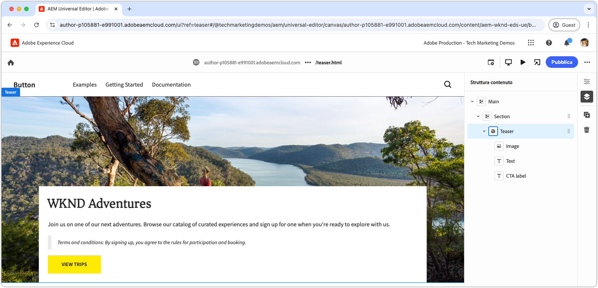

# Sviluppare un blocco con CSS e JavaScript

Il [capitolo precedente](./7b-block-js-css.md) era incentrato sullo stile di un blocco utilizzando solo CSS. Ora il focus si sposta sullo sviluppo di un blocco sia con JavaScript che con CSS.

Questo esempio mostra come migliorare un blocco in tre modi:

1. Aggiunta di classi CSS personalizzate.
1. Utilizzo dei listener di eventi per aggiungere movimento.
1. Gestione di termini e condizioni che possono essere inclusi facoltativamente nel testo del teaser.

## Casi d’uso comuni

Questo approccio è particolarmente utile nei seguenti scenari:

- **Gestione CSS esterna:** quando il CSS del blocco viene gestito all’esterno di Edge Delivery Services e non è allineato con la struttura HTML.
- **Attributi aggiuntivi:** quando sono necessari attributi aggiuntivi, ad esempio [ARIA](https://developer.mozilla.org/en-US/docs/Web/Accessibility/ARIA) per l’accessibilità o [microdati](https://developer.mozilla.org/en-US/docs/Web/HTML/Microdata).
- **Miglioramenti di JavaScript:** quando sono necessarie funzionalità interattive, come i listener di eventi.

Questo metodo si basa sulla manipolazione del DOM di JavaScript nativo del browser, ma richiede cautela nella modifica, in particolare se si spostano gli elementi. Tali modifiche possono interrompere l’esperienza di authoring dell’editor universale. Idealmente, il [modello di contenuto](./5-new-block.md#block-model) del blocco dovrebbe essere progettato in modo accurato per ridurre al minimo la necessità di modifiche al DOM estese.

## HTML del blocco

Per approcciarti allo sviluppo dei blocchi, inizia esaminando il DOM esposto da Edge Delivery Services. La struttura viene migliorata con JavaScript e lo stile aggiunto con CSS.

>[!BEGINTABS]

>[!TAB DOM da arricchire]

Di seguito è riportato il DOM del blocco teaser che è l’obiettivo da arricchire utilizzando JavaScript e CSS.

```html
...
<body>
    <header/>
    <main>
        <div>
            <!-- Start block HTML -->
            <div class="teaser block" data-block-name="teaser" data-block-status="loaded">
                <div>
                    <div>
                    <picture>
                        <source type="image/webp" srcset="./media_15ba2b455e29aca38c1ca653d24c40acaec8a008f.jpeg?width=2000&amp;format=webply&amp;optimize=medium" media="(min-width: 600px)">
                        <source type="image/webp" srcset="./media_15ba2b455e29aca38c1ca653d24c40acaec8a008f.jpeg?width=750&amp;format=webply&amp;optimize=medium">
                        <source type="image/jpeg" srcset="./media_15ba2b455e29aca38c1ca653d24c40acaec8a008f.jpeg?width=2000&amp;format=jpeg&amp;optimize=medium" media="(min-width: 600px)">
                        
                    </picture>
                    </div>
                </div>
                <div>
                    <div>
                    <h2 id="wknd-adventures">WKND Adventures</h2>
                    <p>Join us on one of our next adventures. Browse our list of curated experiences and sign up for one when you're ready to explore with us.</p>
                    <p class="button-container"><a href="/" title="View trips" class="button">View trips</a></p>
                    </div>
                </div>
            </div>     
            <!-- End block HTML -->
        </div>
    </main>
    <footer/>
</body>
...
```

>[!TAB Come trovare il DOM]

Per trovare il DOM da arricchire, apri la pagina con il blocco non arricchito nel tuo ambiente di sviluppo locale, seleziona il blocco e ispeziona il DOM.


>[!ENDTABS]


## JavaScript del blocco

Per aggiungere funzionalità JavaScript a un blocco, crea un file JavaScript nella stessa directory e con lo stesso nome del blocco, ad esempio `/blocks/teaser/teaser.js`.

Il file JavaScript deve esportare una funzione predefinita:

```javascript
export default function decorate(block) { ... }
```

La funzione predefinita porta l’elemento/albero DOM che rappresenta il blocco in HTML di Edge Delivery Services e contiene JavaScript personalizzato eseguito al momento del rendering del blocco.

In questo esempio JavaScript esegue tre azioni principali:

1. Aggiunge un listener di eventi al pulsante CTA, ingrandendo l’immagine al passaggio del mouse.
1. Aggiunge classi CSS semantiche agli elementi del blocco, utili per l’integrazione dei sistemi di progettazione CSS esistenti.
1. Aggiunge una classe CSS speciale ai paragrafi che iniziano con `Terms and conditions:`.

[!BADGE /blocks/teaser/teaser.js]{type=Neutral tooltip="Nome file dell’esempio di codice riportato di seguito."}

```javascript
/* /blocks/teaser/teaser.js */

/**
 * Adds a zoom effect to image using event listeners.
 *
 * When the CTA button is hovered over, the image zooms in.
 *
 * @param {HTMLElement} block represents the block's' DOM tree
 */
function addEventListeners(block) {
  block.querySelector('.button').addEventListener('mouseover', () => {
    block.querySelector('.image').classList.add('zoom');
  });

  block.querySelector('.button').addEventListener('mouseout', () => {
    block.querySelector('.image').classList.remove('zoom');
  });
}

/**
   * Entry point to block's JavaScript.
   * Must be exported as default and accept a block's DOM element.
   * This function is called by the project's style.js, and passed the block's element.
   *
   * @param {HTMLElement} block represents the block's' DOM element/tree
   */
export default function decorate(block) {
  /* This JavaScript makes minor adjustments to the block's DOM */

  // Dress the DOM elements with semantic CSS classes so it's obvious what they are.
  // If needed we could also add ARIA roles and attributes, or add/remove/move DOM elements.

  // Add a class to the first picture element to target it with CSS
  block.querySelector('picture').classList.add('image-wrapper');

  // Use previously applied classes to target new elements
  block.querySelector('.image-wrapper img').classList.add('image');

  // Mark the second/last div as the content area (white, bottom aligned box w/ text and cta)
  block.querySelector(':scope > div:last-child').classList.add('content');

  // Mark the first H1-H6 as a title
  block.querySelector('h1,h2,h3,h4,h5,h6').classList.add('title');

  // Process each paragraph and mark it as text or terms-and-conditions
  block.querySelectorAll('p').forEach((p) => {
    const innerHTML = p.innerHTML?.trim();

    // If the paragraph starts with Terms and conditions: then style it as such
    if (innerHTML?.startsWith("Terms and conditions:")) {
      /* If a paragraph starts with '*', add a special CSS class. */
      p.classList.add('terms-and-conditions');
    }
  });

  // Add event listeners to the block
  addEventListeners(block);
}
```

## CSS del blocco

Se hai creato un `teaser.css` nel [capitolo precedente](./7a-block-css.md) eliminalo o rinominalo `teaser.css.bak`, poiché questo capitolo implementa CSS diversi per il blocco teaser.

Crea un file `teaser.css` nella cartella del blocco. Questo file contiene il codice CSS che assegna lo stile al blocco. Questo codice CSS agisce sugli elementi del blocco e delle specifiche classi CSS semantiche aggiunte da JavaScript in `teaser.js`.

Agli elementi nudi lo stile può essere assegnato direttamente o con le classi CSS applicate personalizzate. Per blocchi più complessi, l’applicazione di classi CSS semantiche può contribuire a rendere il CSS più comprensibile e gestibile, soprattutto quando si lavora con team più grandi per periodi di tempo più lunghi.

[Come prima](./7a-block-css.md#develop-a-block-with-css), definisci l’ambito del CSS come `.block.teaser` utilizzando [la nidificazione CSS](https://developer.mozilla.org/en-US/docs/Web/CSS/CSS_nesting) per evitare conflitti con altri blocchi.

[!BADGE /blocks/teaser/teaser.css]{type=Neutral tooltip="Nome file dell’esempio di codice riportato di seguito."}

```css
/* /blocks/teaser/teaser.css */

/* Scope each selector in the block with `.block.teaser` to avoid accidental conflicts outside the block */
.block.teaser {
    animation: teaser-fade-in 1s;
    position: relative;
    width: 1600px;
    max-width: 100vw;
    left: 50%; 
    transform: translateX(-50%);
    height: 500px;
    overflow: hidden; 

    /* The teaser image */
    .image-wrapper {
        position: absolute;
        z-index: -1;
        inset: 0;
        box-sizing: border-box;
        overflow: hidden; 

        .image {
            object-fit: cover;
            object-position: center;
            width: 100%;
            height: 100%;
            transform: scale(1); 
            transition: transform 0.6s ease-in-out;

            .zoom {
                transform: scale(1.1);
            }            
        }
    }

    /* The teaser text content */
    .content {
        position: absolute;
        bottom: 0;
        left: 50%;
        transform: translateX(-50%);
        background: var(--background-color);
        padding: 1.5rem 1.5rem 1rem;
        width: 80vw;
        max-width: 1200px;
  
        .title {
            font-size: var(--heading-font-size-xl);
            margin: 0;
        }

        .title::after {
            border-bottom: 0;
        }

        p {
            font-size: var(--body-font-size-s);
            margin-bottom: 1rem;
            animation: teaser-fade-in .6s;
        
            &.terms-and-conditions {
                font-size: var(--body-font-size-xs);
                color: var(--secondary-color);
                padding: .5rem 1rem;
                font-style: italic;
                border: solid var(--light-color);
                border-width: 0 0 0 10px;
            }
        }

        /* Add underlines to links in the text */
        a:hover {
            text-decoration: underline;
        }

        /* Add specific spacing to buttons. These button CSS classes are automatically added by Edge Delivery Services. */
        .button-container {
            margin: 0;
            padding: 0;
        
            .button {   
                background-color: var(--primary-color);
                border-radius: 0;
                color: var(--dark-color);
                font-size: var(--body-font-size-xs);
                font-weight: bold;
                padding: 1em 2.5em;
                margin: 0;
                text-transform: uppercase;
            }
        }
    }
}

/** Animations 
    Scope the @keyframes to the block (teaser) to avoid accidental conflicts outside the block

    Global @keyframes can defines in styles/styles.css and used in this file.
**/
@keyframes teaser-fade-in {
    from {
        opacity: 0;
    }

    to {
        opacity: 1;
    }
}
```

## Aggiungere termini e condizioni

L’implementazione di cui sopra aggiunge il supporto per paragrafi con stili speciali che iniziano con il testo `Terms and conditions:`. Per convalidare questa funzionalità, aggiorna il contenuto di testo del blocco teaser nell’editor universale in modo da includere termini e condizioni.

Segui i passaggi descritti in [authoring di un blocco](./6-author-block.md) e modifica il testo in modo da includere un paragrafo **termini e condizioni** alla fine:

```
WKND Adventures

Join us on one of our next adventures. Browse our list of curated experiences and sign up for one when you're ready to explore with us.

Terms and conditions: By signing up, you agree to the rules for participation and booking.
```

Verifica che nell’ambiente di sviluppo locale venga eseguito il rendering del paragrafo con lo stile termini e condizioni. Ricorda che queste modifiche al codice non vengono applicate nell’editor universale finché non vengono [inviate a un ramo su GitHub](#preview-in-universal-editor) per il quale è stato configurato l’utilizzo.

## Anteprima di sviluppo

Con l’aggiunta di CSS e JavaScript, l’ambiente di sviluppo locale di AEM CLI ricarica le modifiche, consentendo una visualizzazione rapida e semplice dell’impatto del codice sul blocco. Passa il puntatore sul CTA e verifica che l’immagine del teaser esegua lo zoom in e lo zoom out.


## Eseguire il linting del codice

Assicurati di [eseguire frequentemente il linting](./3-local-development-environment.md#linting) del codice per mantenerlo pulito e coerente. L’esecuzione del linting regolare consente di individuare i problemi in anticipo, riducendo il tempo di sviluppo complessivo. Ricorda che non puoi unire il tuo lavoro di sviluppo nel ramo `main` finché non saranno stati risolti tutti i problemi di linting.

```bash
# ~/Code/aem-wknd-eds-ue

$ npm run lint
```

## Anteprima nell’editor universale

Per visualizzare le modifiche nell’editor universale di AEM, aggiungile, confermale e inviale al ramo dell’archivio Git utilizzato dall’editor universale. In questo modo, l’implementazione del blocco non interferirà con l’esperienza di authoring.

```bash
# ~/Code/aem-wknd-eds-ue

$ git add .
$ git commit -m "CSS and JavaScript implementation for teaser block"
$ git push origin teaser
```

Ora puoi visualizzare in anteprima le modifiche nell’editor universale quando aggiungi il parametro di query `?ref=teaser`.


