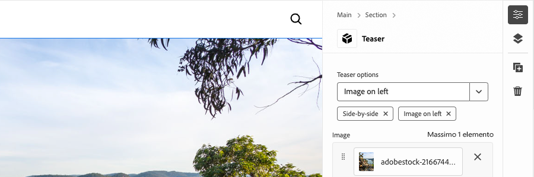

# Sviluppare un blocco con opzioni

Questo tutorial si basa su quello di Edge Delivery Services e Universal Editor e spiega come aggiungere opzioni di blocco a un blocco. Definendo le opzioni di blocco, puoi personalizzare l’aspetto e la funzionalità di un blocco, abilitando diverse varianti in base alle varie esigenze di contenuto. Ciò consente una maggiore flessibilità e riutilizzabilità all’interno del sistema di progettazione del sito.

{align="center"}

In questa esercitazione verranno aggiunte opzioni di blocco al blocco Teaser, consentendo agli autori di scegliere tra due opzioni di visualizzazione: **Predefinita** e **Affiancata**. L&#39;opzione **Default** visualizza l&#39;immagine sopra e dietro il testo, mentre l&#39;opzione **Side-by-side** visualizza l&#39;immagine e il testo affiancati.

## Casi d’uso comuni

I casi d&#39;uso comuni per l&#39;utilizzo di **Opzioni di blocco** in **Edge Delivery Services** e **Universal Editor** includono, ma non sono limitati a:

1. **Varianti di layout:** Passaggio semplice tra i layout. Ad esempio, orizzontale e verticale o griglia ed elenco.
2. **Varianti di stile:** Passa facilmente da un tema all&#39;altro o da un trattamento visivo all&#39;altro. Ad esempio, modalità chiara e scura o testo grande e testo piccolo.
3. **Controllo visualizzazione contenuto:** Attiva/disattiva la visibilità degli elementi o passa da uno stile di contenuto all&#39;altro (compatto e dettagliato).

Queste opzioni offrono flessibilità ed efficienza nella creazione di blocchi dinamici e adattabili.

Questa esercitazione illustra il caso di utilizzo delle varianti di layout, in cui il blocco Teaser può essere visualizzato in due layout diversi: **Predefinito** e **Affiancato**.

## Modello a blocchi

Per aggiungere opzioni di blocco al blocco Teaser, apri il relativo frammento JSON in `/block/teaser/_teaser.json` e aggiungi un nuovo campo alla definizione del modello. Questo campo imposta la proprietà `name` su `classes`, che è un campo protetto utilizzato da AEM per archiviare le opzioni di blocco, che vengono applicate al Edge Delivery Services HTML del blocco.

### Configurazioni dei campi

Le schede seguenti illustrano vari modi per configurare le opzioni di blocco nel modello di blocco, tra cui selezione singola con singola classe CSS, selezione singola con più classi CSS e selezione multipla con più classi CSS. Questa esercitazione [implementa l&#39;approccio più semplice](#field-configuration-for-this-tutorial) utilizzato in **select con singola classe CSS**.

>[!BEGINTABS]

>[!TAB Seleziona con classe CSS singola]

Questo tutorial illustra come utilizzare un tipo di input `select` (a discesa) per consentire agli autori di scegliere un&#39;opzione a blocco singolo, che viene quindi applicata come una singola classe CSS corrispondente.

{align="center"}

#### Modello a blocchi

L&#39;opzione **Default** è rappresentata da una stringa vuota (`""`), mentre l&#39;opzione **Side-by-Side** utilizza `"side-by-side"`. I valori **name** e **value** dell&#39;opzione non devono essere uguali, ma il valore **value** determina le classi CSS applicate al HTML del blocco. Ad esempio, il valore dell&#39;opzione **Side-by-Side** potrebbe essere `layout-10` invece di `side-by-side`. Tuttavia, è meglio utilizzare nomi significativi dal punto di vista semantico per le classi CSS, garantendo chiarezza e coerenza nei valori delle opzioni.

[!BADGE /blocks/teaser/_teaser.json]{type=Neutral tooltip="Nome del file dell’esempio di codice riportato di seguito."}

```json{highlight="4,8,9-18"}
...
"fields": [
    {
        "component": "select",
        "name": "classes",
        "value": "",
        "label": "Teaser options",
        "valueType": "string",
        "options": [
            {
                "name": "Default",
                "value": ""
            },
            {
                "name": "Side-by-side",
                "value": "side-by-side"
            }
        ]
    }
]
...
```

#### Blocca HTML

Quando l’autore seleziona un’opzione, il valore corrispondente viene aggiunto come classe CSS al HTML del blocco:

- Se è selezionato **Default**:

  ```html
  <div class="block teaser">
      <!-- Block content here -->
  </div>
  ```

- Se è selezionato **Affiancato**:

  ```html
  <div class="block teaser side-by-side">
      <!-- Block content here -->
  </div>
  ```

Questo consente di applicare stili e JavaScript condizionali diversi a seconda dell’apertura selezionata.


>[!TAB Seleziona con più classi CSS]

**Questo approccio non viene utilizzato in questa esercitazione, ma illustra un metodo alternativo e opzioni di blocco avanzate.**

Il tipo di input `select` consente agli autori di scegliere un&#39;opzione a blocco singolo, che può essere mappata facoltativamente a più classi CSS. Per ottenere questo risultato, elenca le classi CSS come valori delimitati da spazi.

{align="center"}

#### Modello a blocchi

Ad esempio, l&#39;opzione **Side-by-Side** può supportare varianti in cui l&#39;immagine viene visualizzata a sinistra (`side-by-side left`) o a destra (`side-by-side right`).

[!BADGE /blocks/teaser/_teaser.json]{type=Neutral tooltip="Nome del file dell’esempio di codice riportato di seguito."}

```json{highlight="4,8,9-21"}
...
"fields": [
    {
        "component": "select",
        "name": "classes",
        "value": "",
        "label": "Teaser options",
        "valueType": "string",
        "options": [
            {
                "name": "Default",
                "value": ""
            },
            {
                "name": "Side-by-side with Image on left",
                "value": "side-by-side left"
            },
            {
                "name": "Side-by-side with Image on right",
                "value": "side-by-side right"
            }
        ]
    }
]
...
```

#### Blocca HTML

Quando l’autore seleziona un’opzione, il valore corrispondente viene applicato come set separato da spazi di classi CSS nel HTML del blocco:

- Se è selezionato **Default**:

  ```html
  <div class="block teaser">
      <!-- Block content here -->
  </div>
  ```

- Se è selezionato **Affiancato a immagine a sinistra**:

  ```html
  <div class="block teaser side-by-side left">
      <!-- Block content here -->
  </div>
  ```

- Se è selezionato **Affiancato a immagine a destra**:

  ```html
  <div class="block teaser side-by-side right">
      <!-- Block content here -->
  </div>
  ```

Questo consente di applicare stili e JavaScript condizionali diversi a seconda dell’opzione scelta.


>[!TAB Selezione multipla con più classi CSS]

**Questo approccio non viene utilizzato in questa esercitazione, ma illustra un metodo alternativo e opzioni di blocco avanzate.**

Il tipo di input `"component": "multiselect"` consente all&#39;autore di selezionare più opzioni contemporaneamente. Ciò consente permutazioni complesse dell&#39;aspetto del blocco combinando più scelte di progettazione.

{align="center"}

### Modello a blocchi

Ad esempio, **Affiancato**, **Immagine a sinistra** e **Immagine a destra** possono supportare varianti in cui l&#39;immagine è posizionata a sinistra (`side-by-side left`) o a destra (`side-by-side right`).

[!BADGE /blocks/teaser/_teaser.json]{type=Neutral tooltip="Nome del file dell’esempio di codice riportato di seguito."}

```json{highlight="4,6,8,10-21"}
...
"fields": [
    {
        "component": "multiselect",
        "name": "classes",
        "value": [],
        "label": "Teaser options",
        "valueType": "array",
        "options": [
            {
                "name": "Side-by-side",
                "value": "side-by-side"
            },
            {
                "name": "Image on left",
                "value": "left"
            },
            {
                "name": "Image on right",
                "value": "right"
            }
        ]
    }
]
...
```

#### Blocca HTML

Quando l’autore seleziona più opzioni, i valori corrispondenti vengono applicati come classi CSS separate da spazi nel HTML del blocco:

- Se sono selezionati **affiancati** e **immagine a sinistra**:

  ```html{highlight="1"}
  <div class="block teaser side-by-side left">
      <!-- Block content here -->
  </div>
  ```

- Se sono selezionati **Affiancati** e **Immagine a destra**:

  ```html{highlight="1"}
  <div class="block teaser side-by-side right">
      <!-- Block content here -->
  </div>
  ```

La selezione multipla offre flessibilità, ma presenta complessità nella gestione delle permutazioni di progettazione. Senza restrizioni, le selezioni in conflitto possono causare esperienze interrotte o off-brand.

Ad esempio:

- **Immagine a sinistra** o **Immagine a destra** senza selezionare **Affiancato** le applica implicitamente a **Predefinito**, impostando sempre l&#39;immagine come sfondo, pertanto l&#39;allineamento a sinistra e a destra non è rilevante.
- La selezione di **Immagine a sinistra** e **Immagine a destra è** contraddittoria.
- Se si seleziona **Affiancato** senza **Immagine a sinistra** o **Immagine a destra**, la posizione dell&#39;immagine non è specificata.

Per evitare problemi e confusione nell’authoring quando si utilizza la selezione multipla, assicurati che le opzioni siano ben pianificate e che tutte le permutazioni siano testate. La selezione multipla è ideale per miglioramenti semplici e non in conflitto, come &quot;large&quot; (grande) o &quot;highlight&quot; (evidenziazione), anziché per scelte che modificano il layout.


>[!TAB Opzione predefinita]

**Questo approccio non viene utilizzato in questa esercitazione, ma illustra un metodo alternativo e opzioni di blocco avanzate.**

Le opzioni di blocco possono essere impostate come predefinite quando si aggiunge una nuova istanza di blocco a una pagina in Universal Editor. Questa operazione viene eseguita impostando il valore predefinito della proprietà `classes` nella definizione del blocco [](../5-new-block.md#block-definition).

#### Definizione blocco

Nell&#39;esempio seguente, l&#39;opzione predefinita è impostata su **Side-by-Side** assegnando la proprietà `value` del campo `classes` a `side-by-side`. L’input dell’opzione di blocco corrispondente nel modello di blocco è facoltativo.

Puoi anche definire più voci per lo stesso blocco, ciascuna con un nome e una classe diversi. Questo consente all’editor universale di visualizzare voci di blocco distinte, ciascuna preconfigurata con un’opzione di blocco specifica. Anche se questi vengono visualizzati come blocchi separati nell’editor, la base di codice contiene un singolo blocco che esegue il rendering dinamico in base all’opzione selezionata.

[!BADGE /blocks/teaser/_teaser.json]{type=Neutral tooltip="Nome del file dell’esempio di codice riportato di seguito."}

```json{highlight="12"}
{
    "definitions": [{
      "title": "Teaser",
      "id": "teaser",
      "plugins": {
        "xwalk": {
          "page": {
            "resourceType": "core/franklin/components/block/v1/block",
            "template": {
              "name": "Teaser",
              "model": "teaser",
              "classes": "side-by-side",
              "textContent_text": "<h2>Enter a title</h2><p>...and body text here!</p>",
              "textContent_cta": "/",
              "textContent_ctaText": "Click me!"
            }
          }
        }
      }
    }],
    "models": [... from previous section ...],
    "filters": []
}
```

>[!ENDTABS]


### Configurazione del campo per questa esercitazione


In questa esercitazione verrà utilizzato l&#39;approccio select with single CSS class descritto in precedenza nella prima scheda, che consente due opzioni di blocco discrete: **Default** e **Side-by-side**.

Nella definizione del modello all’interno del frammento JSON del blocco, aggiungi un singolo campo di selezione per le opzioni di blocco. Questo campo consente agli autori di scegliere tra il layout predefinito e un layout affiancato.

[!BADGE /blocks/teaser/_teaser.json]{type=Neutral tooltip="Nome del file dell’esempio di codice riportato di seguito."}

```json{highlight="7-24"}
{
    "definitions": [...],
    "models": [
        {
            "id": "teaser", 
            "fields": [
                {
                    "component": "select",
                    "name": "classes",
                    "value": "",
                    "label": "Teaser options",
                    "description": "",
                    "valueType": "string",
                    "options": [
                        {
                            "name": "Default",
                            "value": ""
                        },
                        {
                            "name": "Side-by-side",
                            "value": "side-by-side"
                        }
                    ]
                },
                {
                    "component": "reference",
                    "valueType": "string",
                    "name": "image",
                    "label": "Image",
                    "multi": false
                },
                {
                    "component": "text",
                    "valueType": "string",
                    "name": "imageAlt",
                    "label": "Image alt text",
                    "required": true
                },
                {
                    "component": "richtext",
                    "name": "textContent_text",
                    "label": "Text",
                    "valueType": "string",
                    "required": true
                },
                {
                    "component": "aem-content",
                    "name": "textContent_cta",
                    "label": "CTA",
                    "valueType": "string"
                },
                {
                    "component": "text",
                    "name": "textContent_ctaText",
                    "label": "CTA label",
                    "valueType": "string"
                }
            ]
        }
    ],
    "filters": []
}
```

## Blocco di aggiornamento nell’editor universale

Per rendere disponibile l&#39;input delle opzioni di blocco aggiornate in Universal Editor, distribuisci le modifiche al codice JSON in GitHub, crea una nuova pagina, aggiungi e crea il blocco Teaser con l&#39;opzione **Side-by-Side**, quindi pubblica la pagina in anteprima. Una volta pubblicata, carica la pagina nell’ambiente di sviluppo locale per la codifica.

### Invia modifiche a GitHub

Per rendere disponibile l&#39;input delle opzioni di blocco aggiornate in Universal Editor per l&#39;impostazione delle opzioni di blocco e lo sviluppo sul HTML risultante, è necessario che il progetto venga contrassegnato e che le modifiche vengano inviate a un ramo GitHub, in questo caso il ramo `block-options`.

```bash
# ~/Code/aem-wknd-eds-ue

# Lint the changes to catch any syntax errors
$ npm run lint 

$ git add .
$ git commit -m "Add Teaser block option to JSON file so it is available in Universal Editor"
$ git push origin teaser
```

### Creare una pagina di test

Nel servizio Author di AEM, crea una nuova pagina per aggiungere il blocco Teaser da sviluppare. Seguendo la convenzione del capitolo [Creazione di un blocco](../6-author-block.md) dell&#39;esercitazione per sviluppatori [Edge Delivery Services e Universal Editor](../0-overview.md), creare una pagina di test in una pagina `branches`, denominandola dopo il ramo Git su cui si sta lavorando, in questo caso `block-options`.

### Creare il blocco

Modificare la nuova pagina **Opzioni blocco** in Universal Editor e aggiungere il blocco **Teaser**. Assicurarsi di aggiungere il parametro di query `?ref=block-options` all&#39;URL per caricare la pagina utilizzando il codice del ramo GitHub `block-options`,

La finestra di dialogo di blocco ora include un elenco a discesa **Opzioni teaser** con **Impostazioni predefinite** e **Affiancate** selezioni. Scegliere **Affiancato** e completare la creazione dei contenuti rimanenti.

{align="center"}

È possibile aggiungere due blocchi **Teaser**, uno impostato su **Default** e l&#39;altro su **Side-by-Side**. Ciò ti consente di visualizzare in anteprima entrambe le opzioni affiancate durante lo sviluppo e assicura che l&#39;implementazione di **Side-by-Side** non influisca sull&#39;opzione **Default**.

### Pubblica in anteprima

Una volta aggiunto il blocco Teaser alla pagina, [pubblica la pagina in anteprima](../6-author-block.md) utilizzando **Gestisci pubblicazioni** e Amministratore sito di AEM Author.

## Blocca HTML

Per iniziare lo sviluppo del blocco, inizia esaminando la struttura DOM esposta dall’anteprima di Edge Delivery Services. Il DOM viene migliorato con JavaScript e formattato con CSS, fornendo le basi per la creazione e la personalizzazione del blocco.

>[!BEGINTABS]

>[!TAB DOM da decorare]

Di seguito è riportato il DOM del blocco Teaser, con l&#39;opzione di blocco **Side-by-side** selezionata, che è la destinazione da decorare utilizzando JavaScript e CSS.

```html{highlight="7"}
...
<body>
    <header/>
    <main>
        <div>
            <!-- Start block HTML -->
            <div class="teaser block side-by-side" data-block-name="teaser" data-block-status="loaded">
                <div>
                    <div>
                    <picture>
                        <source type="image/webp" srcset="./media_15ba2b455e29aca38c1ca653d24c40acaec8a008f.jpeg?width=2000&amp;format=webply&amp;optimize=medium" media="(min-width: 600px)">
                        <source type="image/webp" srcset="./media_15ba2b455e29aca38c1ca653d24c40acaec8a008f.jpeg?width=750&amp;format=webply&amp;optimize=medium">
                        <source type="image/jpeg" srcset="./media_15ba2b455e29aca38c1ca653d24c40acaec8a008f.jpeg?width=2000&amp;format=jpeg&amp;optimize=medium" media="(min-width: 600px)">
                        
                    </picture>
                    </div>
                </div>
                <div>
                    <div>
                    <h2 id="wknd-adventures">WKND Adventures</h2>
                    <p>Join us on one of our next adventures. Browse our list of curated experiences and sign up for one when you're ready to explore with us.</p>
                    <p>Terms and conditions: By signing up, you agree to the rules for participation and booking.</p>
                    <p class="button-container"><a href="/" title="View trips" class="button">View trips</a></p>
                    </div>
                </div>
            </div>     
            <!-- End block HTML -->
        </div>
    </main>
    <footer/>
</body>
...
```

>[!TAB Come trovare il DOM]

Per trovare il DOM da decorare, apri la pagina con il blocco nell’ambiente di sviluppo locale, seleziona il blocco utilizzando gli strumenti di sviluppo del browser web e ispeziona il DOM. Questo ti consentirà di identificare gli elementi rilevanti da decorare.

{align="center"} del blocco

>[!ENDTABS]

## Blocca CSS

Modificare `blocks/teaser/teaser.css` per aggiungere stili CSS specifici per l&#39;opzione **Affiancato**. Questo file contiene il CSS predefinito per il blocco.

Per modificare gli stili per l&#39;opzione **Side-by-Side**, aggiungere una nuova regola CSS con ambito nel file `teaser.css` che esegue il targeting dei blocchi teaser configurati con la classe `side-by-side`.

```css
.block.teaser.side-by-side { ... }
```

In alternativa, puoi utilizzare la nidificazione CSS per una versione più concisa:

```css
.block.teaser {
    ... Default teaser block styles ...

    &.side-by-side {
        ... Side-by-side teaser block styles ...
    }
}
```

All&#39;interno della regola `&.side-by-side`, aggiungi le proprietà CSS necessarie per assegnare uno stile al blocco quando viene applicata la classe `side-by-side`.

Un approccio comune consiste nel ripristinare gli stili predefiniti applicando `all: initial` ai selettori condivisi, quindi aggiungendo gli stili richiesti per la variante `side-by-side`. Se la maggior parte degli stili è condivisa tra le opzioni, l’override di proprietà specifiche potrebbe essere più semplice. Tuttavia, se più selettori necessitano di modifiche, la reimpostazione di tutti gli stili e la riapplicazione solo di quelli necessari possono rendere il codice più chiaro e manutenibile.
[!BADGE /blocks/teaser/teaser.css]{type=Neutral tooltip="Nome del file dell’esempio di codice riportato di seguito."}

```css
/* /blocks/teaser/teaser.css */

/* Scope each selector in the block with `.block.teaser` to avoid accidental conflicts outside the block */
.block.teaser {
    animation: teaser-fade-in 1s;
    position: relative;
    width: 1600px;
    max-width: 100vw;
    left: 50%; 
    transform: translateX(-50%);
    height: 500px;
    overflow: hidden; 


    /* The teaser image */
    .image-wrapper {
        position: absolute;
        z-index: -1;
        inset: 0;
        box-sizing: border-box;
        overflow: hidden; 

        .image {
            object-fit: cover;
            object-position: center;
            width: 100%;
            height: 100%;
            transform: scale(1); 
            transition: transform 0.6s ease-in-out;

            .zoom {
                transform: scale(1.1);
            }            
        }
    }

    /* The teaser text content */
    .content {
        position: absolute;
        bottom: 0;
        left: 50%;
        transform: translateX(-50%);
        background: var(--background-color);
        padding: 1.5rem 1.5rem 1rem;
        width: 80vw;
        max-width: 1200px;
  
        .title {
            font-size: var(--heading-font-size-xl);
            margin: 0;
        }

        .title::after {
            border-bottom: 0;
        }

        p {
            font-size: var(--body-font-size-s);
            margin-bottom: 1rem;
            animation: teaser-fade-in .6s;
        }

        p.terms-and-conditions {
            font-size: var(--body-font-size-xs);
            color: var(--secondary-color);
            padding: .5rem 1rem;
            font-style: italic;
            border: solid var(--light-color);
            border-width: 0 0 0 10px;
        }

        /* Add underlines to links in the text */
        a:hover {
            text-decoration: underline;
        }

        /* Add specific spacing to buttons. These button CSS classes are automatically added by Edge Delivery Services. */
        .button-container {
            margin: 0;
            padding: 0;        

            .button {   
                background-color: var(--primary-color);
                border-radius: 0;
                color: var(--dark-color);
                font-size: var(--body-font-size-xs);
                font-weight: bold;
                padding: 1em 2.5em;
                margin: 0;
                text-transform: uppercase;
            }
        }
    }

    /**
    *  Add styling for the side-by-side variant 
    **/

    /* This evaluates to .block.teaser.side-by-side */
    &.side-by-side {    
        /* Since this default teaser option doesn't have a style (such as `.default`), we use `all: initial` to reset styles rather than overriding individual styles. */
        all: initial;
        display: flex;
        margin: auto;
        max-width: 900px;

        .image-wrapper {
            all: initial;
            flex: 2;
            overflow: hidden;                 
            
            * {
                height: 100%;
            }        

            .image {
                object-fit: cover;
                object-position: center;
                width: 100%;
                height: 100%;
                transform: scale(1); 
                transition: transform 0.6s ease-in-out;                

                &.zoom {
                    /* This option has a different zoom level than the default */
                    transform: scale(1.5);
                }
            }
        }

        .content {
            all: initial;
            flex: 1;
            background-color: var(--light-color);
            padding: 3.5em 2em 2em;
            font-size: var(--body-font-size-s);
            font-family: var(--body-font-family);
            text-align: justify;
            text-justify: newspaper;
            hyphens: auto;

            p.terms-and-conditions {
                border: solid var(--text-color);
                border-width: 0;
                padding-left: 0;
                text-align: left;
            }
        }

        /* Media query for mobile devices */
        @media (width <= 900px) {
            flex-direction: column; /* Stack elements vertically on mobile */
        }
    }
}

/** Animations 
    Scope the @keyframes to the block (teaser) to avoid accidental conflicts outside the block

    Global @keyframes can defines in styles/styles.css and used in this file.
**/
@keyframes teaser-fade-in {
    from {
        opacity: 0;
    }

    to {
        opacity: 1;
    }
}
```


## Blocca JavaScript

L’identificazione delle opzioni attive per il blocco è semplice, in quanto consente di controllare le classi applicate all’elemento del blocco. In questo esempio, è necessario regolare la posizione in cui vengono applicati gli stili `.image-wrapper` a seconda dell&#39;opzione attiva.

La funzione `getOptions` restituisce un array di classi applicate al blocco, esclusi `block` e `teaser` (poiché tutti i blocchi hanno la classe `block` e tutti i blocchi Teaser hanno la classe `teaser`). Tutte le classi rimanenti nell&#39;array indicano le opzioni attive. Se l’array è vuoto, viene applicata l’opzione predefinita.

```javascript
function getOptions(block) {
  // Get the block's classes, excluding 'block' and 'teaser'; anything remaining is a block option.
  return [...block.classList].filter((c) => !['block', 'teaser'].includes(c));
}
```

Questo elenco di opzioni può essere utilizzato per eseguire in modo condizionale la logica personalizzata nel JavaScript del blocco:

```javascript
if (getOptions(block).includes('side-by-side')) {
  /* For side-by-side teaser, add the image-wrapper to a higher-level div to support CSS */
  block.querySelector(':scope > div:first-child').classList.add('image-wrapper');
} else if (!getOptions(block)) {
  /* For the default option, add the image-wrapper to the picture element to support CSS */
  block.querySelector('picture').classList.add('image-wrapper');
}
```

Di seguito è riportato il file JavaScript completo aggiornato per il blocco teaser con entrambe le opzioni Default e Side-by-Side:

[!BADGE /blocks/teaser/teaser.js]{type=Neutral tooltip="Nome del file dell’esempio di codice riportato di seguito."}

```javascript
/* /blocks/teaser/teaser.js */

/**
 * Block options are applied as classes to the block's DOM element
 * alongside the `block` and `<block-name>` classes.
 *
 * @param {HTMLElement} block represents the block's DOM element/tree
 */
function getOptions(block) {
  // Get the block's classes, excluding 'block' and 'teaser'.
  return [...block.classList].filter((c) => !['block', 'teaser'].includes(c));
}

/**
 * Adds a zoom effect to the image using event listeners.
 *
 * When the CTA button is hovered over, the image zooms in.
 *
 * @param {HTMLElement} block represents the block's DOM tree
 */
function addEventListeners(block) {
  block.querySelector('.button').addEventListener('mouseover', () => {
    block.querySelector('.image').classList.add('zoom');
  });

  block.querySelector('.button').addEventListener('mouseout', () => {
    block.querySelector('.image').classList.remove('zoom');
  });
}

/**
 * Entry point to the block's JavaScript.
 * Must be exported as default and accept a block's DOM element.
 * This function is called by the project's style.js, passing the block's element.
 *
 * @param {HTMLElement} block represents the block's DOM element/tree
 */
export default function decorate(block) {
  /* Common treatments for all options */
  block.querySelector(':scope > div:last-child').classList.add('content');
  block.querySelector('h1,h2,h3,h4,h5,h6').classList.add('title');
  block.querySelector('img').classList.add('image');

  // Process each paragraph and mark it as text or terms-and-conditions
  block.querySelectorAll('p').forEach((p) => {
    const innerHTML = p.innerHTML?.trim();
    if (innerHTML?.startsWith('Terms and conditions:')) {
      p.classList.add('terms-and-conditions');
    }
  });

  /* Conditional treatments for specific options */
  if (getOptions(block).includes('side-by-side')) {
    /* For side-by-side teaser, add the image-wrapper to a higher-level div to support CSS */
    block.querySelector(':scope > div:first-child').classList.add('image-wrapper');
  } else if (!getOptions(block)) {
    /* For the default option, add the image-wrapper to the picture element to support CSS */
    block.querySelector('picture').classList.add('image-wrapper');
  }

  addEventListeners(block);
}
```

## Anteprima di sviluppo

Con l’aggiunta di CSS e JavaScript, l’ambiente di sviluppo locale della CLI di AEM ricarica a caldo le modifiche, consentendo una visualizzazione rapida e semplice dell’impatto del codice sul blocco. Passa il puntatore del mouse sul CTA e verifica che l’immagine del teaser si ingrandisca e si ingrandisca.


## Illustra il codice

Assicurati di [collegare frequentemente](../3-local-development-environment.md#linting) le modifiche al codice per mantenerlo pulito e coerente. L&#39;linting regolare consente di risolvere i problemi in anticipo, riducendo il tempo di sviluppo complessivo. Ricorda che non puoi unire il tuo lavoro di sviluppo nel ramo `main` finché non saranno stati risolti tutti i problemi di linting.

```bash
# ~/Code/aem-wknd-eds-ue

$ npm run lint
```

## Anteprima nell’editor universale

Per visualizzare le modifiche nell’Editor universale di AEM, aggiungili, esegui il commit e inviali al ramo dell’archivio Git utilizzato dall’Editor universale. In questo modo l’implementazione del blocco non interrompe l’esperienza di authoring.

```bash
# ~/Code/aem-wknd-eds-ue

$ git add .
$ git commit -m "CSS and JavaScript implementation for Teaser block option Side-by-side"
# JSON files are compiled automatically and added to the commit via a Husky pre-commit hook
$ git push origin block-options
```

Le modifiche sono ora visibili nell&#39;editor universale quando si utilizza il parametro di query `?ref=block-options`.

{align="center"}


## Congratulazioni.

Ora hai esplorato le opzioni per blocchi in Edge Delivery Services e Universal Editor, offrendoti gli strumenti per personalizzare e semplificare l’editing dei contenuti con una maggiore flessibilità. Inizia ad applicare queste opzioni ai tuoi progetti per migliorarne l’efficienza e mantenerne la coerenza.

Per ulteriori best practice e tecniche avanzate, consulta la [documentazione di Universal Editor](https://experienceleague.adobe.com/en/docs/experience-manager-cloud-service/content/edge-delivery/wysiwyg-authoring/create-block#block-options).
