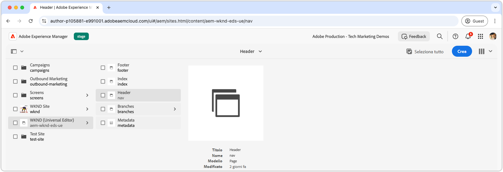
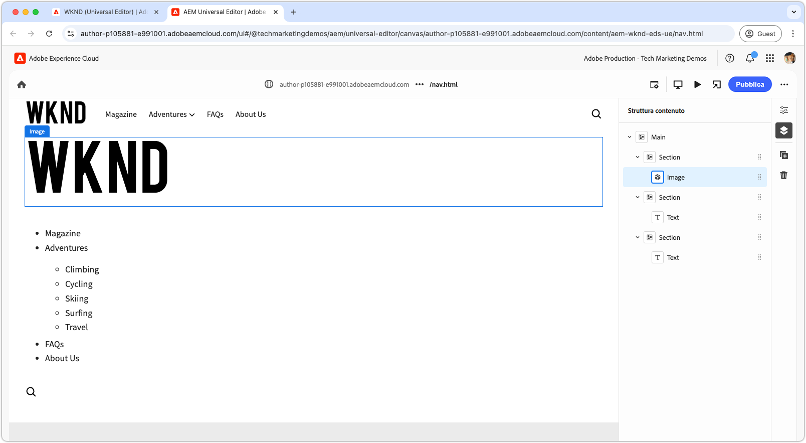
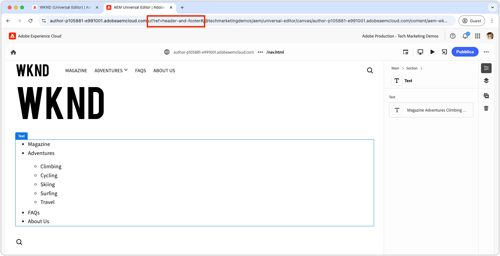
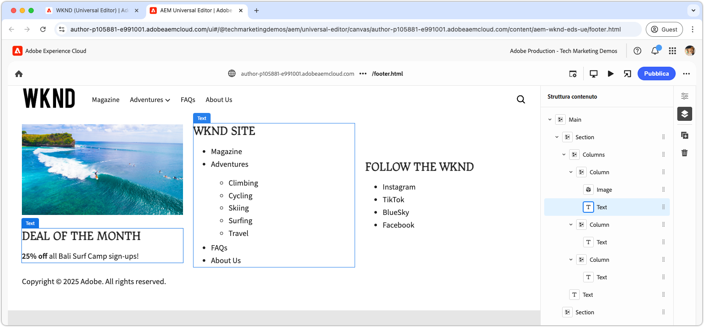

# Sviluppare intestazione e piè di pagina

{align="center"}

Le intestazioni e i piè di pagina svolgono un ruolo specifico in Edge Delivery Services (EDS) in quanto sono associati direttamente agli elementi HTML `<header>` e `<footer>`. A differenza del normale contenuto delle pagine, sono gestiti separatamente e possono essere aggiornati in modo indipendente, senza dover eliminare l’intera cache della pagina. Anche se la relativa implementazione si trova nel progetto di codice come blocchi in `blocks/header` e `blocks/footer`, gli autori possono modificarne il contenuto tramite pagine AEM dedicate che possono contenere qualsiasi combinazione di blocchi.

## Blocco intestazione

{align="center"}

L’intestazione è un blocco speciale associato all’elemento HTM di Edge Delivery Services`<header>`.
L’elemento `<header>` viene recapitato vuoto e popolato tramite XHR (AJAX) in una pagina AEM separata.
Questo consente di gestire l’intestazione in modo indipendente dal contenuto della pagina e di aggiornarla senza richiedere la rimozione completa della cache di tutte le pagine.

Il blocco di intestazione è responsabile della richiesta del frammento di pagina AEM che contiene il contenuto dell’intestazione e del relativo rendering nell’elemento `<header>`.

[!BADGE /blocks/header/header.js]{type=Neutral tooltip="Nome file dell’esempio di codice riportato di seguito."}

```javascript
import { getMetadata } from '../../scripts/aem.js';
import { loadFragment } from '../fragment/fragment.js';

...

export default async function decorate(block) {
  // load nav as fragment

  // Get the path to the AEM page fragment that defines the header content from the <meta name="nav"> tag. This is set via the site's Metadata file.
  const navMeta = getMetadata('nav');

  // If the navMeta is not defined, use the default path `/nav`.
  const navPath = navMeta ? new URL(navMeta, window.location).pathname : '/nav';

  // Make an XHR (AJAX) call to request the AEM page fragment and serialize it to a HTML DOM tree.
  const fragment = await loadFragment(navPath);
  
  // Add the content from the fragment HTML to the block and decorate it as needed
  ...
}
```

La funzione `loadFragment()` effettua una richiesta XHR (AJAX) a `${navPath}.plain.html` che restituisce una rappresentazione HTML EDS dell’HTML della pagina AEM esistente nel tag `<main>` della pagina, elabora il contenuto con eventuali blocchi in essa contenuti e restituisce la struttura DOM aggiornata.

## Authoring della pagina di intestazione

Prima di sviluppare il blocco di intestazione, crea innanzitutto il relativo contenuto nell’editor universale per disporre di qualcosa su cui sviluppare.

Il contenuto dell’intestazione si trova in una pagina AEM dedicata denominata `nav`.

{align="center"}

Per l’authoring dell’intestazione:

1. Apri la pagina `nav` nell’editor universale
1. Sostituisci il pulsante predefinito con un **blocco immagine** contenente il logo WKND
1. Aggiorna il menu di navigazione nel **blocco di testo**:
   - Aggiungendo i collegamenti di navigazione desiderati
   - Creando elementi di navigazione secondaria dove necessario
   - Impostando tutti i collegamenti alla pagina Home (`/`) per il momento

{align="center"}

### Pubblicare in anteprima

Con la pagina Intestazione aggiornata, [pubblica la pagina in anteprima](../6-author-block.md).

Poiché il contenuto dell’intestazione si trova sulla propria pagina (la pagina `nav`), devi pubblicare specificamente tale pagina per rendere effettive le modifiche all’intestazione. La pubblicazione di altre pagine che utilizzano l’intestazione non aggiorna il contenuto dell’intestazione in Edge Delivery Services.

## HTML del blocco

Per iniziare lo sviluppo del blocco, inizia esaminando la struttura DOM esposta dall’anteprima di Edge Delivery Services. Il DOM viene migliorato con JavaScript e formattato con CSS, fornendo le basi per la creazione e la personalizzazione del blocco.

Poiché l’intestazione viene caricata come frammento, è necessario esaminare l’HTML restituito dalla richiesta XHR dopo che è stato inserito nel DOM e arricchito tramite `loadFragment()`. Questo può essere fatto esaminando il DOM negli strumenti di sviluppo del browser.


>[!BEGINTABS]

>[!TAB DOM da arricchire]

Di seguito è riportato l’HTML della pagina di intestazione dopo che è stato caricato tramite `header.js` fornito e inserito nel DOM:

```html
<header class="header-wrapper">
  <div class="header block" data-block-name="header" data-block-status="loaded">
    <div class="nav-wrapper">
      <nav id="nav" aria-expanded="true">
        <div class="nav-hamburger">
          <button type="button" aria-controls="nav" aria-label="Close navigation">
            <span class="nav-hamburger-icon"></span>
          </button>
        </div>
        <div class="section nav-brand" data-section-status="loaded" style="">
          <div class="default-content-wrapper">
            <p class="">
              <a href="#" title="Button" class="">Button</a>
            </p>
          </div>
        </div>
        <div class="section nav-sections" data-section-status="loaded" style="">
          <div class="default-content-wrapper">
            <ul>
              <li aria-expanded="false">Examples</li>
              <li aria-expanded="false">Getting Started</li>
              <li aria-expanded="false">Documentation</li>
            </ul>
          </div>
        </div>
        <div class="section nav-tools" data-section-status="loaded" style="">
          <div class="default-content-wrapper">
            <p>
              <span class="icon icon-search">
                
              </span>
            </p>
          </div>
        </div>
      </nav>
    </div>
  </div>
</header>
```

>[!TAB Come trovare il DOM]

Trovare e controllare l’elemento `<header>` della pagina negli strumenti per sviluppatori del browser web.

{align="center"}

>[!ENDTABS]


## JavaScript del blocco

Il file `/blocks/header/header.js` del [modello di progetto XWalk standard di AEM](https://github.com/adobe-rnd/aem-boilerplate-xwalk) fornisce JavaScript per la navigazione, inclusi i menu a discesa e una visualizzazione per dispositivi mobili reattiva.

Sebbene lo script `header.js` sia spesso personalizzato in modo da corrispondere alla progettazione di un sito, è essenziale mantenere le prime righe in `decorate()`, che recuperano ed elaborano il frammento della pagina di intestazione.

[!BADGE /blocks/header/header.js]{type=Neutral tooltip="Nome file dell’esempio di codice riportato di seguito."}

```javascript
export default async function decorate(block) {
  // load nav as fragment
  const navMeta = getMetadata('nav');
  const navPath = navMeta ? new URL(navMeta, window.location).pathname : '/nav';
  const fragment = await loadFragment(navPath);
  ...
```

Il codice rimanente può essere modificato in base alle esigenze del progetto.

A seconda dei requisiti di intestazione, il codice standard può essere regolato o rimosso. In questo tutorial sarà utilizzato il codice fornito e lo migliorato aggiungendo un collegamento ipertestuale intorno alla prima immagine creata, collegandolo alla pagina Home del sito.

Il codice del modello elabora il frammento della pagina di intestazione, supponendo che sia costituito da tre sezioni nell’ordine seguente:

1. **Sezione del brand**: contiene il logo ed è formattato con la classe `.nav-brand`.
2. **Sezione delle sezioni**: definisce il menu principale del sito ed è formattato con `.nav-sections`.
3. **Sezione degli strumenti**: include elementi come ricerca, accesso/disconnessione e profilo, formattati con `.nav-tools`.

Per collegare in modo ipertestuale l’immagine del logo alla pagina Home, il blocco JavaScript viene aggiornato come segue:

>[!BEGINTABS]

>[!TAB JavaScript aggiornato]

Di seguito è riportato il codice aggiornato che racchiude l’immagine del logo con un collegamento alla pagina Home del sito (`/`):

[!BADGE /blocks/header/header.js]{type=Neutral tooltip="Nome file dell’esempio di codice riportato di seguito."}

```javascript
export default async function decorate(block) {

  ...
  const navBrand = nav.querySelector('.nav-brand');
  
  // WKND: Turn the picture (image) into a linked site logo
  const logo = navBrand.querySelector('picture');
  
  if (logo) {
    // Replace the first section's contents with the authored image wrapped with a link to '/' 
    navBrand.innerHTML = `<a href="/" aria-label="Home" title="Home" class="home">${logo.outerHTML}</a>`;
    // Make sure the logo is not lazy loaded as it's above the fold and can affect page load speed
    navBrand.querySelector('img').settAttribute('loading', 'eager');
  }

  const navSections = nav.querySelector('.nav-sections');
  if (navSections) {
    // WKND: Remove Edge Delivery Services button containers and buttons from the nav sections links
    navSections.querySelectorAll('.button-container, .button').forEach((button) => {
      button.classList = '';
    });

    ...
  }
  ...
}
```

>[!TAB JavaScript originale]

Di seguito è riportato `header.js` originale generato dal modello:

[!BADGE /blocks/header/header.js]{type=Neutral tooltip="Nome file dell’esempio di codice riportato di seguito."}

```javascript
export default async function decorate(block) {
  ...
  const navBrand = nav.querySelector('.nav-brand');
  const brandLink = navBrand.querySelector('.button');
  if (brandLink) {
    brandLink.className = '';
    brandLink.closest('.button-container').className = '';
  }

  const navSections = nav.querySelector('.nav-sections');
  if (navSections) {
    navSections.querySelectorAll(':scope .default-content-wrapper > ul > li').forEach((navSection) => {
      if (navSection.querySelector('ul')) navSection.classList.add('nav-drop');
      navSection.addEventListener('click', () => {
        if (isDesktop.matches) {
          const expanded = navSection.getAttribute('aria-expanded') === 'true';
          toggleAllNavSections(navSections);
          navSection.setAttribute('aria-expanded', expanded ? 'false' : 'true');
        }
      });
    });
  }
  ...
}
```

>[!ENDTABS]


## CSS del blocco

Aggiorna `/blocks/header/header.css` per assegnargli uno stile conforme al brand WKND.

Il CSS personalizzato verrà aggiunto alla fine di `header.css` per rendere le modifiche del tutorial più visibili e comprensibili. Anche se questi stili possono essere integrati direttamente nelle regole CSS del modello, mantenerli separati aiuta a mostrare che cosa è stato modificato.

Poiché verranno aggiunte nuove regole dopo il set originale, verranno racchiuse con un selettore CSS `header .header.block nav` per assicurare che abbiano la precedenza sulle regole del modello.

[!BADGE /blocks/header/header.css]{type=Neutral tooltip="Nome file dell’esempio di codice riportato di seguito."}

```css
/* /blocks/header/header.css */

... Existing CSS generated by the template ...

/* Add the following CSS to the end of the header.css */

/** 
* WKND customizations to the header 
* 
* These overrides can be incorporated into the provided CSS,
* however they are included discretely in thus tutorial for clarity and ease of addition.
* 
* Because these are added discretely
* - They are added to the bottom to override previous styles.
* - They are wrapped in a header .header.block nav selector to ensure they have more specificity than the provided CSS.
* 
**/

header .header.block nav {
  /* Set the height of the logo image.
     Chrome natively sets the width based on the images aspect ratio */
  .nav-brand img {
    height: calc(var(--nav-height) * .75);
    width: auto;
    margin-top: 5px;
  }
  
  .nav-sections {
    /* Update menu items display properties */
    a {
      text-transform: uppercase;
      background-color: transparent;
      color: var(--text-color);
      font-weight: 500;
      font-size: var(--body-font-size-s);
    
      &:hover {
        background-color: auto;
      }
    }

    /* Adjust some spacing and positioning of the dropdown nav */
    .nav-drop {
      &::after {
        transform: translateY(-50%) rotate(135deg);
      }
      
      &[aria-expanded='true']::after {
        transform: translateY(50%) rotate(-45deg);
      }

      & > ul {
        top: 2rem;
        left: -1rem;      
       }
    }
  }
```

## Anteprima di sviluppo

Con lo sviluppo di CSS e JavaScript, l’ambiente di sviluppo locale di AEM CLI ricarica le modifiche, consentendo una visualizzazione rapida e semplice dell’impatto del codice sul blocco. Passa il puntatore sul CTA e verifica che l’immagine del teaser esegua lo zoom in e lo zoom out.

{align="center"}

## Eseguire il linting del codice

Assicurati di [eseguire frequentemente il linting](../3-local-development-environment.md#linting) del codice per mantenerlo pulito e coerente. L’esecuzione del linting regolare consente di individuare i problemi in anticipo, riducendo il tempo di sviluppo complessivo. Ricorda che non puoi unire il tuo lavoro di sviluppo nel ramo `main` finché non saranno stati risolti tutti i problemi di linting.

```bash
# ~/Code/aem-wknd-eds-ue

$ npm run lint
```

## Anteprima nell’editor universale

Per visualizzare le modifiche nell’editor universale di AEM, aggiungile, confermale e inviale al ramo dell’archivio Git utilizzato dall’editor universale. In questo modo, l’implementazione del blocco non interferirà con l’esperienza di authoring.

```bash
# ~/Code/aem-wknd-eds-ue

$ git add .
$ git commit -m "CSS and JavaScript implementation for Header block"
# JSON files are compiled automatically and added to the commit via a Husky pre-commit hook
$ git push origin header-and-footer
```

Le modifiche sono ora visibili nell’editor universale quando si utilizza il parametro di query `?ref=header-and-footer`.

{align="center"}

## Piè di pagina

Come l’intestazione, il contenuto del piè di pagina viene creato in una pagina AEM dedicata, in questo caso la pagina piè di pagina (`footer`). Il piè di pagina segue lo stesso pattern di caricamento di un frammento e viene arricchito con CSS e JavaScript.

>[!BEGINTABS]

>[!TAB Piè di pagina]

Il piè di pagina deve essere implementato con un layout a tre colonne contenente:

- Una colonna a sinistra con una promozione (immagine e testo)
- Una colonna centrale con collegamenti di navigazione
- Una colonna a destra con collegamenti ai social media
- Una riga nella parte inferiore che si estende su tutte e tre le colonne con il copyright

{align="center"}

>[!TAB Contenuto del piè di pagina]

Utilizza il blocco delle colonne nella pagina del piè di pagina per creare l’effetto a tre colonne.

| Colonna 1 | Colonna 2 | Colonna 3 |
| ---------|----------------|---------------|
| Immagine | Intestazione 3 | Intestazione 3 |
| Testo | Elenco dei collegamenti | Elenco dei collegamenti |

{align="center"}

>[!TAB Codice del piè di pagina]

Il CSS di seguito applica uno stile al blocco del piè di pagina con un layout a tre colonne, una spaziatura coerente e una composizione tipografica. L’implementazione del piè di pagina utilizza solo il JavaScript fornito dal modello.

[!BADGE /blocks/footer/footer.css]{type=Neutral tooltip="Nome file dell’esempio di codice riportato di seguito."}

```css
/* /blocks/footer/footer.css */

footer {
  background-color: var(--light-color);

  .block.footer {
    border-top: solid 1px var(--dark-color);
    font-size: var(--body-font-size-s);

    a { 
      all: unset;
      
      &:hover {
        text-decoration: underline;
        cursor: pointer;
      }
    }

    img {
      width: 100%;
      height: 100%;
      object-fit: cover;
      border: solid 1px white;
    }

    p {
      margin: 0;
    }

    ul {
      list-style: none;
      padding: 0;
      margin: 0;

      li {
        padding-left: .5rem;
      }
    }

    & > div {
      margin: auto;
      max-width: 1200px;
    }

    .columns > div {
      gap: 5rem;
      align-items: flex-start;

      & > div:first-child {
        flex: 2;
      }
    }

    .default-content-wrapper {
      padding-top: 2rem;
      margin-top: 2rem;
      font-style: italic;
      text-align: right;
    }
  }
}

@media (width >= 900px) {
  footer .block.footer > div {
    padding: 40px 32px 24px;
  }
}
```


>[!ENDTABS]

## Congratulazioni.

Ora hai esplorato come le intestazioni e i piè di pagina vengono gestiti e sviluppati in Edge Delivery Services e nell’editor universale. Hai imparato come sono:

- Creati su pagine AEM dedicate separate dal contenuto principale
- Caricati in modo asincrono come frammenti per abilitare gli aggiornamenti indipendenti
- Arricchiti con JavaScript e CSS per creare esperienze di navigazione reattive
- Integrati perfettamente con l’editor universale per una gestione semplice dei contenuti

Questo pattern fornisce un approccio flessibile e gestibile per l’implementazione di componenti di navigazione a livello di sito.

Per ulteriori best practice e tecniche avanzate, consulta la [documentazione dell’editor universale](https://experienceleague.adobe.com/it/docs/experience-manager-cloud-service/content/edge-delivery/wysiwyg-authoring/create-block#block-options).
