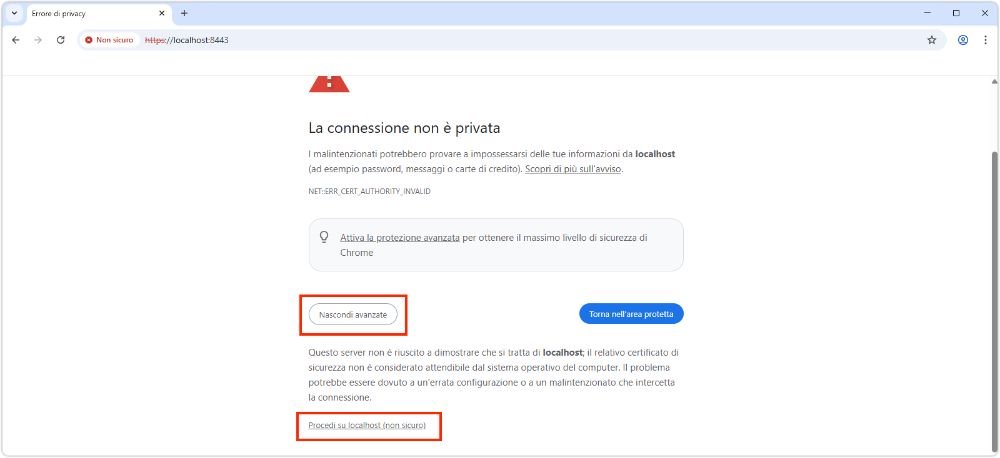
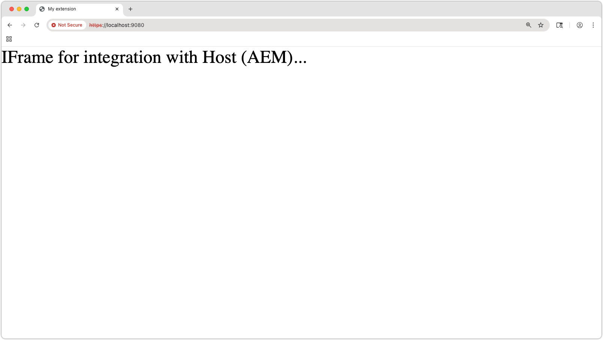
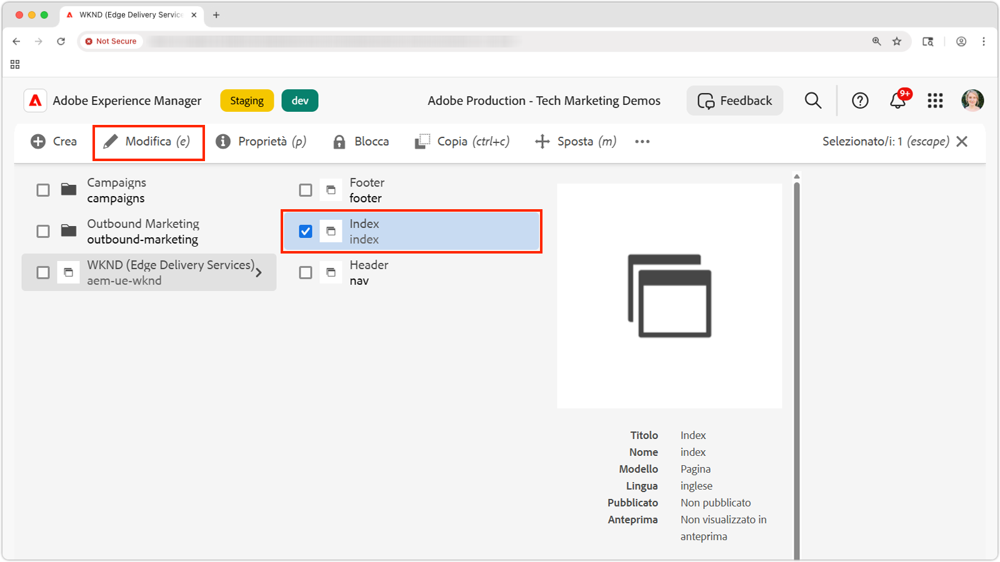
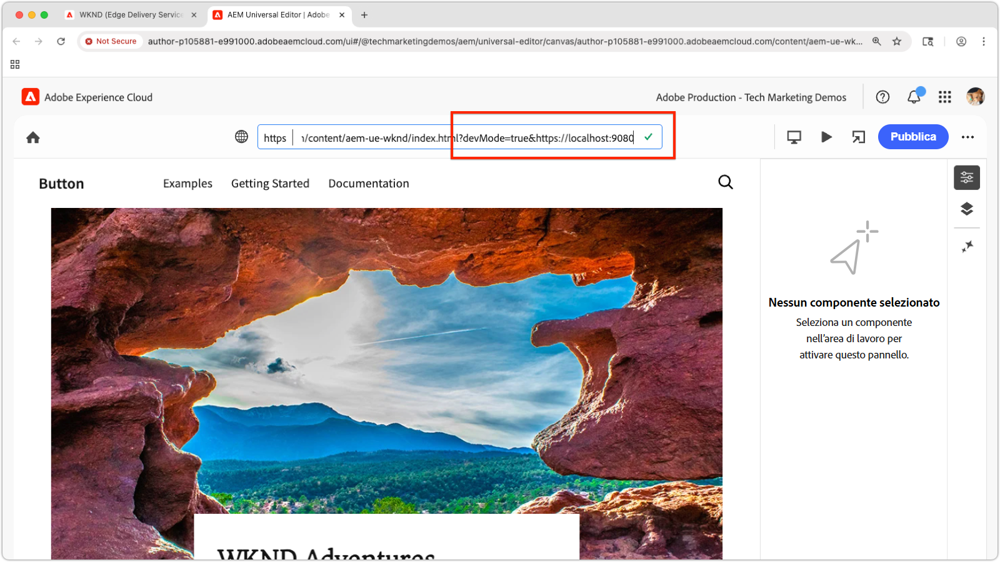

# Visualizzare in anteprima un&#39;estensione Universal Editor locale

>[!TIP]
> Scopri come [creare un&#39;estensione Universal Editor](https://developer.adobe.com/uix/docs/services/aem-universal-editor/).

Per visualizzare in anteprima un&#39;estensione Universal Editor durante lo sviluppo, è necessario:

1. Esegui l&#39;estensione localmente.
2. Accetta il certificato autofirmato.
3. Apri una pagina nell’Editor universale.
4. Aggiorna l&#39;URL della posizione per caricare l&#39;estensione locale.

## Eseguire l’estensione localmente

Si presuppone che sia già stata creata un&#39;estensione [Universal Editor](https://developer.adobe.com/uix/docs/services/aem-universal-editor/) e che si desideri visualizzarne l&#39;anteprima durante il test e lo sviluppo locale.

Avvia l&#39;estensione Universal Editor con:

```bash
$ aio app run
```

Visualizzerai un output simile al seguente:

```
To view your local application:
  -> https://localhost:9080
To view your deployed application in the Experience Cloud shell:
  -> https://experience.adobe.com/?devMode=true#/custom-apps/?localDevUrl=https://localhost:9080
```

Questa opzione esegue l&#39;estensione in `https://localhost:9080` per impostazione predefinita.


## Accetta il certificato autofirmato

Per caricare le estensioni, Universal Editor richiede HTTPS. Poiché lo sviluppo locale utilizza un certificato autofirmato, il browser deve considerarlo esplicitamente attendibile.

Apri una nuova scheda del browser e passa all&#39;output dell&#39;URL dell&#39;estensione locale con il comando `aio app run`:

```
https://localhost:9080
```

Nel browser verrà visualizzato un avviso relativo al certificato. Accetta il certificato per continuare.



Una volta accettata, verrà visualizzata la pagina segnaposto dell’estensione locale:




## Aprire una pagina in Universal Editor

Apri Universal Editor tramite la [console Universal Editor](https://experience.adobe.com/#/@myOrg/aem/editor/canvas/) o modificando una pagina in AEM Sites che utilizza Universal Editor:




## Caricare l’estensione

In Universal Editor, individua il campo **Posizione** nel centro superiore dell&#39;interfaccia. Espandere e aggiornare l&#39;**URL nel campo Posizione**, **non la barra degli indirizzi del browser**.

Aggiungi i seguenti parametri di query:

* `devMode=true` - Abilita la modalità di sviluppo per l&#39;editor universale.
* `ext=https://localhost:9080` - Carica l&#39;estensione eseguita localmente.

Esempio:

```
https://author-pXXX-eXXX.adobeaemcloud.com/content/aem-ue-wknd/index.html?devMode=true&ext=https://localhost:9080
```




## Visualizzare l’anteprima dell’estensione

Esegui un **ricaricamento rigido** del browser per garantire che venga utilizzato l&#39;URL aggiornato.

L&#39;estensione locale verrà ora caricata da Universal Editor, solo nella sessione del browser.

Qualsiasi modifica apportata localmente al codice verrà riflessa immediatamente.


