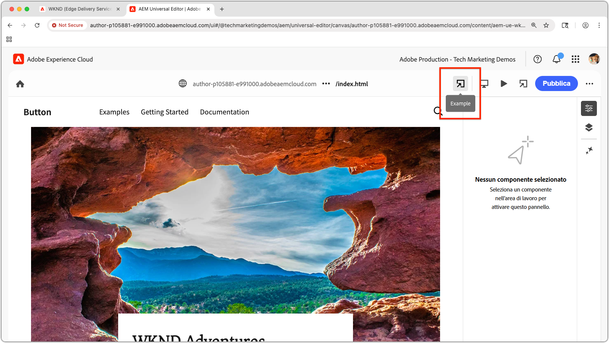

# Visualizzare in anteprima un’estensione per l’editor universale locale

>[!TIP]
> Scopri come [creare un’estensione per l’editor universale](https://developer.adobe.com/uix/docs/services/aem-universal-editor/).

Per visualizzare in anteprima un’estensione per l’editor universale durante lo sviluppo, è necessario:

1. Eseguire l’estensione localmente.
2. Accettare il certificato autofirmato.
3. Aprire una pagina nell’editor universale.
4. Aggiornare l’URL della posizione per caricare l’estensione locale.

## Eseguire l’estensione localmente.

Questo presuppone che tu abbia già creato un’[estensione per l’editor universale](https://developer.adobe.com/uix/docs/services/aem-universal-editor/) e che desideri visualizzarne l’anteprima durante il test e lo sviluppo locale.

Avvia l’estensione per l’editor universale con:

```bash
$ aio app run
```

Visualizzerai un output simile al seguente:

```
To view your local application:
  -> https://localhost:9080
To view your deployed application in the Experience Cloud shell:
  -> https://experience.adobe.com/?devMode=true#/custom-apps/?localDevUrl=https://localhost:9080
```

L’estensione viene eseguita in `https://localhost:9080` per impostazione predefinita.


## Accettare il certificato autofirmato

Per caricare le estensioni, l’editor universale richiede HTTPS. Poiché lo sviluppo locale utilizza un certificato autofirmato, il browser deve esplicitamente considerarlo attendibile.

Apri una nuova scheda del browser e passa all’output dell’URL dell’estensione locale con il comando `aio app run`:

```
https://localhost:9080
```

Nel browser verrà visualizzato un avviso relativo al certificato. Accetta il certificato per continuare.


Una volta accettato, verrà visualizzata la pagina segnaposto dell’estensione locale:


## Aprire una pagina nell’editor universale

Apri l’editor universale tramite la [console dell’editor universale](https://experience.adobe.com/#/@myOrg/aem/editor/canvas/) o modificando una pagina in AEM Sites che lo utilizza:


## Caricare l’estensione

Nell’editor universale, individua il campo **Posizione** nella parte superiore centrale dell’interfaccia. Espandilo e aggiorna l’**URL nel campo Posizione**, **non nella barra degli indirizzi del browser**.

Aggiungi i seguenti parametri di query:

* `devMode=true`: abilita la modalità di sviluppo per l’editor universale.
* `ext=https://localhost:9080`: carica l’estensione eseguita localmente.

Esempio:

```
https://author-pXXX-eXXX.adobeaemcloud.com/content/aem-ue-wknd/index.html?devMode=true&ext=https://localhost:9080
```


## Visualizzare in anteprima l’estensione

Esegui un **caricamento forzato** del browser per garantire che venga utilizzato l’URL aggiornato.

L’estensione locale verrà ora caricata dall’editor universale, solo nella sessione del browser.

Qualsiasi modifica apportata al codice in locale verrà riflessa immediatamente.



