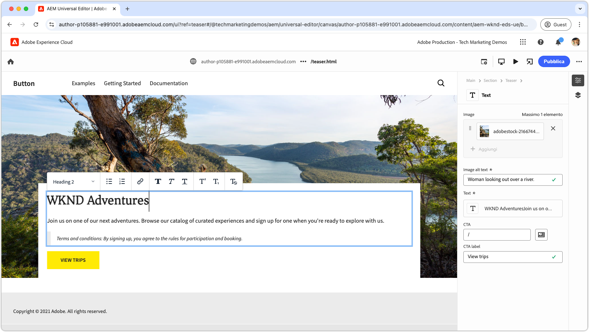

# Video su Edge Delivery Services

Scopri come rendere veloci i siti web con Edge Delivery Services.

>[!VIDEO](https://video.tv.adobe.com/v/3427989/?learn=on)

Consulta la [documentazione](https://experienceleague.adobe.com/it/docs/experience-manager-cloud-service/content/edge-delivery/overview) per informazioni complete su Edge Delivery Services e sulle sue funzionalità.

## Tutorial per sviluppatori di Edge Delivery Services

<!-- CARDS 

* https://experienceleague.adobe.com/it/docs/experience-manager-cloud-service/content/edge-delivery/build/tutorial
  {title = Document-based authoring and Edge Delivery Services tutorial}
  {description = Learn how to create Edge Delivery Services web sites authored using Document-based authoring.}
  {cta = Start the tutorial}

* ./developing/universal-editor/0-overview.md
  {title = Universal Editor and Edge Delivery Services tutorial}
  {description = Learn the basics of creating an Edge Delivery Services web sites authored with Universal Editor.}
  {cta = Start the tutorial}

-->
<!-- START CARDS HTML - DO NOT MODIFY BY HAND -->

    

        

            

                <figure class="image x-is-16by9">
                    
                </figure>
            

            

                

                    

                        <a href="https://experienceleague.adobe.com/it/docs/experience-manager-cloud-service/content/edge-delivery/build/tutorial" target="_blank" rel="referrer" title="Authoring basato su documenti e tutorial su Edge Delivery Services">Authoring basato su documenti e tutorial su Edge Delivery Services</a>
                    

                    
Scopri come creare siti web Edge Delivery Services creati utilizzando l’authoring basato su documenti.

                

                <a href="https://experienceleague.adobe.com/it/docs/experience-manager-cloud-service/content/edge-delivery/build/tutorial" target="_blank" rel="referrer" class="spectrum-Button spectrum-Button--outline spectrum-Button--primary spectrum-Button--sizeM" style="align-self: flex-start; margin-top: 1rem;">
                    Avvia l'esercitazione
                </a>
            

        

    

    

        

            

                <figure class="image x-is-16by9">
                    
                </figure>
            

            

                

                    

                        <a href="./developing/universal-editor/0-overview.md" target="_blank" rel="referrer" title="Tutorial su Universal Editor e Edge Delivery Services">Esercitazione su Universal Editor e Edge Delivery Services</a>
                    

                    
Scopri le nozioni di base sulla creazione di siti web Edge Delivery Services creati con Universal Editor.

                

                <a href="./developing/universal-editor/0-overview.md" target="_blank" rel="referrer" class="spectrum-Button spectrum-Button--outline spectrum-Button--primary spectrum-Button--sizeM" style="align-self: flex-start; margin-top: 1rem;">
                    Avvia l'esercitazione
                </a>
            

        

    

<!-- END CARDS HTML - DO NOT MODIFY BY HAND -->

## Guida introduttiva a Edge Delivery Services

    <!-- Prerequisites -->
    

      

        

          <figure class="image is-16by9">
            
          </figure>
        

        

          

            
5 minuti

            

              <a href="./developing/prerequisites.md" title="Prerequisiti">Prerequisiti per gli sviluppatori</a>
            

            
Cosa è necessario per iniziare a sviluppare con Edge Delivery Services.

            <a href="./developing/prerequisites.md" class="spectrum-Button
              spectrum-Button--outline spectrum-Button--primary
              spectrum-Button--sizeM">
              Guarda il video
            </a>
          

        

      

    
 
    <!-- Setting up your Repository-->
    

      

        

          <figure class="image is-16by9">
            
          </figure>
        

        

          

            
1 minuto

            

              <a href="./developing/aem-boilerplate.md" title="Usa modello boilerplate">Piastra riscaldante AEM</a>
            

            
Utilizza il modello AEM Boilerplate per impostare l’archivio del codice.

            <a href="./developing/aem-boilerplate.md" class="spectrum-Button
              spectrum-Button--outline spectrum-Button--primary
              spectrum-Button--sizeM">
              Guarda il video
            </a>
          

        

      

    

    <!-- Linking Google Drive -->
    

      

        

          <figure class="image is-16by9">
            
          </figure>
        

        

          

            
1 minuto

            

              <a href="./developing/content-repository.md" title="Collega unità Google">Collega unità Google</a>
            

            
Utilizza Google Drive come archivio per tutto il contenuto.

            <a href="./developing/content-repository.md" class="spectrum-Button
              spectrum-Button--outline spectrum-Button--primary
              spectrum-Button--sizeM">
              Guarda il video
            </a>
          

        

      

    

    <!-- Link Sharepoint --->
    

      

        

          <figure class="image is-16by9">
            
          </figure>
        

        

          

            
1 minuto

            

              <a href="./developing/content-repository.md" title="Collega Sharepoint">Collega SharePoint</a>
            

            
Utilizza SharePoint come archivio per tutti i contenuti.

            <a href="./developing/content-repository.md"
              class="spectrum-Button spectrum-Button--outline
              spectrum-Button--primary spectrum-Button--sizeM">
              Guarda il video
            </a>
          

        

      

    

    <!-- Previewing and Publishing Content -->
    

      

        

          <figure class="image is-16by9">
            
          </figure>
        

        

          

            
1 minuto

            

              <a href="./developing/preview-and-publish.md" title="Anteprima e pubblicazione dei contenuti">Anteprima e pubblicazione del contenuto</a>
            

            
Visualizzare in anteprima e pubblicare i contenuti tramite AEM Sidekick.

            <a href="./developing/preview-and-publish.md" class="spectrum-Button
              spectrum-Button--outline spectrum-Button--primary
              spectrum-Button--sizeM">
              Guarda il video
            </a>
          

        

      

    

    <!-- Using the Sidekick -->
    

      

        

          <figure class="image is-16by9">
            
          </figure>
        

        

          

            
1 minuto

            

              <a href="./developing/sidekick.md" title="Utilizzare Sidekick">Utilizza AEM Sidekick</a>
            

            
Scopri come utilizzare AEM Sidekick.

            <a href="./developing/sidekick.md" class="spectrum-Button
              spectrum-Button--outline spectrum-Button--primary
              spectrum-Button--sizeM">
              Guarda il video
            </a>
          

        

      

    

 <!-- Document Structure -->
    

      

        

          <figure class="image is-16by9">
            
          </figure>
        

        

          

            
1 minuto

            

              <a href="./developing/document-structure.md" title="Struttura documento">Struttura documento</a>
            

            
Esplora la struttura del documento, inclusi il contenuto, le sezioni e i blocchi predefiniti 

            <a href="./developing/document-structure.md" class="spectrum-Button
              spectrum-Button--outline spectrum-Button--primary
              spectrum-Button--sizeM">
              Guarda il video
            </a>
          

        

      

    
  
     <!--Local Development -->
    

      

        

          <figure class="image is-16by9">
            
          </figure>
        

        

          

            
2 minuti

            

              <a href="./developing/local-development.md" title="Sviluppo locale">Sviluppo locale</a>
            

            
Configura l’ambiente di sviluppo locale.

            <a href="./developing/local-development.md" class="spectrum-Button
              spectrum-Button--outline spectrum-Button--primary
              spectrum-Button--sizeM">
              Guarda il video
            </a>
          

        

      

    

    <!--Integrate with Git -->
    

      

        

          <figure class="image is-16by9">
            
          </figure>
        

        

          

            
2 minuti

            

              <a href="./developing/git.md" title="Integrare con Git">Integrare con Git</a>
            

            
Configurare Git e Edge Delivery Services.

            <a href="./developing/git.md" class="spectrum-Button
              spectrum-Button--outline spectrum-Button--primary
              spectrum-Button--sizeM">
              Guarda il video
            </a>
          

        

      

    

## Video dimostrativi

    <!--Create RSS Feeds -->
    

      

        

          <figure class="image is-16by9">
            
          </figure>
        

        

          

            
2 minuti

            

              <a href="./how-to/rss.md" title="Crea feed RSS">Crea feed RSS</a>
            

            
Informazioni su come creare feed RSS.

            <a href="./how-to/rss.md" class="spectrum-Button
              spectrum-Button--outline spectrum-Button--primary
              spectrum-Button--sizeM">
              Guarda il video
            </a>
          

        

      

    

    <!--Social Media Sharing -->
    

      

        

          <figure class="image is-16by9">
            
          </figure>
        

        

          

            
2 minuti

            

              <a href="./how-to/social-media-sharing.md" title="Condivisione sui social media">Condivisione sui social media</a>
            

            
Scopri come ottimizzare i contenuti per la condivisione sui social media.

            <a href="./how-to/social-media-sharing.md" class="spectrum-Button
              spectrum-Button--outline spectrum-Button--primary
              spectrum-Button--sizeM">
              Guarda il video
            </a>
          

        

      

    

    <!--Delete a Page -->
    

      

        

          <figure class="image is-16by9">
            
          </figure>
        

        

          

            
2 minuti

            

              <a href="./how-to/delete-page.md" title="Eliminazione di pagine">Eliminazione pagine</a>
            

            
Scopri come eliminare le pagine.

            <a href="./how-to/delete-page.md" class="spectrum-Button
              spectrum-Button--outline spectrum-Button--primary
              spectrum-Button--sizeM">
              Guarda il video
            </a>
          

        

      

    
    
  

