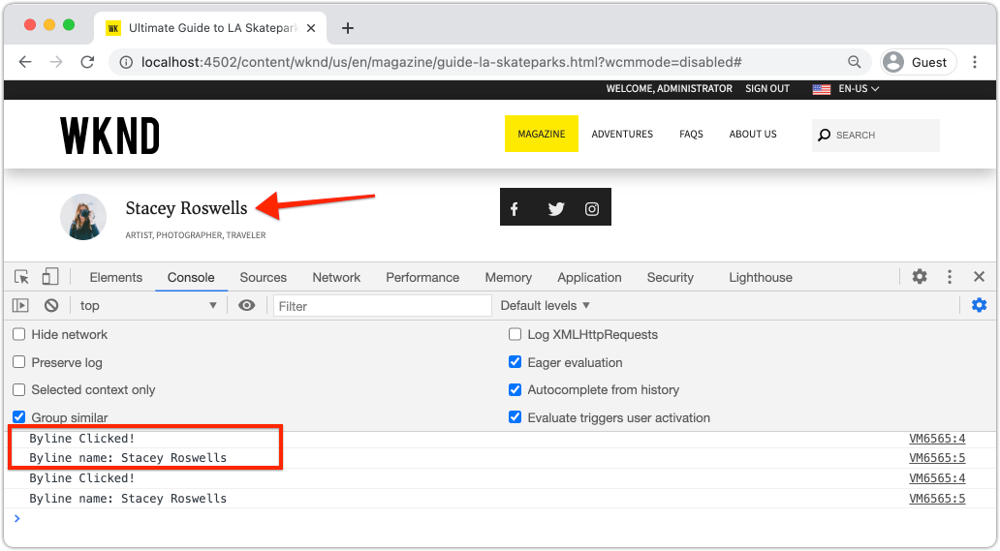

# Personalizzare Adobe Client Data Layer con i componenti AEM {#customize-data-layer}

Scopri come personalizzare Adobe Client Data Layer con i contenuti dei componenti personalizzati di AEM. Scopri come utilizzare le API fornite da [Componenti core AEM per estendere](https://experienceleague.adobe.com/docs/experience-manager-core-components/using/developing/data-layer/extending.html) e personalizzare il livello dati.

## Cosa intendi creare


In questa esercitazione esploreremo varie opzioni per estendere Adobe Client Data Layer aggiornando il componente WKND [Byline](https://experienceleague.adobe.com/docs/experience-manager-learn/getting-started-wknd-tutorial-develop/project-archetype/custom-component.html). Il componente _Byline_ è un **componente personalizzato** e le lezioni apprese in questa esercitazione possono essere applicate ad altri componenti personalizzati.

### Obiettivi {#objective}

1. Inserisci i dati dei componenti nel livello dati estendendo un modello Sling e un codice HTL del componente
1. Utilizzare le utility dei livelli dati dei Componenti core per ridurre l’impegno
1. Utilizzare gli attributi di dati dei Componenti core per agganciare gli eventi dei livelli di dati esistenti

## Prerequisiti {#prerequisites}

Per completare questa esercitazione è necessario un **ambiente di sviluppo locale**. Le schermate e i video vengono acquisiti utilizzando AEM as a Cloud Service SDK in esecuzione su un macOS. I comandi e il codice sono indipendenti dal sistema operativo locale, salvo diversa indicazione.

**Ti avvicini adesso ad AEM as a Cloud Service?** Consulta la [seguente guida per configurare un ambiente di sviluppo locale utilizzando SDK di AEM as a Cloud Service](https://experienceleague.adobe.com/docs/experience-manager-learn/cloud-service/local-development-environment-set-up/overview.html?lang=it).

**Ti avvicini ora ad AEM 6.5?** Consulta la [guida seguente per configurare un ambiente di sviluppo locale](https://experienceleague.adobe.com/docs/experience-manager-learn/foundation/development/set-up-a-local-aem-development-environment.html?lang=it).

## Scarica e distribuisci il sito di riferimento WKND {#set-up-wknd-site}

Questa esercitazione estende il componente Byline nel sito di riferimento WKND. Clona e installa la base di codice WKND nell’ambiente locale.

1. Avvia un&#39;istanza Quickstart **author** locale di AEM in esecuzione su [http://localhost:4502](Http://localhost:4502).
1. Apri una finestra del terminale e clona la base di codice WKND utilizzando Git:

   ```shell
   $ git clone git@github.com:adobe/aem-guides-wknd.git
   ```

1. Implementa la base di codice WKND in un’istanza locale di AEM:

   ```shell
   $ cd aem-guides-wknd
   $ mvn clean install -PautoInstallSinglePackage
   ```

   >[!NOTE]
   >
   > Per AEM 6.5 e il service pack più recente, aggiungi il profilo `classic` al comando Maven:
   >
   > `mvn clean install -PautoInstallSinglePackage -Pclassic`

1. Apri una nuova finestra del browser e accedi ad AEM. Apri una pagina di **Rivista** come: [http://localhost:4502/content/wknd/us/en/magazine/guide-la-skateparks.html](http://localhost:4502/content/wknd/us/en/magazine/guide-la-skateparks.html).

   

   Dovresti trovare un esempio del componente Byline aggiunto alla pagina come parte di un frammento di esperienza. Puoi visualizzare il frammento di esperienza in [http://localhost:4502/editor.html/content/experience-fragments/wknd/language-masters/en/contributors/stacey-roswells/byline.html](http://localhost:4502/editor.html/content/experience-fragments/wknd/language-masters/en/contributors/stacey-roswells/byline.html)
1. Apri gli strumenti per sviluppatori e immetti il comando seguente nella **Console**:

   ```js
   window.adobeDataLayer.getState();
   ```

   Per visualizzare lo stato corrente del livello dati su un sito AEM, controlla la risposta. Dovresti visualizzare informazioni sulla pagina e sui singoli componenti.

   

   Il componente Byline non è elencato in Data Layer.

## Aggiornare il modello Sling Byline {#sling-model}

Per inserire dati sul componente nel livello dati, aggiorniamo prima il modello Sling del componente. Quindi, aggiorna l&#39;interfaccia Java™ di Byline e l&#39;implementazione del modello Sling per avere un nuovo metodo `getData()`. Questo metodo contiene le proprietà da inserire nel livello dati.

1. Aprire il progetto `aem-guides-wknd` nell&#39;IDE desiderato. Passare al modulo `core`.
1. Aprire il file `Byline.java` in `core/src/main/java/com/adobe/aem/guides/wknd/core/models/Byline.java`.

   

1. Aggiungi il metodo seguente all’interfaccia:

   ```java
   public interface Byline {
       ...
       /***
        * Return data about the Byline Component to populate the data layer
        * @return String
        */
       String getData();
   }
   ```

1. Aprire il file `BylineImpl.java` in `core/src/main/java/com/adobe/aem/guides/wknd/core/models/impl/BylineImpl.java`. Si tratta dell&#39;implementazione dell&#39;interfaccia `Byline` e viene implementata come modello Sling.

1. Aggiungi le seguenti istruzioni di importazione all’inizio del file:

   ```java
   import java.util.HashMap;
   import java.util.Map;
   import org.apache.sling.api.resource.Resource;
   import com.fasterxml.jackson.core.JsonProcessingException;
   import com.fasterxml.jackson.databind.ObjectMapper;
   import com.adobe.cq.wcm.core.components.util.ComponentUtils;
   ```

   Le API `fasterxml.jackson` vengono utilizzate per serializzare i dati da esporre come JSON. `ComponentUtils` dei componenti core di AEM vengono utilizzati per verificare se il livello dati è abilitato.

1. Aggiungere il metodo non implementato `getData()` a `BylineImple.java`:

   ```java
   public class BylineImpl implements Byline {
       ...
       @Override
       public String getData() {
           Resource bylineResource = this.request.getResource();
           // Use ComponentUtils to verify if the DataLayer is enabled
           if (ComponentUtils.isDataLayerEnabled(bylineResource)) {
   
               //Create a map of properties we want to expose
               Map<String, Object> bylineProperties = new HashMap<String,Object>();
               bylineProperties.put("@type", bylineResource.getResourceType());
               bylineProperties.put("name", this.getName());
               bylineProperties.put("occupation", this.getOccupations());
               bylineProperties.put("fileReference", image.getFileReference());
   
               //Use AEM Core Component utils to get a unique identifier for the Byline component (in case multiple are on the page)
               String bylineComponentID = ComponentUtils.getId(bylineResource, this.currentPage, this.componentContext);
   
               // Return the bylineProperties as a JSON String with a key of the bylineResource's ID
               try {
                   return String.format("{\"%s\":%s}",
                       bylineComponentID,
                       // Use the ObjectMapper to serialize the bylineProperties to a JSON string
                       new ObjectMapper().writeValueAsString(bylineProperties));
               } catch (JsonProcessingException e) {
   
                   LOGGER.error("Unable to generate dataLayer JSON string", e);
               }
   
           }
           // return null if the Data Layer is not enabled
           return null;
       }
   }
   ```

   Nel metodo precedente, viene utilizzato un nuovo `HashMap` per acquisire le proprietà da esporre come JSON. Si noti che vengono utilizzati metodi esistenti come `getName()` e `getOccupations()`. `@type` rappresenta il tipo di risorsa univoco del componente e consente a un client di identificare facilmente eventi e/o trigger in base al tipo di componente.

   `ObjectMapper` viene utilizzato per serializzare le proprietà e restituire una stringa JSON. Questa stringa JSON può quindi essere inserita nel livello dati.

1. Apri una finestra del terminale. Crea e distribuisci solo il modulo `core` utilizzando le tue abilità Maven:

   ```shell
   $ cd aem-guides-wknd/core
   $ mvn clean install -PautoInstallBundle
   ```

## Aggiornare il codice HTL della linea di base {#htl}

Quindi, aggiorna `Byline` [HTL](https://experienceleague.adobe.com/docs/experience-manager-htl/content/specification.html?lang=en). HTL (HTML Template Language) è il modello utilizzato per eseguire il rendering del HTML del componente.

Per esporre il livello di dati corrispondente viene utilizzato un attributo di dati speciale `data-cmp-data-layer` per ogni componente di AEM. JavaScript fornito dai componenti core di AEM cerca questo attributo di dati. Il valore di questo attributo di dati viene popolato con la stringa JSON restituita dal metodo `getData()` del modello Sling Byline e inserita nel livello dati client di Adobe.

1. Aprire il progetto `aem-guides-wknd` nell&#39;IDE. Passare al modulo `ui.apps`.
1. Aprire il file `byline.html` in `ui.apps/src/main/content/jcr_root/apps/wknd/components/byline/byline.html`.

   

1. Aggiorna `byline.html` per includere l&#39;attributo `data-cmp-data-layer`:

   ```diff
     <div data-sly-use.byline="com.adobe.aem.guides.wknd.core.models.Byline"
       data-sly-use.placeholderTemplate="core/wcm/components/commons/v1/templates.html"
       data-sly-test.hasContent="${!byline.empty}"
   +   data-cmp-data-layer="${byline.data}"
       class="cmp-byline">
       ...
   ```

   Il valore di `data-cmp-data-layer` è stato impostato su `"${byline.data}"` dove `byline` è il modello Sling aggiornato in precedenza. `.data` è la notazione standard per la chiamata di un metodo Java™ Getter in HTL di `getData()` implementato nell&#39;esercizio precedente.

1. Apri una finestra del terminale. Crea e distribuisci solo il modulo `ui.apps` utilizzando le tue abilità Maven:

   ```shell
   $ cd aem-guides-wknd/ui.apps
   $ mvn clean install -PautoInstallPackage
   ```

1. Tornare al browser e riaprire la pagina con un componente Byline: [http://localhost:4502/content/wknd/us/en/magazine/guide-la-skateparks.html](http://localhost:4502/content/wknd/us/en/magazine/guide-la-skateparks.html).

1. Apri gli strumenti per sviluppatori e controlla l’origine HTML della pagina per il componente Byline:

   

   Dovresti notare che `data-cmp-data-layer` è stato popolato con la stringa JSON del modello Sling.

1. Apri gli strumenti per sviluppatori del browser e immetti il comando seguente nella **Console**:

   ```js
   window.adobeDataLayer.getState();
   ```

1. Passa sotto la risposta in `component` per trovare l&#39;istanza del componente `byline` aggiunta al livello dati:

   

   Dovresti trovare una voce simile alla seguente:

   ```json
   byline-136073cfcb:
       @type: "wknd/components/byline"
       fileReference: "/content/dam/wknd/en/contributors/stacey-roswells.jpg"
       name: "Stacey Roswells"
       occupation: (3) ["Artist", "Photographer", "Traveler"]
       parentId: "page-30d989b3f8"
   ```

   Tieni presente che le proprietà esposte sono le stesse aggiunte in `HashMap` nel modello Sling.

## Aggiungi un evento di clic {#click-event}

Adobe Client Data Layer è basato su eventi e uno degli eventi più comuni per attivare un&#39;azione è l&#39;evento `cmp:click`. I componenti core di AEM semplificano la registrazione del componente con l&#39;aiuto dell&#39;elemento dati: `data-cmp-clickable`.

Gli elementi cliccabili sono in genere un pulsante CTA o un collegamento di navigazione. Sfortunatamente, il componente Byline non ha nessuno di questi componenti, ma è comunque possibile registrarlo, in quanto potrebbe essere comune per altri componenti personalizzati.

1. Apri il modulo `ui.apps` nell&#39;IDE
1. Aprire il file `byline.html` in `ui.apps/src/main/content/jcr_root/apps/wknd/components/byline/byline.html`.

1. Aggiorna `byline.html` per includere l&#39;attributo `data-cmp-clickable` nell&#39;elemento **name** di Byline:

   ```diff
     <h2 class="cmp-byline__name" 
   +    data-cmp-clickable="${byline.data ? true : false}">
        ${byline.name}
     </h2>
   ```

1. Apri un nuovo terminale. Crea e distribuisci solo il modulo `ui.apps` utilizzando le tue abilità Maven:

   ```shell
   $ cd aem-guides-wknd/ui.apps
   $ mvn clean install -PautoInstallPackage
   ```

1. Tornare al browser e riaprire la pagina con il componente Byline aggiunto: [http://localhost:4502/content/wknd/us/en/magazine/guide-la-skateparks.html](http://localhost:4502/content/wknd/us/en/magazine/guide-la-skateparks.html).

   Per testare il nostro evento, aggiungeremo manualmente un po’ di JavaScript utilizzando la Developer Console. Per un video su come eseguire questa operazione, vedi [Utilizzo di Adobe Client Data Layer con i componenti core di AEM](data-layer-overview.md).

1. Apri gli strumenti per sviluppatori del browser e immetti il metodo seguente nella **Console**:

   ```javascript
   function bylineClickHandler(event) {
       var dataObject = window.adobeDataLayer.getState(event.eventInfo.path);
       if (dataObject != null && dataObject['@type'] === 'wknd/components/byline') {
           console.log("Byline Clicked!");
           console.log("Byline name: " + dataObject['name']);
       }
   }
   ```

   Questo metodo semplice deve gestire il clic del nome del componente Byline.

1. Immetti il seguente metodo nella **Console**:

   ```javascript
   window.adobeDataLayer.push(function (dl) {
        dl.addEventListener("cmp:click", bylineClickHandler);
   });
   ```

   Il metodo precedente invia un listener di eventi sul livello dati per l&#39;ascolto dell&#39;evento `cmp:click` e chiama `bylineClickHandler`.

   >[!CAUTION]
   >
   > È importante **not** aggiornare il browser durante questo esercizio, altrimenti la console JavaScript andrà persa.

1. Nel browser, con **Console** aperta, fare clic sul nome dell&#39;autore nel componente Byline:

   

   Dovrebbero essere visualizzati il messaggio della console `Byline Clicked!` e il nome della riga di comando.

   L&#39;evento `cmp:click` è il più semplice da collegare. Per i componenti più complessi e per tenere traccia di altri comportamenti, è possibile aggiungere JavaScript personalizzati per aggiungere e registrare nuovi eventi. Un ottimo esempio è il componente Carosello, che attiva un evento `cmp:show` ogni volta che viene attivata una diapositiva. Per ulteriori dettagli, consulta il [codice sorgente](https://github.com/adobe/aem-core-wcm-components/blob/main/content/src/content/jcr_root/apps/core/wcm/components/carousel/v1/carousel/clientlibs/site/js/carousel.js).

## Utilizzare l&#39;utilità DataLayerBuilder {#data-layer-builder}

Quando il modello Sling era [aggiornato](#sling-model) in precedenza nel capitolo, abbiamo scelto di creare la stringa JSON utilizzando un `HashMap` e impostando manualmente ciascuna proprietà. Questo metodo funziona bene per i componenti una tantum di piccole dimensioni, tuttavia per i componenti che estendono i Componenti core di AEM ciò potrebbe comportare un notevole aumento del codice.

Esiste una classe di utilità, `DataLayerBuilder`, per eseguire la maggior parte del sollevamento pesante. Questo consente alle implementazioni di estendere solo le proprietà che desiderano. Aggiorniamo il modello Sling per utilizzare `DataLayerBuilder`.

1. Tornare all&#39;IDE e passare al modulo `core`.
1. Aprire il file `Byline.java` in `core/src/main/java/com/adobe/aem/guides/wknd/core/models/Byline.java`.
1. Modificare il metodo `getData()` per restituire un tipo di `ComponentData`

   ```java
   import com.adobe.cq.wcm.core.components.models.datalayer.ComponentData;
   ...
   public interface Byline {
       ...
       /***
        * Return data about the Byline Component to populate the data layer
        * @return ComponentData
        */
       ComponentData getData();
   }
   ```

   `ComponentData` è un oggetto fornito dai componenti core di AEM. Genera una stringa JSON, come nell’esempio precedente, ma esegue anche un sacco di lavoro aggiuntivo.

1. Aprire il file `BylineImpl.java` in `core/src/main/java/com/adobe/aem/guides/wknd/core/models/impl/BylineImpl.java`.

1. Aggiungi le seguenti istruzioni di importazione:

   ```java
   import com.adobe.cq.wcm.core.components.models.datalayer.ComponentData;
   import com.adobe.cq.wcm.core.components.models.datalayer.builder.DataLayerBuilder;
   ```

1. Sostituire il metodo `getData()` con il seguente:

   ```java
   @Override
   public ComponentData getData() {
       Resource bylineResource = this.request.getResource();
       // Use ComponentUtils to verify if the DataLayer is enabled
       if (ComponentUtils.isDataLayerEnabled(bylineResource)) {
   
           return DataLayerBuilder.extending(getImage().getData()).asImageComponent()
               .withTitle(this::getName)
               .build();
   
       }
       // return null if the Data Layer is not enabled
       return null;
   }
   ```

   Il componente Byline riutilizza parti del componente core Immagine per visualizzare un’immagine che rappresenta l’autore. Nel frammento precedente, [DataLayerBuilder](https://javadoc.io/doc/com.adobe.cq/core.wcm.components.core/latest/com/adobe/cq/wcm/core/components/models/datalayer/builder/ComponentDataBuilder.html) viene utilizzato per estendere il livello dati del componente `Image`. L’oggetto JSON viene precompilato con tutti i dati sull’immagine utilizzata. Esegue inoltre alcune delle funzioni di routine come l&#39;impostazione di `@type` e l&#39;identificatore univoco del componente. Nota che il metodo è piccolo!

   L&#39;unica proprietà ha esteso `withTitle`, che viene sostituito con il valore di `getName()`.

1. Apri una finestra del terminale. Crea e distribuisci solo il modulo `core` utilizzando le tue abilità Maven:

   ```shell
   $ cd aem-guides-wknd/core
   $ mvn clean install -PautoInstallBundle
   ```

1. Torna all&#39;IDE e apri il file `byline.html` in `ui.apps`
1. Aggiorna HTL per utilizzare `byline.data.json` per popolare l&#39;attributo `data-cmp-data-layer`:

   ```diff
     <div data-sly-use.byline="com.adobe.aem.guides.wknd.core.models.Byline"
       data-sly-use.placeholderTemplate="core/wcm/components/commons/v1/templates.html"
       data-sly-test.hasContent="${!byline.empty}"
   -   data-cmp-data-layer="${byline.data}"
   +   data-cmp-data-layer="${byline.data.json}"
   ```

   Ricordare che è in corso la restituzione di un oggetto di tipo `ComponentData`. Questo oggetto include un metodo getter `getJson()` utilizzato per popolare l&#39;attributo `data-cmp-data-layer`.

1. Apri una finestra del terminale. Crea e distribuisci solo il modulo `ui.apps` utilizzando le tue abilità Maven:

   ```shell
   $ cd aem-guides-wknd/ui.apps
   $ mvn clean install -PautoInstallPackage
   ```

1. Tornare al browser e riaprire la pagina con il componente Byline aggiunto: [http://localhost:4502/content/wknd/us/en/magazine/guide-la-skateparks.html](http://localhost:4502/content/wknd/us/en/magazine/guide-la-skateparks.html).
1. Apri gli strumenti per sviluppatori del browser e immetti il comando seguente nella **Console**:

   ```js
   window.adobeDataLayer.getState();
   ```

1. Passare sotto la risposta in `component` per trovare l&#39;istanza del componente `byline`:

   

   Dovresti trovare una voce simile alla seguente:

   ```json
   byline-136073cfcb:
       @type: "wknd/components/byline"
       dc:title: "Stacey Roswells"
       image:
           @type: "image/jpeg"
           repo:id: "142658f8-4029-4299-9cd6-51afd52345c0"
           repo:modifyDate: "2019-10-25T23:49:51Z"
           repo:path: "/content/dam/wknd/en/contributors/stacey-roswells.jpg"
           xdm:tags: []
       parentId: "page-30d989b3f8"
       repo:modifyDate: "2019-10-18T20:17:24Z"
   ```

   Si noti che ora è presente un oggetto `image` all&#39;interno della voce del componente `byline`. Questa contiene molte più informazioni sulla risorsa in DAM. Inoltre, osserva che `@type` e l&#39;ID univoco (in questo caso `byline-136073cfcb`) sono stati compilati automaticamente, e `repo:modifyDate` che indica quando il componente è stato modificato.

## Esempi aggiuntivi {#additional-examples}

1. Un altro esempio di estensione del livello dati può essere visualizzato esaminando il componente `ImageList` nella base di codice WKND:
   * `ImageList.java` - Interfaccia Java nel modulo `core`.
   * `ImageListImpl.java` - Modello Sling nel modulo `core`.
   * `image-list.html` - Modello HTL nel modulo `ui.apps`.

   >[!NOTE]
   >
   > È più difficile includere proprietà personalizzate come `occupation` quando si utilizza [DataLayerBuilder](https://javadoc.io/doc/com.adobe.cq/core.wcm.components.core/latest/com/adobe/cq/wcm/core/components/models/datalayer/builder/ComponentDataBuilder.html). Tuttavia, se si estende un Componente core che include un’immagine o una pagina, l’utility consente di risparmiare molto tempo.

   >[!NOTE]
   >
   > Se crei un livello dati avanzato per gli oggetti riutilizzati in un’implementazione, si consiglia di estrarre gli elementi del livello dati nei propri oggetti Java™ specifici del livello dati. I componenti core Commerce, ad esempio, hanno aggiunto interfacce per `ProductData` e `CategoryData` poiché queste possono essere utilizzate su molti componenti all&#39;interno di un&#39;implementazione Commerce. Rivedi [il codice nell’archivio aem-cif-core-components](https://github.com/adobe/aem-core-cif-components/tree/master/bundles/core/src/main/java/com/adobe/cq/commerce/core/components/datalayer) per ulteriori dettagli.

## Congratulazioni. {#congratulations}

Hai appena esplorato alcuni modi per estendere e personalizzare Adobe Client Data Layer con i componenti di AEM.

## Risorse aggiuntive {#additional-resources}

* [Documentazione di Adobe Client Data Layer](https://github.com/adobe/adobe-client-data-layer/wiki)
* [Integrazione di Data Layer con i Componenti core](https://github.com/adobe/aem-core-wcm-components/blob/main/DATA_LAYER_INTEGRATION.md)
* [Utilizzo della documentazione di Adobe Client Data Layer e Componenti core](https://experienceleague.adobe.com/docs/experience-manager-core-components/using/developing/data-layer/overview.html?lang=it)
