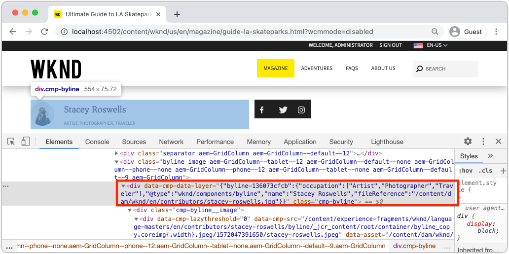

# Personalizzare Adobe Client Data Layer con i componenti AEM {#customize-data-layer}

Scopri come personalizzare Adobe Client Data Layer con il contenuto dei componenti AEM personalizzati. Scopri come utilizzare le API fornite da [AEM componenti core per estendere](https://experienceleague.adobe.com/docs/experience-manager-core-components/using/developing/data-layer/extending.html) e personalizzare il livello dati.

## Cosa verrà creato



In questa esercitazione esplorerai diverse opzioni per l’estensione di Adobe Client Data Layer aggiornando il WKND [componente Byline](https://experienceleague.adobe.com/docs/experience-manager-learn/getting-started-wknd-tutorial-develop/custom-component.html). Si tratta di un componente personalizzato e le lezioni imparate in questa esercitazione possono essere applicate ad altri componenti personalizzati.

### Obiettivi {#objective}

1. Inserisci i dati dei componenti nel livello dati estendendo un modello Sling e un componente HTL
1. Utilizza le utilità dei livelli dati dei componenti core per ridurre i tempi di esecuzione
1. Utilizzare gli attributi dei dati dei componenti core per eseguire il collegamento agli eventi dei livelli dati esistenti

## Prerequisiti {#prerequisites}

Per completare questa esercitazione, è necessario un **ambiente di sviluppo locale** . Le schermate e i video vengono acquisiti utilizzando l’SDK di AEM come Cloud Service in esecuzione su un macOS. I comandi e il codice sono indipendenti dal sistema operativo locale, se non diversamente specificato.

**Ti avvicini adesso ad AEM as a Cloud Service?** Consulta la [seguente guida per configurare un ambiente di sviluppo locale utilizzando SDK di AEM as a Cloud Service](https://experienceleague.adobe.com/docs/experience-manager-learn/cloud-service/local-development-environment-set-up/overview.html).

**Nuovo a AEM 6.5?** Consulta la  [seguente guida per configurare un ambiente](https://experienceleague.adobe.com/docs/experience-manager-learn/foundation/development/set-up-a-local-aem-development-environment.html) di sviluppo locale.

## Scaricare e distribuire il sito WKND Reference {#set-up-wknd-site}

Questa esercitazione estende il componente Byline nel sito di riferimento WKND. Clona e installa la base di codice WKND nel tuo ambiente locale.

1. Avvia un&#39;istanza locale di Quickstart **author** AEM in esecuzione su [http://localhost:4502](Http://localhost:4502).
1. Apri una finestra terminale e duplica la base di codice WKND utilizzando Git:

   ```shell
   $ git clone git@github.com:adobe/aem-guides-wknd.git
   ```

1. Distribuisci la base di codice WKND in un&#39;istanza locale di AEM:

   ```shell
   $ cd aem-guides-wknd
   $ mvn clean install -PautoInstallSinglePackage
   ```

   >[!NOTE]
   >
   > Se utilizzi AEM 6.5 e l&#39;ultimo service pack, aggiungi il profilo `classic` al comando Maven:
   >
   > `mvn clean install -PautoInstallSinglePackage -Pclassic`

1. Apri una nuova finestra del browser e accedi a AEM. Apri una pagina **Magazine** come: [http://localhost:4502/content/wknd/us/en/magazine/guide-la-skateparks.html](http://localhost:4502/content/wknd/us/en/magazine/guide-la-skateparks.html).

   

   Dovresti visualizzare un esempio del componente Byline che è stato aggiunto alla pagina come parte di un frammento esperienza. Puoi visualizzare il frammento esperienza all&#39;indirizzo [http://localhost:4502/editor.html/content/experience-fragments/wknd/language-masters/en/contributors/stacey-roswells/byline.html](http://localhost:4502/editor.html/content/experience-fragments/wknd/language-masters/en/contributors/stacey-roswells/byline.html)
1. Apri gli strumenti per sviluppatori e immetti il seguente comando nella **Console**:

   ```js
   window.adobeDataLayer.getState();
   ```

   Inspect la risposta per visualizzare lo stato corrente del livello di dati su un sito AEM. Dovresti visualizzare informazioni sulla pagina e sui singoli componenti.

   

   Osserva che il componente Byline non è elencato nel Livello dati.

## Aggiornare il modello Sling per riga {#sling-model}

Per inserire dati sul componente nel livello dati, è necessario prima aggiornare il modello Sling del componente. Quindi, aggiorna l’interfaccia Java di Byline e l’implementazione di Sling Model per aggiungere un nuovo metodo `getData()`. Questo metodo conterrà le proprietà che desideri inserire nel livello dati.

1. Nell’IDE che preferisci, apri il progetto `aem-guides-wknd` . Passa al modulo `core` .
1. Apri il file `Byline.java` in `core/src/main/java/com/adobe/aem/guides/wknd/core/models/Byline.java`.

   

1. Aggiungi un nuovo metodo all&#39;interfaccia:

   ```java
   public interface Byline {
       ...
       /***
        * Return data about the Byline Component to populate the data layer
        * @return String
        */
       String getData();
   }
   ```

1. Apri il file `BylineImpl.java` in `core/src/main/java/com/adobe/aem/guides/wknd/core/models/impl/BylineImpl.java`.

   Questa è l’implementazione dell’ interfaccia `Byline` e viene implementata come modello Sling.

1. Aggiungi le seguenti istruzioni di importazione all’inizio del file :

   ```java
   import java.util.HashMap;
   import java.util.Map;
   import org.apache.sling.api.resource.Resource;
   import com.fasterxml.jackson.core.JsonProcessingException;
   import com.fasterxml.jackson.databind.ObjectMapper;
   import com.adobe.cq.wcm.core.components.util.ComponentUtils;
   ```

   Le API `fasterxml.jackson` verranno utilizzate per serializzare i dati che desideri esporre come JSON. I `ComponentUtils` AEM componenti core verranno utilizzati per verificare se il livello dati è abilitato.

1. Aggiungi il metodo non implementato `getData()` a `BylineImple.java`:

   ```java
   public class BylineImpl implements Byline {
       ...
       @Override
       public String getData() {
           Resource bylineResource = this.request.getResource();
           // Use ComponentUtils to verify if the DataLayer is enabled
           if (ComponentUtils.isDataLayerEnabled(bylineResource)) {
   
               //Create a map of properties we want to expose
               Map<String, Object> bylineProperties = new HashMap<String,Object>();
               bylineProperties.put("@type", bylineResource.getResourceType());
               bylineProperties.put("name", this.getName());
               bylineProperties.put("occupation", this.getOccupations());
               bylineProperties.put("fileReference", image.getFileReference());
   
               //Use AEM Core Component utils to get a unique identifier for the Byline component (in case multiple are on the page)
               String bylineComponentID = ComponentUtils.getId(bylineResource, this.currentPage, this.componentContext);
   
               // Return the bylineProperties as a JSON String with a key of the bylineResource's ID
               try {
                   return String.format("{\"%s\":%s}",
                       bylineComponentID,
                       // Use the ObjectMapper to serialize the bylineProperties to a JSON string
                       new ObjectMapper().writeValueAsString(bylineProperties));
               } catch (JsonProcessingException e) {
   
                   LOGGER.error("Unable to generate dataLayer JSON string", e);
               }
   
           }
           // return null if the Data Layer is not enabled
           return null;
       }
   }
   ```

   Nel metodo precedente viene utilizzato un nuovo `HashMap` per acquisire le proprietà che desideri esporre come JSON. Si noti che vengono utilizzati metodi esistenti come `getName()` e `getOccupations()` . `@type` rappresenta il tipo di risorsa univoco del componente, che consente a un client di identificare facilmente gli eventi e/o i trigger in base al tipo di componente.

   L’ `ObjectMapper` viene utilizzato per serializzare le proprietà e restituire una stringa JSON. Questa stringa JSON può quindi essere inserita nel livello dati.

1. Apri una finestra terminale. Crea e distribuisci solo il modulo `core` utilizzando le tue competenze Maven:

   ```shell
   $ cd aem-guides-wknd/core
   $ mvn clean install -PautoInstallBundle
   ```

## Aggiornare l’HTL per riga precedente {#htl}

Quindi, aggiorna il `Byline` [HTL](https://experienceleague.adobe.com/docs/experience-manager-htl/using/htl/block-statements.html?lang=en#htl). HTL (HTML Template Language) è il modello utilizzato per eseguire il rendering dell’HTML del componente.

Per esporre il livello dati viene utilizzato un attributo dati speciale `data-cmp-data-layer` su ciascun componente AEM.  JavaScript fornito da AEM componenti core cerca questo attributo di dati, il cui valore verrà popolato con la stringa JSON restituita dal metodo `getData()` del modello Sling per righe, e inserisce i valori nel livello di dati client Adobe.

1. Nell’IDE apri il progetto `aem-guides-wknd` . Passa al modulo `ui.apps` .
1. Apri il file `byline.html` in `ui.apps/src/main/content/jcr_root/apps/wknd/components/byline/byline.html`.

   

1. Aggiorna `byline.html` per includere l&#39;attributo `data-cmp-data-layer` :

   ```diff
     <div data-sly-use.byline="com.adobe.aem.guides.wknd.core.models.Byline"
       data-sly-use.placeholderTemplate="core/wcm/components/commons/v1/templates.html"
       data-sly-test.hasContent="${!byline.empty}"
   +   data-cmp-data-layer="${byline.data}"
       class="cmp-byline">
       ...
   ```

   Il valore di `data-cmp-data-layer` è stato impostato su `"${byline.data}"` dove `byline` è il modello Sling aggiornato in precedenza. `.data` è la notazione standard per la chiamata di un metodo Java Getter in HTL di  `getData()` implementato nell’esercizio precedente.

1. Apri una finestra terminale. Crea e distribuisci solo il modulo `ui.apps` utilizzando le tue competenze Maven:

   ```shell
   $ cd aem-guides-wknd/ui.apps
   $ mvn clean install -PautoInstallPackage
   ```

1. Torna al browser e riapri la pagina con un componente Byline: [http://localhost:4502/content/wknd/us/en/magazine/guide-la-skateparks.html](http://localhost:4502/content/wknd/us/en/magazine/guide-la-skateparks.html).

1. Apri gli strumenti per sviluppatori ed esamina l’origine HTML della pagina per il componente Byline:

   

   Dovresti vedere che il `data-cmp-data-layer` è stato popolato con la stringa JSON dal modello Sling.

1. Apri gli strumenti di sviluppo del browser e immetti il seguente comando nella **Console**:

   ```js
   window.adobeDataLayer.getState();
   ```

1. Naviga sotto la risposta in `component` per trovare l’istanza del componente `byline` è stata aggiunta al livello dati:

   

   Dovresti visualizzare una voce come segue:

   ```json
   byline-136073cfcb:
       @type: "wknd/components/byline"
       fileReference: "/content/dam/wknd/en/contributors/stacey-roswells.jpg"
       name: "Stacey Roswells"
       occupation: (3) ["Artist", "Photographer", "Traveler"]
       parentId: "page-30d989b3f8"
   ```

   Osserva che le proprietà esposte sono le stesse aggiunte in `HashMap` nel modello Sling.

## Aggiungi un evento clic {#click-event}

Adobe Client Data Layer è basato su eventi e uno degli eventi più comuni per attivare un’azione è l’evento `cmp:click` . I componenti core AEM facilitano la registrazione del componente con l’aiuto dell’elemento dati: `data-cmp-clickable`.

Gli elementi selezionabili sono in genere un pulsante CTA o un collegamento di navigazione. Sfortunatamente il componente Byline non dispone di nessuno di questi ma verrà comunque registrato in quanto potrebbe essere comune per altri componenti personalizzati.

1. Apri il modulo `ui.apps` nell’IDE
1. Apri il file `byline.html` in `ui.apps/src/main/content/jcr_root/apps/wknd/components/byline/byline.html`.

1. Aggiorna `byline.html` per includere l&#39;attributo `data-cmp-clickable` nell&#39;elemento **name** del Byline:

   ```diff
     <h2 class="cmp-byline__name" 
   +    data-cmp-clickable="${byline.data ? true : false}">
        ${byline.name}
     </h2>
   ```

1. Apri un nuovo terminale. Crea e distribuisci solo il modulo `ui.apps` utilizzando le tue competenze Maven:

   ```shell
   $ cd aem-guides-wknd/ui.apps
   $ mvn clean install -PautoInstallPackage
   ```

1. Torna al browser e riapri la pagina con il componente Byline aggiunto: [http://localhost:4502/content/wknd/us/en/magazine/guide-la-skateparks.html](http://localhost:4502/content/wknd/us/en/magazine/guide-la-skateparks.html).

   Per testare il nostro evento aggiungeremo manualmente alcuni JavaScript utilizzando la console di sviluppo. Per un video su come eseguire questa operazione, consulta [Utilizzo di Adobe Client Data Layer con AEM Core Components](data-layer-overview.md) .

1. Apri gli strumenti per sviluppatori del browser e immetti il seguente metodo nella **Console**:

   ```javascript
   function bylineClickHandler(event) {
       var dataObject = window.adobeDataLayer.getState(event.eventInfo.path);
       if (dataObject != null && dataObject['@type'] === 'wknd/components/byline') {
           console.log("Byline Clicked!");
           console.log("Byline name: " + dataObject['name']);
       }
   }
   ```

   Questo metodo semplice deve gestire il clic del nome del componente Byline.

1. Immetti il seguente metodo nella **Console**:

   ```javascript
   window.adobeDataLayer.push(function (dl) {
        dl.addEventListener("cmp:click", bylineClickHandler);
   });
   ```

   Il metodo precedente invia un listener di eventi sul livello dati per ascoltare l&#39;evento `cmp:click` e chiama il `bylineClickHandler`.

   >[!CAUTION]
   >
   > Sarà importante **non** aggiornare il browser durante questo esercizio, altrimenti il JavaScript della console verrà perso.

1. Nel browser, con la **Console** aperta, fai clic sul nome dell&#39;autore nel componente Byline:

   

   Dovresti visualizzare il messaggio della console `Byline Clicked!` e il nome della riga.

   L’evento `cmp:click` è il più semplice in cui eseguire il collegamento. Per i componenti più complessi e per tenere traccia di altri comportamenti è possibile aggiungere javascript personalizzato per aggiungere e registrare nuovi eventi. Un esempio lampante è il componente Carosello, che attiva un evento `cmp:show` ogni volta che una diapositiva viene attivata. Per ulteriori informazioni, consulta [codice sorgente](https://github.com/adobe/aem-core-wcm-components/blob/master/content/src/content/jcr_root/apps/core/wcm/components/carousel/v1/carousel/clientlibs/site/js/carousel.js#L219).

## Utilizzare l&#39;utility DataLayerBuilder {#data-layer-builder}

Quando il modello Sling era [aggiornato](#sling-model) prima nel capitolo, abbiamo scelto di creare la stringa JSON utilizzando un `HashMap` e impostando manualmente ciascuna proprietà. Questo metodo funziona bene per i componenti una tantum di piccole dimensioni, tuttavia per i componenti che estendono i componenti core di AEM questo potrebbe causare un sacco di codice aggiuntivo.

Una classe di utilità, `DataLayerBuilder`, esiste per eseguire la maggior parte del sollevamento pesante. Questo consente alle implementazioni di estendere solo le proprietà desiderate. Aggiorna il modello Sling per utilizzare il `DataLayerBuilder`.

1. Torna all’IDE e passa al modulo `core` .
1. Apri il file `Byline.java` in `core/src/main/java/com/adobe/aem/guides/wknd/core/models/Byline.java`.
1. Modifica il metodo `getData()` per restituire un tipo di `ComponentData`

   ```java
   import com.adobe.cq.wcm.core.components.models.datalayer.ComponentData;
   ...
   public interface Byline {
       ...
       /***
        * Return data about the Byline Component to populate the data layer
        * @return ComponentData
        */
       ComponentData getData();
   }
   ```

   `ComponentData` è un oggetto fornito AEM componenti core. Si traduce in una stringa JSON, come nell’esempio precedente, ma esegue anche molto lavoro aggiuntivo.

1. Apri il file `BylineImpl.java` in `core/src/main/java/com/adobe/aem/guides/wknd/core/models/impl/BylineImpl.java`.

1. Aggiungi le seguenti istruzioni di importazione:

   ```java
   import com.adobe.cq.wcm.core.components.models.datalayer.ComponentData;
   import com.adobe.cq.wcm.core.components.models.datalayer.builder.DataLayerBuilder;
   ```

1. Sostituisci il metodo `getData()` con quanto segue:

   ```java
   @Override
   public ComponentData getData() {
       Resource bylineResource = this.request.getResource();
       // Use ComponentUtils to verify if the DataLayer is enabled
       if (ComponentUtils.isDataLayerEnabled(bylineResource)) {
   
           return DataLayerBuilder.extending(getImage().getData()).asImageComponent()
               .withTitle(this::getName)
               .build();
   
       }
       // return null if the Data Layer is not enabled
       return null;
   }
   ```

   Il componente Byline riutilizza parti del componente di base immagine per visualizzare un’immagine che rappresenta l’autore. Nello snippet di codice riportato sopra, viene utilizzato [DataLayerBuilder](https://javadoc.io/doc/com.adobe.cq/core.wcm.components.core/latest/com/adobe/cq/wcm/core/components/models/datalayer/builder/ComponentDataBuilder.html) per estendere il livello di dati del componente `Image`. Questo precompila l’oggetto JSON con tutti i dati sull’immagine utilizzata. Esegue anche alcune delle funzioni di routine come l&#39;impostazione di `@type` e l&#39;identificatore univoco del componente. Notate che il metodo è davvero piccolo!

   L&#39;unica proprietà ha esteso il valore `withTitle` che viene sostituito con il valore di `getName()`.

1. Apri una finestra terminale. Crea e distribuisci solo il modulo `core` utilizzando le tue competenze Maven:

   ```shell
   $ cd aem-guides-wknd/core
   $ mvn clean install -PautoInstallBundle
   ```

1. Torna all’IDE e apri il file `byline.html` in `ui.apps`
1. Aggiorna l’HTL per utilizzare `byline.data.json` per popolare l’attributo `data-cmp-data-layer` :

   ```diff
     <div data-sly-use.byline="com.adobe.aem.guides.wknd.core.models.Byline"
       data-sly-use.placeholderTemplate="core/wcm/components/commons/v1/templates.html"
       data-sly-test.hasContent="${!byline.empty}"
   -   data-cmp-data-layer="${byline.data}"
   +   data-cmp-data-layer="${byline.data.json}"
   ```

   Ricorda che ora stiamo restituendo un oggetto di tipo `ComponentData`. Questo oggetto include un metodo getter `getJson()` che viene utilizzato per compilare l&#39;attributo `data-cmp-data-layer`.

1. Apri una finestra terminale. Crea e distribuisci solo il modulo `ui.apps` utilizzando le tue competenze Maven:

   ```shell
   $ cd aem-guides-wknd/ui.apps
   $ mvn clean install -PautoInstallPackage
   ```

1. Torna al browser e riapri la pagina con il componente Byline aggiunto: [http://localhost:4502/content/wknd/us/en/magazine/guide-la-skateparks.html](http://localhost:4502/content/wknd/us/en/magazine/guide-la-skateparks.html).
1. Apri gli strumenti di sviluppo del browser e immetti il seguente comando nella **Console**:

   ```js
   window.adobeDataLayer.getState();
   ```

1. Naviga sotto la risposta in `component` per trovare l&#39;istanza del componente `byline`:

   

   Dovresti visualizzare una voce come segue:

   ```json
   byline-136073cfcb:
       @type: "wknd/components/byline"
       dc:title: "Stacey Roswells"
       image:
           @type: "image/jpeg"
           repo:id: "142658f8-4029-4299-9cd6-51afd52345c0"
           repo:modifyDate: "2019-10-25T23:49:51Z"
           repo:path: "/content/dam/wknd/en/contributors/stacey-roswells.jpg"
           xdm:tags: []
       parentId: "page-30d989b3f8"
       repo:modifyDate: "2019-10-18T20:17:24Z"
   ```

   Osserva che è ora presente un oggetto `image` all’interno della voce del componente `byline`. Questo contiene molte più informazioni sulla risorsa in DAM. Inoltre, i valori `@type` e l’ID univoco (in questo caso `byline-136073cfcb`) sono stati compilati automaticamente, nonché il valore `repo:modifyDate` che indica quando il componente è stato modificato.

## Esempi aggiuntivi {#additional-examples}

1. Un altro esempio di estensione del livello dati può essere visualizzato esaminando il componente `ImageList` nella base di codice WKND:
   * `ImageList.java` - Interfaccia Java nel  `core` modulo .
   * `ImageListImpl.java` - Modello Sling nel  `core` modulo .
   * `image-list.html` - Modello HTL nel  `ui.apps` modulo .

   >[!NOTE]
   >
   > È un po&#39; più difficile includere proprietà personalizzate come `occupation` quando si utilizza [DataLayerBuilder](https://javadoc.io/doc/com.adobe.cq/core.wcm.components.core/latest/com/adobe/cq/wcm/core/components/models/datalayer/builder/ComponentDataBuilder.html). Tuttavia, se estendi un componente di base che include un&#39;immagine o una pagina, l&#39;utility risparmia molto tempo.

   >[!NOTE]
   >
   > Se si crea un livello dati avanzato per gli oggetti riutilizzati durante un&#39;implementazione, è consigliabile estrarre gli elementi del livello dati nei relativi oggetti Java specifici del livello dati. Ad esempio, i componenti core Commerce hanno aggiunto interfacce per `ProductData` e `CategoryData` , che possono essere utilizzate su molti componenti all’interno di un’implementazione Commerce. Per ulteriori informazioni, consulta [il codice nell&#39;archivio dei componenti aem-cif-core](https://github.com/adobe/aem-core-cif-components/tree/master/bundles/core/src/main/java/com/adobe/cq/commerce/core/components/datalayer) .

## Congratulazioni! {#congratulations}

Hai appena esplorato alcuni modi per estendere e personalizzare Adobe Client Data Layer con componenti AEM!

## Risorse aggiuntive {#additional-resources}

* [Documentazione di Adobe Client Data Layer](https://github.com/adobe/adobe-client-data-layer/wiki)
* [Integrazione dei livelli dati con i componenti core](https://github.com/adobe/aem-core-wcm-components/blob/master/DATA_LAYER_INTEGRATION.md)
* [Utilizzo della documentazione di Adobe Client Data Layer e Core Components](https://experienceleague.adobe.com/docs/experience-manager-core-components/using/developing/data-layer/overview.html)
