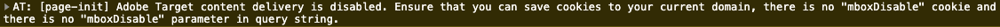

# Caricare e attivare una chiamata Target {#load-fire-target}

Scopri come caricare, trasmettere parametri alla richiesta di pagina e attivare una chiamata Target dalla pagina del sito utilizzando una regola di tag. Le informazioni della pagina web vengono recuperate e trasmesse come parametri utilizzando Adobe Client Data Layer, che consente di raccogliere e archiviare dati sull’esperienza dei visitatori in una pagina web e quindi di semplificare l’accesso a tali dati.

>[!VIDEO](https://video.tv.adobe.com/v/329002?quality=12&learn=on&captions=ita)

## Regola di caricamento pagina

Adobe Client Data Layer è un livello dati basato su eventi. Quando il livello dati della pagina AEM viene caricato, attiva un evento `cmp:show`. Nel video, la regola `tags Library Loaded` viene richiamata utilizzando un evento personalizzato. Di seguito sono riportati i frammenti di codice utilizzati nel video per l’evento personalizzato e per gli elementi dati.

### Evento pagina visualizzata personalizzata{#page-event}


Nella proprietà tags, aggiungi un nuovo **evento** alla **regola**

+ __Estensione:__ Core
+ __Tipo evento:__ Codice personalizzato
+ __Nome:__ Gestore eventi di visualizzazione pagina (o qualcosa di descrittivo)

Tocca il pulsante __Apri editor__ e incolla il seguente frammento di codice. Il codice __deve__ essere aggiunto alla __Configurazione evento__ e a una successiva __Azione__.

```javascript
// Define the event handler function
var pageShownEventHandler = function(coreComponentEvent) {

    // Check to ensure event trigger via AEM Core Components is shaped correctly
    if (coreComponentEvent.hasOwnProperty("eventInfo") && 
        coreComponentEvent.eventInfo.hasOwnProperty("path")) {
    
        // Debug the AEM Component path the show event is associated with
        console.debug("cmp:show event: " + coreComponentEvent.eventInfo.path);

        // Create the tags Event object
        var launchEvent = {
            // Include the ID of the AEM Component that triggered the event
            id: coreComponentEvent.eventInfo.path,
            // Get the state of the AEM Component that triggered the event           
            component: window.adobeDataLayer.getState(coreComponentEvent.eventInfo.path)
        };

        // Trigger the tags Rule, passing in the new `event` object
        // the `event` obj can now be referenced by the reserved name `event` by other tags data elements
        // i.e `event.component['someKey']`
        trigger(launchEvent);
   }
}

// With the AEM Core Component event handler, that proxies the event and relevant information to Data Collection, defined above...

// Initialize the adobeDataLayer global object in a safe way
window.adobeDataLayer = window.adobeDataLayer || [];

// Push the event custom listener onto the Adobe Data Layer
window.adobeDataLayer.push(function (dataLayer) {
   // Add event listener for the `cmp:show` event, and the custom `pageShownEventHandler` function as the callback
   dataLayer.addEventListener("cmp:show", pageShownEventHandler);
});
```

Una funzione personalizzata definisce `pageShownEventHandler` e ascolta gli eventi emessi dai Componenti core di AEM, ricava le informazioni rilevanti dal Componente core, le inserisce in un oggetto evento e attiva l&#39;evento tag Event con le informazioni derivate dell&#39;evento al suo payload.

La regola dei tag viene attivata utilizzando la funzione `trigger(...)` dei tag, che è __only__ disponibile nella definizione dello snippet di codice personalizzato dell&#39;evento di una regola.

La funzione `trigger(...)` considera un oggetto evento come parametro che a sua volta è esposto in Tag elementi dati, con un altro nome riservato nei tag denominati `event`. Gli elementi dati nei tag ora possono fare riferimento ai dati di questo oggetto evento dall&#39;oggetto `event` utilizzando una sintassi come `event.component['someKey']`.

Se `trigger(...)` viene utilizzato al di fuori del contesto del tipo di evento Codice personalizzato di un evento (ad esempio, in un&#39;azione ), l&#39;errore di JavaScript `trigger is undefined` viene generato nel sito Web integrato con la proprietà tags.


### Elementi dati


Gli elementi dati dei tag associano i dati dell&#39;oggetto evento [attivato nell&#39;evento Page Shown personalizzato](#page-event) alle variabili disponibili in Adobe Target tramite il tipo di elemento dati Codice personalizzato dell&#39;estensione Core.

#### Elemento dati ID pagina

```
if (event && event.id) {
    return event.id;
}
```

Questo codice restituisce l’ID univoco generato del componente core.


### Elemento dati percorso pagina

```
if (event && event.component && event.component.hasOwnProperty('repo:path')) {
    return event.component['repo:path'];
}
```

Questo codice restituisce il percorso della pagina AEM.


### Elemento dati titolo pagina

```
if (event && event.component && event.component.hasOwnProperty('dc:title')) {
    return event.component['dc:title'];
}
```

Questo codice restituisce il titolo della pagina AEM.


## Risoluzione dei problemi

### Perché le mie mbox non vengono lanciate sulle mie pagine web?

#### Messaggio di errore quando il cookie mboxDisable non è impostato



```
> AT: [page-init] Adobe Target content delivery is disabled. Ensure that you can save cookies to your current domain, there is no "mboxDisable" cookie and there is no "mboxDisable" parameter in the query string.
```

#### Soluzione

I clienti di Target utilizzano talvolta istanze basate su cloud con Target per test o semplici prove di concetto. Questi domini e molti altri sono parte dell&#39;elenco dei suffissi pubblici .
I browser moderni non salvano i cookie se si utilizzano questi domini, a meno che non si personalizzi l&#39;impostazione `cookieDomain` utilizzando `targetGlobalSettings()`.

```
window.targetGlobalSettings = {  
   cookieDomain: 'your-domain' //set the cookie directly on this subdomain, for example: 'publish-p1234-e5678.adobeaemcloud.com'
};
```

## Passaggi successivi

+ [Esporta frammento esperienza in Adobe Target](./export-experience-fragment-target.md)

## Collegamenti di supporto

+ [Documentazione di Adobe Client Data Layer](https://github.com/adobe/adobe-client-data-layer/wiki)
+ [Debugger Adobe Experience Cloud - Chrome](https://chrome.google.com/webstore/detail/adobe-experience-platform/bfnnokhpnncpkdmbokanobigaccjkpob)
+ [Utilizzo della documentazione di Adobe Client Data Layer e Componenti core](https://experienceleague.adobe.com/docs/experience-manager-core-components/using/developing/data-layer/overview.html?lang=it)
+ [Introduzione ad Adobe Experience Platform Debugger](https://experienceleague.adobe.com/docs/platform-learn/data-collection/debugger/overview.html?lang=it)
