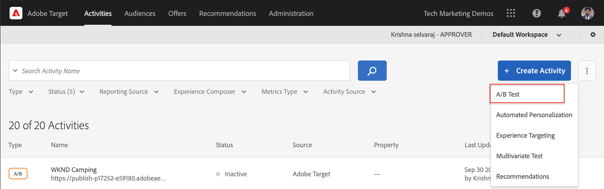

# Personalizzazione mediante Visual Experience Composer {#personalization-vec}

Scopri come creare un’attività di test A/B di Target utilizzando il Compositore esperienza visivo.

## Prerequisiti

Per utilizzare il Compositore esperienza visivo su un sito web dell’AEM, è necessario completare la seguente configurazione:

1. [Aggiungere Adobe Target al sito Web AEM](./add-target-launch-extension.md)
1. [Attivare una chiamata Adobe Target da Launch](./load-and-fire-target.md)

## Panoramica dello scenario

Nella home page del sito WKND, sotto forma di schede informative, vengono visualizzate le attività locali o le operazioni migliori da eseguire in una città. In qualità di addetto al marketing, ti è stato assegnato il compito di modificare la home page, apportando modifiche testuali al teaser della sezione avventura e comprendendo in che modo migliora la conversione.

## Passaggi per creare un test A/B utilizzando il Compositore esperienza visivo

1. Accedi a [Adobe Experience Cloud](https://experience.adobe.com/), toccare __Target__, passare alla __Attività__ scheda

   + Se non vede __Target__ sul dashboard Experience Cloud, assicurati che nel selettore organizzazione in alto a destra sia selezionata l’organizzazione di Adobe corretta e che all’utente sia stato concesso l’accesso a Target in [Adobe Admin Console](https://adminconsole.adobe.com/).

1. Clic **Crea attività** e quindi scegliere **Test A/B** attività

   

1. Seleziona la **Compositore esperienza visivo** , fornire l&#39;URL attività e quindi fare clic su **Successivo**

   

1. Dopo aver creato un’attività, il Compositore esperienza visivo visualizza due schede a sinistra: *Esperienza A* e *Esperienza B*. Seleziona un&#39;esperienza dall&#39;elenco. È possibile aggiungere nuove esperienze all’elenco utilizzando **Aggiungi esperienza** pulsante.

   

1. Seleziona un&#39;immagine o un testo nella pagina per iniziare ad apportare modifiche o puoi utilizzare l&#39;editor di codice per scegliere un elemento HTML.

   

1. Cambia il testo da *Campeggio a Western Australia* a *Le avventure dell&#39;Australia*. In Modifiche viene visualizzato un elenco delle modifiche aggiunte a un’esperienza. Puoi fare clic sull’elemento modificato e modificarlo per visualizzarne il selettore CSS e il nuovo contenuto aggiunto.

   

1. Rinomina *Esperienza A* a *Avventura*
1. Allo stesso modo, aggiorna il testo su *Esperienza B* da *Campeggio a Western Australia* a *Esplora la natura selvaggia australiana*.

   

1. Clic **Successivo** per passare al Targeting e mantenere un’allocazione manuale del traffico di 50-50 tra le due esperienze.

   

1. Per Obiettivi e impostazioni, scegli l’origine per la generazione di rapporti come Adobe Target e seleziona la metrica Obiettivo come Conversione con un’azione di visualizzazione della pagina.

   

1. Immetti un nome per l&#39;attività e Salva.
1. Attiva l&#39;attività salvata per inviare in diretta le modifiche.

   

1. Apri la pagina del sito (URL attività dal passaggio 3) in una nuova scheda e dovresti essere in grado di visualizzare una delle esperienze (Avventura o Esplora) dall’attività di test A/B.

   

## Riepilogo

In questo capitolo, un addetto al marketing può creare un’esperienza utilizzando il Compositore esperienza visivo trascinando, scambiando e modificando il layout e il contenuto di una pagina web senza modificare il codice per eseguire un test.

## Collegamenti di supporto

+ [Adobe Experience Cloud Debugger - Chrome](https://chrome.google.com/webstore/detail/adobe-experience-platform/bfnnokhpnncpkdmbokanobigaccjkpob)
+ [Adobe Experience Cloud Debugger - Firefox](https://addons.mozilla.org/en-US/firefox/addon/adobe-experience-platform-dbg/)
