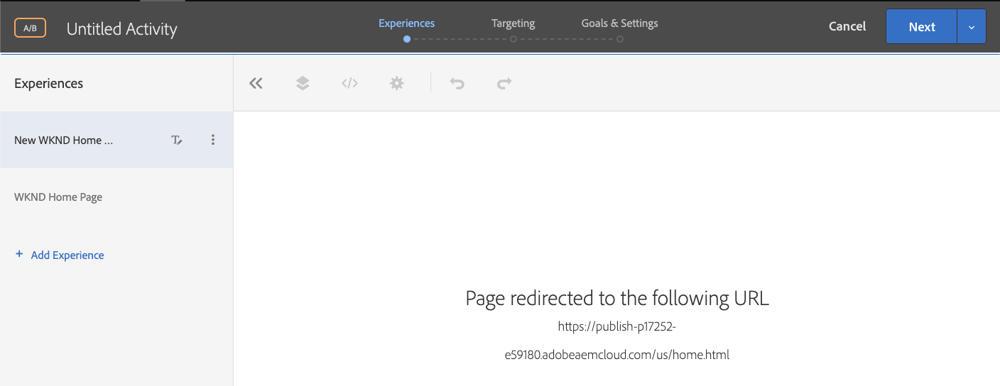

# Personalizzazione dell’esperienza della pagina web completa {#personalization-fpe}

Scopri come creare un’attività per reindirizzare le pagine del sito ospitate su AEM a una nuova pagina utilizzando Adobe Target.

## Prerequisiti

Per personalizzare pagine intere di un sito web AEM, è necessario completare la seguente configurazione:

1. [Aggiungere Adobe Target al sito Web AEM](./add-target-launch-extension.md)
1. [Attivare una chiamata Adobe Target da Launch](./load-and-fire-target.md)

## Panoramica dello scenario

Il sito WKND ha riprogettato la propria home page e desidera reindirizzare i visitatori della home page corrente alla nuova home page. Allo stesso tempo, scopri anche come la home page riprogettata consente di migliorare il coinvolgimento degli utenti e i ricavi. In qualità di addetto al marketing, ti è stato assegnato il compito di creare un’attività per reindirizzare i visitatori alla nuova home page. Esplora la home page del sito WKND e scopri come creare un’attività utilizzando Adobe Target.

## Passaggi per creare un test A/B utilizzando il Compositore esperienza visivo

1. Accedi ad Adobe Target e passa alla scheda Attività
1. Clic **Crea attività** e quindi scegliere **Test A/B** attività

   

1. Seleziona la **Compositore esperienza visivo** , fornire l&#39;URL attività e quindi fare clic su **Successivo**

   

1. Dopo aver creato una nuova attività, il Compositore esperienza visivo visualizza due schede a sinistra: *Esperienza A* e *Esperienza B*. Seleziona un&#39;esperienza dall&#39;elenco. È possibile aggiungere nuove esperienze all’elenco utilizzando **Aggiungi esperienza** pulsante.

   

1. Visualizza le opzioni disponibili per l&#39;Esperienza A, quindi seleziona la **Reindirizza a URL** e fornire un URL per la nuova home page del sito WKND.

   

1. Rinomina *Esperienza A* a *Nuova home page WKND* e *Esperienza B* a *Home page WKND*

   

1. Clic **Successivo** per passare al Targeting e mantenere un’allocazione manuale del traffico di 50-50 tra le due esperienze.

   

1. Per Obiettivi e impostazioni, scegli l’origine per la generazione di rapporti come Adobe Target e seleziona la metrica Obiettivo come Conversione con un’azione di visualizzazione della pagina.

   

1. Immetti un nome per l&#39;attività e Salva.
1. Attiva l&#39;attività salvata per inviare in diretta le modifiche.

   

1. Apri la pagina del sito (URL attività dal passaggio 3) in una nuova scheda e dovresti essere in grado di visualizzare una delle esperienze (home page WKND o nuova home page WKND) dalla nostra attività di test A/B. `us/en.html` reindirizza a `us/home.html`.

   

## Riepilogo

In qualità di addetto al marketing, hai potuto creare un’attività per reindirizzare le pagine del sito ospitate su AEM a una nuova pagina utilizzando Adobe Target.

## Collegamenti di supporto

* [Adobe Experience Cloud Debugger - Chrome](https://chrome.google.com/webstore/detail/adobe-experience-cloud-de/ocdmogmohccmeicdhlhhgepeaijenapj)
* [Adobe Experience Cloud Debugger - Firefox](https://addons.mozilla.org/en-US/firefox/addon/adobe-experience-platform-dbg/)
