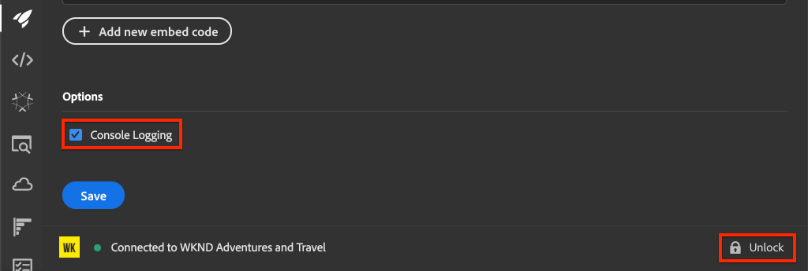
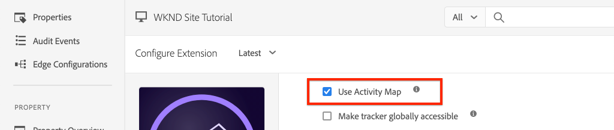
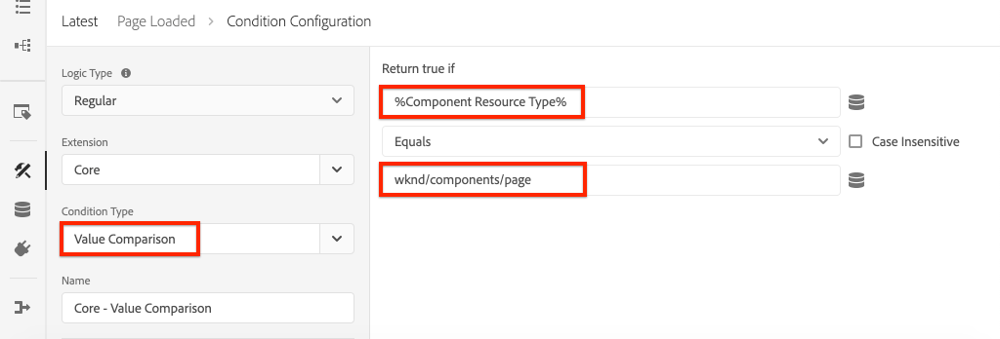
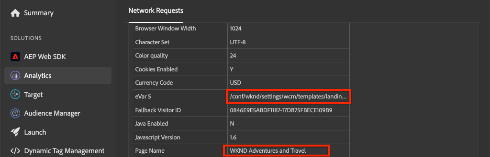

# Integrare AEM Sites e Adobe Analytics

Scopri come integrare AEM Sites e Adobe Analytics con l’estensione tag Adobe Analytics, utilizzando le funzioni integrate di [Adobe Client Data Layer con componenti core AEM](https://experienceleague.adobe.com/docs/experience-manager-core-components/using/developing/data-layer/overview.html?lang=it) per raccogliere dati su una pagina in Adobe Experience Manager Sites. [Tag nell’Experience Platform](https://experienceleague.adobe.com/docs/experience-platform/tags/home.html) e [Estensione Adobe Analytics](https://experienceleague.adobe.com/docs/experience-platform/tags/extensions/client/analytics/overview.html) vengono utilizzati per creare regole per inviare dati di pagina ad Adobe Analytics.

## Cosa intendi creare {#what-build}


In questa esercitazione, stai per attivare una regola di tag basata su un evento da Adobe Client Data Layer. Inoltre, aggiungi le condizioni relative al momento in cui la regola deve essere attivata, quindi invia la **Nome pagina** e **Modello pagina** valori di una pagina AEM in Adobe Analytics.

### Obiettivi {#objective}

1. Crea una regola basata su eventi nella proprietà tag che acquisisce le modifiche dal livello dati
1. Mappare le proprietà del livello dati della pagina agli elementi dati nella proprietà tag
1. Raccogliere e inviare dati di pagina ad Adobe Analytics utilizzando il beacon di visualizzazione della pagina

## Prerequisiti

Sono necessari i seguenti elementi:

* **Tag, proprietà** nell’Experience Platform
* **Adobe Analytics** ID suite di rapporti test/dev e server di tracciamento. Consulta la seguente documentazione per [creazione di una suite di rapporti](https://experienceleague.adobe.com/docs/analytics/admin/admin-tools/manage-report-suites/c-new-report-suite/new-report-suite.html).
* [Debugger Experienci Platform](https://experienceleague.adobe.com/docs/platform-learn/data-collection/debugger/overview.html) estensione del browser. Schermate di questo tutorial acquisite dal browser Chrome.
* (Facoltativo) Sito AEM con [Adobe Client Data Layer abilitato](https://experienceleague.adobe.com/docs/experience-manager-core-components/using/developing/data-layer/overview.html#installation-activation). Questa esercitazione utilizza l&#39;interfaccia pubblica [WKND](https://wknd.site/us/en.html) ma puoi utilizzare il tuo sito.

>[!NOTE]
>
> Hai bisogno di assistenza per integrare la proprietà tag e il sito AEM? [Guarda questa serie di video](../experience-platform/data-collection/tags/overview.md).

## Cambia ambiente tag per sito WKND

Il [WKND](https://wknd.site/us/en.html) è un sito pubblico basato su [un progetto open-source](https://github.com/adobe/aem-guides-wknd) progettati come riferimento e [esercitazione](https://experienceleague.adobe.com/docs/experience-manager-learn/getting-started-wknd-tutorial-develop/overview.html?lang=it) per l&#39;attuazione dell&#39;AEM.

Invece di configurare un ambiente AEM e installare la base di codice WKND, puoi utilizzare il debugger di Experienci Platform per: **switch** il live [Sito WKND](https://wknd.site/us/en.html) a *tuo* proprietà tag. Tuttavia, puoi utilizzare il tuo sito AEM se è già presente il [Adobe Client Data Layer abilitato](https://experienceleague.adobe.com/docs/experience-manager-core-components/using/developing/data-layer/overview.html#installation-activation).

1. Accedi a Experienci Platform e [creare una proprietà Tag](https://experienceleague.adobe.com/docs/platform-learn/implement-in-websites/configure-tags/create-a-property.html) (se non lo hai già fatto).
1. Assicurati che un tag iniziale JavaScript [la libreria è stata creata](https://experienceleague.adobe.com/docs/experience-platform/tags/publish/libraries.html#create-a-library) e promosso al tag [ambiente](https://experienceleague.adobe.com/docs/experience-platform/tags/publish/environments/environments.html?lang=it).
1. Copia il codice di incorporamento JavaScript dall’ambiente di tag in cui è stata pubblicata la libreria.

   

1. Nel browser, apri una nuova scheda e passa a [Sito WKND](https://wknd.site/us/en.html)
1. Apri l’estensione del browser Experienci Platform Debugger

   

1. Accedi a **Tag Experience Platform** > **Configurazione** e sotto **Codici da incorporare inseriti** sostituisci il codice di incorporamento esistente con *tuo* codice da incorporare copiato dal passaggio 3.

   

1. Abilita **Registrazione console** e **Blocca** il debugger nella scheda WKND.

   

## Verifica Adobe Client Data Layer nel sito WKND

Il [Progetto di riferimento WKND](https://github.com/adobe/aem-guides-wknd) è stato creato con i Componenti core AEM e dispone di [Adobe Client Data Layer abilitato](https://experienceleague.adobe.com/docs/experience-manager-core-components/using/developing/data-layer/overview.html#installation-activation) per impostazione predefinita. Successivamente, verifica che Adobe Client Data Layer sia abilitato.

1. Accedi a [Sito WKND](https://wknd.site/us/en.html).
1. Apri gli strumenti di sviluppo del browser e passa a **Console**. Esegui il comando seguente:

   ```js
   adobeDataLayer.getState();
   ```

   Il codice riportato sopra restituisce lo stato corrente di Adobe Client Data Layer.

   

1. Espandi la risposta e controlla `page` voce. Dovresti visualizzare uno schema di dati come il seguente:

   ```json
   page-2eee4f8914:
       @type: "wknd/components/page"
       dc:description: WKND is a collective of outdoors, music, crafts, adventure sports, and travel enthusiasts that want to share our experiences, connections, and expertise with the world.
       dc:title: "WKND Adventures and Travel"
       repo:modifyDate: "2020-08-31T21:02:21Z"
       repo:path: "/content/wknd/us/en.html"
       xdm:language: "en-US"
       xdm:tags: ["Attract"]
       xdm:template: "/conf/wknd/settings/wcm/templates/landing-page-template"
   ```

   Per inviare i dati di pagina ad Adobe Analytics, utilizziamo le proprietà standard come `dc:title`, `xdm:language`, e `xdm:template` del livello dati.

   Per ulteriori informazioni, consulta [Schema pagina](https://experienceleague.adobe.com/docs/experience-manager-core-components/using/developing/data-layer/overview.html#page) dagli schemi di dati dei Componenti core.

   >[!NOTE]
   >
   > Se non vedi il `adobeDataLayer` Oggetto JavaScript? Assicurati che [Adobe Client Data Layer è stato abilitato](https://experienceleague.adobe.com/docs/experience-manager-core-components/using/developing/data-layer/overview.html#installation-activation) sul tuo sito.

## Creare una regola Page Loaded

Adobe Client Data Layer è un **basato su eventi** livello dati. Quando il livello dati della pagina AEM viene caricato, attiva un `cmp:show` evento. Crea una regola che viene attivata quando `cmp:show` viene attivato dal livello dati della pagina.

1. Passa a Experienci Platform e accedi alla proprietà tag integrata con il sito AEM.
1. Accedi a **Regole** nell’interfaccia utente della proprietà Tag, quindi fai clic su **Crea nuova regola**.

   

1. Denomina la regola **Pagina caricata**.
1. In **Eventi** sottosezione, fai clic su **Aggiungi** per aprire **Configurazione evento** procedura guidata.
1. Per **Tipo di evento** campo, seleziona **Codice personalizzato**.

   

1. Clic **Apri editor** nel pannello principale e immetti il seguente frammento di codice:

   ```js
   var pageShownEventHandler = function(evt) {
      // defensive coding to avoid a null pointer exception
      if(evt.hasOwnProperty("eventInfo") && evt.eventInfo.hasOwnProperty("path")) {
         //trigger the Tag Rule and pass event
         console.log("cmp:show event: " + evt.eventInfo.path);
         var event = {
            //include the path of the component that triggered the event
            path: evt.eventInfo.path,
            //get the state of the component that triggered the event
            component: window.adobeDataLayer.getState(evt.eventInfo.path)
         };
   
         //Trigger the Tag Rule, passing in the new `event` object
         // the `event` obj can now be referenced by the reserved name `event` by other Tag data elements
         // i.e `event.component['someKey']`
         trigger(event);
      }
   }
   
   //set the namespace to avoid a potential race condition
   window.adobeDataLayer = window.adobeDataLayer || [];
   //push the event listener for cmp:show into the data layer
   window.adobeDataLayer.push(function (dl) {
      //add event listener for `cmp:show` and callback to the `pageShownEventHandler` function
      dl.addEventListener("cmp:show", pageShownEventHandler);
   });
   ```

   Lo snippet di codice sopra riportato aggiunge un listener di eventi di [push di una funzione](https://github.com/adobe/adobe-client-data-layer/wiki#pushing-a-function) nel livello dati. Quando `cmp:show` viene attivato l&#39;evento `pageShownEventHandler` viene chiamata la funzione. In questa funzione, vengono aggiunti alcuni controlli di integrità e una nuova `event` è costruito con il più recente [stato del livello dati](https://github.com/adobe/adobe-client-data-layer/wiki#getstate) per il componente che ha attivato l’evento.

   Infine, il `trigger(event)` viene chiamata la funzione. Il `trigger()` è un nome riservato nella proprietà tag e **trigger** la regola. Il `event` L&#39;oggetto viene passato come parametro che a sua volta viene esposto da un altro nome riservato nella proprietà tag. Gli elementi dati nella proprietà tag ora possono fare riferimento a varie proprietà utilizzando uno snippet di codice come `event.component['someKey']`.

1. Salva le modifiche.
1. Successivo sotto **Azioni** click **Aggiungi** per aprire **Configurazione azione** procedura guidata.
1. Per **Tipo di azione** campo, scegli **Codice personalizzato**.

   

1. Clic **Apri editor** nel pannello principale e immetti il seguente frammento di codice:

   ```js
   console.log("Page Loaded ");
   console.log("Page name: " + event.component['dc:title']);
   console.log("Page type: " + event.component['@type']);
   console.log("Page template: " + event.component['xdm:template']);
   ```

   Il `event` l&#39;oggetto viene passato dal `trigger()` metodo chiamato nell&#39;evento personalizzato. Ecco, il `component` è la pagina corrente derivata dal livello dati `getState` nell’evento personalizzato.

1. Salva le modifiche ed esegui una [build](https://experienceleague.adobe.com/docs/experience-platform/tags/publish/builds.html) nella proprietà tag per promuovere il codice in [ambiente](https://experienceleague.adobe.com/docs/experience-platform/tags/publish/environments/environments.html?lang=it) utilizzati nel sito AEM.

   >[!NOTE]
   >
   > Può essere utile utilizzare il [Adobe Experience Platform Debugger](https://experienceleague.adobe.com/docs/platform-learn/data-collection/debugger/overview.html) per convertire il codice di incorporamento in una **Sviluppo** ambiente.

1. Vai al tuo sito AEM e apri gli strumenti per sviluppatori per visualizzare la console. Aggiorna la pagina per verificare che i messaggi della console siano stati registrati:


## Creare elementi dati

Quindi crea diversi elementi dati per acquisire valori diversi dal livello dati client di Adobe. Come mostrato nell’esercizio precedente, è possibile accedere alle proprietà del livello dati direttamente tramite il codice personalizzato. Il vantaggio di utilizzare gli elementi dati è che possono essere riutilizzati in più regole di tag.

Gli elementi dati sono mappati su `@type`, `dc:title`, e `xdm:template` proprietà.

### Tipo risorsa componente

1. Passa a Experienci Platform e accedi alla proprietà tag integrata con il sito AEM.
1. Accedi a **Elementi dati** e fai clic su **Creare un nuovo elemento dati**.
1. Per **Nome** , immettere il **Tipo risorsa componente**.
1. Per **Tipo di elemento dati** campo, seleziona **Codice personalizzato**.

   

1. Clic **Apri editor** e immetti quanto segue nell’editor di codice personalizzato:

   ```js
   if(event && event.component && event.component.hasOwnProperty('@type')) {
       return event.component['@type'];
   }
   ```

1. Salva le modifiche.

   >[!NOTE]
   >
   > Ricorda che `event` l&#39;oggetto viene reso disponibile e con ambito in base all&#39;evento che ha attivato **Regola** nella proprietà tag. Il valore di un elemento dati non viene impostato finché l’elemento dati non è *con riferimento* all&#39;interno di una regola. Pertanto, è sicuro utilizzare questo elemento dati all’interno di una regola come **Pagina caricata** regola creata nel passaggio precedente *ma* non è sicuro utilizzarlo in altri contesti.

### Nome pagina

1. Clic **Aggiungi elemento dati** pulsante
1. Per **Nome** campo, immetti **Nome pagina**.
1. Per **Tipo di elemento dati** campo, seleziona **Codice personalizzato**.
1. Clic **Apri editor** e immetti quanto segue nell’editor di codice personalizzato:

   ```js
   if(event && event.component && event.component.hasOwnProperty('dc:title')) {
       return event.component['dc:title'];
   }
   ```

1. Salva le modifiche.

### Modello della pagina

1. Fai clic su **Aggiungi elemento dati** pulsante
1. Per **Nome** campo, immetti **Modello pagina**.
1. Per **Tipo di elemento dati** campo, seleziona **Codice personalizzato**.
1. Clic **Apri editor** e immetti quanto segue nell’editor di codice personalizzato:

   ```js
   if(event && event.component && event.component.hasOwnProperty('xdm:template')) {
       return event.component['xdm:template'];
   }
   ```

1. Salva le modifiche.

1. Ora dovrebbero essere presenti tre elementi dati come parte della regola:

   

## Aggiungere l’estensione Analytics

Quindi aggiungi l’estensione Analytics alla proprietà tag per inviare dati a una suite di rapporti.

1. Passa a Experienci Platform e accedi alla proprietà tag integrata con il sito AEM.
1. Vai a **Estensioni** > **Catalogo**
1. Individua il **Adobe Analytics** e fai clic su **Installa**

   

1. Sotto **Gestione libreria** > **Suite di rapporti**, immetti gli ID suite di rapporti che desideri utilizzare con ogni ambiente di tag.

   

   >[!NOTE]
   >
   > In questa esercitazione puoi utilizzare una suite di rapporti per tutti gli ambienti, ma in uno scenario reale vorresti utilizzare suite di rapporti separate, come illustrato nell’immagine seguente

   >[!TIP]
   >
   >È consigliabile utilizzare *Opzione Gestisci la libreria per me* come l’impostazione Library Management, in quanto consente di mantenere molto più facilmente `AppMeasurement.js` libreria aggiornata.

1. Seleziona la casella per abilitare **Usa Activity Map**.

   

1. Sotto **Generale** > **Server di tracciamento**, immetti il server di tracciamento, ad esempio, `tmd.sc.omtrdc.net`. Immetti Server di tracciamento SSL se il sito supporta `https://`

   

1. Clic **Salva** per salvare le modifiche.

## Aggiungere una condizione alla regola Page Loaded

Quindi, aggiorna **Pagina caricata** regola per utilizzare il **Tipo risorsa componente** per garantire che la regola venga attivata solo quando `cmp:show` l&#39;evento è per **Pagina**. Altri componenti possono attivare `cmp:show` ad esempio, il componente Carosello viene attivato quando cambiano le diapositive. Pertanto, è importante aggiungere una condizione per questa regola.

1. Nell’interfaccia utente della proprietà Tag, passa a **Pagina caricata** regola creata in precedenza.
1. Sotto **Condizioni** click **Aggiungi** per aprire **Configurazione condizione** procedura guidata.
1. Per **Tipo di condizione** campo, seleziona **Value Comparison** opzione.
1. Imposta il primo valore nel campo modulo su `%Component Resource Type%`. È possibile utilizzare l’icona Elemento dati  per selezionare **Tipo risorsa componente** elemento dati. Lascia il comparatore impostato su `Equals`.
1. Imposta il secondo valore su `wknd/components/page`.

   

   >[!NOTE]
   >
   > È possibile aggiungere questa condizione all’interno della funzione di codice personalizzato che ascolta per `cmp:show` creato in precedenza nell&#39;esercitazione. Tuttavia, aggiungerla all’interno dell’interfaccia utente offre maggiore visibilità ad altri utenti che potrebbero dover apportare modifiche alla regola. In più, possiamo utilizzare il nostro elemento dati!

1. Salva le modifiche.

## Impostare le variabili di Analytics e attivare il beacon Visualizzazione pagina

Attualmente il **Pagina caricata** la regola restituisce semplicemente un’istruzione della console. Quindi, utilizza gli elementi dati e l’estensione Analytics per impostare le variabili Analytics come **azione** nel **Pagina caricata** regola. Abbiamo inoltre impostato un&#39;azione aggiuntiva per attivare **Beacon visualizzazione pagina** e invia i dati raccolti ad Adobe Analytics.

1. Nella regola Page Loaded: **rimuovere** il **Core - Custom Code** azione (istruzioni della console):

   

1. In Azioni, sottosezione, fai clic su **Aggiungi** per aggiungere una nuova azione.

1. Imposta il **Estensione** digita in **Adobe Analytics** e imposta **Tipo di azione** a  **Imposta variabili**

   

1. Nel pannello principale, seleziona una delle opzioni **eVar** e impostato come valore dell’elemento dati **Modello pagina**. Utilizzare l’icona Elementi dati  per selezionare **Modello pagina** elemento.

   

1. Scorri verso il basso, sotto **Impostazioni aggiuntive** set **Nome pagina** all’elemento dati **Nome pagina**:

   

1. Salva le modifiche.

1. Quindi, aggiungi un’azione aggiuntiva a destra del **Adobe Analytics - Imposta variabili** toccando il **più** icona:

   

1. Imposta il **Estensione** digita in **Adobe Analytics** e imposta **Tipo di azione** a  **Invia beacon**. Poiché questa azione è considerata una visualizzazione di pagina, lascia impostato il tracciamento predefinito su **`s.t()`**.

   

1. Salva le modifiche. Il **Pagina caricata** la regola ora deve avere la seguente configurazione:

   

   * **1.** Ascolta la `cmp:show` evento.
   * **2.** Verifica che l&#39;evento sia stato attivato da una pagina.
   * **3.** Imposta variabili di Analytics per **Nome pagina** e **Modello pagina**
   * **4.** Inviare il beacon Vista pagina di Analytics

1. Salva tutte le modifiche e crea la libreria tag, passando all’ambiente appropriato.

## Convalidare la chiamata del beacon Visualizzazione pagina e di Analytics

Ora che il **Pagina caricata** La regola invia il beacon Analytics. Dovresti essere in grado di visualizzare le variabili di tracciamento Analytics utilizzando Experienci Platform Debugger.

1. Apri [Sito WKND](https://wknd.site/us/en.html) nel browser.
1. Fai clic sull’icona Debugger  per aprire Experienci Platform Debugger.
1. Assicurati che Debugger mappi la proprietà tag a *tuo* Ambiente di sviluppo, come descritto in precedenza e **Registrazione console** è selezionato.
1. Apri il menu Analytics e verifica che la suite di rapporti sia impostata su *tuo* suite di rapporti. Compilare anche il Nome pagina:

   

1. Scorri verso il basso ed espandi **Richieste di rete**. Dovresti essere in grado di trovare **evar** impostato per **Modello pagina**:

   

1. Torna al browser e apri la console per sviluppatori. Fai clic sul pulsante **Carosello** nella parte superiore della pagina.

   

1. Osserva nella console del browser l’istruzione della console:

   

   Questo perché il carosello attiva una `cmp:show` evento *ma* a causa del nostro assegno **Tipo risorsa componente**, non viene attivato alcun evento.

   >[!NOTE]
   >
   > Se non trovi alcun registro della console, assicurati che **Registrazione console** è controllato in **Tag Experience Platform** in Experienci Platform Debugger.

1. Passa a una pagina di articolo come [Australia occidentale](https://wknd.site/us/en/magazine/western-australia.html). Osserva che il Nome pagina e il Tipo di modello cambiano.

## Congratulazioni.

Hai appena utilizzato Adobe Client Data Layer e i tag basati sull’evento nell’Experience Platform per raccogliere i dati della pagina di dati da un sito AEM e inviarli ad Adobe Analytics.

### Passaggi successivi

Consulta il seguente tutorial per scoprire come utilizzare il livello dati client di Adobe basato su eventi per [tracciare i clic di componenti specifici su un sito Adobe Experience Manager](track-clicked-component.md).
