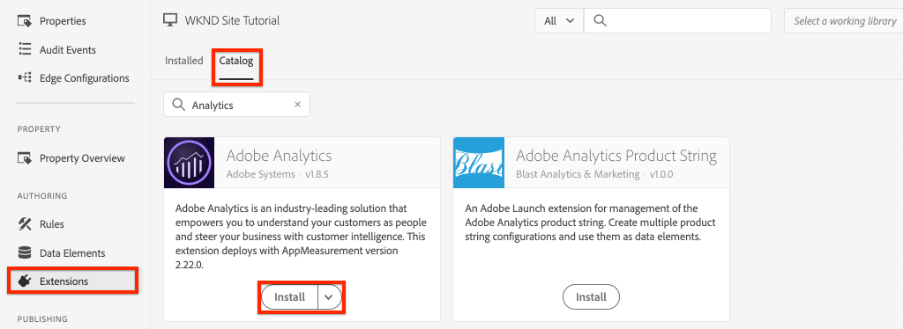
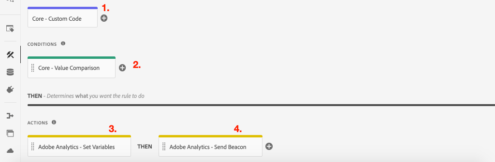

# Raccolta di dati di pagina con  Adobe Analytics

Scoprite come utilizzare le funzionalità integrate del [ livello dati client Adobe con componenti core AEM](https://docs.adobe.com/content/help/it-IT/experience-manager-core-components/using/developing/data-layer/overview.html) per raccogliere i dati su una pagina  Adobe Experience Manager Sites. [ Experience Platform ](https://www.adobe.com/experience-platform/launch.html) Avvio e l&#39; [ ](https://docs.adobe.com/content/help/en/launch/using/extensions-ref/adobe-extension/analytics-extension/overview.html) estensione Adobe Analytics verranno utilizzati per creare regole per l&#39;invio dei dati di pagina  Adobe Analytics.

## Cosa verrà creato


In questa esercitazione verrà attivata una regola Launch basata su un evento del livello dati client del Adobe , verranno aggiunte le condizioni per l&#39;attivazione della regola e verrà inviato **Page Name** e **Page Template** di una AEM Page a  Adobe Analytics.

### Obiettivi {#objective}

1. Creare una regola basata su eventi in Launch in base alle modifiche apportate al livello dati
1. Mappatura delle proprietà del livello dati della pagina su Elementi dati in Launch
1. Raccogli i dati della pagina e invia a  Adobe Analytics con il beacon di visualizzazione della pagina

## Prerequisiti

Sono necessari i seguenti requisiti:

* **Experience Platform** LaunchProperty
* **ID suite di rapporti** Analytics/dev di Adobe e server di tracciamento. Consulta la seguente documentazione per [creare una nuova suite di rapporti](https://docs.adobe.com/content/help/en/analytics/admin/manage-report-suites/new-report-suite/new-report-suite.html).
* [ estensione ](https://docs.adobe.com/content/help/en/platform-learn/tutorials/data-ingestion/web-sdk/introduction-to-the-experience-platform-debugger.html) del browser Experience Platform Debuggert. Screenshot in questa esercitazione acquisita dal browser Chrome.
* (Facoltativo) AEM Sito con [ Adobe Client Data Layer abilitato](https://docs.adobe.com/content/help/en/experience-manager-core-components/using/developing/data-layer/overview.html#installation-activation). Questa esercitazione utilizzerà il sito pubblico [https://wknd.site/us/en.html](https://wknd.site/us/en.html) ma è possibile utilizzare il proprio sito.

>[!NOTE]
>
> Hai bisogno di aiuto per integrare Launch e il tuo sito AEM? [Guardate questa serie](../experience-platform-launch/overview.md) video.

## Cambiare gli ambienti di lancio per il sito WKND

[https://wknd.](https://wknd.site) siteè un sito rivolto al pubblico basato su  [un ](https://github.com/adobe/aem-guides-wknd) progetto open source progettato come riferimento ed  [](https://docs.adobe.com/content/help/en/experience-manager-learn/getting-started-wknd-tutorial-develop/overview.html) esercitazione per AEM implementazioni.

Anziché configurare un ambiente AEM e installare la base di codice WKND, è possibile utilizzare il debugger del Experience Platform  per passare da **a** alla [https://wknd.site/](https://wknd.site/) live *la proprietà* Launch. Naturalmente è possibile utilizzare il proprio sito AEM se il livello di dati del client del Adobe [ è già abilitato](https://docs.adobe.com/content/help/en/experience-manager-core-components/using/developing/data-layer/overview.html#installation-activation)

1. Accedete al Experience Platform Launch e [create una proprietà Launch](https://docs.adobe.com/content/help/en/core-services-learn/implementing-in-websites-with-launch/configure-launch/launch.html) (se non lo avete già fatto).
1. Assicurarsi che sia stato creato un lancio iniziale [libreria ](https://docs.adobe.com/content/help/en/launch/using/reference/publish/libraries.html#create-a-library) e promosso a un [ambiente ](https://docs.adobe.com/content/help/en/launch/using/reference/publish/environments.html) Launch.
1. Copiate il codice da incorporare di Launch dall’ambiente in cui è stata pubblicata la libreria.

   

1. Nel browser aprire una nuova scheda e passare a [https://wknd.site/](https://wknd.site/)
1. Aprire l&#39;estensione del browser  Experience Platform Debugger

   

1. Andate a **Launch** > **Configuration** e in **Incorporated Codes** sostituite il codice da incorporare di Launch con *il codice da incorporare* copiato dal passaggio 3.

   

1. Abilitare **Console Logging** e **Lock** il debugger nella scheda WKND.

   

## Verifica  livello dati client Adobe sul sito WKND

Il progetto [WKND Reference project](https://github.com/adobe/aem-guides-wknd) è stato creato con AEM componenti core e per impostazione predefinita include il [ Adobe Client Data Layer abilitato](https://docs.adobe.com/content/help/en/experience-manager-core-components/using/developing/data-layer/overview.html#installation-activation). Quindi, verificare che il livello dati client del Adobe  sia attivato.

1. Andate a [https://wknd.site](https://wknd.site).
1. Apri gli strumenti di sviluppo del browser e passa alla **Console**. Eseguite il comando seguente:

   ```js
   adobeDataLayer.getState();
   ```

   Questo restituisce lo stato corrente del livello dati client del Adobe .

   

1. Espandete la risposta ed esaminate la voce `page`. Dovrebbe essere visualizzato uno schema di dati simile al seguente:

   ```json
   page-2eee4f8914:
       @type: "wknd/components/page"
       dc:description: "WKND is a collective of outdoors, music, crafts, adventure sports, and travel enthusiasts that want to share our experiences, connections, and expertise with the world."
       dc:title: "WKND Adventures and Travel"
       repo:modifyDate: "2020-08-31T21:02:21Z"
       repo:path: "/content/wknd/us/en.html"
       xdm:language: "en-US"
       xdm:tags: ["Attract"]
       xdm:template: "/conf/wknd/settings/wcm/templates/landing-page-template"
   ```

   Verranno utilizzate le proprietà standard derivate dallo [schema pagina](https://docs.adobe.com/content/help/en/experience-manager-core-components/using/developing/data-layer/overview.html#page), `dc:title`, `xdm:language` e `xdm:template` del livello dati per inviare i dati della pagina a  Adobe Analytics.

   >[!NOTE]
   >
   > Non vedete l&#39;oggetto javascript `adobeDataLayer`? Assicurarsi che il [ livello dati client Adobe sia stato abilitato](https://docs.adobe.com/content/help/en/experience-manager-core-components/using/developing/data-layer/overview.html#installation-activation) sul sito.

## Creare una regola di caricamento pagina

Il livello dati client del Adobe  è un livello dati basato su **event**. Quando il livello di dati AEM **Page** viene caricato, viene attivato un evento `cmp:show`. Creare una regola che verrà attivata in base all&#39;evento `cmp:show`.

1. Passare all&#39;Experience Platform Launch e alla proprietà Web integrata con il sito AEM.
1. Passare alla sezione **Regole** nell&#39;interfaccia utente di avvio, quindi fare clic su **Crea nuova regola**.

   

1. Denominate la regola **Pagina caricata**.
1. Fare clic su **Eventi** **Aggiungi** per aprire la procedura guidata **Configurazione evento**.
1. In **Tipo evento** selezionare **Codice personalizzato**.

   

1. Fare clic su **Apri editor** nel pannello principale e immettere il frammento di codice seguente:

   ```js
   var pageShownEventHandler = function(evt) {
      // defensive coding to avoid a null pointer exception
      if(evt.hasOwnProperty("eventInfo") && evt.eventInfo.hasOwnProperty("path")) {
         //trigger Launch Rule and pass event
         console.debug("cmp:show event: " + evt.eventInfo.path);
         var event = {
            //include the path of the component that triggered the event
            path: evt.eventInfo.path,
            //get the state of the component that triggered the event
            component: window.adobeDataLayer.getState(evt.eventInfo.path)
         };
   
         //Trigger the Launch Rule, passing in the new `event` object
         // the `event` obj can now be referenced by the reserved name `event` by other Launch data elements
         // i.e `event.component['someKey']`
         trigger(event);
      }
   }
   
   //set the namespace to avoid a potential race condition
   window.adobeDataLayer = window.adobeDataLayer || [];
   //push the event listener for cmp:show into the data layer
   window.adobeDataLayer.push(function (dl) {
      //add event listener for `cmp:show` and callback to the `pageShownEventHandler` function
      dl.addEventListener("cmp:show", pageShownEventHandler);
   });
   ```

   Lo snippet di codice riportato sopra aggiunge un listener di eventi [spingendo una funzione](https://github.com/adobe/adobe-client-data-layer/wiki#pushing-a-function) nel livello dati. Quando l&#39;evento `cmp:show` viene attivato, viene chiamata la funzione `pageShownEventHandler`. In questa funzione vengono aggiunti alcuni controlli di integrità e viene costruita una nuova `event` con l&#39;ultimo [stato del livello dati](https://github.com/adobe/adobe-client-data-layer/wiki#getstate) per il componente che ha attivato l&#39;evento.

   Dopo che `trigger(event)` è stato chiamato. `trigger()` è un nome riservato in Launch e &quot;attiverà&quot; la regola Launch. Passiamo l&#39;oggetto `event` come parametro che a sua volta sarà esposto da un altro nome riservato in Launch denominato `event`. Gli elementi dati in Launch possono ora fare riferimento a varie proprietà come ad esempio: `event.component['someKey']`.

1. Salva le modifiche.
1. Successivamente, in **Azioni** fare clic su **Aggiungi** per aprire la procedura guidata **Configurazione azione**.
1. In **Tipo azione** scegliere **Codice personalizzato**.

   

1. Fare clic su **Apri editor** nel pannello principale e immettere il frammento di codice seguente:

   ```js
   console.debug("Page Loaded ");
   console.debug("Page name: " + event.component['dc:title']);
   console.debug("Page type: " + event.component['@type']);
   console.debug("Page template: " + event.component['xdm:template']);
   ```

   L&#39;oggetto `event` viene passato dal metodo `trigger()` chiamato nell&#39;evento personalizzato. `component` è la pagina corrente derivata dal livello dati  `getState` nell&#39;evento personalizzato. Ricordare da prima lo [schema di pagina](https://docs.adobe.com/content/help/en/experience-manager-core-components/using/developing/data-layer/overview.html#page) esposto dal livello dati per vedere le varie chiavi esposte fuori dalla casella.

1. Salvare le modifiche ed eseguire una [build](https://docs.adobe.com/content/help/en/launch/using/reference/publish/builds.html) in Launch per promuovere il codice nell&#39; [ambiente](https://docs.adobe.com/content/help/en/launch/using/reference/publish/environments.html) utilizzato sul sito AEM.

   >[!NOTE]
   >
   > Può essere molto utile utilizzare il [Adobe Experience Platform Debugger](https://docs.adobe.com/content/help/en/platform-learn/tutorials/data-ingestion/web-sdk/introduction-to-the-experience-platform-debugger.html) per passare al codice da incorporare in un ambiente **Development**.

1. Andate al sito AEM e aprite gli strumenti di sviluppo per visualizzare la console. Aggiorna la pagina e dovresti vedere che i messaggi della console sono stati registrati:

   

## Crea elementi dati

Create quindi diversi elementi di dati per acquisire valori diversi dal livello dati client del Adobe . Come mostrato nell&#39;esercizio precedente, è possibile accedere direttamente alle proprietà del livello dati tramite codice personalizzato. Il vantaggio di utilizzare gli elementi dati è che possono essere riutilizzati nelle regole di Launch.

Richiama da prima lo [schema di pagina](https://docs.adobe.com/content/help/en/experience-manager-core-components/using/developing/data-layer/overview.html#page) esposto dal livello dati:

Gli elementi di dati verranno mappati sulle proprietà `@type`, `dc:title` e `xdm:template`.

### Tipo risorsa componente

1. Passare all&#39;Experience Platform Launch e alla proprietà Web integrata con il sito AEM.
1. Andate alla sezione **Elementi dati** e fate clic su **Crea nuovo elemento dati**.
1. Per **Nome** immettere **Tipo risorsa componente**.
1. Per **Data Element Type** selezionare **Custom Code**.

   

1. Fare clic su **Apri editor** e immettere quanto segue nell&#39;editor di codice personalizzato:

   ```js
   if(event && event.component && event.component.hasOwnProperty('@type')) {
       return event.component['@type'];
   }
   ```

   Salva le modifiche.

   >[!NOTE]
   >
   > Ricordare che l&#39;oggetto `event` è reso disponibile e l&#39;ambito in base all&#39;evento che ha attivato la **regola** in Launch. Il valore di un elemento dati è impostato solo se l&#39;elemento dati è *a cui si fa riferimento* all&#39;interno di una regola. Pertanto è sicuro utilizzare questo elemento dati all&#39;interno di una regola come la regola **Page Loaded** creata nel passaggio precedente *ma* non sarebbe sicuro da utilizzare in altri contesti.

### Nome pagina

1. Fare clic su **Aggiungi elemento dati**.
1. Per **Nome** immettere **Nome pagina**.
1. Per **Data Element Type** selezionare **Custom Code**.
1. Fare clic su **Apri editor** e immettere quanto segue nell&#39;editor di codice personalizzato:

   ```js
   if(event && event.component && event.component.hasOwnProperty('dc:title')) {
       return event.component['dc:title'];
   }
   ```

   Salva le modifiche.

### Modello pagina

1. Fare clic su **Aggiungi elemento dati**.
1. Per **Nome** immettere **Modello pagina**.
1. Per **Data Element Type** selezionare **Custom Code**.
1. Fare clic su **Apri editor** e immettere quanto segue nell&#39;editor di codice personalizzato:

   ```js
   if(event && event.component && event.component.hasOwnProperty('xdm:template')) {
       return event.component['xdm:template'];
   }
   ```

   Salva le modifiche.

1. A questo punto dovrebbero essere presenti tre elementi di dati come parte della regola:

   

## Aggiungere l’estensione Analytics

Quindi aggiungi l’estensione Analytics alla proprietà Launch. Dobbiamo inviare questi dati da qualche parte!

1. Passare all&#39;Experience Platform Launch e alla proprietà Web integrata con il sito AEM.
1. Vai a **Estensioni** > **Catalogo**
1. Individuare l&#39;estensione **Adobe Analytics** e fare clic su **Installa**

   

1. In **Library Management** > **Report Suites**, immetti gli ID della suite di rapporti che desideri utilizzare con ogni ambiente Launch.

   

   >[!NOTE]
   >
   > In questa esercitazione è possibile utilizzare una suite di rapporti per tutti gli ambienti, ma in realtà si desidera utilizzare suite di rapporti separate, come illustrato nell&#39;immagine seguente

   >[!TIP]
   >
   >È consigliabile utilizzare l&#39;opzione *Gestisci la libreria per me* come impostazione di gestione della libreria in quanto consente di mantenere la libreria `AppMeasurement.js` aggiornata molto più facilmente.

1. Selezionare la casella per abilitare **Usa  Activity Map**.

   

1. In **Generale** > **Server di tracciamento**, immettere il server di tracciamento, ad esempio `tmd.sc.omtrdc.net`. Inserire il server di tracciamento SSL se il sito supporta `https://`

   

1. Fare clic su **Salva** per salvare le modifiche.

## Aggiungere una condizione alla regola Pagina caricata

Quindi, aggiornare la regola **Pagina caricata** per utilizzare l&#39;elemento di dati **Tipo risorsa componente** in modo che la regola venga attivata solo quando l&#39;evento `cmp:show` è relativo alla **Pagina**. Altri componenti possono attivare l&#39;evento `cmp:show`, ad esempio il componente Carosello verrà attivato quando le diapositive cambiano. Pertanto è importante aggiungere una condizione per questa regola.

1. Nell&#39;interfaccia di avvio, passare alla regola **Pagina caricata** creata in precedenza.
1. In **Condizioni** fare clic su **Aggiungi** per aprire la **Configurazione condizione**.
1. Per **Tipo condizione** selezionare **Confronto valori**.
1. Impostare il primo valore nel campo modulo su `%Component Resource Type%`. È possibile utilizzare l&#39;icona Elemento dati  per selezionare l&#39;elemento dati **Tipo risorsa componente**. Lasciare il confronto impostato su `Equals`.
1. Impostare il secondo valore su `wknd/components/page`.

   

   >[!NOTE]
   >
   > È possibile aggiungere questa condizione all&#39;interno della funzione di codice personalizzata che esegue l&#39;ascolto dell&#39;evento `cmp:show` creato in precedenza nell&#39;esercitazione. Tuttavia, l&#39;aggiunta di questa opzione all&#39;interno dell&#39;interfaccia utente offre maggiore visibilità agli utenti che potrebbero dover apportare modifiche alla regola. Inoltre, possiamo usare i nostri dati!

1. Salva le modifiche.

## Imposta variabili Analytics e attiva beacon Visualizzazione pagina

Attualmente la regola **Pagina caricata** genera semplicemente un&#39;istruzione console. Quindi, utilizzate gli elementi dati e l&#39;estensione Analytics per impostare le variabili Analytics come **action** nella regola **Page Loaded**. Verrà inoltre impostata un&#39;azione aggiuntiva per attivare il **Page View Beacon** e inviare i dati raccolti a  Adobe Analytics.

1. Nella regola **Page Loaded** **remove** l&#39;azione **Core - Custom Code** (le istruzioni della console):

   

1. In Azioni, fare clic su **Aggiungi** per aggiungere una nuova azione.
1. Impostate il tipo **Extension** su **Adobe Analytics** e impostate il tipo di azione **Tipo di azione** su **Imposta variabili**

   

1. Nel pannello principale selezionare un **eVar disponibile** e impostare come valore dell&#39;elemento dati **Modello pagina**. Utilizzate l&#39;icona Elementi dati  per selezionare l&#39;elemento **Modello pagina**.

   

1. Scorri verso il basso, in **Impostazioni aggiuntive** imposta **Nome pagina** sull&#39;elemento dati **Nome pagina**:

   

   Salva le modifiche.

1. Quindi, aggiungere un&#39;azione aggiuntiva a destra dell&#39;Adobe Analytics **- Imposta variabili** toccando l&#39;icona **più**:

   

1. Impostate il tipo **Extension** su **Adobe Analytics** e impostate il tipo di azione **Tipo di azione** su **Invia beacon**. Poiché questa è considerata una visualizzazione di pagina, lasciate impostato il tracciamento predefinito su **`s.t()`**.

   

1. Salva le modifiche. La regola **Pagina caricata** deve ora avere la seguente configurazione:

   

   * **1.** Ascoltare l&#39; `cmp:show` evento.
   * **2.** Verificare che l&#39;evento sia stato attivato da una pagina.
   * **3.** Imposta le variabili di Analytics per  **Nome pagina** e Modello  **pagina**
   * **4.** Invia beacon di visualizzazione pagina di Analytics
1. Salvate tutte le modifiche e create la libreria Launch, promuovendo l&#39;ambiente appropriato.

## Convalida del beacon di visualizzazione pagina e della chiamata di Analytics

Ora che la regola **Pagina caricata** invia il beacon di Analytics, dovresti essere in grado di visualizzare le variabili di tracciamento di Analytics utilizzando il debugger di Experience Platform .

1. Aprite il [sito WKND](https://wknd.site/us/en.html) nel browser.
1. Fate clic sull&#39;icona Debugger  per aprire il Debugger Experience Platform .
1. Assicurarsi che il debugger esegua la mappatura della proprietà Launch in *l&#39;ambiente di sviluppo*, come descritto in precedenza, e che **Console Logging** sia selezionato.
1. Aprite il menu Analytics e verificate che la suite di rapporti sia impostata su *la vostra* suite di rapporti. È inoltre necessario compilare il Nome pagina:

   

1. Scorri verso il basso ed espandi **Richieste di rete**. È necessario essere in grado di trovare il **evar** impostato per il **Modello di pagina**:

   

1. Tornate al browser e aprite la console per sviluppatori. Fare clic su **Carosello** nella parte superiore della pagina.

   

1. Osservare nella console del browser l’istruzione della console:

   

   Questo perché il carosello attiva un evento `cmp:show` *ma* a causa del controllo del **Tipo risorsa componente**, non viene attivato alcun evento.

   >[!NOTE]
   >
   > Se non sono presenti registri di console, assicurarsi che **Console Logging** sia selezionato in **Launch** nel debugger di Experience Platform .

1. Passate a una pagina di articolo come [Australia occidentale](https://wknd.site/us/en/magazine/western-australia.html). Osservate la modifica di Nome pagina e Tipo modello.

## Congratulazioni!

È stato utilizzato il livello dati client  Adobe basato su eventi e il Experience Platform Launch per raccogliere i dati delle pagine da un sito AEM e inviarli a  Adobe Analytics.

### Passaggi successivi

Per informazioni su come utilizzare il livello Dati client del Adobe basato su eventi per [monitorare i clic di componenti specifici su un sito Adobe Experience Manager, vedere la seguente esercitazione.](track-clicked-component.md)
