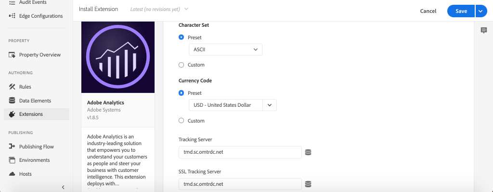

# Raccogliere dati di pagina con Adobe Analytics

Scopri come utilizzare le funzioni integrate del [Adobe Client Data Layer con AEM componenti core](https://experienceleague.adobe.com/docs/experience-manager-core-components/using/developing/data-layer/overview.html?lang=it) per raccogliere dati su una pagina in Adobe Experience Manager Sites. [Experience Platform Launch](https://www.adobe.com/experience-platform/launch.html) e [Estensione Adobe Analytics](https://experienceleague.adobe.com/docs/experience-platform/tags/extensions/adobe/analytics/overview.html) vengono utilizzati per creare regole per inviare i dati di pagina ad Adobe Analytics.

## Cosa verrà creato


In questa esercitazione verrà attivata una regola Launch basata su un evento proveniente da Adobe Client Data Layer, verranno aggiunte le condizioni per l’attivazione della regola e verrà inviato il **Nome pagina** e **Modello di pagina** di una pagina AEM ad Adobe Analytics.

### Obiettivi {#objective}

1. Creare una regola basata su eventi in Launch in base alle modifiche al livello dati
1. Mappatura delle proprietà del livello dati della pagina su elementi dati in Launch
1. Raccogliere dati di pagina e inviarli ad Adobe Analytics con il beacon di visualizzazione della pagina

## Prerequisiti

Sono necessari i seguenti requisiti:

* **Experience Platform Launch** Proprietà
* **Adobe Analytics** ID suite di rapporti test/dev e server di tracciamento. Consulta la seguente documentazione per [creazione di una nuova suite di rapporti](https://experienceleague.adobe.com/docs/analytics/admin/manage-report-suites/new-report-suite/new-report-suite.html).
* [Debugger Experience Platform](https://experienceleague.adobe.com/docs/debugger-learn/tutorials/experience-platform-debugger/introduction-to-the-experience-platform-debugger.html) estensione del browser. Schermate in questa esercitazione acquisite dal browser Chrome.
* (Facoltativo) AEM sito con il [Adobe Client Data Layer abilitato](https://experienceleague.adobe.com/docs/experience-manager-core-components/using/developing/data-layer/overview.html#installation-activation). Questa esercitazione utilizzerà il sito rivolto al pubblico [https://wknd.site/us/en.html](https://wknd.site/us/en.html) ma puoi utilizzare il tuo sito.

>[!NOTE]
>
> Hai bisogno di aiuto per integrare Launch e il tuo sito AEM? [Guarda questa serie video](../experience-platform-launch/overview.md).

## Cambiare ambienti Launch per il sito WKND

[https://wknd.site](https://wknd.site) è un sito rivolto al pubblico basato su [un progetto open source](https://github.com/adobe/aem-guides-wknd) progettati come riferimento e [tutorial](https://experienceleague.adobe.com/docs/experience-manager-learn/getting-started-wknd-tutorial-develop/overview.html?lang=it) per le implementazioni AEM.

Invece di configurare un ambiente AEM e installare la base di codice WKND, puoi utilizzare il debugger di Experience Platform per **interruttore** il live [https://wknd.site/](https://wknd.site/) a *le* Proprietà Launch. Naturalmente è possibile utilizzare il proprio sito AEM se ha già [Adobe Client Data Layer abilitato](https://experienceleague.adobe.com/docs/experience-manager-core-components/using/developing/data-layer/overview.html#installation-activation)

1. Accedi al Experience Platform Launch e [creare una proprietà Launch](https://experienceleague.adobe.com/docs/launch-learn/implementing-in-websites-with-launch/configure-launch/launch.html) (se non lo hai già fatto).
1. Assicurati che sia disponibile un lancio iniziale [La libreria è stata creata](https://experienceleague.adobe.com/docs/experience-platform/tags/publish/libraries.html#create-a-library) e promosso a un lancio [ambiente](https://experienceleague.adobe.com/docs/experience-platform/tags/publish/environments/environments.html).
1. Copia il codice di incorporamento Launch dall’ambiente in cui è stata pubblicata la libreria.

   

1. Nel browser apri una nuova scheda e passa a [https://wknd.site/](https://wknd.site/)
1. Apri l’estensione del browser Experience Platform Debugger.

   

1. Passa a **Launch** > **Configurazione** e **Codici di incorporamento inseriti** sostituisci il codice di incorporamento Launch esistente con *le* codice di incorporamento copiato dal passaggio 3.

   

1. Abilita **Registrazione console** e **Blocca** debugger nella scheda WKND.

   

## Verifica livello dati client di Adobe sul sito WKND

La [Progetto di riferimento WKND](https://github.com/adobe/aem-guides-wknd) è generato con AEM componenti core e dispone dei [Adobe Client Data Layer abilitato](https://experienceleague.adobe.com/docs/experience-manager-core-components/using/developing/data-layer/overview.html#installation-activation) per impostazione predefinita. Successivamente, verifica che Adobe Client Data Layer sia abilitato.

1. Passa a [https://wknd.site](https://wknd.site).
1. Apri gli strumenti di sviluppo del browser e passa alla **Console**. Esegui il comando seguente:

   ```js
   adobeDataLayer.getState();
   ```

   Restituisce lo stato corrente del livello dati client di Adobe.

   

1. Espandi la risposta ed esamina la `page` voce. Dovresti visualizzare uno schema di dati simile al seguente:

   ```json
   page-2eee4f8914:
       @type: "wknd/components/page"
       dc:description: WKND is a collective of outdoors, music, crafts, adventure sports, and travel enthusiasts that want to share our experiences, connections, and expertise with the world.
       dc:title: "WKND Adventures and Travel"
       repo:modifyDate: "2020-08-31T21:02:21Z"
       repo:path: "/content/wknd/us/en.html"
       xdm:language: "en-US"
       xdm:tags: ["Attract"]
       xdm:template: "/conf/wknd/settings/wcm/templates/landing-page-template"
   ```

   Useremo le proprietà standard derivate dal [Schema pagina](https://experienceleague.adobe.com/docs/experience-manager-core-components/using/developing/data-layer/overview.html#page),  `dc:title`, `xdm:language` e `xdm:template` del livello dati per inviare dati di pagina ad Adobe Analytics.

   >[!NOTE]
   >
   > Non vedere il `adobeDataLayer` oggetto javascript? Assicurati che [Adobe Client Data Layer è stato abilitato](https://experienceleague.adobe.com/docs/experience-manager-core-components/using/developing/data-layer/overview.html#installation-activation) sul tuo sito.

## Creare una regola di caricamento pagina

Il livello dati client di Adobe è un **event** livello dati guidato. Quando il AEM **Pagina** il livello dati viene caricato e viene attivato un evento `cmp:show`. Crea una regola attivata in base alla `cmp:show` evento.

1. Passa a Experience Platform Launch e alla proprietà Web integrata con il sito AEM.
1. Passa a **Regole** nell’interfaccia utente di Launch, quindi fai clic su **Crea nuova regola**.

   

1. Denomina la regola **Pagina caricata**.
1. Fai clic su **Eventi** **Aggiungi** per aprire **Configurazione evento** procedura guidata.
1. Sotto **Tipo evento** select **Codice personalizzato**.

   

1. Fai clic su **Open Editor** nel pannello principale e immetti il seguente frammento di codice:

   ```js
   var pageShownEventHandler = function(evt) {
      // defensive coding to avoid a null pointer exception
      if(evt.hasOwnProperty("eventInfo") && evt.eventInfo.hasOwnProperty("path")) {
         //trigger Launch Rule and pass event
         console.debug("cmp:show event: " + evt.eventInfo.path);
         var event = {
            //include the path of the component that triggered the event
            path: evt.eventInfo.path,
            //get the state of the component that triggered the event
            component: window.adobeDataLayer.getState(evt.eventInfo.path)
         };
   
         //Trigger the Launch Rule, passing in the new `event` object
         // the `event` obj can now be referenced by the reserved name `event` by other Launch data elements
         // i.e `event.component['someKey']`
         trigger(event);
      }
   }
   
   //set the namespace to avoid a potential race condition
   window.adobeDataLayer = window.adobeDataLayer || [];
   //push the event listener for cmp:show into the data layer
   window.adobeDataLayer.push(function (dl) {
      //add event listener for `cmp:show` and callback to the `pageShownEventHandler` function
      dl.addEventListener("cmp:show", pageShownEventHandler);
   });
   ```

   Lo snippet di codice riportato sopra aggiunge un listener di eventi da [spingere una funzione](https://github.com/adobe/adobe-client-data-layer/wiki#pushing-a-function) nel livello dati. Quando il `cmp:show` viene attivato l&#39;evento `pageShownEventHandler` viene chiamata la funzione . In questa funzione vengono aggiunti alcuni controlli di integrità e un nuovo `event` è costruito con [stato del livello dati](https://github.com/adobe/adobe-client-data-layer/wiki#getstate) per il componente che ha attivato l’evento.

   Dopo `trigger(event)` viene chiamato. `trigger()` è un nome riservato in Launch e &quot;attiverà&quot; la regola Launch. Passiamo il `event` oggetto come parametro che a sua volta è esposto da un altro nome riservato in Launch denominato `event`. Gli elementi dati in Launch possono ora fare riferimento a varie proprietà come questa: `event.component['someKey']`.

1. Salva le modifiche.
1. Successivo sotto **Azioni** click **Aggiungi** per aprire **Configurazione azione** procedura guidata.
1. Sotto **Tipo di azione** scegli **Codice personalizzato**.

   

1. Fai clic su **Open Editor** nel pannello principale e immetti il seguente frammento di codice:

   ```js
   console.debug("Page Loaded ");
   console.debug("Page name: " + event.component['dc:title']);
   console.debug("Page type: " + event.component['@type']);
   console.debug("Page template: " + event.component['xdm:template']);
   ```

   La `event` viene passato dall&#39;oggetto `trigger()` chiamato nell&#39;evento personalizzato. `component` è la pagina corrente derivata dal livello dati `getState` nell’evento personalizzato . Richiama da prima [Schema pagina](https://experienceleague.adobe.com/docs/experience-manager-core-components/using/developing/data-layer/overview.html#page) esposto dal livello dati per vedere i vari tasti esposti fuori dalla scatola.

1. Salvare le modifiche ed eseguire un [build](https://experienceleague.adobe.com/docs/experience-platform/tags/publish/builds.html) in Launch per promuovere il codice nel [ambiente](https://experienceleague.adobe.com/docs/experience-platform/tags/publish/environments/environments.html) utilizzato sul sito AEM.

   >[!NOTE]
   >
   > Può essere molto utile utilizzare il [Debugger Adobe Experience Platform](https://experienceleague.adobe.com/docs/debugger-learn/tutorials/experience-platform-debugger/introduction-to-the-experience-platform-debugger.html) per convertire il codice di incorporamento in un **Sviluppo** ambiente.

1. Accedi al sito AEM e apri gli strumenti per sviluppatori per visualizzare la console. Aggiorna la pagina per visualizzare che i messaggi della console sono stati registrati:

   

## Creare elementi dati

Crea quindi diversi elementi dati per acquisire valori diversi da Adobe Client Data Layer. Come visto nell’esercizio precedente, è possibile accedere direttamente alle proprietà del livello dati tramite codice personalizzato. Il vantaggio dell’utilizzo degli elementi dati è che possono essere riutilizzati nelle regole di Launch.

Richiama da prima [Schema pagina](https://experienceleague.adobe.com/docs/experience-manager-core-components/using/developing/data-layer/overview.html#page) esposto dal livello dati:

Gli elementi dati sono mappati sul `@type`, `dc:title`e `xdm:template` proprietà.

### Tipo di risorsa componente

1. Passa a Experience Platform Launch e alla proprietà Web integrata con il sito AEM.
1. Passa a **Elementi dati** e fai clic su **Crea nuovo elemento dati**.
1. Per **Nome** enter **Tipo di risorsa componente**.
1. Per **Tipo di elemento dati** select **Codice personalizzato**.

   

1. Fai clic su **Open Editor** e immetti quanto segue nell&#39;editor di codice personalizzato:

   ```js
   if(event && event.component && event.component.hasOwnProperty('@type')) {
       return event.component['@type'];
   }
   ```

   Salva le modifiche.

   >[!NOTE]
   >
   > Ricorda che la `event` l&#39;oggetto è reso disponibile e delimitato in base all&#39;evento che ha attivato il **Regola** in Launch. Il valore di un elemento dati non viene impostato finché l’elemento dati non è *referenza* all&#39;interno di una regola. Pertanto è sicuro utilizzare questo elemento dati all’interno di una regola come la **Pagina caricata** regola creata nel passaggio precedente *ma* non sarebbe sicuro da utilizzare in altri contesti.

### Nome pagina

1. Fai clic su **Aggiungi elemento dati**.
1. Per **Nome** enter **Nome pagina**.
1. Per **Tipo di elemento dati** select **Codice personalizzato**.
1. Fai clic su **Open Editor** e immetti quanto segue nell&#39;editor di codice personalizzato:

   ```js
   if(event && event.component && event.component.hasOwnProperty('dc:title')) {
       return event.component['dc:title'];
   }
   ```

   Salva le modifiche.

### Modello della pagina

1. Fai clic su **Aggiungi elemento dati**.
1. Per **Nome** enter **Modello di pagina**.
1. Per **Tipo di elemento dati** select **Codice personalizzato**.
1. Fai clic su **Open Editor** e immetti quanto segue nell&#39;editor di codice personalizzato:

   ```js
   if(event && event.component && event.component.hasOwnProperty('xdm:template')) {
       return event.component['xdm:template'];
   }
   ```

   Salva le modifiche.

1. Ora devi disporre di tre elementi dati come parte della regola:

   

## Aggiungere l’estensione Analytics

Quindi aggiungi l’estensione Analytics alla proprietà Launch. Dobbiamo inviare questi dati da qualche parte!

1. Passa a Experience Platform Launch e alla proprietà Web integrata con il sito AEM.
1. Vai a **Estensioni** > **Catalogo**
1. Individua il **Adobe Analytics** estensione e fai clic su **Installa**

   

1. Sotto **Gestione libreria** > **Suite di rapporti**, immetti gli ID suite di rapporti che desideri utilizzare con ogni ambiente Launch.

   

   >[!NOTE]
   >
   > In questa esercitazione puoi utilizzare una suite di rapporti per tutti gli ambienti, ma in tempo reale puoi utilizzare suite di rapporti separate, come illustrato nell’immagine seguente

   >[!TIP]
   >
   >Si consiglia di utilizzare *Opzione Gestisci la libreria per me* l&#39;impostazione Library Management rende molto più semplice mantenere `AppMeasurement.js` libreria aggiornata.

1. Seleziona la casella per abilitare **Utilizzare Activity Map**.

   

1. Sotto **Generale** > **Server di tracciamento**, immetti il server di tracciamento, ad esempio `tmd.sc.omtrdc.net`. Immetti SSL Tracking Server se il sito supporta `https://`

   

1. Fai clic su **Salva** per salvare le modifiche.

## Aggiungi una condizione alla regola Page Loaded

Quindi, aggiorna il **Pagina caricata** regola per utilizzare **Tipo di risorsa componente** elemento dati per garantire che la regola si attivi solo quando `cmp:show` l&#39;evento è per **Pagina**. Altri componenti possono attivare `cmp:show` , ad esempio il componente Carosello si attiva quando le diapositive cambiano. Pertanto è importante aggiungere una condizione per questa regola.

1. Nell’interfaccia utente di Launch, passa a **Pagina caricata** creato in precedenza.
1. Sotto **Condizioni** click **Aggiungi** per aprire **Configurazione condizione** procedura guidata.
1. Per **Tipo di condizione** select **Value Comparison**.
1. Impostare il primo valore nel campo modulo su `%Component Resource Type%`. Puoi utilizzare l’icona Elemento dati  per selezionare **Tipo di risorsa componente** elemento dati. Lascia impostato il comparatore su `Equals`.
1. Imposta il secondo valore su `wknd/components/page`.

   

   >[!NOTE]
   >
   > È possibile aggiungere questa condizione all&#39;interno della funzione di codice personalizzato che ascolta il `cmp:show` creato in precedenza nell&#39;esercitazione. Tuttavia, l’aggiunta di questa funzionalità all’interno dell’interfaccia utente offre maggiore visibilità agli utenti aggiuntivi che potrebbero dover apportare modifiche alla regola. Inoltre, possiamo utilizzare il nostro elemento dati!

1. Salva le modifiche.

## Impostare le variabili di Analytics e attivare il beacon Vista pagina

Attualmente **Pagina caricata** restituisce semplicemente un&#39;istruzione console. Quindi, utilizza gli elementi dati e l’estensione Analytics per impostare le variabili Analytics come **action** in **Pagina caricata** regola. Inoltre, verrà impostata un’azione aggiuntiva per attivare la **Beacon di visualizzazione pagina** e inviare i dati raccolti ad Adobe Analytics.

1. In **Pagina caricata** regola **remove** la **Core - Codice personalizzato** azione (le istruzioni della console):

   

1. In Azioni, fai clic su **Aggiungi** per aggiungere una nuova azione.
1. Imposta la **Estensione** digitare **Adobe Analytics** e imposta **Tipo di azione** a  **Imposta variabili**

   

1. Nel pannello principale seleziona una **eVar** e impostato come valore dell&#39;elemento dati **Modello di pagina**. Usa l’icona Elementi dati  per selezionare **Modello di pagina** elemento.

   

1. Scorri verso il basso, sotto **Impostazioni aggiuntive** set **Nome pagina** all’elemento dati **Nome pagina**:

   

   Salva le modifiche.

1. Quindi, aggiungi un’azione aggiuntiva a destra di **Adobe Analytics - Impostare le variabili** toccando **plus** icona:

   

1. Imposta la **Estensione** digitare **Adobe Analytics** e imposta **Tipo di azione** a  **Invia beacon**. Poiché questo viene considerato una visualizzazione di pagina, lascia impostato il tracciamento predefinito su **`s.t()`**.

   

1. Salva le modifiche. La **Pagina caricata** La regola deve ora avere la seguente configurazione:

   

   * **1.** Ascolta i `cmp:show` evento.
   * **2.** Controlla che l&#39;evento sia stato attivato da una pagina.
   * **3.** Imposta le variabili di Analytics per **Nome pagina** e **Modello di pagina**
   * **4.** Invia il beacon Vista pagina di Analytics
1. Salva tutte le modifiche e crea la libreria Launch, promuovendo l’ambiente appropriato.

## Convalida il beacon Vista pagina e la chiamata Analytics

Ora che **Pagina caricata** La regola invia il beacon di Analytics, dovresti essere in grado di visualizzare le variabili di tracciamento di Analytics utilizzando il debugger di Experience Platform.

1. Apri [Sito WKND](https://wknd.site/us/en.html) nel browser.
1. Fai clic sull’icona Debugger  per aprire Experience Platform Debugger.
1. Accertati che Debugger mappi la proprietà Launch su *le* Ambiente di sviluppo, come descritto in precedenza e **Registrazione console** è controllata.
1. Apri il menu Analytics e verifica che la suite di rapporti sia impostata su *le* suite di rapporti. È inoltre necessario compilare il campo Nome pagina :

   

1. Scorri verso il basso ed espandi **Richieste di rete**. Dovresti essere in grado di trovare il **evar** impostato per **Modello di pagina**:

   

1. Torna al browser e apri la console per sviluppatori. Fai clic su **Carosello** nella parte superiore della pagina.

   

1. Osserva l’istruzione console nella console del browser:

   

   Questo perché il carosello attiva un `cmp:show` event *ma* a causa del controllo del **Tipo di risorsa componente**, non viene attivato alcun evento.

   >[!NOTE]
   >
   > Se non trovi registri della console, assicurati che **Registrazione console** è controllato in **Launch** in Experience Platform Debugger.

1. Passa a una pagina dell’articolo come [Australia Occidentale](https://wknd.site/us/en/magazine/western-australia.html). Osserva che il nome della pagina e il tipo di modello cambiano.

## Congratulazioni!

Hai appena utilizzato Adobe Client Data Layer e il Experience Platform Launch basati sugli eventi per raccogliere i dati della pagina da un sito AEM e inviarli ad Adobe Analytics.

### Passaggi successivi

Consulta la seguente esercitazione per scoprire come utilizzare il livello dati client Adobe basato su eventi per [tenere traccia dei clic su componenti specifici su un sito Adobe Experience Manager](track-clicked-component.md).
