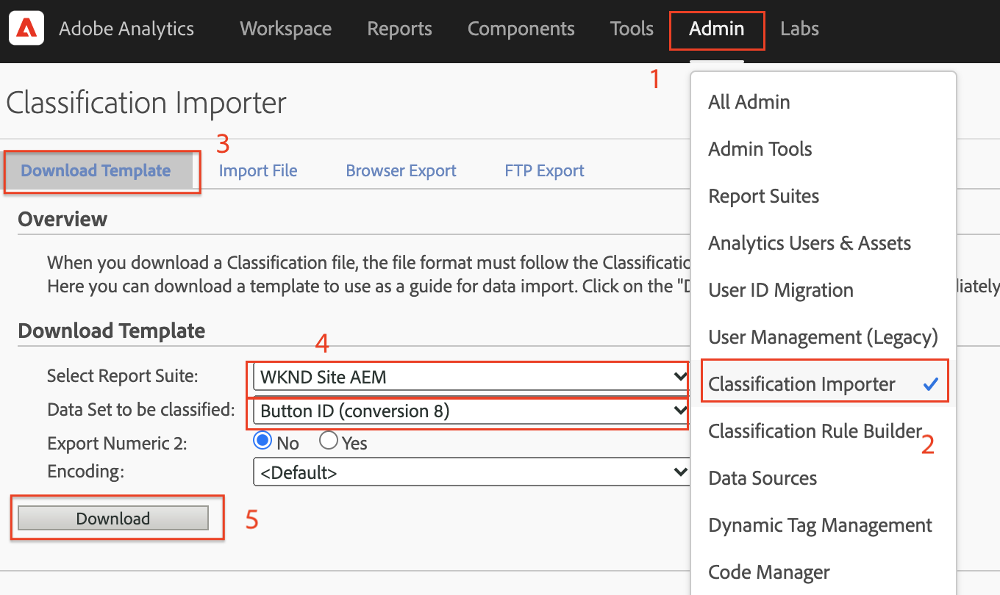
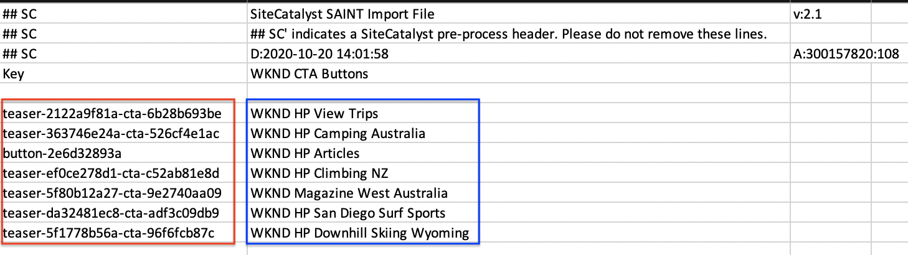

# Analizzare i dati con Analysis Workspace

Scopri come mappare i dati acquisiti da un sito Adobe Experience Manager a metriche e dimensioni nelle suite di rapporti di Adobe Analytics. Scopri come creare un dashboard di reporting dettagliato utilizzando la funzione Analysis Workspace di Adobe Analytics.

## Cosa intendi creare {#what-build}

Il team di marketing WKND è interessato a sapere quale `Call to Action (CTA)` I pulsanti offrono prestazioni ottimali nella home page. In questa esercitazione, crea un progetto in **Analysis Workspace** visualizzare le prestazioni dei diversi pulsanti CTA e comprendere il comportamento degli utenti sul sito. Le seguenti informazioni vengono acquisite tramite Adobe Analytics quando un utente fa clic su un pulsante di invito all’azione (CTA) nella home page di WKND.

**Variabili di Analytics**

Di seguito sono riportate le variabili di Analytics attualmente tracciate:

* `eVar5` -  `Page template`
* `eVar6` - `Page Id`
* `eVar7` - `Page last modified date`
* `eVar8` - `CTA Button Id`
* `eVar9` - `Page Name`
* `event8` - `CTA Button Click event`
* `prop8` - `CTA Button Id`

### Obiettivi {#objective}

1. Crea una suite di rapporti o usane una esistente.
1. Configura [Variabili di conversione (eVars)](https://experienceleague.adobe.com/docs/analytics/admin/admin-tools/manage-report-suites/edit-report-suite/conversion-variables/conversion-var-admin.html) e [Eventi di successo (eventi)](https://experienceleague.adobe.com/docs/analytics/admin/admin-tools/manage-report-suites/edit-report-suite/conversion-variables/success-events/success-event.html) nella suite di rapporti.
1. Creare un [Progetto Analysis Workspace](https://experienceleague.adobe.com/docs/analytics/analyze/analysis-workspace/home.html) analizzare i dati con l’aiuto di strumenti che consentono di generare, analizzare e condividere rapidamente le informazioni.
1. Condividi il progetto Analysis Workspace con altri membri del team.

## Prerequisiti

Questo tutorial è una continuazione di [Tracciare il componente su cui è stato fatto clic con Adobe Analytics](./track-clicked-component.md) e presuppone che tu abbia:

* A **Tag, proprietà** con [Estensione Adobe Analytics](https://experienceleague.adobe.com/docs/experience-platform/tags/extensions/client/analytics/overview.html) abilitato
* **Adobe Analytics** ID suite di rapporti test/dev e server di tracciamento. Consulta la seguente documentazione per [creazione di una suite di rapporti](https://experienceleague.adobe.com/docs/analytics/admin/admin-tools/manage-report-suites/c-new-report-suite/new-report-suite.html).
* [Debugger Experienci Platform](https://experienceleague.adobe.com/docs/platform-learn/data-collection/debugger/overview.html) estensione del browser configurata con una proprietà tag caricata su [Sito WKND](https://wknd.site/us/en.html) o un sito AEM con Adobe Data Layer abilitato.

## Variabili di conversione (eVar) ed Eventi di successo (Evento)

La variabile di conversione Custom Insight (o eVar) viene inserita nel codice dell’Adobe nelle pagine web selezionate del sito. Il suo scopo principale è segmentare le metriche di successo della conversione nei rapporti di marketing personalizzati. Un eVar può essere basato su visite e funziona in modo simile ai cookie. I valori trasmessi nelle variabili eVar seguono l’utente per un periodo predeterminato.

Quando un eVar è impostato sul valore di un visitatore, Adobe ricorda automaticamente tale valore fino alla scadenza. Eventuali eventi di successo riscontrati da un visitatore mentre il valore eVar è attivo vengono conteggiati per il valore eVar.

Le eVar vengono utilizzate in modo ottimale per misurare la causa e l’effetto, ad esempio:

* Quali campagne interne hanno influenzato i ricavi
* Quali banner pubblicitari hanno portato a una registrazione
* Il numero di volte in cui è stata utilizzata una ricerca interna prima di effettuare un ordine

Gli eventi di successo sono azioni che possono essere tracciate. Puoi determinare cos’è un evento di successo. Ad esempio, se un visitatore fa clic su un pulsante CTA, l’evento clic potrebbe essere considerato un evento di successo.

### Configurare le eVar

1. Dalla pagina Home di Adobe Experience Cloud, seleziona la tua organizzazione e avvia Adobe Analytics.

   

1. Dalla barra degli strumenti di Analytics, fai clic su **Amministratore** > **Suite di rapporti** e trova la tua suite di rapporti.

   

1. Seleziona la Suite di rapporti > **Modifica impostazioni** > **Conversione** > **Variabili di conversione**

   

1. Utilizzo di **Aggiungi nuovo** , creiamo le variabili di conversione per mappare lo schema come segue:

   * `eVar5` -  `Page Template`
   * `eVar6` - `Page ID`
   * `eVar7` - `Last Modified Date`
   * `eVar8` - `Button Id`
   * `eVar9` - `Page Name`

   

1. Fornisci un nome e una descrizione appropriati per ogni eVar e **Salva** le tue modifiche. Nel progetto Analysis Workspace vengono utilizzate le eVar con il nome appropriato, pertanto un nome descrittivo rende le variabili facilmente individuabili.

   

### Configurare eventi di successo

Quindi, creiamo un evento per tenere traccia del clic sul pulsante CTA.

1. Dalla sezione **Report Suite Manager** , selezionare la **ID suite di rapporti** e fai clic su **Modifica impostazioni**.
1. Clic **Conversione** > **Eventi di successo**
1. Utilizzo di **Aggiungi nuovo** , crea un evento di successo personalizzato per tenere traccia del clic sul pulsante CTA e quindi **Salva** le tue modifiche.
   * `Event` : `event8`
   * `Name`:`CTA Click`
   * `Type`:`Counter`

   

## Creare un progetto in Analysis Workspace {#workspace-project}

Analysis Workspace è uno strumento flessibile per browser che consente di generare analisi e condividere rapidamente le informazioni. Tramite l’interfaccia di trascinamento, puoi creare le analisi, aggiungere visualizzazioni per dare vita ai dati, curare un set di dati, condividere e pianificare progetti con chiunque all’interno della tua organizzazione.

Quindi, crea un [progetto](https://experienceleague.adobe.com/docs/analytics/analyze/analysis-workspace/build-workspace-project/freeform-overview.html#analysis-workspace) creare un dashboard per analizzare le prestazioni dei pulsanti CTA in tutto il sito.

1. Dalla barra degli strumenti di Analytics, seleziona **Workspace** e fai clic per **Crea un nuovo progetto**.

   

1. Scegli di iniziare da un **progetto vuoto** in alternativa, seleziona uno dei modelli predefiniti, forniti dall’Adobe o dai modelli personalizzati creati dalla tua organizzazione. Sono disponibili diversi modelli, a seconda dell’analisi o del caso d’uso a cui stai pensando. [Ulteriori informazioni](https://experienceleague.adobe.com/docs/analytics/analyze/analysis-workspace/build-workspace-project/starter-projects.html) informazioni sulle diverse opzioni di modello disponibili.

   Nel progetto Workspace, puoi accedere a pannelli, tabelle, visualizzazioni e componenti dalla barra a sinistra. Costituiscono gli elementi di base del progetto.

   * **[Componenti](https://experienceleague.adobe.com/docs/analytics/analyze/analysis-workspace/components/analysis-workspace-components.html)** - I componenti sono dimensioni, metriche, segmenti o intervalli di date, che possono essere combinati in una tabella a forma libera per iniziare a rispondere a specifiche domande di business. Prima di iniziare con le analisi, impara a conoscere i diversi tipi di componente. Dopo aver acquisito dimestichezza con la terminologia dei componenti, puoi iniziare a trascinarli per generare le analisi in una tabella a forma libera.
   * **[Visualizzare](https://experienceleague.adobe.com/docs/analytics/analyze/analysis-workspace/visualizations/freeform-analysis-visualizations.html)** : le visualizzazioni, ad esempio i grafici a barre o a linee, vengono quindi aggiunte ai dati per riprodurli in modo visivo. Nella barra a sinistra, seleziona l’icona centrale Visualizzazioni per visualizzare l’elenco di tutte le visualizzazioni disponibili.
   * **[Pannelli](https://experienceleague.adobe.com/docs/analytics/analyze/analysis-workspace/panels/panels.html)** - Un pannello è una raccolta di tabelle e visualizzazioni. Puoi accedere ai pannelli dall’icona in alto a sinistra nell’Area di lavoro. I pannelli sono utili per organizzare i progetti in base a periodi di tempo, suite di rapporti o casi di utilizzo di analisi. In Analysis Workspace sono disponibili i seguenti tipi di pannello:

   

### Aggiungere visualizzazione dati con Analysis Workspace

Quindi, crea una tabella per creare una rappresentazione visiva del modo in cui gli utenti interagiscono con `Call to Action (CTA)` nella home page del sito WKND. Per creare una rappresentazione di questo tipo, utilizziamo i dati raccolti nel [Tracciare il componente su cui è stato fatto clic con Adobe Analytics](./track-clicked-component.md). Di seguito è riportato un rapido riepilogo dei dati tracciati per le interazioni dell’utente con i pulsanti di invito all’azione per il sito WKND.

* `eVar5` -  `Page template`
* `eVar6` - `Page Id`
* `eVar7` - `Page last modified date`
* `eVar8` - `CTA Button Id`
* `eVar9` - `Page Name`
* `event8` - `CTA Button Click event`
* `prop8` - `CTA Button Id`

1. Trascina la selezione **Pagina** nella tabella a forma libera. Ora dovresti essere in grado di visualizzare una visualizzazione che mostra il Nome pagina (eVar9) e le Visualizzazioni pagina corrispondenti (Occorrenze) visualizzati all’interno della tabella.

   

1. Trascina la selezione **Clic su CTA** (event8) nella metrica Occorrenze e sostituiscila. Ora puoi visualizzare una visualizzazione in cui vengono visualizzati il Nome pagina (eVar9) e il numero corrispondente di eventi CTA Click su una pagina.

   

1. Suddividiamo la pagina in base al tipo di modello. Seleziona la metrica del modello di pagina dai componenti, quindi trascina la metrica Modello pagina nella dimensione Nome pagina. Ora puoi visualizzare il nome della pagina suddiviso per il relativo tipo di modello.

   * **Prima di**
     

   * **Dopo**
     

1. Per capire come gli utenti interagiscono con i pulsanti CTA quando si trovano nelle pagine del sito WKND, è necessario aggiungere la metrica ID pulsante (eVar8).

   

1. Di seguito è riportata una rappresentazione visiva del sito WKND suddivisa per il modello di pagina e per l’interazione dell’utente con i pulsanti CTA (Click to Action) del sito WKND.

   

1. Puoi sostituire il valore ID pulsante con un nome più semplice utilizzando le classificazioni di Adobe Analytics. Puoi trovare ulteriori informazioni su come creare una classificazione per una metrica specifica [qui](https://experienceleague.adobe.com/docs/analytics/components/classifications/c-classifications.html). In questo caso, abbiamo una metrica di classificazione `Button Section (Button ID)` configurazione per `eVar8` che mappa l’id del pulsante su un nome intuitivo.

   

## Aggiungere classificazione a una variabile analitica

### Classificazioni di conversione

La classificazione di Analytics è un modo per classificare i dati delle variabili di Analytics e visualizzarli in modi diversi quando si generano i rapporti. Per migliorare la visualizzazione dell’ID pulsante nel rapporto di Analytics Workspace, creiamo una variabile di classificazione per l’ID pulsante (eVar8). Durante la classificazione, stabilisci una relazione tra la variabile e i metadati correlati a tale variabile.

Quindi, creiamo una variabile di classificazione per Analytics.

1. Dalla sezione **Amministratore** menu della barra degli strumenti, seleziona **Suite di rapporti**
1. Seleziona la **ID suite di rapporti** dal **Report Suite Manager** e fai clic su **Modifica impostazioni** > **Conversione** > **Classificazioni di conversione**

   

1. Dalla sezione **Seleziona tipo di classificazione** , seleziona la variabile (ID pulsante eVar 8) per aggiungere una classificazione.
1. Fai clic sulla freccia accanto alla variabile di classificazione elencata nella sezione Classificazioni per aggiungere una nuova classificazione.

   

1. In **Modificare una classificazione** fornisci un nome appropriato per la classificazione di testo. Viene creato un componente dimensione con il nome Classificazione di testo.

   

1. **Salva** le tue modifiche.

### Importatore di classificazione

Utilizza l’importazione per caricare le classificazioni in Adobe Analytics. Puoi anche esportare i dati per l’aggiornamento prima di un’importazione. I dati importati con lo strumento di importazione devono essere in un formato specifico. In questo Adobe è possibile scaricare un modello di dati con tutti i dettagli di intestazione corretti in un file di dati con valori delimitati da tabulazioni. Puoi aggiungere i nuovi dati a questo modello e quindi importare il file di dati nel browser utilizzando l’FTP.

#### Modello di classificazione

Prima di importare le classificazioni nei rapporti di marketing, puoi scaricare un modello per la creazione di un file di dati delle classificazioni. Il file di dati utilizza le classificazioni desiderate come intestazioni di colonna, quindi organizza il set di dati di reporting sotto le intestazioni di classificazione appropriate.

Quindi, scariciamo il modello di classificazione per la variabile Button Id (eVar8)

1. Accedi a **Amministratore** > **Importatore di classificazione**
1. Scarica un modello di classificazione per la variabile di conversione dalla sezione **Scarica modello** Tab.
   

1. Nella scheda Scarica modello, specifica la configurazione del modello di dati.
   * **Seleziona suite di rapporti** : seleziona la suite di rapporti da utilizzare nel modello. La suite di rapporti e il set di dati devono corrispondere.
   * **Set di dati da classificare** : seleziona il tipo di dati per il file di dati. Il menu include tutti i rapporti nelle suite di rapporti configurati per le classificazioni.
   * **Codifica** : seleziona la codifica dei caratteri per il file di dati. Il formato di codifica predefinito è UTF-8.

1. Clic **Scarica** e salvare il file modello nel sistema locale. Il file modello è un file di dati delimitato da tabulazioni (estensione .tab) supportato dalla maggior parte delle applicazioni per fogli di calcolo.
1. Apri il file di dati delimitato da tabulazioni utilizzando un editor a tua scelta.
1. Aggiungi l’ID pulsante (eVar9) e il nome del pulsante corrispondente al file delimitato da tabulazioni per ogni valore di eVar9 dal passaggio 9 della sezione.

   

1. **Salva** il file delimitato da tabulazioni.
1. Accedi a **Importa file** scheda.
1. Configura la destinazione per l’importazione del file.
   * **Seleziona suite di rapporti** : AEM del sito WKND (suite di rapporti)
   * **Set di dati da classificare** : Id Pulsante (Variabile Di Conversione eVar8)
1. Fai clic su **Scegli file** per caricare il file delimitato da tabulazioni dal sistema, quindi fare clic su **Importa file**

   

   >[!NOTE]
   >
   > Un’importazione corretta visualizza immediatamente le modifiche appropriate in un’esportazione. Tuttavia, le modifiche ai dati nei rapporti richiedono fino a quattro ore quando si utilizza un’importazione browser e fino a 24 ore quando si utilizza un’importazione FTP.

#### Sostituisci variabile di conversione con variabile di classificazione

1. Dalla barra degli strumenti di Analytics, seleziona **Workspace** e apri l’area di lavoro creata in [Creare un progetto in Analysis Workspace](#create-a-project-in-analysis-workspace) questa esercitazione.

   

1. Quindi, sostituisci il **ID pulsante** metrica nell’area di lavoro che visualizza l’ID di un pulsante di invito all’azione (CTA) con il nome della classificazione creato nel passaggio precedente.

1. Dal Finder dei componenti, cerca **Pulsanti CTA WKND** e trascina **Pulsanti CTA WKND (ID pulsante)** nella metrica ID pulsante e sostituiscila.

   * **Prima di**
     
   * **Dopo**
     

1. Puoi notare che la metrica Id pulsante che conteneva l’ID pulsante di un pulsante di invito all’azione (CTA) ora viene sostituita con un nome corrispondente fornito nel modello di classificazione.
1. Confrontiamo la tabella dell’area di lavoro di Analytics con la pagina Home di WKND e comprendiamo il conteggio dei clic dei pulsanti CTA e la relativa analisi. In base ai dati della tabella a forma libera dell’area di lavoro, è chiaro che 22 volte gli utenti hanno fatto clic sul pulsante **SCIA ORA** pulsante e quattro volte per il WKND Home Page Camping in Western Australia **Ulteriori informazioni** pulsante.

   

1. Salva il progetto Adobe Analytics Workspace e specifica un nome e una descrizione corretti. Facoltativamente, puoi aggiungere tag a un progetto Workspace.

   

1. Dopo aver salvato correttamente il progetto, puoi condividere il progetto Workspace con altri collaboratori o compagni utilizzando l’opzione Condividi.

   

## Congratulazioni.

Hai appena imparato a mappare i dati acquisiti da un sito Adobe Experience Manager a metriche e dimensioni nelle suite di rapporti di Adobe Analytics. Inoltre, ha eseguito una classificazione per le metriche e generato una dashboard di reporting dettagliata utilizzando la funzione Analysis Workspace di Adobe Analytics.
