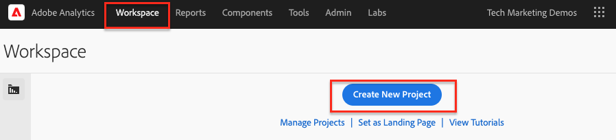

# Analizzare i dati con Analysis Workspace

Scopri come mappare i dati acquisiti da un sito Adobe Experience Manager a metriche e dimensioni nelle suite di rapporti di Adobe Analytics. Scopri come creare un dashboard di reporting dettagliato utilizzando la funzione Analysis Workspace di Adobe Analytics.

## Cosa verrà creato {#what-build}

Il team marketing WKND è interessato a sapere quale `Call to Action (CTA)` Le prestazioni dei pulsanti sono le migliori nella home page. In questa esercitazione, crea un progetto nel **Analysis Workspace** per visualizzare le prestazioni dei diversi pulsanti CTA e comprendere il comportamento degli utenti sul sito. Le seguenti informazioni vengono acquisite utilizzando Adobe Analytics quando un utente fa clic su un pulsante Invito all’azione (CTA) nella home page WKND.

**Variabili di Analytics**

Di seguito sono elencate le variabili di Analytics attualmente monitorate:

* `eVar5` -  `Page template`
* `eVar6` - `Page Id`
* `eVar7` - `Page last modified date`
* `eVar8` - `CTA Button Id`
* `eVar9` - `Page Name`
* `event8` - `CTA Button Click event`
* `prop8` - `CTA Button Id`

### Obiettivi {#objective}

1. Creare una suite di rapporti o utilizzarne una esistente.
1. Configura [Variabili di conversione (eVar)](https://experienceleague.adobe.com/docs/analytics/admin/admin-tools/manage-report-suites/edit-report-suite/conversion-variables/conversion-var-admin.html) e [Eventi di successo (eventi)](https://experienceleague.adobe.com/docs/analytics/admin/admin-tools/manage-report-suites/edit-report-suite/conversion-variables/success-events/success-event.html) nella suite di rapporti.
1. Crea un [Progetto Analysis Workspace](https://experienceleague.adobe.com/docs/analytics/analyze/analysis-workspace/home.html) analizzare i dati con l’aiuto di strumenti che ti consentono di generare, analizzare e condividere informazioni rapidamente.
1. Condividi il progetto Analysis Workspace con altri membri del team.

## Prerequisiti

Questa esercitazione è una continuazione del [Tenere traccia del componente su cui è stato fatto clic con Adobe Analytics](./track-clicked-component.md) e presuppone che:

* A **Proprietà tag** con [Estensione Adobe Analytics](https://experienceleague.adobe.com/docs/experience-platform/tags/extensions/client/analytics/overview.html) abilitato
* **Adobe Analytics** ID suite di rapporti test/dev e server di tracciamento. Consulta la seguente documentazione per [creazione di una suite di rapporti](https://experienceleague.adobe.com/docs/analytics/admin/admin-tools/manage-report-suites/c-new-report-suite/new-report-suite.html).
* [Debugger Experience Platform](https://experienceleague.adobe.com/docs/platform-learn/data-collection/debugger/overview.html) estensione del browser configurata con una proprietà tag caricata sul [Sito WKND](https://wknd.site/us/en.html) o un sito AEM con Adobe Data Layer abilitato.

## Variabili di conversione (eVar) ed eventi di successo (evento)

La variabile di conversione Custom Insight (o eVar) viene inserita nel codice di Adobe nelle pagine web selezionate del sito. Il suo scopo principale è segmentare le metriche di successo della conversione nei rapporti di marketing personalizzati. Un eVar può essere basato su visite e funziona in modo simile ai cookie. I valori trasmessi nelle variabili eVar seguono l’utente per un periodo predeterminato.

Quando un eVar è impostato sul valore di un visitatore, Adobe ricorda automaticamente tale valore fino alla scadenza. Eventuali eventi di successo riscontrati da un visitatore mentre il valore eVar è attivo vengono conteggiati per il valore eVar.

Le eVar vengono utilizzate in modo più efficace per misurare la causa e l’effetto, ad esempio:

* Quali campagne interne hanno influenzato i ricavi
* Quali banner pubblicitari sono stati alla fine il risultato di una registrazione
* Numero di volte in cui è stata utilizzata una ricerca interna prima di effettuare un ordine

Gli eventi di successo sono azioni che possono essere tracciate. È possibile determinare l&#39;evento di successo. Ad esempio, se un visitatore fa clic su un pulsante CTA, l’evento clic potrebbe essere considerato un evento riuscito.

### Configurare eVar

1. Dalla home page di Adobe Experience Cloud, seleziona l’organizzazione e avvia Adobe Analytics.

   

1. Dalla barra degli strumenti di Analytics, fai clic su **Amministratore** > **Suite di rapporti** e trova la tua suite di rapporti.

   

1. Seleziona Suite di rapporti > **Modifica impostazioni** > **Conversione** > **Variabili di conversione**

   

1. Utilizzo della **Aggiungi nuovo** crea le variabili di conversione per mappare lo schema come segue:

   * `eVar5` -  `Page Template`
   * `eVar6` - `Page ID`
   * `eVar7` - `Last Modified Date`
   * `eVar8` - `Button Id`
   * `eVar9` - `Page Name`

   

1. Fornire un nome e una descrizione appropriati per ciascuna eVar e **Salva** le modifiche. Nel progetto Analysis Workspace vengono utilizzate le eVar con il nome appropriato, pertanto un nome descrittivo rende le variabili facilmente individuabili.

   

### Configurare eventi di successo

Quindi, creiamo un evento per tenere traccia del clic sul pulsante CTA.

1. Da **Report Suite Manager** seleziona la finestra **ID suite di rapporti** e fai clic su **Modifica impostazioni**.
1. Fai clic su **Conversione** > **Eventi di successo**
1. Utilizzo della **Aggiungi nuovo** crea un evento di successo personalizzato per tenere traccia del clic del pulsante CTA e quindi **Salva** le modifiche.
   * `Event` : `event8`
   * `Name`:`CTA Click`
   * `Type`:`Counter`

   

## Creare un progetto in Analysis Workspace {#workspace-project}

Analysis Workspace è uno strumento browser flessibile che ti consente di creare analisi e condividere informazioni rapidamente. Tramite l’interfaccia a trascinamento della selezione puoi creare le analisi, aggiungere visualizzazioni per dare vita ai dati, curare un set di dati, condividere e pianificare progetti con chiunque all’interno della tua organizzazione.

Quindi, crea un [progetto](https://experienceleague.adobe.com/docs/analytics/analyze/analysis-workspace/build-workspace-project/freeform-overview.html#analysis-workspace) creare un dashboard per analizzare le prestazioni dei pulsanti CTA in tutto il sito.

1. Dalla barra degli strumenti di Analytics, seleziona **Area di lavoro** e fai clic su **Creare un nuovo progetto**.

   

1. Scegli di iniziare da un **progetto vuoto** oppure seleziona uno dei modelli predefiniti, forniti da Adobi o modelli personalizzati creati dalla tua organizzazione. Sono disponibili diversi modelli, a seconda dell’analisi o del caso d’uso previsto. [Ulteriori informazioni](https://experienceleague.adobe.com/docs/analytics/analyze/analysis-workspace/build-workspace-project/starter-projects.html) informazioni sulle diverse opzioni di modello disponibili.

   Nel progetto Workspace, puoi accedere a pannelli, tabelle, visualizzazioni e componenti dalla barra a sinistra. Si occupano dei mattoni per il tuo progetto.

   * **[Componenti](https://experienceleague.adobe.com/docs/analytics/analyze/analysis-workspace/components/analysis-workspace-components.html)** - I componenti sono dimensioni, metriche, segmenti o intervalli di date, che possono essere combinati in una tabella a forma libera per iniziare a rispondere a domande di business. Prima di iniziare l’analisi, acquisisci familiarità con ogni tipo di componente. Dopo aver acquisito dimestichezza con la terminologia dei componenti, puoi iniziare a trascinarli per creare l’analisi in una tabella a forma libera.
   * **[Visualizzazioni](https://experienceleague.adobe.com/docs/analytics/analyze/analysis-workspace/visualizations/freeform-analysis-visualizations.html)** - Le visualizzazioni, ad esempio i grafici a barre o a linee, vengono quindi aggiunte ai dati per riprodurli visivamente. Nella barra a sinistra, seleziona l’icona Visualizzazioni centrale per visualizzare l’elenco completo delle visualizzazioni disponibili.
   * **[Pannelli](https://experienceleague.adobe.com/docs/analytics/analyze/analysis-workspace/panels/panels.html)** - Un pannello è una raccolta di tabelle e visualizzazioni. Puoi accedere ai pannelli dall’icona in alto a sinistra nell’area di lavoro. I pannelli sono utili quando desideri organizzare i progetti in base a periodi di tempo, suite di rapporti o casi di utilizzo dell’analisi. In Analysis Workspace sono disponibili i seguenti tipi di pannelli:

   

### Aggiungere visualizzazione dati con Analysis Workspace

Quindi, crea una tabella per creare una rappresentazione visiva del modo in cui gli utenti interagiscono con `Call to Action (CTA)` nella home page del sito WKND. Per creare tale rappresentazione, utilizziamo i dati raccolti nel [Tenere traccia del componente su cui è stato fatto clic con Adobe Analytics](./track-clicked-component.md). Di seguito è riportato un rapido riepilogo dei dati tracciati per le interazioni dell’utente con i pulsanti Invito all’azione per il sito WKND.

* `eVar5` -  `Page template`
* `eVar6` - `Page Id`
* `eVar7` - `Page last modified date`
* `eVar8` - `CTA Button Id`
* `eVar9` - `Page Name`
* `event8` - `CTA Button Click event`
* `prop8` - `CTA Button Id`

1. Trascina la **Pagina** componente Dimensione nella tabella a forma libera. Ora dovresti essere in grado di visualizzare una visualizzazione con il Nome pagina (eVar9) e le Viste pagina corrispondenti (Occorrenze) visualizzate all’interno della tabella.

   

1. Trascina la **Clic su CTA** (event8) nella metrica occorrenze e sostituiscila. Ora puoi visualizzare una visualizzazione che mostra il Nome pagina (eVar9) e un conteggio corrispondente degli eventi CTA Click su una pagina.

   

1. Suddividiamo la pagina per tipo di modello. Seleziona la metrica del modello di pagina dai componenti e trascina la metrica Modello pagina sulla dimensione Nome pagina. Ora puoi visualizzare il nome della pagina suddiviso per il relativo tipo di modello.

   * **Prima**

      

   * **Dopo**

      

1. Per comprendere in che modo gli utenti interagiscono con i pulsanti CTA quando si trovano sulle pagine del sito WKND, è necessaria un’ulteriore suddivisione aggiungendo la metrica ID pulsante (eVar8) .

   

1. Di seguito è riportata una rappresentazione visiva del sito WKND suddivisa per il relativo modello di pagina e ulteriormente suddivisa per l’interazione dell’utente con i pulsanti di azione Click to Action (CTA) del sito WKND.

   

1. Puoi sostituire il valore ID pulsante con un nome più semplice utilizzando le classificazioni di Adobe Analytics. Puoi trovare ulteriori informazioni su come creare una classificazione per una metrica specifica [qui](https://experienceleague.adobe.com/docs/analytics/components/classifications/c-classifications.html). In questo caso, abbiamo una metrica di classificazione `Button Section (Button ID)` impostazione per `eVar8` che mappa l&#39;id del pulsante con un nome semplice.

   

## Aggiungere una classificazione a una variabile Analytics

### Classificazioni di conversione

La classificazione di Analytics è un modo per classificare i dati delle variabili di Analytics e visualizzarli in modi diversi quando si generano i rapporti. Per migliorare la modalità di visualizzazione dell’ID pulsante nel rapporto di Analysis Workspace, creiamo una variabile di classificazione per ID pulsante (eVar8). Durante la classificazione viene stabilita una relazione tra la variabile e i metadati correlati a essa.

Quindi, creiamo una classificazione per la variabile Analytics.

1. Da **Amministratore** menu della barra degli strumenti, seleziona **Suite di rapporti**
1. Seleziona la **ID suite di rapporti** dal **Report Suite Manager** finestra e fai clic su **Modifica impostazioni** > **Conversione** > **Classificazioni di conversione**

   

1. Da **Seleziona tipo di classificazione** dall’elenco a discesa, seleziona la variabile (eVar8-Button ID) per aggiungere una classificazione.
1. Per aggiungere una nuova classificazione, fai clic sulla freccia accanto alla variabile di classificazione elencata nella sezione Classificazioni .

   

1. In **Modificare una classificazione** specificare un nome appropriato per la classificazione del testo. Viene creato un componente dimensione con il nome della classificazione del testo.

   

1. **Salva** le modifiche.

### Importatore di classificazione

Utilizza l’importazione per caricare le classificazioni in Adobe Analytics. Puoi anche esportare i dati per l’aggiornamento prima di un’importazione. I dati importati con lo strumento di importazione devono essere in un formato specifico. Adobe offre l’opzione per scaricare un modello di dati con tutti i dettagli di intestazione corretti in un file di dati delimitato da tabulazioni. Puoi aggiungere i nuovi dati a questo modello e quindi importare il file di dati nel browser utilizzando l’FTP.

#### Modello di classificazione

Prima di importare le classificazioni nei rapporti di marketing, puoi scaricare un modello che ti aiuta a creare un file di dati delle classificazioni. Il file di dati utilizza le classificazioni desiderate come intestazioni di colonna, quindi organizza il set di dati di reporting sotto le intestazioni di classificazione appropriate.

Quindi, scarica il modello di classificazione per la variabile ID pulsante (eVar8)

1. Passa a **Amministratore** > **Importatore di classificazione**
1. Scaricamo un modello di classificazione per la variabile di conversione dal **Modello di download** Tab.
   

1. Nella scheda Scarica modello , specifica la configurazione del modello di dati.
   * **Seleziona suite di rapporti** : Seleziona la suite di rapporti da utilizzare nel modello. La suite di rapporti e il set di dati devono corrispondere.
   * **Set di dati da classificare** : Selezionare il tipo di dati per il file di dati. Il menu include tutti i rapporti nelle suite di rapporti configurati per le classificazioni.
   * **Codifica** : Selezionare la codifica dei caratteri per il file di dati. Il formato di codifica predefinito è UTF-8.

1. Fai clic su **Scarica** e salvare il file modello nel sistema locale. Il file modello è un file di dati delimitato da tabulazioni (estensione del nome file .tab) supportato dalla maggior parte delle applicazioni per fogli di calcolo.
1. Apri il file di dati delimitato da tabulazioni utilizzando un editor di tua scelta.
1. Aggiungi l’ID pulsante (eVar9) e il nome corrispondente del pulsante al file delimitato da tabulazioni per ciascun valore eVar9 dal passaggio 9 della sezione .

   

1. **Salva** il file delimitato da tabulazioni.
1. Passa a **Importa file** scheda .
1. Configura la destinazione per l’importazione del file.
   * **Seleziona suite di rapporti** : AEM sito WKND (Suite di rapporti)
   * **Set di dati da classificare** : Id Pulsante (Conversion Variable eVar8)
1. Fai clic sul pulsante **Scegli file** per caricare dal sistema il file delimitato da tabulazioni, quindi fare clic su **Importa file**

   

   >[!NOTE]
   >
   > Un’importazione corretta visualizza immediatamente le modifiche appropriate in un’esportazione. Tuttavia, le modifiche ai dati nei rapporti richiedono fino a quattro ore quando si utilizza un’importazione browser e fino a 24 ore quando si utilizza un’importazione FTP.

#### Sostituire la variabile di conversione con la variabile di classificazione

1. Dalla barra degli strumenti di Analytics, seleziona **Area di lavoro** e apri l&#39;area di lavoro creata in [Creare un progetto in Analysis Workspace](#create-a-project-in-analysis-workspace) di questa esercitazione.

   

1. Quindi, sostituisci il **ID pulsante** nell’area di lavoro che visualizza l’ID di un pulsante Invito all’azione (CTA) con il nome di classificazione creato nel passaggio precedente.

1. Da Component Finder, cerca **Pulsanti CTA WKND** e trascinare il **Pulsanti CTA WKND (ID pulsante)** nella metrica ID pulsante e sostituiscila.

   * **Prima**

      
   * **Dopo**

      

1. È possibile notare che la metrica ID pulsante che conteneva l’ID pulsante di un pulsante Invito all’azione (CTA) ora viene sostituita con un nome corrispondente fornito nel modello di classificazione.
1. Confrontiamo la tabella di Analysis Workspace con la home page WKND e comprendiamo il conteggio dei clic del pulsante CTA e la relativa analisi. In base ai dati della tabella a forma libera dell’area di lavoro, è chiaro che 22 volte gli utenti hanno fatto clic sul pulsante **SKI ORA** pulsante e quattro volte per il Campeggio WKND Home Page in Australia Occidentale **Ulteriori informazioni** pulsante .

   

1. Assicurati di salvare il progetto Adobe Analytics Workspace e di fornire un nome e una descrizione corretti. Facoltativamente, puoi aggiungere tag a un progetto Workspace.

   

1. Dopo aver salvato correttamente il progetto, puoi condividere il progetto Workspace con altri colleghi o team utilizzando l’opzione Condividi .

   

## Congratulazioni. 

Hai appena imparato a mappare i dati acquisiti da un sito Adobe Experience Manager a metriche e dimensioni nelle suite di rapporti di Adobe Analytics. Inoltre, ha eseguito una classificazione per le metriche e generato un dashboard di reporting dettagliato utilizzando la funzione Analysis Workspace di Adobe Analytics.
