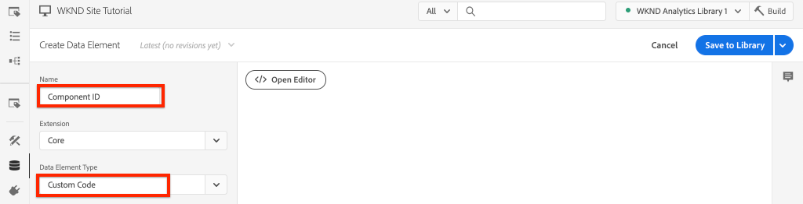

# Tenere traccia del componente su cui è stato fatto clic con Adobe Analytics

>[!NOTE]
>
>Adobe Experience Platform Launch è stato classificato come una suite di tecnologie di raccolta dati in Adobe Experience Platform. Di conseguenza, sono state introdotte diverse modifiche terminologiche nella documentazione del prodotto. Consulta quanto segue [documento](https://experienceleague.adobe.com/docs/experience-platform/tags/term-updates.html) per un riferimento consolidato delle modifiche terminologiche.

Utilizzare il motore basato su eventi [Adobe Client Data Layer con AEM componenti core](https://experienceleague.adobe.com/docs/experience-manager-core-components/using/developing/data-layer/overview.html?lang=it) per tenere traccia dei clic su componenti specifici su un sito Adobe Experience Manager. Scopri come utilizzare le regole nella proprietà tag per rilevare gli eventi di clic, filtrare per componente e inviare i dati a un Adobe Analytics con un beacon di tracciamento dei collegamenti.

## Cosa verrà creato {#what-build}

Il team marketing WKND è interessato a sapere quale `Call to Action (CTA)` Le prestazioni dei pulsanti sono le migliori nella home page. In questa esercitazione, aggiungiamo una regola alla proprietà tag che ascolta il `cmp:click` eventi da **Teaser** e **Pulsante** componenti. Quindi invia l’ID componente e un nuovo evento ad Adobe Analytics insieme al beacon di tracciamento del collegamento.


### Obiettivi {#objective}

1. Crea una regola basata su eventi nella proprietà tag che acquisisce `cmp:click` evento.
1. Filtrare i diversi eventi per tipo di risorsa componente.
1. Imposta l’id del componente e invia un evento ad Adobe Analytics con il beacon di tracciamento del collegamento.

## Prerequisiti

Questa esercitazione è una continuazione di [Raccogliere dati di pagina con Adobe Analytics](./collect-data-analytics.md) e presuppone che:

* A **Proprietà tag** con [Estensione Adobe Analytics](https://experienceleague.adobe.com/docs/experience-platform/tags/extensions/client/analytics/overview.html) abilitato
* **Adobe Analytics** ID suite di rapporti test/dev e server di tracciamento. Consulta la seguente documentazione per [creazione di una suite di rapporti](https://experienceleague.adobe.com/docs/analytics/admin/admin-tools/manage-report-suites/c-new-report-suite/new-report-suite.html).
* [Debugger Experience Platform](https://experienceleague.adobe.com/docs/platform-learn/data-collection/debugger/overview.html) estensione del browser configurata con la proprietà tag caricata sul [Sito WKND](https://wknd.site/us/en.html) o un sito AEM con Adobe Data Layer abilitato.

## Inspect, schema del pulsante e del teaser

Prima di creare regole nella proprietà tag , è utile rivedere il [schema per il pulsante e il teaser](https://experienceleague.adobe.com/docs/experience-manager-core-components/using/developing/data-layer/overview.html#item) e le ispeziona nell’implementazione del livello dati.

1. Passa a [Home page WKND](https://wknd.site/us/en.html)
1. Apri gli strumenti di sviluppo del browser e passa alla **Console**. Esegui il comando seguente:

   ```js
   adobeDataLayer.getState();
   ```

   Il codice riportato sopra restituisce lo stato corrente dell&#39;Adobe Client Data Layer.

   

1. Espandi la risposta e trova le voci con il prefisso `button-` e  `teaser-xyz-cta` voce. Dovresti visualizzare uno schema di dati simile al seguente:

   Schema pulsante:

   ```json
   button-2e6d32893a:
       @type: "wknd/components/button"
       dc:title: "View All"
       parentId: "page-2eee4f8914"
       repo:modifyDate: "2020-07-11T22:17:55Z"
       xdm:linkURL: "/content/wknd/us/en/magazine.html"
   ```

   Schema teaser:

   ```json
   teaser-da32481ec8-cta-adf3c09db9:
       @type: "wknd/components/teaser/cta"
       dc:title: "Surf's Up"
       parentId: "teaser-da32481ec8"
       xdm:linkURL: "/content/wknd/us/en/magazine/san-diego-surf.html"
   ```

   I dettagli dei dati di cui sopra sono basati su [Schema componente/elemento contenitore](https://experienceleague.adobe.com/docs/experience-manager-core-components/using/developing/data-layer/overview.html#item). La nuova regola di tag utilizza questo schema.

## Creare una regola di Invito all&#39;azione selezionata

Il livello dati client di Adobe è un **event** livello dati guidato. Ogni volta che si fa clic su un componente core `cmp:click` viene inviato tramite il livello dati. Per ascoltare i `cmp:click` crea una regola .

1. Accedi ad Experience Platform e alla proprietà tag integrata con il sito AEM.
1. Passa a **Regole** nell’interfaccia utente della proprietà tag, quindi fai clic su **Aggiungi regola**.
1. Denomina la regola **CTA selezionato**.
1. Fai clic su **Eventi** > **Aggiungi** per aprire **Configurazione evento** procedura guidata.
1. Per **Tipo evento** campo , seleziona **Codice personalizzato**.

   

1. Fai clic su **Open Editor** nel pannello principale e immetti il seguente frammento di codice:

   ```js
   var componentClickedHandler = function(evt) {
      // defensive coding to avoid a null pointer exception
      if(evt.hasOwnProperty("eventInfo") && evt.eventInfo.hasOwnProperty("path")) {
         //trigger Tag Rule and pass event
         console.debug("cmp:click event: " + evt.eventInfo.path);
         var event = {
            //include the path of the component that triggered the event
            path: evt.eventInfo.path,
            //get the state of the component that triggered the event
            component: window.adobeDataLayer.getState(evt.eventInfo.path)
         };
   
         //Trigger the Tag Rule, passing in the new `event` object
         // the `event` obj can now be referenced by the reserved name `event` by other Tag Property data elements
         // i.e `event.component['someKey']`
         trigger(event);
      }
   }
   
   //set the namespace to avoid a potential race condition
   window.adobeDataLayer = window.adobeDataLayer || [];
   //push the event listener for cmp:click into the data layer
   window.adobeDataLayer.push(function (dl) {
      //add event listener for `cmp:click` and callback to the `componentClickedHandler` function
      dl.addEventListener("cmp:click", componentClickedHandler);
   });
   ```

   Lo snippet di codice di cui sopra aggiunge un listener di eventi da [spingere una funzione](https://github.com/adobe/adobe-client-data-layer/wiki#pushing-a-function) nel livello dati. Ogni volta che `cmp:click` viene attivato l&#39;evento `componentClickedHandler` viene chiamata la funzione . In questa funzione vengono aggiunti alcuni controlli di integrità e un nuovo `event` viene creato con l&#39;ultima [stato del livello dati](https://github.com/adobe/adobe-client-data-layer/wiki#getstate) per il componente che ha attivato l’evento.

   Infine, `trigger(event)` viene chiamata la funzione . La `trigger()` è un nome riservato nella proprietà tag ed è **trigger** la regola. La `event` l&#39;oggetto viene passato come parametro che a sua volta viene esposto da un altro nome riservato nella proprietà tag. Gli elementi dati nella proprietà tag possono ora fare riferimento a varie proprietà utilizzando uno snippet di codice come `event.component['someKey']`.

1. Salva le modifiche.
1. Successivo sotto **Azioni** click **Aggiungi** per aprire **Configurazione azione** procedura guidata.
1. Per **Tipo di azione** campo, scegli **Codice personalizzato**.

   

1. Fai clic su **Open Editor** nel pannello principale e immetti il seguente frammento di codice:

   ```js
   console.debug("Component Clicked");
   console.debug("Component Path: " + event.path);
   console.debug("Component type: " + event.component['@type']);
   console.debug("Component text: " + event.component['dc:title']);
   ```

   La `event` viene passato dall&#39;oggetto `trigger()` chiamato nell&#39;evento personalizzato. La `component` oggetto è lo stato corrente del componente derivato dal livello dati `getState()` e è l&#39;elemento che ha attivato il clic.

1. Salvare le modifiche ed eseguire un [build](https://experienceleague.adobe.com/docs/experience-platform/tags/publish/builds.html) nella proprietà tag per promuovere il codice nel [ambiente](https://experienceleague.adobe.com/docs/experience-platform/tags/publish/environments/environments.html?lang=it) utilizzato sul sito AEM.

   >[!NOTE]
   >
   > Può essere utile utilizzare il [Debugger Adobe Experience Platform](https://experienceleague.adobe.com/docs/platform-learn/data-collection/debugger/overview.html) per convertire il codice di incorporamento in un **Sviluppo** ambiente.

1. Passa a [Sito WKND](https://wknd.site/us/en.html) e apri gli strumenti per sviluppatori per visualizzare la console. Inoltre, seleziona la **Conserva registro** casella di controllo.

1. Fai clic su uno dei **Teaser** o **Pulsante** Pulsanti CTA per passare a un’altra pagina.

   

1. Osserva nella console per sviluppatori che la **CTA selezionato** La regola è stata attivata:

   

## Creare elementi dati

Crea quindi un elemento dati per acquisire l’ID componente e il titolo su cui hai fatto clic. Ricorda nell&#39;esercizio precedente l&#39;output di `event.path` era qualcosa di simile a `component.button-b6562c963d` e il valore `event.component['dc:title']` Era qualcosa tipo &quot;Viaggi in vista&quot;.

### ID componente

1. Accedi ad Experience Platform e alla proprietà tag integrata con il sito AEM.
1. Passa a **Elementi dati** e fai clic su **Aggiungi nuovo elemento dati**.
1. Per **Nome** campo, immettere **ID componente**.
1. Per **Tipo di elemento dati** campo , seleziona **Codice personalizzato**.

   

1. Fai clic su **Open Editor** e immetti quanto segue nell&#39;editor di codice personalizzato:

   ```js
   if(event && event.path && event.path.includes('.')) {
       // split on the `.` to return just the component ID
       return event.path.split('.')[1];
   }
   ```

1. Salva le modifiche.

   >[!NOTE]
   >
   > Ricorda che la `event` l&#39;oggetto è reso disponibile e delimitato in base all&#39;evento che ha attivato il **Regola** nella proprietà tag . Il valore di un elemento dati non viene impostato finché l’elemento dati non è *referenza* all&#39;interno di una regola. Pertanto è sicuro utilizzare questo elemento dati all’interno di una regola come la **Pagina caricata** regola creata nel passaggio precedente *ma* non sarebbe sicuro da utilizzare in altri contesti.


### Titolo componente

1. Passa a **Elementi dati** e fai clic su **Aggiungi nuovo elemento dati**.
1. Per **Nome** campo, immettere **Titolo componente**.
1. Per **Tipo di elemento dati** campo , seleziona **Codice personalizzato**.
1. Fai clic su **Open Editor** e immetti quanto segue nell&#39;editor di codice personalizzato:

   ```js
   if(event && event.component && event.component.hasOwnProperty('dc:title')) {
       return event.component['dc:title'];
   }
   ```

1. Salva le modifiche.

## Aggiungi una condizione alla regola CTA Clic

Quindi, aggiorna il **CTA selezionato** per garantire che la regola si attivi solo quando `cmp:click` viene attivato per un **Teaser** o **Pulsante**. Poiché il CTA del teaser è considerato un oggetto separato nel livello dati, è importante controllare il padre per verificarlo che provenga da un teaser.

1. Nell’interfaccia utente della proprietà di tag, passa a **CTA selezionato** creato in precedenza.
1. Sotto **Condizioni** click **Aggiungi** per aprire **Configurazione condizione** procedura guidata.
1. Per **Tipo di condizione** campo , seleziona **Codice personalizzato**.

   

1. Fai clic su **Open Editor** e immetti quanto segue nell&#39;editor di codice personalizzato:

   ```js
   if(event && event.component && event.component.hasOwnProperty('@type')) {
       // console.log("Event Type: " + event.component['@type']);
       //Check for Button Type OR Teaser CTA type
       if(event.component['@type'] === 'wknd/components/button' ||
          event.component['@type'] === 'wknd/components/teaser/cta') {
           return true;
       }
   }
   
   // none of the conditions are met, return false
   return false;
   ```

   Il codice di cui sopra controlla prima se il tipo di risorsa proviene da un **Pulsante** o se il tipo di risorsa proveniva da un CTA all’interno di un **Teaser**.

1. Salva le modifiche.

## Impostare le variabili di Analytics e attivare il beacon Track Link

Attualmente **CTA selezionato** restituisce semplicemente un&#39;istruzione console. Quindi, utilizza gli elementi dati e l’estensione Analytics per impostare le variabili Analytics come **action**. Imposta anche un’azione aggiuntiva per attivare la **Traccia collegamento** e inviare i dati raccolti ad Adobe Analytics.

1. In **CTA selezionato** regola, **remove** la **Core - Codice personalizzato** azione (le istruzioni della console):

   

1. In Azioni, fai clic su **Aggiungi** per creare un’azione.
1. Imposta la **Estensione** digitare **Adobe Analytics** e imposta **Tipo di azione** a  **Imposta variabili**.

1. Imposta i seguenti valori per **eVar**, **Proprietà** e **Eventi**:

   * `evar8` - `%Component ID%`
   * `prop8` - `%Component ID%`
   * `event8`

   

   >[!NOTE]
   >
   > Qui `%Component ID%` viene utilizzato in quanto garantisce un identificatore univoco per il CTA su cui è stato fatto clic. Un potenziale svantaggio nell&#39;utilizzo di `%Component ID%` è che il rapporto di Analytics contiene valori come `button-2e6d32893a`. Utilizzo della `%Component Title%` darebbe un nome più umano amichevole, ma il valore potrebbe non essere unico.

1. Quindi, aggiungi un’azione in più a destra di **Adobe Analytics - Impostare le variabili** toccando **plus** icona:

   

1. Imposta la **Estensione** digitare **Adobe Analytics** e imposta **Tipo di azione** a  **Invia beacon**.
1. Sotto **Tracking** imposta il pulsante di scelta su **`s.tl()`**.
1. Per **Tipo di collegamento** campo, scegli **Collegamento personalizzato** e **Nome collegamento** imposta il valore su: **`%Component Title%: CTA Clicked`**:

   

   La configurazione di cui sopra combina la variabile dinamica dall’elemento dati **Titolo componente** e la stringa statica **CTA selezionato**.

1. Salva le modifiche. La **CTA selezionato** La regola deve ora avere la seguente configurazione:

   

   * **1.** Ascolta i `cmp:click` evento.
   * **2.** Controlla che l&#39;evento sia stato attivato da un **Pulsante** o **Teaser**.
   * **3.** Imposta le variabili di Analytics per tenere traccia dei **ID componente** come **eVar**, **prop** e un **event**.
   * **4.** Invia il beacon Track Link di Analytics (e fai **not** trattarla come visualizzazione di una pagina).

1. Salva tutte le modifiche e crea la libreria di tag , promuovendo l’ambiente appropriato.

## Convalida il beacon Track Link e la chiamata di Analytics

Ora che **CTA selezionato** La regola invia il beacon di Analytics, dovresti essere in grado di visualizzare le variabili di tracciamento di Analytics utilizzando il debugger di Experience Platform.

1. Apri [Sito WKND](https://wknd.site/us/en.html) nel browser.
1. Fai clic sull’icona Debugger  per aprire Experience Platform Debugger.
1. Assicurati che Debugger mappi la proprietà tag in *le* Ambiente di sviluppo, come descritto in precedenza e **Registrazione console** è controllata.
1. Apri il menu Analytics e verifica che la suite di rapporti sia impostata su *le* suite di rapporti.

   

1. Nel browser, fai clic su una delle **Teaser** o **Pulsante** Pulsanti CTA per passare a un’altra pagina.

   

1. Torna a Experience Platform Debugger, scorri verso il basso ed espandi **Richieste di rete** > *Suite di rapporti*. Dovresti essere in grado di trovare il **eVar**, **prop** e **event** impostato.

   

1. Torna al browser e apri la console per sviluppatori. Passa al piè di pagina del sito e fai clic su uno dei collegamenti di navigazione:

   

1. Osserva il messaggio nella console del browser *&quot;Codice personalizzato&quot; per la regola &quot;CTA cliccato&quot; non è stato soddisfatto*.

   Il messaggio di cui sopra è dovuto al fatto che il componente Navigazione attiva un `cmp:click` event *ma* a causa di [Condizione alla regola](#add-a-condition-to-the-cta-clicked-rule) verifica che il tipo di risorsa non venga eseguita alcuna azione.

   >[!NOTE]
   >
   > Se non trovi registri della console, assicurati che **Registrazione console** è controllato in **Experience Platform di tag** in Experience Platform Debugger.

## Congratulazioni. 

Hai appena utilizzato Adobe Client Data Layer e Tag basati sugli eventi in Experience Platform per tenere traccia dei clic di componenti specifici su un sito AEM.
