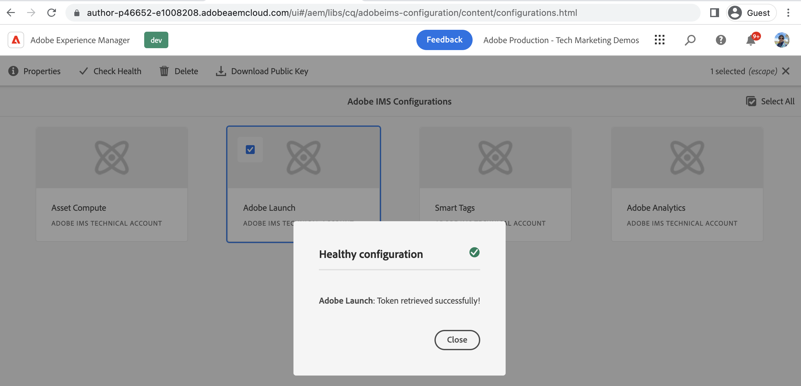

# Connettere AEM Sites con la proprietà Tag utilizzando IMS{#connect-aem-and-tag-property-using-ims}

Scopri come collegare l’AEM alla proprietà tags utilizzando la configurazione IMS (Identity Management System) nell’AEM. Questa configurazione autentica l’AEM con l’API dei tag e consente all’AEM di comunicare tramite le API dei tag per accedere alle proprietà dei tag.

## Creare o riutilizzare la configurazione IMS

La configurazione IMS tramite il progetto Adobe Developer Console è necessaria per integrare l’AEM con la nuova proprietà Tag. Questa configurazione consente all’AEM di comunicare con l’applicazione Tags utilizzando le API di tag e IMS gestisce l’aspetto della sicurezza di questa integrazione.

Ogni volta che viene eseguito il provisioning di un ambiente AEM as a Cloud Service, vengono create automaticamente alcune configurazioni IMS come Asset Compute, Adobe Analytics e tag. È possibile utilizzare i **tag creati automaticamente nella configurazione IMS di Adobe Experience Platform** oppure è necessario creare una nuova configurazione IMS se si utilizza un ambiente AEM 6.X.

Rivedi i **tag creati automaticamente nella configurazione IMS di Adobe Experience Platform** utilizzando la procedura seguente.

1. In AEM Author apri il menu **Strumenti**
1. Nella sezione Sicurezza, seleziona Configurazioni Adobe IMS.
1. Seleziona la scheda **Adobe Launch** e fai clic su **Proprietà**, controlla i dettagli dalle schede **Certificato** e **Account**. Quindi fai clic su **Annulla** per tornare senza modificare i dettagli creati automaticamente.
1. Seleziona la scheda **Adobe Launch** e ora fai clic su **Verifica stato**. Dovresti visualizzare il messaggio **Success** come di seguito.

   

## Passaggi successivi

[Creare una configurazione del Cloud Service di tag nell’AEM](create-aem-launch-cloud-service.md)
