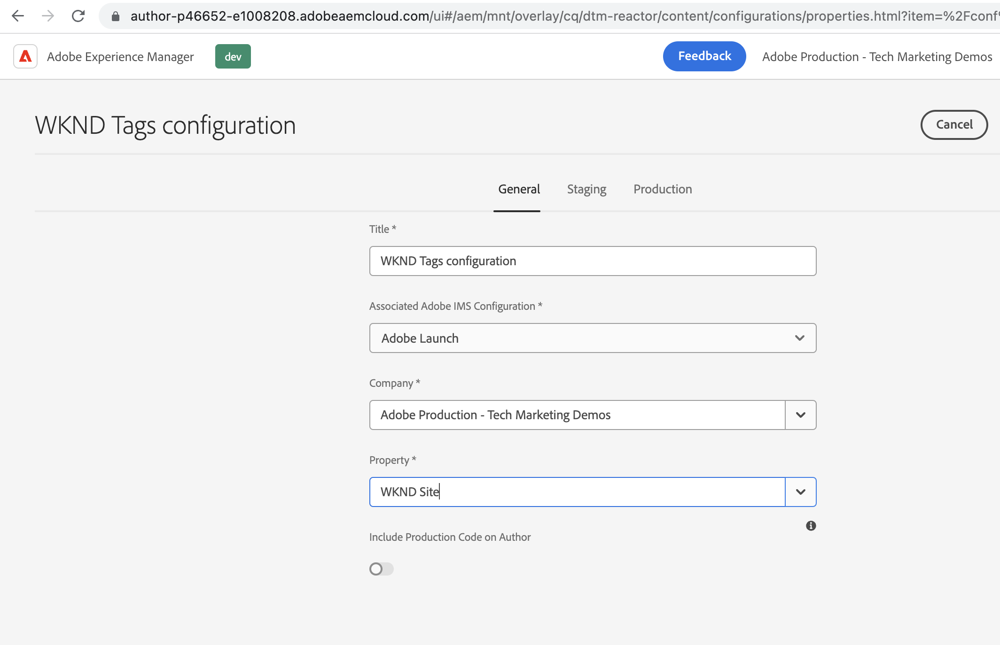

# Creare una configurazione di Cloud Service Launch in AEM {#create-launch-cloud-service}

>[!NOTE]
>
>Il processo di ridenominazione di Adobe Experience Platform Launch come set di tecnologie di raccolta dati è in corso di implementazione nell’interfaccia utente, nel contenuto e nella documentazione del prodotto AEM, pertanto il termine Launch è ancora in uso qui.

Scopri come creare una configurazione di un Cloud Service Launch in Adobe Experience Manager. AEM la configurazione del Cloud Service Launch può quindi essere applicata a un sito esistente e le librerie Tag possono essere osservate durante il caricamento sia negli ambienti Author che Publish.

## Creare un servizio cloud Launch

Crea la configurazione del servizio cloud Launch seguendo i passaggi seguenti.

1. Da **Strumenti** menu, seleziona **Cloud Services** e fai clic su **Configurazioni di Adobe Launch**

1. Seleziona la cartella di configurazione del sito o seleziona **Sito WKND** (se utilizzi un progetto guida WKND) e fai clic su **Crea**

1. Da _Generale_ scheda , assegna un nome alla configurazione utilizzando **Titolo** e seleziona **Adobe Launch** dal _Configurazione Adobe IMS associata_ a discesa. Quindi, seleziona il nome della tua società dal _Azienda_ dal menu a discesa e seleziona la proprietà creata in precedenza dal _Proprietà_ a discesa.

1. Da _Staging_ e _Produzione_ Mantieni le configurazioni predefinite. Tuttavia, si consiglia di rivedere e modificare le configurazioni per la configurazione della produzione reale, in particolare la _Carica libreria in modo asincrono_ in base ai requisiti di prestazioni e ottimizzazione. Tieni presente che _URI libreria_ è diverso per Staging e Produzione.

1. Infine, fai clic su **Crea** per completare i servizi cloud di Launch.

   

## Applica il servizio cloud Launch al sito

Per caricare la proprietà Tag e le relative librerie sul sito AEM, la configurazione del servizio cloud Launch viene applicata al sito. Nel passaggio precedente la configurazione del servizio cloud viene creata sotto la cartella del nome del sito (sito WKND), quindi deve essere applicata automaticamente, verifichiamolo.

1. Da **Navigazione** menu, seleziona **Sites** icona.

1. Selezionare la pagina principale del sito AEM e fare clic su **Proprietà**. Quindi, passa alla **Avanzate** scheda e sotto **Configurazione** verifica che il valore di Cloud Configuration punti al tuo sito specifico `conf` cartella.

   

## Verificare il caricamento della proprietà Tag nelle pagine Autore e Pubblica

Ora è il momento di verificare che la proprietà Tag e le relative librerie siano caricate sulla pagina del sito AEM.

1. Apri la pagina del tuo sito preferito in **Visualizza come pubblicato** nella console del browser dovrebbe essere visualizzato il messaggio di log. È lo stesso messaggio dallo snippet di codice JavaScript della regola di proprietà Tag attivato quando _Libreria caricata (Pagina in alto)_ viene attivato.

1. Per verificare l’avvenuta pubblicazione, pubblica prima la tua **Launch cloud service** configura e apri la pagina del sito nell’istanza Pubblica .

   

Congratulazioni. Hai completato l’integrazione dei tag di AEM e raccolta dati che inserisce il codice JavaScript nel tuo sito AEM senza aggiornare il codice del progetto AEM.

## Sfida: aggiornare e pubblicare la regola nella proprietà Tag

Utilizza le lezioni tratte dal precedente [Creare una proprietà tag](./create-tag-property.md) per completare la semplice sfida, aggiorna la regola esistente per aggiungere un’ulteriore istruzione console e utilizza _Flusso di pubblicazione_ distribuirlo sul sito AEM.

## Passaggi successivi

[Debug dell’implementazione dei tag](debug-tags-implementation.md)
