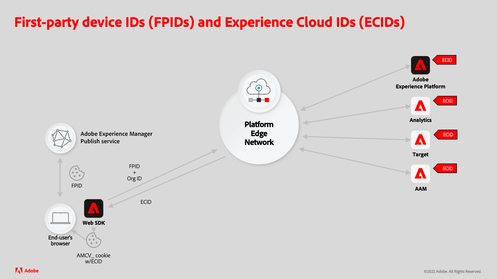

# Generare FPID di Experience Platform con AEM Sites

L’integrazione di siti Adobe Experience Manager (AEM) forniti tramite AEM Publish con Adobe Experience Platform (AEP) richiede che l’AEM generi e mantenga un cookie FPID (first party device ID) univoco per poter tenere traccia in modo univoco dell’attività dell’utente.

Il cookie FPID deve essere impostato dal server (AEM Publish) invece di utilizzare JavaScript per creare un cookie lato client. Questo perché i browser moderni, come Safari e Firefox, possono bloccare o far scadere rapidamente i cookie generati da JavaScript.

Leggi la documentazione di supporto per [scoprire i dettagli sulla collaborazione tra gli ID dispositivo di prima parte e gli ID Experience Cloud](https://experienceleague.adobe.com/docs/platform-learn/data-collection/edge-network/generate-first-party-device-ids.html?lang=en).

Di seguito è riportata una panoramica del funzionamento degli FPID quando si utilizza l’AEM come host web.



## Generare e mantenere l’FPID con AEM

Il servizio Publish AEM ottimizza le prestazioni memorizzando nella cache il maggior numero possibile di richieste, sia nella cache Dispatcher CDN che AEM.

È fondamentale che le richieste HTTP che generano il cookie FPID univoco per utente e restituiscono il valore FPID non vengano mai memorizzate nella cache e servite direttamente da AEM Publish, che può implementare una logica per garantire l’univocità.

Evita di generare il cookie FPID nelle richieste di pagine web o di altre risorse memorizzabili in cache, in quanto la combinazione dei requisiti di univocità dell’FPID renderebbe queste risorse non memorizzabili in cache.

Il diagramma seguente descrive il modo in cui il servizio Publish dell’AEM gestisce gli FPID.


1. Il browser web richiede una pagina web ospitata dall’AEM. La richiesta può essere servita utilizzando una copia memorizzata nella cache della pagina web dalla CDN o dalla cache Dispatcher dell’AEM.
1. Se la pagina web non può essere servita da cache Dispatcher CDN o AEM, la richiesta raggiunge il servizio AEM Publish, che genera la pagina web richiesta.
1. La pagina web viene quindi restituita al browser web, popolando le cache che non potevano servire la richiesta. Con l’AEM, prevedi che le percentuali di hit della cache di CDN e AEM Dispatcher siano superiori al 90%.
1. La pagina web contiene JavaScript che effettua una richiesta XHR (AJAX) asincrona non memorizzabile in cache a un servlet FPID personalizzato nel servizio AEM Publish. Poiché si tratta di una richiesta non memorizzabile in cache (in virtù del parametro di query casuale e delle intestazioni Cache-Control ), non viene mai memorizzata nella cache da CDN o AEM Dispatcher e raggiunge sempre il servizio AEM Publish per generare la risposta.
1. Il servlet FPID personalizzato nel servizio AEM Publish elabora la richiesta, generando un nuovo FPID quando non viene trovato alcun cookie FPID esistente, o estende la durata di qualsiasi cookie FPID esistente. Il servlet restituisce anche l’FPID nel corpo della risposta per l’utilizzo da parte di JavaScript lato client. Fortunatamente, la logica del servlet FPID personalizzato è leggera e impedisce a questa richiesta di influire sulle prestazioni del servizio AEM Publish.
1. La risposta per la richiesta XHR restituisce al browser con il cookie FPID e l’FPID come JSON nel corpo della risposta per l’utilizzo da parte di Platform Web SDK.

## Esempio di codice

Il codice e la configurazione seguenti possono essere distribuiti al servizio Publish dell’AEM per creare un endpoint che genera o estende la durata di un cookie FPID esistente e restituisce l’FPID come JSON.

### Servlet cookie FPID di AEM Publish

È necessario creare un endpoint HTTP Publish per AEM per generare o estendere un cookie FPID, utilizzando un servlet [Sling](https://sling.apache.org/documentation/the-sling-engine/servlets.html#registering-a-servlet-using-java-annotations-1).

+ Il servlet è associato a `/bin/aem/fpid` perché per accedervi non è necessaria l&#39;autenticazione. Se è richiesta l’autenticazione, effettua un binding a un tipo di risorsa Sling.
+ Il servlet accetta le richieste HTTP GET. La risposta è contrassegnata con `Cache-Control: no-store` per impedire il caching, ma questo endpoint deve essere richiesto utilizzando anche parametri di query univoci per il busting della cache.

Quando una richiesta HTTP raggiunge il servlet, quest’ultimo controlla se nella richiesta esiste un cookie FPID:

+ Se è presente un cookie FPID, estendi la durata del cookie e raccogli il relativo valore per scriverlo nella risposta.
+ Se non esiste un cookie FPID, genera un nuovo cookie FPID e salva il valore da scrivere nella risposta.

Il servlet scrive quindi l&#39;FPID nella risposta come oggetto JSON nel formato: `{ fpid: "<FPID VALUE>" }`.

È importante fornire l&#39;FPID al client nel corpo poiché il cookie FPID è contrassegnato `HttpOnly`, il che significa che solo il server può leggerne il valore e JavaScript lato client non può. Per evitare di recuperare inutilmente l&#39;FPID a ogni caricamento di pagina, viene impostato anche un cookie `FPID_CLIENT` che indica che l&#39;FPID è stato generato ed espone il valore al JavaScript lato client per l&#39;utilizzo.

Il valore FPID viene utilizzato per parametrizzare le chiamate tramite Platform Web SDK.

Di seguito è riportato il codice di esempio di un endpoint servlet AEM (disponibile tramite `HTTP GET /bin/aep/fpid`) che genera o aggiorna un cookie FPID e restituisce l&#39;FPID come JSON.

+ `core/src/main/java/com/adobe/aem/guides/wkndexamples/core/aep/impl/FpidServlet.java`

```java
package com.adobe.aem.guides.wkndexamples.core.aep.impl;

import com.google.gson.JsonObject;
import org.apache.sling.api.SlingHttpServletRequest;
import org.apache.sling.api.SlingHttpServletResponse;
import org.apache.sling.api.servlets.SlingAllMethodsServlet;
import org.osgi.service.component.annotations.Component;
import org.slf4j.Logger;
import org.slf4j.LoggerFactory;

import javax.servlet.Servlet;
import javax.servlet.http.Cookie;
import java.io.IOException;
import java.util.UUID;

import static org.apache.sling.api.servlets.ServletResolverConstants.SLING_SERVLET_PATHS;
import static org.apache.sling.api.servlets.ServletResolverConstants.SLING_SERVLET_METHODS;

@Component(
        service = {Servlet.class},
        property = {
                SLING_SERVLET_PATHS + "=/bin/aep/fpid",
                SLING_SERVLET_METHODS + "=GET"
        }
)
public class FpidServlet extends SlingAllMethodsServlet {
    private static final Logger log = LoggerFactory.getLogger(FpidServlet.class);
    private static final String COOKIE_NAME = "FPID";
    private static final String CLIENT_COOKIE_NAME = "FPID_CLIENT";
    private static final String COOKIE_PATH = "/";
    private static final int COOKIE_MAX_AGE = 60 * 60 * 24 * 30 * 13; // 13 months
    private static final String JSON_KEY = "fpid";

    @Override
    protected final void doGet(SlingHttpServletRequest request, SlingHttpServletResponse response) throws IOException {
        // Try to get an existing FPID cookie, this will give us the user's current FPID if it exists
        final Cookie existingCookie = request.getCookie(COOKIE_NAME);

        String cookieValue;

        if (existingCookie == null) {
            //  If no FPID cookie exists, create a new FPID UUID
            cookieValue = UUID.randomUUID().toString();
        } else {
            // If a FPID cookie exists, get its FPID UUID so its life can be extended
            cookieValue = existingCookie.getValue();
        }

        // Add the FPID value to the response, either newly generated or the extended one
        // This can be read by the Server (AEM Publish) due to HttpOnly flag.
        response.addHeader("Set-Cookie",
                COOKIE_NAME + "=" + cookieValue + "; " +
                        "Max-Age=" + COOKIE_MAX_AGE + "; " +
                        "Path=" + COOKIE_PATH + "; " +
                        "HttpOnly; " +
                        "Secure; " +
                        "SameSite=Lax");

        // Also set FPID_CLIENT cookie to avoid further server-side FPID generation
        // This can be read by the client-side JavaScript to check if FPID is already generated
        // or if it needs to be requested from server (AEM Publish)
        response.addHeader("Set-Cookie",
                CLIENT_COOKIE_NAME + "=" + cookieValue + "; " +
                        "Max-Age=" + COOKIE_MAX_AGE + "; " +
                        "Path=" + COOKIE_PATH + "; " +
                        "Secure; " + 
                        "SameSite=Lax");

        // Avoid caching the response
        response.addHeader("Cache-Control", "no-store");

        // Return FPID in the response as JSON for client-side access
        final JsonObject json = new JsonObject();
        json.addProperty(JSON_KEY, cookieValue);

        response.setContentType("application/json");
        response.getWriter().write(json.toString());
```

### Script HTML

È necessario aggiungere alla pagina un JavaScript lato client personalizzato per richiamare in modo asincrono il servlet, generando o aggiornando il cookie FPID e restituendo l’FPID nella risposta.

Questo script di JavaScript viene in genere aggiunto alla pagina utilizzando uno dei seguenti metodi:

+ [Tag in Adobe Experience Platform](https://experienceleague.adobe.com/docs/experience-platform/tags/home.html)
+ [Libreria client AEM](https://experienceleague.adobe.com/docs/experience-manager-cloud-service/content/implementing/developing/full-stack/clientlibs.html?lang=en)

La chiamata XHR al servlet FPID dell’AEM personalizzato è veloce, anche se asincrona, quindi è possibile per un utente visitare una pagina web servita dall’AEM e spostarsi prima che la richiesta possa essere completata.
In questo caso, lo stesso processo tenterà di nuovo al successivo caricamento di una pagina web da AEM.

Il GET HTTP al servlet FPID dell&#39;AEM (`/bin/aep/fpid`) è parametrizzato con un parametro di query casuale per garantire che qualsiasi infrastruttura tra il browser e il servizio Publish dell&#39;AEM non memorizzi nella cache la risposta della richiesta.
Analogamente, viene aggiunta l&#39;intestazione di richiesta `Cache-Control: no-store` per supportare l&#39;eliminazione del caching.

Dopo una chiamata del servlet FPID dell&#39;AEM, l&#39;FPID viene recuperato dalla risposta JSON e utilizzato da [Platform Web SDK](https://experienceleague.adobe.com/docs/platform-learn/implement-web-sdk/tags-configuration/install-web-sdk.html?lang=en) per inviarlo alle API Experience Platform.

Per ulteriori informazioni sull&#39;utilizzo di [FPID in identityMap](https://experienceleague.adobe.com/docs/experience-platform/edge/identity/first-party-device-ids.html#identityMap), consulta la documentazione dell&#39;Experience Platform

```javascript
...
<script>
    // Wrap in anonymous function to avoid global scope pollution

    (function() {
        // Utility function to get a cookie value by name
        function getCookie(name) {
            const value = `; ${document.cookie}`;
            const parts = value.split(`; ${name}=`);
            if (parts.length === 2) return parts.pop().split(';').shift();
        }

        // Async function to handle getting the FPID via fetching from AEM, or reading an existing FPID_CLIENT cookie
        async function getFpid() {
            let fpid = getCookie('FPID_CLIENT');
            
            // If FPID can be retrieved from FPID_CLIENT then skip fetching FPID from server
            if (!fpid) {
                // Fetch FPID from the server if no FPID_CLIENT cookie value is present
                try {
                    const response = await fetch(`/bin/aep/fpid?_=${new Date().getTime() + '' + Math.random()}`, {
                        method: 'GET',
                        headers: {
                            'Cache-Control': 'no-store'
                        }
                    });
                    const data = await response.json();
                    fpid = data.fpid;
                } catch (error) {
                    console.error('Error fetching FPID:', error);
                }
            }

            console.log('My FPID is: ', fpid);
            return fpid;
        }

        // Invoke the async function to fetch or skip FPID
        const fpid = await getFpid();

        // Add the fpid to the identityMap in the Platform Web SDK
        // and/or send to AEP via AEP tags or direct AEP Web SDK calls (alloy.js)
    })();
</script>
```

### Filtro Consenti Dispatcher

Infine, le richieste HTTP GET al servlet FPID personalizzato devono essere consentite tramite la configurazione `filter.any` di Dispatcher AEM.

Se questa configurazione di Dispatcher non è implementata correttamente, le richieste HTTP GET a `/bin/aep/fpid` restituiranno il valore 404.

+ `dispatcher/src/conf.dispatcher.d/filters/filters.any`

```
/1099 { /type "allow" /method "GET" /url "/bin/aep/fpid" }
```

## Risorse di Experience Platform

Consulta la seguente documentazione di Experience Platform per gli ID dispositivo di prime parti (FPID) e per la gestione dei dati di identità con Platform Web SDK.

+ [Genera ID dispositivo di prime parti](https://experienceleague.adobe.com/docs/platform-learn/data-collection/edge-network/generate-first-party-device-ids.html)
+ [ID dispositivo di prime parti in Platform Web SDK](https://experienceleague.adobe.com/docs/experience-platform/edge/identity/first-party-device-ids.html)
+ [Dati di identità in Platform Web SDK](https://experienceleague.adobe.com/docs/experience-platform/edge/identity/overview.html)
