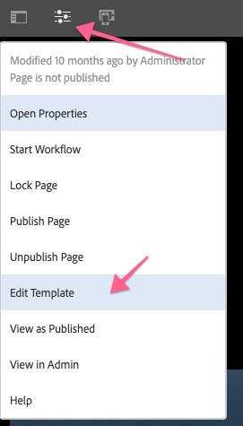
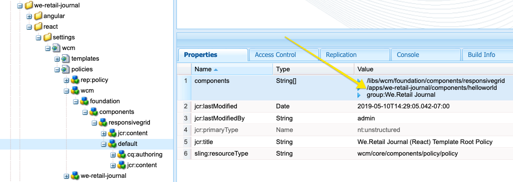
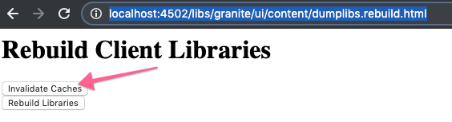

# Sviluppo con l’editor di SPA AEM - Tutorial di Hello World {#developing-with-the-aem-spa-editor-hello-world-tutorial}

>[!WARNING]
>
> Questa esercitazione è **obsoleta**. Si consiglia di seguire: [Guida introduttiva all&#39;editor di SPA AEM e all&#39;Angular](https://experienceleague.adobe.com/docs/experience-manager-learn/getting-started-with-aem-headless/spa-editor/angular/overview.html) o [Guida introduttiva all&#39;editor di SPA AEM e React](https://experienceleague.adobe.com/docs/experience-manager-learn/getting-started-with-aem-headless/spa-editor/react/overview.html)

AEM Editor SPA supporta la modifica contestuale di un’applicazione o SPA a pagina singola. Questa esercitazione è un&#39;introduzione SPA sviluppo da utilizzare con AEM Editor JS SDK. L’esercitazione estenderà l’app We.Retail Journal aggiungendo un componente personalizzato Hello World . Gli utenti possono completare l’esercitazione utilizzando i framework React o Angular.

>[!NOTE]
>
> La funzione Editor applicazioni a pagina singola (SPA) richiede AEM service pack 2 o successivo 6.4.
>
> L’editor di SPA è la soluzione consigliata per i progetti che richiedono SPA rendering lato client basato su framework (ad esempio, React o Angular).

## Lettura obbligatoria {#prereq}

Questa esercitazione ha lo scopo di evidenziare i passaggi necessari per mappare un componente SPA a un componente AEM per abilitare la modifica nel contesto. Gli utenti che iniziano questa esercitazione devono avere familiarità con i concetti di base dello sviluppo con Adobe Experience Manager, AEM e sviluppare con i framework React of Angular. L’esercitazione tratta sia le attività di sviluppo back-end che quelle front-end.

Prima di avviare questa esercitazione, è consigliabile consultare le risorse seguenti:

* [Video sulle funzioni dell’editor di SPA](spa-editor-framework-feature-video-use.md) : panoramica video dell’editor di SPA e dell’app Journal di We.Retail.
* [Esercitazione](https://reactjs.org/tutorial/tutorial.html)  React.js - Introduzione allo sviluppo con il framework React.
* [Tutorial](https://angular.io/tutorial)  su Angular - Introduzione allo sviluppo con Angular

## Ambiente di sviluppo locale {#local-dev}

Questa esercitazione è progettata per:

[Adobe Experience Manager 6.5](https://helpx.adobe.com/it/experience-manager/6-5/release-notes.html) o  [Adobe Experience Manager 6.4](https://helpx.adobe.com/experience-manager/6-4/sites/deploying/using/technical-requirements.html) +  [Service Pack 5](https://helpx.adobe.com/it/experience-manager/6-4/release-notes/sp-release-notes.html)

In questa esercitazione devono essere installate le seguenti tecnologie e strumenti:

1. [Java 11](https://downloads.experiencecloud.adobe.com/content/software-distribution/en/general.html)
2. [Apache Maven - 3.3.1+](https://maven.apache.org/)
3. [Node.js - 8.11.1+](https://nodejs.org/it/) e npm 5.6.0+ (npm è installato con node.js)

Controllare l&#39;installazione degli strumenti di cui sopra aprendo un nuovo terminale ed eseguendo quanto segue:

```shell
$ java -version
java version "11 +"

$ mvn -version
Apache Maven 3.3.9

$ node --version
v8.11.1

$ npm --version
6.1.0
```

## Panoramica {#overview}

Il concetto di base consiste nel mappare un componente SPA a un componente AEM. I componenti AEM, che eseguono lato server, esportano il contenuto sotto forma di JSON. Il contenuto JSON viene utilizzato dal SPA, che esegue lato client nel browser. Viene creata una mappatura 1:1 tra SPA componenti e un componente AEM.


I framework popolari [React JS](https://reactjs.org/) e [Angular](https://angular.io/) sono supportati come predefiniti. Gli utenti possono completare questa esercitazione in Angular o React, a prescindere dal framework utilizzato.

## Configurazione del progetto {#project-setup}

SPA sviluppo ha un piede nello sviluppo AEM e l&#39;altro fuori. L&#39;obiettivo è quello di consentire lo sviluppo SPA in modo indipendente e (soprattutto) agnostico per AEM.

* SPA progetti possono operare indipendentemente dal progetto AEM durante lo sviluppo front-end.
* Continuano ad essere utilizzati strumenti e tecnologie di compilazione front-end come Webpack, NPM, [!DNL Grunt] e [!DNL Gulp].
* Per creare AEM, il progetto SPA viene compilato e automaticamente incluso nel progetto AEM.
* Pacchetti AEM standard utilizzati per distribuire il SPA in AEM.


*SPA sviluppo ha un piede nello sviluppo AEM, e l&#39;altro fuori - permettendo SPA sviluppo di avvenire in modo indipendente, e (per lo più) agnostico a AEM.*

L’obiettivo di questa esercitazione è quello di estendere l’app We.Retail Journal con un nuovo componente. Per iniziare, scarica il codice sorgente per l’app We.Retail Journal e distribuisci a un AEM locale.

1. **** Scarica il codice Journal  [We.Retail più recente da GitHub](https://github.com/adobe/aem-sample-we-retail-journal).

   Oppure duplica l’archivio dalla riga di comando:

   ```shell
   $ git clone git@github.com:adobe/aem-sample-we-retail-journal.git
   ```

   >[!NOTE]
   >
   >L’esercitazione funzionerà sul ramo **master** con la versione **1.2.1-SNAPSHOT** del progetto.

1. La seguente struttura deve essere visibile:

   

   Il progetto contiene i seguenti moduli Maven:

   * `all`: Incorpora e installa l’intero progetto in un unico pacchetto.
   * `bundles`: Contiene due bundle OSGi: beni comuni e core che contengono  [!DNL Sling Models] e altro codice Java.
   * `ui.apps`: contiene le parti /apps del progetto, ad esempio clientlibs JS e CSS, componenti, configurazioni specifiche della modalità runmode.
   * `ui.content`: contiene contenuti e configurazioni strutturali (`/content`,  `/conf`)
   * `react-app`: Applicazione React Journal We.Retail Questo è sia un modulo Maven che un progetto webpack.
   * `angular-app`: Applicazione di Angular We.Retail Journal Si tratta sia di un modulo [!DNL Maven] che di un progetto webpack.

1. Apri una nuova finestra del terminale ed esegui il seguente comando per creare e distribuire l&#39;intera app in un&#39;istanza AEM locale in esecuzione su [http://localhost:4502](Http://localhost:4502).

   ```shell
   $ cd <src>/aem-sample-we-retail-journal
   $ mvn -PautoInstallSinglePackage clean install
   ```

   >[!NOTE]
   >
   > In questo progetto il profilo Maven da generare e creare il pacchetto dell’intero progetto è `autoInstallSinglePackage`

   >[!CAUTION]
   >
   > Se ricevi un errore durante la creazione, [assicurati che il file Maven settings.xml includa l&#39;archivio degli artefatti Maven di Adobe](https://helpx.adobe.com/experience-manager/kb/SetUpTheAdobeMavenRepository.html).

1. Accedi a:

   * [http://localhost:4502/editor.html/content/we-retail-journal/react/en/home.html](http://localhost:4502/editor.html/content/we-retail-journal/react/en/home.html)
   * [http://localhost:4502/editor.html/content/we-retail-journal/angular/en/home.html](http://localhost:4502/editor.html/content/we-retail-journal/angular/en/home.html)

   L’app We.Retail Journal deve essere visualizzata all’interno dell’editor AEM Sites.

1. In modalità [!UICONTROL Modifica], seleziona un componente da modificare ed effettua un aggiornamento al contenuto.

   

1. Seleziona l’icona [!UICONTROL Proprietà pagina] per aprire [!UICONTROL Proprietà pagina]. Seleziona [!UICONTROL Modifica modello] per aprire il modello della pagina.

   

1. Nell’ultima versione dell’Editor di SPA, [Modelli modificabili](https://helpx.adobe.com/it/experience-manager/6-5/sites/developing/using/page-templates-editable.html) può essere utilizzato nello stesso modo delle implementazioni di Sites tradizionali. Questo verrà rivisto in seguito con il nostro componente personalizzato.

   >[!NOTE]
   >
   > Solo AEM 6.5 e AEM 6.4 + **Service Pack 5** supportano i modelli modificabili.

## Panoramica dello sviluppo {#development-overview}


SPA iterazioni di sviluppo si verificano indipendentemente da AEM. Quando il SPA è pronto per essere distribuito in AEM, si verificano i seguenti passaggi di alto livello (come illustrato in precedenza).

1. Viene richiamata la build del progetto AEM, che a sua volta attiva una build del progetto SPA. Il giornale di registrazione We.Retail utilizza il tag [**frontend-maven-plugin**](https://github.com/eirslett/frontend-maven-plugin).
1. Il progetto SPA [**aem-clientlib-generator**](https://www.npmjs.com/package/aem-clientlib-generator) incorpora il SPA compilato come libreria client AEM nel progetto AEM.
1. Il progetto AEM genera un pacchetto AEM, inclusa la SPA compilata, più qualsiasi altro codice AEM di supporto.

## Crea componente AEM {#aem-component}

**Persona: Sviluppatore AEM**

Viene creato prima un componente AEM. Il componente AEM è responsabile del rendering delle proprietà JSON lette dal componente React. Il componente AEM fornisce anche una finestra di dialogo per tutte le proprietà modificabili del componente.

Utilizzando [!DNL Eclipse] o un altro [!DNL IDE], importa il progetto Maven di We.Retail Journal.

1. Aggiorna il reattore **pom.xml** per rimuovere il plugin [!DNL Apache Rat]. Questo plug-in controlla ogni file per assicurarsi che sia presente un’intestazione di Licenza. Per i nostri scopi non dobbiamo preoccuparci di questa funzionalità.

   In **aem-sample-we-retail-journal/pom.xml** rimuovere **apache-rate-plugin**:

   ```xml
   <!-- Remove apache-rat-plugin -->
   <plugin>
           <groupId>org.apache.rat</groupId>
           <artifactId>apache-rat-plugin</artifactId>
           <configuration>
               <excludes combine.children="append">
                   <exclude>*</exclude>
                       ...
               </excludes>
           </configuration>
           <executions>
                   <execution>
                       <phase>verify</phase>
                       <goals>
                           <goal>check</goal>
                       </goals>
               </execution>
           </executions>
       </plugin>
   ```

1. Nel modulo **we-retail-journal-content** (`<src>/aem-sample-we-retail-journal/ui.apps`) crea un nuovo nodo sotto `ui.apps/jcr_root/apps/we-retail-journal/components` denominato **helloworld** di tipo **cq:Component**.
1. Aggiungi le seguenti proprietà al componente **helloworld**, rappresentato in XML (`/helloworld/.content.xml`) di seguito:

   ```xml
   <?xml version="1.0" encoding="UTF-8"?>
   <jcr:root xmlns:cq="http://www.day.com/jcr/cq/1.0" xmlns:jcr="http://www.jcp.org/jcr/1.0"
       jcr:description="Hello World Component for We.Retail Journal"
       jcr:primaryType="cq:Component"
       jcr:title="Hello World"
       componentGroup="We.Retail Journal" />
   ```

   

   >[!NOTE]
   >
   > Per illustrare la funzione Modelli modificabili, abbiamo impostato appositamente `componentGroup="Custom Components"`. In un progetto reale, è meglio ridurre al minimo il numero di gruppi di componenti, quindi un gruppo migliore sarebbe &quot;[!DNL We.Retail Journal]&quot; per corrispondere agli altri componenti di contenuto.
   >
   > Solo AEM 6.5 e AEM 6.4 + **Service Pack 5** supportano modelli modificabili.

1. Verrà quindi creata una finestra di dialogo per consentire la configurazione di un messaggio personalizzato per il componente **Hello World** . Sotto `/apps/we-retail-journal/components/helloworld` aggiungi un nome di nodo **cq:dialog** di **nt:unstructured**.
1. Il **cq:dialog** visualizzerà un singolo campo di testo che persiste del testo a una proprietà denominata **[!DNL message]**. Sotto la nuova creazione **cq:dialog** aggiungi i seguenti nodi e proprietà, rappresentati in XML di seguito (`helloworld/_cq_dialog/.content.xml`) :

   ```xml
   <?xml version="1.0" encoding="UTF-8"?>
   <jcr:root xmlns:sling="http://sling.apache.org/jcr/sling/1.0" xmlns:cq="http://www.day.com/jcr/cq/1.0" xmlns:jcr="http://www.jcp.org/jcr/1.0" xmlns:nt="http://www.jcp.org/jcr/nt/1.0"
       jcr:primaryType="nt:unstructured"
       jcr:title="We.Retail Journal - Hello World"
       sling:resourceType="cq/gui/components/authoring/dialog">
       <content
           jcr:primaryType="nt:unstructured"
           sling:resourceType="granite/ui/components/coral/foundation/container">
           <items jcr:primaryType="nt:unstructured">
               <tabs
                   jcr:primaryType="nt:unstructured"
                   sling:resourceType="granite/ui/components/coral/foundation/tabs"
                   maximized="{Boolean}true">
                   <items jcr:primaryType="nt:unstructured">
                       <properties
                           jcr:primaryType="nt:unstructured"
                           jcr:title="Properties"
                           sling:resourceType="granite/ui/components/coral/foundation/container"
                           margin="{Boolean}true">
                           <items jcr:primaryType="nt:unstructured">
                               <columns
                                   jcr:primaryType="nt:unstructured"
                                   sling:resourceType="granite/ui/components/coral/foundation/fixedcolumns"
                                   margin="{Boolean}true">
                                   <items jcr:primaryType="nt:unstructured">
                                       <column
                                           jcr:primaryType="nt:unstructured"
                                           sling:resourceType="granite/ui/components/coral/foundation/container">
                                           <items jcr:primaryType="nt:unstructured">
                                               <message
                                                   jcr:primaryType="nt:unstructured"
                                                   sling:resourceType="granite/ui/components/coral/foundation/form/textfield"
                                                   fieldLabel="Message"
                                                   name="./message"
                                                   required="{Boolean}true"/>
                                           </items>
                                       </column>
                                   </items>
                               </columns>
                           </items>
                       </properties>
                   </items>
               </tabs>
           </items>
       </content>
   </jcr:root>
   ```

   

   La definizione del nodo XML di cui sopra crea una finestra di dialogo con un singolo campo di testo che consente all&#39;utente di inserire un &quot;messaggio&quot;. Prendi nota della proprietà `name="./message"` all’interno del nodo `<message />` . Questo è il nome della proprietà che verrà memorizzata nel JCR in AEM.

1. Quindi verrà creata una finestra di dialogo dei criteri vuota (`cq:design_dialog`). La finestra di dialogo Criterio è necessaria per visualizzare il componente nell’Editor modelli. Per questo semplice caso d’uso sarà una finestra di dialogo vuota.

   Sotto `/apps/we-retail-journal/components/helloworld` aggiungi un nome di nodo `cq:design_dialog` di `nt:unstructured`.

   La configurazione è rappresentata nel codice XML seguente (`helloworld/_cq_design_dialog/.content.xml`)

   ```xml
   <?xml version="1.0" encoding="UTF-8"?>
   <jcr:root xmlns:sling="http://sling.apache.org/jcr/sling/1.0" xmlns:cq="http://www.day.com/jcr/cq/1.0" xmlns:jcr="http://www.jcp.org/jcr/1.0" xmlns:nt="http://www.jcp.org/jcr/nt/1.0"
   jcr:primaryType="nt:unstructured" />
   ```

1. Distribuisci la base di codice da AEM dalla riga di comando:

   ```shell
   $ cd <src>/aem-sample-we-retail-journal/content
   $ mvn -PautoInstallPackage clean install
   ```

   In [CRXDE Lite](http://localhost:4502/crx/de/index.jsp#/apps/we-retail-journal/global/components/helloworld) convalida che il componente sia stato distribuito controllando la cartella in `/apps/we-retail-journal/components:`

   

## Crea modello Sling {#create-sling-model}

**Persona: Sviluppatore AEM**

Successivamente viene creato un [!DNL Sling Model] per eseguire il backup del componente [!DNL Hello World]. In un caso d’uso WCM tradizionale, [!DNL Sling Model] implementa qualsiasi logica di business e uno script di rendering lato server (HTL) effettuerà una chiamata a [!DNL Sling Model]. Questo mantiene lo script di rendering relativamente semplice.

[!DNL Sling Models] sono utilizzati anche nel caso di utilizzo SPA per implementare la logica di business lato server. La differenza è che nel caso di utilizzo [!DNL SPA], il [!DNL Sling Models] espone i suoi metodi come JSON serializzato.

>[!NOTE]
>
>Come best practice, gli sviluppatori devono cercare di utilizzare [AEM componenti core](https://experienceleague.adobe.com/docs/experience-manager-core-components/using/introduction.html?lang=it) quando possibile. Tra le altre funzionalità, i componenti core forniscono [!DNL Sling Models] un output JSON &quot;SPA-ready&quot;, che consente agli sviluppatori di concentrarsi maggiormente sulla presentazione front-end.

1. Nell’editor desiderato, apri il progetto **we-retail-journal-commons** ( `<src>/aem-sample-we-retail-journal/bundles/commons`).
1. Nel pacchetto `com.adobe.cq.sample.spa.commons.impl.models`:
   * Crea una nuova classe denominata `HelloWorld`.
   * Aggiungi un&#39;interfaccia di implementazione per `com.adobe.cq.export.json.ComponentExporter.`

   

   Affinché [!DNL Sling Model] sia compatibile con AEM Content Services, è necessario implementare l&#39;interfaccia `ComponentExporter` .

   ```java
    package com.adobe.cq.sample.spa.commons.impl.models;
   
    import com.adobe.cq.export.json.ComponentExporter;
   
    public class HelloWorld implements ComponentExporter {
   
        @Override
        public String getExportedType() {
            return null;
        }
    }
   ```

1. Aggiungi una variabile statica denominata `RESOURCE_TYPE` per identificare il tipo di risorsa del componente [!DNL HelloWorld]:

   ```java
    ...
    public class HelloWorld implements ComponentExporter {
   
        static final String RESOURCE_TYPE = "we-retail-journal/components/helloworld";
   
        ...
    }
   ```

1. Aggiungi le annotazioni OSGi per `@Model` e `@Exporter`. L’annotazione `@Model` registra la classe come [!DNL Sling Model]. L’annotazione `@Exporter` espone i metodi come JSON serializzato utilizzando il framework [!DNL Jackson Exporter] .

   ```java
   import org.apache.sling.api.SlingHttpServletRequest;
   import org.apache.sling.models.annotations.Exporter;
   import org.apache.sling.models.annotations.Model;
   import com.adobe.cq.export.json.ExporterConstants;
   ...
   
   @Model(
           adaptables = SlingHttpServletRequest.class,
           adapters = {ComponentExporter.class},
           resourceType = HelloWorld.RESOURCE_TYPE
   )
   @Exporter(
           name = ExporterConstants.SLING_MODEL_EXPORTER_NAME, 
           extensions = ExporterConstants.SLING_MODEL_EXTENSION
   )
   public class HelloWorld implements ComponentExporter {
   
   ...
   ```

1. Implementa il metodo `getDisplayMessage()` per restituire la proprietà JCR `message`. Utilizza l’ [!DNL Sling Model] annotazione di `@ValueMapValue` per semplificare il recupero della proprietà `message` memorizzata sotto il componente. L’annotazione `@Optional` è importante in quanto quando il componente viene aggiunto per la prima volta alla pagina, `message` non verrà compilata.

   Come parte della logica di business, al messaggio verrà anteposta una stringa, &quot;**Hello**&quot;.

   ```java
   import org.apache.sling.models.annotations.injectorspecific.ValueMapValue;
   import org.apache.sling.models.annotations.Optional;
   
   ...
   
   public class HelloWorld implements ComponentExporter {
   
      static final String RESOURCE_TYPE = "we-retail-journal/components/helloworld";
   
      private static final String PREPEND_MSG = "Hello";
   
       @ValueMapValue @Optional
       private String message;
   
       public String getDisplayMessage() {
           if(message != null && message.length() > 0) {
               return PREPEND_MSG + " "  + message;
           }
           return null;
       }
   
   ...
   ```

   >[!NOTE]
   >
   > Il nome del metodo `getDisplayMessage` è importante. Quando il [!DNL Sling Model] viene serializzato con [!DNL Jackson Exporter], verrà esposto come proprietà JSON: `displayMessage`. I metodi [!DNL Jackson Exporter] serializzano ed espongono tutti i metodi `getter` che non accettano un parametro (a meno che non siano contrassegnati in modo esplicito per l&#39;ignorare). Successivamente nell&#39;app React / Angular leggeremo questo valore della proprietà e lo visualizzeremo come parte dell&#39;applicazione.

   Anche il metodo `getExportedType` è importante. Il valore del componente `resourceType` verrà utilizzato per &quot;mappare&quot; i dati JSON sul componente front-end (Angular / React). Lo esploreremo nella prossima sezione.

1. Implementa il metodo `getExportedType()` per restituire il tipo di risorsa del componente `HelloWorld`.

   ```java
    @Override
       public String getExportedType() {
           return RESOURCE_TYPE;
       }
   ```

   Il codice completo per [**HelloWorld.java** è disponibile qui.](https://github.com/Adobe-Marketing-Cloud/aem-guides/blob/master/spa-helloworld-guide/src/bundles/commons/HelloWorld.java)

1. Distribuisci il codice per AEM utilizzando Apache Maven:

   ```shell
   $ cd <src>/sample-we-retail-spa-content/bundles/commons
   $ mvn -PautoInstallPackage clean install
   ```

   Verifica la distribuzione e la registrazione di [!DNL Sling Model] passando a [[!UICONTROL Stato] > [!UICONTROL Modelli Sling]](http://localhost:4502/system/console/status-slingmodels) nella console OSGi.

   Dovresti vedere che il modello `HelloWorld` Sling è associato al tipo di risorsa `we-retail-journal/components/helloworld` Sling e che è registrato come [!DNL Sling Model Exporter Servlet]:

   ```shell
   com.adobe.cq.sample.spa.commons.impl.models.HelloWorld - we-retail-journal/components/helloworld
   com.adobe.cq.sample.spa.commons.impl.models.HelloWorld exports 'we-retail-journal/components/helloworld' with selector 'model' and extension '[Ljava.lang.String;@6480f3e5' with exporter 'jackson'
   ```

## Crea componente React {#react-component}

**Persona: Sviluppatore front-end**

Quindi, verrà creato il componente React. Apri il modulo **react-app** ( `<src>/aem-sample-we-retail-journal/react-app`) utilizzando l&#39;editor desiderato.

>[!NOTE]
>
> Puoi saltare questa sezione se sei interessato solo a [sviluppo di Angular](#angular-component).

1. All’interno della cartella `react-app` individua la relativa cartella src. Espandi la cartella dei componenti per visualizzare i file dei componenti React esistenti.

   

1. Aggiungi un nuovo file sotto la cartella dei componenti denominato `HelloWorld.js`.
1. Apri `HelloWorld.js`. Aggiungi un’istruzione di importazione per importare la libreria dei componenti React. Aggiungi una seconda istruzione di importazione per importare l’ `MapTo` helper fornito da Adobe. L’ `MapTo` helper fornisce una mappatura del componente React sul JSON del componente AEM.

   ```js
   import React, {Component} from 'react';
   import {MapTo} from '@adobe/cq-react-editable-components';
   ```

1. Sotto le importazioni crea una nuova classe denominata `HelloWorld` che estende l’interfaccia React `Component`. Aggiungi il metodo `render()` richiesto alla classe `HelloWorld` .

   ```js
   import React, {Component} from 'react';
   import {MapTo} from '@adobe/cq-react-editable-components';
   
   class HelloWorld extends Component {
   
       render() {
   
       }
   }
   ```

1. L’ `MapTo` helper include automaticamente un oggetto denominato `cqModel` come parte delle proprietà del componente React. Il `cqModel` include tutte le proprietà esposte dal [!DNL Sling Model].

   Ricorda che il [!DNL Sling Model] creato in precedenza contiene un metodo `getDisplayMessage()`. `getDisplayMessage()` viene tradotto come chiave JSON denominata  `displayMessage` durante l’output.

   Implementa il metodo `render()` per restituire un tag `h1` contenente il valore di `displayMessage`. [JSX](https://reactjs.org/docs/introducing-jsx.html), un&#39;estensione di sintassi a JavaScript, viene utilizzato per restituire il markup finale del componente.

   ```js
   ...
   
   class HelloWorld extends Component {
       render() {
   
           if(this.props.displayMessage) {
               return (
                   <div className="cmp-helloworld">
                       <h1 className="cmp-helloworld_message">{this.props.displayMessage}</h1>
                   </div>
               );
           }
           return null;
       }
   }
   ```

1. Implementa un metodo di configurazione di modifica. Questo metodo viene trasmesso tramite l’ `MapTo` helper e fornisce all’editor AEM informazioni per visualizzare un segnaposto nel caso in cui il componente sia vuoto. Questo si verifica quando il componente viene aggiunto al SPA ma non è ancora stato creato. Aggiungi quanto segue sotto la classe `HelloWorld` :

   ```js
   ...
   
   class HelloWorld extends Component {
       ...
   }
   
   const HelloWorldEditConfig = {
   
       emptyLabel: 'Hello World',
   
       isEmpty: function(props) {
           return !props || !props.displayMessage || props.displayMessage.trim().length < 1;
       }
   };
   
   ...
   ```

1. Alla fine del file, chiama l’ `MapTo` helper, passando la classe `HelloWorld` e la classe `HelloWorldEditConfig`. Viene eseguito il mapping del componente React al componente AEM in base al tipo di risorsa del componente AEM: `we-retail-journal/components/helloworld`.

   ```js
   MapTo('we-retail-journal/components/helloworld')(HelloWorld, HelloWorldEditConfig);
   ```

   Il codice completato per [**HelloWorld.js** si trova qui.](https://github.com/Adobe-Marketing-Cloud/aem-guides/blob/master/spa-helloworld-guide/src/react-app/components/HelloWorld.js)

1. Aprire il file `ImportComponents.js`. È disponibile all&#39;indirizzo `<src>/aem-sample-we-retail-journal/react-app/src/ImportComponents.js`.

   Aggiungi una riga per richiedere il `HelloWorld.js` con gli altri componenti nel bundle JavaScript compilato:

   ```js
   ...
     require('./components/Text');
     require('./components/Image');
     require('./components/HelloWorld');
   ...
   ```

1. Nella cartella `components` crea un nuovo file denominato `HelloWorld.css` come pari di `HelloWorld.js.` Per creare uno stile di base per il componente `HelloWorld` , compila il file con i seguenti elementi:

   ```css
   /* HelloWorld.css to style HelloWorld component */
   
   .cmp-helloworld_message {
       text-align: center;
       color: #ff505e;
       text-transform: unset;
       letter-spacing: unset;
   }
   ```

1. Riapri `HelloWorld.js` e aggiorna le istruzioni di importazione per richiedere `HelloWorld.css`:

   ```js
   import React, {Component} from 'react';
   import {MapTo} from '@adobe/cq-react-editable-components';
   
   require('./HelloWorld.css');
   
   ...
   ```

1. Distribuisci il codice per AEM utilizzando Apache Maven:

   ```shell
   $ cd <src>/sample-we-retail-spa-content
   $ mvn -PautoInstallSinglePackage clean install
   ```

1. In [CRXDE-Lite](http://localhost:4502/crx/de/index.jsp#/apps/we-retail-journal/react/clientlibs/we-retail-journal-react/js/app.js) apri `/apps/we-retail-journal/react/clientlibs/we-retail-journal-react/js/app.js`. Esegui una ricerca rapida per HelloWorld in app.js per verificare che il componente React sia stato incluso nell’app compilata.

   >[!NOTE]
   >
   > **app.** jsis l&#39;app React inclusa nel pacchetto. Il codice non è più leggibile dall&#39;uomo. Il comando `npm run build` ha attivato una build ottimizzata per l&#39;output di JavaScript compilato che può essere interpretato dai browser moderni.


## Crea componente Angular {#angular-component}

**Persona: Sviluppatore front-end**

>[!NOTE]
>
> Puoi saltare questa sezione se sei interessato solo allo sviluppo React.

Quindi, verrà creato il componente Angular. Apri il modulo **angular-app** (`<src>/aem-sample-we-retail-journal/angular-app`) utilizzando l&#39;editor desiderato.

1. All’interno della cartella `angular-app` , passa alla relativa cartella `src` . Espandi la cartella dei componenti per visualizzare i file dei componenti di Angular esistenti.

   

1. Aggiungi una nuova cartella sotto la cartella dei componenti denominata `helloworld`. Sotto la cartella `helloworld` aggiungi nuovi file denominati `helloworld.component.css, helloworld.component.html, helloworld.component.ts`.

   ```plain
   /angular-app
       /src
           /app
               /components
   +                /helloworld
   +                    helloworld.component.css
   +                    helloworld.component.html
   +                    helloworld.component.ts
   ```

1. Apri `helloworld.component.ts`. Aggiungi un’istruzione import per importare le classi Angular `Component` e `Input` . Crea un nuovo componente, indicando i valori `styleUrls` e `templateUrl` in `helloworld.component.css` e `helloworld.component.html`. Infine, esporta la classe `HelloWorldComponent` con l&#39;input previsto di `displayMessage`.

   ```js
   //helloworld.component.ts
   
   import { Component, Input } from '@angular/core';
   
   @Component({
     selector: 'app-helloworld',
     host: { 'class': 'cmp-helloworld' },
     styleUrls:['./helloworld.component.css'],
     templateUrl: './helloworld.component.html',
   })
   
   export class HelloWorldComponent {
     @Input() displayMessage: string;
   }
   ```

   >[!NOTE]
   >
   > Se si ricorda il [!DNL Sling Model] creato in precedenza, era presente un metodo **getDisplayMessage()**. Il JSON serializzato di questo metodo sarà **displayMessage**, che stiamo leggendo nell&#39;app Angular.

1. Apri `helloworld.component.html` per includere un tag `h1` che stamperà la proprietà `displayMessage` :

   ```html
   <h1 *ngIf="displayMessage" class="cmp-helloworld_message">
       {{displayMessage}}
   </h1>
   ```

1. Aggiorna `helloworld.component.css` per includere alcuni stili di base per il componente.

   ```css
   :host-context {
       display: block;
   };
   
   .cmp-helloworld {
       display:block;
   }
   .cmp-helloworld_message {
       text-align: center;
       color: #ff505e;
       text-transform: unset;
       letter-spacing: unset;
   }
   ```

1. Aggiornare `helloworld.component.spec.ts` con il seguente banco di prova:

   ```js
   import { async, ComponentFixture, TestBed } from '@angular/core/testing';
   
   import { HelloWorldComponent } from './helloworld.component';
   
       describe('HelloWorld', () => {
       let component: HelloWorldComponent;
       let fixture: ComponentFixture<HelloWorldComponent>;
   
       beforeEach(async(() => {
           TestBed.configureTestingModule({
           declarations: [ HelloWorldComponent ]
           })
           .compileComponents();
       }));
   
       beforeEach(() => {
           fixture = TestBed.createComponent(HelloWorldComponent);
           component = fixture.componentInstance;
           fixture.detectChanges();
       });
   
       it('should create', () => {
           expect(component).toBeTruthy();
       });
   });
   ```

1. Aggiornamento successivo `src/components/mapping.ts` per includere il `HelloWorldComponent`. Aggiungi un `HelloWorldEditConfig` che contrassegna il segnaposto nell’editor AEM prima che il componente sia stato configurato. Infine, aggiungi una riga per mappare il componente AEM al componente Angular con l’ `MapTo` helper .

   ```js
   // src/components/mapping.ts
   
   import { HelloWorldComponent } from "./helloworld/helloworld.component";
   
   ...
   
   const HelloWorldEditConfig = {
   
       emptyLabel: 'Hello World',
   
       isEmpty: function(props) {
           return !props || !props.displayMessage || props.displayMessage.trim().length < 1;
       }
   };
   
   ...
   
   MapTo('we-retail-journal/components/helloworld')(HelloWorldComponent, HelloWorldEditConfig);
   ```

   Il codice completo per [**mapping.ts** si trova qui.](https://github.com/Adobe-Marketing-Cloud/aem-guides/blob/master/spa-helloworld-guide/src/angular-app/mapping.ts)

1. Aggiorna `src/app.module.ts` per aggiornare **NgModule**. Aggiungi il **`HelloWorldComponent`** come **dichiarazione** che appartiene al **AppModule**. Aggiungi anche il `HelloWorldComponent` come **entryComponent** in modo che venga compilato e incluso dinamicamente nell&#39;app mentre il modello JSON viene elaborato.

   ```js
   import { HelloWorldComponent } from './components/helloworld/helloworld.component';
   
   ...
   
   @NgModule({
     imports: [BrowserModule.withServerTransition({ appId: 'we-retail-sample-angular' }),
       SpaAngularEditableComponentsModule,
     AngularWeatherWidgetModule.forRoot({
       key: "37375c33ca925949d7ba331e52da661a",
       name: WeatherApiName.OPEN_WEATHER_MAP,
       baseUrl: 'http://api.openweathermap.org/data/2.5'
     }),
       AppRoutingModule,
       BrowserTransferStateModule],
     providers: [ModelManagerService,
       { provide: APP_BASE_HREF, useValue: '/' }],
     declarations: [AppComponent,
       TextComponent,
       ImageComponent,
       WeatherComponent,
       NavigationComponent,
       MenuComponent,
       MainContentComponent,
       HelloWorldComponent],
     entryComponents: [TextComponent,
       ImageComponent,
       WeatherComponent,
       NavigationComponent,
       MainContentComponent,
       HelloWorldComponent],
     bootstrap: [AppComponent]
    })
   ```

   Il codice completato per [**app.module.ts** si trova qui.](https://github.com/Adobe-Marketing-Cloud/aem-guides/blob/master/spa-helloworld-guide/src/angular-app/app.module.ts)

1. Distribuisci il codice per AEM utilizzando Maven:

   ```shell
   $ cd <src>/sample-we-retail-spa-content
   $ mvn -PautoInstallSinglePackage clean install
   ```

1. In [CRXDE-Lite](http://localhost:4502/crx/de/index.jsp#/apps/we-retail-journal/angular/clientlibs/we-retail-journal-angular/js/main.js) apri `/apps/we-retail-journal/angular/clientlibs/we-retail-journal-angular/js/main.js`. Esegui una ricerca rapida per **HelloWorld** in `main.js` per verificare che il componente Angular sia stato incluso.

   >[!NOTE]
   >
   > **main.** jsis l&#39;app di Angular in bundle. Il codice non è più leggibile dall&#39;uomo. Il comando npm run build ha attivato una build ottimizzata che restituisce JavaScript compilato che può essere interpretato dai browser moderni.

## Aggiornamento del modello {#template-update}

1. Passa al Modello modificabile per le versioni React e/o Angular:

   * (Angular) [http://localhost:4502/editor.html/conf/we-retail-journal/angular/settings/wcm/templates/we-retail-angular-weather-template/structure.html](http://localhost:4502/editor.html/conf/we-retail-journal/angular/settings/wcm/templates/we-retail-angular-weather-template/structure.html)
   * (React) [http://localhost:4502/editor.html/conf/we-retail-journal/react/settings/wcm/templates/we-retail-react-weather-template/structure.html](http://localhost:4502/editor.html/conf/we-retail-journal/react/settings/wcm/templates/we-retail-react-weather-template/structure.html)

1. Seleziona il [!UICONTROL Contenitore di layout] principale e fai clic sull&#39;icona [!UICONTROL Criterio] per aprire il relativo criterio:

   

   In **[!UICONTROL Proprietà]** > **[!UICONTROL Componenti consentiti]**, esegui una ricerca per **[!DNL Custom Components]**. Dovresti visualizzare il componente **[!DNL Hello World]** , selezionalo. Salva le modifiche facendo clic sulla casella di controllo nell’angolo in alto a destra.

   

1. Dopo il salvataggio, il componente **[!DNL HelloWorld]** dovrebbe essere visualizzato come componente consentito nel [!UICONTROL Contenitore di layout].

   

   >[!NOTE]
   >
   > Solo AEM 6.5 e AEM 6.4.5 supportano la funzione Modello modificabile dell’Editor SPA. Se utilizzi AEM 6.4, dovrai configurare manualmente i criteri per i componenti consentiti tramite CRXDE Lite: `/conf/we-retail-journal/react/settings/wcm/policies/wcm/foundation/components/responsivegrid/default` o `/conf/we-retail-journal/angular/settings/wcm/policies/wcm/foundation/components/responsivegrid/default`

   CRXDE Lite mostra le configurazioni dei criteri aggiornate per [!UICONTROL Componenti consentiti] nel [!UICONTROL Contenitore di layout]:

   

## Mettere tutto insieme {#putting-together}

1. Passa alle pagine Angular o React:

   * [http://localhost:4502/editor.html/content/we-retail-journal/react/en/home.html](http://localhost:4502/editor.html/content/we-retail-journal/react/en/home.html)
   * [http://localhost:4502/editor.html/content/we-retail-journal/angular/en/home.html](http://localhost:4502/editor.html/content/we-retail-journal/angular/en/home.html)

1. Trova il componente **[!DNL Hello World]** e trascina e rilascia il componente **[!DNL Hello World]** sulla pagina.

   

   Viene visualizzato il segnaposto.

   

1. Seleziona il componente e aggiungi un messaggio nella finestra di dialogo, ad esempio &quot;World&quot; o &quot;Your Name&quot;. Salva le modifiche.

   

   La stringa &quot;Ciao&quot; è sempre preceduta dal messaggio. Questo è il risultato della logica in `HelloWorld.java` [!DNL Sling Model].

## Passaggi successivi {#next-steps}

[Soluzione completata per il componente HelloWorld](assets/spa-editor-helloworld-tutorial-use/aem-sample-we-retail-journal-HelloWorldSolution.zip)

* Codice sorgente completo per [[!DNL We.Retail Journal] su GitHub](https://github.com/adobe/aem-sample-we-retail-journal)
* Guarda un&#39;esercitazione più approfondita sullo sviluppo di React con [[!DNL Getting Started with the AEM SPA Editor - WKND Tutorial]](https://helpx.adobe.com/experience-manager/kt/sites/using/getting-started-spa-wknd-tutorial-develop.html)

## Risoluzione dei problemi {#troubleshooting}

### Impossibile generare il progetto in Eclipse {#unable-to-build-project-in-eclipse}

**Errore:** errore durante l’importazione del  [!DNL We.Retail Journal] progetto in Eclipse per esecuzioni di obiettivi non riconosciute:

`Execution npm install, Execution npm run build, Execution default-analyze-classes*`


**Risoluzione**: Fare clic su Fine per risolvere i problemi in un secondo momento. Questo non dovrebbe impedire il completamento dell&#39;esercitazione.

**Errore**: Il modulo React,  `react-app`, non viene generato correttamente durante una build Maven.

**Risoluzione:** Prova a eliminare la  `node_modules` cartella sotto la  **react-app**. Esegui nuovamente il comando Apache Maven `mvn  clean install -PautoInstallSinglePackage` dalla directory principale del progetto.

### Dipendenze non soddisfatte in AEM {#unsatisfied-dependencies-in-aem}


Se una dipendenza AEM non è soddisfatta, in **[!UICONTROL AEM Package Manager]** o in **[!UICONTROL AEM Web Console]** (Felix Console), ciò indica che SPA funzionalità Editor non è disponibile.

### Il componente non viene visualizzato

**Errore**: Anche dopo una distribuzione di successo e dopo aver verificato che le versioni compilate delle app React/Angular abbiano il  `helloworld` componente aggiornato, il mio componente non viene visualizzato quando lo trascino sulla pagina. Il componente viene visualizzato nell’interfaccia utente AEM.

**Risoluzione**: Cancella la cronologia/cache del browser e/o apri un nuovo browser o utilizza la modalità in incognito. Se questo non funziona, invalida la cache della libreria client sull&#39;istanza AEM locale. AEM tenta di memorizzare nella cache librerie client di grandi dimensioni per essere efficiente. A volte è necessario annullare manualmente la validità della cache per risolvere i problemi in cui il codice obsoleto viene memorizzato nella cache.

Passa a: [http://localhost:4502/libs/granite/ui/content/dumplibs.rebuild.html](http://localhost:4502/libs/granite/ui/content/dumplibs.rebuild.html) e fai clic su Annulla validità cache. Torna alla pagina React/Angular e aggiorna la pagina.


