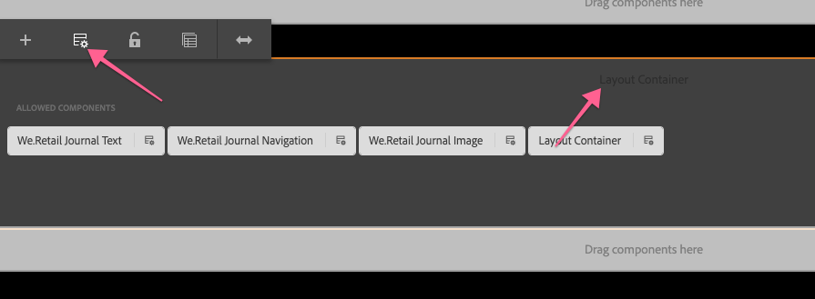

# Sviluppo con AEM editor SPA - Hello World Tutorial {#developing-with-the-aem-spa-editor-hello-world-tutorial}

>[!WARNING]
>
> Questa esercitazione è **obsoleta**. Si consiglia di seguire: [Guida introduttiva all&#39;editor SPA AEM e ad Angular](https://docs.adobe.com/content/help/en/experience-manager-learn/spa-angular-tutorial/overview.html) o [Guida introduttiva all&#39;editor SPA AEM e React](https://docs.adobe.com/content/help/en/experience-manager-learn/spa-react-tutorial/overview.html)

AEM SPA Editor supporta la modifica contestuale di un’applicazione o SPA a pagina singola. Questa esercitazione è un&#39;introduzione SPA sviluppo da utilizzare con AEM Editor JS SDK. L’esercitazione estenderà l’app We.Retail Journal aggiungendo un componente personalizzato Hello World. Gli utenti possono completare l&#39;esercitazione utilizzando i framework React (Reazione) o Angular (Angolo).

>[!NOTE]
>
> La funzione Editor applicazione (SPA) a pagina singola richiede AEM service pack 2 6.4 o successivo.
>
> SPA Editor è la soluzione consigliata per i progetti che richiedono SPA rendering lato client basato su framework (ad es. React o Angular).

## Lettura obbligatoria {#prereq}

Questa esercitazione è destinata a evidenziare i passaggi necessari per mappare un componente SPA a un componente AEM per abilitare la modifica nel contesto. Gli utenti che avviano questa esercitazione devono avere familiarità con i concetti di base dello sviluppo con Adobe Experience Manager, AEM, nonché sviluppare con React of Angular framework. L&#39;esercitazione illustra le attività di sviluppo back-end e front-end.

Prima di avviare l&#39;esercitazione, è consigliabile rivedere le risorse seguenti:

* [SPA Editor Feature Video](spa-editor-framework-feature-video-use.md)  - Una panoramica video dell&#39;app SPA Editor e We.Retail Journal.
* [Esercitazione](https://reactjs.org/tutorial/tutorial.html)  React.js - Introduzione allo sviluppo con il framework React.
* [Esercitazione](https://angular.io/tutorial)  angolare - Introduzione allo sviluppo con Angular

## Ambiente di sviluppo locale {#local-dev}

Questa esercitazione è progettata per:

[Adobe Experience Manager 6.5 ](https://helpx.adobe.com/it/experience-manager/6-5/release-notes.html) o  [Adobe Experience Manager 6.4](https://helpx.adobe.com/experience-manager/6-4/sites/deploying/using/technical-requirements.html) +  [Service Pack 5](https://helpx.adobe.com/it/experience-manager/6-4/release-notes/sp-release-notes.html)

In questa esercitazione devono essere installati i seguenti strumenti e tecnologie:

1. [Java 11](https://downloads.experiencecloud.adobe.com/content/software-distribution/en/general.html)
2. [Apache Maven - 3.3.1+](https://maven.apache.org/)
3. [Node.js - 8.11.1+](https://nodejs.org/it/) e npm 5.6.0+ (npm è installato con node.js)

Controllare l&#39;installazione degli strumenti di cui sopra aprendo un nuovo terminale ed eseguendo quanto segue:

```shell
$ java -version
java version "11 +"

$ mvn -version
Apache Maven 3.3.9

$ node --version
v8.11.1

$ npm --version
6.1.0
```

## Panoramica {#overview}

Il concetto di base consiste nel mappare un componente SPA a un componente AEM. AEM componenti, esecuzione lato server, esportano contenuti sotto forma di JSON. Il contenuto JSON viene utilizzato dall&#39;SPA, che esegue lato client nel browser. Viene creata una mappatura 1:1 tra SPA componenti e un componente AEM.


Sono supportati i framework [React JS](https://reactjs.org/) e [Angular](https://angular.io/) più diffusi. Gli utenti possono completare questa esercitazione in Angular o React, a prescindere dalla struttura a loro più confortevole.

## Configurazione del progetto {#project-setup}

SPA sviluppo ha un piede nello sviluppo AEM e l&#39;altro. L&#39;obiettivo è permettere SPA sviluppo in modo indipendente e (soprattutto) agnostico a AEM.

* SPA progetti possono operare indipendentemente dal progetto AEM durante lo sviluppo front-end.
* Continuano ad essere utilizzati strumenti e tecnologie di compilazione front-end come Webpack, NPM, [!DNL Grunt] e [!DNL Gulp].
* Per creare AEM, il progetto SPA viene compilato e incluso automaticamente nel progetto AEM.
* Pacchetti AEM standard utilizzati per distribuire il SPA in AEM.


*SPA sviluppo ha un piede nello sviluppo AEM, e l&#39;altro fuori - permettendo SPA sviluppo in modo indipendente, e (per lo più) agnostico a AEM.*

L&#39;obiettivo di questa esercitazione è estendere l&#39;app We.Retail Journal con un nuovo componente. Per iniziare, scaricate il codice sorgente per l’app We.Retail Journal e distribuite a un AEM locale.

1. **Scarica** l&#39;ultimo codice  [We.Retail Journal Code da GitHub](https://github.com/adobe/aem-sample-we-retail-journal).

   Oppure duplicare l&#39;archivio dalla riga di comando:

   ```shell
   $ git clone git@github.com:adobe/aem-sample-we-retail-journal.git
   ```

   >[!NOTE]
   >
   >L&#39;esercitazione verrà eseguita sul ramo **master** con la versione **1.2.1-SNAPSHOT** del progetto.

1. Deve essere visibile la struttura seguente:

   

   Il progetto contiene i seguenti moduli di superficie:

   * `all`: Incorpora e installa l’intero progetto in un unico pacchetto.
   * `bundles`: Contiene due bundle OSGi: commons e core che contengono  [!DNL Sling Models] e altro codice Java.
   * `ui.apps`: contiene le parti /apps del progetto, ad esempio clientlibs JS e CSS, componenti, configurazioni specifiche della modalità di esecuzione.
   * `ui.content`: contiene contenuti e configurazioni strutturali (`/content`,  `/conf`)
   * `react-app`: Applicazione React We.Retail Journal Questo è sia un modulo Maven che un progetto webpack.
   * `angular-app`: Applicazione Angolare We.Retail Journal Si tratta sia di un modulo [!DNL Maven] che di un progetto webpack.

1. Aprite una nuova finestra del terminale ed eseguite il comando seguente per creare e distribuire l&#39;intera app a un&#39;istanza AEM locale in esecuzione su [http://localhost:4502](Http://localhost:4502).

   ```shell
   $ cd <src>/aem-sample-we-retail-journal
   $ mvn -PautoInstallSinglePackage clean install
   ```

   >[!NOTE]
   >
   > In questo progetto il profilo Maven da creare e creare il pacchetto dell&#39;intero progetto è `autoInstallSinglePackage`

   >[!CAUTION]
   >
   > Se durante la creazione ricevete un errore, [assicuratevi che il file Maven settings.xml includa  Adobe  archivio degli artifact Maven](https://helpx.adobe.com/experience-manager/kb/SetUpTheAdobeMavenRepository.html).

1. Accedi a:

   * [http://localhost:4502/editor.html/content/we-retail-journal/react/en/home.html](http://localhost:4502/editor.html/content/we-retail-journal/react/en/home.html)
   * [http://localhost:4502/editor.html/content/we-retail-journal/angular/en/home.html](http://localhost:4502/editor.html/content/we-retail-journal/angular/en/home.html)

   L&#39;app We.Retail Journal dovrebbe essere visualizzata nell&#39;editor AEM Sites .

1. In modalità [!UICONTROL Modifica], selezionate un componente da modificare e apportate un aggiornamento al contenuto.

   

1. Selezionare l&#39;icona [!UICONTROL Proprietà pagina] per aprire la [!UICONTROL Proprietà pagina]. Selezionare [!UICONTROL Modifica modello] per aprire il modello della pagina.

   

1. Nell&#39;ultima versione dell&#39;Editor SPA, è possibile utilizzare [Modelli modificabili](https://helpx.adobe.com/experience-manager/6-5/sites/developing/using/page-templates-editable.html) allo stesso modo delle implementazioni dei Siti tradizionali. Questo verrà rivisto in seguito con il nostro componente personalizzato.

   >[!NOTE]
   >
   > Solo AEM 6.5 e AEM 6.4 + **Service Pack 5** supportano i modelli modificabili.

## Panoramica sullo sviluppo {#development-overview}


SPA iterazioni di sviluppo si verificano indipendentemente da AEM. Quando il SPA è pronto per essere distribuito in AEM si verificano i seguenti passaggi di alto livello (come illustrato sopra).

1. Viene richiamata la build del progetto AEM, che a sua volta attiva una build del progetto SPA. La rivista We.Retail utilizza il [**plug-in frontend-maven-plugin**](https://github.com/eirslett/frontend-maven-plugin).
1. Il progetto SPA [**aem-clientlib-generator**](https://www.npmjs.com/package/aem-clientlib-generator) incorpora il SPA compilato come AEM libreria client nel progetto AEM.
1. Il progetto AEM genera un pacchetto AEM, incluso il SPA compilato, più qualsiasi altro codice AEM di supporto.

## Crea componente AEM {#aem-component}

**Persona: Sviluppatore AEM**

Per prima cosa verrà creato un componente AEM. Il componente AEM è responsabile del rendering delle proprietà JSON lette dal componente React. Il componente AEM fornisce inoltre una finestra di dialogo per tutte le proprietà modificabili del componente.

Utilizzando [!DNL Eclipse] o altro [!DNL IDE], importare il progetto We.Retail Journal Maven.

1. Aggiornare il reattore **pom.xml** per rimuovere il plug-in [!DNL Apache Rat]. Questo plug-in controlla ogni file per assicurarsi che sia presente un&#39;intestazione Licenza. Per i nostri scopi non dobbiamo preoccuparci di questa funzionalità.

   In **aem-sample-we-retail-journal/pom.xml** rimuovere **apache-rate-plugin**:

   ```xml
   <!-- Remove apache-rat-plugin -->
   <plugin>
           <groupId>org.apache.rat</groupId>
           <artifactId>apache-rat-plugin</artifactId>
           <configuration>
               <excludes combine.children="append">
                   <exclude>*</exclude>
                       ...
               </excludes>
           </configuration>
           <executions>
                   <execution>
                       <phase>verify</phase>
                       <goals>
                           <goal>check</goal>
                       </goals>
               </execution>
           </executions>
       </plugin>
   ```

1. Nel modulo **we-retail-journal-content** (`<src>/aem-sample-we-retail-journal/ui.apps`) create un nuovo nodo sotto `ui.apps/jcr_root/apps/we-retail-journal/components` denominato **helloworld** di tipo **cq:Component**.
1. Aggiungete le seguenti proprietà al componente **helloworld**, rappresentato in XML (`/helloworld/.content.xml`) di seguito:

   ```xml
   <?xml version="1.0" encoding="UTF-8"?>
   <jcr:root xmlns:cq="http://www.day.com/jcr/cq/1.0" xmlns:jcr="http://www.jcp.org/jcr/1.0"
       jcr:description="Hello World Component for We.Retail Journal"
       jcr:primaryType="cq:Component"
       jcr:title="Hello World"
       componentGroup="We.Retail Journal" />
   ```

   

   >[!NOTE]
   >
   > Per illustrare la funzione Modelli modificabili, abbiamo impostato appositamente la variabile `componentGroup="Custom Components"`. In un progetto reale, è meglio ridurre al minimo il numero di gruppi di componenti, in modo che un gruppo migliore sia &quot;[!DNL We.Retail Journal]&quot; in modo che corrisponda agli altri componenti di contenuto.
   >
   > Solo AEM 6.5 e AEM 6.4 + **Service Pack 5** supportano i modelli modificabili.

1. Verrà quindi creata una finestra di dialogo per consentire la configurazione di un messaggio personalizzato per il componente **Hello World**. Sotto `/apps/we-retail-journal/components/helloworld` aggiungere un nome di nodo **cq:dialog** di **nt:unstructure**.
1. Il **cq:dialog** visualizzerà un singolo campo di testo che persiste nel testo di una proprietà denominata **[!DNL message]**. Sotto la **cq:dialog** appena creata aggiungete i seguenti nodi e proprietà, rappresentati in XML di seguito (`helloworld/_cq_dialog/.content.xml`):

   ```xml
   <?xml version="1.0" encoding="UTF-8"?>
   <jcr:root xmlns:sling="http://sling.apache.org/jcr/sling/1.0" xmlns:cq="http://www.day.com/jcr/cq/1.0" xmlns:jcr="http://www.jcp.org/jcr/1.0" xmlns:nt="http://www.jcp.org/jcr/nt/1.0"
       jcr:primaryType="nt:unstructured"
       jcr:title="We.Retail Journal - Hello World"
       sling:resourceType="cq/gui/components/authoring/dialog">
       <content
           jcr:primaryType="nt:unstructured"
           sling:resourceType="granite/ui/components/coral/foundation/container">
           <items jcr:primaryType="nt:unstructured">
               <tabs
                   jcr:primaryType="nt:unstructured"
                   sling:resourceType="granite/ui/components/coral/foundation/tabs"
                   maximized="{Boolean}true">
                   <items jcr:primaryType="nt:unstructured">
                       <properties
                           jcr:primaryType="nt:unstructured"
                           jcr:title="Properties"
                           sling:resourceType="granite/ui/components/coral/foundation/container"
                           margin="{Boolean}true">
                           <items jcr:primaryType="nt:unstructured">
                               <columns
                                   jcr:primaryType="nt:unstructured"
                                   sling:resourceType="granite/ui/components/coral/foundation/fixedcolumns"
                                   margin="{Boolean}true">
                                   <items jcr:primaryType="nt:unstructured">
                                       <column
                                           jcr:primaryType="nt:unstructured"
                                           sling:resourceType="granite/ui/components/coral/foundation/container">
                                           <items jcr:primaryType="nt:unstructured">
                                               <message
                                                   jcr:primaryType="nt:unstructured"
                                                   sling:resourceType="granite/ui/components/coral/foundation/form/textfield"
                                                   fieldLabel="Message"
                                                   name="./message"
                                                   required="{Boolean}true"/>
                                           </items>
                                       </column>
                                   </items>
                               </columns>
                           </items>
                       </properties>
                   </items>
               </tabs>
           </items>
       </content>
   </jcr:root>
   ```

   

   La definizione del nodo XML di cui sopra crea una finestra di dialogo con un singolo campo di testo che consente all&#39;utente di immettere un &quot;messaggio&quot;. Notare la proprietà `name="./message"` all&#39;interno del nodo `<message />`. Questo è il nome della proprietà che verrà memorizzata nel JCR all&#39;interno del AEM.

1. Verrà quindi creata una finestra di dialogo di criteri vuota (`cq:design_dialog`). La finestra di dialogo Criteri è necessaria per visualizzare il componente nell&#39;Editor modelli. Per questo semplice caso di utilizzo sarà una finestra di dialogo vuota.

   Sotto `/apps/we-retail-journal/components/helloworld` aggiungere un nome di nodo `cq:design_dialog` di `nt:unstructured`.

   La configurazione è rappresentata in XML di seguito (`helloworld/_cq_design_dialog/.content.xml`)

   ```xml
   <?xml version="1.0" encoding="UTF-8"?>
   <jcr:root xmlns:sling="http://sling.apache.org/jcr/sling/1.0" xmlns:cq="http://www.day.com/jcr/cq/1.0" xmlns:jcr="http://www.jcp.org/jcr/1.0" xmlns:nt="http://www.jcp.org/jcr/nt/1.0"
   jcr:primaryType="nt:unstructured" />
   ```

1. Distribuire la base di codice a AEM dalla riga di comando:

   ```shell
   $ cd <src>/aem-sample-we-retail-journal/content
   $ mvn -PautoInstallPackage clean install
   ```

   In [CRXDE Lite](http://localhost:4502/crx/de/index.jsp#/apps/we-retail-journal/global/components/helloworld) convalidare il componente è stato distribuito controllando la cartella in `/apps/we-retail-journal/components:`

   

## Crea modello Sling {#create-sling-model}

**Persona: Sviluppatore AEM**

Successivamente, viene creato un [!DNL Sling Model] per supportare il componente [!DNL Hello World]. In un caso d&#39;uso WCM tradizionale, [!DNL Sling Model] implementa qualsiasi logica aziendale e uno script di rendering lato server (HTL) effettuerà una chiamata a [!DNL Sling Model]. In questo modo lo script di rendering rimane relativamente semplice.

[!DNL Sling Models] sono utilizzati anche nel caso di utilizzo SPA per implementare la logica aziendale lato server. La differenza è che nel caso di utilizzo [!DNL SPA], il [!DNL Sling Models] espone i metodi come JSON serializzato.

>[!NOTE]
>
>Come procedura ottimale, gli sviluppatori devono utilizzare [AEM componenti core](https://docs.adobe.com/content/help/it-IT/experience-manager-core-components/using/introduction.html) quando possibile. Tra le altre funzionalità, i componenti core forniscono [!DNL Sling Models] un output JSON &quot;SPA-ready&quot;, che consente agli sviluppatori di concentrarsi maggiormente sulla presentazione front-end.

1. Nell&#39;editor di tua scelta, apri il progetto **we-retail-journal-commons** ( `<src>/aem-sample-we-retail-journal/bundles/commons`).
1. Nel pacchetto `com.adobe.cq.sample.spa.commons.impl.models`:
   * Create una nuova classe denominata `HelloWorld`.
   * Aggiungere un&#39;interfaccia di implementazione per `com.adobe.cq.export.json.ComponentExporter.`

   

   Affinché [!DNL Sling Model] sia compatibile con AEM Content Services, è necessario implementare l&#39;interfaccia `ComponentExporter`.

   ```java
    package com.adobe.cq.sample.spa.commons.impl.models;
   
    import com.adobe.cq.export.json.ComponentExporter;
   
    public class HelloWorld implements ComponentExporter {
   
        @Override
        public String getExportedType() {
            return null;
        }
    }
   ```

1. Aggiungete una variabile statica denominata `RESOURCE_TYPE` per identificare il tipo di risorsa del componente [!DNL HelloWorld]:

   ```java
    ...
    public class HelloWorld implements ComponentExporter {
   
        static final String RESOURCE_TYPE = "we-retail-journal/components/helloworld";
   
        ...
    }
   ```

1. Aggiungete le annotazioni OSGi per `@Model` e `@Exporter`. L&#39;annotazione `@Model` registrerà la classe come [!DNL Sling Model]. L&#39;annotazione `@Exporter` esporrà i metodi come JSON serializzato utilizzando il framework [!DNL Jackson Exporter].

   ```java
   import org.apache.sling.api.SlingHttpServletRequest;
   import org.apache.sling.models.annotations.Exporter;
   import org.apache.sling.models.annotations.Model;
   import com.adobe.cq.export.json.ExporterConstants;
   ...
   
   @Model(
           adaptables = SlingHttpServletRequest.class,
           adapters = {ComponentExporter.class},
           resourceType = HelloWorld.RESOURCE_TYPE
   )
   @Exporter(
           name = ExporterConstants.SLING_MODEL_EXPORTER_NAME, 
           extensions = ExporterConstants.SLING_MODEL_EXTENSION
   )
   public class HelloWorld implements ComponentExporter {
   
   ...
   ```

1. Implementate il metodo `getDisplayMessage()` per restituire la proprietà JCR `message`. Utilizzare l&#39;annotazione [!DNL Sling Model] di `@ValueMapValue` per semplificare il recupero della proprietà `message` memorizzata sotto il componente. L&#39;annotazione `@Optional` è importante perché quando il componente viene aggiunto per la prima volta alla pagina, `message` non verrà popolata.

   Come parte della logica di business, al messaggio verrà anteposta una stringa, &quot;**Hello**&quot;.

   ```java
   import org.apache.sling.models.annotations.injectorspecific.ValueMapValue;
   import org.apache.sling.models.annotations.Optional;
   
   ...
   
   public class HelloWorld implements ComponentExporter {
   
      static final String RESOURCE_TYPE = "we-retail-journal/components/helloworld";
   
      private static final String PREPEND_MSG = "Hello";
   
       @ValueMapValue @Optional
       private String message;
   
       public String getDisplayMessage() {
           if(message != null && message.length() > 0) {
               return PREPEND_MSG + " "  + message;
           }
           return null;
       }
   
   ...
   ```

   >[!NOTE]
   >
   > Il nome del metodo `getDisplayMessage` è importante. Quando il [!DNL Sling Model] viene serializzato con il [!DNL Jackson Exporter], verrà esposto come proprietà JSON: `displayMessage`. [!DNL Jackson Exporter] serializzerà ed esporrà tutti i metodi `getter` che non accettano un parametro (a meno che non siano esplicitamente contrassegnati per ignorarlo). Più avanti nell&#39;app React / Angular leggeremo questo valore di proprietà e lo visualizzeremo come parte dell&#39;applicazione.

   Anche il metodo `getExportedType` è importante. Il valore del componente `resourceType` verrà utilizzato per &quot;mappare&quot; i dati JSON sul componente front-end (Angular / React). Lo esploreremo nella prossima sezione.

1. Implementare il metodo `getExportedType()` per restituire il tipo di risorsa del componente `HelloWorld`.

   ```java
    @Override
       public String getExportedType() {
           return RESOURCE_TYPE;
       }
   ```

   Il codice completo per [**HelloWorld.java** è disponibile qui.](https://github.com/Adobe-Marketing-Cloud/aem-guides/blob/master/spa-helloworld-guide/src/bundles/commons/HelloWorld.java)

1. Distribuite il codice per AEM utilizzando Apache Maven:

   ```shell
   $ cd <src>/sample-we-retail-spa-content/bundles/commons
   $ mvn -PautoInstallPackage clean install
   ```

   Verificare la distribuzione e la registrazione di [!DNL Sling Model] andando a [[!UICONTROL Stato] > [!UICONTROL Modelli Sling]](http://localhost:4502/system/console/status-slingmodels) nella console OSGi.

   Il modello `HelloWorld` Sling è associato al tipo di risorsa `we-retail-journal/components/helloworld` Sling e viene registrato come [!DNL Sling Model Exporter Servlet]:

   ```shell
   com.adobe.cq.sample.spa.commons.impl.models.HelloWorld - we-retail-journal/components/helloworld
   com.adobe.cq.sample.spa.commons.impl.models.HelloWorld exports 'we-retail-journal/components/helloworld' with selector 'model' and extension '[Ljava.lang.String;@6480f3e5' with exporter 'jackson'
   ```

## Crea componente React {#react-component}

**Persona: Sviluppatore front-end**

Verrà quindi creato il componente React (Reazione). Aprite il modulo **response-app** ( `<src>/aem-sample-we-retail-journal/react-app`) utilizzando l&#39;editor desiderato.

>[!NOTE]
>
> Sentitevi liberi di saltare questa sezione se siete interessati solo a [Sviluppo angolare](#angular-component).

1. All&#39;interno della cartella `react-app` individuate la cartella src corrispondente. Espandete la cartella dei componenti per visualizzare i file dei componenti React esistenti.

   

1. Aggiungete un nuovo file sotto la cartella dei componenti denominata `HelloWorld.js`.
1. Apri `HelloWorld.js`. Aggiungere un&#39;istruzione import per importare la libreria dei componenti React. Aggiungete una seconda istruzione di importazione per importare l&#39;helper `MapTo` fornito da  Adobe. L&#39;helper `MapTo` fornisce una mappatura del componente React sul JSON del componente AEM.

   ```js
   import React, {Component} from 'react';
   import {MapTo} from '@adobe/cq-react-editable-components';
   ```

1. Sotto le importazioni, create una nuova classe denominata `HelloWorld` che estende l&#39;interfaccia React `Component`. Aggiungete il metodo `render()` richiesto alla classe `HelloWorld`.

   ```js
   import React, {Component} from 'react';
   import {MapTo} from '@adobe/cq-react-editable-components';
   
   class HelloWorld extends Component {
   
       render() {
   
       }
   }
   ```

1. L&#39;helper `MapTo` include automaticamente un oggetto denominato `cqModel` come parte delle proprietà del componente React. La `cqModel` include tutte le proprietà esposte dalla [!DNL Sling Model].

   Ricorda che la [!DNL Sling Model] creata in precedenza contiene un metodo `getDisplayMessage()`. `getDisplayMessage()` viene tradotto come chiave JSON denominata  `displayMessage` quando viene eseguito l&#39;output.

   Implementate il metodo `render()` per restituire un tag `h1` contenente il valore di `displayMessage`. [JSX](https://reactjs.org/docs/introducing-jsx.html), un&#39;estensione di sintassi per JavaScript, viene utilizzato per restituire il markup finale del componente.

   ```js
   ...
   
   class HelloWorld extends Component {
       render() {
   
           if(this.props.displayMessage) {
               return (
                   <div className="cmp-helloworld">
                       <h1 className="cmp-helloworld_message">{this.props.displayMessage}</h1>
                   </div>
               );
           }
           return null;
       }
   }
   ```

1. Implementa un metodo di configurazione di modifica. Questo metodo viene passato tramite l&#39;helper `MapTo` e fornisce all&#39;editor AEM informazioni per visualizzare un segnaposto nel caso in cui il componente sia vuoto. Ciò si verifica quando il componente viene aggiunto al SPA ma non è ancora stato creato. Aggiungete quanto segue sotto la classe `HelloWorld`:

   ```js
   ...
   
   class HelloWorld extends Component {
       ...
   }
   
   const HelloWorldEditConfig = {
   
       emptyLabel: 'Hello World',
   
       isEmpty: function(props) {
           return !props || !props.displayMessage || props.displayMessage.trim().length < 1;
       }
   };
   
   ...
   ```

1. Alla fine del file, chiamare il supporto `MapTo`, passando la classe `HelloWorld` e la classe `HelloWorldEditConfig`. Viene eseguito il mapping del componente React al componente AEM in base al tipo di risorsa del componente AEM: `we-retail-journal/components/helloworld`.

   ```js
   MapTo('we-retail-journal/components/helloworld')(HelloWorld, HelloWorldEditConfig);
   ```

   Il codice completo per [**HelloWorld.js** è disponibile qui.](https://github.com/Adobe-Marketing-Cloud/aem-guides/blob/master/spa-helloworld-guide/src/react-app/components/HelloWorld.js)

1. Aprire il file `ImportComponents.js`. È disponibile all&#39;indirizzo `<src>/aem-sample-we-retail-journal/react-app/src/ImportComponents.js`.

   Aggiungete una riga per richiedere la `HelloWorld.js` con gli altri componenti nel pacchetto JavaScript compilato:

   ```js
   ...
     require('./components/Text');
     require('./components/Image');
     require('./components/HelloWorld');
   ...
   ```

1. Nella cartella `components` creare un nuovo file denominato `HelloWorld.css` come elemento di pari livello di `HelloWorld.js.` Compilare il file con le seguenti opzioni per creare uno stile di base per il componente `HelloWorld`:

   ```css
   /* HelloWorld.css to style HelloWorld component */
   
   .cmp-helloworld_message {
       text-align: center;
       color: #ff505e;
       text-transform: unset;
       letter-spacing: unset;
   }
   ```

1. Apri di nuovo `HelloWorld.js` e aggiorna di seguito le istruzioni di importazione per richiedere `HelloWorld.css`:

   ```js
   import React, {Component} from 'react';
   import {MapTo} from '@adobe/cq-react-editable-components';
   
   require('./HelloWorld.css');
   
   ...
   ```

1. Distribuite il codice per AEM utilizzando Apache Maven:

   ```shell
   $ cd <src>/sample-we-retail-spa-content
   $ mvn -PautoInstallSinglePackage clean install
   ```

1. In [CRXDE-Lite](http://localhost:4502/crx/de/index.jsp#/apps/we-retail-journal/react/clientlibs/we-retail-journal-react/js/app.js) aprire `/apps/we-retail-journal/react/clientlibs/we-retail-journal-react/js/app.js`. Effettuate una ricerca rapida per HelloWorld in app.js per verificare che il componente React sia stato incluso nell&#39;app compilata.

   >[!NOTE]
   >
   > **app.** jsis l&#39;app React inclusa nel bundle. Il codice non è più leggibile dall&#39;uomo. Il comando `npm run build` ha attivato una build ottimizzata che genera JavaScript compilati che può essere interpretata dai browser moderni.


## Crea componente angolare {#angular-component}

**Persona: Sviluppatore front-end**

>[!NOTE]
>
> Sentitevi liberi di saltare questa sezione se siete interessati solo allo sviluppo React.

Verrà quindi creato il componente Angular. Aprite il modulo **app-angolare** (`<src>/aem-sample-we-retail-journal/angular-app`) utilizzando l&#39;editor desiderato.

1. All&#39;interno della cartella `angular-app` individuate la cartella `src` corrispondente. Espandete la cartella dei componenti per visualizzare i file dei componenti Angular esistenti.

   

1. Aggiungete una nuova cartella sotto la cartella dei componenti denominata `helloworld`. Sotto la cartella `helloworld` aggiungere nuovi file denominati `helloworld.component.css, helloworld.component.html, helloworld.component.ts`.

   ```plain
   /angular-app
       /src
           /app
               /components
   +                /helloworld
   +                    helloworld.component.css
   +                    helloworld.component.html
   +                    helloworld.component.ts
   ```

1. Apri `helloworld.component.ts`. Aggiungete un&#39;istruzione import per importare le classi Angular `Component` e `Input`. Create un nuovo componente, puntando `styleUrls` e `templateUrl` su `helloworld.component.css` e `helloworld.component.html`. Esportate infine la classe `HelloWorldComponent` con l&#39;input previsto di `displayMessage`.

   ```js
   //helloworld.component.ts
   
   import { Component, Input } from '@angular/core';
   
   @Component({
     selector: 'app-helloworld',
     host: { 'class': 'cmp-helloworld' },
     styleUrls:['./helloworld.component.css'],
     templateUrl: './helloworld.component.html',
   })
   
   export class HelloWorldComponent {
     @Input() displayMessage: string;
   }
   ```

   >[!NOTE]
   >
   > Se si ricorda la [!DNL Sling Model] creata in precedenza, era presente un metodo **getDisplayMessage()**. Il JSON serializzato di questo metodo sarà **displayMessage**, che stiamo leggendo nell&#39;app Angular.

1. Aprire `helloworld.component.html` per includere un tag `h1` che verrà stampato con la proprietà `displayMessage`:

   ```html
   <h1 *ngIf="displayMessage" class="cmp-helloworld_message">
       {{displayMessage}}
   </h1>
   ```

1. Aggiornate `helloworld.component.css` per includere alcuni stili di base per il componente.

   ```css
   :host-context {
       display: block;
   };
   
   .cmp-helloworld {
       display:block;
   }
   .cmp-helloworld_message {
       text-align: center;
       color: #ff505e;
       text-transform: unset;
       letter-spacing: unset;
   }
   ```

1. Aggiornare `helloworld.component.spec.ts` con il seguente banco di prova:

   ```js
   import { async, ComponentFixture, TestBed } from '@angular/core/testing';
   
   import { HelloWorldComponent } from './helloworld.component';
   
       describe('HelloWorld', () => {
       let component: HelloWorldComponent;
       let fixture: ComponentFixture<HelloWorldComponent>;
   
       beforeEach(async(() => {
           TestBed.configureTestingModule({
           declarations: [ HelloWorldComponent ]
           })
           .compileComponents();
       }));
   
       beforeEach(() => {
           fixture = TestBed.createComponent(HelloWorldComponent);
           component = fixture.componentInstance;
           fixture.detectChanges();
       });
   
       it('should create', () => {
           expect(component).toBeTruthy();
       });
   });
   ```

1. Aggiornamento successivo `src/components/mapping.ts` per includere il `HelloWorldComponent`. Aggiungete un `HelloWorldEditConfig` che contrassegnerà il segnaposto nell&#39;editor AEM prima che il componente sia stato configurato. Aggiungete infine una linea per mappare il componente AEM al componente Angular con il supporto `MapTo`.

   ```js
   // src/components/mapping.ts
   
   import { HelloWorldComponent } from "./helloworld/helloworld.component";
   
   ...
   
   const HelloWorldEditConfig = {
   
       emptyLabel: 'Hello World',
   
       isEmpty: function(props) {
           return !props || !props.displayMessage || props.displayMessage.trim().length < 1;
       }
   };
   
   ...
   
   MapTo('we-retail-journal/components/helloworld')(HelloWorldComponent, HelloWorldEditConfig);
   ```

   Il codice completo per [**mapping.ts** è disponibile qui.](https://github.com/Adobe-Marketing-Cloud/aem-guides/blob/master/spa-helloworld-guide/src/angular-app/mapping.ts)

1. Aggiornare `src/app.module.ts` per aggiornare **NgModule**. Aggiungete la **`HelloWorldComponent`** come **dichiarazione** che appartiene alla **AppModule**. Aggiungete anche `HelloWorldComponent` come **entryComponent** in modo che venga compilato e incluso dinamicamente nell&#39;app come modello JSON elaborato.

   ```js
   import { HelloWorldComponent } from './components/helloworld/helloworld.component';
   
   ...
   
   @NgModule({
     imports: [BrowserModule.withServerTransition({ appId: 'we-retail-sample-angular' }),
       SpaAngularEditableComponentsModule,
     AngularWeatherWidgetModule.forRoot({
       key: "37375c33ca925949d7ba331e52da661a",
       name: WeatherApiName.OPEN_WEATHER_MAP,
       baseUrl: 'http://api.openweathermap.org/data/2.5'
     }),
       AppRoutingModule,
       BrowserTransferStateModule],
     providers: [ModelManagerService,
       { provide: APP_BASE_HREF, useValue: '/' }],
     declarations: [AppComponent,
       TextComponent,
       ImageComponent,
       WeatherComponent,
       NavigationComponent,
       MenuComponent,
       MainContentComponent,
       HelloWorldComponent],
     entryComponents: [TextComponent,
       ImageComponent,
       WeatherComponent,
       NavigationComponent,
       MainContentComponent,
       HelloWorldComponent],
     bootstrap: [AppComponent]
    })
   ```

   Il codice completato per [**app.module.ts** è disponibile qui.](https://github.com/Adobe-Marketing-Cloud/aem-guides/blob/master/spa-helloworld-guide/src/angular-app/app.module.ts)

1. Distribuite il codice per AEM utilizzando Maven:

   ```shell
   $ cd <src>/sample-we-retail-spa-content
   $ mvn -PautoInstallSinglePackage clean install
   ```

1. In [CRXDE-Lite](http://localhost:4502/crx/de/index.jsp#/apps/we-retail-journal/angular/clientlibs/we-retail-journal-angular/js/main.js) aprire `/apps/we-retail-journal/angular/clientlibs/we-retail-journal-angular/js/main.js`. Effettuate una ricerca rapida per **HelloWorld** in `main.js` per verificare che il componente Angular sia stato incluso.

   >[!NOTE]
   >
   > **main.** jsis l&#39;app Angular inclusa nel bundle. Il codice non è più leggibile dall&#39;uomo. Il comando npm run build ha attivato una build ottimizzata che genera JavaScript compilati che può essere interpretata dai browser moderni.

## Aggiornamento del modello {#template-update}

1. Passate al Modello modificabile per le versioni React e/o Angular:

   * (Angolare) [http://localhost:4502/editor.html/conf/we-retail-journal/angular/settings/wcm/templates/we-retail-angular-weather-template/structure.html](http://localhost:4502/editor.html/conf/we-retail-journal/angular/settings/wcm/templates/we-retail-angular-weather-template/structure.html)
   * (React) [http://localhost:4502/editor.html/conf/we-retail-journal/react/settings/wcm/templates/we-retail-react-weather-template/structure.html](http://localhost:4502/editor.html/conf/we-retail-journal/react/settings/wcm/templates/we-retail-react-weather-template/structure.html)

1. Selezionare il contenitore di layout principale [!UICONTROL Contenitore di layout] e selezionare l&#39;icona [!UICONTROL Policy] per aprire il criterio:

   

   In **[!UICONTROL Proprietà]** > **[!UICONTROL Componenti consentiti]**, eseguire una ricerca per **[!DNL Custom Components]**. Dovresti vedere il componente **[!DNL Hello World]**, selezionarlo. Salvate le modifiche facendo clic sulla casella di controllo nell’angolo in alto a destra.

   

1. Dopo il salvataggio, è necessario visualizzare il componente **[!DNL HelloWorld]** come componente consentito nel [!UICONTROL Contenitore di layout].

   

   >[!NOTE]
   >
   > Solo AEM 6.5 e AEM 6.4.5 supporta la funzione Modello modificabile dell’Editor SPA. Se utilizzate AEM 6.4, dovrete configurare manualmente il criterio per i componenti consentiti tramite CRXDE Lite: `/conf/we-retail-journal/react/settings/wcm/policies/wcm/foundation/components/responsivegrid/default` o `/conf/we-retail-journal/angular/settings/wcm/policies/wcm/foundation/components/responsivegrid/default`

   CRXDE Lite che mostra le configurazioni di criteri aggiornate per [!UICONTROL Componenti consentiti] nel [!UICONTROL Contenitore di layout]:

   

## Mettere tutto insieme {#putting-together}

1. Passate alle pagine Angolare o Reazione:

   * [http://localhost:4502/editor.html/content/we-retail-journal/react/en/home.html](http://localhost:4502/editor.html/content/we-retail-journal/react/en/home.html)
   * [http://localhost:4502/editor.html/content/we-retail-journal/angular/en/home.html](http://localhost:4502/editor.html/content/we-retail-journal/angular/en/home.html)

1. Trovate il componente **[!DNL Hello World]** e trascinate il componente **[!DNL Hello World]** sulla pagina.

   

   Deve essere visualizzato il segnaposto.

   

1. Selezionate il componente e aggiungete un messaggio nella finestra di dialogo, ad esempio &quot;World&quot; o &quot;Your Name&quot;. Salva le modifiche.

   

   La stringa &quot;Hello&quot; è sempre preceduta dal messaggio. Questo è il risultato della logica in `HelloWorld.java` [!DNL Sling Model].

## Passaggi successivi {#next-steps}

[Soluzione completata per il componente HelloWorld](assets/spa-editor-helloworld-tutorial-use/aem-sample-we-retail-journal-HelloWorldSolution.zip)

* Codice sorgente completo per [[!DNL We.Retail Journal] su GitHub](https://github.com/adobe/aem-sample-we-retail-journal)
* Guardate un&#39;esercitazione più dettagliata sullo sviluppo di React con [[!DNL Getting Started with the AEM SPA Editor - WKND Tutorial]](https://helpx.adobe.com/experience-manager/kt/sites/using/getting-started-spa-wknd-tutorial-develop.html)

## Risoluzione dei problemi {#troubleshooting}

### Impossibile generare il progetto in Eclipse {#unable-to-build-project-in-eclipse}

**Errore:** errore durante l&#39;importazione del  [!DNL We.Retail Journal] progetto in Eclipse per le esecuzioni di obiettivi non riconosciute:

`Execution npm install, Execution npm run build, Execution default-analyze-classes*`


**Risoluzione**: Fate clic su Fine per risolvere questi problemi in un secondo momento. Ciò non dovrebbe impedire il completamento dell&#39;esercitazione.

**Errore**: Il modulo React,  `react-app`, non viene creato correttamente durante una build Maven.

**Risoluzione:** provate a eliminare la  `node_modules` cartella sotto l&#39;app di  **reazione**. Eseguire nuovamente il comando Apache Maven `mvn  clean install -PautoInstallSinglePackage` dalla radice del progetto.

### Dipendenze non soddisfatte in AEM {#unsatisfied-dependencies-in-aem}


Se una dipendenza AEM non è soddisfatta, in **[!UICONTROL AEM Package Manager]** o in **[!UICONTROL AEM Web Console]** (Felix Console), ciò indica che SPA funzione Editor non è disponibile.

### Il componente non viene visualizzato

**Errore**: Anche dopo una distribuzione riuscita e verificando che le versioni compilate delle app React/Angular abbiano il  `helloworld` componente aggiornato, il componente non viene visualizzato quando lo trascino sulla pagina. È possibile visualizzare il componente nell’interfaccia AEM.

**Risoluzione**: Cancella la cronologia/la cache del browser e/o apri un nuovo browser o utilizza la modalità incognito. In caso contrario, annullate la validità della cache della libreria client nell&#39;istanza AEM locale. AEM tenta di memorizzare nella cache le librerie di grandi clienti per essere efficiente. A volte è necessario annullare manualmente la validità della cache per risolvere i problemi di memorizzazione del codice obsoleto nella cache.

Passa a: [http://localhost:4502/libs/granite/ui/content/dumplibs.rebuild.html](http://localhost:4502/libs/granite/ui/content/dumplibs.rebuild.html) e fate clic su Annulla validità cache. Tornate alla pagina React/Angular e aggiornate la pagina.


