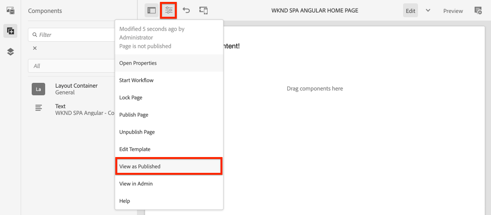

# Progetto SPA Editor {#create-project}

Scoprite come utilizzare un progetto Adobe Experience Manager (AEM) Maven come punto di partenza per un&#39;applicazione Angular integrata con l&#39;editor AEM SPA.

## Obiettivo

1. Comprendere la struttura di un nuovo progetto AEM SPA Editor costruito da un archetipo di Maven.
2. Distribuite il progetto iniziale in un&#39;istanza locale di AEM.

## Cosa verrà creato

In questo capitolo, verrà distribuito un nuovo progetto AEM, basato sul tipo di archivio del progetto [AEM](https://github.com/adobe/aem-project-archetype). Il progetto AEM verrà avviato con un punto di partenza molto semplice per l&#39;Angular SPA. Il progetto utilizzato in questo capitolo servirà da base per l&#39;attuazione della PSPA WKND e si baserà su futuri capitoli.


*Un classico messaggio Hello World.*

## Prerequisiti

Esaminare le istruzioni e gli strumenti necessari per configurare un ambiente [di sviluppo](overview.md#local-dev-environment)locale. Verificare che una nuova istanza di Adobe Experience Manager, avviata in modalità **di creazione** , sia in esecuzione localmente.

## Ottenere il progetto

Esistono diverse opzioni per creare un progetto Maven Multi-module per AEM. Questa esercitazione ha utilizzato l&#39;ultimo [AEM Project Archetype](https://github.com/adobe/aem-project-archetype) come base per il codice dell&#39;esercitazione. Sono state apportate modifiche al codice del progetto per supportare più versioni di AEM. Rivedete [la nota sulla compatibilità](overview.md#compatibility)con le versioni precedenti.

>[!CAUTION]
>
>È consigliabile utilizzare l&#39; **ultima** versione di [archetype](https://github.com/adobe/aem-project-archetype) per generare un nuovo progetto per un&#39;implementazione reale. AEM progetti devono essere destinati a una singola versione di AEM utilizzando la `aemVersion` proprietà dell&#39;archetype.

1. Scarica il punto di partenza per questa esercitazione tramite Git:

   ```shell
   $ git clone git@github.com:adobe/aem-guides-wknd-spa.git
   $ cd aem-guides-wknd-spa
   $ git checkout Angular/create-project-start
   ```

2. La seguente struttura di cartelle e file rappresenta il progetto AEM generato dal archetype Maven sul file system locale:

   ```plain
   |--- aem-guides-wknd-spa
       |--- all/
       |--- core/
       |--- dispatcher/
       |--- ui.apps/
       |--- ui.apps.structure/
       |--- ui.content/
       |--- ui.frontend /
       |--- it.tests/
       |--- pom.xml
       |--- README.md
       |--- .gitignore
       |--- archetype.properties
   ```

3. Durante la generazione del progetto AEM dall&#39;archetipo del progetto [AEM sono state utilizzate le seguenti proprietà](https://github.com/Adobe-Marketing-Cloud/aem-project-archetype/releases/tag/aem-project-archetype-14):

   | Proprietà | Valore |
   |-----------------|---------------------------------------|
   | aemVersion | nuvole |
   | appTitle | WKND SPA Angular |
   | appId | wknd-spa-angular |
   | groupId | com.adobe.aem.guides |
   | frontendModule | angolare |
   | package | com.adobe.aem.guides.wknd.spa.angular |
   | includeExamples | n |

   >[!NOTE]
   >
   > Notice the `frontendModule=angular` property. Questo indica al AEM Project Archetype di avviare il progetto con una base [di codice](https://docs.adobe.com/content/help/en/experience-manager-core-components/using/developing/archetype/uifrontend-angular.html) angolare di avvio da utilizzare con AEM SPA Editor.

## Creazione del progetto

Quindi, compilate, create e distribuite il codice del progetto in un’istanza locale di AEM utilizzando Maven.

1. Verificare che un&#39;istanza di AEM sia in esecuzione localmente sulla porta **4502**.
2. Dal terminale della riga di comando verificate che Maven sia installato:

   ```shell
   $ mvn --version
    Apache Maven 3.6.2
    Maven home: /Library/apache-maven-3.6.2
    Java version: 11.0.4, vendor: Oracle Corporation, runtime: /Library/Java/JavaVirtualMachines/jdk-11.0.4.jdk/Contents/Home
   ```

3. Eseguite il comando sottostante Maven dalla `aem-guides-wknd-spa` directory per creare e distribuire il progetto a AEM:

   ```shell
   $ mvn -PautoInstallSinglePackage clean install
   ```

   Se si utilizza [AEM 6.x](overview.md#compatibility):

   ```shell
   $ mvn clean install -PautoInstallSinglePackage -Pclassic
   ```

   I moduli multipli del progetto devono essere compilati e distribuiti per AEM.

   ```plain
    [INFO] ------------------------------------------------------------------------
    [INFO] Reactor Summary for wknd-spa-angular 1.0.0-SNAPSHOT:
    [INFO] 
    [INFO] wknd-spa-angular ................................... SUCCESS [  0.473 s]
    [INFO] WKND SPA Angular - Core ............................ SUCCESS [ 54.866 s]
    [INFO] wknd-spa-angular.ui.frontend - UI Frontend ......... SUCCESS [02:10 min]
    [INFO] WKND SPA Angular - Repository Structure Package .... SUCCESS [  0.694 s]
    [INFO] WKND SPA Angular - UI apps ......................... SUCCESS [  6.351 s]
    [INFO] WKND SPA Angular - UI content ...................... SUCCESS [  2.885 s]
    [INFO] WKND SPA Angular - All ............................. SUCCESS [  1.736 s]
    [INFO] WKND SPA Angular - Integration Tests Bundles ....... SUCCESS [  2.563 s]
    [INFO] WKND SPA Angular - Integration Tests Launcher ...... SUCCESS [  1.846 s]
    [INFO] WKND SPA Angular - Dispatcher ...................... SUCCESS [  0.270 s]
    [INFO] ------------------------------------------------------------------------
    [INFO] BUILD SUCCESS
    [INFO] ------------------------------------------------------------------------
   ```

   Il profilo Maven ***autoInstallSinglePackage*** compila i singoli moduli del progetto e distribuisce un singolo pacchetto all&#39;istanza AEM. Per impostazione predefinita, questo pacchetto viene distribuito in un&#39;istanza AEM in esecuzione localmente sulla porta **4502** e con le credenziali di **admin:admin**.

4. Andate a Gestione **** pacchetti nell&#39;istanza AEM locale: [http://localhost:4502/crx/packmgr/index.jsp](http://localhost:4502/crx/packmgr/index.jsp).

5. Dovresti vedere tre pacchetti per `wknd-spa-angular.all`, `wknd-spa-angular.ui.apps` e `wknd-spa-angular.ui.content`.

   

   Tutto il codice personalizzato necessario per il progetto verrà incluso in questi pacchetti e installato nel runtime AEM.

6. Dovresti anche vedere diversi pacchetti per `spa.project.core` e `core.wcm.components`. Si tratta di dipendenze incluse automaticamente dal archetype. Ulteriori informazioni sui componenti [AEM di base sono disponibili qui](https://docs.adobe.com/content/help/it-IT/experience-manager-core-components/using/introduction.html).

## Contenuto autore

Quindi, aprite l’area SPA di avvio generata dall’archetipo e aggiornate parte del contenuto.

1. Passate alla console **[!UICONTROL Siti]** : [http://localhost:4502/sites.html/content](http://localhost:4502/sites.html/content).

   L&#39;SPA WKND include una struttura di base del sito con un paese, una lingua e una pagina principale. Questa gerarchia si basa sui valori predefiniti dell&#39;archetipo per `language_country` e `isSingleCountryWebsite`. Questi valori possono essere sovrascritti aggiornando le proprietà [](https://github.com/adobe/aem-project-archetype#available-properties) disponibili durante la generazione di un progetto.

2. Per aprire la pagina **[!DNL us]** > **[!DNL en]** > **[!DNL WKND SPA Angular Home Page]** , selezionate la pagina e fate clic sul pulsante **[!UICONTROL Modifica]** nella barra dei menu:

   

3. Alla pagina è già stato aggiunto un componente **[!UICONTROL Testo]** . Puoi modificare questo componente come qualsiasi altro componente in AEM.

   

4. Aggiungete alla pagina un componente **[!UICONTROL Testo]** aggiuntivo.

   L’esperienza di authoring è simile a quella di una pagina AEM Sites  tradizionale. Attualmente è disponibile un numero limitato di componenti da utilizzare. Nel corso dell&#39;esercitazione verranno aggiunti ulteriori elementi.

##  l’applicazione per pagina singola Inspect

Quindi, verificate che si tratti di un&#39;applicazione a pagina singola con l&#39;utilizzo degli strumenti di sviluppo del browser in uso.

1. Nell’Editor **** pagina, fate clic sul menu Informazioni **** pagina > **[!UICONTROL Visualizza come pubblicato]**:

   

   Viene aperta una nuova scheda con il parametro di query `?wcmmode=disabled` che disattiva l&#39;editor AEM: [http://localhost:4502/content/wknd-spa-angular/us/en/home.html?wcmmode=disabled](http://localhost:4502/content/wknd-spa-angular/us/en/home.html?wcmmode=disabled)

2. Visualizzare l&#39;origine della pagina e notare che il contenuto di testo **[!DNL Hello World]** o qualsiasi altro contenuto non è stato trovato. Dovreste invece visualizzare HTML come segue:

   ```html
   ...
   <body>
       <noscript>You need to enable JavaScript to run this app.</noscript>
       <div id="spa-root"></div>
       <script type="text/javascript" src="/etc.clientlibs/wknd-spa-angular/clientlibs/clientlib-angular.min.js"></script>
       ...
   </body>
   ...
   ```

   `clientlib-angular.min.js` è l’SPA angolare caricata sulla pagina e responsabile del rendering del contenuto.

   *Da dove viene il contenuto?*

3. Tornate alla scheda: [http://localhost:4502/content/wknd-spa-angular/us/en/home.html?wcmmode=disabled](http://localhost:4502/content/wknd-spa-angular/us/en/home.html?wcmmode=disabled)
4. Aprite gli strumenti di sviluppo del browser ed esaminate il traffico di rete della pagina durante un aggiornamento. Visualizzare le richieste **XHR** :

   

   Dovrebbe essere presente una richiesta a [http://localhost:4502/content/wknd-spa-angular/us/en.model.json](http://localhost:4502/content/wknd-spa-angular/us/en.model.json). Contiene tutto il contenuto, formattato in JSON, che guiderà l&#39;SPA.

5. In una nuova scheda, aprite [http://localhost:4502/content/wknd-spa-angular/us/en.model.json](http://localhost:4502/content/wknd-spa-angular/us/en.model.json)

   La richiesta `en.model.json` rappresenta il modello di contenuto che guiderà l&#39;applicazione.  l’output JSON e dovreste essere in grado di trovare lo snippet che rappresenta i componenti **[!UICONTROL Testo]** .

   ```json
   ...
   ":items": {
       "text": {
           "text": "<p>Hello World! Updated content!</p>\r\n",
           "richText": true,
           ":type": "wknd-spa-angular/components/text"
       },
       "text_98796435": {
           "text": "<p>A new text component.</p>\r\n",
           "richText": true,
           ":type": "wknd-spa-angular/components/text"
   },
   ...
   ```

   Nel prossimo capitolo analizzeremo il modo in cui il contenuto JSON viene mappato da componenti AEM a componenti SPA per formare la base dell&#39;esperienza AEM Editor SPA.

   >[!NOTE]
   >
   > Potrebbe essere utile installare un&#39;estensione del browser per formattare automaticamente l&#39;output JSON.

## Congratulazioni! {#congratulations}

Congratulazioni, hai appena creato il tuo primo AEM SPA Editor Project!

È abbastanza semplice in questo momento, ma nei prossimi capitoli saranno aggiunte ulteriori funzionalità.

### Passaggi successivi {#next-steps}

[Integrare l&#39;SPA](integrate-spa.md) - Scopri come il codice sorgente SPA è integrato nel progetto AEM e scopri gli strumenti disponibili per sviluppare rapidamente l&#39;SPA.
