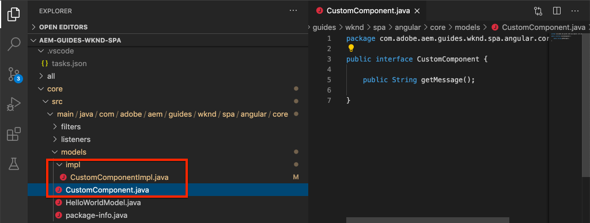

# Creare un componente personalizzato {#custom-component}

Scoprite come creare un componente personalizzato da usare con l’editor AEM SPA. Scoprite come sviluppare finestre di dialogo degli autori e modelli Sling per estendere il modello JSON e compilare un componente personalizzato.

## Obiettivo

1. Comprendere il ruolo di Sling Models nella manipolazione dell&#39;API del modello JSON fornita da AEM.
2. Scopri come creare nuove finestre di dialogo AEM componente.
3. Scoprite come creare un componente AEM **personalizzato** che sarà compatibile con il framework dell&#39;editor SPA.

## Cosa verrà creato

I capitoli precedenti erano dedicati allo sviluppo di componenti SPA e alla loro mappatura su componenti core *esistenti* AEM. Questo capitolo si concentrerà su come creare ed estendere *nuovi* componenti AEM e manipolare il modello JSON servito da AEM.

Un semplice `Custom Component` esempio illustra i passaggi necessari per creare un nuovo componente AEM.


## Prerequisiti

Esaminare le istruzioni e gli strumenti necessari per configurare un ambiente [di sviluppo](overview.md#local-dev-environment)locale.

### Ottenere il codice

1. Scarica il punto di partenza per questa esercitazione tramite Git:

   ```shell
   $ git clone git@github.com:adobe/aem-guides-wknd-spa.git
   $ cd aem-guides-wknd-spa
   $ git checkout Angular/custom-component-start
   ```

2. Distribuire la base di codice in un&#39;istanza AEM locale utilizzando Maven:

   ```shell
   $ mvn clean install -PautoInstallSinglePackage
   ```

   Se utilizzate [AEM 6.x](overview.md#compatibility) , aggiungete il `classic` profilo:

   ```shell
   $ mvn clean install -PautoInstallSinglePackage -Pclassic
   ```

3. Installate il pacchetto finito per il sito [di riferimento](https://github.com/adobe/aem-guides-wknd/releases/latest)WKND tradizionale. Le immagini fornite dal sito [di riferimento](https://github.com/adobe/aem-guides-wknd/releases/latest) WKND verranno riutilizzate nell&#39;SPA WKND. Il pacchetto può essere installato tramite [AEM Package Manager](http://localhost:4502/crx/packmgr/index.jsp).

   

È sempre possibile visualizzare il codice finito su [GitHub](https://github.com/adobe/aem-guides-wknd-spa/tree/Angular/custom-component-solution) o estrarre il codice localmente passando al ramo `Angular/custom-component-solution`.

## Definire il componente AEM

Un componente AEM è definito come un nodo e proprietà. Nel progetto questi nodi e proprietà sono rappresentati come file XML nel `ui.apps` modulo. Quindi, create il componente AEM nel `ui.apps` modulo.

>[!NOTE]
>
> Un aggiornamento rapido sulle [nozioni di base dei componenti AEM può essere utile](https://docs.adobe.com/content/help/en/experience-manager-learn/getting-started-wknd-tutorial-develop/component-basics.html).

1. Nell’IDE di vostra scelta, aprite la `ui.apps` cartella.
2. Individuate `ui.apps/src/main/content/jcr_root/apps/wknd-spa-angular/components` e create una nuova cartella denominata `custom-component`.
3. Create a new file named `.content.xml` beneath the `custom-component` folder. Compilate l&#39; `custom-component/.content.xml` immagine con le seguenti opzioni:

   ```xml
   <?xml version="1.0" encoding="UTF-8"?>
   <jcr:root xmlns:sling="http://sling.apache.org/jcr/sling/1.0" xmlns:cq="http://www.day.com/jcr/cq/1.0" xmlns:jcr="http://www.jcp.org/jcr/1.0"
       jcr:primaryType="cq:Component"
       jcr:title="Custom Component"
       componentGroup="WKND SPA Angular - Content"/>
   ```

   

   `jcr:primaryType="cq:Component"` - identifica che questo nodo sarà un componente AEM.

   `jcr:title` è il valore che verrà visualizzato agli autori dei contenuti e `componentGroup` determina il raggruppamento dei componenti nell’interfaccia utente di authoring.

4. Sotto la `custom-component` cartella, create un’altra cartella denominata `_cq_dialog`.
5. Sotto la `_cq_dialog` cartella create un nuovo file denominato `.content.xml` e compilatelo con i seguenti elementi:

   ```xml
   <?xml version="1.0" encoding="UTF-8"?>
   <jcr:root xmlns:sling="http://sling.apache.org/jcr/sling/1.0" xmlns:granite="http://www.adobe.com/jcr/granite/1.0" xmlns:cq="http://www.day.com/jcr/cq/1.0" xmlns:jcr="http://www.jcp.org/jcr/1.0" xmlns:nt="http://www.jcp.org/jcr/nt/1.0"
       jcr:primaryType="nt:unstructured"
       jcr:title="Custom Component"
       sling:resourceType="cq/gui/components/authoring/dialog">
       <content
           jcr:primaryType="nt:unstructured"
           sling:resourceType="granite/ui/components/coral/foundation/container">
           <items jcr:primaryType="nt:unstructured">
               <tabs
                   jcr:primaryType="nt:unstructured"
                   sling:resourceType="granite/ui/components/coral/foundation/tabs"
                   maximized="{Boolean}true">
                   <items jcr:primaryType="nt:unstructured">
                       <properties
                           jcr:primaryType="nt:unstructured"
                           jcr:title="Properties"
                           sling:resourceType="granite/ui/components/coral/foundation/container"
                           margin="{Boolean}true">
                           <items jcr:primaryType="nt:unstructured">
                               <columns
                                   jcr:primaryType="nt:unstructured"
                                   sling:resourceType="granite/ui/components/coral/foundation/fixedcolumns"
                                   margin="{Boolean}true">
                                   <items jcr:primaryType="nt:unstructured">
                                       <column
                                           jcr:primaryType="nt:unstructured"
                                           sling:resourceType="granite/ui/components/coral/foundation/container">
                                           <items jcr:primaryType="nt:unstructured">
                                               <message
                                                   jcr:primaryType="nt:unstructured"
                                                   sling:resourceType="granite/ui/components/coral/foundation/form/textfield"
                                                   fieldDescription="The text to display on the component."
                                                   fieldLabel="Message"
                                                   name="./message"/>
                                           </items>
                                       </column>
                                   </items>
                               </columns>
                           </items>
                       </properties>
                   </items>
               </tabs>
           </items>
       </content>
   </jcr:root>
   ```

   

   Il file XML di cui sopra genera una finestra di dialogo molto semplice per il `Custom Component`. La parte critica del file è rappresentata dal `<message>` nodo interno. Questa finestra di dialogo conterrà un semplice `textfield` nome `Message` e persisterà il valore del campo di testo in una proprietà denominata `message`.

   Verrà creato un modello Sling accanto al quale esporre il valore della `message` proprietà tramite il modello JSON.

   >[!NOTE]
   >
   > Potete visualizzare molti altri [esempi di finestre di dialogo visualizzando le definizioni](https://github.com/adobe/aem-core-wcm-components/tree/master/content/src/content/jcr_root/apps/core/wcm/components)dei componenti core. È inoltre possibile visualizzare altri campi modulo, come `select`, `textarea`, `pathfield`disponibili sotto `/libs/granite/ui/components/coral/foundation/form` in [CRXDE-Lite](http://localhost:4502/crx/de/index.jsp#/libs/granite/ui/components/coral/foundation/form).

   Con un componente AEM tradizionale, in genere è richiesto uno script [HTL](https://docs.adobe.com/content/help/it-IT/experience-manager-htl/using/overview.html) . Poiché l’area SPA esegue il rendering del componente, non è necessario alcuno script HTL.

## Creare il modello Sling

I modelli Sling sono Java &quot;POJO&quot; basati su annotazioni (Plain Old Java Objects) che semplificano la mappatura dei dati dalle JCR alle variabili Java. [Sling Models](https://docs.adobe.com/content/help/en/experience-manager-learn/getting-started-wknd-tutorial-develop/component-basics.html#sling-models) in genere funziona per racchiudere complesse logiche aziendali lato server per AEM Componenti.

Nel contesto dell&#39;editor SPA, i modelli Sling espongono il contenuto di un componente attraverso il modello JSON attraverso una funzione che utilizza l&#39;Esportatore [di modelli](https://docs.adobe.com/content/help/en/experience-manager-learn/foundation/development/develop-sling-model-exporter.html)Sling.

1. Nell&#39;IDE di vostra scelta, aprite il `core` modulo. `CustomComponent.java` e `CustomComponentImpl.java` sono già stati creati e sovrapposti come parte del codice iniziale del capitolo.

   >[!NOTE]
   >
   > Se si utilizza Visual Studio Code IDE, potrebbe essere utile installare [le estensioni per Java](https://code.visualstudio.com/docs/java/extensions).

2. Aprite l&#39;interfaccia Java `CustomComponent.java` in `core/src/main/java/com/adobe/aem/guides/wknd/spa/angular/core/models/CustomComponent.java`:

   

   Questa è l&#39;interfaccia Java che verrà implementata da Sling Model.

3. Aggiornate `CustomComponent.java` in modo da estendere l&#39; `ComponentExporter` interfaccia:

   ```java
   package com.adobe.aem.guides.wknd.spa.angular.core.models;
   import com.adobe.cq.export.json.ComponentExporter;
   
   public interface CustomComponent extends ComponentExporter {
   
       public String getMessage();
   
   }
   ```

   L&#39;implementazione dell&#39; `ComponentExporter` interfaccia è un requisito affinché il modello Sling venga automaticamente rilevato dall&#39;API del modello JSON.

   L&#39; `CustomComponent` interfaccia include un singolo metodo getter `getMessage()`. Questo è il metodo che espone il valore della finestra di dialogo di authoring tramite il modello JSON. Nel modello JSON `()` verranno esportati solo i metodi getter con parametri vuoti.

4. Apri `CustomComponentImpl.java` a `core/src/main/java/com/adobe/aem/guides/wknd/spa/angular/core/models/impl/CustomComponentImpl.java`.

   Questa è l&#39;implementazione dell&#39; `CustomComponent` interfaccia. L&#39; `@Model` annotazione identifica la classe Java come modello Sling. L&#39; `@Exporter` annotazione consente di serializzare ed esportare la classe Java tramite Sling Model Exporter.

5. Aggiornare la variabile statica `RESOURCE_TYPE` in modo che punti al componente AEM `wknd-spa-angular/components/custom-component` creato nell&#39;esercizio precedente.

   ```java
   static final String RESOURCE_TYPE = "wknd-spa-angular/components/custom-component";
   ```

   Il tipo di risorsa del componente è il tipo che associa il modello Sling al componente AEM e che verrà quindi mappato al componente Angular.

6. Aggiungete il `getExportedType()` metodo alla `CustomComponentImpl` classe per restituire il tipo di risorsa del componente:

   ```java
   @Override
   public String getExportedType() {
       return CustomComponentImpl.RESOURCE_TYPE;
   }
   ```

   Questo metodo è richiesto per l’implementazione dell’ `ComponentExporter` interfaccia e espone il tipo di risorsa che consente la mappatura al componente Angular.

7. Aggiornate il `getMessage()` metodo per restituire il valore della `message` proprietà persistente nella finestra di dialogo dell&#39;autore. Utilizzate l&#39; `@ValueMap` annotazione per mappare il valore JCR `message` su una variabile Java:

   ```java
   import org.apache.commons.lang3.StringUtils;
   ...
   
   @ValueMapValue
   private String message;
   
   @Override
   public String getMessage() {
       return StringUtils.isNotBlank(message) ? message.toUpperCase() : null;
   }
   ```

   Viene aggiunto un ulteriore &quot;business logic&quot; per restituire il valore del messaggio come maiuscolo. Questo ci consentirà di vedere la differenza tra il valore non elaborato memorizzato nella finestra di dialogo dell’autore e il valore esposto nel modello Sling.

   >[!NOTE]
   >
   > È possibile visualizzare il [CustomComponentImpl.java completato qui](https://github.com/adobe/aem-guides-wknd-spa/blob/Angular/custom-component-solution/core/src/main/java/com/adobe/aem/guides/wknd/spa/angular/core/models/impl/CustomComponentImpl.java).

## Aggiornamento del componente Angular

Il codice Angular per il componente personalizzato è già stato creato. Quindi, apportate qualche aggiornamento per mappare il componente Angular sul componente AEM.

1. Nel `ui.frontend` modulo aprire il file `ui.frontend/src/app/components/custom/custom.component.ts`
2. Osservate la `@Input() message: string;` linea. È previsto che il valore in maiuscolo trasformato venga mappato su questa variabile.
3. Importa l’ `MapTo` oggetto dall’SDK JS AEM SPA Editor e lo utilizza per mappare il componente AEM:

   ```diff
   + import {MapTo} from '@adobe/cq-angular-editable-components';
   
    ...
    export class CustomComponent implements OnInit {
        ...
    }
   
   + MapTo('wknd-spa-angular/components/custom-component')(CustomComponent, CustomEditConfig);
   ```

4. Aprite `cutom.component.html` e osservate che il valore di `{{message}}` verrà visualizzato accanto a un `<h2>` tag.
5. Apri `custom.component.css` e aggiungi la regola seguente:

   ```css
   :host-context {
       display: block;
   }
   ```

   Affinché il segnaposto dell’editor AEM venga visualizzato correttamente quando il componente è vuoto, è `:host-context` necessario impostare `<div>` `display: block;`.

6. Distribuisci tutti gli aggiornamenti a un ambiente AEM locale dalla directory principale del progetto, utilizzando le tue competenze Maven:

   ```shell
   $ cd aem-guides-wknd-spa
   $ mvn clean install -PautoInstallSinglePackage
   ```

## Aggiornare i criteri dei modelli

Quindi, andate a AEM per verificare gli aggiornamenti e consentire `Custom Component` di aggiungere gli aggiornamenti all&#39;SPA.

1. Verificare la registrazione del nuovo modello Sling andando a [http://localhost:4502/system/console/status-slingmodels](http://localhost:4502/system/console/status-slingmodels).

   ```plain
   com.adobe.aem.guides.wknd.spa.angular.core.models.impl.CustomComponentImpl - wknd-spa-angular/components/custom-component
   
   com.adobe.aem.guides.wknd.spa.angular.core.models.impl.CustomComponentImpl exports 'wknd-spa-angular/components/custom-component' with selector 'model' and extension '[Ljava.lang.String;@6fb4a693' with exporter 'jackson'
   ```

   Vengono visualizzate le due righe sopra riportate che indicano che il `CustomComponentImpl` componente è associato al `wknd-spa-angular/components/custom-component` componente e che è registrato tramite Sling Model Exporter.

2. Andate al modello di pagina SPA all&#39;indirizzo [http://localhost:4502/editor.html/conf/wknd-spa-angular/settings/wcm/templates/spa-page-template/structure.html](http://localhost:4502/editor.html/conf/wknd-spa-angular/settings/wcm/templates/spa-page-template/structure.html).
3. Aggiornate il criterio Contenitore di layout per aggiungere il nuovo componente `Custom Component` come consentito:

   

   Salvate le modifiche al criterio e osservatelo `Custom Component` come componente consentito:

   

## Creazione del componente personalizzato

Quindi, create il file `Custom Component` utilizzando l&#39;editor AEM SPA.

1. Andate a [http://localhost:4502/editor.html/content/wknd-spa-angular/us/en/home.html](http://localhost:4502/editor.html/content/wknd-spa-angular/us/en/home.html).
2. In `Edit` modalità, aggiungete `Custom Component` i seguenti `Layout Container`:

   

3. Aprite la finestra di dialogo del componente e inserite un messaggio contenente delle lettere minuscole.

   

   Si tratta della finestra di dialogo creata in base al file XML precedente nel capitolo.

4. Salva le modifiche. Osservate che il messaggio visualizzato è in tutte le maiuscole.

   

5. Visualizzare il modello JSON andando a [http://localhost:4502/content/wknd-spa-angular/us/en.model.json](http://localhost:4502/content/wknd-spa-angular/us/en.model.json). Cerca `wknd-spa-angular/components/custom-component`:

   ```json
   "custom_component_208183317": {
       "message": "HELLO WORLD",
       ":type": "wknd-spa-angular/components/custom-component"
   }
   ```

   Il valore JSON è impostato su tutte le lettere maiuscole in base alla logica aggiunta al modello Sling.

## Congratulazioni! {#congratulations}

Congratulazioni, hai imparato a creare un componente AEM personalizzato e come Sling Models e dialoghi funzionano con il modello JSON.

È sempre possibile visualizzare il codice finito su [GitHub](https://github.com/adobe/aem-guides-wknd-spa/tree/Angular/custom-component-solution) o estrarre il codice localmente passando al ramo `Angular/custom-component-solution`.

### Passaggi successivi {#next-steps}

[Estendere un componente](extend-component.md) core - Scoprite come estendere un componente core esistente da utilizzare con l&#39;Editor SPA AEM. La comprensione di come aggiungere proprietà e contenuto a un componente esistente è una tecnica potente per espandere le capacità di un’implementazione di AEM SPA Editor.
