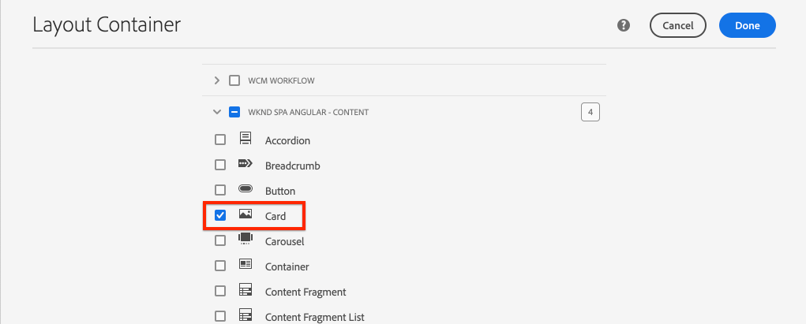

# Estendere un componente core {#extend-component}

Scoprite come estendere un componente core esistente da utilizzare con l&#39;editor SPA AEM. La comprensione di come estendere un componente esistente è una tecnica potente per personalizzare ed espandere le funzionalità di un’implementazione di AEM SPA Editor.

## Obiettivo

1. Estendi un componente core esistente con proprietà e contenuto aggiuntivi.
2. Comprendere le caratteristiche di base dell&#39;ereditarietà dei componenti con l&#39;uso di `sling:resourceSuperType`.
3. Scoprite come sfruttare il [Pattern di delega](https://github.com/adobe/aem-core-wcm-components/wiki/Delegation-Pattern-for-Sling-Models) per i modelli Sling per riutilizzare la logica e le funzionalità esistenti.

## Cosa verrà creato

In questo capitolo verrà creato un nuovo componente `Card`. Il componente `Card` estenderà il componente [Image Core Component](https://docs.adobe.com/content/help/it-IT/experience-manager-core-components/using/components/image.html) aggiungendo altri campi di contenuto come un titolo e un pulsante Invito all&#39;azione per eseguire il ruolo di un teaser per altri contenuti all&#39;interno del SPA.


>[!NOTE]
>
> In un&#39;implementazione reale potrebbe essere più appropriato utilizzare semplicemente il [componente teaser](https://docs.adobe.com/content/help/en/experience-manager-core-components/using/components/teaser.html), quindi estendere il [componente principale immagine](https://docs.adobe.com/content/help/en/experience-manager-core-components/using/components/image.html) per creare un componente `Card` a seconda dei requisiti del progetto. È sempre consigliabile utilizzare [Componenti di base](https://docs.adobe.com/content/help/it-IT/experience-manager-core-components/using/introduction.html) direttamente quando possibile.

## Prerequisiti

Esaminare le istruzioni e gli strumenti necessari per configurare un ambiente di sviluppo locale [](overview.md#local-dev-environment).

### Ottenere il codice

1. Scarica il punto di partenza per questa esercitazione tramite Git:

   ```shell
   $ git clone git@github.com:adobe/aem-guides-wknd-spa.git
   $ cd aem-guides-wknd-spa
   $ git checkout Angular/extend-component-start
   ```

2. Distribuire la base di codice in un&#39;istanza AEM locale utilizzando Maven:

   ```shell
   $ mvn clean install -PautoInstallSinglePackage
   ```

   Se si utilizza [AEM 6.x](overview.md#compatibility) aggiungere il profilo `classic`:

   ```shell
   $ mvn clean install -PautoInstallSinglePackage -Pclassic
   ```

3. Installate il pacchetto finito per il tradizionale sito di riferimento [WKND](https://github.com/adobe/aem-guides-wknd/releases/latest). Le immagini fornite dal sito di riferimento [WKND](https://github.com/adobe/aem-guides-wknd/releases/latest) verranno riutilizzate sul SPA WKND. Il pacchetto può essere installato utilizzando [AEM Package Manager](http://localhost:4502/crx/packmgr/index.jsp).

   

È sempre possibile visualizzare il codice finito su [GitHub](https://github.com/adobe/aem-guides-wknd-spa/tree/Angular/extend-component-solution) o estrarre il codice localmente passando al ramo `Angular/extend-component-solution`.

##  implementazione iniziale della scheda Inspect

Un componente scheda iniziale è stato fornito dal codice iniziale del capitolo.  Inspect il punto di partenza per l&#39;implementazione di Card.

1. Nell&#39;IDE di vostra scelta, aprite il modulo `ui.apps`.
2. Passare a `ui.apps/src/main/content/jcr_root/apps/wknd-spa-angular/components/card` e visualizzare il file `.content.xml`.

   

   ```xml
   <?xml version="1.0" encoding="UTF-8"?>
   <jcr:root xmlns:sling="http://sling.apache.org/jcr/sling/1.0" xmlns:cq="http://www.day.com/jcr/cq/1.0" xmlns:jcr="http://www.jcp.org/jcr/1.0"
       jcr:primaryType="cq:Component"
       jcr:title="Card"
       sling:resourceSuperType="wknd-spa-angular/components/image"
       componentGroup="WKND SPA Angular - Content"/>
   ```

   La proprietà `sling:resourceSuperType` punta a `wknd-spa-angular/components/image` per indicare che il componente `Card` erediterà tutte le funzionalità dal componente Immagine SPA WKND.

3.  Inspect il file `ui.apps/src/main/content/jcr_root/apps/wknd-spa-angular/components/image/.content.xml`:

   ```xml
   <?xml version="1.0" encoding="UTF-8"?>
   <jcr:root xmlns:sling="http://sling.apache.org/jcr/sling/1.0" xmlns:cq="http://www.day.com/jcr/cq/1.0" xmlns:jcr="http://www.jcp.org/jcr/1.0"
       jcr:primaryType="cq:Component"
       jcr:title="Image"
       sling:resourceSuperType="core/wcm/components/image/v2/image"
       componentGroup="WKND SPA Angular - Content"/>
   ```

   Tenere presente che `sling:resourceSuperType` punta a `core/wcm/components/image/v2/image`. Questo indica che il componente Immagine SPA WKND eredita tutte le funzionalità dall’Immagine componente principale.

   Anche noto come [Proxy pattern](https://docs.adobe.com/content/help/en/experience-manager-core-components/using/developing/guidelines.html#proxy-component-pattern) Sling resource inheritance è un potente pattern di progettazione per consentire ai componenti secondari di ereditare le funzionalità e estendere/ignorare il comportamento quando desiderato. L&#39;ereditarietà Sling supporta più livelli di ereditarietà, pertanto in ultima istanza il nuovo componente `Card` eredita la funzionalità dell&#39;immagine del componente principale.

   Molti team di sviluppo si sforzano di essere D.R.Y. (non ripeterti). Sling eredità rende possibile questo con AEM.

4. Sotto la cartella `card`, aprire il file `_cq_dialog/.content.xml`.

   Questo file è la definizione della finestra di dialogo dei componenti per il componente `Card`. Se si utilizza l&#39;ereditarietà Sling, è possibile utilizzare le funzionalità di [Sling Resource Merger](https://docs.adobe.com/content/help/en/experience-manager-65/developing/platform/sling-resource-merger.html) per ignorare o estendere parti della finestra di dialogo. In questo esempio è stata aggiunta una nuova scheda alla finestra di dialogo per acquisire dati aggiuntivi da un autore e compilare il componente scheda.

   Proprietà come `sling:orderBefore` consentono agli sviluppatori di scegliere dove inserire nuove schede o campi modulo. In questo caso la scheda `Text` verrà inserita prima della scheda `asset`. Per sfruttare appieno la fusione Sling Resource è importante conoscere la struttura del nodo di dialogo originale per la finestra di dialogo [Componente immagine](https://github.com/adobe/aem-core-wcm-components/blob/master/content/src/content/jcr_root/apps/core/wcm/components/image/v2/image/_cq_dialog/.content.xml).

5. Sotto la cartella `card`, aprire il file `_cq_editConfig.xml`. Questo file determina il comportamento di trascinamento nell’interfaccia di authoring AEM. Quando si estende il componente Immagine, è importante che il tipo di risorsa corrisponda al componente stesso. Rivedete il nodo `<parameters>`:

   ```xml
   <parameters
       jcr:primaryType="nt:unstructured"
       sling:resourceType="wknd-spa-angular/components/card"
       imageCrop=""
       imageMap=""
       imageRotate=""/>
   ```

   La maggior parte dei componenti non richiede un `cq:editConfig`, ma i discendenti immagine e figlio del componente Immagine sono eccezioni.

6. Nel passaggio IDE al modulo `ui.frontend`, passare a `ui.frontend/src/app/components/card`:

   

7.  Inspect il file `card.component.ts`.

   Il componente è già stato sovrapposto per la mappatura sul componente AEM `Card` utilizzando la funzione `MapTo` standard.

   ```js
   MapTo('wknd-spa-angular/components/card')(CardComponent, CardEditConfig);
   ```

   Esaminare i tre parametri `@Input` della classe per `src`, `alt` e `title`. Questi sono valori JSON previsti dal componente AEM che verrà mappato sul componente Angular.

8. Aprire il file `card.component.html`:

   ```html
   <div class="card"  *ngIf="hasContent">
       <app-image class="card__image" [src]="src" [alt]="alt" [title]="title"></app-image>
   </div>
   ```

   In questo esempio abbiamo scelto di riutilizzare il componente Immagine angolare esistente `app-image` semplicemente passando i parametri `@Input` da `card.component.ts`. Più avanti nell&#39;esercitazione verranno aggiunte e visualizzate ulteriori proprietà.

## Aggiornare i criteri dei modelli

Con questa implementazione iniziale `Card` è possibile esaminare le funzionalità dell&#39;editor SPA AEM. Per visualizzare il componente iniziale `Card` è necessario aggiornare il criterio del modello.

1. Distribuisci il codice di avvio in un’istanza locale di AEM, se non hai già:

   ```shell
   $ cd aem-guides-wknd-spa
   $ mvn clean install -PautoInstallSinglePackage
   ```

2. Andate al SPA Modello pagina in [http://localhost:4502/editor.html/conf/wknd-spa-angular/settings/wcm/templates/spa-page-template/structure.html](http://localhost:4502/editor.html/conf/wknd-spa-angular/settings/wcm/templates/spa-page-template/structure.html).
3. Aggiornate il criterio Contenitore di layout per aggiungere il nuovo componente `Card` come componente consentito:

   

   Salvate le modifiche al criterio e osservate il componente `Card` come un componente consentito:

   

## Componente scheda iniziale autore

Quindi, create il componente `Card` utilizzando l&#39;editor SPA AEM.

1. Andate a [http://localhost:4502/editor.html/content/wknd-spa-angular/us/en/home.html](http://localhost:4502/editor.html/content/wknd-spa-angular/us/en/home.html).
2. In modalità `Edit`, aggiungere il componente `Card` alla `Layout Container`:

   

3. Trascinate un’immagine da Asset Finder sul componente `Card`:

   

4. Aprire la finestra di dialogo del componente `Card` e notare l&#39;aggiunta di una scheda **Text**.
5. Immettere i seguenti valori nella scheda **Testo**:

   

   **Percorso**  scheda: scegliete una pagina sotto la pagina iniziale SPA.

   **Testo**  CTA - &quot;Leggi tutto&quot;

   **Titolo**  scheda - lasciate vuoto

   **Ottieni titolo dalla pagina**  collegata: seleziona la casella di controllo per indicare true.

6. Aggiornate la scheda **Metadati risorsa** per aggiungere valori per **Testo alternativo** e **Didascalia**.

   Al momento non vengono visualizzate altre modifiche dopo l’aggiornamento della finestra di dialogo. Per esporre i nuovi campi al componente Angular, è necessario aggiornare il modello Sling per il componente `Card`.

7. Aprite una nuova scheda e andate a [CRXDE-Lite](http://localhost:4502/crx/de/index.jsp#/content/wknd-spa-angular/us/en/home/jcr%3Acontent/root/responsivegrid/card).  i nodi di contenuto sotto `/content/wknd-spa-angular/us/en/home/jcr:content/root/responsivegrid` per trovare il contenuto del componente `Card`.

   

   Tenere presente che le proprietà `cardPath`, `ctaText`, `titleFromPage` sono persistenti nella finestra di dialogo.

## Aggiorna modello Sling scheda

Per esporre i valori dalla finestra di dialogo dei componenti al componente Angular, è necessario aggiornare il modello Sling che popola il JSON per il componente `Card`. Abbiamo anche l&#39;opportunità di implementare due elementi di business logic:

* Se da `titleFromPage` a **true**, restituire il titolo della pagina specificata da `cardPath` in caso contrario restituisce il valore di `cardTitle` textfield.
* Restituisce la data dell&#39;ultima modifica della pagina specificata da `cardPath`.

Tornate all&#39;IDE di vostra scelta e aprite il modulo `core`.

1. Aprire il file `Card.java` in `core/src/main/java/com/adobe/aem/guides/wknd/spa/angular/core/models/Card.java`.

   Tenere presente che l&#39;interfaccia `Card` al momento estende `com.adobe.cq.wcm.core.components.models.Image` e quindi eredita tutti i metodi dell&#39;interfaccia `Image`. L&#39;interfaccia `Image` estende già l&#39;interfaccia `ComponentExporter` che consente al modello Sling di essere esportato come JSON e mappato dall&#39;editor SPA. Pertanto non è necessario estendere esplicitamente l&#39;interfaccia `ComponentExporter` come abbiamo fatto nel capitolo [Componente personalizzato](custom-component.md).

2. Aggiungete i seguenti metodi all&#39;interfaccia:

   ```java
   @ProviderType
   public interface Card extends Image {
   
       /***
       * The URL to populate the CTA button as part of the card.
       * The link should be based on the cardPath property that points to a page.
       * @return String URL
       */
       public String getCtaLinkURL();
   
       /***
       * The text to display on the CTA button of the card.
       * @return String CTA text
       */
       public String getCtaText();
   
   
   
       /***
       * The date to be displayed as part of the card.
       * This is based on the last modified date of the page specified by the cardPath
       * @return
       */
       public Calendar getCardLastModified();
   
   
       /**
       * Return the title of the page specified by cardPath if `titleFromPage` is set to true.
       * Otherwise return the value of `cardTitle`
       * @return
       */
       public String getCardTitle();
   }
   ```

   Questi metodi saranno esposti tramite l&#39;API del modello JSON e passati al componente Angular.

3. Apri `CardImpl.java`. Questa è l&#39;implementazione dell&#39;interfaccia `Card.java`. Questa implementazione è già stata parzialmente bloccata per accelerare l&#39;esercitazione.  Notate l&#39;utilizzo delle annotazioni `@Model` e `@Exporter` per garantire che il modello Sling possa essere serializzato come JSON tramite Sling Model Exporter.

   `CardImpl.java` utilizza anche il pattern  [Delega per Sling ](https://github.com/adobe/aem-core-wcm-components/wiki/Delegation-Pattern-for-Sling-Models) Models per evitare di riscrivere tutta la logica dal componente di base Immagine.

4. Osservate le seguenti righe:

   ```java
   @Self
   @Via(type = ResourceSuperType.class)
   private Image image;
   ```

   L&#39;annotazione precedente crea un&#39;istanza dell&#39;oggetto Image denominato `image` in base all&#39; `sling:resourceSuperType` ereditarietà del componente `Card`.

   ```java
   @Override
   public String getSrc() {
       return null != image ? image.getSrc() : null;
   }
   ```

   È quindi possibile utilizzare semplicemente l&#39;oggetto `image` per implementare i metodi definiti dall&#39;interfaccia `Image`, senza dover scrivere la logica. Questa tecnica è utilizzata per `getSrc()`, `getAlt()` e `getTitle()`.

5. Quindi, implementare il metodo `initModel()` per avviare una variabile privata `cardPage` in base al valore di `cardPath`

   ```java
   @PostConstruct
   public void initModel() {
       if(StringUtils.isNotBlank(cardPath) && pageManager != null) {
           cardPage = pageManager.getPage(this.cardPath);
       }
   }
   ```

   L&#39; `@PostConstruct initModel()` verrà sempre chiamato quando il modello Sling viene inizializzato, pertanto è una buona opportunità per inizializzare oggetti che possono essere utilizzati da altri metodi nel modello. `pageManager` è uno dei numerosi [oggetti globali Java supportati](https://docs.adobe.com/content/help/en/experience-manager-htl/using/htl/global-objects.html#java-backed-objects) resi disponibili a Sling Models tramite l&#39;annotazione `@ScriptVariable`. Il metodo [getPage](https://docs.adobe.com/content/help/en/experience-manager-cloud-service/implementing/developing/ref/javadoc/com/day/cq/wcm/api/PageManager.html#getPage-java.lang.String-) prende in considerazione un percorso e restituisce un oggetto [Page](https://docs.adobe.com/content/help/en/experience-manager-cloud-service/implementing/developing/ref/javadoc/com/day/cq/wcm/api/Page.html) AEM oppure un valore null se il percorso non punta a una pagina valida.

   In questo modo si inizializzerà la variabile `cardPage`, che verrà utilizzata dagli altri nuovi metodi per restituire i dati sulla pagina collegata sottostante.

6. Esaminate le variabili globali già mappate alle proprietà JCR salvate la finestra di dialogo di authoring. L&#39;annotazione `@ValueMapValue` viene utilizzata per eseguire automaticamente la mappatura.

   ```java
   @ValueMapValue
   private String cardPath;
   
   @ValueMapValue
   private String ctaText;
   
   @ValueMapValue
   private boolean titleFromPage;
   
   @ValueMapValue
   private String cardTitle;
   ```

   Queste variabili verranno utilizzate per implementare i metodi aggiuntivi per l&#39;interfaccia `Card.java`.

7. Implementare i metodi aggiuntivi definiti nell&#39;interfaccia `Card.java`:

   ```java
   @Override
   public String getCtaLinkURL() {
       if(cardPage != null) {
           return cardPage.getPath() + ".html";
       }
       return null;
   }
   
   @Override
   public String getCtaText() {
       return ctaText;
   }
   
   @Override
   public Calendar getCardLastModified() {
      if(cardPage != null) {
          return cardPage.getLastModified();
      }
      return null;
   }
   
   @Override
   public String getCardTitle() {
       if(titleFromPage) {
           return cardPage != null ? cardPage.getTitle() : null;
       }
       return cardTitle;
   }
   ```

   >[!NOTE]
   >
   > È possibile visualizzare il [CardImpl.java completato qui](https://github.com/adobe/aem-guides-wknd-spa/blob/Angular/extend-component-solution/core/src/main/java/com/adobe/aem/guides/wknd/spa/angular/core/models/impl/CardImpl.java).

8. Aprite una finestra terminale e distribuite solo gli aggiornamenti al modulo `core` utilizzando il profilo Maven `autoInstallBundle` dalla directory `core`.

   ```shell
   $ cd core/
   $ mvn clean install -PautoInstallBundle
   ```

   Se si utilizza [AEM 6.x](overview.md#compatibility) aggiungere il profilo `classic`.

9. Visualizzate la risposta del modello JSON all&#39;indirizzo: [http://localhost:4502/content/wknd-spa-angular/us/en.model.json](http://localhost:4502/content/wknd-spa-angular/us/en.model.json) e cercare il `wknd-spa-angular/components/card`:

   ```json
   "card": {
       "ctaText": "Read More",
       "cardTitle": "Page 1",
       "title": "Woman chillaxing with river views in Australian bushland",
       "src": "/content/wknd-spa-angular/us/en/home/_jcr_content/root/responsivegrid/card.coreimg.jpeg/1595190732886/adobestock-216674449.jpeg",
       "alt": "Female sitting on a large rock relaxing in afternoon dappled light the Australian bushland with views over the river",
       "cardLastModified": 1591360492414,
       "ctaLinkURL": "/content/wknd-spa-angular/us/en/home/page-1.html",
       ":type": "wknd-spa-angular/components/card"
   }
   ```

   Notate che il modello JSON viene aggiornato con ulteriori coppie chiave/valore dopo l&#39;aggiornamento dei metodi nel modello Sling `CardImpl`.

## Aggiorna componente angolare

Ora che il modello JSON è popolato con nuove proprietà per `ctaLinkURL`, `ctaText`, `cardTitle` e `cardLastModified`, è possibile aggiornare il componente Angular per visualizzarli.

1. Tornare all&#39;IDE e aprire il modulo `ui.frontend`. Facoltativamente, avviare il server di sviluppo webpack da una nuova finestra terminale per visualizzare le modifiche in tempo reale:

   ```shell
   $ cd ui.frontend
   $ npm install
   $ npm start
   ```

2. Aprire `card.component.ts` in `ui.frontend/src/app/components/card/card.component.ts`. Aggiungete le annotazioni `@Input` aggiuntive per acquisire il nuovo modello:

   ```diff
   export class CardComponent implements OnInit {
   
        @Input() src: string;
        @Input() alt: string;
        @Input() title: string;
   +    @Input() cardTitle: string;
   +    @Input() cardLastModified: number;
   +    @Input() ctaLinkURL: string;
   +    @Input() ctaText: string;
   ```

3. Aggiungere metodi per verificare se Call to Action è pronto e per restituire una stringa data/ora in base all&#39;input `cardLastModified`:

   ```js
   export class CardComponent implements OnInit {
       ...
       get hasCTA(): boolean {
           return this.ctaLinkURL && this.ctaLinkURL.trim().length > 0 && this.ctaText && this.ctaText.trim().length > 0;
       }
   
       get lastModifiedDate(): string {
           const lastModifiedDate = this.cardLastModified ? new Date(this.cardLastModified) : null;
   
           if (lastModifiedDate) {
           return lastModifiedDate.toLocaleDateString();
           }
           return null;
       }
       ...
   }
   ```

4. Apri `card.component.html` e aggiungi la seguente marcatura per visualizzare il titolo, chiamare all&#39;azione e l&#39;ultima data modificata:

   ```html
   <div class="card"  *ngIf="hasContent">
       <app-image class="card__image" [src]="src" [alt]="alt" [title]="title"></app-image>
       <div class="card__content">
           <h2 class="card__title">
               {{cardTitle}}
               <span class="card__lastmod" *ngIf="lastModifiedDate">{{lastModifiedDate}}</span>
           </h2>
           <div class="card__action-container" *ngIf="hasCTA">
               <a [routerLink]="ctaLinkURL" class="card__action-link" [title]="ctaText">
                   {{ctaText}}
               </a>
           </div>
       </div>
   </div>
   ```

   Le regole di base sono già state aggiunte in `card.component.scss` per formattare il titolo, chiamare all&#39;azione e l&#39;ultima data modificata.

   >[!NOTE]
   >
   > È possibile visualizzare il codice del componente per schede angolari finito [qui](https://github.com/adobe/aem-guides-wknd-spa/tree/Angular/extend-component-solution/ui.frontend/src/app/components/card).

5. Distribuisci le modifiche complete a AEM dalla radice del progetto utilizzando Maven:

   ```shell
   $ cd aem-guides-wknd-spa
   $ mvn clean install -PautoInstallSinglePackage
   ```

6. Andate a [http://localhost:4502/editor.html/content/wknd-spa-angular/us/en/home.html](http://localhost:4502/editor.html/content/wknd-spa-angular/us/en/home.html) per visualizzare il componente aggiornato:

   

7. Per creare una pagina simile alle seguenti, è necessario poter creare nuovamente il contenuto esistente:

   

## Congratulazioni! {#congratulations}

Congratulazioni, hai imparato a estendere un componente AEM utilizzando i modelli Sling e come funzionano le finestre di dialogo con il modello JSON.

È sempre possibile visualizzare il codice finito su [GitHub](https://github.com/adobe/aem-guides-wknd-spa/tree/Angular/extend-component-solution) o estrarre il codice localmente passando al ramo `Angular/extend-component-solution`.
