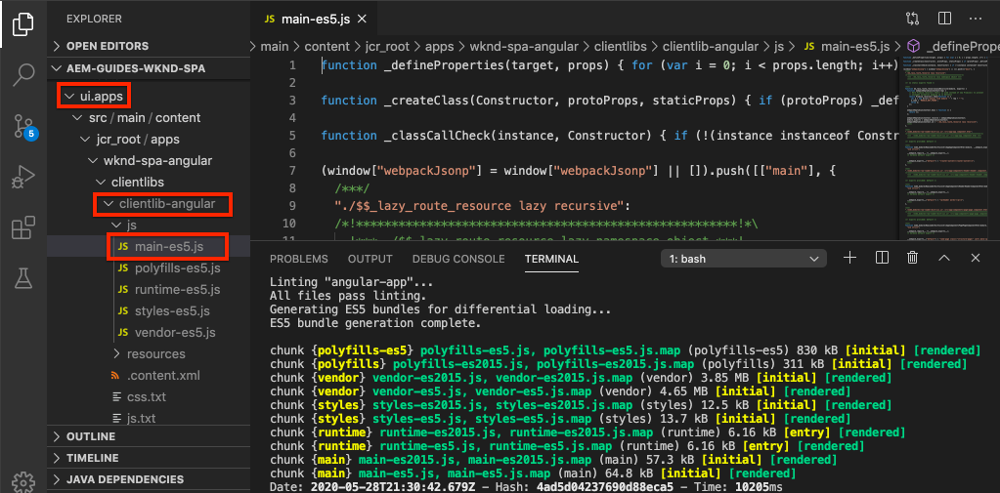

# Integrare un SPA {#integrate-spa}

Comprendere in che modo il codice sorgente per un&#39;applicazione a pagina singola (SPA) scritta in  Angular può essere integrato con un progetto Adobe Experience Manager (AEM). Scoprite come utilizzare i moderni strumenti front-end, come un server di sviluppo webpack, per sviluppare rapidamente il SPA rispetto all&#39;API del modello AEM JSON.

## Obiettivo

1. Scoprite come il progetto SPA è integrato con AEM con librerie lato client.
2. Scoprite come utilizzare un server di sviluppo locale per lo sviluppo front-end dedicato.
3. Esplorare l&#39;utilizzo di un file **proxy** e **mock** statico per lo sviluppo rispetto all&#39;API AEM modello JSON

## Cosa verrà creato

In questo capitolo verrà aggiunto un semplice componente `Header` al SPA. Nel processo di creazione di questo componente statico `Header` verranno utilizzati diversi approcci per AEM sviluppo SPA.


*Il SPA è esteso per aggiungere un  `Header` componente statico*

## Prerequisiti

Esaminare le istruzioni e gli strumenti necessari per configurare un ambiente di sviluppo locale [](overview.md#local-dev-environment).

### Ottenere il codice

1. Scarica il punto di partenza per questa esercitazione tramite Git:

   ```shell
   $ git clone git@github.com:adobe/aem-guides-wknd-spa.git
   $ cd aem-guides-wknd-spa
   $ git checkout Angular/integrate-spa-start
   ```

2. Distribuire la base di codice in un&#39;istanza AEM locale utilizzando Maven:

   ```shell
   $ mvn clean install -PautoInstallSinglePackage
   ```

   Se si utilizza [AEM 6.x](overview.md#compatibility) aggiungere il profilo `classic`:

   ```shell
   $ mvn clean install -PautoInstallSinglePackage -Pclassic
   ```

È sempre possibile visualizzare il codice finito su [GitHub](https://github.com/adobe/aem-guides-wknd-spa/tree/Angular/integrate-spa-solution) o estrarre il codice localmente passando al ramo `Angular/integrate-spa-solution`.

## Metodo di integrazione {#integration-approach}

Nel progetto AEM sono stati creati due moduli: `ui.apps` e `ui.frontend`.

Il modulo `ui.frontend` è un progetto [webpack](https://webpack.js.org/) che contiene tutto il codice sorgente SPA. La maggior parte dello sviluppo SPA e dei test sarà fatto nel progetto webpack. Quando viene attivata una build di produzione, la SPA viene creata e compilata utilizzando il webpack. Gli artifact compilati (CSS e Javascript) vengono copiati nel modulo `ui.apps` che viene quindi distribuito nel runtime AEM.


*Una rappresentazione di alto livello dell&#39;integrazione SPA.*

Ulteriori informazioni sulla build front-end sono disponibili [qui](https://docs.adobe.com/content/help/en/experience-manager-core-components/using/developing/archetype/uifrontend-angular.html).

##  Inspect l&#39;integrazione SPA {#inspect-spa-integration}

Quindi, ispezionare il modulo `ui.frontend` per comprendere il SPA generato automaticamente dal [AEM Project archetype](https://docs.adobe.com/content/help/en/experience-manager-core-components/using/developing/archetype/uifrontend-angular.html).

1. Nell’IDE di vostra scelta, aprite il progetto AEM per il SPA WKND. Questa esercitazione utilizza il codice [Visual Studio Code IDE](https://docs.adobe.com/content/help/en/experience-manager-learn/cloud-service/local-development-environment-set-up/development-tools.html#microsoft-visual-studio-code).

   

2. Espandete ed esaminate la cartella `ui.frontend`. Aprire il file `ui.frontend/package.json`

3. Sotto `dependencies` dovrebbero essere visualizzate diverse informazioni relative a `@angular`:

   ```json
   "@angular/animations": "~9.1.11",
   "@angular/common": "~9.1.11",
   "@angular/compiler": "~9.1.11",
   "@angular/core": "~9.1.11",
   "@angular/forms": "~9.1.10",
   "@angular/platform-browser": "~9.1.10",
   "@angular/platform-browser-dynamic": "~9.1.10",
   "@angular/router": "~9.1.10",
   ```

   Il modulo `ui.frontend` è un&#39;applicazione di Angular [](https://angular.io) generata utilizzando lo [ Angular CLI tool](https://angular.io/cli) che include il routing.

4. Sono inoltre presenti tre dipendenze con il prefisso `@adobe`:

   ```json
   "@adobe/cq-angular-editable-components": "^2.0.2",
   "@adobe/cq-spa-component-mapping": "^1.0.3",
   "@adobe/cq-spa-page-model-manager": "^1.1.3",
   ```

   I moduli di cui sopra costituiscono l&#39; [AEM SPA Editor JS SDK](https://docs.adobe.com/content/help/en/experience-manager-65/developing/headless/spas/spa-blueprint.html) e forniscono le funzionalità necessarie per la mappatura SPA Componenti su AEM Componenti.

5. Nel file `package.json` sono definiti diversi `scripts`:

   ```json
   "scripts": {
       "start": "ng serve --open --proxy-config ./proxy.conf.json",
       "build": "ng lint && ng build && clientlib",
       "build:production": "ng lint && ng build --prod && clientlib",
       "test": "ng test",
       "sync": "aemsync -d -w ../ui.apps/src/main/content"
   }
   ```

   Questi script si basano sui comandi CLI [ Angular ](https://angular.io/cli/build) comuni, ma sono stati leggermente modificati per lavorare con il progetto AEM più grande.

   `start` - esegue l&#39;app dell&#39;Angular  localmente utilizzando un server Web locale. È stato aggiornato per il proxy del contenuto dell&#39;istanza AEM locale.

   `build` - compila l&#39;app del Angular  per la distribuzione della produzione. L&#39;aggiunta di `&& clientlib` è responsabile della copia del SPA compilato nel modulo `ui.apps` come libreria lato client durante una build. Il modulo npm [aem-clientlib-generator](https://github.com/wcm-io-frontend/aem-clientlib-generator) è utilizzato per facilitare questo processo.

   Per ulteriori dettagli sugli script disponibili, vedere [qui](https://docs.adobe.com/content/help/en/experience-manager-core-components/using/developing/archetype/uifrontend-angular.html).

6.  Inspect il file `ui.frontend/clientlib.config.js`. Questo file di configurazione è utilizzato da [aem-clientlib-generator](https://github.com/wcm-io-frontend/aem-clientlib-generator#clientlibconfigjs) per determinare come generare la libreria client.

7.  Inspect il file `ui.frontend/pom.xml`. Questo file trasforma la cartella `ui.frontend` in un [modulo Paradiso](http://maven.apache.org/guides/mini/guide-multiple-modules.html). Il file `pom.xml` è stato aggiornato per utilizzare il [front-maven-plugin](https://github.com/eirslett/frontend-maven-plugin) a **test** e **build** il SPA durante una build Maven.

8.  Inspect il file `app.component.ts` in `ui.frontend/src/app/app.component.ts`:

   ```js
   import { Constants } from '@adobe/cq-angular-editable-components';
   import { ModelManager } from '@adobe/cq-spa-page-model-manager';
   import { Component } from '@angular/core';
   
   @Component({
   selector: '#spa-root', // tslint:disable-line
   styleUrls: ['./app.component.css'],
   templateUrl: './app.component.html'
   })
   export class AppComponent {
       ...
   
       constructor() {
           ModelManager.initialize().then(this.updateData);
       }
   
       private updateData = pageModel => {
           this.path = pageModel[Constants.PATH_PROP];
           this.items = pageModel[Constants.ITEMS_PROP];
           this.itemsOrder = pageModel[Constants.ITEMS_ORDER_PROP];
       }
   }
   ```

   `app.component.js` è il punto di ingresso del SPA. `ModelManager` è fornito dall’SDK JS dell’editor SPA AEM. È responsabile della chiamata e dell&#39;invio di `pageModel` (il contenuto JSON) nell&#39;applicazione.

## Aggiunta di un componente Intestazione {#header-component}

Quindi, aggiungete un nuovo componente al SPA e distribuite le modifiche a un’istanza AEM locale per visualizzare l’integrazione.

1. Apri una nuova finestra del terminale e passa alla cartella `ui.frontend`:

   ```shell
   $ cd aem-guides-wknd-spa/ui.frontend
   ```

2. Installare [ CLI del Angular](https://angular.io/cli#installing-angular-cli) a livello globale Consente di generare componenti  Angular e di creare e distribuire l&#39;applicazione Angular  tramite il comando **ng**.

   ```shell
   $ npm install -g @angular/cli
   ```

   >[!CAUTION]
   >
   > La versione di **@ angular/cli** utilizzata da questo progetto è **9.1.7**. Si consiglia di mantenere sincronizzate le versioni CLI del Angular .

3. Create un nuovo componente `Header` eseguendo il comando CLI del Angular  `ng generate component` dall&#39;interno della cartella `ui.frontend`.

   ```shell
   $ ng generate component components/header
   
   CREATE src/app/components/header/header.component.css (0 bytes)
   CREATE src/app/components/header/header.component.html (21 bytes)
   CREATE src/app/components/header/header.component.spec.ts (628 bytes)
   CREATE src/app/components/header/header.component.ts (269 bytes)
   UPDATE src/app/app.module.ts (1809 bytes)
   ```

   In questo modo verrà creato uno scheletro per il nuovo componente Intestazione Angular  in `ui.frontend/src/app/components/header`.

4. Apri il progetto `aem-guides-wknd-spa` nell&#39;IDE di tua scelta. Andate alla cartella `ui.frontend/src/app/components/header`.

   

5. Aprite il file `header.component.html` e sostituite il contenuto con quanto segue:

   ```html
   <!--/* header.component.html */-->
   <header className="header">
       <div className="header-container">
           <h1>WKND</h1>
       </div>
   </header>
   ```

   Notate che viene visualizzato contenuto statico, pertanto questo componente di Angular  non richiede alcuna regolazione per il `header.component.ts` generato automaticamente.

6. Apri il file **app.component.html** in `ui.frontend/src/app/app.component.html`. Aggiungete il simbolo `app-header`:

   ```html
   <app-header></app-header>
   <router-outlet></router-outlet>
   ```

   Questo includerà il componente `header` sopra tutto il contenuto della pagina.

7. Aprite un nuovo terminale e accedete alla cartella `ui.frontend`, quindi eseguite il comando `npm run build`:

   ```shell
   $ cd ui.frontend
   $ npm run build
   
   Linting "angular-app"...
   All files pass linting.
   Generating ES5 bundles for differential loading...
   ES5 bundle generation complete.
   ```

8. Andate alla cartella `ui.apps`. Sotto `ui.apps/src/main/content/jcr_root/apps/wknd-spa-angular/clientlibs/clientlib-angular` è possibile vedere i file SPA compilati copiati dalla cartella`ui.frontend/build`.

   

9. Tornate al terminale e individuate la cartella `ui.apps`. Eseguite il seguente comando Maven:

   ```shell
   $ cd ../ui.apps
   $ mvn clean install -PautoInstallPackage
   ...
   [INFO] ------------------------------------------------------------------------
   [INFO] BUILD SUCCESS
   [INFO] ------------------------------------------------------------------------
   [INFO] Total time:  9.629 s
   [INFO] Finished at: 2020-05-04T17:48:07-07:00
   [INFO] ------------------------------------------------------------------------
   ```

   Questo distribuirà il pacchetto `ui.apps` in un&#39;istanza locale in esecuzione di AEM.

10. Aprite una scheda del browser e andate a [http://localhost:4502/editor.html/content/wknd-spa-angular/us/en/home.html](http://localhost:4502/editor.html/content/wknd-spa-angular/us/en/home.html). È ora necessario visualizzare il contenuto del componente `Header` nel SPA.

   

   I passaggi **7-9** vengono eseguiti automaticamente quando si attiva una build Maven dalla radice del progetto (ovvero `mvn clean install -PautoInstallSinglePackage`). È ora necessario comprendere le basi dell&#39;integrazione tra le librerie lato SPA e AEM lato client. È comunque possibile modificare e aggiungere componenti `Text` in AEM, ma il componente `Header` non è modificabile.

## Webpack Dev Server - Proxy API JSON {#proxy-json}

Come mostrato negli esercizi precedenti, l&#39;esecuzione di una build e la sincronizzazione della libreria client con un&#39;istanza locale di AEM richiede alcuni minuti. Questo è accettabile per il test finale, ma non è ideale per la maggior parte dello sviluppo SPA.

Per sviluppare rapidamente il SPA è possibile utilizzare un server di sviluppo per [webpack](https://webpack.js.org/configuration/dev-server/). Il SPA è guidato da un modello JSON generato da AEM. In questo esercizio il contenuto JSON da un&#39;istanza in esecuzione di AEM sarà **proxy** nel server di sviluppo configurato dal progetto di Angular [](https://angular.io/guide/build).

1. Tornare all&#39;IDE e aprire il file **proxy.conf.json** all&#39;indirizzo `ui.frontend/proxy.conf.json`.

   ```json
   [
       {
           "context": [
                       "/content/**/*.(jpg|jpeg|png|model.json)",
                       "/etc.clientlibs/**/*"
                   ],
           "target": "http://localhost:4502",
           "auth": "admin:admin",
           "logLevel": "debug"
       }
   ]
   ```

   L&#39;app di Angular [](https://angular.io/guide/build#proxying-to-a-backend-server) fornisce un meccanismo semplice per le richieste API proxy. I pattern specificati in `context` vengono proxy tramite `localhost:4502`, il AEM rapido locale.

2. Aprire il file **index.html** in `ui.frontend/src/index.html`. Si tratta del file HTML principale utilizzato dal server di sviluppo.

   Nota: è presente una voce relativa a `base href="/"`. Il tag [base](https://angular.io/guide/deployment#the-base-tag) è fondamentale perché l&#39;app risolva gli URL relativi.

   ```html
   <base href="/">
   ```

3. Aprite una finestra del terminale e passate alla cartella `ui.frontend`. Eseguire il comando `npm start`:

   ```shell
   $ cd ui.frontend
   $ npm start
   
   > wknd-spa-angular@0.1.0 start /Users/dgordon/Documents/code/aem-guides-wknd-spa/ui.frontend
   > ng serve --open --proxy-config ./proxy.conf.json
   
   10% building 3/3 modules 0 active[HPM] Proxy created: [ '/content/**/*.(jpg|jpeg|png|model.json)', '/etc.clientlibs/**/*' ]  ->  http://localhost:4502
   [HPM] Subscribed to http-proxy events:  [ 'error', 'close' ]
   ℹ ｢wds｣: Project is running at http://localhost:4200/webpack-dev-server/
   ℹ ｢wds｣: webpack output is served from /
   ℹ ｢wds｣: 404s will fallback to //index.html
   ```

4. Aprite una nuova scheda del browser (se non è già aperta) e andate a [http://localhost:4200/content/wknd-spa-angular/us/en/home.html](http://localhost:4200/content/wknd-spa-angular/us/en/home.html).

   

   Dovresti visualizzare lo stesso contenuto come in AEM, ma senza che nessuna delle funzionalità di authoring sia abilitata.

5. Tornate all&#39;IDE e create una nuova cartella denominata `img` in `ui.frontend/src/assets`.
6. Scaricate e aggiungete il seguente logo WKND alla cartella `img`:

   

7. Aprite **header.component.html** in `ui.frontend/src/app/components/header/header.component.html` e includete il logo:

   ```html
   <header class="header">
       <div class="header-container">
           <div class="logo">
               
           </div>
       </div>
   </header>
   ```

   Salvare le modifiche in **header.component.html**.

8. Tornate al browser. Dovresti vedere immediatamente le modifiche all&#39;app riflesse.

   

   È possibile continuare a eseguire aggiornamenti di contenuto in **AEM** e visualizzarli visualizzati nel server di sviluppo dei webpack **WebPack**, dal momento che il contenuto viene proxy. Le modifiche al contenuto sono visibili solo nel server di sviluppo **webpack**.

9. Arrestate il server Web locale con `ctrl+c` nel terminale.

## Webpack Dev Server - Mock JSON API {#mock-json}

Un altro approccio al rapido sviluppo consiste nell&#39;utilizzare un file JSON statico per agire come modello JSON. &quot;prendendo in giro&quot; il JSON, rimuoviamo la dipendenza da un&#39;istanza AEM locale. Consente inoltre a uno sviluppatore front-end di aggiornare il modello JSON al fine di testare la funzionalità e di apportare modifiche all&#39;API JSON che sarebbe poi implementata da uno sviluppatore back-end.

L&#39;impostazione iniziale del JSON fittizio **richiede un&#39;istanza AEM locale**.

1. Nel browser, andate a [http://localhost:4502/content/wknd-spa-angular/us/en.model.json](http://localhost:4502/content/wknd-spa-angular/us/en.model.json).

   È il JSON esportato da AEM che guida l&#39;applicazione. Copiate l’output JSON.

2. Tornate all&#39;IDE andate a `ui.frontend/src` e aggiungete nuove cartelle denominate **mocks** e **json** in modo che corrispondano alla seguente struttura di cartelle:

   ```plain
   |-- ui.frontend
       |-- src
           |-- mocks
               |-- json
   ```

3. Create un nuovo file denominato **en.model.json** sotto `ui.frontend/public/mocks/json`. Incollate l&#39;output JSON da **Passo 1** qui.

   

4. Create un nuovo file **proxy.mock.conf.json** sotto `ui.frontend`. Compilate il file con le seguenti opzioni:

   ```json
   [
       {
       "context": [
           "/content/**/*.model.json"
       ],
       "pathRewrite": { "^/content/wknd-spa-angular/us" : "/mocks/json"} ,
       "target": "http://localhost:4200",
       "logLevel": "debug"
       }
   ]
   ```

   Questa configurazione proxy riscrive le richieste che iniziano con `/content/wknd-spa-angular/us` con `/mocks/json` e distribuiscono il file JSON statico corrispondente, ad esempio:

   ```plain
   /content/wknd-spa-angular/us/en.model.json -> /mocks/json/en.model.json
   ```

5. Aprire il file **angular.json**. Aggiungete una nuova configurazione **dev** con un array **assets** aggiornato per fare riferimento alla cartella **mocks** creata.

   ```json
    "dev": {
             "assets": [
               "src/mocks",
               "src/assets",
               "src/favicon.ico",
               "src/logo192.png",
               "src/logo512.png",
               "src/manifest.json"
             ]
       },
   ```

   

   La creazione di una configurazione **dev** dedicata garantisce che la cartella **mocks** sia utilizzata solo durante lo sviluppo e non sia mai distribuita per AEM in una build di produzione.

6. Nel file **angular.json**, aggiornare la configurazione **browserTarget** per utilizzare la nuova configurazione **dev**:

   ```diff
     ...
     "serve": {
         "builder": "@angular-devkit/build-angular:dev-server",
         "options": {
   +       "browserTarget": "angular-app:build:dev"
   -       "browserTarget": "angular-app:build"
         },
     ...
   ```

   

7. Aprire il file `ui.frontend/package.json` e aggiungere un nuovo comando **start:mock** per fare riferimento al file **proxy.mock.conf.json**.

   ```diff
       "scripts": {
           "start": "ng serve --open --proxy-config ./proxy.conf.json",
   +       "start:mock": "ng serve --open --proxy-config ./proxy.mock.conf.json",
           "build": "ng lint && ng build && clientlib",
           "build:production": "ng lint && ng build --prod && clientlib",
           "test": "ng test",
           "sync": "aemsync -d -w ../ui.apps/src/main/content"
       }
   ```

   L&#39;aggiunta di un nuovo comando facilita l&#39;alternanza tra le configurazioni proxy.

8. Se è in esecuzione, arrestare il server di sviluppo del **webpack**. Avviare il server di sviluppo dei webpack **webpack** utilizzando lo script **start:mock**:

   ```shell
   $ npm run start:mock
   
   > wknd-spa-angular@0.1.0 start:mock /Users/dgordon/Documents/code/aem-guides-wknd-spa/ui.frontend
   > ng serve --open --proxy-config ./proxy.mock.conf.json
   ```

   Andate a [http://localhost:4200/content/wknd-spa-angular/us/en/home.html](http://localhost:4200/content/wknd-spa-angular/us/en/home.html) e dovreste vedere lo stesso SPA, ma il contenuto viene ora estratto dal file JSON **mock**.

9. Apportate una piccola modifica al file **en.model.json** creato in precedenza. Il contenuto aggiornato deve riflettersi immediatamente nel server di sviluppo **webpack**.

   

   La possibilità di manipolare il modello JSON e visualizzare gli effetti su un SPA live può aiutare uno sviluppatore a comprendere l&#39;API del modello JSON. Consente inoltre lo sviluppo front-end e back-end in parallelo.

## Aggiungi stili con ass

Successivamente, al progetto verrà aggiunto uno stile aggiornato. Questo progetto aggiungerà il supporto [Sass](https://sass-lang.com/) per alcune funzioni utili come le variabili.

1. Aprire una finestra terminale e arrestare il server di sviluppo **webpack** se avviato. Dall&#39;interno della cartella `ui.frontend` immettete il comando seguente per aggiornare l&#39;app del Angular  per elaborare i file **.scss**.

   ```shell
   $ cd ui.frontend
   $ ng config schematics.@schematics/angular:component.styleext scss
   ```

   Questo aggiornerà il file `angular.json` con una nuova voce nella parte inferiore del file:

   ```json
   "schematics": {
       "@schematics/angular:component": {
       "styleext": "scss"
       }
   }
   ```

2. Installate `normalize-scss` per normalizzare gli stili tra i vari browser:

   ```shell
   $ npm install normalize-scss --save
   ```

3. Tornate all&#39;IDE e, sotto `ui.frontend/src`, create una nuova cartella denominata `styles`.
4. Create un nuovo file sotto `ui.frontend/src/styles` denominato `_variables.scss` e compilatelo con le seguenti variabili:

   ```scss
   //_variables.scss
   
   //== Colors
   //
   //## Gray and brand colors for use across theme.
   
   $black:                  #202020;
   $gray:                   #696969;
   $gray-light:             #EBEBEB;
   $gray-lighter:           #F7F7F7;
   $white:                  #FFFFFF;
   $yellow:                 #FFEA00;
   $blue:                   #0045FF;
   
   
   //== Typography
   //
   //## Font, line-height, and color for body text, headings, and more.
   
   $font-family-sans-serif:  "Helvetica Neue", Helvetica, Arial, sans-serif;
   $font-family-serif:       Georgia, "Times New Roman", Times, serif;
   $font-family-base:        $font-family-sans-serif;
   $font-size-base:          18px;
   
   $line-height-base:        1.5;
   $line-height-computed:    floor(($font-size-base * $line-height-base));
   
   // Functional Colors
   $brand-primary:             $yellow;
   $body-bg:                   $white;
   $text-color:                $black;
   $text-color-inverse:        $gray-light;
   $link-color:                $blue;
   
   //Layout
   $max-width: 1024px;
   $header-height: 75px;
   
   // Spacing
   $gutter-padding: 12px;
   ```

5. Rinominare l&#39;estensione del file **Styles.css** in `ui.frontend/src/styles.css` in **Styles.scss**. Sostituite il contenuto con quanto segue:

   ```scss
   /* styles.scss * /
   
   /* Normalize */
   @import '~normalize-scss/sass/normalize';
   
   @import './styles/variables';
   
   body {
       background-color: $body-bg;
       font-family: $font-family-base;
       margin: 0;
       padding: 0;
       font-size: $font-size-base;
       text-align: left;
       color: $text-color;
       line-height: $line-height-base;
   }
   
   body.page {
       max-width: $max-width;
       margin: 0 auto;
       padding: $gutter-padding;
       padding-top: $header-height;
   }
   ```

6. Aggiornare **angular.json** e rinominare tutti i riferimenti a **style.css** con **Styles.scss**. Ci dovrebbero essere 3 riferimenti.

   ```diff
     "styles": [
   -    "src/styles.css"
   +    "src/styles.scss"
      ],
   ```

## Aggiorna stili di intestazione

Aggiungere quindi alcuni stili specifici per il marchio al componente **Header** utilizzando Sass.

1. Avviare il server di sviluppo **webpack** per visualizzare gli stili aggiornati in tempo reale:

   ```shell
   $ npm run start:mock
   ```

2. In `ui.frontend/src/app/components/header` rinominare **header.component.css** in **header.component.scss**. Compilate il file con le seguenti opzioni:

   ```scss
   @import "~src/styles/variables";
   
   .header {
       width: 100%;
       position: fixed;
       top: 0;
       left:0;
       z-index: 99;
       background-color: $brand-primary;
       box-shadow: 0px 0px 10px 0px rgba(0, 0, 0, 0.24);
   }
   
   .header-container {
       display: flex;
       max-width: $max-width;
       margin: 0 auto;
       padding-left: $gutter-padding;
       padding-right: $gutter-padding;
   }
   
   .logo {
       z-index: 100;
       display: flex;
       padding-top: $gutter-padding;
       padding-bottom: $gutter-padding;
   }
   
   .logo-img {
       width: 100px;
   }
   ```

3. Aggiornare **header.component.js** per fare riferimento a **header.component.scss**:

   ```diff
   ...
     @Component({
       selector: 'app-header',
       templateUrl: './header.component.html',
   -   styleUrls: ['./header.component.css']
   +   styleUrls: ['./header.component.scss']
     })
   ...
   ```

4. Tornare al browser e al server di sviluppo **webpack**:

   

   È ora possibile visualizzare gli stili aggiornati aggiunti al componente **Header**.

## Implementare SPA aggiornamenti a AEM

Le modifiche apportate a **Header** sono attualmente visibili solo attraverso il server di sviluppo dei webpack **webpack**. Distribuite il SPA aggiornato per AEM per visualizzare le modifiche.

1. Arrestate il server di sviluppo **webpack**.
2. Andate alla directory principale del progetto `/aem-guides-wknd-spa` e distribuite il progetto da AEM utilizzando Maven:

   ```shell
   $ cd ..
   $ mvn clean install -PautoInstallSinglePackage
   ```

3. Andate a [http://localhost:4502/editor.html/content/wknd-spa-angular/us/en/home.html](http://localhost:4502/editor.html/content/wknd-spa-angular/us/en/home.html). Dovresti vedere la **Intestazione** aggiornata con il logo e gli stili applicati:

   

   Ora che la SPA aggiornata è AEM, l’authoring può continuare.

## Congratulazioni! {#congratulations}

Congratulazioni, avete aggiornato il SPA ed esplorato l&#39;integrazione con AEM! Ora conoscete due approcci diversi per sviluppare il SPA rispetto all&#39;API del modello AEM JSON utilizzando un server di sviluppo di webpack ****.

È sempre possibile visualizzare il codice finito su [GitHub](https://github.com/adobe/aem-guides-wknd-spa/tree/Angular/integrate-spa-solution) o estrarre il codice localmente passando al ramo `Angular/integrate-spa-solution`.

### Passaggi successivi {#next-steps}

[Mappatura SPA componenti su AEM componenti](map-components.md)  - Scoprite come associare  componenti Angular a componenti Adobe Experience Manager (AEM) con l’SDK AEM Editor JS. La mappatura dei componenti consente agli autori di effettuare aggiornamenti dinamici SPA componenti all’interno dell’editor SPA AEM, simili all’authoring AEM tradizionale.
