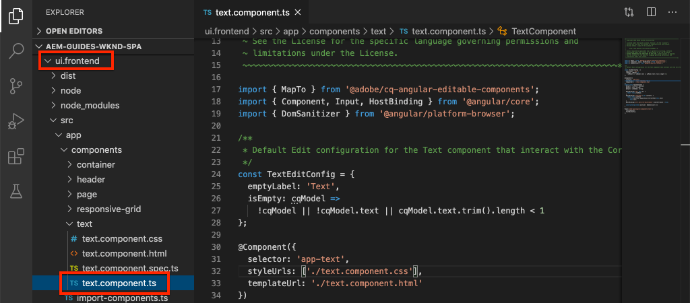
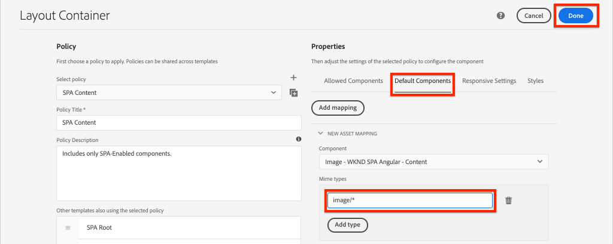
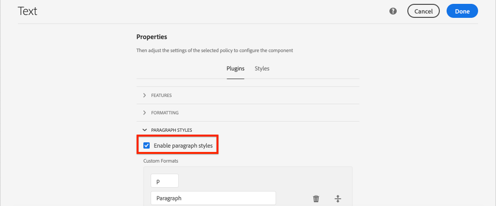

# Mappatura di componenti SPA su componenti AEM {#map-components}

Scoprite come mappare i componenti Angular ai componenti Adobe Experience Manager (AEM) con l’SDK JS AEM SPA Editor. La mappatura dei componenti consente agli utenti di effettuare aggiornamenti dinamici ai componenti SPA nell’editor AEM SPA, in modo simile all’authoring AEM tradizionale.

Questo capitolo descrive in modo più approfondito l&#39;API del modello JSON AEM e come il contenuto JSON esposto da un componente AEM può essere inserito automaticamente in un componente Angular come proprietà.

## Obiettivo

1. Scoprite come mappare AEM componenti su componenti SPA.
2. Comprendere la differenza tra i componenti **Contenitore** e i componenti **Contenuto** .
3. Creare un nuovo componente Angular associato a un componente AEM esistente.

## Cosa verrà creato

Questo capitolo analizza come il componente `Text` SPA fornito viene mappato sul `Text`componente AEM. Verrà creato un nuovo componente `Image` SPA che potrà essere utilizzato nell&#39;SPA e creato in AEM. Le funzioni predefinite dei criteri Contenitore **di** layout e Editor **di** modelli verranno utilizzate anche per creare una visualizzazione di aspetto leggermente più varia.


## Prerequisiti

Esaminare le istruzioni e gli strumenti necessari per configurare un ambiente [di sviluppo](overview.md#local-dev-environment)locale.

### Ottenere il codice

1. Scarica il punto di partenza per questa esercitazione tramite Git:

   ```shell
   $ git clone git@github.com:adobe/aem-guides-wknd-spa.git
   $ cd aem-guides-wknd-spa
   $ git checkout Angular/map-components-start
   ```

2. Distribuire la base di codice in un&#39;istanza AEM locale utilizzando Maven:

   ```shell
   $ mvn clean install -PautoInstallSinglePackage
   ```

   Se utilizzate [AEM 6.x](overview.md#compatibility) , aggiungete il `classic` profilo:

   ```shell
   $ mvn clean install -PautoInstallSinglePackage -Pclassic
   ```

È sempre possibile visualizzare il codice finito su [GitHub](https://github.com/adobe/aem-guides-wknd-spa/tree/Angular/map-components-solution) o estrarre il codice localmente passando al ramo `Angular/map-components-solution`.

## Approccio di mappatura

Il concetto di base consiste nel mappare un componente SPA su un componente AEM. AEM componenti, eseguite lato server, esportate il contenuto come parte dell&#39;API del modello JSON. Il contenuto JSON viene utilizzato dall&#39;SPA, eseguendo lato client nel browser. Viene creata una mappatura 1:1 tra i componenti SPA e un componente AEM.


*Panoramica di alto livello sulla mappatura di un componente AEM a un componente angolare*

##  Inspect il componente Testo

Il [AEM Project Archetype](https://github.com/adobe/aem-project-archetype) fornisce un `Text` componente mappato al componente [AEM](https://docs.adobe.com/content/help/en/experience-manager-core-components/using/components/text.html)Text. Questo è un esempio di un componente **contenuto** , in quanto esegue il rendering del *contenuto* da AEM.

Vediamo come funziona il componente.

###  Inspect il modello JSON

1. Prima di passare al codice SPA, è importante comprendere il modello JSON AEM fornito. Passare alla libreria [dei componenti](https://www.aemcomponents.dev/content/core-components-examples/library/page-authoring/text.html) core e visualizzare la pagina del componente Testo. La libreria dei componenti core fornisce esempi di tutti i componenti core AEM.
2. Selezionate la scheda **JSON** per uno degli esempi:

   

   Vengono visualizzate tre proprietà: `text`, `richText`e `:type`.

   `:type` è una proprietà riservata che elenca il `sling:resourceType` (o percorso) del componente AEM. Il valore di `:type` corrisponde a quello utilizzato per mappare il componente AEM sul componente SPA.

   `text` e `richText` sono proprietà aggiuntive che verranno esposte al componente SPA.

###  Inspect il componente Testo

1. Aprite un nuovo terminale e individuate la `ui.frontend` cartella all’interno del progetto. Eseguire `npm install` e quindi `npm start` avviare il server **di sviluppo** webpack:

   ```shell
   $ cd ui.frontend
   $ npm run start:mock
   ```

   Il `ui.frontend` modulo è attualmente configurato per utilizzare il modello [JSON](./integrate-spa.md#mock-json)fittizio.

2. Viene visualizzata una nuova finestra del browser che si apre su [http://localhost:4200/content/wknd-spa-angular/us/en/home.html](http://localhost:4200/content/wknd-spa-angular/us/en/home.html)

   

3. Nell’IDE di vostra scelta, aprite il progetto AEM per l’area SPA WKND. Espandete il modulo e aprite il file `ui.frontend` text.component.ts **in** `ui.frontend/src/app/components/text/text.component.ts`:

   

4. La prima area da ispezionare è la `class TextComponent` a ~line 35:

   ```js
   export class TextComponent {
       @Input() richText: boolean;
       @Input() text: string;
       @Input() itemName: string;
   
       @HostBinding('innerHtml') get content() {
           return this.richText
           ? this.sanitizer.bypassSecurityTrustHtml(this.text)
           : this.text;
       }
       @HostBinding('attr.data-rte-editelement') editAttribute = true;
   
       constructor(private sanitizer: DomSanitizer) {}
   }
   ```

   [@Input()](https://angular.io/api/core/Input) decorator è utilizzato per dichiarare i campi i cui valori sono impostati tramite l&#39;oggetto JSON mappato, rivisto in precedenza.

   `@HostBinding('innerHtml') get content()` è un metodo che espone il contenuto di testo generato dal valore di `this.text`. Se il contenuto è RTF (Rich Text Format) (determinato dalla `this.richText` bandiera), la sicurezza Angular incorporata viene ignorata. Angular&#39;s [DomSanitizer](https://angular.io/api/platform-browser/DomSanitizer) è utilizzato per &quot;scorrere&quot; il codice HTML non elaborato ed evitare vulnerabilità Cross Site Scripting. Il metodo è associato alla `innerHtml` proprietà utilizzando il decoratore [@HostBinding](https://angular.io/api/core/HostBinding) .

5. Quindi ispezionare il `TextEditConfig` a ~line 24:

   ```js
   const TextEditConfig = {
       emptyLabel: 'Text',
       isEmpty: cqModel =>
           !cqModel || !cqModel.text || cqModel.text.trim().length < 1
   };
   ```

   Il codice riportato sopra ha il compito di determinare quando eseguire il rendering del segnaposto nell’ambiente di authoring AEM. Se il `isEmpty` metodo restituisce **true** , viene eseguito il rendering del segnaposto.

6. Infine, guarda la `MapTo` chiamata a ~line 53:

   ```js
   MapTo('wknd-spa-angular/components/text')(TextComponent, TextEditConfig );
   ```

   **MapTo** è fornito dall’SDK JS AEM SPA Editor (`@adobe/cq-angular-editable-components`). Il percorso `wknd-spa-angular/components/text` rappresenta il `sling:resourceType` componente AEM. Questo percorso viene confrontato con quello `:type` esposto dal modello JSON osservato in precedenza. **MapTo** analizza la risposta del modello JSON e trasmette i valori corretti alle `@Input()` variabili del componente SPA.

   È possibile trovare la definizione del `Text` componente AEM in `ui.apps/src/main/content/jcr_root/apps/wknd-spa-angular/components/text`.

7. Provate modificando il file **en.model.json** in `ui.frontend/src/mocks/json/en.model.json`.

   In ~riga 62 aggiornare il primo `Text` valore per utilizzare un **`H1`** e **`u`** i tag:

   ```json
       "text": {
           "text": "<h1><u>Hello World!</u></h1>",
           "richText": true,
           ":type": "wknd-spa-angular/components/text"
       }
   ```

   Tornate al browser per vedere gli effetti serviti dal server **di sviluppo** webpack:

   

   Provate a alternare la `richText` proprietà tra **true** e **false** per visualizzare la logica di rendering in azione.

8.  Inspect **text.component.html** in `ui.frontend/src/app/components/text/text.component.html`.

   Questo file è vuoto perché l&#39;intero contenuto del componente viene impostato dalla `innerHTML` proprietà.

9.  Inspect **app.module.ts** all&#39;indirizzo `ui.frontend/src/app/app.module.ts`.

   ```js
   @NgModule({
   imports: [
       BrowserModule,
       SpaAngularEditableComponentsModule,
       AppRoutingModule
   ],
   providers: [ModelManagerService, { provide: APP_BASE_HREF, useValue: '/' }],
   declarations: [AppComponent, TextComponent, PageComponent, HeaderComponent],
   entryComponents: [TextComponent, PageComponent],
   bootstrap: [AppComponent]
   })
   export class AppModule {}
   ```

   Il **TextComponent** non è incluso in modo esplicito, ma piuttosto in modo dinamico tramite **AEMResponsiveGridComponent** fornito dall’SDK JS AEM SPA Editor. Pertanto deve essere elencato nell&#39;array **app.module.ts**&#39; [entryComponents](https://angular.io/guide/entry-components) .

## Creare il componente Immagine

Quindi, create un componente `Image` Angular mappato sul componente [AEM](https://docs.adobe.com/content/help/it-IT/experience-manager-core-components/using/components/image.html)Immagine. Il `Image` componente è un altro esempio di un componente **contenuto** .

###  Inspect JSON

Prima di passare al codice SPA, ispezionare il modello JSON fornito da AEM.

1. Andate agli esempi di [immagini nella libreria](https://www.aemcomponents.dev/content/core-components-examples/library/page-authoring/image.html)Componenti di base.

   

   Le proprietà di `src`, `alt`e `title` verranno utilizzate per compilare il componente SPA `Image` .

   >[!NOTE]
   >
   > Esistono altre proprietà Immagine esposte (`lazyEnabled`, `widths`) che consentono a uno sviluppatore di creare un componente adattivo e a caricamento lento. Il componente creato in questa esercitazione sarà semplice e **non** utilizzerà queste proprietà avanzate.

2. Return to your IDE and open up the `en.model.json` at `ui.frontend/src/mocks/json/en.model.json`. Poiché questo è un nuovo componente per il nostro progetto, dobbiamo &quot;prendere in giro&quot; il JSON Immagine.

   In ~riga 70 aggiungete una voce JSON per il `image` modello (non dimenticate la virgola finale `,` dopo la seconda `text_386303036`) e aggiornate l&#39; `:itemsOrder` array.

   ```json
   ...
   ":items": {
               ...
               "text_386303036": {
                   "text": "<p>A new text component.</p>\r\n",
                   "richText": true,
                   ":type": "wknd-spa-angular/components/text"
                   },
               "image": {
                   "alt": "Rock Climber in New Zealand",
                   "title": "Rock Climber in New Zealand",
                   "src": "/mocks/images/adobestock-140634652.jpeg",
                   ":type": "wknd-spa-angular/components/image"
               }
           },
           ":itemsOrder": [
               "text",
               "text_386303036",
               "image"
           ],
   ```

   Il progetto include un&#39;immagine di esempio in `/mock-content/adobestock-140634652.jpeg` che verrà utilizzata con il server **di sviluppo** webpack.

   Puoi visualizzare il file [en.model.json completo qui](https://github.com/adobe/aem-guides-wknd-spa/blob/Angular/map-components-solution/ui.frontend/src/mocks/json/en.model.json).

3. Aggiungete una foto stock da visualizzare dal componente.

   Create una nuova cartella denominata **immagini** sotto di `ui.frontend/src/mocks`. Scaricate [adobestock-140634652.jpeg](assets/map-components/adobestock-140634652.jpeg) e inseritelo nella cartella **delle immagini** appena creata. Se necessario, non esitate a usare la vostra immagine.

### Implementare il componente Immagine

1. Arrestate il server **di dev** webpack se avviato.
2. Create un nuovo componente Immagine eseguendo il comando CLI angolare `ng generate component` dall’interno della `ui.frontend` cartella:

   ```shell
   $ ng generate component components/image
   ```

3. Nell’IDE, apri **image.component.ts** in `ui.frontend/src/app/components/image/image.component.ts` e aggiorna come segue:

   ```js
   import {Component, Input, OnInit} from '@angular/core';
   import {MapTo} from '@adobe/cq-angular-editable-components';
   
   const ImageEditConfig = {
   emptyLabel: 'Image',
   isEmpty: cqModel =>
       !cqModel || !cqModel.src || cqModel.src.trim().length < 1
   };
   
   @Component({
   selector: 'app-image',
   templateUrl: './image.component.html',
   styleUrls: ['./image.component.scss']
   })
   export class ImageComponent implements OnInit {
   
   @Input() src: string;
   @Input() alt: string;
   @Input() title: string;
   
   constructor() { }
   
   get hasImage() {
       return this.src && this.src.trim().length > 0;
   }
   
   ngOnInit() { }
   }
   
   MapTo('wknd-spa-angular/components/image')(ImageComponent, ImageEditConfig);
   ```

   `ImageEditConfig` è la configurazione che consente di determinare se eseguire il rendering del segnaposto dell&#39;autore in AEM, in base alla compilazione della `src` proprietà.

   `@Input()` di `src`, `alt`e `title` sono le proprietà mappate dall&#39;API JSON.

   `hasImage()` è un metodo che determina se l’immagine deve essere sottoposta a rendering.

   `MapTo` mappa il componente SPA sul componente AEM situato in `ui.apps/src/main/content/jcr_root/apps/wknd-spa-angular/components/image`.

4. Apri **image.component.html** e aggiorna come segue:

   ```html
   <ng-container *ngIf="hasImage">
       
   </ng-container>
   ```

   Questo renderà l&#39; `` elemento se `hasImage` restituisce **true**.

5. Apri **image.component.scss** e aggiorna come segue:

   ```scss
   :host-context {
       display: block;
   }
   
   .image {
       margin: 1rem 0;
       width: 100%;
       border: 0;
   }
   ```

   >[!NOTE]
   >
   > La `:host-context` regola è **fondamentale** per il corretto funzionamento del segnaposto dell&#39;editor SPA AEM. Per tutti i componenti SPA destinati all’authoring nell’editor AEM pagina è necessaria almeno questa regola.

6. Aprite `app.module.ts` e aggiungete `ImageComponent` `entryComponents` l&#39;array:

   ```js
   entryComponents: [TextComponent, PageComponent, ImageComponent],
   ```

   Come per `TextComponent`, il `ImageComponent` file viene caricato in modo dinamico e deve essere incluso nella `entryComponents` matrice.

7. Avviate il server **di sviluppo** webpack per visualizzare il `ImageComponent` rendering.

   ```shell
   $ npm run start:mock
   ```

   

   *Immagine aggiunta all&#39;SPA*

   >[!NOTE]
   >
   > **Sfida** bonus: Implementate un nuovo metodo per visualizzare il valore di `title` come didascalia sotto l’immagine.

## Aggiorna criteri in AEM

Il `ImageComponent` componente è visibile solo nel server **di sviluppo** webpack. Quindi, distribuite l&#39;app SPA aggiornata per AEM e aggiornare i criteri dei modelli.

1. Arrestate il server **di sviluppo** webpack e dalla **radice** del progetto, implementate le modifiche per AEM utilizzando le vostre abilità Maven:

   ```shell
   $ cd aem-guides-wknd-spa
   $ mvn clean install -PautoInstallSinglePackage
   ```

2. Dalla schermata iniziale AEM passare a **[!UICONTROL Strumenti]** > **[!UICONTROL Modelli]** > **[WKND SPA Angular](http://localhost:4502/libs/wcm/core/content/sites/templates.html/conf/wknd-spa-angular)**.

   Selezionate e modificate la pagina **** SPA:

   

3. Selezionate il Contenitore **di** layout e fate clic sull&#39;icona del relativo **criterio** per modificare il criterio:

   

4. In Componenti **consentiti** > **WKND SPA Angular - Content** > check the **Image** component (Componenti consentiti):

   

   In Componenti **** predefiniti > **Aggiungi mappatura** e scegli **Immagine - WKND SPA Angular - Componente contenuto** :

   

   Immettete un tipo **** mime di `image/*`.

   Fate clic su **Fine** per salvare gli aggiornamenti dei criteri.

5. Nel Contenitore **di** layout fate clic sull&#39;icona del **criterio** relativa al componente **Testo** :

   

   Create un nuovo criterio denominato Testo **SPA** WKND. In **Plugins** > **Formattazione** > selezionare tutte le caselle per abilitare ulteriori opzioni di formattazione:

   

   In **Plug-in** > Stili **di** paragrafo > selezionate la casella di controllo **Abilita stili** di paragrafo:

   

   Fate clic su **Fine** per salvare l&#39;aggiornamento del criterio.

6. Passate alla **homepage** [http://localhost:4502/editor.html/content/wknd-spa-angular/us/en/home.html](http://localhost:4502/editor.html/content/wknd-spa-angular/us/en/home.html).

   È inoltre necessario poter modificare il `Text` componente e aggiungere altri stili di paragrafo in modalità **a schermo** intero.

   

7. È inoltre necessario essere in grado di trascinare un’immagine da **Asset Finder**:

   

8. Aggiungete le vostre immagini tramite [AEM Assets](http://localhost:4502/assets.html/content/dam) o installate la base di codice finita per il sito [di riferimento](https://github.com/adobe/aem-guides-wknd/releases/latest)WKND standard. Il sito [di riferimento](https://github.com/adobe/aem-guides-wknd/releases/latest) WKND include molte immagini che possono essere riutilizzate nell&#39;SPA WKND. Il pacchetto può essere installato tramite [AEM Package Manager](http://localhost:4502/crx/packmgr/index.jsp).

   

##  Inspect il Contenitore di layout

Il supporto per il Contenitore **di** layout viene fornito automaticamente dall’SDK dell’editor SPA AEM. Il Contenitore **di** layout, come indicato dal nome, è un componente **contenitore** . I componenti contenitore sono componenti che accettano strutture JSON che rappresentano *altri* componenti e le istanziano in modo dinamico.

Esaminiamo ulteriormente il Contenitore di layout.

1. Nell’IDE, apri **responsive-grid.component.ts** all’indirizzo `ui.frontend/src/app/components/responsive-grid`:

   ```js
   import { AEMResponsiveGridComponent,MapTo } from '@adobe/cq-angular-editable-components';
   
   MapTo('wcm/foundation/components/responsivegrid')(AEMResponsiveGridComponent);
   ```

   L’applicazione `AEMResponsiveGridComponent` viene implementata nell’SDK dell’editor SPA AEM ed è inclusa nel progetto tramite `import-components`.

2. In un browser, andate a [http://localhost:4502/content/wknd-spa-angular/us/en.model.json](http://localhost:4502/content/wknd-spa-angular/us/en.model.json)

   

   Il componente Contenitore **** di layout è dotato `sling:resourceType` di `wcm/foundation/components/responsivegrid` e viene riconosciuto dall’editor SPA utilizzando la `:type` proprietà, proprio come i `Text` componenti e `Image` .

   Con l’editor SPA sono disponibili le stesse funzionalità di ridimensionamento di un componente in modalità [](https://docs.adobe.com/content/help/en/experience-manager-65/authoring/siteandpage/responsive-layout.html#defining-layouts-layout-mode) Layout.

3. Tornate a [http://localhost:4502/editor.html/content/wknd-spa-angular/us/en/home.html](http://localhost:4502/editor.html/content/wknd-spa-angular/us/en/home.html). Aggiungete altri componenti **Immagine** e provate a ridimensionarli utilizzando l’opzione **Layout** :

   

4. Riaprite il modello JSON [http://localhost:4502/content/wknd-spa-angular/us/en.model.json](http://localhost:4502/content/wknd-spa-angular/us/en.model.json) e osservate `columnClassNames` come parte del JSON:

   

   Il nome della classe `aem-GridColumn--default--4` indica che il componente deve avere una larghezza di 4 colonne in base a una griglia di 12 colonne. More details about the [responsive grid can be found here](https://adobe-marketing-cloud.github.io/aem-responsivegrid/).

5. Tornare all&#39;IDE e nel `ui.apps` modulo è presente una libreria lato client definita in `ui.apps/src/main/content/jcr_root/apps/wknd-spa-angular/clientlibs/clientlib-grid`. Aprire il file `less/grid.less`.

   Questo file determina i punti di interruzione (`default`, `tablet`e `phone`) utilizzati dal Contenitore **di** layout. Questo file è destinato a essere personalizzato in base alle specifiche del progetto. Attualmente i punti di interruzione sono impostati su `1200px` e `650px`.

6. Per creare una visualizzazione come segue, è necessario poter utilizzare le funzionalità reattive e i criteri di RTF aggiornati del `Text` componente:

   

## Congratulazioni! {#congratulations}

Complimenti, hai imparato a mappare i componenti SPA su AEM componenti e hai implementato un nuovo `Image` componente. È inoltre possibile esplorare le funzionalità reattive del Contenitore **di** layout.

È sempre possibile visualizzare il codice finito su [GitHub](https://github.com/adobe/aem-guides-wknd-spa/tree/Angular/map-components-solution) o estrarre il codice localmente passando al ramo `Angular/map-components-solution`.

### Passaggi successivi {#next-steps}

[Navigazione e routing](navigation-routing.md) - Scoprite come è possibile supportare più viste nell’area SPA mappando AEM pagine con l’SDK dell’editor SPA. La navigazione dinamica viene implementata utilizzando il router angolare e aggiunta a un componente Intestazione esistente.

## Bonus - Configurazioni persistenti per il controllo del codice sorgente {#bonus}

In molti casi, specialmente all&#39;inizio di un progetto AEM, è utile mantenere configurazioni, come modelli e relativi criteri di contenuto, al controllo del codice sorgente. In questo modo tutti gli sviluppatori lavorano con lo stesso set di contenuti e configurazioni e possono garantire un&#39;ulteriore coerenza tra gli ambienti. Una volta raggiunto un certo livello di maturità, la gestione dei modelli può essere affidata a un gruppo speciale di utenti.

I passaggi successivi verranno eseguiti utilizzando Visual Studio Code IDE e [VSCode AEM Sync](https://marketplace.visualstudio.com/items?itemName=yamato-ltd.vscode-aem-sync) , ma potrebbero essere eseguiti utilizzando qualsiasi strumento e qualsiasi IDE configurato per **estrarre** o **importare** contenuto da un&#39;istanza locale di AEM.

1. Nell&#39;IDE di codice di Visual Studio, assicurarsi che sia installato **VSCode AEM Sync** tramite l&#39;estensione Marketplace:

   

2. Espandete il modulo **ui.content** in Project Explorer e passate a `/conf/wknd-spa-angular/settings/wcm/templates`.

3. **Fate clic con il pulsante destro del mouse** sulla `templates` cartella e selezionate **Importa da AEM server**:

   

4. Ripetere i passaggi per importare il contenuto, ma selezionare la cartella **policy** in cui si trova `/conf/wknd-spa-angular/settings/wcm/templates/policies`.

5.  Inspect il `filter.xml` file che si trova in `ui.content/src/main/content/META-INF/vault/filter.xml`.

   ```xml
   <!--ui.content filter.xml-->
   <?xml version="1.0" encoding="UTF-8"?>
    <workspaceFilter version="1.0">
        <filter root="/conf/wknd-spa-angular" mode="merge"/>
        <filter root="/content/wknd-spa-angular" mode="merge"/>
        <filter root="/content/dam/wknd-spa-angular" mode="merge"/>
        <filter root="/content/experience-fragments/wknd-spa-angular" mode="merge"/>
    </workspaceFilter>
   ```

   Il `filter.xml` file è responsabile dell&#39;identificazione dei percorsi dei nodi che verranno installati con il pacchetto. Notate `mode="merge"` che su ciascuno dei filtri viene indicato che il contenuto esistente non verrà modificato, ma viene aggiunto solo nuovo contenuto. Poiché gli autori dei contenuti potrebbero aggiornare questi percorsi, è importante che la distribuzione del codice **non** sovrascriva il contenuto. Per ulteriori informazioni sull&#39;utilizzo degli elementi del filtro, consulta la documentazione [](https://jackrabbit.apache.org/filevault/filter.html) FileVault.

   Confrontare `ui.content/src/main/content/META-INF/vault/filter.xml` e `ui.apps/src/main/content/META-INF/vault/filter.xml` comprendere i diversi nodi gestiti da ciascun modulo.
