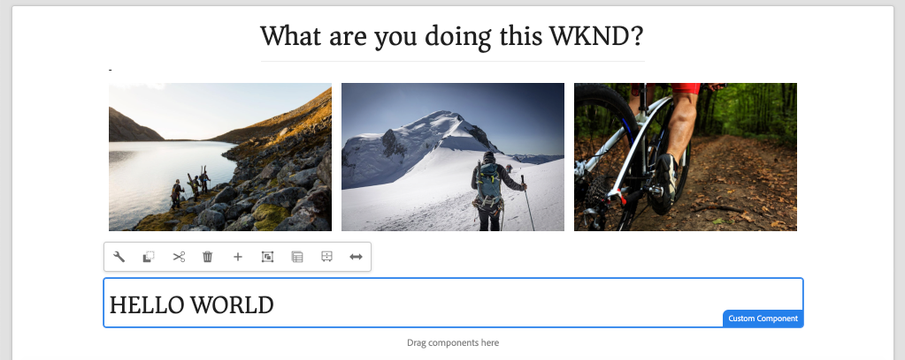

# Creare un componente personalizzato {#custom-component}

Scoprite come creare un componente personalizzato da utilizzare con l’editor SPA AEM. Scoprite come sviluppare finestre di dialogo degli autori e modelli Sling per estendere il modello JSON e compilare un componente personalizzato.

## Obiettivo

1. Comprendere il ruolo di Sling Models nella manipolazione dell&#39;API del modello JSON fornita da AEM.
2. Scopri come creare nuove finestre di dialogo AEM componente.
3. Scoprite come creare un componente **personalizzato** AEM compatibile con il framework dell&#39;editor SPA.

## Cosa verrà creato

Lo scopo dei capitoli precedenti era lo sviluppo SPA componenti e la mappatura su *componenti core* AEM esistenti. Questo capitolo sarà incentrato su come creare ed estendere *nuovi componenti* AEM e manipolare il modello JSON servito da AEM.

Un semplice `Custom Component` illustra i passaggi necessari per creare un nuovo componente AEM.



## Prerequisiti

Esaminare le istruzioni e gli strumenti necessari per configurare un ambiente di sviluppo locale [](overview.md#local-dev-environment).

### Ottenere il codice

1. Scarica il punto di partenza per questa esercitazione tramite Git:

   ```shell
   $ git clone git@github.com:adobe/aem-guides-wknd-spa.git
   $ cd aem-guides-wknd-spa
   $ git checkout React/custom-component-start
   ```

2. Distribuire la base di codice in un&#39;istanza AEM locale utilizzando Maven:

   ```shell
   $ mvn clean install -PautoInstallSinglePackage
   ```

   Se si utilizza [AEM 6.x](overview.md#compatibility) aggiungere il profilo `classic`:

   ```shell
   $ mvn clean install -PautoInstallSinglePackage -Pclassic
   ```

3. Installate il pacchetto finito per il tradizionale sito di riferimento [WKND](https://github.com/adobe/aem-guides-wknd/releases/latest). Le immagini fornite dal sito di riferimento [WKND](https://github.com/adobe/aem-guides-wknd/releases/latest) verranno riutilizzate sul SPA WKND. Il pacchetto può essere installato utilizzando [AEM Package Manager](http://localhost:4502/crx/packmgr/index.jsp).

   

È sempre possibile visualizzare il codice finito su [GitHub](https://github.com/adobe/aem-guides-wknd-spa/tree/React/custom-component-solution) o estrarre il codice localmente passando al ramo `React/custom-component-solution`.

## Definire il componente AEM

Un componente AEM è definito come un nodo e proprietà. Nel progetto questi nodi e proprietà sono rappresentati come file XML nel modulo `ui.apps`. Quindi, create il componente AEM nel modulo `ui.apps`.

>[!NOTE]
>
> Un aggiornamento rapido sulle [nozioni di base dei componenti AEM può essere utile](https://docs.adobe.com/content/help/en/experience-manager-learn/getting-started-wknd-tutorial-develop/component-basics.html).

1. Nell&#39;IDE di vostra scelta, aprite la cartella `ui.apps`.
2. Andate a `ui.apps/src/main/content/jcr_root/apps/wknd-spa-react/components` e create una nuova cartella denominata `custom-component`.
3. Create un nuovo file denominato `.content.xml` sotto la cartella `custom-component`. Compilate il file `custom-component/.content.xml` con i seguenti elementi:

   ```xml
   <?xml version="1.0" encoding="UTF-8"?>
   <jcr:root xmlns:sling="http://sling.apache.org/jcr/sling/1.0" xmlns:cq="http://www.day.com/jcr/cq/1.0" xmlns:jcr="http://www.jcp.org/jcr/1.0"
       jcr:primaryType="cq:Component"
       jcr:title="Custom Component"
       componentGroup="WKND SPA React - Content"/>
   ```

   

   `jcr:primaryType="cq:Component"` - identifica che questo nodo sarà un componente AEM.

   `jcr:title` è il valore che verrà visualizzato agli autori dei contenuti e  `componentGroup` determina il raggruppamento dei componenti nell’interfaccia utente di authoring.

4. Sotto la cartella `custom-component`, create un&#39;altra cartella denominata `_cq_dialog`.
5. Sotto la cartella `_cq_dialog` create un nuovo file denominato `.content.xml` e compilatelo con i seguenti elementi:

   ```xml
   <?xml version="1.0" encoding="UTF-8"?>
   <jcr:root xmlns:sling="http://sling.apache.org/jcr/sling/1.0" xmlns:granite="http://www.adobe.com/jcr/granite/1.0" xmlns:cq="http://www.day.com/jcr/cq/1.0" xmlns:jcr="http://www.jcp.org/jcr/1.0" xmlns:nt="http://www.jcp.org/jcr/nt/1.0"
       jcr:primaryType="nt:unstructured"
       jcr:title="Custom Component"
       sling:resourceType="cq/gui/components/authoring/dialog">
       <content
           jcr:primaryType="nt:unstructured"
           sling:resourceType="granite/ui/components/coral/foundation/container">
           <items jcr:primaryType="nt:unstructured">
               <tabs
                   jcr:primaryType="nt:unstructured"
                   sling:resourceType="granite/ui/components/coral/foundation/tabs"
                   maximized="{Boolean}true">
                   <items jcr:primaryType="nt:unstructured">
                       <properties
                           jcr:primaryType="nt:unstructured"
                           jcr:title="Properties"
                           sling:resourceType="granite/ui/components/coral/foundation/container"
                           margin="{Boolean}true">
                           <items jcr:primaryType="nt:unstructured">
                               <columns
                                   jcr:primaryType="nt:unstructured"
                                   sling:resourceType="granite/ui/components/coral/foundation/fixedcolumns"
                                   margin="{Boolean}true">
                                   <items jcr:primaryType="nt:unstructured">
                                       <column
                                           jcr:primaryType="nt:unstructured"
                                           sling:resourceType="granite/ui/components/coral/foundation/container">
                                           <items jcr:primaryType="nt:unstructured">
                                               <message
                                                   jcr:primaryType="nt:unstructured"
                                                   sling:resourceType="granite/ui/components/coral/foundation/form/textfield"
                                                   fieldDescription="The text to display on the component."
                                                   fieldLabel="Message"
                                                   name="./message"/>
                                           </items>
                                       </column>
                                   </items>
                               </columns>
                           </items>
                       </properties>
                   </items>
               </tabs>
           </items>
       </content>
   </jcr:root>
   ```

   

   Il file XML di cui sopra genera una finestra di dialogo molto semplice per `Custom Component`. La parte critica del file è il nodo interno `<message>`. Questa finestra di dialogo conterrà un `textfield` semplice denominato `Message` e persisterà il valore del campo di testo in una proprietà denominata `message`.

   Verrà creato un modello Sling accanto al quale esporre il valore della proprietà `message` tramite il modello JSON.

   >[!NOTE]
   >
   > Potete visualizzare molti altri [esempi di finestre di dialogo visualizzando le definizioni dei componenti core](https://github.com/adobe/aem-core-wcm-components/tree/master/content/src/content/jcr_root/apps/core/wcm/components). È inoltre possibile visualizzare altri campi modulo, come `select`, `textarea`, `pathfield`, disponibili sotto `/libs/granite/ui/components/coral/foundation/form` in [CRXDE-Lite](http://localhost:4502/crx/de/index.jsp#/libs/granite/ui/components/coral/foundation/form).

   Con un componente AEM tradizionale, in genere è richiesto uno script [HTL](https://docs.adobe.com/content/help/it-IT/experience-manager-htl/using/overview.html). Poiché il SPA eseguirà il rendering del componente, non è necessario alcuno script HTL.

## Creare il modello Sling

I modelli Sling sono Java &quot;POJO&quot; basati su annotazioni (Plain Old Java Objects) che semplificano la mappatura dei dati dalle JCR alle variabili Java. [Sling ](https://docs.adobe.com/content/help/en/experience-manager-learn/getting-started-wknd-tutorial-develop/component-basics.html#sling-models) Modelstomaticamente funzione per incorporare complesse logiche aziendali lato server per i componenti AEM.

Nel contesto dell&#39;Editor SPA, i modelli Sling espongono il contenuto di un componente attraverso il modello JSON attraverso una funzione che utilizza l&#39; [Esportatore modello Sling](https://docs.adobe.com/content/help/en/experience-manager-learn/foundation/development/develop-sling-model-exporter.html).

1. Nell&#39;IDE di vostra scelta, aprite il modulo `core`. `CustomComponent.java` e  `CustomComponentImpl.java` sono già stati creati e sovrapposti come parte del codice iniziale del capitolo.

   >[!NOTE]
   >
   > Se si utilizza Visual Studio Code IDE, potrebbe essere utile installare le estensioni [per Java](https://code.visualstudio.com/docs/java/extensions).

2. Aprite l&#39;interfaccia Java `CustomComponent.java` in `core/src/main/java/com/adobe/aem/guides/wknd/spa/react/core/models/CustomComponent.java`:

   

   Questa è l&#39;interfaccia Java che verrà implementata da Sling Model.

3. Aggiornare `CustomComponent.java` in modo che estenda l&#39;interfaccia `ComponentExporter`:

   ```java
   package com.adobe.aem.guides.wknd.spa.react.core.models;
   import com.adobe.cq.export.json.ComponentExporter;
   
   public interface CustomComponent extends ComponentExporter {
   
       public String getMessage();
   
   }
   ```

   L&#39;implementazione dell&#39;interfaccia `ComponentExporter` è un requisito affinché il modello Sling venga automaticamente rilevato dall&#39;API del modello JSON.

   L&#39;interfaccia `CustomComponent` include un singolo metodo getter `getMessage()`. Questo è il metodo che espone il valore della finestra di dialogo di authoring tramite il modello JSON. Solo i metodi getter pubblici con parametri vuoti `()` saranno esportati nel modello JSON.

4. Aprire `CustomComponentImpl.java` in `core/src/main/java/com/adobe/aem/guides/wknd/spa/react/core/models/impl/CustomComponentImpl.java`.

   Questa è l&#39;implementazione dell&#39;interfaccia `CustomComponent`. L&#39;annotazione `@Model` identifica la classe Java come modello Sling. L&#39;annotazione `@Exporter` consente di serializzare ed esportare la classe Java tramite Sling Model Exporter.

5. Aggiornate la variabile statica `RESOURCE_TYPE` per puntare al componente AEM `wknd-spa-react/components/custom-component` creato nell&#39;esercizio precedente.

   ```java
   static final String RESOURCE_TYPE = "wknd-spa-react/components/custom-component";
   ```

   Il tipo di risorsa del componente è il tipo di risorsa che associa il modello Sling al componente AEM e che verrà mappato sul componente React.

6. Aggiungete il metodo `getExportedType()` alla classe `CustomComponentImpl` per restituire il tipo di risorsa del componente:

   ```java
   @Override
   public String getExportedType() {
       return CustomComponentImpl.RESOURCE_TYPE;
   }
   ```

   Questo metodo è richiesto quando si implementa l&#39;interfaccia `ComponentExporter` e mostrerà il tipo di risorsa che consente la mappatura al componente React.

7. Aggiornate il metodo `getMessage()` per restituire il valore della proprietà `message` persistente nella finestra di dialogo dell&#39;autore. Utilizzate l&#39;annotazione `@ValueMap` per mappare il valore JCR `message` su una variabile Java:

   ```java
   import org.apache.commons.lang3.StringUtils;
   ...
   
   @ValueMapValue
   private String message;
   
   @Override
   public String getMessage() {
       return StringUtils.isNotBlank(message) ? message.toUpperCase() : null;
   }
   ```

   Per restituire il valore String del messaggio con tutte le lettere maiuscole, viene aggiunta una nuova &quot;business logic&quot;. Questo ci consentirà di vedere la differenza tra il valore non elaborato memorizzato nella finestra di dialogo dell’autore e il valore esposto nel modello Sling.

   >[!NOTE]
   >
   > È possibile visualizzare il [CustomComponentImpl.java completato qui](https://github.com/adobe/aem-guides-wknd-spa/blob/React/custom-component-solution/core/src/main/java/com/adobe/aem/guides/wknd/spa/react/core/models/impl/CustomComponentImpl.java).

## Aggiornamento del componente React

Il codice React per il componente personalizzato è già stato creato. Quindi, apportate qualche aggiornamento per mappare il componente React sul componente AEM.

1. Nel modulo `ui.frontend` aprire il file `ui.frontend/src/components/Custom/Custom.js`.
2. Osservare la variabile `{this.props.message}` come parte del metodo `render()`:

   ```js
   return (
           <div className="CustomComponent">
               <h2 className="CustomComponent__message">{this.props.message}</h2>
           </div>
       );
   ```

   È previsto che il valore maiuscolo trasformato dal modello Sling venga mappato su questa proprietà `message`.

3. Importa l&#39;oggetto `MapTo` dall&#39;SDK JS dell&#39;editor SPA AEM e lo utilizza per mappare il componente AEM:

   ```diff
   + import {MapTo} from '@adobe/aem-react-editable-components';
   
    ...
    export default class Custom extends Component {
        ...
    }
   
   + MapTo('wknd-spa-react/components/custom-component')(Custom, CustomEditConfig);
   ```

4. Distribuisci tutti gli aggiornamenti a un ambiente AEM locale dalla directory principale del progetto, utilizzando le tue competenze Maven:

   ```shell
   $ cd aem-guides-wknd-spa
   $ mvn clean install -PautoInstallSinglePackage
   ```

## Aggiornare i criteri dei modelli

Quindi, andate a AEM per verificare gli aggiornamenti e consentire l&#39;aggiunta di `Custom Component` al SPA.

1. Verificare la registrazione del nuovo modello Sling andando a [http://localhost:4502/system/console/status-slingmodels](http://localhost:4502/system/console/status-slingmodels).

   ```plain
   com.adobe.aem.guides.wknd.spa.react.core.models.impl.CustomComponentImpl - wknd-spa-react/components/custom-component
   
   com.adobe.aem.guides.wknd.spa.react.core.models.impl.CustomComponentImpl exports 'wknd-spa-react/components/custom-component' with selector 'model' and extension '[Ljava.lang.String;@6fb4a693' with exporter 'jackson'
   ```

   Vengono visualizzate le due righe sopra riportate che indicano che `CustomComponentImpl` è associato al componente `wknd-spa-react/components/custom-component` e che è registrato tramite Sling Model Exporter.

2. Andate al SPA Modello pagina in [http://localhost:4502/editor.html/conf/wknd-spa-react/settings/wcm/templates/spa-page-template/structure.html](http://localhost:4502/editor.html/conf/wknd-spa-react/settings/wcm/templates/spa-page-template/structure.html).
3. Aggiornate il criterio del Contenitore di layout per aggiungere il nuovo `Custom Component` come componente consentito:

   

   Salvate le modifiche al criterio e osservate il `Custom Component` come componente consentito:

   

## Creazione del componente personalizzato

Quindi, create il file `Custom Component` utilizzando l&#39;editor SPA AEM.

1. Andate a [http://localhost:4502/editor.html/content/wknd-spa-react/us/en/home.html](http://localhost:4502/editor.html/content/wknd-spa-react/us/en/home.html).
2. In modalità `Edit`, aggiungere la `Custom Component` alla `Layout Container`:

   

3. Aprite la finestra di dialogo del componente e inserite un messaggio contenente delle lettere minuscole.

   

   Si tratta della finestra di dialogo creata in base al file XML precedente nel capitolo.

4. Salva le modifiche. Osservate che il messaggio visualizzato è in tutte le maiuscole.

   

5. Visualizzare il modello JSON andando su [http://localhost:4502/content/wknd-spa-react/us/en.model.json](http://localhost:4502/content/wknd-spa-react/us/en.model.json). Cerca `wknd-spa-react/components/custom-component`:

   ```json
   "custom_component_208183317": {
       "message": "HELLO WORLD",
       ":type": "wknd-spa-react/components/custom-component"
   }
   ```

   Il valore JSON è impostato su tutte le lettere maiuscole in base alla logica aggiunta al modello Sling.

## Congratulazioni! {#congratulations}

Congratulazioni, hai imparato a creare un componente AEM personalizzato da usare con l’editor SPA. Hai anche imparato in che modo le finestre di dialogo, le proprietà JCR e i modelli Sling interagiscono per restituire il modello JSON.

È possibile visualizzare il codice finito su [GitHub](https://github.com/adobe/aem-guides-wknd-spa/tree/React/custom-component-solution) o estrarre il codice localmente passando al ramo `React/custom-component-solution`.

### Passaggi successivi {#next-steps}

[Estensione di un componente](extend-component.md)  di base - Scoprite come estendere un componente di base esistente da utilizzare con l&#39;editor SPA AEM. La comprensione di come aggiungere proprietà e contenuto a un componente esistente è una tecnica potente per espandere le capacità di un’implementazione di AEM SPA Editor.
